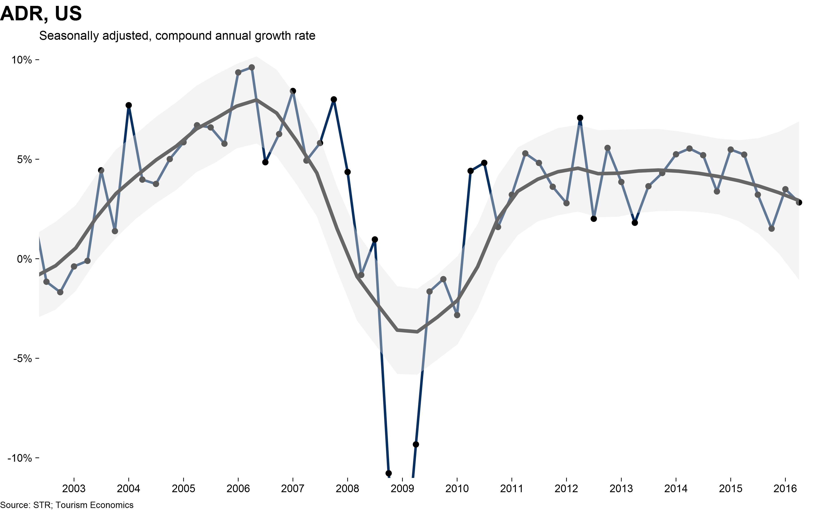
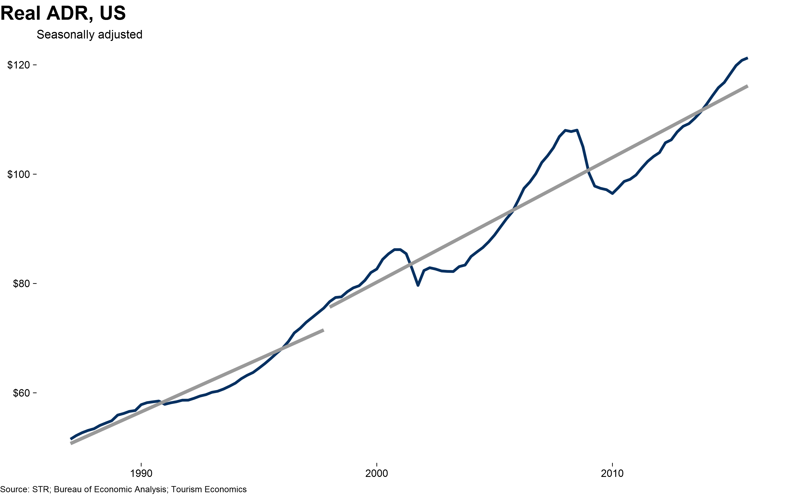
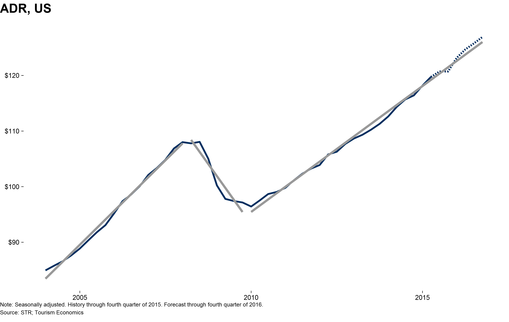
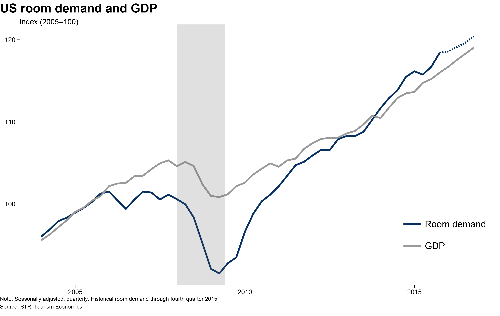
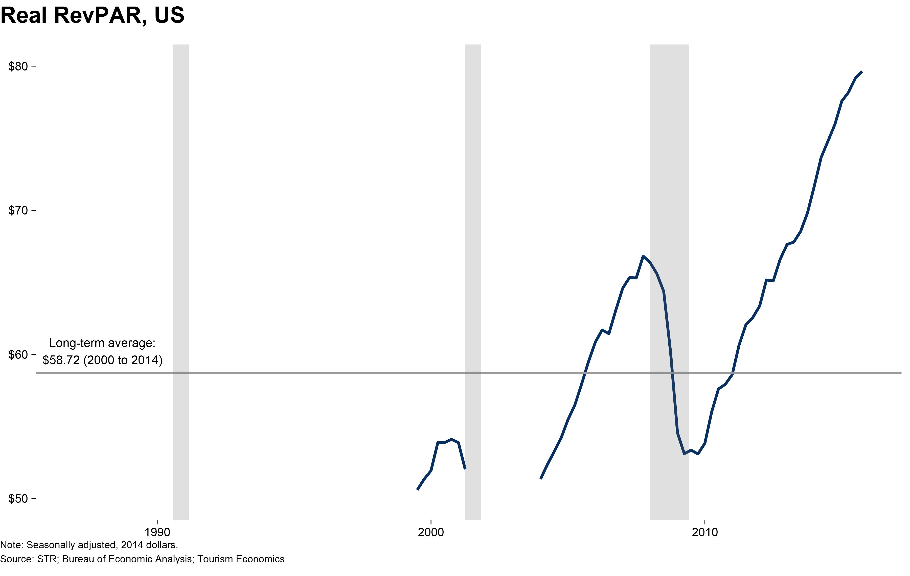
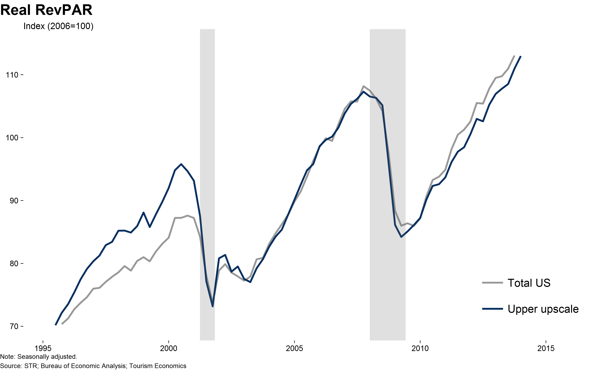
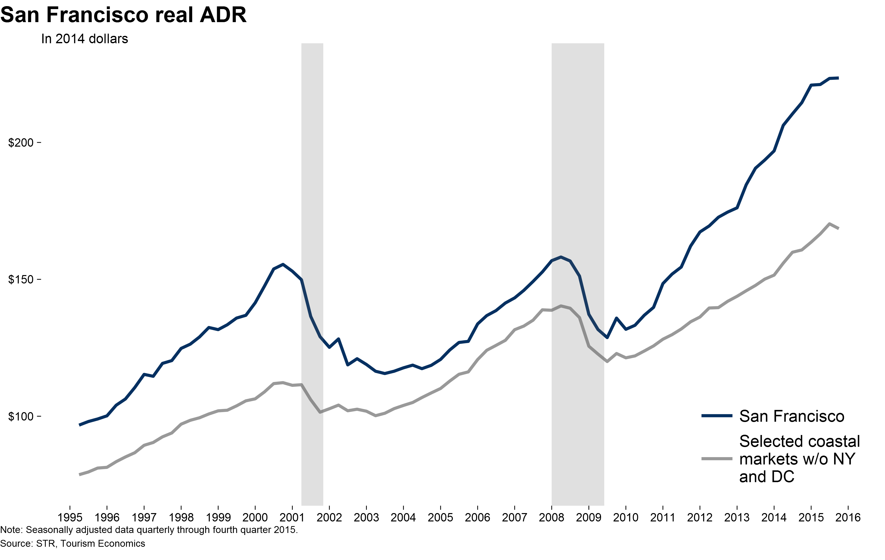
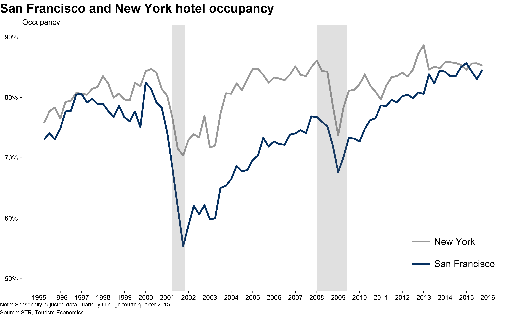
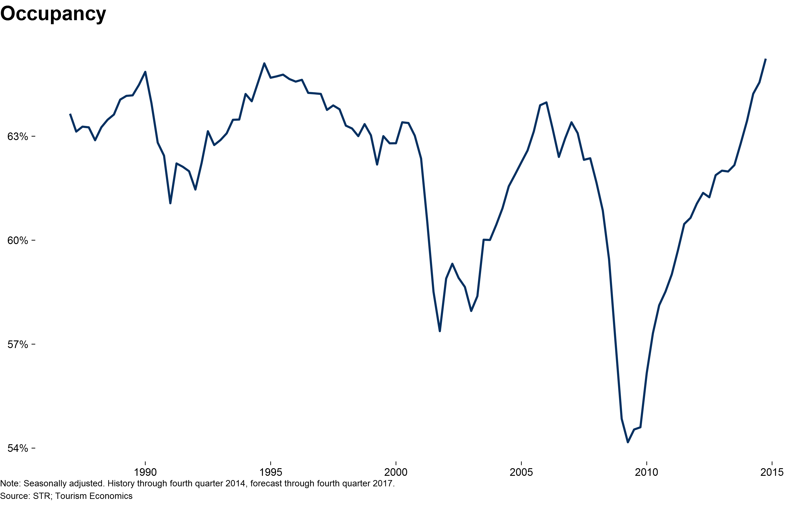
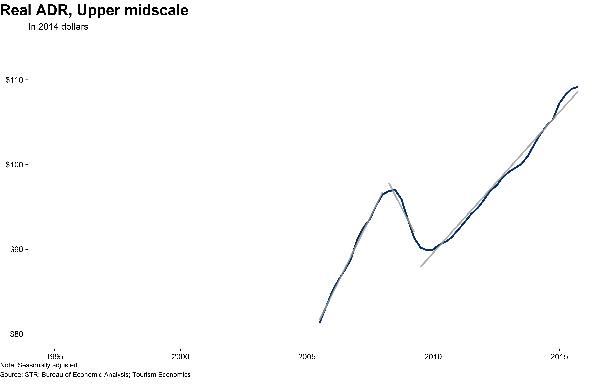

I added this file after seeing Hadley's suggestion to do this in an R markdown chunk.

* fig-adr_gr_cagr_st-1.png 
 * fig-adr_gr_st-1.png 
 * fig-adr_real_lt-1.png 
 * fig-adr_real_mt-1.png 
 * fig-adr_real_st-1.png 
 * fig-adr_st-1.png 
 * fig-adr_st_forecast-1.png 
 * fig-adr_st_monthly-1.png 
 * fig-demand_gdp_forecast-1.png 
 * fig-demand_monthly_gdp-1.png 
 * fig-demand_monthly_gdp-2.png 
 * fig-demand_ratio_emp-1.png 
 * fig-demand_ratio_pop-1.png 
 * fig-demand_ratio_pop-2.png 
 * fig-demand_ratio_pop_fcst-1.png 
 * fig-demand_ratio_pop_lnfcst-1.png 
 * fig-demand_ratio_pop_lnfcst-2.png 
 * fig-net_wealth_real-1.png 
 * fig-occupancy_forecast-1.png 
 * fig-occupancy_labled-1.png 
 * fig-revpar_real_lt-1.png 
 * fig-revpar_real_lt_fcst-1.png 
 * fig-revpar_real_lt_Scale-1.png 
 * fig-sanfrancisco_adr-1.png 
 * fig-sanfrancisco_adr_real_st-1.png 
 * fig-sanfrancisco_adr_real_st-2.png 
 * fig-sanfrancisco_demand-1.png 
 * fig-sanfrancisco_ny_occ-1.png 
 * fig-sanfrancisco_occ-1.png 
 * fig-sanfrancisco_supply-1.png 
 * fig-test_ggsave_1_R400dpi-occupancy_forecast.png 
 * fig-testR400dpi-occupancy_forecast.png 
 * fig-top25_demand-1.png 
 * fig-top25_supply-1.png 
 * fig-unemployment-1.png 
 * fig-upm_adr_real_st-1.png 
 * fig-upm_adr_real_st-2.png 
 * fig-upu_adr_real_st-1.png 
 * fig-upu_adr_real_st-2.png 
 * fig-us_adr_real_st-1.png 
 * fig-us_adr_real_st-2.png 
