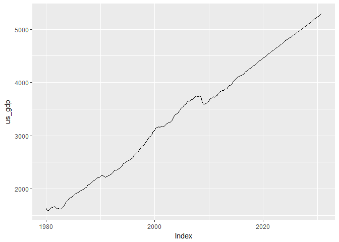
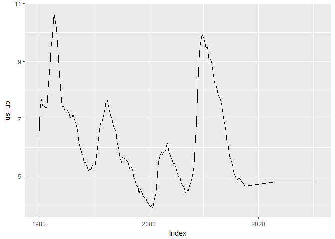

# load oef macro
Tourism Economics  


Setup

```r
library(arlodr, warn.conflicts=FALSE)
library(xts, warn.conflicts=FALSE)
library(dplyr, warn.conflicts=FALSE)
library(tidyr, warn.conflicts=FALSE)
library(quantmod, warn.conflicts=FALSE)
```

```
## Loading required package: TTR
```

```
## Version 0.4-0 included new data defaults. See ?getSymbols.
```


As an input, this expects a csv file. This csv file can be created using the
select file that I've set up and the OE macro model.
Also, I've modified it to pull FRED data using a quandl package.


```r
#sets up to later shorten data based on current date 
cur_year <- lubridate::year(Sys.time())
end_year <- cur_year +15
end_year <- round(end_year,-1)
end_date <- paste(end_year,"-10-01",sep="")
```


```r
fpath <- c("~/Project/R projects/lodfor/")

# when kniting from the button, I either needed the full path or to add "../" 
# in front of each
#load(paste(fpath, "output_data/ushist_m.Rdata", sep=""))

fname <- paste0(fpath, "/input_data/LODFOR_OEF_USMACRO_2016_11_15.csv")
#fname <- c("../input_data/LODFOR_OEF_USMACRO_2015_12_14.csv")
# the check.names piece fixes the issueof the column names coming in with
# quotes and spaces due to the Oxford file format that is visible when 
# you open the csv file in notepad
temp <- read.csv(fname, header=TRUE, sep=",", check.names=FALSE, stringsAsFactors=FALSE) 
# puts column names into lower case
names(temp) <- tolower(names(temp))
# trims leading and trailing whitespace
names(temp) <- stringr::str_trim(names(temp))
colnames(temp)
```

```
##  [1] "dates"      "us_ipnr"    "us_if"      "us_gdp"     "us_rlg"    
##  [6] "us_psh"     "us_smp"     "us_rrx"     "us_c"       "us_cd"     
## [11] "us_cnd"     "us_domd"    "us_inrs"    "us_ipde"    "us_iprd"   
## [16] "us_gc"      "us_rcorp"   "us_iconstr" "us_popnipa" "us_pop"    
## [21] "us_popw"    "us_et"      "us_yhat"    "us_wc"      "us_cpi"    
## [26] "us_pc"      "us_pgdp"    "us_eci"     "us_pedy"    "us_penwall"
## [31] "us_cogtp"   "us_conw"    "us_up"      "us_ph"      "us_phcs"   
## [36] "us_hst"     "us_nairu"   "us_g"       "us_gs"      "us_x"      
## [41] "us_m"       "us_gfnc"    "us_gf"      "wd_wpo_wti" "wd_gdp"    
## [46] "wd_gdp$"    "wd_gdpppp"  "wd_gdp$&"   "al_rxd"     "al_pc"     
## [51] "al_gdp$"    "bz_rxd"     "bz_cpi"     "bz_gdp$"    "bz_gdp$sa" 
## [56] "ca_rrx"     "ca_rxd"     "ca_pc"      "ca_gdp$"    "ca_gdp"    
## [61] "ca_cpi"     "cn_rrx"     "cn_rxd"     "cn_pc"      "cn_gdp$"   
## [66] "cn_gdp$sa"  "ep_rxd"     "ep_gdp$"    "eu_rrx"     "eu_rxd"    
## [71] "eu_pc"      "eu_gdp$"    "in_rxd"     "in_pc"      "in_gdp$"   
## [76] "in_gdp$sa"  "jp_rrx"     "jp_rxd"     "jp_pc"      "jp_gdp$"   
## [81] "ko_rrx"     "ko_rxd"     "ko_pc"      "ko_gdp$"    "mx_rrx"    
## [86] "mx_rxd"     "mx_pc"      "mx_gdp$"    "mx_gdp"     "mx_cpi"    
## [91] "ru_rrx"     "ru_rxd"     "ru_cpi"     "ru_gdp$"    "ru_gdp$sa" 
## [96] "uk_rrx"     "uk_rxd"     "uk_pc"      "uk_gdp$"
```

```r
# changes $ and & in the wd_gdp$& column name
col_temp <- colnames(temp) %>%
  gsub("\\$&", "nusd", .)
colnames(temp) <- col_temp
colnames(temp)
```

```
##  [1] "dates"      "us_ipnr"    "us_if"      "us_gdp"     "us_rlg"    
##  [6] "us_psh"     "us_smp"     "us_rrx"     "us_c"       "us_cd"     
## [11] "us_cnd"     "us_domd"    "us_inrs"    "us_ipde"    "us_iprd"   
## [16] "us_gc"      "us_rcorp"   "us_iconstr" "us_popnipa" "us_pop"    
## [21] "us_popw"    "us_et"      "us_yhat"    "us_wc"      "us_cpi"    
## [26] "us_pc"      "us_pgdp"    "us_eci"     "us_pedy"    "us_penwall"
## [31] "us_cogtp"   "us_conw"    "us_up"      "us_ph"      "us_phcs"   
## [36] "us_hst"     "us_nairu"   "us_g"       "us_gs"      "us_x"      
## [41] "us_m"       "us_gfnc"    "us_gf"      "wd_wpo_wti" "wd_gdp"    
## [46] "wd_gdp$"    "wd_gdpppp"  "wd_gdpnusd" "al_rxd"     "al_pc"     
## [51] "al_gdp$"    "bz_rxd"     "bz_cpi"     "bz_gdp$"    "bz_gdp$sa" 
## [56] "ca_rrx"     "ca_rxd"     "ca_pc"      "ca_gdp$"    "ca_gdp"    
## [61] "ca_cpi"     "cn_rrx"     "cn_rxd"     "cn_pc"      "cn_gdp$"   
## [66] "cn_gdp$sa"  "ep_rxd"     "ep_gdp$"    "eu_rrx"     "eu_rxd"    
## [71] "eu_pc"      "eu_gdp$"    "in_rxd"     "in_pc"      "in_gdp$"   
## [76] "in_gdp$sa"  "jp_rrx"     "jp_rxd"     "jp_pc"      "jp_gdp$"   
## [81] "ko_rrx"     "ko_rxd"     "ko_pc"      "ko_gdp$"    "mx_rrx"    
## [86] "mx_rxd"     "mx_pc"      "mx_gdp$"    "mx_gdp"     "mx_cpi"    
## [91] "ru_rrx"     "ru_rxd"     "ru_cpi"     "ru_gdp$"    "ru_gdp$sa" 
## [96] "uk_rrx"     "uk_rxd"     "uk_pc"      "uk_gdp$"
```

```r
# works on the date column to get into a date format
# more difficult than I would have liked
temp <- temp %>%
  rename(date = dates) %>%
  mutate(date = gsub("01$", "-01-01", date)) %>%
  mutate(date = gsub("02$", "-04-01", date)) %>%
  mutate(date = gsub("03$", "-07-01", date)) %>%
  mutate(date = gsub("04$", "-10-01", date)) %>%
  mutate(date = as.Date(date))

temp_2 <- temp %>%
  gather(geovar, value, -date) %>%
  mutate(geovar = as.character(geovar)) %>%
  # I think this separates on the first occurance of the underscore, 
  # not all occurances
  separate(geovar, c("geo", "variable"), sep = "\\_", extra="merge") 

oe_usmac_q <- temp_2 %>%
  # renames "if" to "ifix" because r doesn't like "if" as a variable name
  mutate(variable = ifelse(variable == "if", "ifix", variable)) %>%
  # also, I didn't like wpo_wti as a variable name, because it has the 
  # underscore, which is distracting, and may cause trouble
  mutate(variable = ifelse(variable == "wpo_wti", "wpowti", variable)) %>%
  # changes codes for canada, mexico and japan
  mutate(geo = ifelse(geo == "ca", "can", geo)) %>%
  mutate(geo = ifelse(geo == "mx", "mex", geo)) %>%
  # recombine the geo and var
  mutate(geovar = as.character(paste(geo, variable, sep="_"))) %>%
  select(-geo, -variable) %>%
  spread(geovar, value) %>%
  data.frame() %>%
  read.zoo(regular=TRUE, drop=FALSE) %>%
  xts(frequency=4)

# shortens data based on end date established at start of script
oe_usmac_q <- window(oe_usmac_q, end = end_date)
```

###A few plots
<!-- -->

```
## An 'xts' object on 1980-01-01/2030-10-01 containing:
##   Data: num [1:204, 1:98] 118651 118993 119676 121724 122193 ...
##  - attr(*, "dimnames")=List of 2
##   ..$ : NULL
##   ..$ : chr [1:98] "al_gdp." "al_pc" "al_rxd" "bz_cpi" ...
##   Indexed by objects of class: [Date] TZ: UTC
##   xts Attributes:  
##  NULL
```

```
## 'data.frame':	25872 obs. of  4 variables:
##  $ date    : Date, format: "1980-01-01" "1980-04-01" ...
##  $ geo     : chr  "us" "us" "us" "us" ...
##  $ variable: chr  "ipnr" "ipnr" "ipnr" "ipnr" ...
##  $ value   : num  150 143 144 147 150 ...
```

```
## 'data.frame':	264 obs. of  99 variables:
##  $ date      : Date, format: "1980-01-01" "1980-04-01" ...
##  $ us_ipnr   : num  150 143 144 147 150 ...
##  $ us_if     : num  309 287 288 297 301 ...
##  $ us_gdp    : num  1631 1598 1596 1625 1659 ...
##  $ us_rlg    : num  12 10.5 11 12.4 13 ...
##  $ us_psh    : num  1132 1099 1269 1386 1363 ...
##  $ us_smp    : num  110 108 123 133 132 ...
##  $ us_rrx    : num  105 105 102 104 107 ...
##  $ us_c      : num  1006 984 994 1007 1013 ...
##  $ us_cd     : num  59.8 53.3 55.6 57.4 59 ...
##  $ us_cnd    : num  984 975 980 991 993 ...
##  $ us_domd   : num  1634 1586 1572 1611 1648 ...
##  $ us_inrs   : num  111 109 109 112 112 ...
##  $ us_ipde   : num  55.5 51.6 52 52.7 54.2 ...
##  $ us_iprd   : num  93.2 76 78.3 85.6 83.5 ...
##  $ us_gc     : num  335 341 337 336 339 ...
##  $ us_rcorp  : num  0.001 0.001 0.001 0.001 0.001 ...
##  $ us_iconstr: num  198 177 180 191 189 ...
##  $ us_popnipa: num  226754 227389 228070 228689 229155 ...
##  $ us_pop    : num  226263 226962 227574 228100 228629 ...
##  $ us_popw   : num  166762 167416 168111 168694 169279 ...
##  $ us_et     : num  99862 98953 98899 99499 100239 ...
##  $ us_yhat   : num  1634 1643 1652 1661 1670 ...
##  $ us_wc     : num  50.6 52.5 53.5 54.3 54.6 ...
##  $ us_cpi    : num  79 81.7 83.2 85.6 87.9 ...
##  $ us_pc     : num  42.4 43.4 44.4 45.5 46.7 ...
##  $ us_pgdp   : num  42.9 43.8 44.8 46 47.2 ...
##  $ us_eci    : num  0.001 0.001 0.001 0.001 0.001 0.001 0.001 0.001 39.8 40.4 ...
##  $ us_pedy   : num  1147 1131 1145 1167 1164 ...
##  $ us_penwall: num  9239 9582 9985 10326 10522 ...
##  $ us_cogtp  : num  59.4 51.8 53.6 58.8 61.1 ...
##  $ us_conw   : num  -811 -831 -827 -836 -868 ...
##  $ us_up     : num  6.3 7.33 7.67 7.4 7.43 ...
##  $ us_ph     : num  60 61 62.7 62.9 63.2 ...
##  $ us_phcs   : num  43.9 44.7 45.5 46.2 46.9 ...
##  $ us_hst    : num  312 264 348 376 342 ...
##  $ us_nairu  : num  7.08 7.28 7.49 7.69 7.86 ...
##  $ us_g      : num  405 406 400 400 406 ...
##  $ us_gs     : num  249 246 242 241 243 ...
##  $ us_x      : num  92.9 94.7 94.5 93.9 95.7 ...
##  $ us_m      : num  100 92.8 86.1 90.7 94.6 ...
##  $ us_gfnc   : num  39.4 43.1 40.4 39.9 40.8 ...
##  $ us_gf     : num  157 161 158 159 162 ...
##  $ wd_wpo_wti: num  35.8 39.5 37.8 36.3 38 ...
##  $ wd_gdp    : num  6963680 6926800 6962380 7023420 7066390 ...
##  $ wd_gdp$   : num  7009420 6972300 7008110 7069560 7112810 ...
##  $ wd_gdpppp : num  7262190 7222680 7252590 7304720 7368190 ...
##  $ wd_gdpnusd: num  2755400 2770730 2786360 2802280 2828010 ...
##  $ al_rxd    : num  0.907 0.889 0.86 0.853 0.855 0.872 0.875 0.876 0.92 0.955 ...
##  $ al_pc     : num  26 26.6 27.2 27.8 28.5 ...
##  $ al_gdp$   : num  118651 118993 119676 121724 122193 ...
##  $ bz_rxd    : num  1.64e-11 1.81e-11 1.99e-11 2.23e-11 2.57e-11 ...
##  $ bz_cpi    : num  9.28e-10 8.03e-10 1.10e-09 1.31e-09 1.87e-09 ...
##  $ bz_gdp$   : num  238632 247045 275506 252617 235950 ...
##  $ bz_gdp$sa : num  253643 245677 265265 254817 250792 ...
##  $ ca_rrx    : num  92.1 90.7 91.2 90.3 91.8 ...
##  $ ca_rxd    : num  1.16 1.17 1.16 1.18 1.19 ...
##  $ ca_pc     : num  40.5 41.6 42.7 44 45.5 ...
##  $ ca_gdp$   : num  195050 194625 194557 196742 201657 ...
##  $ ca_gdp    : num  192198 191779 191712 193866 198708 ...
##  $ ca_cpi    : num  42.3 43.4 44.6 45.9 47.4 ...
##  $ cn_rrx    : num  279 274 271 259 248 ...
##  $ cn_rxd    : num  1.52 1.5 1.46 1.51 1.6 ...
##  $ cn_pc     : num  20.6 20.6 20.6 20.6 21.1 ...
##  $ cn_gdp$   : num  67785 80845 90461 102829 71242 ...
##  $ cn_gdp$sa : num  82734 84442 86069 87829 86760 ...
##  $ ep_rxd    : num  1.41 1.39 1.42 1.34 1.23 ...
##  $ ep_gdp$   : num  2355920 2339790 2339850 2343530 2336030 ...
##  $ eu_rrx    : num  0.001 0.001 0.001 0.001 0.001 0.001 0.001 0.001 0.001 0.001 ...
##  $ eu_rxd    : num  1.41 1.39 1.42 1.34 1.23 ...
##  $ eu_pc     : num  35.5 36.5 37.3 38.4 39.4 ...
##  $ eu_gdp$   : num  1806750 1798270 1797240 1798090 1799820 ...
##  $ in_rxd    : num  8.04 7.93 7.77 7.81 8.14 ...
##  $ in_pc     : num  10.4 11.4 11.9 11.8 11.7 ...
##  $ in_gdp$   : num  68787 65547 58965 72463 73719 ...
##  $ in_gdp$sa : num  64201 66819 66558 68374 68764 ...
##  $ jp_rrx    : num  76.7 81 83.3 87.8 90.9 ...
##  $ jp_rxd    : num  244 232 220 211 206 ...
##  $ jp_pc     : num  81.5 83.3 84.4 85.1 86.1 ...
##  $ jp_gdp$   : num  710606 707236 723996 740228 746223 ...
##  $ ko_rrx    : num  133 132 128 125 128 ...
##  $ ko_rxd    : num  572 594 613 652 667 ...
##  $ ko_pc     : num  19.8 20.8 22.2 23.6 24.3 ...
##  $ ko_gdp$   : num  35302 35093 35771 34837 36266 ...
##  $ mx_rrx    : num  112 117 121 124 127 ...
##  $ mx_rxd    : num  0.0229 0.023 0.0231 0.0232 0.0236 ...
##  $ mx_pc     : num  0.0872 0.0936 0.1038 0.106 0.1115 ...
##  $ mx_gdp$   : num  127702 128535 131310 135112 138129 ...
##  $ mx_gdp    : num  1492 1502 1534 1578 1614 ...
##  $ mx_cpi    : num  0.101 0.107 0.114 0.12 0.129 ...
##  $ ru_rrx    : num  48.8 48.8 48.8 48.8 48.8 ...
##  $ ru_rxd    : num  0.021 0.021 0.021 0.021 0.021 ...
##  $ ru_cpi    : num  0.00397 0.00397 0.00397 0.00397 0.00397 ...
##  $ ru_gdp$   : num  306342 308825 293634 322169 316198 ...
##  $ ru_gdp$sa : num  326878 330629 333541 335613 337395 ...
##  $ uk_rrx    : num  130 134 138 144 149 ...
##  $ uk_rxd    : num  2.25 2.29 2.38 2.39 2.31 ...
##  $ uk_pc     : num  31.7 32.9 33.6 35 35.9 ...
##  $ uk_gdp$   : num  312676 306492 306067 302828 302334 ...
```

<!-- --><!-- --><!-- --><!-- --><!-- -->

```
##             us_gdp  us_gdp_cagr
## 2013-01-01 3872.98  0.028282110
## 2013-04-01 3880.40  0.007685400
## 2013-07-01 3910.32  0.031200733
## 2013-10-01 3948.48  0.039610299
## 2014-01-01 3936.75 -0.011830206
## 2014-04-01 3975.20  0.039643854
## 2014-07-01 4023.62  0.049619518
## 2014-10-01 4046.68  0.023122461
## 2015-01-01 4067.25  0.020488275
## 2015-04-01 4093.55  0.026117103
## 2015-07-01 4113.73  0.019865118
## 2015-10-01 4122.67  0.008721219
```

###Load FRED data

```
##     As of 0.4-0, 'getSymbols' uses env=parent.frame() and
##  auto.assign=TRUE by default.
## 
##  This  behavior  will be  phased out in 0.5-0  when the call  will
##  default to use auto.assign=FALSE. getOption("getSymbols.env") and 
##  getOptions("getSymbols.auto.assign") are now checked for alternate defaults
## 
##  This message is shown once per session and may be disabled by setting 
##  options("getSymbols.warning4.0"=FALSE). See ?getSymbols for more details.
```

```
## [1] "FEDFUNDS" "GDPPOT"   "USRECQ"
```

```
## Warning: Removed 66 rows containing missing values (geom_path).
```

<!-- -->

###Writing out files

```r
# writes csv versions of the output files
write.zoo(oe_usmac_q, file=paste(fpath,"output_data/oe_usmac_q.csv", sep=""))
# saves Rdata versions of the output files
save(oe_usmac_q, file=paste(fpath,"output_data/oe_usmac_q.Rdata", sep=""))
```

