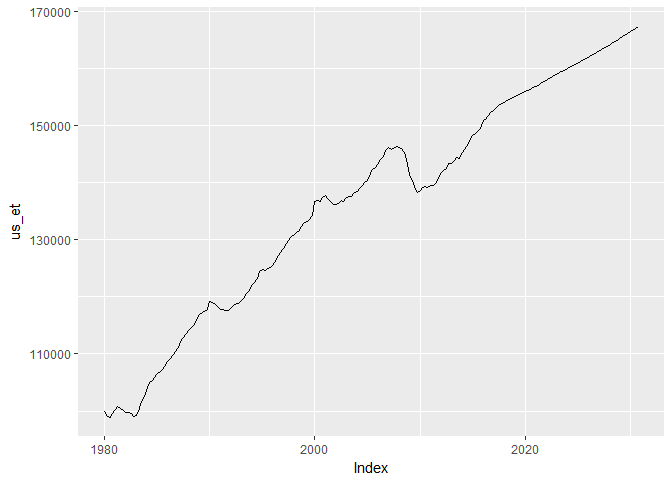
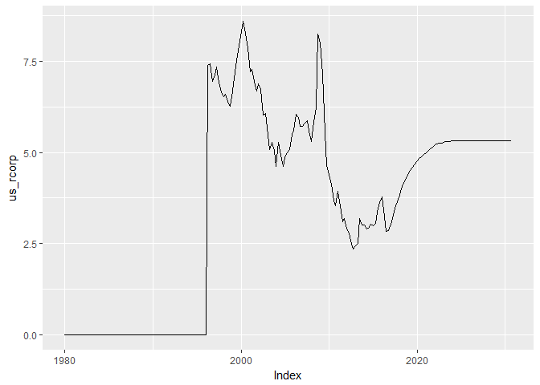
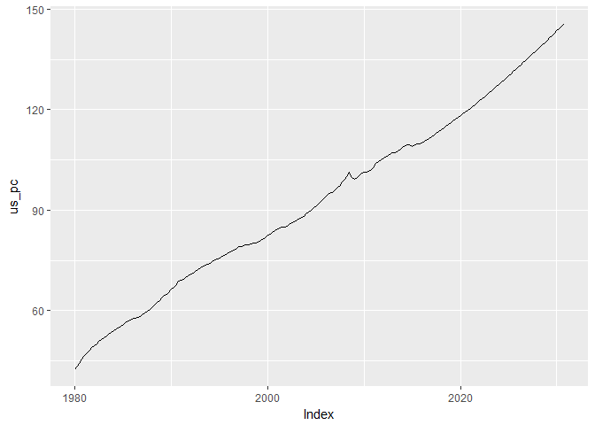
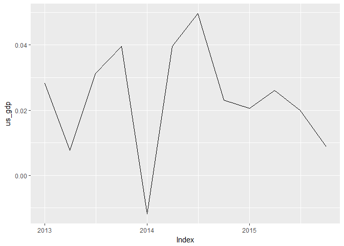
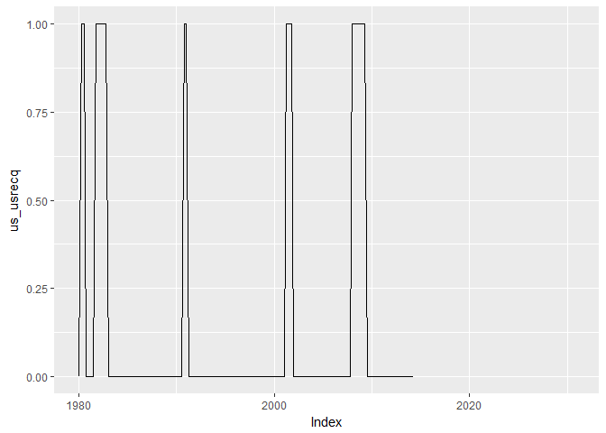

# load oef macro
Tourism Economics  
Wednesday, October 15, 2014  


Setup

```r
#read_chunk('~/Project/R projects/lodfor/scripts/functions.R')
#source('~/Project/R projects/lodfor/scripts/functions_combined.R')
#setwd("./output_data/")
library(arlodr, warn.conflicts=FALSE)
library(xts, warn.conflicts=FALSE)
library(dplyr, warn.conflicts=FALSE)
library(tidyr, warn.conflicts=FALSE)
```


As an input, this expects a csv file. This csv file can be created using the
select file that I've set up and the OE macro model.
Also, I've modified it to pull FRED data using a quandl package.


```r
#sets up to later shorten data based on current date 
cur_year <- lubridate::year(Sys.time())
end_year <- cur_year +15
end_year <- round(end_year,-1)
end_date <- paste(end_year,"-10-01",sep="")
```


```r
if (!require(quantmod)) {
  install.packages("quantmod")
  require(quantmod)
}
```

```
## Loading required package: quantmod
## Loading required package: TTR
## Version 0.4-0 included new data defaults. See ?getSymbols.
```

```r
fpath <- c("~/Project/R projects/lodfor/")

# when kniting from the button, I either needed the full path or to add "../" 
# in front of each
#load(paste(fpath, "output_data/ushist_m.Rdata", sep=""))

fname <- paste0(fpath, "/input_data/LODFOR_OEF_USMACRO_2016_01_14.csv")
#fname <- c("../input_data/LODFOR_OEF_USMACRO_2015_12_14.csv")
# the check.names piece fixes the issueof the column names coming in with
# quotes and spaces due to the Oxford file format that is visible when 
# you open the csv file in notepad
temp <- read.csv(fname, header=TRUE, sep=",", check.names=FALSE, stringsAsFactors=FALSE) 
# puts column names into lower case
names(temp) <- tolower(names(temp))
# trims leading and trailing whitespace
names(temp) <- stringr::str_trim(names(temp))
colnames(temp)
```

```
##  [1] "dates"      "us_ipnr"    "us_if"      "us_gdp"     "us_rlg"    
##  [6] "us_psh"     "us_smp"     "us_rrx"     "us_cd"      "us_domd"   
## [11] "us_inrs"    "us_ipde"    "us_rcorp"   "us_iconstr" "us_popnipa"
## [16] "us_pop"     "us_popw"    "us_et"      "us_yhat"    "us_wc"     
## [21] "us_cpi"     "us_pc"      "us_pgdp"    "us_eci"     "us_pedy"   
## [26] "us_penwall" "us_cogtp"   "us_conw"    "us_up"      "mx_gdp"    
## [31] "mx_cpi"     "mx_pc"      "ca_gdp"     "ca_cpi"     "ca_pc"     
## [36] "us_gfnc"    "us_gf"      "wd_wpo_wti" "jp_rxd"     "wd_gdp"    
## [41] "wd_gdpppp"  "wd_gdp$&"
```

```r
# changes $ and & in the wd_gdp$& column name
col_temp <- colnames(temp) %>%
  gsub("\\$&", "nusd", .)
colnames(temp) <- col_temp

# works on the date column to get into a date format
# more difficult than I would have liked
temp <- temp %>%
  rename(date = dates) %>%
  mutate(date = gsub("01$", "-01-01", date)) %>%
  mutate(date = gsub("02$", "-04-01", date)) %>%
  mutate(date = gsub("03$", "-07-01", date)) %>%
  mutate(date = gsub("04$", "-10-01", date)) %>%
  mutate(date = as.Date(date))

temp_2 <- temp %>%
  gather(geovar, value, -date) %>%
  mutate(geovar = as.character(geovar)) %>%
  # I think this separates on the first occurance of the underscore, 
  # not all occurances
  separate(geovar, c("geo", "variable"), sep = "\\_", extra="merge") 

oe_usmac_q <- temp_2 %>%
  # renames "if" to "ifix" because r doesn't like "if" as a variable name
  mutate(variable = ifelse(variable == "if", "ifix", variable)) %>%
  # also, I didn't like wpo_wti as a variable name, because it has the 
  # underscore, which is distracting, and may cause trouble
  mutate(variable = ifelse(variable == "wpo_wti", "wpowti", variable)) %>%
  # changes codes for canada, mexico and japan
  mutate(geo = ifelse(geo == "ca", "can", geo)) %>%
  mutate(geo = ifelse(geo == "mx", "mex", geo)) %>%
  # recombine the geo and var
  mutate(geovar = as.character(paste(geo, variable, sep="_"))) %>%
  select(-geo, -variable) %>%
  spread(geovar, value) %>%
  data.frame() %>%
  read.zoo(regular=TRUE, drop=FALSE) %>%
  xts(frequency=4)

# shortens data based on end date established at start of script
oe_usmac_q <- window(oe_usmac_q, end = end_date)
```

###A few plots
 

```
## An 'xts' object on 1980-01-01/2030-10-01 containing:
##   Data: num [1:204, 1:41] 42.3 43.4 44.6 45.9 47.4 ...
##  - attr(*, "dimnames")=List of 2
##   ..$ : NULL
##   ..$ : chr [1:41] "can_cpi" "can_gdp" "can_pc" "jp_rxd" ...
##   Indexed by objects of class: [Date] TZ: UTC
##   xts Attributes:  
##  NULL
```

```
## 'data.frame':	10004 obs. of  4 variables:
##  $ date    : Date, format: "1980-01-01" "1980-04-01" ...
##  $ geo     : chr  "us" "us" "us" "us" ...
##  $ variable: chr  "ipnr" "ipnr" "ipnr" "ipnr" ...
##  $ value   : num  150 143 144 147 150 ...
```

```
## 'data.frame':	244 obs. of  42 variables:
##  $ date      : Date, format: "1980-01-01" "1980-04-01" ...
##  $ us_ipnr   : num  150 143 144 147 150 ...
##  $ us_if     : num  309 287 288 297 301 ...
##  $ us_gdp    : num  1631 1598 1596 1625 1659 ...
##  $ us_rlg    : num  12 10.5 11 12.4 13 ...
##  $ us_psh    : num  1132 1099 1269 1386 1363 ...
##  $ us_smp    : num  110 108 123 133 132 ...
##  $ us_rrx    : num  105 105 101 103 107 ...
##  $ us_cd     : num  59.8 53.3 55.6 57.4 59 ...
##  $ us_domd   : num  1634 1586 1572 1611 1648 ...
##  $ us_inrs   : num  111 109 109 112 112 ...
##  $ us_ipde   : num  55.5 51.6 52 52.7 54.2 ...
##  $ us_rcorp  : num  0.001 0.001 0.001 0.001 0.001 0.001 0.001 0.001 0.001 0.001 ...
##  $ us_iconstr: num  198 177 180 191 189 ...
##  $ us_popnipa: num  226754 227389 228070 228689 229155 ...
##  $ us_pop    : num  226263 226962 227574 228100 228629 ...
##  $ us_popw   : num  166762 167416 168111 168694 169279 ...
##  $ us_et     : num  99862 98953 98899 99499 100239 ...
##  $ us_yhat   : num  1641 1650 1659 1667 1676 ...
##  $ us_wc     : num  50.6 52.5 53.5 54.3 54.6 ...
##  $ us_cpi    : num  79 81.7 83.2 85.6 87.9 ...
##  $ us_pc     : num  42.4 43.4 44.4 45.5 46.7 ...
##  $ us_pgdp   : num  42.9 43.8 44.8 46 47.2 ...
##  $ us_eci    : num  0.001 0.001 0.001 0.001 0.001 0.001 0.001 0.001 39.8 40.4 ...
##  $ us_pedy   : num  1147 1131 1145 1167 1164 ...
##  $ us_penwall: num  9239 9582 9985 10327 10522 ...
##  $ us_cogtp  : num  59.4 51.8 53.6 58.8 61.1 ...
##  $ us_conw   : num  -811 -831 -827 -836 -868 ...
##  $ us_up     : num  6.3 7.33 7.67 7.4 7.43 ...
##  $ mx_gdp    : num  1492 1502 1534 1578 1614 ...
##  $ mx_cpi    : num  0.101 0.107 0.114 0.12 0.129 ...
##  $ mx_pc     : num  0.0872 0.0936 0.1038 0.106 0.1115 ...
##  $ ca_gdp    : num  192198 191779 191712 193866 198708 ...
##  $ ca_cpi    : num  42.3 43.4 44.6 45.9 47.4 ...
##  $ ca_pc     : num  40.5 41.6 42.7 44 45.5 ...
##  $ us_gfnc   : num  39.4 43.1 40.4 39.9 40.8 ...
##  $ us_gf     : num  157 161 158 159 162 ...
##  $ wd_wpo_wti: num  35.8 39.5 37.8 36.3 38 ...
##  $ jp_rxd    : num  244 232 220 211 206 ...
##  $ wd_gdp    : num  6993780 6963350 7005310 7071400 7124310 ...
##  $ wd_gdpppp : num  7461790 7426430 7459940 7512830 7584170 ...
##  $ wd_gdpnusd: num  2763640 2777270 2791130 2805220 2828700 ...
```

     

```
##             us_gdp  us_gdp_cagr
## 2013-01-01 3864.30  0.019094840
## 2013-04-01 3875.05  0.011174020
## 2013-07-01 3903.60  0.029797883
## 2013-10-01 3940.38  0.038224294
## 2014-01-01 3931.23 -0.009256141
## 2014-04-01 3975.38  0.045684765
## 2014-07-01 4017.20  0.042747656
## 2014-10-01 4037.85  0.020720671
## 2015-01-01 4044.32  0.006424773
## 2015-04-01 4083.40  0.039215590
## 2015-07-01 4103.50  0.019835330
## 2015-10-01 4110.66  0.006997696
```

###Load FRED data

```
##     As of 0.4-0, 'getSymbols' uses env=parent.frame() and
##  auto.assign=TRUE by default.
## 
##  This  behavior  will be  phased out in 0.5-0  when the call  will
##  default to use auto.assign=FALSE. getOption("getSymbols.env") and 
##  getOptions("getSymbols.auto.assign") are now checked for alternate defaults
## 
##  This message is shown once per session and may be disabled by setting 
##  options("getSymbols.warning4.0"=FALSE). See ?getSymbols for more details.
```

```
## Warning in download.file(url, destfile, method, quiet, mode, cacheOK,
## extra): downloaded length 12619 != reported length 200
```

```
## Warning in download.file(url, destfile, method, quiet, mode, cacheOK,
## extra): downloaded length 5991 != reported length 200
```

```
## Warning in download.file(url, destfile, method, quiet, mode, cacheOK,
## extra): downloaded length 8958 != reported length 200
```

```
## [1] "FEDFUNDS" "GDPPOT"   "USRECQ"
```

```
## Warning: Removed 66 rows containing missing values (geom_path).
```

 

###Writing out files

```r
# writes csv versions of the output files
write.zoo(oe_usmac_q, file=paste(fpath,"output_data/oe_usmac_q.csv", sep=""))
# saves Rdata versions of the output files
save(oe_usmac_q, file=paste(fpath,"output_data/oe_usmac_q.Rdata", sep=""))
```

