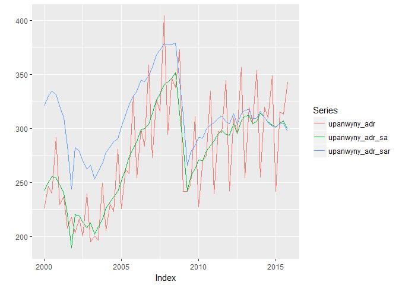

# create_ushist
Tourism Economics  
Thursday, October 16, 2014  

This had been pretty similar to create_ushist. To make this, I changed it to import the host Rdata files. I deleted the parts related to opens and closes. And removed stuff about IHG canada and mexico. And commented out the top25 piece. 

Then I went through a more thorough reworking. I realized I could do the calculation of real series across multiple countries.


Setup

```r
#read_chunk('~/Project/R projects/lodfor/scripts/functions.R')
#source('~/Project/R projects/lodfor/scripts/functions_combined.R')
library(arlodr, warn.conflicts=FALSE)
library(xts, warn.conflicts=FALSE)
library(dplyr, warn.conflicts=FALSE)
library(tidyr, warn.conflicts=FALSE)
```


Creates a us historical databank. Combines the STR data with selected macro data and calculates a few series

```r
fpath <- c("~/Project/R projects/lodfor/") 
#macro data
  load(paste(fpath,"output_data/oe_usmac_q.Rdata", sep=""))
# str data
  load(paste(fpath,"output_data/out_str_us_host_q.Rdata", sep="")) 
  load(paste(fpath,"output_data/out_str_us_host_m.Rdata", sep=""))

# put quarterly into a tidy format
temp_str_q <- out_str_us_host_q %>%
  data.frame(date=time(.), .) %>%
  # creates column called segvar that contains the column names, and one next to 
  # it with the values, dropping the time column
  gather(segvar, value, -date, na.rm = FALSE) %>%
  # separates out the variables
  separate(segvar, c("seg", "variable"), sep = "_", extra="merge") %>%
  separate(variable, c("area_sh", "variable"), sep = "_", extra="merge") %>%
  separate(variable, c("country", "variable"), sep = "_", extra="merge") %>%
  # keeps everything else as columns and spreads variable into multiple 
  # columns containing the values
  spread(variable,value)

# put monthly into a tidy format
temp_str_m <- out_str_us_host_m %>%
  data.frame(date=time(.), .) %>%
  # creates column called segvar that contains the column names, and one next to 
  # it with the values, dropping the time column
  gather(segvar, value, -date, na.rm = FALSE) %>%
  # separates out the variables
  separate(segvar, c("seg", "variable"), sep = "_", extra="merge") %>%
  separate(variable, c("area_sh", "variable"), sep = "_", extra="merge") %>%
  separate(variable, c("country", "variable"), sep = "_", extra="merge") %>%
  # keeps everything else as columns and spreads variable into multiple 
  # columns containing the values
  spread(variable,value)
```

The initial steps do the quarterly databank. Monthly is done further below.

```r
# selects certain series to bring in. Others just stay in macro in case they 
# are needed in future.
temp_usmac <- oe_usmac_q %>%
  data.frame(date=time(oe_usmac_q), oe_usmac_q) %>%
  select(date, 
         us_gdp,
         us_ifix,
         us_cd,
         us_iconstr,
         us_popnipa,
         us_popw,
         us_et,
         us_up,
         us_yhat,
         us_pc,
         us_pedy,
         us_penwall,
         us_cogtp,
         us_cpi,
         us_usrecq,
         can_gdp,
         can_cpi,
         can_pc,
         mex_gdp,
         mex_cpi,
         mex_pc
         ) %>%
  read.zoo %>%
  as.xts
head(temp_usmac)
```

```
##             us_gdp us_ifix  us_cd us_iconstr us_popnipa us_popw    us_et
## 1980-01-01 1631.22 309.150 59.750    198.181     226754  166762  99862.3
## 1980-04-01 1598.15 286.775 53.300    177.166     227389  167416  98953.3
## 1980-07-01 1595.72 287.925 55.650    180.214     228070  168111  98899.0
## 1980-10-01 1625.30 297.125 57.350    190.966     228689  168694  99498.7
## 1981-01-01 1658.93 301.075 58.975    188.642     229155  169279 100239.0
## 1981-04-01 1646.82 301.225 56.700    189.510     229674  169837 100801.0
##              us_up us_yhat  us_pc us_pedy us_penwall us_cogtp  us_cpi
## 1980-01-01 6.30000 1640.53 42.398 1147.47    9238.63   59.375 79.0333
## 1980-04-01 7.33333 1649.28 43.435 1130.80    9582.46   51.750 81.7000
## 1980-07-01 7.66667 1657.47 44.449 1144.56    9985.13   53.650 83.2333
## 1980-10-01 7.40000 1665.53 45.547 1167.01   10326.60   58.775 85.5667
## 1981-01-01 7.43333 1673.97 46.675 1163.91   10522.40   61.100 87.9333
## 1981-04-01 7.40000 1683.50 47.454 1163.67   10786.30   60.200 89.7667
##            us_usrecq can_gdp can_cpi  can_pc mex_gdp  mex_cpi    mex_pc
## 1980-01-01         0  192198 42.2796 40.4810 1491.85 0.101089 0.0871691
## 1980-04-01         1  191779 43.4352 41.5748 1501.59 0.106925 0.0936038
## 1980-07-01         1  191712 44.6358 42.7220 1534.00 0.113918 0.1038120
## 1980-10-01         0  193866 45.9055 44.0455 1578.43 0.119657 0.1060480
## 1981-01-01         0  198708 47.4281 45.4805 1613.67 0.129351 0.1115080
## 1981-04-01         0  200900 48.9277 46.5727 1655.48 0.137261 0.1192690
```

```r
# merges dataframes. the all.=TRUE piece ensures all the rows
# in the first dataframe are included
#ushist_q <- merge(temp, out_str_us_host_q, all=TRUE) 

######################
#
# indexes everything in ushist_q
#
# ushist_ind_q <- index_q_xts(ushist_q,index_year=2005)
# 
# # look at a graph
# tempa <- ushist_ind_q$totus_occ_sa
# tempb <- ushist_ind_q$upsus_occ_sa
# tempc <- merge(tempa,tempb)
# autoplot(window(tempc, start="2000-01-01", end="2014-10-01"), facets=NULL)
```

##Converts some series to real

First set up the price deflator to use for each country
Index the personal cons price deflator to average 100 in 2014

```r
# US
us_pcindex <- index_q(temp_usmac$us_pc, index_year=2014)
names(us_pcindex) <- "us_pcindex"
autoplot.zoo(us_pcindex)
```

<!-- -->

```r
# Canada
can_pcindex <- index_q(temp_usmac$can_pc, index_year=2014)
names(can_pcindex) <- "can_pcindex"
autoplot.zoo(can_pcindex)
```

<!-- -->

```r
# Mexico
mex_pcindex <- index_q(temp_usmac$mex_pc, index_year=2014)
names(mex_pcindex) <- "mex_pcindex"
autoplot.zoo(mex_pcindex)
```

<!-- -->

```r
# combines as a dataframe
pcindex <- merge(us_pcindex, can_pcindex, mex_pcindex) %>%
  data.frame(date=time(.), .) %>%
  gather(var, value, -date, na.rm = FALSE) %>%
  separate(var, c("country", "variable"), sep = "_", extra="merge") %>%
  mutate(country = ifelse(country == "us", "usa", country)) %>%
  spread(variable, value)
```

Add the price index to the somewhat tidy dataframe and calculate real series

```r
temp_str_q1 <- temp_str_q %>%
  left_join(., pcindex, by=c("date", "country")) %>%
  mutate(adrr = (adr / pcindex)*100) %>%
  mutate(adr_sar = (adr_sa / pcindex)*100) %>%
  mutate(revparr = (revpar / pcindex)*100) %>%
  mutate(revpar_sar = (revpar_sa / pcindex)*100)
  
temp_str_q2 <- temp_str_q1 %>%
  mutate(seg = paste0(seg, area_sh)) %>%
  # drop country because I don't think it is needed anymore
  select(-country, -area_sh) %>%
  gather(variable, value, -seg, -date) %>%
  mutate(segvar = paste(seg, variable, sep="_")) %>%
  select(-seg, -variable) %>%
  spread(segvar, value)

# to remove columns that are all NA and read back to xts
str_q <- temp_str_q2[,colSums(is.na(temp_str_q2))<nrow(temp_str_q2)] %>%
 read.zoo() %>%
 xts()

autoplot.zoo(window(str_q$upachcil_adr_sar, start="2000-01-01", end="2014-10-01"))
```

<!-- -->

```r
autoplot.zoo(window(str_q$upachcil_revpar_sa, start="2000-01-01", end="2014-10-01"))
```

<!-- -->

```r
autoplot.zoo(window(str_q$upachcil_revpar, start="2000-01-01", end="2014-10-01"))
```

<!-- -->

```r
autoplot.zoo(window(str_q$luxusxxx_adr, start="2000-01-01", end="2014-10-01"))
```

<!-- -->

```r
# merges onto ushist_q
ushist_q <- merge(temp_usmac, str_q)

autoplot.zoo(window(ushist_q$upausxxx_adr, start="2000-01-01", end="2014-10-01"))
```

<!-- -->

```r
autoplot.zoo(window(ushist_q$upausxxx_adr_sa, start="2000-01-01", end="2014-10-01"))
```

<!-- -->

```r
autoplot.zoo(window(ushist_q$upausxxx_adr_sar, start="2000-01-01", end="2014-10-01"))
```

<!-- -->

```r
ushist_q_df <- ushist_q %>%
  data.frame(date=time(.), .)


# simple graph
grapht <- ushist_q_df %>%
  select(date, upausxxx_adr, upausxxx_adr_sa, upausxxx_adr_sar) %>%
  read.zoo() %>%
  xts() %>%
  window(.,start="2000-01-01", end="2015-10-01")
autoplot.zoo(grapht, facets = NULL)
```

<!-- -->

```r
# simple graph with variables for selected geo
segment <- c("upanwyny")
var1 <- paste0(segment,"_adr")
var2 <- paste0(segment,"_adr_sa")
var3 <- paste0(segment,"_adr_sar")

colnames(ushist_q)
```

```
##    [1] "us_gdp"              "us_ifix"             "us_cd"              
##    [4] "us_iconstr"          "us_popnipa"          "us_popw"            
##    [7] "us_et"               "us_up"               "us_yhat"            
##   [10] "us_pc"               "us_pedy"             "us_penwall"         
##   [13] "us_cogtp"            "us_cpi"              "us_usrecq"          
##   [16] "can_gdp"             "can_cpi"             "can_pc"             
##   [19] "mex_gdp"             "mex_cpi"             "mex_pc"             
##   [22] "luxasttx_adr"        "luxasttx_adrr"       "luxasttx_days"      
##   [25] "luxasttx_demd"       "luxasttx_demt"       "luxasttx_occ"       
##   [28] "luxasttx_pcindex"    "luxasttx_revpar"     "luxasttx_revparr"   
##   [31] "luxasttx_rmrevt"     "luxasttx_supd"       "luxasttx_supt"      
##   [34] "luxatlga_adr"        "luxatlga_adrr"       "luxatlga_days"      
##   [37] "luxatlga_demd"       "luxatlga_demt"       "luxatlga_occ"       
##   [40] "luxatlga_pcindex"    "luxatlga_revpar"     "luxatlga_revparr"   
##   [43] "luxatlga_rmrevt"     "luxatlga_supd"       "luxatlga_supt"      
##   [46] "luxbstma_adr"        "luxbstma_adrr"       "luxbstma_days"      
##   [49] "luxbstma_demd"       "luxbstma_demt"       "luxbstma_occ"       
##   [52] "luxbstma_pcindex"    "luxbstma_revpar"     "luxbstma_revparr"   
##   [55] "luxbstma_rmrevt"     "luxbstma_supd"       "luxbstma_supt"      
##   [58] "luxchcil_adr"        "luxchcil_adrr"       "luxchcil_days"      
##   [61] "luxchcil_demd"       "luxchcil_demt"       "luxchcil_occ"       
##   [64] "luxchcil_pcindex"    "luxchcil_revpar"     "luxchcil_revparr"   
##   [67] "luxchcil_rmrevt"     "luxchcil_supd"       "luxchcil_supt"      
##   [70] "luxdlltx_adr"        "luxdlltx_adrr"       "luxdlltx_days"      
##   [73] "luxdlltx_demd"       "luxdlltx_demt"       "luxdlltx_occ"       
##   [76] "luxdlltx_pcindex"    "luxdlltx_revpar"     "luxdlltx_revparr"   
##   [79] "luxdlltx_rmrevt"     "luxdlltx_supd"       "luxdlltx_supt"      
##   [82] "luxdnvco_adr"        "luxdnvco_adrr"       "luxdnvco_days"      
##   [85] "luxdnvco_demd"       "luxdnvco_demt"       "luxdnvco_occ"       
##   [88] "luxdnvco_pcindex"    "luxdnvco_revpar"     "luxdnvco_revparr"   
##   [91] "luxdnvco_rmrevt"     "luxdnvco_supd"       "luxdnvco_supt"      
##   [94] "luxhnlhi_adr"        "luxhnlhi_adrr"       "luxhnlhi_days"      
##   [97] "luxhnlhi_demd"       "luxhnlhi_demt"       "luxhnlhi_occ"       
##  [100] "luxhnlhi_pcindex"    "luxhnlhi_revpar"     "luxhnlhi_revparr"   
##  [103] "luxhnlhi_rmrevt"     "luxhnlhi_supd"       "luxhnlhi_supt"      
##  [106] "luxhsttx_adr"        "luxhsttx_adrr"       "luxhsttx_days"      
##  [109] "luxhsttx_demd"       "luxhsttx_demt"       "luxhsttx_occ"       
##  [112] "luxhsttx_pcindex"    "luxhsttx_revpar"     "luxhsttx_revparr"   
##  [115] "luxhsttx_rmrevt"     "luxhsttx_supd"       "luxhsttx_supt"      
##  [118] "luxkhlhi_adr"        "luxkhlhi_adrr"       "luxkhlhi_days"      
##  [121] "luxkhlhi_demd"       "luxkhlhi_demt"       "luxkhlhi_occ"       
##  [124] "luxkhlhi_pcindex"    "luxkhlhi_revpar"     "luxkhlhi_revparr"   
##  [127] "luxkhlhi_rmrevt"     "luxkhlhi_supd"       "luxkhlhi_supt"      
##  [130] "luxlsaca_adr"        "luxlsaca_adrr"       "luxlsaca_days"      
##  [133] "luxlsaca_demd"       "luxlsaca_demt"       "luxlsaca_occ"       
##  [136] "luxlsaca_pcindex"    "luxlsaca_revpar"     "luxlsaca_revparr"   
##  [139] "luxlsaca_rmrevt"     "luxlsaca_supd"       "luxlsaca_supt"      
##  [142] "luxmimfl_adr"        "luxmimfl_adrr"       "luxmimfl_days"      
##  [145] "luxmimfl_demd"       "luxmimfl_demt"       "luxmimfl_occ"       
##  [148] "luxmimfl_pcindex"    "luxmimfl_revpar"     "luxmimfl_revparr"   
##  [151] "luxmimfl_rmrevt"     "luxmimfl_supd"       "luxmimfl_supt"      
##  [154] "luxmnnmn_adr"        "luxmnnmn_adrr"       "luxmnnmn_days"      
##  [157] "luxmnnmn_demd"       "luxmnnmn_demt"       "luxmnnmn_occ"       
##  [160] "luxmnnmn_pcindex"    "luxmnnmn_revpar"     "luxmnnmn_revparr"   
##  [163] "luxmnnmn_rmrevt"     "luxmnnmn_supd"       "luxmnnmn_supt"      
##  [166] "luxmouhi_adr"        "luxmouhi_adrr"       "luxmouhi_days"      
##  [169] "luxmouhi_demd"       "luxmouhi_demt"       "luxmouhi_occ"       
##  [172] "luxmouhi_pcindex"    "luxmouhi_revpar"     "luxmouhi_revparr"   
##  [175] "luxmouhi_rmrevt"     "luxmouhi_supd"       "luxmouhi_supt"      
##  [178] "luxmxcmx_adr"        "luxmxcmx_adrr"       "luxmxcmx_days"      
##  [181] "luxmxcmx_demd"       "luxmxcmx_demt"       "luxmxcmx_occ"       
##  [184] "luxmxcmx_pcindex"    "luxmxcmx_revpar"     "luxmxcmx_revparr"   
##  [187] "luxmxcmx_rmrevt"     "luxmxcmx_supd"       "luxmxcmx_supt"      
##  [190] "luxnwola_adr"        "luxnwola_adrr"       "luxnwola_days"      
##  [193] "luxnwola_demd"       "luxnwola_demt"       "luxnwola_occ"       
##  [196] "luxnwola_pcindex"    "luxnwola_revpar"     "luxnwola_revparr"   
##  [199] "luxnwola_rmrevt"     "luxnwola_supd"       "luxnwola_supt"      
##  [202] "luxnwyny_adr"        "luxnwyny_adrr"       "luxnwyny_days"      
##  [205] "luxnwyny_demd"       "luxnwyny_demt"       "luxnwyny_occ"       
##  [208] "luxnwyny_pcindex"    "luxnwyny_revpar"     "luxnwyny_revparr"   
##  [211] "luxnwyny_rmrevt"     "luxnwyny_supd"       "luxnwyny_supt"      
##  [214] "luxorgca_adr"        "luxorgca_adrr"       "luxorgca_days"      
##  [217] "luxorgca_demd"       "luxorgca_demt"       "luxorgca_occ"       
##  [220] "luxorgca_pcindex"    "luxorgca_revpar"     "luxorgca_revparr"   
##  [223] "luxorgca_rmrevt"     "luxorgca_supd"       "luxorgca_supt"      
##  [226] "luxorlfl_adr"        "luxorlfl_adrr"       "luxorlfl_days"      
##  [229] "luxorlfl_demd"       "luxorlfl_demt"       "luxorlfl_occ"       
##  [232] "luxorlfl_pcindex"    "luxorlfl_revpar"     "luxorlfl_revparr"   
##  [235] "luxorlfl_rmrevt"     "luxorlfl_supd"       "luxorlfl_supt"      
##  [238] "luxphlpa_adr"        "luxphlpa_adrr"       "luxphlpa_days"      
##  [241] "luxphlpa_demd"       "luxphlpa_demt"       "luxphlpa_occ"       
##  [244] "luxphlpa_pcindex"    "luxphlpa_revpar"     "luxphlpa_revparr"   
##  [247] "luxphlpa_rmrevt"     "luxphlpa_supd"       "luxphlpa_supt"      
##  [250] "luxphnaz_adr"        "luxphnaz_adrr"       "luxphnaz_days"      
##  [253] "luxphnaz_demd"       "luxphnaz_demt"       "luxphnaz_occ"       
##  [256] "luxphnaz_pcindex"    "luxphnaz_revpar"     "luxphnaz_revparr"   
##  [259] "luxphnaz_rmrevt"     "luxphnaz_supd"       "luxphnaz_supt"      
##  [262] "luxsfjca_adr"        "luxsfjca_adrr"       "luxsfjca_days"      
##  [265] "luxsfjca_demd"       "luxsfjca_demt"       "luxsfjca_occ"       
##  [268] "luxsfjca_pcindex"    "luxsfjca_revpar"     "luxsfjca_revparr"   
##  [271] "luxsfjca_rmrevt"     "luxsfjca_supd"       "luxsfjca_supt"      
##  [274] "luxsnatx_adr"        "luxsnatx_adrr"       "luxsnatx_days"      
##  [277] "luxsnatx_demd"       "luxsnatx_demt"       "luxsnatx_occ"       
##  [280] "luxsnatx_pcindex"    "luxsnatx_revpar"     "luxsnatx_revparr"   
##  [283] "luxsnatx_rmrevt"     "luxsnatx_supd"       "luxsnatx_supt"      
##  [286] "luxsndca_adr"        "luxsndca_adrr"       "luxsndca_days"      
##  [289] "luxsndca_demd"       "luxsndca_demt"       "luxsndca_occ"       
##  [292] "luxsndca_pcindex"    "luxsndca_revpar"     "luxsndca_revparr"   
##  [295] "luxsndca_rmrevt"     "luxsndca_supd"       "luxsndca_supt"      
##  [298] "luxsnfca_adr"        "luxsnfca_adrr"       "luxsnfca_days"      
##  [301] "luxsnfca_demd"       "luxsnfca_demt"       "luxsnfca_occ"       
##  [304] "luxsnfca_pcindex"    "luxsnfca_revpar"     "luxsnfca_revparr"   
##  [307] "luxsnfca_rmrevt"     "luxsnfca_supd"       "luxsnfca_supt"      
##  [310] "luxsnjca_adr"        "luxsnjca_adrr"       "luxsnjca_days"      
##  [313] "luxsnjca_demd"       "luxsnjca_demt"       "luxsnjca_occ"       
##  [316] "luxsnjca_pcindex"    "luxsnjca_revpar"     "luxsnjca_revparr"   
##  [319] "luxsnjca_rmrevt"     "luxsnjca_supd"       "luxsnjca_supt"      
##  [322] "luxsttwa_adr"        "luxsttwa_adrr"       "luxsttwa_days"      
##  [325] "luxsttwa_demd"       "luxsttwa_demt"       "luxsttwa_occ"       
##  [328] "luxsttwa_pcindex"    "luxsttwa_revpar"     "luxsttwa_revparr"   
##  [331] "luxsttwa_rmrevt"     "luxsttwa_supd"       "luxsttwa_supt"      
##  [334] "luxtorcn_adr"        "luxtorcn_adrr"       "luxtorcn_days"      
##  [337] "luxtorcn_demd"       "luxtorcn_demt"       "luxtorcn_occ"       
##  [340] "luxtorcn_pcindex"    "luxtorcn_revpar"     "luxtorcn_revparr"   
##  [343] "luxtorcn_rmrevt"     "luxtorcn_supd"       "luxtorcn_supt"      
##  [346] "luxusxxx_adr"        "luxusxxx_adrr"       "luxusxxx_days"      
##  [349] "luxusxxx_demd"       "luxusxxx_demt"       "luxusxxx_occ"       
##  [352] "luxusxxx_pcindex"    "luxusxxx_revpar"     "luxusxxx_revparr"   
##  [355] "luxusxxx_rmrevt"     "luxusxxx_supd"       "luxusxxx_supt"      
##  [358] "luxwshdc_adr"        "luxwshdc_adrr"       "luxwshdc_days"      
##  [361] "luxwshdc_demd"       "luxwshdc_demt"       "luxwshdc_occ"       
##  [364] "luxwshdc_pcindex"    "luxwshdc_revpar"     "luxwshdc_revparr"   
##  [367] "luxwshdc_rmrevt"     "luxwshdc_supd"       "luxwshdc_supt"      
##  [370] "totasttx_adr"        "totasttx_adrr"       "totasttx_days"      
##  [373] "totasttx_demd"       "totasttx_demt"       "totasttx_occ"       
##  [376] "totasttx_pcindex"    "totasttx_revpar"     "totasttx_revparr"   
##  [379] "totasttx_rmrevt"     "totasttx_supd"       "totasttx_supt"      
##  [382] "totatlga_adr"        "totatlga_adrr"       "totatlga_days"      
##  [385] "totatlga_demd"       "totatlga_demt"       "totatlga_occ"       
##  [388] "totatlga_pcindex"    "totatlga_revpar"     "totatlga_revparr"   
##  [391] "totatlga_rmrevt"     "totatlga_supd"       "totatlga_supt"      
##  [394] "totbstma_adr"        "totbstma_adrr"       "totbstma_days"      
##  [397] "totbstma_demd"       "totbstma_demt"       "totbstma_occ"       
##  [400] "totbstma_pcindex"    "totbstma_revpar"     "totbstma_revparr"   
##  [403] "totbstma_rmrevt"     "totbstma_supd"       "totbstma_supt"      
##  [406] "totcalcn_adr"        "totcalcn_adrr"       "totcalcn_days"      
##  [409] "totcalcn_demd"       "totcalcn_demt"       "totcalcn_occ"       
##  [412] "totcalcn_pcindex"    "totcalcn_revpar"     "totcalcn_revparr"   
##  [415] "totcalcn_rmrevt"     "totcalcn_supd"       "totcalcn_supt"      
##  [418] "totchcil_adr"        "totchcil_adrr"       "totchcil_days"      
##  [421] "totchcil_demd"       "totchcil_demt"       "totchcil_occ"       
##  [424] "totchcil_pcindex"    "totchcil_revpar"     "totchcil_revparr"   
##  [427] "totchcil_rmrevt"     "totchcil_supd"       "totchcil_supt"      
##  [430] "totchrnc_adr"        "totchrnc_adrr"       "totchrnc_days"      
##  [433] "totchrnc_demd"       "totchrnc_demt"       "totchrnc_occ"       
##  [436] "totchrnc_pcindex"    "totchrnc_revpar"     "totchrnc_revparr"   
##  [439] "totchrnc_rmrevt"     "totchrnc_supd"       "totchrnc_supt"      
##  [442] "totchrsc_adr"        "totchrsc_adrr"       "totchrsc_days"      
##  [445] "totchrsc_demd"       "totchrsc_demt"       "totchrsc_occ"       
##  [448] "totchrsc_pcindex"    "totchrsc_revpar"     "totchrsc_revparr"   
##  [451] "totchrsc_rmrevt"     "totchrsc_supd"       "totchrsc_supt"      
##  [454] "totdlltx_adr"        "totdlltx_adrr"       "totdlltx_days"      
##  [457] "totdlltx_demd"       "totdlltx_demt"       "totdlltx_occ"       
##  [460] "totdlltx_pcindex"    "totdlltx_revpar"     "totdlltx_revparr"   
##  [463] "totdlltx_rmrevt"     "totdlltx_supd"       "totdlltx_supt"      
##  [466] "totdnvco_adr"        "totdnvco_adrr"       "totdnvco_days"      
##  [469] "totdnvco_demd"       "totdnvco_demt"       "totdnvco_occ"       
##  [472] "totdnvco_pcindex"    "totdnvco_revpar"     "totdnvco_revparr"   
##  [475] "totdnvco_rmrevt"     "totdnvco_supd"       "totdnvco_supt"      
##  [478] "tothnlhi_adr"        "tothnlhi_adrr"       "tothnlhi_days"      
##  [481] "tothnlhi_demd"       "tothnlhi_demt"       "tothnlhi_occ"       
##  [484] "tothnlhi_pcindex"    "tothnlhi_revpar"     "tothnlhi_revparr"   
##  [487] "tothnlhi_rmrevt"     "tothnlhi_supd"       "tothnlhi_supt"      
##  [490] "tothsttx_adr"        "tothsttx_adrr"       "tothsttx_days"      
##  [493] "tothsttx_demd"       "tothsttx_demt"       "tothsttx_occ"       
##  [496] "tothsttx_pcindex"    "tothsttx_revpar"     "tothsttx_revparr"   
##  [499] "tothsttx_rmrevt"     "tothsttx_supd"       "tothsttx_supt"      
##  [502] "totindin_adr"        "totindin_adrr"       "totindin_days"      
##  [505] "totindin_demd"       "totindin_demt"       "totindin_occ"       
##  [508] "totindin_pcindex"    "totindin_revpar"     "totindin_revparr"   
##  [511] "totindin_rmrevt"     "totindin_supd"       "totindin_supt"      
##  [514] "totkhlhi_adr"        "totkhlhi_adrr"       "totkhlhi_days"      
##  [517] "totkhlhi_demd"       "totkhlhi_demt"       "totkhlhi_occ"       
##  [520] "totkhlhi_pcindex"    "totkhlhi_revpar"     "totkhlhi_revparr"   
##  [523] "totkhlhi_rmrevt"     "totkhlhi_supd"       "totkhlhi_supt"      
##  [526] "totlsaca_adr"        "totlsaca_adrr"       "totlsaca_days"      
##  [529] "totlsaca_demd"       "totlsaca_demt"       "totlsaca_occ"       
##  [532] "totlsaca_pcindex"    "totlsaca_revpar"     "totlsaca_revparr"   
##  [535] "totlsaca_rmrevt"     "totlsaca_supd"       "totlsaca_supt"      
##  [538] "totmimfl_adr"        "totmimfl_adrr"       "totmimfl_days"      
##  [541] "totmimfl_demd"       "totmimfl_demt"       "totmimfl_occ"       
##  [544] "totmimfl_pcindex"    "totmimfl_revpar"     "totmimfl_revparr"   
##  [547] "totmimfl_rmrevt"     "totmimfl_supd"       "totmimfl_supt"      
##  [550] "totmmptn_adr"        "totmmptn_adrr"       "totmmptn_days"      
##  [553] "totmmptn_demd"       "totmmptn_demt"       "totmmptn_occ"       
##  [556] "totmmptn_pcindex"    "totmmptn_revpar"     "totmmptn_revparr"   
##  [559] "totmmptn_rmrevt"     "totmmptn_supd"       "totmmptn_supt"      
##  [562] "totmnnmn_adr"        "totmnnmn_adrr"       "totmnnmn_days"      
##  [565] "totmnnmn_demd"       "totmnnmn_demt"       "totmnnmn_occ"       
##  [568] "totmnnmn_pcindex"    "totmnnmn_revpar"     "totmnnmn_revparr"   
##  [571] "totmnnmn_rmrevt"     "totmnnmn_supd"       "totmnnmn_supt"      
##  [574] "totmouhi_adr"        "totmouhi_adrr"       "totmouhi_days"      
##  [577] "totmouhi_demd"       "totmouhi_demt"       "totmouhi_occ"       
##  [580] "totmouhi_pcindex"    "totmouhi_revpar"     "totmouhi_revparr"   
##  [583] "totmouhi_rmrevt"     "totmouhi_supd"       "totmouhi_supt"      
##  [586] "totmxcmx_adr"        "totmxcmx_adrr"       "totmxcmx_days"      
##  [589] "totmxcmx_demd"       "totmxcmx_demt"       "totmxcmx_occ"       
##  [592] "totmxcmx_pcindex"    "totmxcmx_revpar"     "totmxcmx_revparr"   
##  [595] "totmxcmx_rmrevt"     "totmxcmx_supd"       "totmxcmx_supt"      
##  [598] "totnshtn_adr"        "totnshtn_adrr"       "totnshtn_days"      
##  [601] "totnshtn_demd"       "totnshtn_demt"       "totnshtn_occ"       
##  [604] "totnshtn_pcindex"    "totnshtn_revpar"     "totnshtn_revparr"   
##  [607] "totnshtn_rmrevt"     "totnshtn_supd"       "totnshtn_supt"      
##  [610] "totnwola_adr"        "totnwola_adrr"       "totnwola_days"      
##  [613] "totnwola_demd"       "totnwola_demt"       "totnwola_occ"       
##  [616] "totnwola_pcindex"    "totnwola_revpar"     "totnwola_revparr"   
##  [619] "totnwola_rmrevt"     "totnwola_supd"       "totnwola_supt"      
##  [622] "totnwyny_adr"        "totnwyny_adrr"       "totnwyny_days"      
##  [625] "totnwyny_demd"       "totnwyny_demt"       "totnwyny_occ"       
##  [628] "totnwyny_pcindex"    "totnwyny_revpar"     "totnwyny_revparr"   
##  [631] "totnwyny_rmrevt"     "totnwyny_supd"       "totnwyny_supt"      
##  [634] "totorgca_adr"        "totorgca_adrr"       "totorgca_days"      
##  [637] "totorgca_demd"       "totorgca_demt"       "totorgca_occ"       
##  [640] "totorgca_pcindex"    "totorgca_revpar"     "totorgca_revparr"   
##  [643] "totorgca_rmrevt"     "totorgca_supd"       "totorgca_supt"      
##  [646] "totorlfl_adr"        "totorlfl_adrr"       "totorlfl_days"      
##  [649] "totorlfl_demd"       "totorlfl_demt"       "totorlfl_occ"       
##  [652] "totorlfl_pcindex"    "totorlfl_revpar"     "totorlfl_revparr"   
##  [655] "totorlfl_rmrevt"     "totorlfl_supd"       "totorlfl_supt"      
##  [658] "totphlpa_adr"        "totphlpa_adrr"       "totphlpa_days"      
##  [661] "totphlpa_demd"       "totphlpa_demt"       "totphlpa_occ"       
##  [664] "totphlpa_pcindex"    "totphlpa_revpar"     "totphlpa_revparr"   
##  [667] "totphlpa_rmrevt"     "totphlpa_supd"       "totphlpa_supt"      
##  [670] "totphnaz_adr"        "totphnaz_adrr"       "totphnaz_days"      
##  [673] "totphnaz_demd"       "totphnaz_demt"       "totphnaz_occ"       
##  [676] "totphnaz_pcindex"    "totphnaz_revpar"     "totphnaz_revparr"   
##  [679] "totphnaz_rmrevt"     "totphnaz_supd"       "totphnaz_supt"      
##  [682] "totprtor_adr"        "totprtor_adrr"       "totprtor_days"      
##  [685] "totprtor_demd"       "totprtor_demt"       "totprtor_occ"       
##  [688] "totprtor_pcindex"    "totprtor_revpar"     "totprtor_revparr"   
##  [691] "totprtor_rmrevt"     "totprtor_supd"       "totprtor_supt"      
##  [694] "totrlgnc_adr"        "totrlgnc_adrr"       "totrlgnc_days"      
##  [697] "totrlgnc_demd"       "totrlgnc_demt"       "totrlgnc_occ"       
##  [700] "totrlgnc_pcindex"    "totrlgnc_revpar"     "totrlgnc_revparr"   
##  [703] "totrlgnc_rmrevt"     "totrlgnc_supd"       "totrlgnc_supt"      
##  [706] "totsfjca_adr"        "totsfjca_adrr"       "totsfjca_days"      
##  [709] "totsfjca_demd"       "totsfjca_demt"       "totsfjca_occ"       
##  [712] "totsfjca_pcindex"    "totsfjca_revpar"     "totsfjca_revparr"   
##  [715] "totsfjca_rmrevt"     "totsfjca_supd"       "totsfjca_supt"      
##  [718] "totslcut_adr"        "totslcut_adrr"       "totslcut_days"      
##  [721] "totslcut_demd"       "totslcut_demt"       "totslcut_occ"       
##  [724] "totslcut_pcindex"    "totslcut_revpar"     "totslcut_revparr"   
##  [727] "totslcut_rmrevt"     "totslcut_supd"       "totslcut_supt"      
##  [730] "totsnatx_adr"        "totsnatx_adrr"       "totsnatx_days"      
##  [733] "totsnatx_demd"       "totsnatx_demt"       "totsnatx_occ"       
##  [736] "totsnatx_pcindex"    "totsnatx_revpar"     "totsnatx_revparr"   
##  [739] "totsnatx_rmrevt"     "totsnatx_supd"       "totsnatx_supt"      
##  [742] "totsndca_adr"        "totsndca_adrr"       "totsndca_days"      
##  [745] "totsndca_demd"       "totsndca_demt"       "totsndca_occ"       
##  [748] "totsndca_pcindex"    "totsndca_revpar"     "totsndca_revparr"   
##  [751] "totsndca_rmrevt"     "totsndca_supd"       "totsndca_supt"      
##  [754] "totsnfca_adr"        "totsnfca_adrr"       "totsnfca_days"      
##  [757] "totsnfca_demd"       "totsnfca_demt"       "totsnfca_occ"       
##  [760] "totsnfca_pcindex"    "totsnfca_revpar"     "totsnfca_revparr"   
##  [763] "totsnfca_rmrevt"     "totsnfca_supd"       "totsnfca_supt"      
##  [766] "totsnjca_adr"        "totsnjca_adrr"       "totsnjca_days"      
##  [769] "totsnjca_demd"       "totsnjca_demt"       "totsnjca_occ"       
##  [772] "totsnjca_pcindex"    "totsnjca_revpar"     "totsnjca_revparr"   
##  [775] "totsnjca_rmrevt"     "totsnjca_supd"       "totsnjca_supt"      
##  [778] "totsttwa_adr"        "totsttwa_adrr"       "totsttwa_days"      
##  [781] "totsttwa_demd"       "totsttwa_demt"       "totsttwa_occ"       
##  [784] "totsttwa_pcindex"    "totsttwa_revpar"     "totsttwa_revparr"   
##  [787] "totsttwa_rmrevt"     "totsttwa_supd"       "totsttwa_supt"      
##  [790] "tottmpfl_adr"        "tottmpfl_adrr"       "tottmpfl_days"      
##  [793] "tottmpfl_demd"       "tottmpfl_demt"       "tottmpfl_occ"       
##  [796] "tottmpfl_pcindex"    "tottmpfl_revpar"     "tottmpfl_revparr"   
##  [799] "tottmpfl_rmrevt"     "tottmpfl_supd"       "tottmpfl_supt"      
##  [802] "tottorcn_adr"        "tottorcn_adrr"       "tottorcn_days"      
##  [805] "tottorcn_demd"       "tottorcn_demt"       "tottorcn_occ"       
##  [808] "tottorcn_pcindex"    "tottorcn_revpar"     "tottorcn_revparr"   
##  [811] "tottorcn_rmrevt"     "tottorcn_supd"       "tottorcn_supt"      
##  [814] "totusxxx_adr"        "totusxxx_adrr"       "totusxxx_days"      
##  [817] "totusxxx_demd"       "totusxxx_demt"       "totusxxx_occ"       
##  [820] "totusxxx_pcindex"    "totusxxx_revpar"     "totusxxx_revparr"   
##  [823] "totusxxx_rmrevt"     "totusxxx_supd"       "totusxxx_supt"      
##  [826] "totvnccn_adr"        "totvnccn_adrr"       "totvnccn_days"      
##  [829] "totvnccn_demd"       "totvnccn_demt"       "totvnccn_occ"       
##  [832] "totvnccn_pcindex"    "totvnccn_revpar"     "totvnccn_revparr"   
##  [835] "totvnccn_rmrevt"     "totvnccn_supd"       "totvnccn_supt"      
##  [838] "totwshdc_adr"        "totwshdc_adrr"       "totwshdc_days"      
##  [841] "totwshdc_demd"       "totwshdc_demt"       "totwshdc_occ"       
##  [844] "totwshdc_pcindex"    "totwshdc_revpar"     "totwshdc_revparr"   
##  [847] "totwshdc_rmrevt"     "totwshdc_supd"       "totwshdc_supt"      
##  [850] "upaasttx_adr"        "upaasttx_adr_sa"     "upaasttx_adr_sar"   
##  [853] "upaasttx_adr_sf"     "upaasttx_adrr"       "upaasttx_days"      
##  [856] "upaasttx_demar_sa"   "upaasttx_demd"       "upaasttx_demd_sa"   
##  [859] "upaasttx_demd_sf"    "upaasttx_demt"       "upaasttx_occ"       
##  [862] "upaasttx_occ_sa"     "upaasttx_occ_sf"     "upaasttx_pcindex"   
##  [865] "upaasttx_revpar"     "upaasttx_revpar_sa"  "upaasttx_revpar_sar"
##  [868] "upaasttx_revpar_sf"  "upaasttx_revparr"    "upaasttx_rmrevt"    
##  [871] "upaasttx_supd"       "upaasttx_supd_sa"    "upaasttx_supd_sf"   
##  [874] "upaasttx_supt"       "upaatlga_adr"        "upaatlga_adr_sa"    
##  [877] "upaatlga_adr_sar"    "upaatlga_adr_sf"     "upaatlga_adrr"      
##  [880] "upaatlga_days"       "upaatlga_demar_sa"   "upaatlga_demd"      
##  [883] "upaatlga_demd_sa"    "upaatlga_demd_sf"    "upaatlga_demt"      
##  [886] "upaatlga_occ"        "upaatlga_occ_sa"     "upaatlga_occ_sf"    
##  [889] "upaatlga_pcindex"    "upaatlga_revpar"     "upaatlga_revpar_sa" 
##  [892] "upaatlga_revpar_sar" "upaatlga_revpar_sf"  "upaatlga_revparr"   
##  [895] "upaatlga_rmrevt"     "upaatlga_supd"       "upaatlga_supd_sa"   
##  [898] "upaatlga_supd_sf"    "upaatlga_supt"       "upabstma_adr"       
##  [901] "upabstma_adr_sa"     "upabstma_adr_sar"    "upabstma_adr_sf"    
##  [904] "upabstma_adrr"       "upabstma_days"       "upabstma_demar_sa"  
##  [907] "upabstma_demd"       "upabstma_demd_sa"    "upabstma_demd_sf"   
##  [910] "upabstma_demt"       "upabstma_occ"        "upabstma_occ_sa"    
##  [913] "upabstma_occ_sf"     "upabstma_pcindex"    "upabstma_revpar"    
##  [916] "upabstma_revpar_sa"  "upabstma_revpar_sar" "upabstma_revpar_sf" 
##  [919] "upabstma_revparr"    "upabstma_rmrevt"     "upabstma_supd"      
##  [922] "upabstma_supd_sa"    "upabstma_supd_sf"    "upabstma_supt"      
##  [925] "upacalcn_adr"        "upacalcn_adr_sa"     "upacalcn_adr_sar"   
##  [928] "upacalcn_adr_sf"     "upacalcn_adrr"       "upacalcn_days"      
##  [931] "upacalcn_demar_sa"   "upacalcn_demd"       "upacalcn_demd_sa"   
##  [934] "upacalcn_demd_sf"    "upacalcn_demt"       "upacalcn_occ"       
##  [937] "upacalcn_occ_sa"     "upacalcn_occ_sf"     "upacalcn_pcindex"   
##  [940] "upacalcn_revpar"     "upacalcn_revpar_sa"  "upacalcn_revpar_sar"
##  [943] "upacalcn_revpar_sf"  "upacalcn_revparr"    "upacalcn_rmrevt"    
##  [946] "upacalcn_supd"       "upacalcn_supd_sa"    "upacalcn_supd_sf"   
##  [949] "upacalcn_supt"       "upachcil_adr"        "upachcil_adr_sa"    
##  [952] "upachcil_adr_sar"    "upachcil_adr_sf"     "upachcil_adrr"      
##  [955] "upachcil_days"       "upachcil_demar_sa"   "upachcil_demd"      
##  [958] "upachcil_demd_sa"    "upachcil_demd_sf"    "upachcil_demt"      
##  [961] "upachcil_occ"        "upachcil_occ_sa"     "upachcil_occ_sf"    
##  [964] "upachcil_pcindex"    "upachcil_revpar"     "upachcil_revpar_sa" 
##  [967] "upachcil_revpar_sar" "upachcil_revpar_sf"  "upachcil_revparr"   
##  [970] "upachcil_rmrevt"     "upachcil_supd"       "upachcil_supd_sa"   
##  [973] "upachcil_supd_sf"    "upachcil_supt"       "upachrnc_adr"       
##  [976] "upachrnc_adr_sa"     "upachrnc_adr_sar"    "upachrnc_adr_sf"    
##  [979] "upachrnc_adrr"       "upachrnc_days"       "upachrnc_demar_sa"  
##  [982] "upachrnc_demd"       "upachrnc_demd_sa"    "upachrnc_demd_sf"   
##  [985] "upachrnc_demt"       "upachrnc_occ"        "upachrnc_occ_sa"    
##  [988] "upachrnc_occ_sf"     "upachrnc_pcindex"    "upachrnc_revpar"    
##  [991] "upachrnc_revpar_sa"  "upachrnc_revpar_sar" "upachrnc_revpar_sf" 
##  [994] "upachrnc_revparr"    "upachrnc_rmrevt"     "upachrnc_supd"      
##  [997] "upachrnc_supd_sa"    "upachrnc_supd_sf"    "upachrnc_supt"      
## [1000] "upachrsc_adr"        "upachrsc_adr_sa"     "upachrsc_adr_sar"   
## [1003] "upachrsc_adr_sf"     "upachrsc_adrr"       "upachrsc_days"      
## [1006] "upachrsc_demar_sa"   "upachrsc_demd"       "upachrsc_demd_sa"   
## [1009] "upachrsc_demd_sf"    "upachrsc_demt"       "upachrsc_occ"       
## [1012] "upachrsc_occ_sa"     "upachrsc_occ_sf"     "upachrsc_pcindex"   
## [1015] "upachrsc_revpar"     "upachrsc_revpar_sa"  "upachrsc_revpar_sar"
## [1018] "upachrsc_revpar_sf"  "upachrsc_revparr"    "upachrsc_rmrevt"    
## [1021] "upachrsc_supd"       "upachrsc_supd_sa"    "upachrsc_supd_sf"   
## [1024] "upachrsc_supt"       "upadlltx_adr"        "upadlltx_adr_sa"    
## [1027] "upadlltx_adr_sar"    "upadlltx_adr_sf"     "upadlltx_adrr"      
## [1030] "upadlltx_days"       "upadlltx_demar_sa"   "upadlltx_demd"      
## [1033] "upadlltx_demd_sa"    "upadlltx_demd_sf"    "upadlltx_demt"      
## [1036] "upadlltx_occ"        "upadlltx_occ_sa"     "upadlltx_occ_sf"    
## [1039] "upadlltx_pcindex"    "upadlltx_revpar"     "upadlltx_revpar_sa" 
## [1042] "upadlltx_revpar_sar" "upadlltx_revpar_sf"  "upadlltx_revparr"   
## [1045] "upadlltx_rmrevt"     "upadlltx_supd"       "upadlltx_supd_sa"   
## [1048] "upadlltx_supd_sf"    "upadlltx_supt"       "upadnvco_adr"       
## [1051] "upadnvco_adr_sa"     "upadnvco_adr_sar"    "upadnvco_adr_sf"    
## [1054] "upadnvco_adrr"       "upadnvco_days"       "upadnvco_demar_sa"  
## [1057] "upadnvco_demd"       "upadnvco_demd_sa"    "upadnvco_demd_sf"   
## [1060] "upadnvco_demt"       "upadnvco_occ"        "upadnvco_occ_sa"    
## [1063] "upadnvco_occ_sf"     "upadnvco_pcindex"    "upadnvco_revpar"    
## [1066] "upadnvco_revpar_sa"  "upadnvco_revpar_sar" "upadnvco_revpar_sf" 
## [1069] "upadnvco_revparr"    "upadnvco_rmrevt"     "upadnvco_supd"      
## [1072] "upadnvco_supd_sa"    "upadnvco_supd_sf"    "upadnvco_supt"      
## [1075] "upahnlhi_adr"        "upahnlhi_adr_sa"     "upahnlhi_adr_sar"   
## [1078] "upahnlhi_adr_sf"     "upahnlhi_adrr"       "upahnlhi_days"      
## [1081] "upahnlhi_demar_sa"   "upahnlhi_demd"       "upahnlhi_demd_sa"   
## [1084] "upahnlhi_demd_sf"    "upahnlhi_demt"       "upahnlhi_occ"       
## [1087] "upahnlhi_occ_sa"     "upahnlhi_occ_sf"     "upahnlhi_pcindex"   
## [1090] "upahnlhi_revpar"     "upahnlhi_revpar_sa"  "upahnlhi_revpar_sar"
## [1093] "upahnlhi_revpar_sf"  "upahnlhi_revparr"    "upahnlhi_rmrevt"    
## [1096] "upahnlhi_supd"       "upahnlhi_supd_sa"    "upahnlhi_supd_sf"   
## [1099] "upahnlhi_supt"       "upahsttx_adr"        "upahsttx_adr_sa"    
## [1102] "upahsttx_adr_sar"    "upahsttx_adr_sf"     "upahsttx_adrr"      
## [1105] "upahsttx_days"       "upahsttx_demar_sa"   "upahsttx_demd"      
## [1108] "upahsttx_demd_sa"    "upahsttx_demd_sf"    "upahsttx_demt"      
## [1111] "upahsttx_occ"        "upahsttx_occ_sa"     "upahsttx_occ_sf"    
## [1114] "upahsttx_pcindex"    "upahsttx_revpar"     "upahsttx_revpar_sa" 
## [1117] "upahsttx_revpar_sar" "upahsttx_revpar_sf"  "upahsttx_revparr"   
## [1120] "upahsttx_rmrevt"     "upahsttx_supd"       "upahsttx_supd_sa"   
## [1123] "upahsttx_supd_sf"    "upahsttx_supt"       "upaindin_adr"       
## [1126] "upaindin_adr_sa"     "upaindin_adr_sar"    "upaindin_adr_sf"    
## [1129] "upaindin_adrr"       "upaindin_days"       "upaindin_demar_sa"  
## [1132] "upaindin_demd"       "upaindin_demd_sa"    "upaindin_demd_sf"   
## [1135] "upaindin_demt"       "upaindin_occ"        "upaindin_occ_sa"    
## [1138] "upaindin_occ_sf"     "upaindin_pcindex"    "upaindin_revpar"    
## [1141] "upaindin_revpar_sa"  "upaindin_revpar_sar" "upaindin_revpar_sf" 
## [1144] "upaindin_revparr"    "upaindin_rmrevt"     "upaindin_supd"      
## [1147] "upaindin_supd_sa"    "upaindin_supd_sf"    "upaindin_supt"      
## [1150] "upakhlhi_adr"        "upakhlhi_adr_sa"     "upakhlhi_adr_sar"   
## [1153] "upakhlhi_adr_sf"     "upakhlhi_adrr"       "upakhlhi_days"      
## [1156] "upakhlhi_demar_sa"   "upakhlhi_demd"       "upakhlhi_demd_sa"   
## [1159] "upakhlhi_demd_sf"    "upakhlhi_demt"       "upakhlhi_occ"       
## [1162] "upakhlhi_occ_sa"     "upakhlhi_occ_sf"     "upakhlhi_pcindex"   
## [1165] "upakhlhi_revpar"     "upakhlhi_revpar_sa"  "upakhlhi_revpar_sar"
## [1168] "upakhlhi_revpar_sf"  "upakhlhi_revparr"    "upakhlhi_rmrevt"    
## [1171] "upakhlhi_supd"       "upakhlhi_supd_sa"    "upakhlhi_supd_sf"   
## [1174] "upakhlhi_supt"       "upalsaca_adr"        "upalsaca_adr_sa"    
## [1177] "upalsaca_adr_sar"    "upalsaca_adr_sf"     "upalsaca_adrr"      
## [1180] "upalsaca_days"       "upalsaca_demar_sa"   "upalsaca_demd"      
## [1183] "upalsaca_demd_sa"    "upalsaca_demd_sf"    "upalsaca_demt"      
## [1186] "upalsaca_occ"        "upalsaca_occ_sa"     "upalsaca_occ_sf"    
## [1189] "upalsaca_pcindex"    "upalsaca_revpar"     "upalsaca_revpar_sa" 
## [1192] "upalsaca_revpar_sar" "upalsaca_revpar_sf"  "upalsaca_revparr"   
## [1195] "upalsaca_rmrevt"     "upalsaca_supd"       "upalsaca_supd_sa"   
## [1198] "upalsaca_supd_sf"    "upalsaca_supt"       "upamimfl_adr"       
## [1201] "upamimfl_adr_sa"     "upamimfl_adr_sar"    "upamimfl_adr_sf"    
## [1204] "upamimfl_adrr"       "upamimfl_days"       "upamimfl_demar_sa"  
## [1207] "upamimfl_demd"       "upamimfl_demd_sa"    "upamimfl_demd_sf"   
## [1210] "upamimfl_demt"       "upamimfl_occ"        "upamimfl_occ_sa"    
## [1213] "upamimfl_occ_sf"     "upamimfl_pcindex"    "upamimfl_revpar"    
## [1216] "upamimfl_revpar_sa"  "upamimfl_revpar_sar" "upamimfl_revpar_sf" 
## [1219] "upamimfl_revparr"    "upamimfl_rmrevt"     "upamimfl_supd"      
## [1222] "upamimfl_supd_sa"    "upamimfl_supd_sf"    "upamimfl_supt"      
## [1225] "upammptn_adr"        "upammptn_adr_sa"     "upammptn_adr_sar"   
## [1228] "upammptn_adr_sf"     "upammptn_adrr"       "upammptn_days"      
## [1231] "upammptn_demar_sa"   "upammptn_demd"       "upammptn_demd_sa"   
## [1234] "upammptn_demd_sf"    "upammptn_demt"       "upammptn_occ"       
## [1237] "upammptn_occ_sa"     "upammptn_occ_sf"     "upammptn_pcindex"   
## [1240] "upammptn_revpar"     "upammptn_revpar_sa"  "upammptn_revpar_sar"
## [1243] "upammptn_revpar_sf"  "upammptn_revparr"    "upammptn_rmrevt"    
## [1246] "upammptn_supd"       "upammptn_supd_sa"    "upammptn_supd_sf"   
## [1249] "upammptn_supt"       "upamnnmn_adr"        "upamnnmn_adr_sa"    
## [1252] "upamnnmn_adr_sar"    "upamnnmn_adr_sf"     "upamnnmn_adrr"      
## [1255] "upamnnmn_days"       "upamnnmn_demar_sa"   "upamnnmn_demd"      
## [1258] "upamnnmn_demd_sa"    "upamnnmn_demd_sf"    "upamnnmn_demt"      
## [1261] "upamnnmn_occ"        "upamnnmn_occ_sa"     "upamnnmn_occ_sf"    
## [1264] "upamnnmn_pcindex"    "upamnnmn_revpar"     "upamnnmn_revpar_sa" 
## [1267] "upamnnmn_revpar_sar" "upamnnmn_revpar_sf"  "upamnnmn_revparr"   
## [1270] "upamnnmn_rmrevt"     "upamnnmn_supd"       "upamnnmn_supd_sa"   
## [1273] "upamnnmn_supd_sf"    "upamnnmn_supt"       "upamouhi_adr"       
## [1276] "upamouhi_adr_sa"     "upamouhi_adr_sar"    "upamouhi_adr_sf"    
## [1279] "upamouhi_adrr"       "upamouhi_days"       "upamouhi_demar_sa"  
## [1282] "upamouhi_demd"       "upamouhi_demd_sa"    "upamouhi_demd_sf"   
## [1285] "upamouhi_demt"       "upamouhi_occ"        "upamouhi_occ_sa"    
## [1288] "upamouhi_occ_sf"     "upamouhi_pcindex"    "upamouhi_revpar"    
## [1291] "upamouhi_revpar_sa"  "upamouhi_revpar_sar" "upamouhi_revpar_sf" 
## [1294] "upamouhi_revparr"    "upamouhi_rmrevt"     "upamouhi_supd"      
## [1297] "upamouhi_supd_sa"    "upamouhi_supd_sf"    "upamouhi_supt"      
## [1300] "upamxcmx_adr"        "upamxcmx_adr_sa"     "upamxcmx_adr_sar"   
## [1303] "upamxcmx_adr_sf"     "upamxcmx_adrr"       "upamxcmx_days"      
## [1306] "upamxcmx_demar_sa"   "upamxcmx_demd"       "upamxcmx_demd_sa"   
## [1309] "upamxcmx_demd_sf"    "upamxcmx_demt"       "upamxcmx_occ"       
## [1312] "upamxcmx_occ_sa"     "upamxcmx_occ_sf"     "upamxcmx_pcindex"   
## [1315] "upamxcmx_revpar"     "upamxcmx_revpar_sa"  "upamxcmx_revpar_sar"
## [1318] "upamxcmx_revpar_sf"  "upamxcmx_revparr"    "upamxcmx_rmrevt"    
## [1321] "upamxcmx_supd"       "upamxcmx_supd_sa"    "upamxcmx_supd_sf"   
## [1324] "upamxcmx_supt"       "upanshtn_adr"        "upanshtn_adr_sa"    
## [1327] "upanshtn_adr_sar"    "upanshtn_adr_sf"     "upanshtn_adrr"      
## [1330] "upanshtn_days"       "upanshtn_demar_sa"   "upanshtn_demd"      
## [1333] "upanshtn_demd_sa"    "upanshtn_demd_sf"    "upanshtn_demt"      
## [1336] "upanshtn_occ"        "upanshtn_occ_sa"     "upanshtn_occ_sf"    
## [1339] "upanshtn_pcindex"    "upanshtn_revpar"     "upanshtn_revpar_sa" 
## [1342] "upanshtn_revpar_sar" "upanshtn_revpar_sf"  "upanshtn_revparr"   
## [1345] "upanshtn_rmrevt"     "upanshtn_supd"       "upanshtn_supd_sa"   
## [1348] "upanshtn_supd_sf"    "upanshtn_supt"       "upanwola_adr"       
## [1351] "upanwola_adr_sa"     "upanwola_adr_sar"    "upanwola_adr_sf"    
## [1354] "upanwola_adrr"       "upanwola_days"       "upanwola_demar_sa"  
## [1357] "upanwola_demd"       "upanwola_demd_sa"    "upanwola_demd_sf"   
## [1360] "upanwola_demt"       "upanwola_occ"        "upanwola_occ_sa"    
## [1363] "upanwola_occ_sf"     "upanwola_pcindex"    "upanwola_revpar"    
## [1366] "upanwola_revpar_sa"  "upanwola_revpar_sar" "upanwola_revpar_sf" 
## [1369] "upanwola_revparr"    "upanwola_rmrevt"     "upanwola_supd"      
## [1372] "upanwola_supd_sa"    "upanwola_supd_sf"    "upanwola_supt"      
## [1375] "upanwyny_adr"        "upanwyny_adr_sa"     "upanwyny_adr_sar"   
## [1378] "upanwyny_adr_sf"     "upanwyny_adrr"       "upanwyny_days"      
## [1381] "upanwyny_demar_sa"   "upanwyny_demd"       "upanwyny_demd_sa"   
## [1384] "upanwyny_demd_sf"    "upanwyny_demt"       "upanwyny_occ"       
## [1387] "upanwyny_occ_sa"     "upanwyny_occ_sf"     "upanwyny_pcindex"   
## [1390] "upanwyny_revpar"     "upanwyny_revpar_sa"  "upanwyny_revpar_sar"
## [1393] "upanwyny_revpar_sf"  "upanwyny_revparr"    "upanwyny_rmrevt"    
## [1396] "upanwyny_supd"       "upanwyny_supd_sa"    "upanwyny_supd_sf"   
## [1399] "upanwyny_supt"       "upaorgca_adr"        "upaorgca_adr_sa"    
## [1402] "upaorgca_adr_sar"    "upaorgca_adr_sf"     "upaorgca_adrr"      
## [1405] "upaorgca_days"       "upaorgca_demar_sa"   "upaorgca_demd"      
## [1408] "upaorgca_demd_sa"    "upaorgca_demd_sf"    "upaorgca_demt"      
## [1411] "upaorgca_occ"        "upaorgca_occ_sa"     "upaorgca_occ_sf"    
## [1414] "upaorgca_pcindex"    "upaorgca_revpar"     "upaorgca_revpar_sa" 
## [1417] "upaorgca_revpar_sar" "upaorgca_revpar_sf"  "upaorgca_revparr"   
## [1420] "upaorgca_rmrevt"     "upaorgca_supd"       "upaorgca_supd_sa"   
## [1423] "upaorgca_supd_sf"    "upaorgca_supt"       "upaorlfl_adr"       
## [1426] "upaorlfl_adr_sa"     "upaorlfl_adr_sar"    "upaorlfl_adr_sf"    
## [1429] "upaorlfl_adrr"       "upaorlfl_days"       "upaorlfl_demar_sa"  
## [1432] "upaorlfl_demd"       "upaorlfl_demd_sa"    "upaorlfl_demd_sf"   
## [1435] "upaorlfl_demt"       "upaorlfl_occ"        "upaorlfl_occ_sa"    
## [1438] "upaorlfl_occ_sf"     "upaorlfl_pcindex"    "upaorlfl_revpar"    
## [1441] "upaorlfl_revpar_sa"  "upaorlfl_revpar_sar" "upaorlfl_revpar_sf" 
## [1444] "upaorlfl_revparr"    "upaorlfl_rmrevt"     "upaorlfl_supd"      
## [1447] "upaorlfl_supd_sa"    "upaorlfl_supd_sf"    "upaorlfl_supt"      
## [1450] "upaphlpa_adr"        "upaphlpa_adr_sa"     "upaphlpa_adr_sar"   
## [1453] "upaphlpa_adr_sf"     "upaphlpa_adrr"       "upaphlpa_days"      
## [1456] "upaphlpa_demar_sa"   "upaphlpa_demd"       "upaphlpa_demd_sa"   
## [1459] "upaphlpa_demd_sf"    "upaphlpa_demt"       "upaphlpa_occ"       
## [1462] "upaphlpa_occ_sa"     "upaphlpa_occ_sf"     "upaphlpa_pcindex"   
## [1465] "upaphlpa_revpar"     "upaphlpa_revpar_sa"  "upaphlpa_revpar_sar"
## [1468] "upaphlpa_revpar_sf"  "upaphlpa_revparr"    "upaphlpa_rmrevt"    
## [1471] "upaphlpa_supd"       "upaphlpa_supd_sa"    "upaphlpa_supd_sf"   
## [1474] "upaphlpa_supt"       "upaphnaz_adr"        "upaphnaz_adr_sa"    
## [1477] "upaphnaz_adr_sar"    "upaphnaz_adr_sf"     "upaphnaz_adrr"      
## [1480] "upaphnaz_days"       "upaphnaz_demar_sa"   "upaphnaz_demd"      
## [1483] "upaphnaz_demd_sa"    "upaphnaz_demd_sf"    "upaphnaz_demt"      
## [1486] "upaphnaz_occ"        "upaphnaz_occ_sa"     "upaphnaz_occ_sf"    
## [1489] "upaphnaz_pcindex"    "upaphnaz_revpar"     "upaphnaz_revpar_sa" 
## [1492] "upaphnaz_revpar_sar" "upaphnaz_revpar_sf"  "upaphnaz_revparr"   
## [1495] "upaphnaz_rmrevt"     "upaphnaz_supd"       "upaphnaz_supd_sa"   
## [1498] "upaphnaz_supd_sf"    "upaphnaz_supt"       "upaprtor_adr"       
## [1501] "upaprtor_adr_sa"     "upaprtor_adr_sar"    "upaprtor_adr_sf"    
## [1504] "upaprtor_adrr"       "upaprtor_days"       "upaprtor_demar_sa"  
## [1507] "upaprtor_demd"       "upaprtor_demd_sa"    "upaprtor_demd_sf"   
## [1510] "upaprtor_demt"       "upaprtor_occ"        "upaprtor_occ_sa"    
## [1513] "upaprtor_occ_sf"     "upaprtor_pcindex"    "upaprtor_revpar"    
## [1516] "upaprtor_revpar_sa"  "upaprtor_revpar_sar" "upaprtor_revpar_sf" 
## [1519] "upaprtor_revparr"    "upaprtor_rmrevt"     "upaprtor_supd"      
## [1522] "upaprtor_supd_sa"    "upaprtor_supd_sf"    "upaprtor_supt"      
## [1525] "uparlgnc_adr"        "uparlgnc_adr_sa"     "uparlgnc_adr_sar"   
## [1528] "uparlgnc_adr_sf"     "uparlgnc_adrr"       "uparlgnc_days"      
## [1531] "uparlgnc_demar_sa"   "uparlgnc_demd"       "uparlgnc_demd_sa"   
## [1534] "uparlgnc_demd_sf"    "uparlgnc_demt"       "uparlgnc_occ"       
## [1537] "uparlgnc_occ_sa"     "uparlgnc_occ_sf"     "uparlgnc_pcindex"   
## [1540] "uparlgnc_revpar"     "uparlgnc_revpar_sa"  "uparlgnc_revpar_sar"
## [1543] "uparlgnc_revpar_sf"  "uparlgnc_revparr"    "uparlgnc_rmrevt"    
## [1546] "uparlgnc_supd"       "uparlgnc_supd_sa"    "uparlgnc_supd_sf"   
## [1549] "uparlgnc_supt"       "upasfjca_adr"        "upasfjca_adr_sa"    
## [1552] "upasfjca_adr_sar"    "upasfjca_adr_sf"     "upasfjca_adrr"      
## [1555] "upasfjca_days"       "upasfjca_demar_sa"   "upasfjca_demd"      
## [1558] "upasfjca_demd_sa"    "upasfjca_demd_sf"    "upasfjca_demt"      
## [1561] "upasfjca_occ"        "upasfjca_occ_sa"     "upasfjca_occ_sf"    
## [1564] "upasfjca_pcindex"    "upasfjca_revpar"     "upasfjca_revpar_sa" 
## [1567] "upasfjca_revpar_sar" "upasfjca_revpar_sf"  "upasfjca_revparr"   
## [1570] "upasfjca_rmrevt"     "upasfjca_supd"       "upasfjca_supd_sa"   
## [1573] "upasfjca_supd_sf"    "upasfjca_supt"       "upaslcut_adr"       
## [1576] "upaslcut_adr_sa"     "upaslcut_adr_sar"    "upaslcut_adr_sf"    
## [1579] "upaslcut_adrr"       "upaslcut_days"       "upaslcut_demar_sa"  
## [1582] "upaslcut_demd"       "upaslcut_demd_sa"    "upaslcut_demd_sf"   
## [1585] "upaslcut_demt"       "upaslcut_occ"        "upaslcut_occ_sa"    
## [1588] "upaslcut_occ_sf"     "upaslcut_pcindex"    "upaslcut_revpar"    
## [1591] "upaslcut_revpar_sa"  "upaslcut_revpar_sar" "upaslcut_revpar_sf" 
## [1594] "upaslcut_revparr"    "upaslcut_rmrevt"     "upaslcut_supd"      
## [1597] "upaslcut_supd_sa"    "upaslcut_supd_sf"    "upaslcut_supt"      
## [1600] "upasnatx_adr"        "upasnatx_adr_sa"     "upasnatx_adr_sar"   
## [1603] "upasnatx_adr_sf"     "upasnatx_adrr"       "upasnatx_days"      
## [1606] "upasnatx_demar_sa"   "upasnatx_demd"       "upasnatx_demd_sa"   
## [1609] "upasnatx_demd_sf"    "upasnatx_demt"       "upasnatx_occ"       
## [1612] "upasnatx_occ_sa"     "upasnatx_occ_sf"     "upasnatx_pcindex"   
## [1615] "upasnatx_revpar"     "upasnatx_revpar_sa"  "upasnatx_revpar_sar"
## [1618] "upasnatx_revpar_sf"  "upasnatx_revparr"    "upasnatx_rmrevt"    
## [1621] "upasnatx_supd"       "upasnatx_supd_sa"    "upasnatx_supd_sf"   
## [1624] "upasnatx_supt"       "upasndca_adr"        "upasndca_adr_sa"    
## [1627] "upasndca_adr_sar"    "upasndca_adr_sf"     "upasndca_adrr"      
## [1630] "upasndca_days"       "upasndca_demar_sa"   "upasndca_demd"      
## [1633] "upasndca_demd_sa"    "upasndca_demd_sf"    "upasndca_demt"      
## [1636] "upasndca_occ"        "upasndca_occ_sa"     "upasndca_occ_sf"    
## [1639] "upasndca_pcindex"    "upasndca_revpar"     "upasndca_revpar_sa" 
## [1642] "upasndca_revpar_sar" "upasndca_revpar_sf"  "upasndca_revparr"   
## [1645] "upasndca_rmrevt"     "upasndca_supd"       "upasndca_supd_sa"   
## [1648] "upasndca_supd_sf"    "upasndca_supt"       "upasnfca_adr"       
## [1651] "upasnfca_adr_sa"     "upasnfca_adr_sar"    "upasnfca_adr_sf"    
## [1654] "upasnfca_adrr"       "upasnfca_days"       "upasnfca_demar_sa"  
## [1657] "upasnfca_demd"       "upasnfca_demd_sa"    "upasnfca_demd_sf"   
## [1660] "upasnfca_demt"       "upasnfca_occ"        "upasnfca_occ_sa"    
## [1663] "upasnfca_occ_sf"     "upasnfca_pcindex"    "upasnfca_revpar"    
## [1666] "upasnfca_revpar_sa"  "upasnfca_revpar_sar" "upasnfca_revpar_sf" 
## [1669] "upasnfca_revparr"    "upasnfca_rmrevt"     "upasnfca_supd"      
## [1672] "upasnfca_supd_sa"    "upasnfca_supd_sf"    "upasnfca_supt"      
## [1675] "upasnjca_adr"        "upasnjca_adr_sa"     "upasnjca_adr_sar"   
## [1678] "upasnjca_adr_sf"     "upasnjca_adrr"       "upasnjca_days"      
## [1681] "upasnjca_demar_sa"   "upasnjca_demd"       "upasnjca_demd_sa"   
## [1684] "upasnjca_demd_sf"    "upasnjca_demt"       "upasnjca_occ"       
## [1687] "upasnjca_occ_sa"     "upasnjca_occ_sf"     "upasnjca_pcindex"   
## [1690] "upasnjca_revpar"     "upasnjca_revpar_sa"  "upasnjca_revpar_sar"
## [1693] "upasnjca_revpar_sf"  "upasnjca_revparr"    "upasnjca_rmrevt"    
## [1696] "upasnjca_supd"       "upasnjca_supd_sa"    "upasnjca_supd_sf"   
## [1699] "upasnjca_supt"       "upasttwa_adr"        "upasttwa_adr_sa"    
## [1702] "upasttwa_adr_sar"    "upasttwa_adr_sf"     "upasttwa_adrr"      
## [1705] "upasttwa_days"       "upasttwa_demar_sa"   "upasttwa_demd"      
## [1708] "upasttwa_demd_sa"    "upasttwa_demd_sf"    "upasttwa_demt"      
## [1711] "upasttwa_occ"        "upasttwa_occ_sa"     "upasttwa_occ_sf"    
## [1714] "upasttwa_pcindex"    "upasttwa_revpar"     "upasttwa_revpar_sa" 
## [1717] "upasttwa_revpar_sar" "upasttwa_revpar_sf"  "upasttwa_revparr"   
## [1720] "upasttwa_rmrevt"     "upasttwa_supd"       "upasttwa_supd_sa"   
## [1723] "upasttwa_supd_sf"    "upasttwa_supt"       "upatmpfl_adr"       
## [1726] "upatmpfl_adr_sa"     "upatmpfl_adr_sar"    "upatmpfl_adr_sf"    
## [1729] "upatmpfl_adrr"       "upatmpfl_days"       "upatmpfl_demar_sa"  
## [1732] "upatmpfl_demd"       "upatmpfl_demd_sa"    "upatmpfl_demd_sf"   
## [1735] "upatmpfl_demt"       "upatmpfl_occ"        "upatmpfl_occ_sa"    
## [1738] "upatmpfl_occ_sf"     "upatmpfl_pcindex"    "upatmpfl_revpar"    
## [1741] "upatmpfl_revpar_sa"  "upatmpfl_revpar_sar" "upatmpfl_revpar_sf" 
## [1744] "upatmpfl_revparr"    "upatmpfl_rmrevt"     "upatmpfl_supd"      
## [1747] "upatmpfl_supd_sa"    "upatmpfl_supd_sf"    "upatmpfl_supt"      
## [1750] "upatorcn_adr"        "upatorcn_adr_sa"     "upatorcn_adr_sar"   
## [1753] "upatorcn_adr_sf"     "upatorcn_adrr"       "upatorcn_days"      
## [1756] "upatorcn_demar_sa"   "upatorcn_demd"       "upatorcn_demd_sa"   
## [1759] "upatorcn_demd_sf"    "upatorcn_demt"       "upatorcn_occ"       
## [1762] "upatorcn_occ_sa"     "upatorcn_occ_sf"     "upatorcn_pcindex"   
## [1765] "upatorcn_revpar"     "upatorcn_revpar_sa"  "upatorcn_revpar_sar"
## [1768] "upatorcn_revpar_sf"  "upatorcn_revparr"    "upatorcn_rmrevt"    
## [1771] "upatorcn_supd"       "upatorcn_supd_sa"    "upatorcn_supd_sf"   
## [1774] "upatorcn_supt"       "upausxxx_adr"        "upausxxx_adr_sa"    
## [1777] "upausxxx_adr_sar"    "upausxxx_adr_sf"     "upausxxx_adrr"      
## [1780] "upausxxx_days"       "upausxxx_demar_sa"   "upausxxx_demd"      
## [1783] "upausxxx_demd_sa"    "upausxxx_demd_sf"    "upausxxx_demt"      
## [1786] "upausxxx_occ"        "upausxxx_occ_sa"     "upausxxx_occ_sf"    
## [1789] "upausxxx_pcindex"    "upausxxx_revpar"     "upausxxx_revpar_sa" 
## [1792] "upausxxx_revpar_sar" "upausxxx_revpar_sf"  "upausxxx_revparr"   
## [1795] "upausxxx_rmrevt"     "upausxxx_supd"       "upausxxx_supd_sa"   
## [1798] "upausxxx_supd_sf"    "upausxxx_supt"       "upavnccn_adr"       
## [1801] "upavnccn_adr_sa"     "upavnccn_adr_sar"    "upavnccn_adr_sf"    
## [1804] "upavnccn_adrr"       "upavnccn_days"       "upavnccn_demar_sa"  
## [1807] "upavnccn_demd"       "upavnccn_demd_sa"    "upavnccn_demd_sf"   
## [1810] "upavnccn_demt"       "upavnccn_occ"        "upavnccn_occ_sa"    
## [1813] "upavnccn_occ_sf"     "upavnccn_pcindex"    "upavnccn_revpar"    
## [1816] "upavnccn_revpar_sa"  "upavnccn_revpar_sar" "upavnccn_revpar_sf" 
## [1819] "upavnccn_revparr"    "upavnccn_rmrevt"     "upavnccn_supd"      
## [1822] "upavnccn_supd_sa"    "upavnccn_supd_sf"    "upavnccn_supt"      
## [1825] "upawshdc_adr"        "upawshdc_adr_sa"     "upawshdc_adr_sar"   
## [1828] "upawshdc_adr_sf"     "upawshdc_adrr"       "upawshdc_days"      
## [1831] "upawshdc_demar_sa"   "upawshdc_demd"       "upawshdc_demd_sa"   
## [1834] "upawshdc_demd_sf"    "upawshdc_demt"       "upawshdc_occ"       
## [1837] "upawshdc_occ_sa"     "upawshdc_occ_sf"     "upawshdc_pcindex"   
## [1840] "upawshdc_revpar"     "upawshdc_revpar_sa"  "upawshdc_revpar_sar"
## [1843] "upawshdc_revpar_sf"  "upawshdc_revparr"    "upawshdc_rmrevt"    
## [1846] "upawshdc_supd"       "upawshdc_supd_sa"    "upawshdc_supd_sf"   
## [1849] "upawshdc_supt"       "upsasttx_adr"        "upsasttx_adrr"      
## [1852] "upsasttx_days"       "upsasttx_demd"       "upsasttx_demt"      
## [1855] "upsasttx_occ"        "upsasttx_pcindex"    "upsasttx_revpar"    
## [1858] "upsasttx_revparr"    "upsasttx_rmrevt"     "upsasttx_supd"      
## [1861] "upsasttx_supt"       "upsatlga_adr"        "upsatlga_adrr"      
## [1864] "upsatlga_days"       "upsatlga_demd"       "upsatlga_demt"      
## [1867] "upsatlga_occ"        "upsatlga_pcindex"    "upsatlga_revpar"    
## [1870] "upsatlga_revparr"    "upsatlga_rmrevt"     "upsatlga_supd"      
## [1873] "upsatlga_supt"       "upsbstma_adr"        "upsbstma_adrr"      
## [1876] "upsbstma_days"       "upsbstma_demd"       "upsbstma_demt"      
## [1879] "upsbstma_occ"        "upsbstma_pcindex"    "upsbstma_revpar"    
## [1882] "upsbstma_revparr"    "upsbstma_rmrevt"     "upsbstma_supd"      
## [1885] "upsbstma_supt"       "upschcil_adr"        "upschcil_adrr"      
## [1888] "upschcil_days"       "upschcil_demd"       "upschcil_demt"      
## [1891] "upschcil_occ"        "upschcil_pcindex"    "upschcil_revpar"    
## [1894] "upschcil_revparr"    "upschcil_rmrevt"     "upschcil_supd"      
## [1897] "upschcil_supt"       "upschrnc_adr"        "upschrnc_adrr"      
## [1900] "upschrnc_days"       "upschrnc_demd"       "upschrnc_demt"      
## [1903] "upschrnc_occ"        "upschrnc_pcindex"    "upschrnc_revpar"    
## [1906] "upschrnc_revparr"    "upschrnc_rmrevt"     "upschrnc_supd"      
## [1909] "upschrnc_supt"       "upschrsc_adr"        "upschrsc_adrr"      
## [1912] "upschrsc_days"       "upschrsc_demd"       "upschrsc_demt"      
## [1915] "upschrsc_occ"        "upschrsc_pcindex"    "upschrsc_revpar"    
## [1918] "upschrsc_revparr"    "upschrsc_rmrevt"     "upschrsc_supd"      
## [1921] "upschrsc_supt"       "upsdlltx_adr"        "upsdlltx_adrr"      
## [1924] "upsdlltx_days"       "upsdlltx_demd"       "upsdlltx_demt"      
## [1927] "upsdlltx_occ"        "upsdlltx_pcindex"    "upsdlltx_revpar"    
## [1930] "upsdlltx_revparr"    "upsdlltx_rmrevt"     "upsdlltx_supd"      
## [1933] "upsdlltx_supt"       "upsdnvco_adr"        "upsdnvco_adrr"      
## [1936] "upsdnvco_days"       "upsdnvco_demd"       "upsdnvco_demt"      
## [1939] "upsdnvco_occ"        "upsdnvco_pcindex"    "upsdnvco_revpar"    
## [1942] "upsdnvco_revparr"    "upsdnvco_rmrevt"     "upsdnvco_supd"      
## [1945] "upsdnvco_supt"       "upshnlhi_adr"        "upshnlhi_adrr"      
## [1948] "upshnlhi_days"       "upshnlhi_demd"       "upshnlhi_demt"      
## [1951] "upshnlhi_occ"        "upshnlhi_pcindex"    "upshnlhi_revpar"    
## [1954] "upshnlhi_revparr"    "upshnlhi_rmrevt"     "upshnlhi_supd"      
## [1957] "upshnlhi_supt"       "upshsttx_adr"        "upshsttx_adrr"      
## [1960] "upshsttx_days"       "upshsttx_demd"       "upshsttx_demt"      
## [1963] "upshsttx_occ"        "upshsttx_pcindex"    "upshsttx_revpar"    
## [1966] "upshsttx_revparr"    "upshsttx_rmrevt"     "upshsttx_supd"      
## [1969] "upshsttx_supt"       "upsindin_adr"        "upsindin_adrr"      
## [1972] "upsindin_days"       "upsindin_demd"       "upsindin_demt"      
## [1975] "upsindin_occ"        "upsindin_pcindex"    "upsindin_revpar"    
## [1978] "upsindin_revparr"    "upsindin_rmrevt"     "upsindin_supd"      
## [1981] "upsindin_supt"       "upskhlhi_adr"        "upskhlhi_adrr"      
## [1984] "upskhlhi_days"       "upskhlhi_demd"       "upskhlhi_demt"      
## [1987] "upskhlhi_occ"        "upskhlhi_pcindex"    "upskhlhi_revpar"    
## [1990] "upskhlhi_revparr"    "upskhlhi_rmrevt"     "upskhlhi_supd"      
## [1993] "upskhlhi_supt"       "upslsaca_adr"        "upslsaca_adrr"      
## [1996] "upslsaca_days"       "upslsaca_demd"       "upslsaca_demt"      
## [1999] "upslsaca_occ"        "upslsaca_pcindex"    "upslsaca_revpar"    
## [2002] "upslsaca_revparr"    "upslsaca_rmrevt"     "upslsaca_supd"      
## [2005] "upslsaca_supt"       "upsmimfl_adr"        "upsmimfl_adrr"      
## [2008] "upsmimfl_days"       "upsmimfl_demd"       "upsmimfl_demt"      
## [2011] "upsmimfl_occ"        "upsmimfl_pcindex"    "upsmimfl_revpar"    
## [2014] "upsmimfl_revparr"    "upsmimfl_rmrevt"     "upsmimfl_supd"      
## [2017] "upsmimfl_supt"       "upsmmptn_adr"        "upsmmptn_adrr"      
## [2020] "upsmmptn_days"       "upsmmptn_demd"       "upsmmptn_demt"      
## [2023] "upsmmptn_occ"        "upsmmptn_pcindex"    "upsmmptn_revpar"    
## [2026] "upsmmptn_revparr"    "upsmmptn_rmrevt"     "upsmmptn_supd"      
## [2029] "upsmmptn_supt"       "upsmnnmn_adr"        "upsmnnmn_adrr"      
## [2032] "upsmnnmn_days"       "upsmnnmn_demd"       "upsmnnmn_demt"      
## [2035] "upsmnnmn_occ"        "upsmnnmn_pcindex"    "upsmnnmn_revpar"    
## [2038] "upsmnnmn_revparr"    "upsmnnmn_rmrevt"     "upsmnnmn_supd"      
## [2041] "upsmnnmn_supt"       "upsmouhi_adr"        "upsmouhi_adrr"      
## [2044] "upsmouhi_days"       "upsmouhi_demd"       "upsmouhi_demt"      
## [2047] "upsmouhi_occ"        "upsmouhi_pcindex"    "upsmouhi_revpar"    
## [2050] "upsmouhi_revparr"    "upsmouhi_rmrevt"     "upsmouhi_supd"      
## [2053] "upsmouhi_supt"       "upsnshtn_adr"        "upsnshtn_adrr"      
## [2056] "upsnshtn_days"       "upsnshtn_demd"       "upsnshtn_demt"      
## [2059] "upsnshtn_occ"        "upsnshtn_pcindex"    "upsnshtn_revpar"    
## [2062] "upsnshtn_revparr"    "upsnshtn_rmrevt"     "upsnshtn_supd"      
## [2065] "upsnshtn_supt"       "upsnwola_adr"        "upsnwola_adrr"      
## [2068] "upsnwola_days"       "upsnwola_demd"       "upsnwola_demt"      
## [2071] "upsnwola_occ"        "upsnwola_pcindex"    "upsnwola_revpar"    
## [2074] "upsnwola_revparr"    "upsnwola_rmrevt"     "upsnwola_supd"      
## [2077] "upsnwola_supt"       "upsnwyny_adr"        "upsnwyny_adrr"      
## [2080] "upsnwyny_days"       "upsnwyny_demd"       "upsnwyny_demt"      
## [2083] "upsnwyny_occ"        "upsnwyny_pcindex"    "upsnwyny_revpar"    
## [2086] "upsnwyny_revparr"    "upsnwyny_rmrevt"     "upsnwyny_supd"      
## [2089] "upsnwyny_supt"       "upsorgca_adr"        "upsorgca_adrr"      
## [2092] "upsorgca_days"       "upsorgca_demd"       "upsorgca_demt"      
## [2095] "upsorgca_occ"        "upsorgca_pcindex"    "upsorgca_revpar"    
## [2098] "upsorgca_revparr"    "upsorgca_rmrevt"     "upsorgca_supd"      
## [2101] "upsorgca_supt"       "upsorlfl_adr"        "upsorlfl_adrr"      
## [2104] "upsorlfl_days"       "upsorlfl_demd"       "upsorlfl_demt"      
## [2107] "upsorlfl_occ"        "upsorlfl_pcindex"    "upsorlfl_revpar"    
## [2110] "upsorlfl_revparr"    "upsorlfl_rmrevt"     "upsorlfl_supd"      
## [2113] "upsorlfl_supt"       "upsphlpa_adr"        "upsphlpa_adrr"      
## [2116] "upsphlpa_days"       "upsphlpa_demd"       "upsphlpa_demt"      
## [2119] "upsphlpa_occ"        "upsphlpa_pcindex"    "upsphlpa_revpar"    
## [2122] "upsphlpa_revparr"    "upsphlpa_rmrevt"     "upsphlpa_supd"      
## [2125] "upsphlpa_supt"       "upsphnaz_adr"        "upsphnaz_adrr"      
## [2128] "upsphnaz_days"       "upsphnaz_demd"       "upsphnaz_demt"      
## [2131] "upsphnaz_occ"        "upsphnaz_pcindex"    "upsphnaz_revpar"    
## [2134] "upsphnaz_revparr"    "upsphnaz_rmrevt"     "upsphnaz_supd"      
## [2137] "upsphnaz_supt"       "upsprtor_adr"        "upsprtor_adrr"      
## [2140] "upsprtor_days"       "upsprtor_demd"       "upsprtor_demt"      
## [2143] "upsprtor_occ"        "upsprtor_pcindex"    "upsprtor_revpar"    
## [2146] "upsprtor_revparr"    "upsprtor_rmrevt"     "upsprtor_supd"      
## [2149] "upsprtor_supt"       "upsrlgnc_adr"        "upsrlgnc_adrr"      
## [2152] "upsrlgnc_days"       "upsrlgnc_demd"       "upsrlgnc_demt"      
## [2155] "upsrlgnc_occ"        "upsrlgnc_pcindex"    "upsrlgnc_revpar"    
## [2158] "upsrlgnc_revparr"    "upsrlgnc_rmrevt"     "upsrlgnc_supd"      
## [2161] "upsrlgnc_supt"       "upssfjca_adr"        "upssfjca_adrr"      
## [2164] "upssfjca_days"       "upssfjca_demd"       "upssfjca_demt"      
## [2167] "upssfjca_occ"        "upssfjca_pcindex"    "upssfjca_revpar"    
## [2170] "upssfjca_revparr"    "upssfjca_rmrevt"     "upssfjca_supd"      
## [2173] "upssfjca_supt"       "upsslcut_adr"        "upsslcut_adrr"      
## [2176] "upsslcut_days"       "upsslcut_demd"       "upsslcut_demt"      
## [2179] "upsslcut_occ"        "upsslcut_pcindex"    "upsslcut_revpar"    
## [2182] "upsslcut_revparr"    "upsslcut_rmrevt"     "upsslcut_supd"      
## [2185] "upsslcut_supt"       "upssnatx_adr"        "upssnatx_adrr"      
## [2188] "upssnatx_days"       "upssnatx_demd"       "upssnatx_demt"      
## [2191] "upssnatx_occ"        "upssnatx_pcindex"    "upssnatx_revpar"    
## [2194] "upssnatx_revparr"    "upssnatx_rmrevt"     "upssnatx_supd"      
## [2197] "upssnatx_supt"       "upssndca_adr"        "upssndca_adrr"      
## [2200] "upssndca_days"       "upssndca_demd"       "upssndca_demt"      
## [2203] "upssndca_occ"        "upssndca_pcindex"    "upssndca_revpar"    
## [2206] "upssndca_revparr"    "upssndca_rmrevt"     "upssndca_supd"      
## [2209] "upssndca_supt"       "upssnfca_adr"        "upssnfca_adrr"      
## [2212] "upssnfca_days"       "upssnfca_demd"       "upssnfca_demt"      
## [2215] "upssnfca_occ"        "upssnfca_pcindex"    "upssnfca_revpar"    
## [2218] "upssnfca_revparr"    "upssnfca_rmrevt"     "upssnfca_supd"      
## [2221] "upssnfca_supt"       "upssnjca_adr"        "upssnjca_adrr"      
## [2224] "upssnjca_days"       "upssnjca_demd"       "upssnjca_demt"      
## [2227] "upssnjca_occ"        "upssnjca_pcindex"    "upssnjca_revpar"    
## [2230] "upssnjca_revparr"    "upssnjca_rmrevt"     "upssnjca_supd"      
## [2233] "upssnjca_supt"       "upssttwa_adr"        "upssttwa_adrr"      
## [2236] "upssttwa_days"       "upssttwa_demd"       "upssttwa_demt"      
## [2239] "upssttwa_occ"        "upssttwa_pcindex"    "upssttwa_revpar"    
## [2242] "upssttwa_revparr"    "upssttwa_rmrevt"     "upssttwa_supd"      
## [2245] "upssttwa_supt"       "upstmpfl_adr"        "upstmpfl_adrr"      
## [2248] "upstmpfl_days"       "upstmpfl_demd"       "upstmpfl_demt"      
## [2251] "upstmpfl_occ"        "upstmpfl_pcindex"    "upstmpfl_revpar"    
## [2254] "upstmpfl_revparr"    "upstmpfl_rmrevt"     "upstmpfl_supd"      
## [2257] "upstmpfl_supt"       "upsusxxx_adr"        "upsusxxx_adrr"      
## [2260] "upsusxxx_days"       "upsusxxx_demd"       "upsusxxx_demt"      
## [2263] "upsusxxx_occ"        "upsusxxx_pcindex"    "upsusxxx_revpar"    
## [2266] "upsusxxx_revparr"    "upsusxxx_rmrevt"     "upsusxxx_supd"      
## [2269] "upsusxxx_supt"       "upswshdc_adr"        "upswshdc_adrr"      
## [2272] "upswshdc_days"       "upswshdc_demd"       "upswshdc_demt"      
## [2275] "upswshdc_occ"        "upswshdc_pcindex"    "upswshdc_revpar"    
## [2278] "upswshdc_revparr"    "upswshdc_rmrevt"     "upswshdc_supd"      
## [2281] "upswshdc_supt"       "upuasttx_adr"        "upuasttx_adrr"      
## [2284] "upuasttx_days"       "upuasttx_demd"       "upuasttx_demt"      
## [2287] "upuasttx_occ"        "upuasttx_pcindex"    "upuasttx_revpar"    
## [2290] "upuasttx_revparr"    "upuasttx_rmrevt"     "upuasttx_supd"      
## [2293] "upuasttx_supt"       "upuatlga_adr"        "upuatlga_adrr"      
## [2296] "upuatlga_days"       "upuatlga_demd"       "upuatlga_demt"      
## [2299] "upuatlga_occ"        "upuatlga_pcindex"    "upuatlga_revpar"    
## [2302] "upuatlga_revparr"    "upuatlga_rmrevt"     "upuatlga_supd"      
## [2305] "upuatlga_supt"       "upubstma_adr"        "upubstma_adrr"      
## [2308] "upubstma_days"       "upubstma_demd"       "upubstma_demt"      
## [2311] "upubstma_occ"        "upubstma_pcindex"    "upubstma_revpar"    
## [2314] "upubstma_revparr"    "upubstma_rmrevt"     "upubstma_supd"      
## [2317] "upubstma_supt"       "upucalcn_adr"        "upucalcn_adrr"      
## [2320] "upucalcn_days"       "upucalcn_demd"       "upucalcn_demt"      
## [2323] "upucalcn_occ"        "upucalcn_pcindex"    "upucalcn_revpar"    
## [2326] "upucalcn_revparr"    "upucalcn_rmrevt"     "upucalcn_supd"      
## [2329] "upucalcn_supt"       "upuchcil_adr"        "upuchcil_adrr"      
## [2332] "upuchcil_days"       "upuchcil_demd"       "upuchcil_demt"      
## [2335] "upuchcil_occ"        "upuchcil_pcindex"    "upuchcil_revpar"    
## [2338] "upuchcil_revparr"    "upuchcil_rmrevt"     "upuchcil_supd"      
## [2341] "upuchcil_supt"       "upuchrnc_adr"        "upuchrnc_adrr"      
## [2344] "upuchrnc_days"       "upuchrnc_demd"       "upuchrnc_demt"      
## [2347] "upuchrnc_occ"        "upuchrnc_pcindex"    "upuchrnc_revpar"    
## [2350] "upuchrnc_revparr"    "upuchrnc_rmrevt"     "upuchrnc_supd"      
## [2353] "upuchrnc_supt"       "upuchrsc_adr"        "upuchrsc_adrr"      
## [2356] "upuchrsc_days"       "upuchrsc_demd"       "upuchrsc_demt"      
## [2359] "upuchrsc_occ"        "upuchrsc_pcindex"    "upuchrsc_revpar"    
## [2362] "upuchrsc_revparr"    "upuchrsc_rmrevt"     "upuchrsc_supd"      
## [2365] "upuchrsc_supt"       "upudlltx_adr"        "upudlltx_adrr"      
## [2368] "upudlltx_days"       "upudlltx_demd"       "upudlltx_demt"      
## [2371] "upudlltx_occ"        "upudlltx_pcindex"    "upudlltx_revpar"    
## [2374] "upudlltx_revparr"    "upudlltx_rmrevt"     "upudlltx_supd"      
## [2377] "upudlltx_supt"       "upudnvco_adr"        "upudnvco_adrr"      
## [2380] "upudnvco_days"       "upudnvco_demd"       "upudnvco_demt"      
## [2383] "upudnvco_occ"        "upudnvco_pcindex"    "upudnvco_revpar"    
## [2386] "upudnvco_revparr"    "upudnvco_rmrevt"     "upudnvco_supd"      
## [2389] "upudnvco_supt"       "upuhnlhi_adr"        "upuhnlhi_adrr"      
## [2392] "upuhnlhi_days"       "upuhnlhi_demd"       "upuhnlhi_demt"      
## [2395] "upuhnlhi_occ"        "upuhnlhi_pcindex"    "upuhnlhi_revpar"    
## [2398] "upuhnlhi_revparr"    "upuhnlhi_rmrevt"     "upuhnlhi_supd"      
## [2401] "upuhnlhi_supt"       "upuhsttx_adr"        "upuhsttx_adrr"      
## [2404] "upuhsttx_days"       "upuhsttx_demd"       "upuhsttx_demt"      
## [2407] "upuhsttx_occ"        "upuhsttx_pcindex"    "upuhsttx_revpar"    
## [2410] "upuhsttx_revparr"    "upuhsttx_rmrevt"     "upuhsttx_supd"      
## [2413] "upuhsttx_supt"       "upuindin_adr"        "upuindin_adrr"      
## [2416] "upuindin_days"       "upuindin_demd"       "upuindin_demt"      
## [2419] "upuindin_occ"        "upuindin_pcindex"    "upuindin_revpar"    
## [2422] "upuindin_revparr"    "upuindin_rmrevt"     "upuindin_supd"      
## [2425] "upuindin_supt"       "upukhlhi_adr"        "upukhlhi_adrr"      
## [2428] "upukhlhi_days"       "upukhlhi_demd"       "upukhlhi_demt"      
## [2431] "upukhlhi_occ"        "upukhlhi_pcindex"    "upukhlhi_revpar"    
## [2434] "upukhlhi_revparr"    "upukhlhi_rmrevt"     "upukhlhi_supd"      
## [2437] "upukhlhi_supt"       "upulsaca_adr"        "upulsaca_adrr"      
## [2440] "upulsaca_days"       "upulsaca_demd"       "upulsaca_demt"      
## [2443] "upulsaca_occ"        "upulsaca_pcindex"    "upulsaca_revpar"    
## [2446] "upulsaca_revparr"    "upulsaca_rmrevt"     "upulsaca_supd"      
## [2449] "upulsaca_supt"       "upumimfl_adr"        "upumimfl_adrr"      
## [2452] "upumimfl_days"       "upumimfl_demd"       "upumimfl_demt"      
## [2455] "upumimfl_occ"        "upumimfl_pcindex"    "upumimfl_revpar"    
## [2458] "upumimfl_revparr"    "upumimfl_rmrevt"     "upumimfl_supd"      
## [2461] "upumimfl_supt"       "upummptn_adr"        "upummptn_adrr"      
## [2464] "upummptn_days"       "upummptn_demd"       "upummptn_demt"      
## [2467] "upummptn_occ"        "upummptn_pcindex"    "upummptn_revpar"    
## [2470] "upummptn_revparr"    "upummptn_rmrevt"     "upummptn_supd"      
## [2473] "upummptn_supt"       "upumnnmn_adr"        "upumnnmn_adrr"      
## [2476] "upumnnmn_days"       "upumnnmn_demd"       "upumnnmn_demt"      
## [2479] "upumnnmn_occ"        "upumnnmn_pcindex"    "upumnnmn_revpar"    
## [2482] "upumnnmn_revparr"    "upumnnmn_rmrevt"     "upumnnmn_supd"      
## [2485] "upumnnmn_supt"       "upumouhi_adr"        "upumouhi_adrr"      
## [2488] "upumouhi_days"       "upumouhi_demd"       "upumouhi_demt"      
## [2491] "upumouhi_occ"        "upumouhi_pcindex"    "upumouhi_revpar"    
## [2494] "upumouhi_revparr"    "upumouhi_rmrevt"     "upumouhi_supd"      
## [2497] "upumouhi_supt"       "upumxcmx_adr"        "upumxcmx_adrr"      
## [2500] "upumxcmx_days"       "upumxcmx_demd"       "upumxcmx_demt"      
## [2503] "upumxcmx_occ"        "upumxcmx_pcindex"    "upumxcmx_revpar"    
## [2506] "upumxcmx_revparr"    "upumxcmx_rmrevt"     "upumxcmx_supd"      
## [2509] "upumxcmx_supt"       "upunshtn_adr"        "upunshtn_adrr"      
## [2512] "upunshtn_days"       "upunshtn_demd"       "upunshtn_demt"      
## [2515] "upunshtn_occ"        "upunshtn_pcindex"    "upunshtn_revpar"    
## [2518] "upunshtn_revparr"    "upunshtn_rmrevt"     "upunshtn_supd"      
## [2521] "upunshtn_supt"       "upunwola_adr"        "upunwola_adrr"      
## [2524] "upunwola_days"       "upunwola_demd"       "upunwola_demt"      
## [2527] "upunwola_occ"        "upunwola_pcindex"    "upunwola_revpar"    
## [2530] "upunwola_revparr"    "upunwola_rmrevt"     "upunwola_supd"      
## [2533] "upunwola_supt"       "upunwyny_adr"        "upunwyny_adrr"      
## [2536] "upunwyny_days"       "upunwyny_demd"       "upunwyny_demt"      
## [2539] "upunwyny_occ"        "upunwyny_pcindex"    "upunwyny_revpar"    
## [2542] "upunwyny_revparr"    "upunwyny_rmrevt"     "upunwyny_supd"      
## [2545] "upunwyny_supt"       "upuorgca_adr"        "upuorgca_adrr"      
## [2548] "upuorgca_days"       "upuorgca_demd"       "upuorgca_demt"      
## [2551] "upuorgca_occ"        "upuorgca_pcindex"    "upuorgca_revpar"    
## [2554] "upuorgca_revparr"    "upuorgca_rmrevt"     "upuorgca_supd"      
## [2557] "upuorgca_supt"       "upuorlfl_adr"        "upuorlfl_adrr"      
## [2560] "upuorlfl_days"       "upuorlfl_demd"       "upuorlfl_demt"      
## [2563] "upuorlfl_occ"        "upuorlfl_pcindex"    "upuorlfl_revpar"    
## [2566] "upuorlfl_revparr"    "upuorlfl_rmrevt"     "upuorlfl_supd"      
## [2569] "upuorlfl_supt"       "upuphlpa_adr"        "upuphlpa_adrr"      
## [2572] "upuphlpa_days"       "upuphlpa_demd"       "upuphlpa_demt"      
## [2575] "upuphlpa_occ"        "upuphlpa_pcindex"    "upuphlpa_revpar"    
## [2578] "upuphlpa_revparr"    "upuphlpa_rmrevt"     "upuphlpa_supd"      
## [2581] "upuphlpa_supt"       "upuphnaz_adr"        "upuphnaz_adrr"      
## [2584] "upuphnaz_days"       "upuphnaz_demd"       "upuphnaz_demt"      
## [2587] "upuphnaz_occ"        "upuphnaz_pcindex"    "upuphnaz_revpar"    
## [2590] "upuphnaz_revparr"    "upuphnaz_rmrevt"     "upuphnaz_supd"      
## [2593] "upuphnaz_supt"       "upuprtor_adr"        "upuprtor_adrr"      
## [2596] "upuprtor_days"       "upuprtor_demd"       "upuprtor_demt"      
## [2599] "upuprtor_occ"        "upuprtor_pcindex"    "upuprtor_revpar"    
## [2602] "upuprtor_revparr"    "upuprtor_rmrevt"     "upuprtor_supd"      
## [2605] "upuprtor_supt"       "upurlgnc_adr"        "upurlgnc_adrr"      
## [2608] "upurlgnc_days"       "upurlgnc_demd"       "upurlgnc_demt"      
## [2611] "upurlgnc_occ"        "upurlgnc_pcindex"    "upurlgnc_revpar"    
## [2614] "upurlgnc_revparr"    "upurlgnc_rmrevt"     "upurlgnc_supd"      
## [2617] "upurlgnc_supt"       "upusfjca_adr"        "upusfjca_adrr"      
## [2620] "upusfjca_days"       "upusfjca_demd"       "upusfjca_demt"      
## [2623] "upusfjca_occ"        "upusfjca_pcindex"    "upusfjca_revpar"    
## [2626] "upusfjca_revparr"    "upusfjca_rmrevt"     "upusfjca_supd"      
## [2629] "upusfjca_supt"       "upuslcut_adr"        "upuslcut_adrr"      
## [2632] "upuslcut_days"       "upuslcut_demd"       "upuslcut_demt"      
## [2635] "upuslcut_occ"        "upuslcut_pcindex"    "upuslcut_revpar"    
## [2638] "upuslcut_revparr"    "upuslcut_rmrevt"     "upuslcut_supd"      
## [2641] "upuslcut_supt"       "upusnatx_adr"        "upusnatx_adrr"      
## [2644] "upusnatx_days"       "upusnatx_demd"       "upusnatx_demt"      
## [2647] "upusnatx_occ"        "upusnatx_pcindex"    "upusnatx_revpar"    
## [2650] "upusnatx_revparr"    "upusnatx_rmrevt"     "upusnatx_supd"      
## [2653] "upusnatx_supt"       "upusndca_adr"        "upusndca_adrr"      
## [2656] "upusndca_days"       "upusndca_demd"       "upusndca_demt"      
## [2659] "upusndca_occ"        "upusndca_pcindex"    "upusndca_revpar"    
## [2662] "upusndca_revparr"    "upusndca_rmrevt"     "upusndca_supd"      
## [2665] "upusndca_supt"       "upusnfca_adr"        "upusnfca_adrr"      
## [2668] "upusnfca_days"       "upusnfca_demd"       "upusnfca_demt"      
## [2671] "upusnfca_occ"        "upusnfca_pcindex"    "upusnfca_revpar"    
## [2674] "upusnfca_revparr"    "upusnfca_rmrevt"     "upusnfca_supd"      
## [2677] "upusnfca_supt"       "upusnjca_adr"        "upusnjca_adrr"      
## [2680] "upusnjca_days"       "upusnjca_demd"       "upusnjca_demt"      
## [2683] "upusnjca_occ"        "upusnjca_pcindex"    "upusnjca_revpar"    
## [2686] "upusnjca_revparr"    "upusnjca_rmrevt"     "upusnjca_supd"      
## [2689] "upusnjca_supt"       "upusttwa_adr"        "upusttwa_adrr"      
## [2692] "upusttwa_days"       "upusttwa_demd"       "upusttwa_demt"      
## [2695] "upusttwa_occ"        "upusttwa_pcindex"    "upusttwa_revpar"    
## [2698] "upusttwa_revparr"    "upusttwa_rmrevt"     "upusttwa_supd"      
## [2701] "upusttwa_supt"       "uputmpfl_adr"        "uputmpfl_adrr"      
## [2704] "uputmpfl_days"       "uputmpfl_demd"       "uputmpfl_demt"      
## [2707] "uputmpfl_occ"        "uputmpfl_pcindex"    "uputmpfl_revpar"    
## [2710] "uputmpfl_revparr"    "uputmpfl_rmrevt"     "uputmpfl_supd"      
## [2713] "uputmpfl_supt"       "uputorcn_adr"        "uputorcn_adrr"      
## [2716] "uputorcn_days"       "uputorcn_demd"       "uputorcn_demt"      
## [2719] "uputorcn_occ"        "uputorcn_pcindex"    "uputorcn_revpar"    
## [2722] "uputorcn_revparr"    "uputorcn_rmrevt"     "uputorcn_supd"      
## [2725] "uputorcn_supt"       "upuusxxx_adr"        "upuusxxx_adrr"      
## [2728] "upuusxxx_days"       "upuusxxx_demd"       "upuusxxx_demt"      
## [2731] "upuusxxx_occ"        "upuusxxx_pcindex"    "upuusxxx_revpar"    
## [2734] "upuusxxx_revparr"    "upuusxxx_rmrevt"     "upuusxxx_supd"      
## [2737] "upuusxxx_supt"       "upuvnccn_adr"        "upuvnccn_adrr"      
## [2740] "upuvnccn_days"       "upuvnccn_demd"       "upuvnccn_demt"      
## [2743] "upuvnccn_occ"        "upuvnccn_pcindex"    "upuvnccn_revpar"    
## [2746] "upuvnccn_revparr"    "upuvnccn_rmrevt"     "upuvnccn_supd"      
## [2749] "upuvnccn_supt"       "upuwshdc_adr"        "upuwshdc_adrr"      
## [2752] "upuwshdc_days"       "upuwshdc_demd"       "upuwshdc_demt"      
## [2755] "upuwshdc_occ"        "upuwshdc_pcindex"    "upuwshdc_revpar"    
## [2758] "upuwshdc_revparr"    "upuwshdc_rmrevt"     "upuwshdc_supd"      
## [2761] "upuwshdc_supt"
```

```r
grapht <- ushist_q_df %>%
  select(date, get(var1), get(var2), get(var3)) %>%
  read.zoo() %>%
  xts() %>%
  window(.,start="2000-01-01", end="2015-10-01")
autoplot.zoo(grapht, facets = NULL)
```

<!-- -->


Looking at what's in quarterly databank

```r
# which segments or markets are in the data frame, just for observation
# not used anywhere
a <- grep(pattern="_demt", colnames(ushist_q), value=TRUE)
a
```

```
##   [1] "luxasttx_demt" "luxatlga_demt" "luxbstma_demt" "luxchcil_demt"
##   [5] "luxdlltx_demt" "luxdnvco_demt" "luxhnlhi_demt" "luxhsttx_demt"
##   [9] "luxkhlhi_demt" "luxlsaca_demt" "luxmimfl_demt" "luxmnnmn_demt"
##  [13] "luxmouhi_demt" "luxmxcmx_demt" "luxnwola_demt" "luxnwyny_demt"
##  [17] "luxorgca_demt" "luxorlfl_demt" "luxphlpa_demt" "luxphnaz_demt"
##  [21] "luxsfjca_demt" "luxsnatx_demt" "luxsndca_demt" "luxsnfca_demt"
##  [25] "luxsnjca_demt" "luxsttwa_demt" "luxtorcn_demt" "luxusxxx_demt"
##  [29] "luxwshdc_demt" "totasttx_demt" "totatlga_demt" "totbstma_demt"
##  [33] "totcalcn_demt" "totchcil_demt" "totchrnc_demt" "totchrsc_demt"
##  [37] "totdlltx_demt" "totdnvco_demt" "tothnlhi_demt" "tothsttx_demt"
##  [41] "totindin_demt" "totkhlhi_demt" "totlsaca_demt" "totmimfl_demt"
##  [45] "totmmptn_demt" "totmnnmn_demt" "totmouhi_demt" "totmxcmx_demt"
##  [49] "totnshtn_demt" "totnwola_demt" "totnwyny_demt" "totorgca_demt"
##  [53] "totorlfl_demt" "totphlpa_demt" "totphnaz_demt" "totprtor_demt"
##  [57] "totrlgnc_demt" "totsfjca_demt" "totslcut_demt" "totsnatx_demt"
##  [61] "totsndca_demt" "totsnfca_demt" "totsnjca_demt" "totsttwa_demt"
##  [65] "tottmpfl_demt" "tottorcn_demt" "totusxxx_demt" "totvnccn_demt"
##  [69] "totwshdc_demt" "upaasttx_demt" "upaatlga_demt" "upabstma_demt"
##  [73] "upacalcn_demt" "upachcil_demt" "upachrnc_demt" "upachrsc_demt"
##  [77] "upadlltx_demt" "upadnvco_demt" "upahnlhi_demt" "upahsttx_demt"
##  [81] "upaindin_demt" "upakhlhi_demt" "upalsaca_demt" "upamimfl_demt"
##  [85] "upammptn_demt" "upamnnmn_demt" "upamouhi_demt" "upamxcmx_demt"
##  [89] "upanshtn_demt" "upanwola_demt" "upanwyny_demt" "upaorgca_demt"
##  [93] "upaorlfl_demt" "upaphlpa_demt" "upaphnaz_demt" "upaprtor_demt"
##  [97] "uparlgnc_demt" "upasfjca_demt" "upaslcut_demt" "upasnatx_demt"
## [101] "upasndca_demt" "upasnfca_demt" "upasnjca_demt" "upasttwa_demt"
## [105] "upatmpfl_demt" "upatorcn_demt" "upausxxx_demt" "upavnccn_demt"
## [109] "upawshdc_demt" "upsasttx_demt" "upsatlga_demt" "upsbstma_demt"
## [113] "upschcil_demt" "upschrnc_demt" "upschrsc_demt" "upsdlltx_demt"
## [117] "upsdnvco_demt" "upshnlhi_demt" "upshsttx_demt" "upsindin_demt"
## [121] "upskhlhi_demt" "upslsaca_demt" "upsmimfl_demt" "upsmmptn_demt"
## [125] "upsmnnmn_demt" "upsmouhi_demt" "upsnshtn_demt" "upsnwola_demt"
## [129] "upsnwyny_demt" "upsorgca_demt" "upsorlfl_demt" "upsphlpa_demt"
## [133] "upsphnaz_demt" "upsprtor_demt" "upsrlgnc_demt" "upssfjca_demt"
## [137] "upsslcut_demt" "upssnatx_demt" "upssndca_demt" "upssnfca_demt"
## [141] "upssnjca_demt" "upssttwa_demt" "upstmpfl_demt" "upsusxxx_demt"
## [145] "upswshdc_demt" "upuasttx_demt" "upuatlga_demt" "upubstma_demt"
## [149] "upucalcn_demt" "upuchcil_demt" "upuchrnc_demt" "upuchrsc_demt"
## [153] "upudlltx_demt" "upudnvco_demt" "upuhnlhi_demt" "upuhsttx_demt"
## [157] "upuindin_demt" "upukhlhi_demt" "upulsaca_demt" "upumimfl_demt"
## [161] "upummptn_demt" "upumnnmn_demt" "upumouhi_demt" "upumxcmx_demt"
## [165] "upunshtn_demt" "upunwola_demt" "upunwyny_demt" "upuorgca_demt"
## [169] "upuorlfl_demt" "upuphlpa_demt" "upuphnaz_demt" "upuprtor_demt"
## [173] "upurlgnc_demt" "upusfjca_demt" "upuslcut_demt" "upusnatx_demt"
## [177] "upusndca_demt" "upusnfca_demt" "upusnjca_demt" "upusttwa_demt"
## [181] "uputmpfl_demt" "uputorcn_demt" "upuusxxx_demt" "upuvnccn_demt"
## [185] "upuwshdc_demt"
```

```r
a <- gsub(pattern="_demt",replacement="",a)
a
```

```
##   [1] "luxasttx" "luxatlga" "luxbstma" "luxchcil" "luxdlltx" "luxdnvco"
##   [7] "luxhnlhi" "luxhsttx" "luxkhlhi" "luxlsaca" "luxmimfl" "luxmnnmn"
##  [13] "luxmouhi" "luxmxcmx" "luxnwola" "luxnwyny" "luxorgca" "luxorlfl"
##  [19] "luxphlpa" "luxphnaz" "luxsfjca" "luxsnatx" "luxsndca" "luxsnfca"
##  [25] "luxsnjca" "luxsttwa" "luxtorcn" "luxusxxx" "luxwshdc" "totasttx"
##  [31] "totatlga" "totbstma" "totcalcn" "totchcil" "totchrnc" "totchrsc"
##  [37] "totdlltx" "totdnvco" "tothnlhi" "tothsttx" "totindin" "totkhlhi"
##  [43] "totlsaca" "totmimfl" "totmmptn" "totmnnmn" "totmouhi" "totmxcmx"
##  [49] "totnshtn" "totnwola" "totnwyny" "totorgca" "totorlfl" "totphlpa"
##  [55] "totphnaz" "totprtor" "totrlgnc" "totsfjca" "totslcut" "totsnatx"
##  [61] "totsndca" "totsnfca" "totsnjca" "totsttwa" "tottmpfl" "tottorcn"
##  [67] "totusxxx" "totvnccn" "totwshdc" "upaasttx" "upaatlga" "upabstma"
##  [73] "upacalcn" "upachcil" "upachrnc" "upachrsc" "upadlltx" "upadnvco"
##  [79] "upahnlhi" "upahsttx" "upaindin" "upakhlhi" "upalsaca" "upamimfl"
##  [85] "upammptn" "upamnnmn" "upamouhi" "upamxcmx" "upanshtn" "upanwola"
##  [91] "upanwyny" "upaorgca" "upaorlfl" "upaphlpa" "upaphnaz" "upaprtor"
##  [97] "uparlgnc" "upasfjca" "upaslcut" "upasnatx" "upasndca" "upasnfca"
## [103] "upasnjca" "upasttwa" "upatmpfl" "upatorcn" "upausxxx" "upavnccn"
## [109] "upawshdc" "upsasttx" "upsatlga" "upsbstma" "upschcil" "upschrnc"
## [115] "upschrsc" "upsdlltx" "upsdnvco" "upshnlhi" "upshsttx" "upsindin"
## [121] "upskhlhi" "upslsaca" "upsmimfl" "upsmmptn" "upsmnnmn" "upsmouhi"
## [127] "upsnshtn" "upsnwola" "upsnwyny" "upsorgca" "upsorlfl" "upsphlpa"
## [133] "upsphnaz" "upsprtor" "upsrlgnc" "upssfjca" "upsslcut" "upssnatx"
## [139] "upssndca" "upssnfca" "upssnjca" "upssttwa" "upstmpfl" "upsusxxx"
## [145] "upswshdc" "upuasttx" "upuatlga" "upubstma" "upucalcn" "upuchcil"
## [151] "upuchrnc" "upuchrsc" "upudlltx" "upudnvco" "upuhnlhi" "upuhsttx"
## [157] "upuindin" "upukhlhi" "upulsaca" "upumimfl" "upummptn" "upumnnmn"
## [163] "upumouhi" "upumxcmx" "upunshtn" "upunwola" "upunwyny" "upuorgca"
## [169] "upuorlfl" "upuphlpa" "upuphnaz" "upuprtor" "upurlgnc" "upusfjca"
## [175] "upuslcut" "upusnatx" "upusndca" "upusnfca" "upusnjca" "upusttwa"
## [181] "uputmpfl" "uputorcn" "upuusxxx" "upuvnccn" "upuwshdc"
```

```r
b <- grep(pattern="totusxxx_", colnames(ushist_q), value=TRUE)
b
```

```
##  [1] "totusxxx_adr"     "totusxxx_adrr"    "totusxxx_days"   
##  [4] "totusxxx_demd"    "totusxxx_demt"    "totusxxx_occ"    
##  [7] "totusxxx_pcindex" "totusxxx_revpar"  "totusxxx_revparr"
## [10] "totusxxx_rmrevt"  "totusxxx_supd"    "totusxxx_supt"
```

```r
c <- colnames(ushist_q)
c
```

```
##    [1] "us_gdp"              "us_ifix"             "us_cd"              
##    [4] "us_iconstr"          "us_popnipa"          "us_popw"            
##    [7] "us_et"               "us_up"               "us_yhat"            
##   [10] "us_pc"               "us_pedy"             "us_penwall"         
##   [13] "us_cogtp"            "us_cpi"              "us_usrecq"          
##   [16] "can_gdp"             "can_cpi"             "can_pc"             
##   [19] "mex_gdp"             "mex_cpi"             "mex_pc"             
##   [22] "luxasttx_adr"        "luxasttx_adrr"       "luxasttx_days"      
##   [25] "luxasttx_demd"       "luxasttx_demt"       "luxasttx_occ"       
##   [28] "luxasttx_pcindex"    "luxasttx_revpar"     "luxasttx_revparr"   
##   [31] "luxasttx_rmrevt"     "luxasttx_supd"       "luxasttx_supt"      
##   [34] "luxatlga_adr"        "luxatlga_adrr"       "luxatlga_days"      
##   [37] "luxatlga_demd"       "luxatlga_demt"       "luxatlga_occ"       
##   [40] "luxatlga_pcindex"    "luxatlga_revpar"     "luxatlga_revparr"   
##   [43] "luxatlga_rmrevt"     "luxatlga_supd"       "luxatlga_supt"      
##   [46] "luxbstma_adr"        "luxbstma_adrr"       "luxbstma_days"      
##   [49] "luxbstma_demd"       "luxbstma_demt"       "luxbstma_occ"       
##   [52] "luxbstma_pcindex"    "luxbstma_revpar"     "luxbstma_revparr"   
##   [55] "luxbstma_rmrevt"     "luxbstma_supd"       "luxbstma_supt"      
##   [58] "luxchcil_adr"        "luxchcil_adrr"       "luxchcil_days"      
##   [61] "luxchcil_demd"       "luxchcil_demt"       "luxchcil_occ"       
##   [64] "luxchcil_pcindex"    "luxchcil_revpar"     "luxchcil_revparr"   
##   [67] "luxchcil_rmrevt"     "luxchcil_supd"       "luxchcil_supt"      
##   [70] "luxdlltx_adr"        "luxdlltx_adrr"       "luxdlltx_days"      
##   [73] "luxdlltx_demd"       "luxdlltx_demt"       "luxdlltx_occ"       
##   [76] "luxdlltx_pcindex"    "luxdlltx_revpar"     "luxdlltx_revparr"   
##   [79] "luxdlltx_rmrevt"     "luxdlltx_supd"       "luxdlltx_supt"      
##   [82] "luxdnvco_adr"        "luxdnvco_adrr"       "luxdnvco_days"      
##   [85] "luxdnvco_demd"       "luxdnvco_demt"       "luxdnvco_occ"       
##   [88] "luxdnvco_pcindex"    "luxdnvco_revpar"     "luxdnvco_revparr"   
##   [91] "luxdnvco_rmrevt"     "luxdnvco_supd"       "luxdnvco_supt"      
##   [94] "luxhnlhi_adr"        "luxhnlhi_adrr"       "luxhnlhi_days"      
##   [97] "luxhnlhi_demd"       "luxhnlhi_demt"       "luxhnlhi_occ"       
##  [100] "luxhnlhi_pcindex"    "luxhnlhi_revpar"     "luxhnlhi_revparr"   
##  [103] "luxhnlhi_rmrevt"     "luxhnlhi_supd"       "luxhnlhi_supt"      
##  [106] "luxhsttx_adr"        "luxhsttx_adrr"       "luxhsttx_days"      
##  [109] "luxhsttx_demd"       "luxhsttx_demt"       "luxhsttx_occ"       
##  [112] "luxhsttx_pcindex"    "luxhsttx_revpar"     "luxhsttx_revparr"   
##  [115] "luxhsttx_rmrevt"     "luxhsttx_supd"       "luxhsttx_supt"      
##  [118] "luxkhlhi_adr"        "luxkhlhi_adrr"       "luxkhlhi_days"      
##  [121] "luxkhlhi_demd"       "luxkhlhi_demt"       "luxkhlhi_occ"       
##  [124] "luxkhlhi_pcindex"    "luxkhlhi_revpar"     "luxkhlhi_revparr"   
##  [127] "luxkhlhi_rmrevt"     "luxkhlhi_supd"       "luxkhlhi_supt"      
##  [130] "luxlsaca_adr"        "luxlsaca_adrr"       "luxlsaca_days"      
##  [133] "luxlsaca_demd"       "luxlsaca_demt"       "luxlsaca_occ"       
##  [136] "luxlsaca_pcindex"    "luxlsaca_revpar"     "luxlsaca_revparr"   
##  [139] "luxlsaca_rmrevt"     "luxlsaca_supd"       "luxlsaca_supt"      
##  [142] "luxmimfl_adr"        "luxmimfl_adrr"       "luxmimfl_days"      
##  [145] "luxmimfl_demd"       "luxmimfl_demt"       "luxmimfl_occ"       
##  [148] "luxmimfl_pcindex"    "luxmimfl_revpar"     "luxmimfl_revparr"   
##  [151] "luxmimfl_rmrevt"     "luxmimfl_supd"       "luxmimfl_supt"      
##  [154] "luxmnnmn_adr"        "luxmnnmn_adrr"       "luxmnnmn_days"      
##  [157] "luxmnnmn_demd"       "luxmnnmn_demt"       "luxmnnmn_occ"       
##  [160] "luxmnnmn_pcindex"    "luxmnnmn_revpar"     "luxmnnmn_revparr"   
##  [163] "luxmnnmn_rmrevt"     "luxmnnmn_supd"       "luxmnnmn_supt"      
##  [166] "luxmouhi_adr"        "luxmouhi_adrr"       "luxmouhi_days"      
##  [169] "luxmouhi_demd"       "luxmouhi_demt"       "luxmouhi_occ"       
##  [172] "luxmouhi_pcindex"    "luxmouhi_revpar"     "luxmouhi_revparr"   
##  [175] "luxmouhi_rmrevt"     "luxmouhi_supd"       "luxmouhi_supt"      
##  [178] "luxmxcmx_adr"        "luxmxcmx_adrr"       "luxmxcmx_days"      
##  [181] "luxmxcmx_demd"       "luxmxcmx_demt"       "luxmxcmx_occ"       
##  [184] "luxmxcmx_pcindex"    "luxmxcmx_revpar"     "luxmxcmx_revparr"   
##  [187] "luxmxcmx_rmrevt"     "luxmxcmx_supd"       "luxmxcmx_supt"      
##  [190] "luxnwola_adr"        "luxnwola_adrr"       "luxnwola_days"      
##  [193] "luxnwola_demd"       "luxnwola_demt"       "luxnwola_occ"       
##  [196] "luxnwola_pcindex"    "luxnwola_revpar"     "luxnwola_revparr"   
##  [199] "luxnwola_rmrevt"     "luxnwola_supd"       "luxnwola_supt"      
##  [202] "luxnwyny_adr"        "luxnwyny_adrr"       "luxnwyny_days"      
##  [205] "luxnwyny_demd"       "luxnwyny_demt"       "luxnwyny_occ"       
##  [208] "luxnwyny_pcindex"    "luxnwyny_revpar"     "luxnwyny_revparr"   
##  [211] "luxnwyny_rmrevt"     "luxnwyny_supd"       "luxnwyny_supt"      
##  [214] "luxorgca_adr"        "luxorgca_adrr"       "luxorgca_days"      
##  [217] "luxorgca_demd"       "luxorgca_demt"       "luxorgca_occ"       
##  [220] "luxorgca_pcindex"    "luxorgca_revpar"     "luxorgca_revparr"   
##  [223] "luxorgca_rmrevt"     "luxorgca_supd"       "luxorgca_supt"      
##  [226] "luxorlfl_adr"        "luxorlfl_adrr"       "luxorlfl_days"      
##  [229] "luxorlfl_demd"       "luxorlfl_demt"       "luxorlfl_occ"       
##  [232] "luxorlfl_pcindex"    "luxorlfl_revpar"     "luxorlfl_revparr"   
##  [235] "luxorlfl_rmrevt"     "luxorlfl_supd"       "luxorlfl_supt"      
##  [238] "luxphlpa_adr"        "luxphlpa_adrr"       "luxphlpa_days"      
##  [241] "luxphlpa_demd"       "luxphlpa_demt"       "luxphlpa_occ"       
##  [244] "luxphlpa_pcindex"    "luxphlpa_revpar"     "luxphlpa_revparr"   
##  [247] "luxphlpa_rmrevt"     "luxphlpa_supd"       "luxphlpa_supt"      
##  [250] "luxphnaz_adr"        "luxphnaz_adrr"       "luxphnaz_days"      
##  [253] "luxphnaz_demd"       "luxphnaz_demt"       "luxphnaz_occ"       
##  [256] "luxphnaz_pcindex"    "luxphnaz_revpar"     "luxphnaz_revparr"   
##  [259] "luxphnaz_rmrevt"     "luxphnaz_supd"       "luxphnaz_supt"      
##  [262] "luxsfjca_adr"        "luxsfjca_adrr"       "luxsfjca_days"      
##  [265] "luxsfjca_demd"       "luxsfjca_demt"       "luxsfjca_occ"       
##  [268] "luxsfjca_pcindex"    "luxsfjca_revpar"     "luxsfjca_revparr"   
##  [271] "luxsfjca_rmrevt"     "luxsfjca_supd"       "luxsfjca_supt"      
##  [274] "luxsnatx_adr"        "luxsnatx_adrr"       "luxsnatx_days"      
##  [277] "luxsnatx_demd"       "luxsnatx_demt"       "luxsnatx_occ"       
##  [280] "luxsnatx_pcindex"    "luxsnatx_revpar"     "luxsnatx_revparr"   
##  [283] "luxsnatx_rmrevt"     "luxsnatx_supd"       "luxsnatx_supt"      
##  [286] "luxsndca_adr"        "luxsndca_adrr"       "luxsndca_days"      
##  [289] "luxsndca_demd"       "luxsndca_demt"       "luxsndca_occ"       
##  [292] "luxsndca_pcindex"    "luxsndca_revpar"     "luxsndca_revparr"   
##  [295] "luxsndca_rmrevt"     "luxsndca_supd"       "luxsndca_supt"      
##  [298] "luxsnfca_adr"        "luxsnfca_adrr"       "luxsnfca_days"      
##  [301] "luxsnfca_demd"       "luxsnfca_demt"       "luxsnfca_occ"       
##  [304] "luxsnfca_pcindex"    "luxsnfca_revpar"     "luxsnfca_revparr"   
##  [307] "luxsnfca_rmrevt"     "luxsnfca_supd"       "luxsnfca_supt"      
##  [310] "luxsnjca_adr"        "luxsnjca_adrr"       "luxsnjca_days"      
##  [313] "luxsnjca_demd"       "luxsnjca_demt"       "luxsnjca_occ"       
##  [316] "luxsnjca_pcindex"    "luxsnjca_revpar"     "luxsnjca_revparr"   
##  [319] "luxsnjca_rmrevt"     "luxsnjca_supd"       "luxsnjca_supt"      
##  [322] "luxsttwa_adr"        "luxsttwa_adrr"       "luxsttwa_days"      
##  [325] "luxsttwa_demd"       "luxsttwa_demt"       "luxsttwa_occ"       
##  [328] "luxsttwa_pcindex"    "luxsttwa_revpar"     "luxsttwa_revparr"   
##  [331] "luxsttwa_rmrevt"     "luxsttwa_supd"       "luxsttwa_supt"      
##  [334] "luxtorcn_adr"        "luxtorcn_adrr"       "luxtorcn_days"      
##  [337] "luxtorcn_demd"       "luxtorcn_demt"       "luxtorcn_occ"       
##  [340] "luxtorcn_pcindex"    "luxtorcn_revpar"     "luxtorcn_revparr"   
##  [343] "luxtorcn_rmrevt"     "luxtorcn_supd"       "luxtorcn_supt"      
##  [346] "luxusxxx_adr"        "luxusxxx_adrr"       "luxusxxx_days"      
##  [349] "luxusxxx_demd"       "luxusxxx_demt"       "luxusxxx_occ"       
##  [352] "luxusxxx_pcindex"    "luxusxxx_revpar"     "luxusxxx_revparr"   
##  [355] "luxusxxx_rmrevt"     "luxusxxx_supd"       "luxusxxx_supt"      
##  [358] "luxwshdc_adr"        "luxwshdc_adrr"       "luxwshdc_days"      
##  [361] "luxwshdc_demd"       "luxwshdc_demt"       "luxwshdc_occ"       
##  [364] "luxwshdc_pcindex"    "luxwshdc_revpar"     "luxwshdc_revparr"   
##  [367] "luxwshdc_rmrevt"     "luxwshdc_supd"       "luxwshdc_supt"      
##  [370] "totasttx_adr"        "totasttx_adrr"       "totasttx_days"      
##  [373] "totasttx_demd"       "totasttx_demt"       "totasttx_occ"       
##  [376] "totasttx_pcindex"    "totasttx_revpar"     "totasttx_revparr"   
##  [379] "totasttx_rmrevt"     "totasttx_supd"       "totasttx_supt"      
##  [382] "totatlga_adr"        "totatlga_adrr"       "totatlga_days"      
##  [385] "totatlga_demd"       "totatlga_demt"       "totatlga_occ"       
##  [388] "totatlga_pcindex"    "totatlga_revpar"     "totatlga_revparr"   
##  [391] "totatlga_rmrevt"     "totatlga_supd"       "totatlga_supt"      
##  [394] "totbstma_adr"        "totbstma_adrr"       "totbstma_days"      
##  [397] "totbstma_demd"       "totbstma_demt"       "totbstma_occ"       
##  [400] "totbstma_pcindex"    "totbstma_revpar"     "totbstma_revparr"   
##  [403] "totbstma_rmrevt"     "totbstma_supd"       "totbstma_supt"      
##  [406] "totcalcn_adr"        "totcalcn_adrr"       "totcalcn_days"      
##  [409] "totcalcn_demd"       "totcalcn_demt"       "totcalcn_occ"       
##  [412] "totcalcn_pcindex"    "totcalcn_revpar"     "totcalcn_revparr"   
##  [415] "totcalcn_rmrevt"     "totcalcn_supd"       "totcalcn_supt"      
##  [418] "totchcil_adr"        "totchcil_adrr"       "totchcil_days"      
##  [421] "totchcil_demd"       "totchcil_demt"       "totchcil_occ"       
##  [424] "totchcil_pcindex"    "totchcil_revpar"     "totchcil_revparr"   
##  [427] "totchcil_rmrevt"     "totchcil_supd"       "totchcil_supt"      
##  [430] "totchrnc_adr"        "totchrnc_adrr"       "totchrnc_days"      
##  [433] "totchrnc_demd"       "totchrnc_demt"       "totchrnc_occ"       
##  [436] "totchrnc_pcindex"    "totchrnc_revpar"     "totchrnc_revparr"   
##  [439] "totchrnc_rmrevt"     "totchrnc_supd"       "totchrnc_supt"      
##  [442] "totchrsc_adr"        "totchrsc_adrr"       "totchrsc_days"      
##  [445] "totchrsc_demd"       "totchrsc_demt"       "totchrsc_occ"       
##  [448] "totchrsc_pcindex"    "totchrsc_revpar"     "totchrsc_revparr"   
##  [451] "totchrsc_rmrevt"     "totchrsc_supd"       "totchrsc_supt"      
##  [454] "totdlltx_adr"        "totdlltx_adrr"       "totdlltx_days"      
##  [457] "totdlltx_demd"       "totdlltx_demt"       "totdlltx_occ"       
##  [460] "totdlltx_pcindex"    "totdlltx_revpar"     "totdlltx_revparr"   
##  [463] "totdlltx_rmrevt"     "totdlltx_supd"       "totdlltx_supt"      
##  [466] "totdnvco_adr"        "totdnvco_adrr"       "totdnvco_days"      
##  [469] "totdnvco_demd"       "totdnvco_demt"       "totdnvco_occ"       
##  [472] "totdnvco_pcindex"    "totdnvco_revpar"     "totdnvco_revparr"   
##  [475] "totdnvco_rmrevt"     "totdnvco_supd"       "totdnvco_supt"      
##  [478] "tothnlhi_adr"        "tothnlhi_adrr"       "tothnlhi_days"      
##  [481] "tothnlhi_demd"       "tothnlhi_demt"       "tothnlhi_occ"       
##  [484] "tothnlhi_pcindex"    "tothnlhi_revpar"     "tothnlhi_revparr"   
##  [487] "tothnlhi_rmrevt"     "tothnlhi_supd"       "tothnlhi_supt"      
##  [490] "tothsttx_adr"        "tothsttx_adrr"       "tothsttx_days"      
##  [493] "tothsttx_demd"       "tothsttx_demt"       "tothsttx_occ"       
##  [496] "tothsttx_pcindex"    "tothsttx_revpar"     "tothsttx_revparr"   
##  [499] "tothsttx_rmrevt"     "tothsttx_supd"       "tothsttx_supt"      
##  [502] "totindin_adr"        "totindin_adrr"       "totindin_days"      
##  [505] "totindin_demd"       "totindin_demt"       "totindin_occ"       
##  [508] "totindin_pcindex"    "totindin_revpar"     "totindin_revparr"   
##  [511] "totindin_rmrevt"     "totindin_supd"       "totindin_supt"      
##  [514] "totkhlhi_adr"        "totkhlhi_adrr"       "totkhlhi_days"      
##  [517] "totkhlhi_demd"       "totkhlhi_demt"       "totkhlhi_occ"       
##  [520] "totkhlhi_pcindex"    "totkhlhi_revpar"     "totkhlhi_revparr"   
##  [523] "totkhlhi_rmrevt"     "totkhlhi_supd"       "totkhlhi_supt"      
##  [526] "totlsaca_adr"        "totlsaca_adrr"       "totlsaca_days"      
##  [529] "totlsaca_demd"       "totlsaca_demt"       "totlsaca_occ"       
##  [532] "totlsaca_pcindex"    "totlsaca_revpar"     "totlsaca_revparr"   
##  [535] "totlsaca_rmrevt"     "totlsaca_supd"       "totlsaca_supt"      
##  [538] "totmimfl_adr"        "totmimfl_adrr"       "totmimfl_days"      
##  [541] "totmimfl_demd"       "totmimfl_demt"       "totmimfl_occ"       
##  [544] "totmimfl_pcindex"    "totmimfl_revpar"     "totmimfl_revparr"   
##  [547] "totmimfl_rmrevt"     "totmimfl_supd"       "totmimfl_supt"      
##  [550] "totmmptn_adr"        "totmmptn_adrr"       "totmmptn_days"      
##  [553] "totmmptn_demd"       "totmmptn_demt"       "totmmptn_occ"       
##  [556] "totmmptn_pcindex"    "totmmptn_revpar"     "totmmptn_revparr"   
##  [559] "totmmptn_rmrevt"     "totmmptn_supd"       "totmmptn_supt"      
##  [562] "totmnnmn_adr"        "totmnnmn_adrr"       "totmnnmn_days"      
##  [565] "totmnnmn_demd"       "totmnnmn_demt"       "totmnnmn_occ"       
##  [568] "totmnnmn_pcindex"    "totmnnmn_revpar"     "totmnnmn_revparr"   
##  [571] "totmnnmn_rmrevt"     "totmnnmn_supd"       "totmnnmn_supt"      
##  [574] "totmouhi_adr"        "totmouhi_adrr"       "totmouhi_days"      
##  [577] "totmouhi_demd"       "totmouhi_demt"       "totmouhi_occ"       
##  [580] "totmouhi_pcindex"    "totmouhi_revpar"     "totmouhi_revparr"   
##  [583] "totmouhi_rmrevt"     "totmouhi_supd"       "totmouhi_supt"      
##  [586] "totmxcmx_adr"        "totmxcmx_adrr"       "totmxcmx_days"      
##  [589] "totmxcmx_demd"       "totmxcmx_demt"       "totmxcmx_occ"       
##  [592] "totmxcmx_pcindex"    "totmxcmx_revpar"     "totmxcmx_revparr"   
##  [595] "totmxcmx_rmrevt"     "totmxcmx_supd"       "totmxcmx_supt"      
##  [598] "totnshtn_adr"        "totnshtn_adrr"       "totnshtn_days"      
##  [601] "totnshtn_demd"       "totnshtn_demt"       "totnshtn_occ"       
##  [604] "totnshtn_pcindex"    "totnshtn_revpar"     "totnshtn_revparr"   
##  [607] "totnshtn_rmrevt"     "totnshtn_supd"       "totnshtn_supt"      
##  [610] "totnwola_adr"        "totnwola_adrr"       "totnwola_days"      
##  [613] "totnwola_demd"       "totnwola_demt"       "totnwola_occ"       
##  [616] "totnwola_pcindex"    "totnwola_revpar"     "totnwola_revparr"   
##  [619] "totnwola_rmrevt"     "totnwola_supd"       "totnwola_supt"      
##  [622] "totnwyny_adr"        "totnwyny_adrr"       "totnwyny_days"      
##  [625] "totnwyny_demd"       "totnwyny_demt"       "totnwyny_occ"       
##  [628] "totnwyny_pcindex"    "totnwyny_revpar"     "totnwyny_revparr"   
##  [631] "totnwyny_rmrevt"     "totnwyny_supd"       "totnwyny_supt"      
##  [634] "totorgca_adr"        "totorgca_adrr"       "totorgca_days"      
##  [637] "totorgca_demd"       "totorgca_demt"       "totorgca_occ"       
##  [640] "totorgca_pcindex"    "totorgca_revpar"     "totorgca_revparr"   
##  [643] "totorgca_rmrevt"     "totorgca_supd"       "totorgca_supt"      
##  [646] "totorlfl_adr"        "totorlfl_adrr"       "totorlfl_days"      
##  [649] "totorlfl_demd"       "totorlfl_demt"       "totorlfl_occ"       
##  [652] "totorlfl_pcindex"    "totorlfl_revpar"     "totorlfl_revparr"   
##  [655] "totorlfl_rmrevt"     "totorlfl_supd"       "totorlfl_supt"      
##  [658] "totphlpa_adr"        "totphlpa_adrr"       "totphlpa_days"      
##  [661] "totphlpa_demd"       "totphlpa_demt"       "totphlpa_occ"       
##  [664] "totphlpa_pcindex"    "totphlpa_revpar"     "totphlpa_revparr"   
##  [667] "totphlpa_rmrevt"     "totphlpa_supd"       "totphlpa_supt"      
##  [670] "totphnaz_adr"        "totphnaz_adrr"       "totphnaz_days"      
##  [673] "totphnaz_demd"       "totphnaz_demt"       "totphnaz_occ"       
##  [676] "totphnaz_pcindex"    "totphnaz_revpar"     "totphnaz_revparr"   
##  [679] "totphnaz_rmrevt"     "totphnaz_supd"       "totphnaz_supt"      
##  [682] "totprtor_adr"        "totprtor_adrr"       "totprtor_days"      
##  [685] "totprtor_demd"       "totprtor_demt"       "totprtor_occ"       
##  [688] "totprtor_pcindex"    "totprtor_revpar"     "totprtor_revparr"   
##  [691] "totprtor_rmrevt"     "totprtor_supd"       "totprtor_supt"      
##  [694] "totrlgnc_adr"        "totrlgnc_adrr"       "totrlgnc_days"      
##  [697] "totrlgnc_demd"       "totrlgnc_demt"       "totrlgnc_occ"       
##  [700] "totrlgnc_pcindex"    "totrlgnc_revpar"     "totrlgnc_revparr"   
##  [703] "totrlgnc_rmrevt"     "totrlgnc_supd"       "totrlgnc_supt"      
##  [706] "totsfjca_adr"        "totsfjca_adrr"       "totsfjca_days"      
##  [709] "totsfjca_demd"       "totsfjca_demt"       "totsfjca_occ"       
##  [712] "totsfjca_pcindex"    "totsfjca_revpar"     "totsfjca_revparr"   
##  [715] "totsfjca_rmrevt"     "totsfjca_supd"       "totsfjca_supt"      
##  [718] "totslcut_adr"        "totslcut_adrr"       "totslcut_days"      
##  [721] "totslcut_demd"       "totslcut_demt"       "totslcut_occ"       
##  [724] "totslcut_pcindex"    "totslcut_revpar"     "totslcut_revparr"   
##  [727] "totslcut_rmrevt"     "totslcut_supd"       "totslcut_supt"      
##  [730] "totsnatx_adr"        "totsnatx_adrr"       "totsnatx_days"      
##  [733] "totsnatx_demd"       "totsnatx_demt"       "totsnatx_occ"       
##  [736] "totsnatx_pcindex"    "totsnatx_revpar"     "totsnatx_revparr"   
##  [739] "totsnatx_rmrevt"     "totsnatx_supd"       "totsnatx_supt"      
##  [742] "totsndca_adr"        "totsndca_adrr"       "totsndca_days"      
##  [745] "totsndca_demd"       "totsndca_demt"       "totsndca_occ"       
##  [748] "totsndca_pcindex"    "totsndca_revpar"     "totsndca_revparr"   
##  [751] "totsndca_rmrevt"     "totsndca_supd"       "totsndca_supt"      
##  [754] "totsnfca_adr"        "totsnfca_adrr"       "totsnfca_days"      
##  [757] "totsnfca_demd"       "totsnfca_demt"       "totsnfca_occ"       
##  [760] "totsnfca_pcindex"    "totsnfca_revpar"     "totsnfca_revparr"   
##  [763] "totsnfca_rmrevt"     "totsnfca_supd"       "totsnfca_supt"      
##  [766] "totsnjca_adr"        "totsnjca_adrr"       "totsnjca_days"      
##  [769] "totsnjca_demd"       "totsnjca_demt"       "totsnjca_occ"       
##  [772] "totsnjca_pcindex"    "totsnjca_revpar"     "totsnjca_revparr"   
##  [775] "totsnjca_rmrevt"     "totsnjca_supd"       "totsnjca_supt"      
##  [778] "totsttwa_adr"        "totsttwa_adrr"       "totsttwa_days"      
##  [781] "totsttwa_demd"       "totsttwa_demt"       "totsttwa_occ"       
##  [784] "totsttwa_pcindex"    "totsttwa_revpar"     "totsttwa_revparr"   
##  [787] "totsttwa_rmrevt"     "totsttwa_supd"       "totsttwa_supt"      
##  [790] "tottmpfl_adr"        "tottmpfl_adrr"       "tottmpfl_days"      
##  [793] "tottmpfl_demd"       "tottmpfl_demt"       "tottmpfl_occ"       
##  [796] "tottmpfl_pcindex"    "tottmpfl_revpar"     "tottmpfl_revparr"   
##  [799] "tottmpfl_rmrevt"     "tottmpfl_supd"       "tottmpfl_supt"      
##  [802] "tottorcn_adr"        "tottorcn_adrr"       "tottorcn_days"      
##  [805] "tottorcn_demd"       "tottorcn_demt"       "tottorcn_occ"       
##  [808] "tottorcn_pcindex"    "tottorcn_revpar"     "tottorcn_revparr"   
##  [811] "tottorcn_rmrevt"     "tottorcn_supd"       "tottorcn_supt"      
##  [814] "totusxxx_adr"        "totusxxx_adrr"       "totusxxx_days"      
##  [817] "totusxxx_demd"       "totusxxx_demt"       "totusxxx_occ"       
##  [820] "totusxxx_pcindex"    "totusxxx_revpar"     "totusxxx_revparr"   
##  [823] "totusxxx_rmrevt"     "totusxxx_supd"       "totusxxx_supt"      
##  [826] "totvnccn_adr"        "totvnccn_adrr"       "totvnccn_days"      
##  [829] "totvnccn_demd"       "totvnccn_demt"       "totvnccn_occ"       
##  [832] "totvnccn_pcindex"    "totvnccn_revpar"     "totvnccn_revparr"   
##  [835] "totvnccn_rmrevt"     "totvnccn_supd"       "totvnccn_supt"      
##  [838] "totwshdc_adr"        "totwshdc_adrr"       "totwshdc_days"      
##  [841] "totwshdc_demd"       "totwshdc_demt"       "totwshdc_occ"       
##  [844] "totwshdc_pcindex"    "totwshdc_revpar"     "totwshdc_revparr"   
##  [847] "totwshdc_rmrevt"     "totwshdc_supd"       "totwshdc_supt"      
##  [850] "upaasttx_adr"        "upaasttx_adr_sa"     "upaasttx_adr_sar"   
##  [853] "upaasttx_adr_sf"     "upaasttx_adrr"       "upaasttx_days"      
##  [856] "upaasttx_demar_sa"   "upaasttx_demd"       "upaasttx_demd_sa"   
##  [859] "upaasttx_demd_sf"    "upaasttx_demt"       "upaasttx_occ"       
##  [862] "upaasttx_occ_sa"     "upaasttx_occ_sf"     "upaasttx_pcindex"   
##  [865] "upaasttx_revpar"     "upaasttx_revpar_sa"  "upaasttx_revpar_sar"
##  [868] "upaasttx_revpar_sf"  "upaasttx_revparr"    "upaasttx_rmrevt"    
##  [871] "upaasttx_supd"       "upaasttx_supd_sa"    "upaasttx_supd_sf"   
##  [874] "upaasttx_supt"       "upaatlga_adr"        "upaatlga_adr_sa"    
##  [877] "upaatlga_adr_sar"    "upaatlga_adr_sf"     "upaatlga_adrr"      
##  [880] "upaatlga_days"       "upaatlga_demar_sa"   "upaatlga_demd"      
##  [883] "upaatlga_demd_sa"    "upaatlga_demd_sf"    "upaatlga_demt"      
##  [886] "upaatlga_occ"        "upaatlga_occ_sa"     "upaatlga_occ_sf"    
##  [889] "upaatlga_pcindex"    "upaatlga_revpar"     "upaatlga_revpar_sa" 
##  [892] "upaatlga_revpar_sar" "upaatlga_revpar_sf"  "upaatlga_revparr"   
##  [895] "upaatlga_rmrevt"     "upaatlga_supd"       "upaatlga_supd_sa"   
##  [898] "upaatlga_supd_sf"    "upaatlga_supt"       "upabstma_adr"       
##  [901] "upabstma_adr_sa"     "upabstma_adr_sar"    "upabstma_adr_sf"    
##  [904] "upabstma_adrr"       "upabstma_days"       "upabstma_demar_sa"  
##  [907] "upabstma_demd"       "upabstma_demd_sa"    "upabstma_demd_sf"   
##  [910] "upabstma_demt"       "upabstma_occ"        "upabstma_occ_sa"    
##  [913] "upabstma_occ_sf"     "upabstma_pcindex"    "upabstma_revpar"    
##  [916] "upabstma_revpar_sa"  "upabstma_revpar_sar" "upabstma_revpar_sf" 
##  [919] "upabstma_revparr"    "upabstma_rmrevt"     "upabstma_supd"      
##  [922] "upabstma_supd_sa"    "upabstma_supd_sf"    "upabstma_supt"      
##  [925] "upacalcn_adr"        "upacalcn_adr_sa"     "upacalcn_adr_sar"   
##  [928] "upacalcn_adr_sf"     "upacalcn_adrr"       "upacalcn_days"      
##  [931] "upacalcn_demar_sa"   "upacalcn_demd"       "upacalcn_demd_sa"   
##  [934] "upacalcn_demd_sf"    "upacalcn_demt"       "upacalcn_occ"       
##  [937] "upacalcn_occ_sa"     "upacalcn_occ_sf"     "upacalcn_pcindex"   
##  [940] "upacalcn_revpar"     "upacalcn_revpar_sa"  "upacalcn_revpar_sar"
##  [943] "upacalcn_revpar_sf"  "upacalcn_revparr"    "upacalcn_rmrevt"    
##  [946] "upacalcn_supd"       "upacalcn_supd_sa"    "upacalcn_supd_sf"   
##  [949] "upacalcn_supt"       "upachcil_adr"        "upachcil_adr_sa"    
##  [952] "upachcil_adr_sar"    "upachcil_adr_sf"     "upachcil_adrr"      
##  [955] "upachcil_days"       "upachcil_demar_sa"   "upachcil_demd"      
##  [958] "upachcil_demd_sa"    "upachcil_demd_sf"    "upachcil_demt"      
##  [961] "upachcil_occ"        "upachcil_occ_sa"     "upachcil_occ_sf"    
##  [964] "upachcil_pcindex"    "upachcil_revpar"     "upachcil_revpar_sa" 
##  [967] "upachcil_revpar_sar" "upachcil_revpar_sf"  "upachcil_revparr"   
##  [970] "upachcil_rmrevt"     "upachcil_supd"       "upachcil_supd_sa"   
##  [973] "upachcil_supd_sf"    "upachcil_supt"       "upachrnc_adr"       
##  [976] "upachrnc_adr_sa"     "upachrnc_adr_sar"    "upachrnc_adr_sf"    
##  [979] "upachrnc_adrr"       "upachrnc_days"       "upachrnc_demar_sa"  
##  [982] "upachrnc_demd"       "upachrnc_demd_sa"    "upachrnc_demd_sf"   
##  [985] "upachrnc_demt"       "upachrnc_occ"        "upachrnc_occ_sa"    
##  [988] "upachrnc_occ_sf"     "upachrnc_pcindex"    "upachrnc_revpar"    
##  [991] "upachrnc_revpar_sa"  "upachrnc_revpar_sar" "upachrnc_revpar_sf" 
##  [994] "upachrnc_revparr"    "upachrnc_rmrevt"     "upachrnc_supd"      
##  [997] "upachrnc_supd_sa"    "upachrnc_supd_sf"    "upachrnc_supt"      
## [1000] "upachrsc_adr"        "upachrsc_adr_sa"     "upachrsc_adr_sar"   
## [1003] "upachrsc_adr_sf"     "upachrsc_adrr"       "upachrsc_days"      
## [1006] "upachrsc_demar_sa"   "upachrsc_demd"       "upachrsc_demd_sa"   
## [1009] "upachrsc_demd_sf"    "upachrsc_demt"       "upachrsc_occ"       
## [1012] "upachrsc_occ_sa"     "upachrsc_occ_sf"     "upachrsc_pcindex"   
## [1015] "upachrsc_revpar"     "upachrsc_revpar_sa"  "upachrsc_revpar_sar"
## [1018] "upachrsc_revpar_sf"  "upachrsc_revparr"    "upachrsc_rmrevt"    
## [1021] "upachrsc_supd"       "upachrsc_supd_sa"    "upachrsc_supd_sf"   
## [1024] "upachrsc_supt"       "upadlltx_adr"        "upadlltx_adr_sa"    
## [1027] "upadlltx_adr_sar"    "upadlltx_adr_sf"     "upadlltx_adrr"      
## [1030] "upadlltx_days"       "upadlltx_demar_sa"   "upadlltx_demd"      
## [1033] "upadlltx_demd_sa"    "upadlltx_demd_sf"    "upadlltx_demt"      
## [1036] "upadlltx_occ"        "upadlltx_occ_sa"     "upadlltx_occ_sf"    
## [1039] "upadlltx_pcindex"    "upadlltx_revpar"     "upadlltx_revpar_sa" 
## [1042] "upadlltx_revpar_sar" "upadlltx_revpar_sf"  "upadlltx_revparr"   
## [1045] "upadlltx_rmrevt"     "upadlltx_supd"       "upadlltx_supd_sa"   
## [1048] "upadlltx_supd_sf"    "upadlltx_supt"       "upadnvco_adr"       
## [1051] "upadnvco_adr_sa"     "upadnvco_adr_sar"    "upadnvco_adr_sf"    
## [1054] "upadnvco_adrr"       "upadnvco_days"       "upadnvco_demar_sa"  
## [1057] "upadnvco_demd"       "upadnvco_demd_sa"    "upadnvco_demd_sf"   
## [1060] "upadnvco_demt"       "upadnvco_occ"        "upadnvco_occ_sa"    
## [1063] "upadnvco_occ_sf"     "upadnvco_pcindex"    "upadnvco_revpar"    
## [1066] "upadnvco_revpar_sa"  "upadnvco_revpar_sar" "upadnvco_revpar_sf" 
## [1069] "upadnvco_revparr"    "upadnvco_rmrevt"     "upadnvco_supd"      
## [1072] "upadnvco_supd_sa"    "upadnvco_supd_sf"    "upadnvco_supt"      
## [1075] "upahnlhi_adr"        "upahnlhi_adr_sa"     "upahnlhi_adr_sar"   
## [1078] "upahnlhi_adr_sf"     "upahnlhi_adrr"       "upahnlhi_days"      
## [1081] "upahnlhi_demar_sa"   "upahnlhi_demd"       "upahnlhi_demd_sa"   
## [1084] "upahnlhi_demd_sf"    "upahnlhi_demt"       "upahnlhi_occ"       
## [1087] "upahnlhi_occ_sa"     "upahnlhi_occ_sf"     "upahnlhi_pcindex"   
## [1090] "upahnlhi_revpar"     "upahnlhi_revpar_sa"  "upahnlhi_revpar_sar"
## [1093] "upahnlhi_revpar_sf"  "upahnlhi_revparr"    "upahnlhi_rmrevt"    
## [1096] "upahnlhi_supd"       "upahnlhi_supd_sa"    "upahnlhi_supd_sf"   
## [1099] "upahnlhi_supt"       "upahsttx_adr"        "upahsttx_adr_sa"    
## [1102] "upahsttx_adr_sar"    "upahsttx_adr_sf"     "upahsttx_adrr"      
## [1105] "upahsttx_days"       "upahsttx_demar_sa"   "upahsttx_demd"      
## [1108] "upahsttx_demd_sa"    "upahsttx_demd_sf"    "upahsttx_demt"      
## [1111] "upahsttx_occ"        "upahsttx_occ_sa"     "upahsttx_occ_sf"    
## [1114] "upahsttx_pcindex"    "upahsttx_revpar"     "upahsttx_revpar_sa" 
## [1117] "upahsttx_revpar_sar" "upahsttx_revpar_sf"  "upahsttx_revparr"   
## [1120] "upahsttx_rmrevt"     "upahsttx_supd"       "upahsttx_supd_sa"   
## [1123] "upahsttx_supd_sf"    "upahsttx_supt"       "upaindin_adr"       
## [1126] "upaindin_adr_sa"     "upaindin_adr_sar"    "upaindin_adr_sf"    
## [1129] "upaindin_adrr"       "upaindin_days"       "upaindin_demar_sa"  
## [1132] "upaindin_demd"       "upaindin_demd_sa"    "upaindin_demd_sf"   
## [1135] "upaindin_demt"       "upaindin_occ"        "upaindin_occ_sa"    
## [1138] "upaindin_occ_sf"     "upaindin_pcindex"    "upaindin_revpar"    
## [1141] "upaindin_revpar_sa"  "upaindin_revpar_sar" "upaindin_revpar_sf" 
## [1144] "upaindin_revparr"    "upaindin_rmrevt"     "upaindin_supd"      
## [1147] "upaindin_supd_sa"    "upaindin_supd_sf"    "upaindin_supt"      
## [1150] "upakhlhi_adr"        "upakhlhi_adr_sa"     "upakhlhi_adr_sar"   
## [1153] "upakhlhi_adr_sf"     "upakhlhi_adrr"       "upakhlhi_days"      
## [1156] "upakhlhi_demar_sa"   "upakhlhi_demd"       "upakhlhi_demd_sa"   
## [1159] "upakhlhi_demd_sf"    "upakhlhi_demt"       "upakhlhi_occ"       
## [1162] "upakhlhi_occ_sa"     "upakhlhi_occ_sf"     "upakhlhi_pcindex"   
## [1165] "upakhlhi_revpar"     "upakhlhi_revpar_sa"  "upakhlhi_revpar_sar"
## [1168] "upakhlhi_revpar_sf"  "upakhlhi_revparr"    "upakhlhi_rmrevt"    
## [1171] "upakhlhi_supd"       "upakhlhi_supd_sa"    "upakhlhi_supd_sf"   
## [1174] "upakhlhi_supt"       "upalsaca_adr"        "upalsaca_adr_sa"    
## [1177] "upalsaca_adr_sar"    "upalsaca_adr_sf"     "upalsaca_adrr"      
## [1180] "upalsaca_days"       "upalsaca_demar_sa"   "upalsaca_demd"      
## [1183] "upalsaca_demd_sa"    "upalsaca_demd_sf"    "upalsaca_demt"      
## [1186] "upalsaca_occ"        "upalsaca_occ_sa"     "upalsaca_occ_sf"    
## [1189] "upalsaca_pcindex"    "upalsaca_revpar"     "upalsaca_revpar_sa" 
## [1192] "upalsaca_revpar_sar" "upalsaca_revpar_sf"  "upalsaca_revparr"   
## [1195] "upalsaca_rmrevt"     "upalsaca_supd"       "upalsaca_supd_sa"   
## [1198] "upalsaca_supd_sf"    "upalsaca_supt"       "upamimfl_adr"       
## [1201] "upamimfl_adr_sa"     "upamimfl_adr_sar"    "upamimfl_adr_sf"    
## [1204] "upamimfl_adrr"       "upamimfl_days"       "upamimfl_demar_sa"  
## [1207] "upamimfl_demd"       "upamimfl_demd_sa"    "upamimfl_demd_sf"   
## [1210] "upamimfl_demt"       "upamimfl_occ"        "upamimfl_occ_sa"    
## [1213] "upamimfl_occ_sf"     "upamimfl_pcindex"    "upamimfl_revpar"    
## [1216] "upamimfl_revpar_sa"  "upamimfl_revpar_sar" "upamimfl_revpar_sf" 
## [1219] "upamimfl_revparr"    "upamimfl_rmrevt"     "upamimfl_supd"      
## [1222] "upamimfl_supd_sa"    "upamimfl_supd_sf"    "upamimfl_supt"      
## [1225] "upammptn_adr"        "upammptn_adr_sa"     "upammptn_adr_sar"   
## [1228] "upammptn_adr_sf"     "upammptn_adrr"       "upammptn_days"      
## [1231] "upammptn_demar_sa"   "upammptn_demd"       "upammptn_demd_sa"   
## [1234] "upammptn_demd_sf"    "upammptn_demt"       "upammptn_occ"       
## [1237] "upammptn_occ_sa"     "upammptn_occ_sf"     "upammptn_pcindex"   
## [1240] "upammptn_revpar"     "upammptn_revpar_sa"  "upammptn_revpar_sar"
## [1243] "upammptn_revpar_sf"  "upammptn_revparr"    "upammptn_rmrevt"    
## [1246] "upammptn_supd"       "upammptn_supd_sa"    "upammptn_supd_sf"   
## [1249] "upammptn_supt"       "upamnnmn_adr"        "upamnnmn_adr_sa"    
## [1252] "upamnnmn_adr_sar"    "upamnnmn_adr_sf"     "upamnnmn_adrr"      
## [1255] "upamnnmn_days"       "upamnnmn_demar_sa"   "upamnnmn_demd"      
## [1258] "upamnnmn_demd_sa"    "upamnnmn_demd_sf"    "upamnnmn_demt"      
## [1261] "upamnnmn_occ"        "upamnnmn_occ_sa"     "upamnnmn_occ_sf"    
## [1264] "upamnnmn_pcindex"    "upamnnmn_revpar"     "upamnnmn_revpar_sa" 
## [1267] "upamnnmn_revpar_sar" "upamnnmn_revpar_sf"  "upamnnmn_revparr"   
## [1270] "upamnnmn_rmrevt"     "upamnnmn_supd"       "upamnnmn_supd_sa"   
## [1273] "upamnnmn_supd_sf"    "upamnnmn_supt"       "upamouhi_adr"       
## [1276] "upamouhi_adr_sa"     "upamouhi_adr_sar"    "upamouhi_adr_sf"    
## [1279] "upamouhi_adrr"       "upamouhi_days"       "upamouhi_demar_sa"  
## [1282] "upamouhi_demd"       "upamouhi_demd_sa"    "upamouhi_demd_sf"   
## [1285] "upamouhi_demt"       "upamouhi_occ"        "upamouhi_occ_sa"    
## [1288] "upamouhi_occ_sf"     "upamouhi_pcindex"    "upamouhi_revpar"    
## [1291] "upamouhi_revpar_sa"  "upamouhi_revpar_sar" "upamouhi_revpar_sf" 
## [1294] "upamouhi_revparr"    "upamouhi_rmrevt"     "upamouhi_supd"      
## [1297] "upamouhi_supd_sa"    "upamouhi_supd_sf"    "upamouhi_supt"      
## [1300] "upamxcmx_adr"        "upamxcmx_adr_sa"     "upamxcmx_adr_sar"   
## [1303] "upamxcmx_adr_sf"     "upamxcmx_adrr"       "upamxcmx_days"      
## [1306] "upamxcmx_demar_sa"   "upamxcmx_demd"       "upamxcmx_demd_sa"   
## [1309] "upamxcmx_demd_sf"    "upamxcmx_demt"       "upamxcmx_occ"       
## [1312] "upamxcmx_occ_sa"     "upamxcmx_occ_sf"     "upamxcmx_pcindex"   
## [1315] "upamxcmx_revpar"     "upamxcmx_revpar_sa"  "upamxcmx_revpar_sar"
## [1318] "upamxcmx_revpar_sf"  "upamxcmx_revparr"    "upamxcmx_rmrevt"    
## [1321] "upamxcmx_supd"       "upamxcmx_supd_sa"    "upamxcmx_supd_sf"   
## [1324] "upamxcmx_supt"       "upanshtn_adr"        "upanshtn_adr_sa"    
## [1327] "upanshtn_adr_sar"    "upanshtn_adr_sf"     "upanshtn_adrr"      
## [1330] "upanshtn_days"       "upanshtn_demar_sa"   "upanshtn_demd"      
## [1333] "upanshtn_demd_sa"    "upanshtn_demd_sf"    "upanshtn_demt"      
## [1336] "upanshtn_occ"        "upanshtn_occ_sa"     "upanshtn_occ_sf"    
## [1339] "upanshtn_pcindex"    "upanshtn_revpar"     "upanshtn_revpar_sa" 
## [1342] "upanshtn_revpar_sar" "upanshtn_revpar_sf"  "upanshtn_revparr"   
## [1345] "upanshtn_rmrevt"     "upanshtn_supd"       "upanshtn_supd_sa"   
## [1348] "upanshtn_supd_sf"    "upanshtn_supt"       "upanwola_adr"       
## [1351] "upanwola_adr_sa"     "upanwola_adr_sar"    "upanwola_adr_sf"    
## [1354] "upanwola_adrr"       "upanwola_days"       "upanwola_demar_sa"  
## [1357] "upanwola_demd"       "upanwola_demd_sa"    "upanwola_demd_sf"   
## [1360] "upanwola_demt"       "upanwola_occ"        "upanwola_occ_sa"    
## [1363] "upanwola_occ_sf"     "upanwola_pcindex"    "upanwola_revpar"    
## [1366] "upanwola_revpar_sa"  "upanwola_revpar_sar" "upanwola_revpar_sf" 
## [1369] "upanwola_revparr"    "upanwola_rmrevt"     "upanwola_supd"      
## [1372] "upanwola_supd_sa"    "upanwola_supd_sf"    "upanwola_supt"      
## [1375] "upanwyny_adr"        "upanwyny_adr_sa"     "upanwyny_adr_sar"   
## [1378] "upanwyny_adr_sf"     "upanwyny_adrr"       "upanwyny_days"      
## [1381] "upanwyny_demar_sa"   "upanwyny_demd"       "upanwyny_demd_sa"   
## [1384] "upanwyny_demd_sf"    "upanwyny_demt"       "upanwyny_occ"       
## [1387] "upanwyny_occ_sa"     "upanwyny_occ_sf"     "upanwyny_pcindex"   
## [1390] "upanwyny_revpar"     "upanwyny_revpar_sa"  "upanwyny_revpar_sar"
## [1393] "upanwyny_revpar_sf"  "upanwyny_revparr"    "upanwyny_rmrevt"    
## [1396] "upanwyny_supd"       "upanwyny_supd_sa"    "upanwyny_supd_sf"   
## [1399] "upanwyny_supt"       "upaorgca_adr"        "upaorgca_adr_sa"    
## [1402] "upaorgca_adr_sar"    "upaorgca_adr_sf"     "upaorgca_adrr"      
## [1405] "upaorgca_days"       "upaorgca_demar_sa"   "upaorgca_demd"      
## [1408] "upaorgca_demd_sa"    "upaorgca_demd_sf"    "upaorgca_demt"      
## [1411] "upaorgca_occ"        "upaorgca_occ_sa"     "upaorgca_occ_sf"    
## [1414] "upaorgca_pcindex"    "upaorgca_revpar"     "upaorgca_revpar_sa" 
## [1417] "upaorgca_revpar_sar" "upaorgca_revpar_sf"  "upaorgca_revparr"   
## [1420] "upaorgca_rmrevt"     "upaorgca_supd"       "upaorgca_supd_sa"   
## [1423] "upaorgca_supd_sf"    "upaorgca_supt"       "upaorlfl_adr"       
## [1426] "upaorlfl_adr_sa"     "upaorlfl_adr_sar"    "upaorlfl_adr_sf"    
## [1429] "upaorlfl_adrr"       "upaorlfl_days"       "upaorlfl_demar_sa"  
## [1432] "upaorlfl_demd"       "upaorlfl_demd_sa"    "upaorlfl_demd_sf"   
## [1435] "upaorlfl_demt"       "upaorlfl_occ"        "upaorlfl_occ_sa"    
## [1438] "upaorlfl_occ_sf"     "upaorlfl_pcindex"    "upaorlfl_revpar"    
## [1441] "upaorlfl_revpar_sa"  "upaorlfl_revpar_sar" "upaorlfl_revpar_sf" 
## [1444] "upaorlfl_revparr"    "upaorlfl_rmrevt"     "upaorlfl_supd"      
## [1447] "upaorlfl_supd_sa"    "upaorlfl_supd_sf"    "upaorlfl_supt"      
## [1450] "upaphlpa_adr"        "upaphlpa_adr_sa"     "upaphlpa_adr_sar"   
## [1453] "upaphlpa_adr_sf"     "upaphlpa_adrr"       "upaphlpa_days"      
## [1456] "upaphlpa_demar_sa"   "upaphlpa_demd"       "upaphlpa_demd_sa"   
## [1459] "upaphlpa_demd_sf"    "upaphlpa_demt"       "upaphlpa_occ"       
## [1462] "upaphlpa_occ_sa"     "upaphlpa_occ_sf"     "upaphlpa_pcindex"   
## [1465] "upaphlpa_revpar"     "upaphlpa_revpar_sa"  "upaphlpa_revpar_sar"
## [1468] "upaphlpa_revpar_sf"  "upaphlpa_revparr"    "upaphlpa_rmrevt"    
## [1471] "upaphlpa_supd"       "upaphlpa_supd_sa"    "upaphlpa_supd_sf"   
## [1474] "upaphlpa_supt"       "upaphnaz_adr"        "upaphnaz_adr_sa"    
## [1477] "upaphnaz_adr_sar"    "upaphnaz_adr_sf"     "upaphnaz_adrr"      
## [1480] "upaphnaz_days"       "upaphnaz_demar_sa"   "upaphnaz_demd"      
## [1483] "upaphnaz_demd_sa"    "upaphnaz_demd_sf"    "upaphnaz_demt"      
## [1486] "upaphnaz_occ"        "upaphnaz_occ_sa"     "upaphnaz_occ_sf"    
## [1489] "upaphnaz_pcindex"    "upaphnaz_revpar"     "upaphnaz_revpar_sa" 
## [1492] "upaphnaz_revpar_sar" "upaphnaz_revpar_sf"  "upaphnaz_revparr"   
## [1495] "upaphnaz_rmrevt"     "upaphnaz_supd"       "upaphnaz_supd_sa"   
## [1498] "upaphnaz_supd_sf"    "upaphnaz_supt"       "upaprtor_adr"       
## [1501] "upaprtor_adr_sa"     "upaprtor_adr_sar"    "upaprtor_adr_sf"    
## [1504] "upaprtor_adrr"       "upaprtor_days"       "upaprtor_demar_sa"  
## [1507] "upaprtor_demd"       "upaprtor_demd_sa"    "upaprtor_demd_sf"   
## [1510] "upaprtor_demt"       "upaprtor_occ"        "upaprtor_occ_sa"    
## [1513] "upaprtor_occ_sf"     "upaprtor_pcindex"    "upaprtor_revpar"    
## [1516] "upaprtor_revpar_sa"  "upaprtor_revpar_sar" "upaprtor_revpar_sf" 
## [1519] "upaprtor_revparr"    "upaprtor_rmrevt"     "upaprtor_supd"      
## [1522] "upaprtor_supd_sa"    "upaprtor_supd_sf"    "upaprtor_supt"      
## [1525] "uparlgnc_adr"        "uparlgnc_adr_sa"     "uparlgnc_adr_sar"   
## [1528] "uparlgnc_adr_sf"     "uparlgnc_adrr"       "uparlgnc_days"      
## [1531] "uparlgnc_demar_sa"   "uparlgnc_demd"       "uparlgnc_demd_sa"   
## [1534] "uparlgnc_demd_sf"    "uparlgnc_demt"       "uparlgnc_occ"       
## [1537] "uparlgnc_occ_sa"     "uparlgnc_occ_sf"     "uparlgnc_pcindex"   
## [1540] "uparlgnc_revpar"     "uparlgnc_revpar_sa"  "uparlgnc_revpar_sar"
## [1543] "uparlgnc_revpar_sf"  "uparlgnc_revparr"    "uparlgnc_rmrevt"    
## [1546] "uparlgnc_supd"       "uparlgnc_supd_sa"    "uparlgnc_supd_sf"   
## [1549] "uparlgnc_supt"       "upasfjca_adr"        "upasfjca_adr_sa"    
## [1552] "upasfjca_adr_sar"    "upasfjca_adr_sf"     "upasfjca_adrr"      
## [1555] "upasfjca_days"       "upasfjca_demar_sa"   "upasfjca_demd"      
## [1558] "upasfjca_demd_sa"    "upasfjca_demd_sf"    "upasfjca_demt"      
## [1561] "upasfjca_occ"        "upasfjca_occ_sa"     "upasfjca_occ_sf"    
## [1564] "upasfjca_pcindex"    "upasfjca_revpar"     "upasfjca_revpar_sa" 
## [1567] "upasfjca_revpar_sar" "upasfjca_revpar_sf"  "upasfjca_revparr"   
## [1570] "upasfjca_rmrevt"     "upasfjca_supd"       "upasfjca_supd_sa"   
## [1573] "upasfjca_supd_sf"    "upasfjca_supt"       "upaslcut_adr"       
## [1576] "upaslcut_adr_sa"     "upaslcut_adr_sar"    "upaslcut_adr_sf"    
## [1579] "upaslcut_adrr"       "upaslcut_days"       "upaslcut_demar_sa"  
## [1582] "upaslcut_demd"       "upaslcut_demd_sa"    "upaslcut_demd_sf"   
## [1585] "upaslcut_demt"       "upaslcut_occ"        "upaslcut_occ_sa"    
## [1588] "upaslcut_occ_sf"     "upaslcut_pcindex"    "upaslcut_revpar"    
## [1591] "upaslcut_revpar_sa"  "upaslcut_revpar_sar" "upaslcut_revpar_sf" 
## [1594] "upaslcut_revparr"    "upaslcut_rmrevt"     "upaslcut_supd"      
## [1597] "upaslcut_supd_sa"    "upaslcut_supd_sf"    "upaslcut_supt"      
## [1600] "upasnatx_adr"        "upasnatx_adr_sa"     "upasnatx_adr_sar"   
## [1603] "upasnatx_adr_sf"     "upasnatx_adrr"       "upasnatx_days"      
## [1606] "upasnatx_demar_sa"   "upasnatx_demd"       "upasnatx_demd_sa"   
## [1609] "upasnatx_demd_sf"    "upasnatx_demt"       "upasnatx_occ"       
## [1612] "upasnatx_occ_sa"     "upasnatx_occ_sf"     "upasnatx_pcindex"   
## [1615] "upasnatx_revpar"     "upasnatx_revpar_sa"  "upasnatx_revpar_sar"
## [1618] "upasnatx_revpar_sf"  "upasnatx_revparr"    "upasnatx_rmrevt"    
## [1621] "upasnatx_supd"       "upasnatx_supd_sa"    "upasnatx_supd_sf"   
## [1624] "upasnatx_supt"       "upasndca_adr"        "upasndca_adr_sa"    
## [1627] "upasndca_adr_sar"    "upasndca_adr_sf"     "upasndca_adrr"      
## [1630] "upasndca_days"       "upasndca_demar_sa"   "upasndca_demd"      
## [1633] "upasndca_demd_sa"    "upasndca_demd_sf"    "upasndca_demt"      
## [1636] "upasndca_occ"        "upasndca_occ_sa"     "upasndca_occ_sf"    
## [1639] "upasndca_pcindex"    "upasndca_revpar"     "upasndca_revpar_sa" 
## [1642] "upasndca_revpar_sar" "upasndca_revpar_sf"  "upasndca_revparr"   
## [1645] "upasndca_rmrevt"     "upasndca_supd"       "upasndca_supd_sa"   
## [1648] "upasndca_supd_sf"    "upasndca_supt"       "upasnfca_adr"       
## [1651] "upasnfca_adr_sa"     "upasnfca_adr_sar"    "upasnfca_adr_sf"    
## [1654] "upasnfca_adrr"       "upasnfca_days"       "upasnfca_demar_sa"  
## [1657] "upasnfca_demd"       "upasnfca_demd_sa"    "upasnfca_demd_sf"   
## [1660] "upasnfca_demt"       "upasnfca_occ"        "upasnfca_occ_sa"    
## [1663] "upasnfca_occ_sf"     "upasnfca_pcindex"    "upasnfca_revpar"    
## [1666] "upasnfca_revpar_sa"  "upasnfca_revpar_sar" "upasnfca_revpar_sf" 
## [1669] "upasnfca_revparr"    "upasnfca_rmrevt"     "upasnfca_supd"      
## [1672] "upasnfca_supd_sa"    "upasnfca_supd_sf"    "upasnfca_supt"      
## [1675] "upasnjca_adr"        "upasnjca_adr_sa"     "upasnjca_adr_sar"   
## [1678] "upasnjca_adr_sf"     "upasnjca_adrr"       "upasnjca_days"      
## [1681] "upasnjca_demar_sa"   "upasnjca_demd"       "upasnjca_demd_sa"   
## [1684] "upasnjca_demd_sf"    "upasnjca_demt"       "upasnjca_occ"       
## [1687] "upasnjca_occ_sa"     "upasnjca_occ_sf"     "upasnjca_pcindex"   
## [1690] "upasnjca_revpar"     "upasnjca_revpar_sa"  "upasnjca_revpar_sar"
## [1693] "upasnjca_revpar_sf"  "upasnjca_revparr"    "upasnjca_rmrevt"    
## [1696] "upasnjca_supd"       "upasnjca_supd_sa"    "upasnjca_supd_sf"   
## [1699] "upasnjca_supt"       "upasttwa_adr"        "upasttwa_adr_sa"    
## [1702] "upasttwa_adr_sar"    "upasttwa_adr_sf"     "upasttwa_adrr"      
## [1705] "upasttwa_days"       "upasttwa_demar_sa"   "upasttwa_demd"      
## [1708] "upasttwa_demd_sa"    "upasttwa_demd_sf"    "upasttwa_demt"      
## [1711] "upasttwa_occ"        "upasttwa_occ_sa"     "upasttwa_occ_sf"    
## [1714] "upasttwa_pcindex"    "upasttwa_revpar"     "upasttwa_revpar_sa" 
## [1717] "upasttwa_revpar_sar" "upasttwa_revpar_sf"  "upasttwa_revparr"   
## [1720] "upasttwa_rmrevt"     "upasttwa_supd"       "upasttwa_supd_sa"   
## [1723] "upasttwa_supd_sf"    "upasttwa_supt"       "upatmpfl_adr"       
## [1726] "upatmpfl_adr_sa"     "upatmpfl_adr_sar"    "upatmpfl_adr_sf"    
## [1729] "upatmpfl_adrr"       "upatmpfl_days"       "upatmpfl_demar_sa"  
## [1732] "upatmpfl_demd"       "upatmpfl_demd_sa"    "upatmpfl_demd_sf"   
## [1735] "upatmpfl_demt"       "upatmpfl_occ"        "upatmpfl_occ_sa"    
## [1738] "upatmpfl_occ_sf"     "upatmpfl_pcindex"    "upatmpfl_revpar"    
## [1741] "upatmpfl_revpar_sa"  "upatmpfl_revpar_sar" "upatmpfl_revpar_sf" 
## [1744] "upatmpfl_revparr"    "upatmpfl_rmrevt"     "upatmpfl_supd"      
## [1747] "upatmpfl_supd_sa"    "upatmpfl_supd_sf"    "upatmpfl_supt"      
## [1750] "upatorcn_adr"        "upatorcn_adr_sa"     "upatorcn_adr_sar"   
## [1753] "upatorcn_adr_sf"     "upatorcn_adrr"       "upatorcn_days"      
## [1756] "upatorcn_demar_sa"   "upatorcn_demd"       "upatorcn_demd_sa"   
## [1759] "upatorcn_demd_sf"    "upatorcn_demt"       "upatorcn_occ"       
## [1762] "upatorcn_occ_sa"     "upatorcn_occ_sf"     "upatorcn_pcindex"   
## [1765] "upatorcn_revpar"     "upatorcn_revpar_sa"  "upatorcn_revpar_sar"
## [1768] "upatorcn_revpar_sf"  "upatorcn_revparr"    "upatorcn_rmrevt"    
## [1771] "upatorcn_supd"       "upatorcn_supd_sa"    "upatorcn_supd_sf"   
## [1774] "upatorcn_supt"       "upausxxx_adr"        "upausxxx_adr_sa"    
## [1777] "upausxxx_adr_sar"    "upausxxx_adr_sf"     "upausxxx_adrr"      
## [1780] "upausxxx_days"       "upausxxx_demar_sa"   "upausxxx_demd"      
## [1783] "upausxxx_demd_sa"    "upausxxx_demd_sf"    "upausxxx_demt"      
## [1786] "upausxxx_occ"        "upausxxx_occ_sa"     "upausxxx_occ_sf"    
## [1789] "upausxxx_pcindex"    "upausxxx_revpar"     "upausxxx_revpar_sa" 
## [1792] "upausxxx_revpar_sar" "upausxxx_revpar_sf"  "upausxxx_revparr"   
## [1795] "upausxxx_rmrevt"     "upausxxx_supd"       "upausxxx_supd_sa"   
## [1798] "upausxxx_supd_sf"    "upausxxx_supt"       "upavnccn_adr"       
## [1801] "upavnccn_adr_sa"     "upavnccn_adr_sar"    "upavnccn_adr_sf"    
## [1804] "upavnccn_adrr"       "upavnccn_days"       "upavnccn_demar_sa"  
## [1807] "upavnccn_demd"       "upavnccn_demd_sa"    "upavnccn_demd_sf"   
## [1810] "upavnccn_demt"       "upavnccn_occ"        "upavnccn_occ_sa"    
## [1813] "upavnccn_occ_sf"     "upavnccn_pcindex"    "upavnccn_revpar"    
## [1816] "upavnccn_revpar_sa"  "upavnccn_revpar_sar" "upavnccn_revpar_sf" 
## [1819] "upavnccn_revparr"    "upavnccn_rmrevt"     "upavnccn_supd"      
## [1822] "upavnccn_supd_sa"    "upavnccn_supd_sf"    "upavnccn_supt"      
## [1825] "upawshdc_adr"        "upawshdc_adr_sa"     "upawshdc_adr_sar"   
## [1828] "upawshdc_adr_sf"     "upawshdc_adrr"       "upawshdc_days"      
## [1831] "upawshdc_demar_sa"   "upawshdc_demd"       "upawshdc_demd_sa"   
## [1834] "upawshdc_demd_sf"    "upawshdc_demt"       "upawshdc_occ"       
## [1837] "upawshdc_occ_sa"     "upawshdc_occ_sf"     "upawshdc_pcindex"   
## [1840] "upawshdc_revpar"     "upawshdc_revpar_sa"  "upawshdc_revpar_sar"
## [1843] "upawshdc_revpar_sf"  "upawshdc_revparr"    "upawshdc_rmrevt"    
## [1846] "upawshdc_supd"       "upawshdc_supd_sa"    "upawshdc_supd_sf"   
## [1849] "upawshdc_supt"       "upsasttx_adr"        "upsasttx_adrr"      
## [1852] "upsasttx_days"       "upsasttx_demd"       "upsasttx_demt"      
## [1855] "upsasttx_occ"        "upsasttx_pcindex"    "upsasttx_revpar"    
## [1858] "upsasttx_revparr"    "upsasttx_rmrevt"     "upsasttx_supd"      
## [1861] "upsasttx_supt"       "upsatlga_adr"        "upsatlga_adrr"      
## [1864] "upsatlga_days"       "upsatlga_demd"       "upsatlga_demt"      
## [1867] "upsatlga_occ"        "upsatlga_pcindex"    "upsatlga_revpar"    
## [1870] "upsatlga_revparr"    "upsatlga_rmrevt"     "upsatlga_supd"      
## [1873] "upsatlga_supt"       "upsbstma_adr"        "upsbstma_adrr"      
## [1876] "upsbstma_days"       "upsbstma_demd"       "upsbstma_demt"      
## [1879] "upsbstma_occ"        "upsbstma_pcindex"    "upsbstma_revpar"    
## [1882] "upsbstma_revparr"    "upsbstma_rmrevt"     "upsbstma_supd"      
## [1885] "upsbstma_supt"       "upschcil_adr"        "upschcil_adrr"      
## [1888] "upschcil_days"       "upschcil_demd"       "upschcil_demt"      
## [1891] "upschcil_occ"        "upschcil_pcindex"    "upschcil_revpar"    
## [1894] "upschcil_revparr"    "upschcil_rmrevt"     "upschcil_supd"      
## [1897] "upschcil_supt"       "upschrnc_adr"        "upschrnc_adrr"      
## [1900] "upschrnc_days"       "upschrnc_demd"       "upschrnc_demt"      
## [1903] "upschrnc_occ"        "upschrnc_pcindex"    "upschrnc_revpar"    
## [1906] "upschrnc_revparr"    "upschrnc_rmrevt"     "upschrnc_supd"      
## [1909] "upschrnc_supt"       "upschrsc_adr"        "upschrsc_adrr"      
## [1912] "upschrsc_days"       "upschrsc_demd"       "upschrsc_demt"      
## [1915] "upschrsc_occ"        "upschrsc_pcindex"    "upschrsc_revpar"    
## [1918] "upschrsc_revparr"    "upschrsc_rmrevt"     "upschrsc_supd"      
## [1921] "upschrsc_supt"       "upsdlltx_adr"        "upsdlltx_adrr"      
## [1924] "upsdlltx_days"       "upsdlltx_demd"       "upsdlltx_demt"      
## [1927] "upsdlltx_occ"        "upsdlltx_pcindex"    "upsdlltx_revpar"    
## [1930] "upsdlltx_revparr"    "upsdlltx_rmrevt"     "upsdlltx_supd"      
## [1933] "upsdlltx_supt"       "upsdnvco_adr"        "upsdnvco_adrr"      
## [1936] "upsdnvco_days"       "upsdnvco_demd"       "upsdnvco_demt"      
## [1939] "upsdnvco_occ"        "upsdnvco_pcindex"    "upsdnvco_revpar"    
## [1942] "upsdnvco_revparr"    "upsdnvco_rmrevt"     "upsdnvco_supd"      
## [1945] "upsdnvco_supt"       "upshnlhi_adr"        "upshnlhi_adrr"      
## [1948] "upshnlhi_days"       "upshnlhi_demd"       "upshnlhi_demt"      
## [1951] "upshnlhi_occ"        "upshnlhi_pcindex"    "upshnlhi_revpar"    
## [1954] "upshnlhi_revparr"    "upshnlhi_rmrevt"     "upshnlhi_supd"      
## [1957] "upshnlhi_supt"       "upshsttx_adr"        "upshsttx_adrr"      
## [1960] "upshsttx_days"       "upshsttx_demd"       "upshsttx_demt"      
## [1963] "upshsttx_occ"        "upshsttx_pcindex"    "upshsttx_revpar"    
## [1966] "upshsttx_revparr"    "upshsttx_rmrevt"     "upshsttx_supd"      
## [1969] "upshsttx_supt"       "upsindin_adr"        "upsindin_adrr"      
## [1972] "upsindin_days"       "upsindin_demd"       "upsindin_demt"      
## [1975] "upsindin_occ"        "upsindin_pcindex"    "upsindin_revpar"    
## [1978] "upsindin_revparr"    "upsindin_rmrevt"     "upsindin_supd"      
## [1981] "upsindin_supt"       "upskhlhi_adr"        "upskhlhi_adrr"      
## [1984] "upskhlhi_days"       "upskhlhi_demd"       "upskhlhi_demt"      
## [1987] "upskhlhi_occ"        "upskhlhi_pcindex"    "upskhlhi_revpar"    
## [1990] "upskhlhi_revparr"    "upskhlhi_rmrevt"     "upskhlhi_supd"      
## [1993] "upskhlhi_supt"       "upslsaca_adr"        "upslsaca_adrr"      
## [1996] "upslsaca_days"       "upslsaca_demd"       "upslsaca_demt"      
## [1999] "upslsaca_occ"        "upslsaca_pcindex"    "upslsaca_revpar"    
## [2002] "upslsaca_revparr"    "upslsaca_rmrevt"     "upslsaca_supd"      
## [2005] "upslsaca_supt"       "upsmimfl_adr"        "upsmimfl_adrr"      
## [2008] "upsmimfl_days"       "upsmimfl_demd"       "upsmimfl_demt"      
## [2011] "upsmimfl_occ"        "upsmimfl_pcindex"    "upsmimfl_revpar"    
## [2014] "upsmimfl_revparr"    "upsmimfl_rmrevt"     "upsmimfl_supd"      
## [2017] "upsmimfl_supt"       "upsmmptn_adr"        "upsmmptn_adrr"      
## [2020] "upsmmptn_days"       "upsmmptn_demd"       "upsmmptn_demt"      
## [2023] "upsmmptn_occ"        "upsmmptn_pcindex"    "upsmmptn_revpar"    
## [2026] "upsmmptn_revparr"    "upsmmptn_rmrevt"     "upsmmptn_supd"      
## [2029] "upsmmptn_supt"       "upsmnnmn_adr"        "upsmnnmn_adrr"      
## [2032] "upsmnnmn_days"       "upsmnnmn_demd"       "upsmnnmn_demt"      
## [2035] "upsmnnmn_occ"        "upsmnnmn_pcindex"    "upsmnnmn_revpar"    
## [2038] "upsmnnmn_revparr"    "upsmnnmn_rmrevt"     "upsmnnmn_supd"      
## [2041] "upsmnnmn_supt"       "upsmouhi_adr"        "upsmouhi_adrr"      
## [2044] "upsmouhi_days"       "upsmouhi_demd"       "upsmouhi_demt"      
## [2047] "upsmouhi_occ"        "upsmouhi_pcindex"    "upsmouhi_revpar"    
## [2050] "upsmouhi_revparr"    "upsmouhi_rmrevt"     "upsmouhi_supd"      
## [2053] "upsmouhi_supt"       "upsnshtn_adr"        "upsnshtn_adrr"      
## [2056] "upsnshtn_days"       "upsnshtn_demd"       "upsnshtn_demt"      
## [2059] "upsnshtn_occ"        "upsnshtn_pcindex"    "upsnshtn_revpar"    
## [2062] "upsnshtn_revparr"    "upsnshtn_rmrevt"     "upsnshtn_supd"      
## [2065] "upsnshtn_supt"       "upsnwola_adr"        "upsnwola_adrr"      
## [2068] "upsnwola_days"       "upsnwola_demd"       "upsnwola_demt"      
## [2071] "upsnwola_occ"        "upsnwola_pcindex"    "upsnwola_revpar"    
## [2074] "upsnwola_revparr"    "upsnwola_rmrevt"     "upsnwola_supd"      
## [2077] "upsnwola_supt"       "upsnwyny_adr"        "upsnwyny_adrr"      
## [2080] "upsnwyny_days"       "upsnwyny_demd"       "upsnwyny_demt"      
## [2083] "upsnwyny_occ"        "upsnwyny_pcindex"    "upsnwyny_revpar"    
## [2086] "upsnwyny_revparr"    "upsnwyny_rmrevt"     "upsnwyny_supd"      
## [2089] "upsnwyny_supt"       "upsorgca_adr"        "upsorgca_adrr"      
## [2092] "upsorgca_days"       "upsorgca_demd"       "upsorgca_demt"      
## [2095] "upsorgca_occ"        "upsorgca_pcindex"    "upsorgca_revpar"    
## [2098] "upsorgca_revparr"    "upsorgca_rmrevt"     "upsorgca_supd"      
## [2101] "upsorgca_supt"       "upsorlfl_adr"        "upsorlfl_adrr"      
## [2104] "upsorlfl_days"       "upsorlfl_demd"       "upsorlfl_demt"      
## [2107] "upsorlfl_occ"        "upsorlfl_pcindex"    "upsorlfl_revpar"    
## [2110] "upsorlfl_revparr"    "upsorlfl_rmrevt"     "upsorlfl_supd"      
## [2113] "upsorlfl_supt"       "upsphlpa_adr"        "upsphlpa_adrr"      
## [2116] "upsphlpa_days"       "upsphlpa_demd"       "upsphlpa_demt"      
## [2119] "upsphlpa_occ"        "upsphlpa_pcindex"    "upsphlpa_revpar"    
## [2122] "upsphlpa_revparr"    "upsphlpa_rmrevt"     "upsphlpa_supd"      
## [2125] "upsphlpa_supt"       "upsphnaz_adr"        "upsphnaz_adrr"      
## [2128] "upsphnaz_days"       "upsphnaz_demd"       "upsphnaz_demt"      
## [2131] "upsphnaz_occ"        "upsphnaz_pcindex"    "upsphnaz_revpar"    
## [2134] "upsphnaz_revparr"    "upsphnaz_rmrevt"     "upsphnaz_supd"      
## [2137] "upsphnaz_supt"       "upsprtor_adr"        "upsprtor_adrr"      
## [2140] "upsprtor_days"       "upsprtor_demd"       "upsprtor_demt"      
## [2143] "upsprtor_occ"        "upsprtor_pcindex"    "upsprtor_revpar"    
## [2146] "upsprtor_revparr"    "upsprtor_rmrevt"     "upsprtor_supd"      
## [2149] "upsprtor_supt"       "upsrlgnc_adr"        "upsrlgnc_adrr"      
## [2152] "upsrlgnc_days"       "upsrlgnc_demd"       "upsrlgnc_demt"      
## [2155] "upsrlgnc_occ"        "upsrlgnc_pcindex"    "upsrlgnc_revpar"    
## [2158] "upsrlgnc_revparr"    "upsrlgnc_rmrevt"     "upsrlgnc_supd"      
## [2161] "upsrlgnc_supt"       "upssfjca_adr"        "upssfjca_adrr"      
## [2164] "upssfjca_days"       "upssfjca_demd"       "upssfjca_demt"      
## [2167] "upssfjca_occ"        "upssfjca_pcindex"    "upssfjca_revpar"    
## [2170] "upssfjca_revparr"    "upssfjca_rmrevt"     "upssfjca_supd"      
## [2173] "upssfjca_supt"       "upsslcut_adr"        "upsslcut_adrr"      
## [2176] "upsslcut_days"       "upsslcut_demd"       "upsslcut_demt"      
## [2179] "upsslcut_occ"        "upsslcut_pcindex"    "upsslcut_revpar"    
## [2182] "upsslcut_revparr"    "upsslcut_rmrevt"     "upsslcut_supd"      
## [2185] "upsslcut_supt"       "upssnatx_adr"        "upssnatx_adrr"      
## [2188] "upssnatx_days"       "upssnatx_demd"       "upssnatx_demt"      
## [2191] "upssnatx_occ"        "upssnatx_pcindex"    "upssnatx_revpar"    
## [2194] "upssnatx_revparr"    "upssnatx_rmrevt"     "upssnatx_supd"      
## [2197] "upssnatx_supt"       "upssndca_adr"        "upssndca_adrr"      
## [2200] "upssndca_days"       "upssndca_demd"       "upssndca_demt"      
## [2203] "upssndca_occ"        "upssndca_pcindex"    "upssndca_revpar"    
## [2206] "upssndca_revparr"    "upssndca_rmrevt"     "upssndca_supd"      
## [2209] "upssndca_supt"       "upssnfca_adr"        "upssnfca_adrr"      
## [2212] "upssnfca_days"       "upssnfca_demd"       "upssnfca_demt"      
## [2215] "upssnfca_occ"        "upssnfca_pcindex"    "upssnfca_revpar"    
## [2218] "upssnfca_revparr"    "upssnfca_rmrevt"     "upssnfca_supd"      
## [2221] "upssnfca_supt"       "upssnjca_adr"        "upssnjca_adrr"      
## [2224] "upssnjca_days"       "upssnjca_demd"       "upssnjca_demt"      
## [2227] "upssnjca_occ"        "upssnjca_pcindex"    "upssnjca_revpar"    
## [2230] "upssnjca_revparr"    "upssnjca_rmrevt"     "upssnjca_supd"      
## [2233] "upssnjca_supt"       "upssttwa_adr"        "upssttwa_adrr"      
## [2236] "upssttwa_days"       "upssttwa_demd"       "upssttwa_demt"      
## [2239] "upssttwa_occ"        "upssttwa_pcindex"    "upssttwa_revpar"    
## [2242] "upssttwa_revparr"    "upssttwa_rmrevt"     "upssttwa_supd"      
## [2245] "upssttwa_supt"       "upstmpfl_adr"        "upstmpfl_adrr"      
## [2248] "upstmpfl_days"       "upstmpfl_demd"       "upstmpfl_demt"      
## [2251] "upstmpfl_occ"        "upstmpfl_pcindex"    "upstmpfl_revpar"    
## [2254] "upstmpfl_revparr"    "upstmpfl_rmrevt"     "upstmpfl_supd"      
## [2257] "upstmpfl_supt"       "upsusxxx_adr"        "upsusxxx_adrr"      
## [2260] "upsusxxx_days"       "upsusxxx_demd"       "upsusxxx_demt"      
## [2263] "upsusxxx_occ"        "upsusxxx_pcindex"    "upsusxxx_revpar"    
## [2266] "upsusxxx_revparr"    "upsusxxx_rmrevt"     "upsusxxx_supd"      
## [2269] "upsusxxx_supt"       "upswshdc_adr"        "upswshdc_adrr"      
## [2272] "upswshdc_days"       "upswshdc_demd"       "upswshdc_demt"      
## [2275] "upswshdc_occ"        "upswshdc_pcindex"    "upswshdc_revpar"    
## [2278] "upswshdc_revparr"    "upswshdc_rmrevt"     "upswshdc_supd"      
## [2281] "upswshdc_supt"       "upuasttx_adr"        "upuasttx_adrr"      
## [2284] "upuasttx_days"       "upuasttx_demd"       "upuasttx_demt"      
## [2287] "upuasttx_occ"        "upuasttx_pcindex"    "upuasttx_revpar"    
## [2290] "upuasttx_revparr"    "upuasttx_rmrevt"     "upuasttx_supd"      
## [2293] "upuasttx_supt"       "upuatlga_adr"        "upuatlga_adrr"      
## [2296] "upuatlga_days"       "upuatlga_demd"       "upuatlga_demt"      
## [2299] "upuatlga_occ"        "upuatlga_pcindex"    "upuatlga_revpar"    
## [2302] "upuatlga_revparr"    "upuatlga_rmrevt"     "upuatlga_supd"      
## [2305] "upuatlga_supt"       "upubstma_adr"        "upubstma_adrr"      
## [2308] "upubstma_days"       "upubstma_demd"       "upubstma_demt"      
## [2311] "upubstma_occ"        "upubstma_pcindex"    "upubstma_revpar"    
## [2314] "upubstma_revparr"    "upubstma_rmrevt"     "upubstma_supd"      
## [2317] "upubstma_supt"       "upucalcn_adr"        "upucalcn_adrr"      
## [2320] "upucalcn_days"       "upucalcn_demd"       "upucalcn_demt"      
## [2323] "upucalcn_occ"        "upucalcn_pcindex"    "upucalcn_revpar"    
## [2326] "upucalcn_revparr"    "upucalcn_rmrevt"     "upucalcn_supd"      
## [2329] "upucalcn_supt"       "upuchcil_adr"        "upuchcil_adrr"      
## [2332] "upuchcil_days"       "upuchcil_demd"       "upuchcil_demt"      
## [2335] "upuchcil_occ"        "upuchcil_pcindex"    "upuchcil_revpar"    
## [2338] "upuchcil_revparr"    "upuchcil_rmrevt"     "upuchcil_supd"      
## [2341] "upuchcil_supt"       "upuchrnc_adr"        "upuchrnc_adrr"      
## [2344] "upuchrnc_days"       "upuchrnc_demd"       "upuchrnc_demt"      
## [2347] "upuchrnc_occ"        "upuchrnc_pcindex"    "upuchrnc_revpar"    
## [2350] "upuchrnc_revparr"    "upuchrnc_rmrevt"     "upuchrnc_supd"      
## [2353] "upuchrnc_supt"       "upuchrsc_adr"        "upuchrsc_adrr"      
## [2356] "upuchrsc_days"       "upuchrsc_demd"       "upuchrsc_demt"      
## [2359] "upuchrsc_occ"        "upuchrsc_pcindex"    "upuchrsc_revpar"    
## [2362] "upuchrsc_revparr"    "upuchrsc_rmrevt"     "upuchrsc_supd"      
## [2365] "upuchrsc_supt"       "upudlltx_adr"        "upudlltx_adrr"      
## [2368] "upudlltx_days"       "upudlltx_demd"       "upudlltx_demt"      
## [2371] "upudlltx_occ"        "upudlltx_pcindex"    "upudlltx_revpar"    
## [2374] "upudlltx_revparr"    "upudlltx_rmrevt"     "upudlltx_supd"      
## [2377] "upudlltx_supt"       "upudnvco_adr"        "upudnvco_adrr"      
## [2380] "upudnvco_days"       "upudnvco_demd"       "upudnvco_demt"      
## [2383] "upudnvco_occ"        "upudnvco_pcindex"    "upudnvco_revpar"    
## [2386] "upudnvco_revparr"    "upudnvco_rmrevt"     "upudnvco_supd"      
## [2389] "upudnvco_supt"       "upuhnlhi_adr"        "upuhnlhi_adrr"      
## [2392] "upuhnlhi_days"       "upuhnlhi_demd"       "upuhnlhi_demt"      
## [2395] "upuhnlhi_occ"        "upuhnlhi_pcindex"    "upuhnlhi_revpar"    
## [2398] "upuhnlhi_revparr"    "upuhnlhi_rmrevt"     "upuhnlhi_supd"      
## [2401] "upuhnlhi_supt"       "upuhsttx_adr"        "upuhsttx_adrr"      
## [2404] "upuhsttx_days"       "upuhsttx_demd"       "upuhsttx_demt"      
## [2407] "upuhsttx_occ"        "upuhsttx_pcindex"    "upuhsttx_revpar"    
## [2410] "upuhsttx_revparr"    "upuhsttx_rmrevt"     "upuhsttx_supd"      
## [2413] "upuhsttx_supt"       "upuindin_adr"        "upuindin_adrr"      
## [2416] "upuindin_days"       "upuindin_demd"       "upuindin_demt"      
## [2419] "upuindin_occ"        "upuindin_pcindex"    "upuindin_revpar"    
## [2422] "upuindin_revparr"    "upuindin_rmrevt"     "upuindin_supd"      
## [2425] "upuindin_supt"       "upukhlhi_adr"        "upukhlhi_adrr"      
## [2428] "upukhlhi_days"       "upukhlhi_demd"       "upukhlhi_demt"      
## [2431] "upukhlhi_occ"        "upukhlhi_pcindex"    "upukhlhi_revpar"    
## [2434] "upukhlhi_revparr"    "upukhlhi_rmrevt"     "upukhlhi_supd"      
## [2437] "upukhlhi_supt"       "upulsaca_adr"        "upulsaca_adrr"      
## [2440] "upulsaca_days"       "upulsaca_demd"       "upulsaca_demt"      
## [2443] "upulsaca_occ"        "upulsaca_pcindex"    "upulsaca_revpar"    
## [2446] "upulsaca_revparr"    "upulsaca_rmrevt"     "upulsaca_supd"      
## [2449] "upulsaca_supt"       "upumimfl_adr"        "upumimfl_adrr"      
## [2452] "upumimfl_days"       "upumimfl_demd"       "upumimfl_demt"      
## [2455] "upumimfl_occ"        "upumimfl_pcindex"    "upumimfl_revpar"    
## [2458] "upumimfl_revparr"    "upumimfl_rmrevt"     "upumimfl_supd"      
## [2461] "upumimfl_supt"       "upummptn_adr"        "upummptn_adrr"      
## [2464] "upummptn_days"       "upummptn_demd"       "upummptn_demt"      
## [2467] "upummptn_occ"        "upummptn_pcindex"    "upummptn_revpar"    
## [2470] "upummptn_revparr"    "upummptn_rmrevt"     "upummptn_supd"      
## [2473] "upummptn_supt"       "upumnnmn_adr"        "upumnnmn_adrr"      
## [2476] "upumnnmn_days"       "upumnnmn_demd"       "upumnnmn_demt"      
## [2479] "upumnnmn_occ"        "upumnnmn_pcindex"    "upumnnmn_revpar"    
## [2482] "upumnnmn_revparr"    "upumnnmn_rmrevt"     "upumnnmn_supd"      
## [2485] "upumnnmn_supt"       "upumouhi_adr"        "upumouhi_adrr"      
## [2488] "upumouhi_days"       "upumouhi_demd"       "upumouhi_demt"      
## [2491] "upumouhi_occ"        "upumouhi_pcindex"    "upumouhi_revpar"    
## [2494] "upumouhi_revparr"    "upumouhi_rmrevt"     "upumouhi_supd"      
## [2497] "upumouhi_supt"       "upumxcmx_adr"        "upumxcmx_adrr"      
## [2500] "upumxcmx_days"       "upumxcmx_demd"       "upumxcmx_demt"      
## [2503] "upumxcmx_occ"        "upumxcmx_pcindex"    "upumxcmx_revpar"    
## [2506] "upumxcmx_revparr"    "upumxcmx_rmrevt"     "upumxcmx_supd"      
## [2509] "upumxcmx_supt"       "upunshtn_adr"        "upunshtn_adrr"      
## [2512] "upunshtn_days"       "upunshtn_demd"       "upunshtn_demt"      
## [2515] "upunshtn_occ"        "upunshtn_pcindex"    "upunshtn_revpar"    
## [2518] "upunshtn_revparr"    "upunshtn_rmrevt"     "upunshtn_supd"      
## [2521] "upunshtn_supt"       "upunwola_adr"        "upunwola_adrr"      
## [2524] "upunwola_days"       "upunwola_demd"       "upunwola_demt"      
## [2527] "upunwola_occ"        "upunwola_pcindex"    "upunwola_revpar"    
## [2530] "upunwola_revparr"    "upunwola_rmrevt"     "upunwola_supd"      
## [2533] "upunwola_supt"       "upunwyny_adr"        "upunwyny_adrr"      
## [2536] "upunwyny_days"       "upunwyny_demd"       "upunwyny_demt"      
## [2539] "upunwyny_occ"        "upunwyny_pcindex"    "upunwyny_revpar"    
## [2542] "upunwyny_revparr"    "upunwyny_rmrevt"     "upunwyny_supd"      
## [2545] "upunwyny_supt"       "upuorgca_adr"        "upuorgca_adrr"      
## [2548] "upuorgca_days"       "upuorgca_demd"       "upuorgca_demt"      
## [2551] "upuorgca_occ"        "upuorgca_pcindex"    "upuorgca_revpar"    
## [2554] "upuorgca_revparr"    "upuorgca_rmrevt"     "upuorgca_supd"      
## [2557] "upuorgca_supt"       "upuorlfl_adr"        "upuorlfl_adrr"      
## [2560] "upuorlfl_days"       "upuorlfl_demd"       "upuorlfl_demt"      
## [2563] "upuorlfl_occ"        "upuorlfl_pcindex"    "upuorlfl_revpar"    
## [2566] "upuorlfl_revparr"    "upuorlfl_rmrevt"     "upuorlfl_supd"      
## [2569] "upuorlfl_supt"       "upuphlpa_adr"        "upuphlpa_adrr"      
## [2572] "upuphlpa_days"       "upuphlpa_demd"       "upuphlpa_demt"      
## [2575] "upuphlpa_occ"        "upuphlpa_pcindex"    "upuphlpa_revpar"    
## [2578] "upuphlpa_revparr"    "upuphlpa_rmrevt"     "upuphlpa_supd"      
## [2581] "upuphlpa_supt"       "upuphnaz_adr"        "upuphnaz_adrr"      
## [2584] "upuphnaz_days"       "upuphnaz_demd"       "upuphnaz_demt"      
## [2587] "upuphnaz_occ"        "upuphnaz_pcindex"    "upuphnaz_revpar"    
## [2590] "upuphnaz_revparr"    "upuphnaz_rmrevt"     "upuphnaz_supd"      
## [2593] "upuphnaz_supt"       "upuprtor_adr"        "upuprtor_adrr"      
## [2596] "upuprtor_days"       "upuprtor_demd"       "upuprtor_demt"      
## [2599] "upuprtor_occ"        "upuprtor_pcindex"    "upuprtor_revpar"    
## [2602] "upuprtor_revparr"    "upuprtor_rmrevt"     "upuprtor_supd"      
## [2605] "upuprtor_supt"       "upurlgnc_adr"        "upurlgnc_adrr"      
## [2608] "upurlgnc_days"       "upurlgnc_demd"       "upurlgnc_demt"      
## [2611] "upurlgnc_occ"        "upurlgnc_pcindex"    "upurlgnc_revpar"    
## [2614] "upurlgnc_revparr"    "upurlgnc_rmrevt"     "upurlgnc_supd"      
## [2617] "upurlgnc_supt"       "upusfjca_adr"        "upusfjca_adrr"      
## [2620] "upusfjca_days"       "upusfjca_demd"       "upusfjca_demt"      
## [2623] "upusfjca_occ"        "upusfjca_pcindex"    "upusfjca_revpar"    
## [2626] "upusfjca_revparr"    "upusfjca_rmrevt"     "upusfjca_supd"      
## [2629] "upusfjca_supt"       "upuslcut_adr"        "upuslcut_adrr"      
## [2632] "upuslcut_days"       "upuslcut_demd"       "upuslcut_demt"      
## [2635] "upuslcut_occ"        "upuslcut_pcindex"    "upuslcut_revpar"    
## [2638] "upuslcut_revparr"    "upuslcut_rmrevt"     "upuslcut_supd"      
## [2641] "upuslcut_supt"       "upusnatx_adr"        "upusnatx_adrr"      
## [2644] "upusnatx_days"       "upusnatx_demd"       "upusnatx_demt"      
## [2647] "upusnatx_occ"        "upusnatx_pcindex"    "upusnatx_revpar"    
## [2650] "upusnatx_revparr"    "upusnatx_rmrevt"     "upusnatx_supd"      
## [2653] "upusnatx_supt"       "upusndca_adr"        "upusndca_adrr"      
## [2656] "upusndca_days"       "upusndca_demd"       "upusndca_demt"      
## [2659] "upusndca_occ"        "upusndca_pcindex"    "upusndca_revpar"    
## [2662] "upusndca_revparr"    "upusndca_rmrevt"     "upusndca_supd"      
## [2665] "upusndca_supt"       "upusnfca_adr"        "upusnfca_adrr"      
## [2668] "upusnfca_days"       "upusnfca_demd"       "upusnfca_demt"      
## [2671] "upusnfca_occ"        "upusnfca_pcindex"    "upusnfca_revpar"    
## [2674] "upusnfca_revparr"    "upusnfca_rmrevt"     "upusnfca_supd"      
## [2677] "upusnfca_supt"       "upusnjca_adr"        "upusnjca_adrr"      
## [2680] "upusnjca_days"       "upusnjca_demd"       "upusnjca_demt"      
## [2683] "upusnjca_occ"        "upusnjca_pcindex"    "upusnjca_revpar"    
## [2686] "upusnjca_revparr"    "upusnjca_rmrevt"     "upusnjca_supd"      
## [2689] "upusnjca_supt"       "upusttwa_adr"        "upusttwa_adrr"      
## [2692] "upusttwa_days"       "upusttwa_demd"       "upusttwa_demt"      
## [2695] "upusttwa_occ"        "upusttwa_pcindex"    "upusttwa_revpar"    
## [2698] "upusttwa_revparr"    "upusttwa_rmrevt"     "upusttwa_supd"      
## [2701] "upusttwa_supt"       "uputmpfl_adr"        "uputmpfl_adrr"      
## [2704] "uputmpfl_days"       "uputmpfl_demd"       "uputmpfl_demt"      
## [2707] "uputmpfl_occ"        "uputmpfl_pcindex"    "uputmpfl_revpar"    
## [2710] "uputmpfl_revparr"    "uputmpfl_rmrevt"     "uputmpfl_supd"      
## [2713] "uputmpfl_supt"       "uputorcn_adr"        "uputorcn_adrr"      
## [2716] "uputorcn_days"       "uputorcn_demd"       "uputorcn_demt"      
## [2719] "uputorcn_occ"        "uputorcn_pcindex"    "uputorcn_revpar"    
## [2722] "uputorcn_revparr"    "uputorcn_rmrevt"     "uputorcn_supd"      
## [2725] "uputorcn_supt"       "upuusxxx_adr"        "upuusxxx_adrr"      
## [2728] "upuusxxx_days"       "upuusxxx_demd"       "upuusxxx_demt"      
## [2731] "upuusxxx_occ"        "upuusxxx_pcindex"    "upuusxxx_revpar"    
## [2734] "upuusxxx_revparr"    "upuusxxx_rmrevt"     "upuusxxx_supd"      
## [2737] "upuusxxx_supt"       "upuvnccn_adr"        "upuvnccn_adrr"      
## [2740] "upuvnccn_days"       "upuvnccn_demd"       "upuvnccn_demt"      
## [2743] "upuvnccn_occ"        "upuvnccn_pcindex"    "upuvnccn_revpar"    
## [2746] "upuvnccn_revparr"    "upuvnccn_rmrevt"     "upuvnccn_supd"      
## [2749] "upuvnccn_supt"       "upuwshdc_adr"        "upuwshdc_adrr"      
## [2752] "upuwshdc_days"       "upuwshdc_demd"       "upuwshdc_demt"      
## [2755] "upuwshdc_occ"        "upuwshdc_pcindex"    "upuwshdc_revpar"    
## [2758] "upuwshdc_revparr"    "upuwshdc_rmrevt"     "upuwshdc_supd"      
## [2761] "upuwshdc_supt"
```

Create a sum of top 25 metros

```r
# 
# I commetted this out. my thought is that it may be better to set up a compile_top25 type file to do this
# that can handle seasonally adjusting and putting into real terms

# selectm_list <- c("atl", "bos", "chi", "den", "hou", "los", "mia", "mou",
#                      "nol", "nyc", "org", "orl", "phl", "pho", "sea", "snd",
#                      "snf",  "was")
# 
# selectm_cols <- unique (grep(paste(selectm_list,collapse="|"), 
#                         colnames(ushist_q), value=TRUE))
# 
# # follows the code for creating the annual databank, see comments in next code chunk
# selectm_sum <- data.frame(ushist_q) %>%
#   select(matches("_demt|_supt|_rmrevt")) %>%
#   select(matches(paste(selectm_cols, collapse="|"))) %>%
#   as.xts()
# 
#   # takes the summed data and spreads it into a tidy format with tidyr
#   # creates column called segvar that contains the column names, and one next to 
#   # it with the values, dropping the time column
# selectm_sum <- data.frame(date=time(selectm_sum), selectm_sum)%>% 
#   # creates column called segvar that contains the column names, and one next to 
#   # it with the values, dropping the time column
#   gather(segvar, value, -date, na.rm = FALSE) %>%
#   # in the following the ^ means anything not in the list
#   # with the list being all characters and numbers
#   # so it separates segvar into two colums using sep
#   separate(segvar, c("seggeo", "variable"), sep = "[^[:alnum:]]+") %>%
#   # keeps seg as a column and spreads variable into multiple columns containing
#   # containing the values
#   mutate(seg = substr(seggeo, 1, 3)) %>%
#   mutate(geo = substr(seggeo, 4, 6)) %>%
#   select(-seggeo) %>%
#   spread(variable,value) 
# 
# selectm_sum <- selectm_sum %>%
#   # sets up in dplyr that it will summarize by quarters
#   group_by(date, seg) %>%
#   # calculates top25us as the sum of the markets in the dataframe
#   summarize(slm_demt=sum(demt), slm_supt=sum(supt), 
#             slm_rmrevt=sum(rmrevt)) %>%
#   mutate(slm_occ = slm_demt / slm_supt) %>%
#   mutate(slm_revpar = slm_rmrevt / slm_supt) %>%
#   mutate(slm_adr = slm_rmrevt / slm_demt) %>%
#   # added this for host situation
#   gather(segvar, value, -date, -seg, na.rm = FALSE) %>%
#   mutate(segvar = paste(seg, segvar, sep="")) %>%
#   select(-seg) %>%
#   spread(segvar,value) 
# 
# selectm_sum <- selectm_sum %>%
#   # there's a bit of a bug in dplyr in that the data frame
#   # can't be directly read by read.zoo, something about a
#   # bad entry error that happens. So the short term solution
#   # is to have the as.data.frame step. Here's the bug report
#   # which will presumably be fixed at some point
#   # https://github.com/hadley/dplyr/issues/686
#   as.data.frame() %>%
#   read.zoo() %>%
#   xts()
# 
# ushist_q <- merge(ushist_q, selectm_sum)
```


Create annual databank

```r
# start with those that should be summed

# select series that should be converted to annual by summing
# I wrote a regular expression that is looking for certain text strings
# for reference on writing regular expressions, see
# http://www.regular-expressions.info/quickstart.html
suma <- data.frame(ushist_q) %>%
  select(matches("_demt|_supt|_rmrevt")) %>%
  as.xts()

# this function is one I defined, it converts all the columns in 
# an xts object to annual. Must be an xts object to start with
suma <- q_to_a_xts(suma, type="sum")

# takes the summed data and spreads it into a tidy format with
# tidyr and then calculates the occupancy and revpar series
# first needs to go from xts to dataframe
tb2 <- data.frame(date=time(suma), suma)%>% 
  # creates column called segvar that contains the column names, and one next to 
  # it with the values, dropping the time column
  gather(segvar, value, -date, na.rm = FALSE) %>%
  # in the following the ^ means anything not in the list
  # with the list being all characters and numbers
  # so it separates segvar into two colums using sep
  separate(segvar, c("seg", "variable"), sep = "[^[:alnum:]]+") %>%
  # keeps seg as a column and spreads variable into multiple columns containing
  # containint the values
  spread(variable,value) %>%
  # adds new calculated column
  mutate(occ = demt / supt) %>%
  # adds another column
  mutate(revpar = rmrevt / supt) %>%
  mutate(adr = rmrevt / demt)

a <- tb2$segvar
b <- unique(a)
b
```

```
## NULL
```

```r
# takes it from a tidy format and melts it, and then creates the unique
# variable names and then reads into a zoo object spliting on the 
# second column
#a <- melt(tb2, id=c("date","seg"), na.rm=FALSE)
a <- tb2 %>%
  gather(variable, value, -date, -seg)
a$variable <- paste(a$seg, "_", a$var, sep='')
a$seg <- NULL
ushist_a <- xts(read.zoo(a, split = 2))

# looking at a few graphs
autoplot.zoo(ushist_a$luxusxxx_revpar)
```

```
## Warning: Removed 22 rows containing missing values (geom_path).
```

<!-- -->

```r
autoplot.zoo(window(ushist_a$totusxxx_occ, start=as.Date("1987-01-01"), end=as.Date("2015-01-01")))
```

<!-- -->

Creating monthly historical databank

```r
# not that much that needs to be done
temp_str_m1 <- temp_str_m %>%
  mutate(seg = paste0(seg, area_sh)) %>%
  # drop country because I don't think it is needed anymore
  select(-country, -area_sh) %>%
  gather(variable, value, -seg, -date) %>%
  mutate(segvar = paste(seg, variable, sep="_")) %>%
  select(-seg, -variable) %>%
  spread(segvar, value)

# to remove columns that are all NA and read back to xts
ushist_m <- temp_str_m1[,colSums(is.na(temp_str_m1))<nrow(temp_str_m1)] %>%
 read.zoo() %>%
 xts()
```


```
##    [1] "us_gdp"              "us_ifix"             "us_cd"              
##    [4] "us_iconstr"          "us_popnipa"          "us_popw"            
##    [7] "us_et"               "us_up"               "us_yhat"            
##   [10] "us_pc"               "us_pedy"             "us_penwall"         
##   [13] "us_cogtp"            "us_cpi"              "us_usrecq"          
##   [16] "can_gdp"             "can_cpi"             "can_pc"             
##   [19] "mex_gdp"             "mex_cpi"             "mex_pc"             
##   [22] "luxasttx_adr"        "luxasttx_adrr"       "luxasttx_days"      
##   [25] "luxasttx_demd"       "luxasttx_demt"       "luxasttx_occ"       
##   [28] "luxasttx_pcindex"    "luxasttx_revpar"     "luxasttx_revparr"   
##   [31] "luxasttx_rmrevt"     "luxasttx_supd"       "luxasttx_supt"      
##   [34] "luxatlga_adr"        "luxatlga_adrr"       "luxatlga_days"      
##   [37] "luxatlga_demd"       "luxatlga_demt"       "luxatlga_occ"       
##   [40] "luxatlga_pcindex"    "luxatlga_revpar"     "luxatlga_revparr"   
##   [43] "luxatlga_rmrevt"     "luxatlga_supd"       "luxatlga_supt"      
##   [46] "luxbstma_adr"        "luxbstma_adrr"       "luxbstma_days"      
##   [49] "luxbstma_demd"       "luxbstma_demt"       "luxbstma_occ"       
##   [52] "luxbstma_pcindex"    "luxbstma_revpar"     "luxbstma_revparr"   
##   [55] "luxbstma_rmrevt"     "luxbstma_supd"       "luxbstma_supt"      
##   [58] "luxchcil_adr"        "luxchcil_adrr"       "luxchcil_days"      
##   [61] "luxchcil_demd"       "luxchcil_demt"       "luxchcil_occ"       
##   [64] "luxchcil_pcindex"    "luxchcil_revpar"     "luxchcil_revparr"   
##   [67] "luxchcil_rmrevt"     "luxchcil_supd"       "luxchcil_supt"      
##   [70] "luxdlltx_adr"        "luxdlltx_adrr"       "luxdlltx_days"      
##   [73] "luxdlltx_demd"       "luxdlltx_demt"       "luxdlltx_occ"       
##   [76] "luxdlltx_pcindex"    "luxdlltx_revpar"     "luxdlltx_revparr"   
##   [79] "luxdlltx_rmrevt"     "luxdlltx_supd"       "luxdlltx_supt"      
##   [82] "luxdnvco_adr"        "luxdnvco_adrr"       "luxdnvco_days"      
##   [85] "luxdnvco_demd"       "luxdnvco_demt"       "luxdnvco_occ"       
##   [88] "luxdnvco_pcindex"    "luxdnvco_revpar"     "luxdnvco_revparr"   
##   [91] "luxdnvco_rmrevt"     "luxdnvco_supd"       "luxdnvco_supt"      
##   [94] "luxhnlhi_adr"        "luxhnlhi_adrr"       "luxhnlhi_days"      
##   [97] "luxhnlhi_demd"       "luxhnlhi_demt"       "luxhnlhi_occ"       
##  [100] "luxhnlhi_pcindex"    "luxhnlhi_revpar"     "luxhnlhi_revparr"   
##  [103] "luxhnlhi_rmrevt"     "luxhnlhi_supd"       "luxhnlhi_supt"      
##  [106] "luxhsttx_adr"        "luxhsttx_adrr"       "luxhsttx_days"      
##  [109] "luxhsttx_demd"       "luxhsttx_demt"       "luxhsttx_occ"       
##  [112] "luxhsttx_pcindex"    "luxhsttx_revpar"     "luxhsttx_revparr"   
##  [115] "luxhsttx_rmrevt"     "luxhsttx_supd"       "luxhsttx_supt"      
##  [118] "luxkhlhi_adr"        "luxkhlhi_adrr"       "luxkhlhi_days"      
##  [121] "luxkhlhi_demd"       "luxkhlhi_demt"       "luxkhlhi_occ"       
##  [124] "luxkhlhi_pcindex"    "luxkhlhi_revpar"     "luxkhlhi_revparr"   
##  [127] "luxkhlhi_rmrevt"     "luxkhlhi_supd"       "luxkhlhi_supt"      
##  [130] "luxlsaca_adr"        "luxlsaca_adrr"       "luxlsaca_days"      
##  [133] "luxlsaca_demd"       "luxlsaca_demt"       "luxlsaca_occ"       
##  [136] "luxlsaca_pcindex"    "luxlsaca_revpar"     "luxlsaca_revparr"   
##  [139] "luxlsaca_rmrevt"     "luxlsaca_supd"       "luxlsaca_supt"      
##  [142] "luxmimfl_adr"        "luxmimfl_adrr"       "luxmimfl_days"      
##  [145] "luxmimfl_demd"       "luxmimfl_demt"       "luxmimfl_occ"       
##  [148] "luxmimfl_pcindex"    "luxmimfl_revpar"     "luxmimfl_revparr"   
##  [151] "luxmimfl_rmrevt"     "luxmimfl_supd"       "luxmimfl_supt"      
##  [154] "luxmnnmn_adr"        "luxmnnmn_adrr"       "luxmnnmn_days"      
##  [157] "luxmnnmn_demd"       "luxmnnmn_demt"       "luxmnnmn_occ"       
##  [160] "luxmnnmn_pcindex"    "luxmnnmn_revpar"     "luxmnnmn_revparr"   
##  [163] "luxmnnmn_rmrevt"     "luxmnnmn_supd"       "luxmnnmn_supt"      
##  [166] "luxmouhi_adr"        "luxmouhi_adrr"       "luxmouhi_days"      
##  [169] "luxmouhi_demd"       "luxmouhi_demt"       "luxmouhi_occ"       
##  [172] "luxmouhi_pcindex"    "luxmouhi_revpar"     "luxmouhi_revparr"   
##  [175] "luxmouhi_rmrevt"     "luxmouhi_supd"       "luxmouhi_supt"      
##  [178] "luxmxcmx_adr"        "luxmxcmx_adrr"       "luxmxcmx_days"      
##  [181] "luxmxcmx_demd"       "luxmxcmx_demt"       "luxmxcmx_occ"       
##  [184] "luxmxcmx_pcindex"    "luxmxcmx_revpar"     "luxmxcmx_revparr"   
##  [187] "luxmxcmx_rmrevt"     "luxmxcmx_supd"       "luxmxcmx_supt"      
##  [190] "luxnwola_adr"        "luxnwola_adrr"       "luxnwola_days"      
##  [193] "luxnwola_demd"       "luxnwola_demt"       "luxnwola_occ"       
##  [196] "luxnwola_pcindex"    "luxnwola_revpar"     "luxnwola_revparr"   
##  [199] "luxnwola_rmrevt"     "luxnwola_supd"       "luxnwola_supt"      
##  [202] "luxnwyny_adr"        "luxnwyny_adrr"       "luxnwyny_days"      
##  [205] "luxnwyny_demd"       "luxnwyny_demt"       "luxnwyny_occ"       
##  [208] "luxnwyny_pcindex"    "luxnwyny_revpar"     "luxnwyny_revparr"   
##  [211] "luxnwyny_rmrevt"     "luxnwyny_supd"       "luxnwyny_supt"      
##  [214] "luxorgca_adr"        "luxorgca_adrr"       "luxorgca_days"      
##  [217] "luxorgca_demd"       "luxorgca_demt"       "luxorgca_occ"       
##  [220] "luxorgca_pcindex"    "luxorgca_revpar"     "luxorgca_revparr"   
##  [223] "luxorgca_rmrevt"     "luxorgca_supd"       "luxorgca_supt"      
##  [226] "luxorlfl_adr"        "luxorlfl_adrr"       "luxorlfl_days"      
##  [229] "luxorlfl_demd"       "luxorlfl_demt"       "luxorlfl_occ"       
##  [232] "luxorlfl_pcindex"    "luxorlfl_revpar"     "luxorlfl_revparr"   
##  [235] "luxorlfl_rmrevt"     "luxorlfl_supd"       "luxorlfl_supt"      
##  [238] "luxphlpa_adr"        "luxphlpa_adrr"       "luxphlpa_days"      
##  [241] "luxphlpa_demd"       "luxphlpa_demt"       "luxphlpa_occ"       
##  [244] "luxphlpa_pcindex"    "luxphlpa_revpar"     "luxphlpa_revparr"   
##  [247] "luxphlpa_rmrevt"     "luxphlpa_supd"       "luxphlpa_supt"      
##  [250] "luxphnaz_adr"        "luxphnaz_adrr"       "luxphnaz_days"      
##  [253] "luxphnaz_demd"       "luxphnaz_demt"       "luxphnaz_occ"       
##  [256] "luxphnaz_pcindex"    "luxphnaz_revpar"     "luxphnaz_revparr"   
##  [259] "luxphnaz_rmrevt"     "luxphnaz_supd"       "luxphnaz_supt"      
##  [262] "luxsfjca_adr"        "luxsfjca_adrr"       "luxsfjca_days"      
##  [265] "luxsfjca_demd"       "luxsfjca_demt"       "luxsfjca_occ"       
##  [268] "luxsfjca_pcindex"    "luxsfjca_revpar"     "luxsfjca_revparr"   
##  [271] "luxsfjca_rmrevt"     "luxsfjca_supd"       "luxsfjca_supt"      
##  [274] "luxsnatx_adr"        "luxsnatx_adrr"       "luxsnatx_days"      
##  [277] "luxsnatx_demd"       "luxsnatx_demt"       "luxsnatx_occ"       
##  [280] "luxsnatx_pcindex"    "luxsnatx_revpar"     "luxsnatx_revparr"   
##  [283] "luxsnatx_rmrevt"     "luxsnatx_supd"       "luxsnatx_supt"      
##  [286] "luxsndca_adr"        "luxsndca_adrr"       "luxsndca_days"      
##  [289] "luxsndca_demd"       "luxsndca_demt"       "luxsndca_occ"       
##  [292] "luxsndca_pcindex"    "luxsndca_revpar"     "luxsndca_revparr"   
##  [295] "luxsndca_rmrevt"     "luxsndca_supd"       "luxsndca_supt"      
##  [298] "luxsnfca_adr"        "luxsnfca_adrr"       "luxsnfca_days"      
##  [301] "luxsnfca_demd"       "luxsnfca_demt"       "luxsnfca_occ"       
##  [304] "luxsnfca_pcindex"    "luxsnfca_revpar"     "luxsnfca_revparr"   
##  [307] "luxsnfca_rmrevt"     "luxsnfca_supd"       "luxsnfca_supt"      
##  [310] "luxsnjca_adr"        "luxsnjca_adrr"       "luxsnjca_days"      
##  [313] "luxsnjca_demd"       "luxsnjca_demt"       "luxsnjca_occ"       
##  [316] "luxsnjca_pcindex"    "luxsnjca_revpar"     "luxsnjca_revparr"   
##  [319] "luxsnjca_rmrevt"     "luxsnjca_supd"       "luxsnjca_supt"      
##  [322] "luxsttwa_adr"        "luxsttwa_adrr"       "luxsttwa_days"      
##  [325] "luxsttwa_demd"       "luxsttwa_demt"       "luxsttwa_occ"       
##  [328] "luxsttwa_pcindex"    "luxsttwa_revpar"     "luxsttwa_revparr"   
##  [331] "luxsttwa_rmrevt"     "luxsttwa_supd"       "luxsttwa_supt"      
##  [334] "luxtorcn_adr"        "luxtorcn_adrr"       "luxtorcn_days"      
##  [337] "luxtorcn_demd"       "luxtorcn_demt"       "luxtorcn_occ"       
##  [340] "luxtorcn_pcindex"    "luxtorcn_revpar"     "luxtorcn_revparr"   
##  [343] "luxtorcn_rmrevt"     "luxtorcn_supd"       "luxtorcn_supt"      
##  [346] "luxusxxx_adr"        "luxusxxx_adrr"       "luxusxxx_days"      
##  [349] "luxusxxx_demd"       "luxusxxx_demt"       "luxusxxx_occ"       
##  [352] "luxusxxx_pcindex"    "luxusxxx_revpar"     "luxusxxx_revparr"   
##  [355] "luxusxxx_rmrevt"     "luxusxxx_supd"       "luxusxxx_supt"      
##  [358] "luxwshdc_adr"        "luxwshdc_adrr"       "luxwshdc_days"      
##  [361] "luxwshdc_demd"       "luxwshdc_demt"       "luxwshdc_occ"       
##  [364] "luxwshdc_pcindex"    "luxwshdc_revpar"     "luxwshdc_revparr"   
##  [367] "luxwshdc_rmrevt"     "luxwshdc_supd"       "luxwshdc_supt"      
##  [370] "totasttx_adr"        "totasttx_adrr"       "totasttx_days"      
##  [373] "totasttx_demd"       "totasttx_demt"       "totasttx_occ"       
##  [376] "totasttx_pcindex"    "totasttx_revpar"     "totasttx_revparr"   
##  [379] "totasttx_rmrevt"     "totasttx_supd"       "totasttx_supt"      
##  [382] "totatlga_adr"        "totatlga_adrr"       "totatlga_days"      
##  [385] "totatlga_demd"       "totatlga_demt"       "totatlga_occ"       
##  [388] "totatlga_pcindex"    "totatlga_revpar"     "totatlga_revparr"   
##  [391] "totatlga_rmrevt"     "totatlga_supd"       "totatlga_supt"      
##  [394] "totbstma_adr"        "totbstma_adrr"       "totbstma_days"      
##  [397] "totbstma_demd"       "totbstma_demt"       "totbstma_occ"       
##  [400] "totbstma_pcindex"    "totbstma_revpar"     "totbstma_revparr"   
##  [403] "totbstma_rmrevt"     "totbstma_supd"       "totbstma_supt"      
##  [406] "totcalcn_adr"        "totcalcn_adrr"       "totcalcn_days"      
##  [409] "totcalcn_demd"       "totcalcn_demt"       "totcalcn_occ"       
##  [412] "totcalcn_pcindex"    "totcalcn_revpar"     "totcalcn_revparr"   
##  [415] "totcalcn_rmrevt"     "totcalcn_supd"       "totcalcn_supt"      
##  [418] "totchcil_adr"        "totchcil_adrr"       "totchcil_days"      
##  [421] "totchcil_demd"       "totchcil_demt"       "totchcil_occ"       
##  [424] "totchcil_pcindex"    "totchcil_revpar"     "totchcil_revparr"   
##  [427] "totchcil_rmrevt"     "totchcil_supd"       "totchcil_supt"      
##  [430] "totchrnc_adr"        "totchrnc_adrr"       "totchrnc_days"      
##  [433] "totchrnc_demd"       "totchrnc_demt"       "totchrnc_occ"       
##  [436] "totchrnc_pcindex"    "totchrnc_revpar"     "totchrnc_revparr"   
##  [439] "totchrnc_rmrevt"     "totchrnc_supd"       "totchrnc_supt"      
##  [442] "totchrsc_adr"        "totchrsc_adrr"       "totchrsc_days"      
##  [445] "totchrsc_demd"       "totchrsc_demt"       "totchrsc_occ"       
##  [448] "totchrsc_pcindex"    "totchrsc_revpar"     "totchrsc_revparr"   
##  [451] "totchrsc_rmrevt"     "totchrsc_supd"       "totchrsc_supt"      
##  [454] "totdlltx_adr"        "totdlltx_adrr"       "totdlltx_days"      
##  [457] "totdlltx_demd"       "totdlltx_demt"       "totdlltx_occ"       
##  [460] "totdlltx_pcindex"    "totdlltx_revpar"     "totdlltx_revparr"   
##  [463] "totdlltx_rmrevt"     "totdlltx_supd"       "totdlltx_supt"      
##  [466] "totdnvco_adr"        "totdnvco_adrr"       "totdnvco_days"      
##  [469] "totdnvco_demd"       "totdnvco_demt"       "totdnvco_occ"       
##  [472] "totdnvco_pcindex"    "totdnvco_revpar"     "totdnvco_revparr"   
##  [475] "totdnvco_rmrevt"     "totdnvco_supd"       "totdnvco_supt"      
##  [478] "tothnlhi_adr"        "tothnlhi_adrr"       "tothnlhi_days"      
##  [481] "tothnlhi_demd"       "tothnlhi_demt"       "tothnlhi_occ"       
##  [484] "tothnlhi_pcindex"    "tothnlhi_revpar"     "tothnlhi_revparr"   
##  [487] "tothnlhi_rmrevt"     "tothnlhi_supd"       "tothnlhi_supt"      
##  [490] "tothsttx_adr"        "tothsttx_adrr"       "tothsttx_days"      
##  [493] "tothsttx_demd"       "tothsttx_demt"       "tothsttx_occ"       
##  [496] "tothsttx_pcindex"    "tothsttx_revpar"     "tothsttx_revparr"   
##  [499] "tothsttx_rmrevt"     "tothsttx_supd"       "tothsttx_supt"      
##  [502] "totindin_adr"        "totindin_adrr"       "totindin_days"      
##  [505] "totindin_demd"       "totindin_demt"       "totindin_occ"       
##  [508] "totindin_pcindex"    "totindin_revpar"     "totindin_revparr"   
##  [511] "totindin_rmrevt"     "totindin_supd"       "totindin_supt"      
##  [514] "totkhlhi_adr"        "totkhlhi_adrr"       "totkhlhi_days"      
##  [517] "totkhlhi_demd"       "totkhlhi_demt"       "totkhlhi_occ"       
##  [520] "totkhlhi_pcindex"    "totkhlhi_revpar"     "totkhlhi_revparr"   
##  [523] "totkhlhi_rmrevt"     "totkhlhi_supd"       "totkhlhi_supt"      
##  [526] "totlsaca_adr"        "totlsaca_adrr"       "totlsaca_days"      
##  [529] "totlsaca_demd"       "totlsaca_demt"       "totlsaca_occ"       
##  [532] "totlsaca_pcindex"    "totlsaca_revpar"     "totlsaca_revparr"   
##  [535] "totlsaca_rmrevt"     "totlsaca_supd"       "totlsaca_supt"      
##  [538] "totmimfl_adr"        "totmimfl_adrr"       "totmimfl_days"      
##  [541] "totmimfl_demd"       "totmimfl_demt"       "totmimfl_occ"       
##  [544] "totmimfl_pcindex"    "totmimfl_revpar"     "totmimfl_revparr"   
##  [547] "totmimfl_rmrevt"     "totmimfl_supd"       "totmimfl_supt"      
##  [550] "totmmptn_adr"        "totmmptn_adrr"       "totmmptn_days"      
##  [553] "totmmptn_demd"       "totmmptn_demt"       "totmmptn_occ"       
##  [556] "totmmptn_pcindex"    "totmmptn_revpar"     "totmmptn_revparr"   
##  [559] "totmmptn_rmrevt"     "totmmptn_supd"       "totmmptn_supt"      
##  [562] "totmnnmn_adr"        "totmnnmn_adrr"       "totmnnmn_days"      
##  [565] "totmnnmn_demd"       "totmnnmn_demt"       "totmnnmn_occ"       
##  [568] "totmnnmn_pcindex"    "totmnnmn_revpar"     "totmnnmn_revparr"   
##  [571] "totmnnmn_rmrevt"     "totmnnmn_supd"       "totmnnmn_supt"      
##  [574] "totmouhi_adr"        "totmouhi_adrr"       "totmouhi_days"      
##  [577] "totmouhi_demd"       "totmouhi_demt"       "totmouhi_occ"       
##  [580] "totmouhi_pcindex"    "totmouhi_revpar"     "totmouhi_revparr"   
##  [583] "totmouhi_rmrevt"     "totmouhi_supd"       "totmouhi_supt"      
##  [586] "totmxcmx_adr"        "totmxcmx_adrr"       "totmxcmx_days"      
##  [589] "totmxcmx_demd"       "totmxcmx_demt"       "totmxcmx_occ"       
##  [592] "totmxcmx_pcindex"    "totmxcmx_revpar"     "totmxcmx_revparr"   
##  [595] "totmxcmx_rmrevt"     "totmxcmx_supd"       "totmxcmx_supt"      
##  [598] "totnshtn_adr"        "totnshtn_adrr"       "totnshtn_days"      
##  [601] "totnshtn_demd"       "totnshtn_demt"       "totnshtn_occ"       
##  [604] "totnshtn_pcindex"    "totnshtn_revpar"     "totnshtn_revparr"   
##  [607] "totnshtn_rmrevt"     "totnshtn_supd"       "totnshtn_supt"      
##  [610] "totnwola_adr"        "totnwola_adrr"       "totnwola_days"      
##  [613] "totnwola_demd"       "totnwola_demt"       "totnwola_occ"       
##  [616] "totnwola_pcindex"    "totnwola_revpar"     "totnwola_revparr"   
##  [619] "totnwola_rmrevt"     "totnwola_supd"       "totnwola_supt"      
##  [622] "totnwyny_adr"        "totnwyny_adrr"       "totnwyny_days"      
##  [625] "totnwyny_demd"       "totnwyny_demt"       "totnwyny_occ"       
##  [628] "totnwyny_pcindex"    "totnwyny_revpar"     "totnwyny_revparr"   
##  [631] "totnwyny_rmrevt"     "totnwyny_supd"       "totnwyny_supt"      
##  [634] "totorgca_adr"        "totorgca_adrr"       "totorgca_days"      
##  [637] "totorgca_demd"       "totorgca_demt"       "totorgca_occ"       
##  [640] "totorgca_pcindex"    "totorgca_revpar"     "totorgca_revparr"   
##  [643] "totorgca_rmrevt"     "totorgca_supd"       "totorgca_supt"      
##  [646] "totorlfl_adr"        "totorlfl_adrr"       "totorlfl_days"      
##  [649] "totorlfl_demd"       "totorlfl_demt"       "totorlfl_occ"       
##  [652] "totorlfl_pcindex"    "totorlfl_revpar"     "totorlfl_revparr"   
##  [655] "totorlfl_rmrevt"     "totorlfl_supd"       "totorlfl_supt"      
##  [658] "totphlpa_adr"        "totphlpa_adrr"       "totphlpa_days"      
##  [661] "totphlpa_demd"       "totphlpa_demt"       "totphlpa_occ"       
##  [664] "totphlpa_pcindex"    "totphlpa_revpar"     "totphlpa_revparr"   
##  [667] "totphlpa_rmrevt"     "totphlpa_supd"       "totphlpa_supt"      
##  [670] "totphnaz_adr"        "totphnaz_adrr"       "totphnaz_days"      
##  [673] "totphnaz_demd"       "totphnaz_demt"       "totphnaz_occ"       
##  [676] "totphnaz_pcindex"    "totphnaz_revpar"     "totphnaz_revparr"   
##  [679] "totphnaz_rmrevt"     "totphnaz_supd"       "totphnaz_supt"      
##  [682] "totprtor_adr"        "totprtor_adrr"       "totprtor_days"      
##  [685] "totprtor_demd"       "totprtor_demt"       "totprtor_occ"       
##  [688] "totprtor_pcindex"    "totprtor_revpar"     "totprtor_revparr"   
##  [691] "totprtor_rmrevt"     "totprtor_supd"       "totprtor_supt"      
##  [694] "totrlgnc_adr"        "totrlgnc_adrr"       "totrlgnc_days"      
##  [697] "totrlgnc_demd"       "totrlgnc_demt"       "totrlgnc_occ"       
##  [700] "totrlgnc_pcindex"    "totrlgnc_revpar"     "totrlgnc_revparr"   
##  [703] "totrlgnc_rmrevt"     "totrlgnc_supd"       "totrlgnc_supt"      
##  [706] "totsfjca_adr"        "totsfjca_adrr"       "totsfjca_days"      
##  [709] "totsfjca_demd"       "totsfjca_demt"       "totsfjca_occ"       
##  [712] "totsfjca_pcindex"    "totsfjca_revpar"     "totsfjca_revparr"   
##  [715] "totsfjca_rmrevt"     "totsfjca_supd"       "totsfjca_supt"      
##  [718] "totslcut_adr"        "totslcut_adrr"       "totslcut_days"      
##  [721] "totslcut_demd"       "totslcut_demt"       "totslcut_occ"       
##  [724] "totslcut_pcindex"    "totslcut_revpar"     "totslcut_revparr"   
##  [727] "totslcut_rmrevt"     "totslcut_supd"       "totslcut_supt"      
##  [730] "totsnatx_adr"        "totsnatx_adrr"       "totsnatx_days"      
##  [733] "totsnatx_demd"       "totsnatx_demt"       "totsnatx_occ"       
##  [736] "totsnatx_pcindex"    "totsnatx_revpar"     "totsnatx_revparr"   
##  [739] "totsnatx_rmrevt"     "totsnatx_supd"       "totsnatx_supt"      
##  [742] "totsndca_adr"        "totsndca_adrr"       "totsndca_days"      
##  [745] "totsndca_demd"       "totsndca_demt"       "totsndca_occ"       
##  [748] "totsndca_pcindex"    "totsndca_revpar"     "totsndca_revparr"   
##  [751] "totsndca_rmrevt"     "totsndca_supd"       "totsndca_supt"      
##  [754] "totsnfca_adr"        "totsnfca_adrr"       "totsnfca_days"      
##  [757] "totsnfca_demd"       "totsnfca_demt"       "totsnfca_occ"       
##  [760] "totsnfca_pcindex"    "totsnfca_revpar"     "totsnfca_revparr"   
##  [763] "totsnfca_rmrevt"     "totsnfca_supd"       "totsnfca_supt"      
##  [766] "totsnjca_adr"        "totsnjca_adrr"       "totsnjca_days"      
##  [769] "totsnjca_demd"       "totsnjca_demt"       "totsnjca_occ"       
##  [772] "totsnjca_pcindex"    "totsnjca_revpar"     "totsnjca_revparr"   
##  [775] "totsnjca_rmrevt"     "totsnjca_supd"       "totsnjca_supt"      
##  [778] "totsttwa_adr"        "totsttwa_adrr"       "totsttwa_days"      
##  [781] "totsttwa_demd"       "totsttwa_demt"       "totsttwa_occ"       
##  [784] "totsttwa_pcindex"    "totsttwa_revpar"     "totsttwa_revparr"   
##  [787] "totsttwa_rmrevt"     "totsttwa_supd"       "totsttwa_supt"      
##  [790] "tottmpfl_adr"        "tottmpfl_adrr"       "tottmpfl_days"      
##  [793] "tottmpfl_demd"       "tottmpfl_demt"       "tottmpfl_occ"       
##  [796] "tottmpfl_pcindex"    "tottmpfl_revpar"     "tottmpfl_revparr"   
##  [799] "tottmpfl_rmrevt"     "tottmpfl_supd"       "tottmpfl_supt"      
##  [802] "tottorcn_adr"        "tottorcn_adrr"       "tottorcn_days"      
##  [805] "tottorcn_demd"       "tottorcn_demt"       "tottorcn_occ"       
##  [808] "tottorcn_pcindex"    "tottorcn_revpar"     "tottorcn_revparr"   
##  [811] "tottorcn_rmrevt"     "tottorcn_supd"       "tottorcn_supt"      
##  [814] "totusxxx_adr"        "totusxxx_adrr"       "totusxxx_days"      
##  [817] "totusxxx_demd"       "totusxxx_demt"       "totusxxx_occ"       
##  [820] "totusxxx_pcindex"    "totusxxx_revpar"     "totusxxx_revparr"   
##  [823] "totusxxx_rmrevt"     "totusxxx_supd"       "totusxxx_supt"      
##  [826] "totvnccn_adr"        "totvnccn_adrr"       "totvnccn_days"      
##  [829] "totvnccn_demd"       "totvnccn_demt"       "totvnccn_occ"       
##  [832] "totvnccn_pcindex"    "totvnccn_revpar"     "totvnccn_revparr"   
##  [835] "totvnccn_rmrevt"     "totvnccn_supd"       "totvnccn_supt"      
##  [838] "totwshdc_adr"        "totwshdc_adrr"       "totwshdc_days"      
##  [841] "totwshdc_demd"       "totwshdc_demt"       "totwshdc_occ"       
##  [844] "totwshdc_pcindex"    "totwshdc_revpar"     "totwshdc_revparr"   
##  [847] "totwshdc_rmrevt"     "totwshdc_supd"       "totwshdc_supt"      
##  [850] "upaasttx_adr"        "upaasttx_adr_sa"     "upaasttx_adr_sar"   
##  [853] "upaasttx_adr_sf"     "upaasttx_adrr"       "upaasttx_days"      
##  [856] "upaasttx_demar_sa"   "upaasttx_demd"       "upaasttx_demd_sa"   
##  [859] "upaasttx_demd_sf"    "upaasttx_demt"       "upaasttx_occ"       
##  [862] "upaasttx_occ_sa"     "upaasttx_occ_sf"     "upaasttx_pcindex"   
##  [865] "upaasttx_revpar"     "upaasttx_revpar_sa"  "upaasttx_revpar_sar"
##  [868] "upaasttx_revpar_sf"  "upaasttx_revparr"    "upaasttx_rmrevt"    
##  [871] "upaasttx_supd"       "upaasttx_supd_sa"    "upaasttx_supd_sf"   
##  [874] "upaasttx_supt"       "upaatlga_adr"        "upaatlga_adr_sa"    
##  [877] "upaatlga_adr_sar"    "upaatlga_adr_sf"     "upaatlga_adrr"      
##  [880] "upaatlga_days"       "upaatlga_demar_sa"   "upaatlga_demd"      
##  [883] "upaatlga_demd_sa"    "upaatlga_demd_sf"    "upaatlga_demt"      
##  [886] "upaatlga_occ"        "upaatlga_occ_sa"     "upaatlga_occ_sf"    
##  [889] "upaatlga_pcindex"    "upaatlga_revpar"     "upaatlga_revpar_sa" 
##  [892] "upaatlga_revpar_sar" "upaatlga_revpar_sf"  "upaatlga_revparr"   
##  [895] "upaatlga_rmrevt"     "upaatlga_supd"       "upaatlga_supd_sa"   
##  [898] "upaatlga_supd_sf"    "upaatlga_supt"       "upabstma_adr"       
##  [901] "upabstma_adr_sa"     "upabstma_adr_sar"    "upabstma_adr_sf"    
##  [904] "upabstma_adrr"       "upabstma_days"       "upabstma_demar_sa"  
##  [907] "upabstma_demd"       "upabstma_demd_sa"    "upabstma_demd_sf"   
##  [910] "upabstma_demt"       "upabstma_occ"        "upabstma_occ_sa"    
##  [913] "upabstma_occ_sf"     "upabstma_pcindex"    "upabstma_revpar"    
##  [916] "upabstma_revpar_sa"  "upabstma_revpar_sar" "upabstma_revpar_sf" 
##  [919] "upabstma_revparr"    "upabstma_rmrevt"     "upabstma_supd"      
##  [922] "upabstma_supd_sa"    "upabstma_supd_sf"    "upabstma_supt"      
##  [925] "upacalcn_adr"        "upacalcn_adr_sa"     "upacalcn_adr_sar"   
##  [928] "upacalcn_adr_sf"     "upacalcn_adrr"       "upacalcn_days"      
##  [931] "upacalcn_demar_sa"   "upacalcn_demd"       "upacalcn_demd_sa"   
##  [934] "upacalcn_demd_sf"    "upacalcn_demt"       "upacalcn_occ"       
##  [937] "upacalcn_occ_sa"     "upacalcn_occ_sf"     "upacalcn_pcindex"   
##  [940] "upacalcn_revpar"     "upacalcn_revpar_sa"  "upacalcn_revpar_sar"
##  [943] "upacalcn_revpar_sf"  "upacalcn_revparr"    "upacalcn_rmrevt"    
##  [946] "upacalcn_supd"       "upacalcn_supd_sa"    "upacalcn_supd_sf"   
##  [949] "upacalcn_supt"       "upachcil_adr"        "upachcil_adr_sa"    
##  [952] "upachcil_adr_sar"    "upachcil_adr_sf"     "upachcil_adrr"      
##  [955] "upachcil_days"       "upachcil_demar_sa"   "upachcil_demd"      
##  [958] "upachcil_demd_sa"    "upachcil_demd_sf"    "upachcil_demt"      
##  [961] "upachcil_occ"        "upachcil_occ_sa"     "upachcil_occ_sf"    
##  [964] "upachcil_pcindex"    "upachcil_revpar"     "upachcil_revpar_sa" 
##  [967] "upachcil_revpar_sar" "upachcil_revpar_sf"  "upachcil_revparr"   
##  [970] "upachcil_rmrevt"     "upachcil_supd"       "upachcil_supd_sa"   
##  [973] "upachcil_supd_sf"    "upachcil_supt"       "upachrnc_adr"       
##  [976] "upachrnc_adr_sa"     "upachrnc_adr_sar"    "upachrnc_adr_sf"    
##  [979] "upachrnc_adrr"       "upachrnc_days"       "upachrnc_demar_sa"  
##  [982] "upachrnc_demd"       "upachrnc_demd_sa"    "upachrnc_demd_sf"   
##  [985] "upachrnc_demt"       "upachrnc_occ"        "upachrnc_occ_sa"    
##  [988] "upachrnc_occ_sf"     "upachrnc_pcindex"    "upachrnc_revpar"    
##  [991] "upachrnc_revpar_sa"  "upachrnc_revpar_sar" "upachrnc_revpar_sf" 
##  [994] "upachrnc_revparr"    "upachrnc_rmrevt"     "upachrnc_supd"      
##  [997] "upachrnc_supd_sa"    "upachrnc_supd_sf"    "upachrnc_supt"      
## [1000] "upachrsc_adr"        "upachrsc_adr_sa"     "upachrsc_adr_sar"   
## [1003] "upachrsc_adr_sf"     "upachrsc_adrr"       "upachrsc_days"      
## [1006] "upachrsc_demar_sa"   "upachrsc_demd"       "upachrsc_demd_sa"   
## [1009] "upachrsc_demd_sf"    "upachrsc_demt"       "upachrsc_occ"       
## [1012] "upachrsc_occ_sa"     "upachrsc_occ_sf"     "upachrsc_pcindex"   
## [1015] "upachrsc_revpar"     "upachrsc_revpar_sa"  "upachrsc_revpar_sar"
## [1018] "upachrsc_revpar_sf"  "upachrsc_revparr"    "upachrsc_rmrevt"    
## [1021] "upachrsc_supd"       "upachrsc_supd_sa"    "upachrsc_supd_sf"   
## [1024] "upachrsc_supt"       "upadlltx_adr"        "upadlltx_adr_sa"    
## [1027] "upadlltx_adr_sar"    "upadlltx_adr_sf"     "upadlltx_adrr"      
## [1030] "upadlltx_days"       "upadlltx_demar_sa"   "upadlltx_demd"      
## [1033] "upadlltx_demd_sa"    "upadlltx_demd_sf"    "upadlltx_demt"      
## [1036] "upadlltx_occ"        "upadlltx_occ_sa"     "upadlltx_occ_sf"    
## [1039] "upadlltx_pcindex"    "upadlltx_revpar"     "upadlltx_revpar_sa" 
## [1042] "upadlltx_revpar_sar" "upadlltx_revpar_sf"  "upadlltx_revparr"   
## [1045] "upadlltx_rmrevt"     "upadlltx_supd"       "upadlltx_supd_sa"   
## [1048] "upadlltx_supd_sf"    "upadlltx_supt"       "upadnvco_adr"       
## [1051] "upadnvco_adr_sa"     "upadnvco_adr_sar"    "upadnvco_adr_sf"    
## [1054] "upadnvco_adrr"       "upadnvco_days"       "upadnvco_demar_sa"  
## [1057] "upadnvco_demd"       "upadnvco_demd_sa"    "upadnvco_demd_sf"   
## [1060] "upadnvco_demt"       "upadnvco_occ"        "upadnvco_occ_sa"    
## [1063] "upadnvco_occ_sf"     "upadnvco_pcindex"    "upadnvco_revpar"    
## [1066] "upadnvco_revpar_sa"  "upadnvco_revpar_sar" "upadnvco_revpar_sf" 
## [1069] "upadnvco_revparr"    "upadnvco_rmrevt"     "upadnvco_supd"      
## [1072] "upadnvco_supd_sa"    "upadnvco_supd_sf"    "upadnvco_supt"      
## [1075] "upahnlhi_adr"        "upahnlhi_adr_sa"     "upahnlhi_adr_sar"   
## [1078] "upahnlhi_adr_sf"     "upahnlhi_adrr"       "upahnlhi_days"      
## [1081] "upahnlhi_demar_sa"   "upahnlhi_demd"       "upahnlhi_demd_sa"   
## [1084] "upahnlhi_demd_sf"    "upahnlhi_demt"       "upahnlhi_occ"       
## [1087] "upahnlhi_occ_sa"     "upahnlhi_occ_sf"     "upahnlhi_pcindex"   
## [1090] "upahnlhi_revpar"     "upahnlhi_revpar_sa"  "upahnlhi_revpar_sar"
## [1093] "upahnlhi_revpar_sf"  "upahnlhi_revparr"    "upahnlhi_rmrevt"    
## [1096] "upahnlhi_supd"       "upahnlhi_supd_sa"    "upahnlhi_supd_sf"   
## [1099] "upahnlhi_supt"       "upahsttx_adr"        "upahsttx_adr_sa"    
## [1102] "upahsttx_adr_sar"    "upahsttx_adr_sf"     "upahsttx_adrr"      
## [1105] "upahsttx_days"       "upahsttx_demar_sa"   "upahsttx_demd"      
## [1108] "upahsttx_demd_sa"    "upahsttx_demd_sf"    "upahsttx_demt"      
## [1111] "upahsttx_occ"        "upahsttx_occ_sa"     "upahsttx_occ_sf"    
## [1114] "upahsttx_pcindex"    "upahsttx_revpar"     "upahsttx_revpar_sa" 
## [1117] "upahsttx_revpar_sar" "upahsttx_revpar_sf"  "upahsttx_revparr"   
## [1120] "upahsttx_rmrevt"     "upahsttx_supd"       "upahsttx_supd_sa"   
## [1123] "upahsttx_supd_sf"    "upahsttx_supt"       "upaindin_adr"       
## [1126] "upaindin_adr_sa"     "upaindin_adr_sar"    "upaindin_adr_sf"    
## [1129] "upaindin_adrr"       "upaindin_days"       "upaindin_demar_sa"  
## [1132] "upaindin_demd"       "upaindin_demd_sa"    "upaindin_demd_sf"   
## [1135] "upaindin_demt"       "upaindin_occ"        "upaindin_occ_sa"    
## [1138] "upaindin_occ_sf"     "upaindin_pcindex"    "upaindin_revpar"    
## [1141] "upaindin_revpar_sa"  "upaindin_revpar_sar" "upaindin_revpar_sf" 
## [1144] "upaindin_revparr"    "upaindin_rmrevt"     "upaindin_supd"      
## [1147] "upaindin_supd_sa"    "upaindin_supd_sf"    "upaindin_supt"      
## [1150] "upakhlhi_adr"        "upakhlhi_adr_sa"     "upakhlhi_adr_sar"   
## [1153] "upakhlhi_adr_sf"     "upakhlhi_adrr"       "upakhlhi_days"      
## [1156] "upakhlhi_demar_sa"   "upakhlhi_demd"       "upakhlhi_demd_sa"   
## [1159] "upakhlhi_demd_sf"    "upakhlhi_demt"       "upakhlhi_occ"       
## [1162] "upakhlhi_occ_sa"     "upakhlhi_occ_sf"     "upakhlhi_pcindex"   
## [1165] "upakhlhi_revpar"     "upakhlhi_revpar_sa"  "upakhlhi_revpar_sar"
## [1168] "upakhlhi_revpar_sf"  "upakhlhi_revparr"    "upakhlhi_rmrevt"    
## [1171] "upakhlhi_supd"       "upakhlhi_supd_sa"    "upakhlhi_supd_sf"   
## [1174] "upakhlhi_supt"       "upalsaca_adr"        "upalsaca_adr_sa"    
## [1177] "upalsaca_adr_sar"    "upalsaca_adr_sf"     "upalsaca_adrr"      
## [1180] "upalsaca_days"       "upalsaca_demar_sa"   "upalsaca_demd"      
## [1183] "upalsaca_demd_sa"    "upalsaca_demd_sf"    "upalsaca_demt"      
## [1186] "upalsaca_occ"        "upalsaca_occ_sa"     "upalsaca_occ_sf"    
## [1189] "upalsaca_pcindex"    "upalsaca_revpar"     "upalsaca_revpar_sa" 
## [1192] "upalsaca_revpar_sar" "upalsaca_revpar_sf"  "upalsaca_revparr"   
## [1195] "upalsaca_rmrevt"     "upalsaca_supd"       "upalsaca_supd_sa"   
## [1198] "upalsaca_supd_sf"    "upalsaca_supt"       "upamimfl_adr"       
## [1201] "upamimfl_adr_sa"     "upamimfl_adr_sar"    "upamimfl_adr_sf"    
## [1204] "upamimfl_adrr"       "upamimfl_days"       "upamimfl_demar_sa"  
## [1207] "upamimfl_demd"       "upamimfl_demd_sa"    "upamimfl_demd_sf"   
## [1210] "upamimfl_demt"       "upamimfl_occ"        "upamimfl_occ_sa"    
## [1213] "upamimfl_occ_sf"     "upamimfl_pcindex"    "upamimfl_revpar"    
## [1216] "upamimfl_revpar_sa"  "upamimfl_revpar_sar" "upamimfl_revpar_sf" 
## [1219] "upamimfl_revparr"    "upamimfl_rmrevt"     "upamimfl_supd"      
## [1222] "upamimfl_supd_sa"    "upamimfl_supd_sf"    "upamimfl_supt"      
## [1225] "upammptn_adr"        "upammptn_adr_sa"     "upammptn_adr_sar"   
## [1228] "upammptn_adr_sf"     "upammptn_adrr"       "upammptn_days"      
## [1231] "upammptn_demar_sa"   "upammptn_demd"       "upammptn_demd_sa"   
## [1234] "upammptn_demd_sf"    "upammptn_demt"       "upammptn_occ"       
## [1237] "upammptn_occ_sa"     "upammptn_occ_sf"     "upammptn_pcindex"   
## [1240] "upammptn_revpar"     "upammptn_revpar_sa"  "upammptn_revpar_sar"
## [1243] "upammptn_revpar_sf"  "upammptn_revparr"    "upammptn_rmrevt"    
## [1246] "upammptn_supd"       "upammptn_supd_sa"    "upammptn_supd_sf"   
## [1249] "upammptn_supt"       "upamnnmn_adr"        "upamnnmn_adr_sa"    
## [1252] "upamnnmn_adr_sar"    "upamnnmn_adr_sf"     "upamnnmn_adrr"      
## [1255] "upamnnmn_days"       "upamnnmn_demar_sa"   "upamnnmn_demd"      
## [1258] "upamnnmn_demd_sa"    "upamnnmn_demd_sf"    "upamnnmn_demt"      
## [1261] "upamnnmn_occ"        "upamnnmn_occ_sa"     "upamnnmn_occ_sf"    
## [1264] "upamnnmn_pcindex"    "upamnnmn_revpar"     "upamnnmn_revpar_sa" 
## [1267] "upamnnmn_revpar_sar" "upamnnmn_revpar_sf"  "upamnnmn_revparr"   
## [1270] "upamnnmn_rmrevt"     "upamnnmn_supd"       "upamnnmn_supd_sa"   
## [1273] "upamnnmn_supd_sf"    "upamnnmn_supt"       "upamouhi_adr"       
## [1276] "upamouhi_adr_sa"     "upamouhi_adr_sar"    "upamouhi_adr_sf"    
## [1279] "upamouhi_adrr"       "upamouhi_days"       "upamouhi_demar_sa"  
## [1282] "upamouhi_demd"       "upamouhi_demd_sa"    "upamouhi_demd_sf"   
## [1285] "upamouhi_demt"       "upamouhi_occ"        "upamouhi_occ_sa"    
## [1288] "upamouhi_occ_sf"     "upamouhi_pcindex"    "upamouhi_revpar"    
## [1291] "upamouhi_revpar_sa"  "upamouhi_revpar_sar" "upamouhi_revpar_sf" 
## [1294] "upamouhi_revparr"    "upamouhi_rmrevt"     "upamouhi_supd"      
## [1297] "upamouhi_supd_sa"    "upamouhi_supd_sf"    "upamouhi_supt"      
## [1300] "upamxcmx_adr"        "upamxcmx_adr_sa"     "upamxcmx_adr_sar"   
## [1303] "upamxcmx_adr_sf"     "upamxcmx_adrr"       "upamxcmx_days"      
## [1306] "upamxcmx_demar_sa"   "upamxcmx_demd"       "upamxcmx_demd_sa"   
## [1309] "upamxcmx_demd_sf"    "upamxcmx_demt"       "upamxcmx_occ"       
## [1312] "upamxcmx_occ_sa"     "upamxcmx_occ_sf"     "upamxcmx_pcindex"   
## [1315] "upamxcmx_revpar"     "upamxcmx_revpar_sa"  "upamxcmx_revpar_sar"
## [1318] "upamxcmx_revpar_sf"  "upamxcmx_revparr"    "upamxcmx_rmrevt"    
## [1321] "upamxcmx_supd"       "upamxcmx_supd_sa"    "upamxcmx_supd_sf"   
## [1324] "upamxcmx_supt"       "upanshtn_adr"        "upanshtn_adr_sa"    
## [1327] "upanshtn_adr_sar"    "upanshtn_adr_sf"     "upanshtn_adrr"      
## [1330] "upanshtn_days"       "upanshtn_demar_sa"   "upanshtn_demd"      
## [1333] "upanshtn_demd_sa"    "upanshtn_demd_sf"    "upanshtn_demt"      
## [1336] "upanshtn_occ"        "upanshtn_occ_sa"     "upanshtn_occ_sf"    
## [1339] "upanshtn_pcindex"    "upanshtn_revpar"     "upanshtn_revpar_sa" 
## [1342] "upanshtn_revpar_sar" "upanshtn_revpar_sf"  "upanshtn_revparr"   
## [1345] "upanshtn_rmrevt"     "upanshtn_supd"       "upanshtn_supd_sa"   
## [1348] "upanshtn_supd_sf"    "upanshtn_supt"       "upanwola_adr"       
## [1351] "upanwola_adr_sa"     "upanwola_adr_sar"    "upanwola_adr_sf"    
## [1354] "upanwola_adrr"       "upanwola_days"       "upanwola_demar_sa"  
## [1357] "upanwola_demd"       "upanwola_demd_sa"    "upanwola_demd_sf"   
## [1360] "upanwola_demt"       "upanwola_occ"        "upanwola_occ_sa"    
## [1363] "upanwola_occ_sf"     "upanwola_pcindex"    "upanwola_revpar"    
## [1366] "upanwola_revpar_sa"  "upanwola_revpar_sar" "upanwola_revpar_sf" 
## [1369] "upanwola_revparr"    "upanwola_rmrevt"     "upanwola_supd"      
## [1372] "upanwola_supd_sa"    "upanwola_supd_sf"    "upanwola_supt"      
## [1375] "upanwyny_adr"        "upanwyny_adr_sa"     "upanwyny_adr_sar"   
## [1378] "upanwyny_adr_sf"     "upanwyny_adrr"       "upanwyny_days"      
## [1381] "upanwyny_demar_sa"   "upanwyny_demd"       "upanwyny_demd_sa"   
## [1384] "upanwyny_demd_sf"    "upanwyny_demt"       "upanwyny_occ"       
## [1387] "upanwyny_occ_sa"     "upanwyny_occ_sf"     "upanwyny_pcindex"   
## [1390] "upanwyny_revpar"     "upanwyny_revpar_sa"  "upanwyny_revpar_sar"
## [1393] "upanwyny_revpar_sf"  "upanwyny_revparr"    "upanwyny_rmrevt"    
## [1396] "upanwyny_supd"       "upanwyny_supd_sa"    "upanwyny_supd_sf"   
## [1399] "upanwyny_supt"       "upaorgca_adr"        "upaorgca_adr_sa"    
## [1402] "upaorgca_adr_sar"    "upaorgca_adr_sf"     "upaorgca_adrr"      
## [1405] "upaorgca_days"       "upaorgca_demar_sa"   "upaorgca_demd"      
## [1408] "upaorgca_demd_sa"    "upaorgca_demd_sf"    "upaorgca_demt"      
## [1411] "upaorgca_occ"        "upaorgca_occ_sa"     "upaorgca_occ_sf"    
## [1414] "upaorgca_pcindex"    "upaorgca_revpar"     "upaorgca_revpar_sa" 
## [1417] "upaorgca_revpar_sar" "upaorgca_revpar_sf"  "upaorgca_revparr"   
## [1420] "upaorgca_rmrevt"     "upaorgca_supd"       "upaorgca_supd_sa"   
## [1423] "upaorgca_supd_sf"    "upaorgca_supt"       "upaorlfl_adr"       
## [1426] "upaorlfl_adr_sa"     "upaorlfl_adr_sar"    "upaorlfl_adr_sf"    
## [1429] "upaorlfl_adrr"       "upaorlfl_days"       "upaorlfl_demar_sa"  
## [1432] "upaorlfl_demd"       "upaorlfl_demd_sa"    "upaorlfl_demd_sf"   
## [1435] "upaorlfl_demt"       "upaorlfl_occ"        "upaorlfl_occ_sa"    
## [1438] "upaorlfl_occ_sf"     "upaorlfl_pcindex"    "upaorlfl_revpar"    
## [1441] "upaorlfl_revpar_sa"  "upaorlfl_revpar_sar" "upaorlfl_revpar_sf" 
## [1444] "upaorlfl_revparr"    "upaorlfl_rmrevt"     "upaorlfl_supd"      
## [1447] "upaorlfl_supd_sa"    "upaorlfl_supd_sf"    "upaorlfl_supt"      
## [1450] "upaphlpa_adr"        "upaphlpa_adr_sa"     "upaphlpa_adr_sar"   
## [1453] "upaphlpa_adr_sf"     "upaphlpa_adrr"       "upaphlpa_days"      
## [1456] "upaphlpa_demar_sa"   "upaphlpa_demd"       "upaphlpa_demd_sa"   
## [1459] "upaphlpa_demd_sf"    "upaphlpa_demt"       "upaphlpa_occ"       
## [1462] "upaphlpa_occ_sa"     "upaphlpa_occ_sf"     "upaphlpa_pcindex"   
## [1465] "upaphlpa_revpar"     "upaphlpa_revpar_sa"  "upaphlpa_revpar_sar"
## [1468] "upaphlpa_revpar_sf"  "upaphlpa_revparr"    "upaphlpa_rmrevt"    
## [1471] "upaphlpa_supd"       "upaphlpa_supd_sa"    "upaphlpa_supd_sf"   
## [1474] "upaphlpa_supt"       "upaphnaz_adr"        "upaphnaz_adr_sa"    
## [1477] "upaphnaz_adr_sar"    "upaphnaz_adr_sf"     "upaphnaz_adrr"      
## [1480] "upaphnaz_days"       "upaphnaz_demar_sa"   "upaphnaz_demd"      
## [1483] "upaphnaz_demd_sa"    "upaphnaz_demd_sf"    "upaphnaz_demt"      
## [1486] "upaphnaz_occ"        "upaphnaz_occ_sa"     "upaphnaz_occ_sf"    
## [1489] "upaphnaz_pcindex"    "upaphnaz_revpar"     "upaphnaz_revpar_sa" 
## [1492] "upaphnaz_revpar_sar" "upaphnaz_revpar_sf"  "upaphnaz_revparr"   
## [1495] "upaphnaz_rmrevt"     "upaphnaz_supd"       "upaphnaz_supd_sa"   
## [1498] "upaphnaz_supd_sf"    "upaphnaz_supt"       "upaprtor_adr"       
## [1501] "upaprtor_adr_sa"     "upaprtor_adr_sar"    "upaprtor_adr_sf"    
## [1504] "upaprtor_adrr"       "upaprtor_days"       "upaprtor_demar_sa"  
## [1507] "upaprtor_demd"       "upaprtor_demd_sa"    "upaprtor_demd_sf"   
## [1510] "upaprtor_demt"       "upaprtor_occ"        "upaprtor_occ_sa"    
## [1513] "upaprtor_occ_sf"     "upaprtor_pcindex"    "upaprtor_revpar"    
## [1516] "upaprtor_revpar_sa"  "upaprtor_revpar_sar" "upaprtor_revpar_sf" 
## [1519] "upaprtor_revparr"    "upaprtor_rmrevt"     "upaprtor_supd"      
## [1522] "upaprtor_supd_sa"    "upaprtor_supd_sf"    "upaprtor_supt"      
## [1525] "uparlgnc_adr"        "uparlgnc_adr_sa"     "uparlgnc_adr_sar"   
## [1528] "uparlgnc_adr_sf"     "uparlgnc_adrr"       "uparlgnc_days"      
## [1531] "uparlgnc_demar_sa"   "uparlgnc_demd"       "uparlgnc_demd_sa"   
## [1534] "uparlgnc_demd_sf"    "uparlgnc_demt"       "uparlgnc_occ"       
## [1537] "uparlgnc_occ_sa"     "uparlgnc_occ_sf"     "uparlgnc_pcindex"   
## [1540] "uparlgnc_revpar"     "uparlgnc_revpar_sa"  "uparlgnc_revpar_sar"
## [1543] "uparlgnc_revpar_sf"  "uparlgnc_revparr"    "uparlgnc_rmrevt"    
## [1546] "uparlgnc_supd"       "uparlgnc_supd_sa"    "uparlgnc_supd_sf"   
## [1549] "uparlgnc_supt"       "upasfjca_adr"        "upasfjca_adr_sa"    
## [1552] "upasfjca_adr_sar"    "upasfjca_adr_sf"     "upasfjca_adrr"      
## [1555] "upasfjca_days"       "upasfjca_demar_sa"   "upasfjca_demd"      
## [1558] "upasfjca_demd_sa"    "upasfjca_demd_sf"    "upasfjca_demt"      
## [1561] "upasfjca_occ"        "upasfjca_occ_sa"     "upasfjca_occ_sf"    
## [1564] "upasfjca_pcindex"    "upasfjca_revpar"     "upasfjca_revpar_sa" 
## [1567] "upasfjca_revpar_sar" "upasfjca_revpar_sf"  "upasfjca_revparr"   
## [1570] "upasfjca_rmrevt"     "upasfjca_supd"       "upasfjca_supd_sa"   
## [1573] "upasfjca_supd_sf"    "upasfjca_supt"       "upaslcut_adr"       
## [1576] "upaslcut_adr_sa"     "upaslcut_adr_sar"    "upaslcut_adr_sf"    
## [1579] "upaslcut_adrr"       "upaslcut_days"       "upaslcut_demar_sa"  
## [1582] "upaslcut_demd"       "upaslcut_demd_sa"    "upaslcut_demd_sf"   
## [1585] "upaslcut_demt"       "upaslcut_occ"        "upaslcut_occ_sa"    
## [1588] "upaslcut_occ_sf"     "upaslcut_pcindex"    "upaslcut_revpar"    
## [1591] "upaslcut_revpar_sa"  "upaslcut_revpar_sar" "upaslcut_revpar_sf" 
## [1594] "upaslcut_revparr"    "upaslcut_rmrevt"     "upaslcut_supd"      
## [1597] "upaslcut_supd_sa"    "upaslcut_supd_sf"    "upaslcut_supt"      
## [1600] "upasnatx_adr"        "upasnatx_adr_sa"     "upasnatx_adr_sar"   
## [1603] "upasnatx_adr_sf"     "upasnatx_adrr"       "upasnatx_days"      
## [1606] "upasnatx_demar_sa"   "upasnatx_demd"       "upasnatx_demd_sa"   
## [1609] "upasnatx_demd_sf"    "upasnatx_demt"       "upasnatx_occ"       
## [1612] "upasnatx_occ_sa"     "upasnatx_occ_sf"     "upasnatx_pcindex"   
## [1615] "upasnatx_revpar"     "upasnatx_revpar_sa"  "upasnatx_revpar_sar"
## [1618] "upasnatx_revpar_sf"  "upasnatx_revparr"    "upasnatx_rmrevt"    
## [1621] "upasnatx_supd"       "upasnatx_supd_sa"    "upasnatx_supd_sf"   
## [1624] "upasnatx_supt"       "upasndca_adr"        "upasndca_adr_sa"    
## [1627] "upasndca_adr_sar"    "upasndca_adr_sf"     "upasndca_adrr"      
## [1630] "upasndca_days"       "upasndca_demar_sa"   "upasndca_demd"      
## [1633] "upasndca_demd_sa"    "upasndca_demd_sf"    "upasndca_demt"      
## [1636] "upasndca_occ"        "upasndca_occ_sa"     "upasndca_occ_sf"    
## [1639] "upasndca_pcindex"    "upasndca_revpar"     "upasndca_revpar_sa" 
## [1642] "upasndca_revpar_sar" "upasndca_revpar_sf"  "upasndca_revparr"   
## [1645] "upasndca_rmrevt"     "upasndca_supd"       "upasndca_supd_sa"   
## [1648] "upasndca_supd_sf"    "upasndca_supt"       "upasnfca_adr"       
## [1651] "upasnfca_adr_sa"     "upasnfca_adr_sar"    "upasnfca_adr_sf"    
## [1654] "upasnfca_adrr"       "upasnfca_days"       "upasnfca_demar_sa"  
## [1657] "upasnfca_demd"       "upasnfca_demd_sa"    "upasnfca_demd_sf"   
## [1660] "upasnfca_demt"       "upasnfca_occ"        "upasnfca_occ_sa"    
## [1663] "upasnfca_occ_sf"     "upasnfca_pcindex"    "upasnfca_revpar"    
## [1666] "upasnfca_revpar_sa"  "upasnfca_revpar_sar" "upasnfca_revpar_sf" 
## [1669] "upasnfca_revparr"    "upasnfca_rmrevt"     "upasnfca_supd"      
## [1672] "upasnfca_supd_sa"    "upasnfca_supd_sf"    "upasnfca_supt"      
## [1675] "upasnjca_adr"        "upasnjca_adr_sa"     "upasnjca_adr_sar"   
## [1678] "upasnjca_adr_sf"     "upasnjca_adrr"       "upasnjca_days"      
## [1681] "upasnjca_demar_sa"   "upasnjca_demd"       "upasnjca_demd_sa"   
## [1684] "upasnjca_demd_sf"    "upasnjca_demt"       "upasnjca_occ"       
## [1687] "upasnjca_occ_sa"     "upasnjca_occ_sf"     "upasnjca_pcindex"   
## [1690] "upasnjca_revpar"     "upasnjca_revpar_sa"  "upasnjca_revpar_sar"
## [1693] "upasnjca_revpar_sf"  "upasnjca_revparr"    "upasnjca_rmrevt"    
## [1696] "upasnjca_supd"       "upasnjca_supd_sa"    "upasnjca_supd_sf"   
## [1699] "upasnjca_supt"       "upasttwa_adr"        "upasttwa_adr_sa"    
## [1702] "upasttwa_adr_sar"    "upasttwa_adr_sf"     "upasttwa_adrr"      
## [1705] "upasttwa_days"       "upasttwa_demar_sa"   "upasttwa_demd"      
## [1708] "upasttwa_demd_sa"    "upasttwa_demd_sf"    "upasttwa_demt"      
## [1711] "upasttwa_occ"        "upasttwa_occ_sa"     "upasttwa_occ_sf"    
## [1714] "upasttwa_pcindex"    "upasttwa_revpar"     "upasttwa_revpar_sa" 
## [1717] "upasttwa_revpar_sar" "upasttwa_revpar_sf"  "upasttwa_revparr"   
## [1720] "upasttwa_rmrevt"     "upasttwa_supd"       "upasttwa_supd_sa"   
## [1723] "upasttwa_supd_sf"    "upasttwa_supt"       "upatmpfl_adr"       
## [1726] "upatmpfl_adr_sa"     "upatmpfl_adr_sar"    "upatmpfl_adr_sf"    
## [1729] "upatmpfl_adrr"       "upatmpfl_days"       "upatmpfl_demar_sa"  
## [1732] "upatmpfl_demd"       "upatmpfl_demd_sa"    "upatmpfl_demd_sf"   
## [1735] "upatmpfl_demt"       "upatmpfl_occ"        "upatmpfl_occ_sa"    
## [1738] "upatmpfl_occ_sf"     "upatmpfl_pcindex"    "upatmpfl_revpar"    
## [1741] "upatmpfl_revpar_sa"  "upatmpfl_revpar_sar" "upatmpfl_revpar_sf" 
## [1744] "upatmpfl_revparr"    "upatmpfl_rmrevt"     "upatmpfl_supd"      
## [1747] "upatmpfl_supd_sa"    "upatmpfl_supd_sf"    "upatmpfl_supt"      
## [1750] "upatorcn_adr"        "upatorcn_adr_sa"     "upatorcn_adr_sar"   
## [1753] "upatorcn_adr_sf"     "upatorcn_adrr"       "upatorcn_days"      
## [1756] "upatorcn_demar_sa"   "upatorcn_demd"       "upatorcn_demd_sa"   
## [1759] "upatorcn_demd_sf"    "upatorcn_demt"       "upatorcn_occ"       
## [1762] "upatorcn_occ_sa"     "upatorcn_occ_sf"     "upatorcn_pcindex"   
## [1765] "upatorcn_revpar"     "upatorcn_revpar_sa"  "upatorcn_revpar_sar"
## [1768] "upatorcn_revpar_sf"  "upatorcn_revparr"    "upatorcn_rmrevt"    
## [1771] "upatorcn_supd"       "upatorcn_supd_sa"    "upatorcn_supd_sf"   
## [1774] "upatorcn_supt"       "upausxxx_adr"        "upausxxx_adr_sa"    
## [1777] "upausxxx_adr_sar"    "upausxxx_adr_sf"     "upausxxx_adrr"      
## [1780] "upausxxx_days"       "upausxxx_demar_sa"   "upausxxx_demd"      
## [1783] "upausxxx_demd_sa"    "upausxxx_demd_sf"    "upausxxx_demt"      
## [1786] "upausxxx_occ"        "upausxxx_occ_sa"     "upausxxx_occ_sf"    
## [1789] "upausxxx_pcindex"    "upausxxx_revpar"     "upausxxx_revpar_sa" 
## [1792] "upausxxx_revpar_sar" "upausxxx_revpar_sf"  "upausxxx_revparr"   
## [1795] "upausxxx_rmrevt"     "upausxxx_supd"       "upausxxx_supd_sa"   
## [1798] "upausxxx_supd_sf"    "upausxxx_supt"       "upavnccn_adr"       
## [1801] "upavnccn_adr_sa"     "upavnccn_adr_sar"    "upavnccn_adr_sf"    
## [1804] "upavnccn_adrr"       "upavnccn_days"       "upavnccn_demar_sa"  
## [1807] "upavnccn_demd"       "upavnccn_demd_sa"    "upavnccn_demd_sf"   
## [1810] "upavnccn_demt"       "upavnccn_occ"        "upavnccn_occ_sa"    
## [1813] "upavnccn_occ_sf"     "upavnccn_pcindex"    "upavnccn_revpar"    
## [1816] "upavnccn_revpar_sa"  "upavnccn_revpar_sar" "upavnccn_revpar_sf" 
## [1819] "upavnccn_revparr"    "upavnccn_rmrevt"     "upavnccn_supd"      
## [1822] "upavnccn_supd_sa"    "upavnccn_supd_sf"    "upavnccn_supt"      
## [1825] "upawshdc_adr"        "upawshdc_adr_sa"     "upawshdc_adr_sar"   
## [1828] "upawshdc_adr_sf"     "upawshdc_adrr"       "upawshdc_days"      
## [1831] "upawshdc_demar_sa"   "upawshdc_demd"       "upawshdc_demd_sa"   
## [1834] "upawshdc_demd_sf"    "upawshdc_demt"       "upawshdc_occ"       
## [1837] "upawshdc_occ_sa"     "upawshdc_occ_sf"     "upawshdc_pcindex"   
## [1840] "upawshdc_revpar"     "upawshdc_revpar_sa"  "upawshdc_revpar_sar"
## [1843] "upawshdc_revpar_sf"  "upawshdc_revparr"    "upawshdc_rmrevt"    
## [1846] "upawshdc_supd"       "upawshdc_supd_sa"    "upawshdc_supd_sf"   
## [1849] "upawshdc_supt"       "upsasttx_adr"        "upsasttx_adrr"      
## [1852] "upsasttx_days"       "upsasttx_demd"       "upsasttx_demt"      
## [1855] "upsasttx_occ"        "upsasttx_pcindex"    "upsasttx_revpar"    
## [1858] "upsasttx_revparr"    "upsasttx_rmrevt"     "upsasttx_supd"      
## [1861] "upsasttx_supt"       "upsatlga_adr"        "upsatlga_adrr"      
## [1864] "upsatlga_days"       "upsatlga_demd"       "upsatlga_demt"      
## [1867] "upsatlga_occ"        "upsatlga_pcindex"    "upsatlga_revpar"    
## [1870] "upsatlga_revparr"    "upsatlga_rmrevt"     "upsatlga_supd"      
## [1873] "upsatlga_supt"       "upsbstma_adr"        "upsbstma_adrr"      
## [1876] "upsbstma_days"       "upsbstma_demd"       "upsbstma_demt"      
## [1879] "upsbstma_occ"        "upsbstma_pcindex"    "upsbstma_revpar"    
## [1882] "upsbstma_revparr"    "upsbstma_rmrevt"     "upsbstma_supd"      
## [1885] "upsbstma_supt"       "upschcil_adr"        "upschcil_adrr"      
## [1888] "upschcil_days"       "upschcil_demd"       "upschcil_demt"      
## [1891] "upschcil_occ"        "upschcil_pcindex"    "upschcil_revpar"    
## [1894] "upschcil_revparr"    "upschcil_rmrevt"     "upschcil_supd"      
## [1897] "upschcil_supt"       "upschrnc_adr"        "upschrnc_adrr"      
## [1900] "upschrnc_days"       "upschrnc_demd"       "upschrnc_demt"      
## [1903] "upschrnc_occ"        "upschrnc_pcindex"    "upschrnc_revpar"    
## [1906] "upschrnc_revparr"    "upschrnc_rmrevt"     "upschrnc_supd"      
## [1909] "upschrnc_supt"       "upschrsc_adr"        "upschrsc_adrr"      
## [1912] "upschrsc_days"       "upschrsc_demd"       "upschrsc_demt"      
## [1915] "upschrsc_occ"        "upschrsc_pcindex"    "upschrsc_revpar"    
## [1918] "upschrsc_revparr"    "upschrsc_rmrevt"     "upschrsc_supd"      
## [1921] "upschrsc_supt"       "upsdlltx_adr"        "upsdlltx_adrr"      
## [1924] "upsdlltx_days"       "upsdlltx_demd"       "upsdlltx_demt"      
## [1927] "upsdlltx_occ"        "upsdlltx_pcindex"    "upsdlltx_revpar"    
## [1930] "upsdlltx_revparr"    "upsdlltx_rmrevt"     "upsdlltx_supd"      
## [1933] "upsdlltx_supt"       "upsdnvco_adr"        "upsdnvco_adrr"      
## [1936] "upsdnvco_days"       "upsdnvco_demd"       "upsdnvco_demt"      
## [1939] "upsdnvco_occ"        "upsdnvco_pcindex"    "upsdnvco_revpar"    
## [1942] "upsdnvco_revparr"    "upsdnvco_rmrevt"     "upsdnvco_supd"      
## [1945] "upsdnvco_supt"       "upshnlhi_adr"        "upshnlhi_adrr"      
## [1948] "upshnlhi_days"       "upshnlhi_demd"       "upshnlhi_demt"      
## [1951] "upshnlhi_occ"        "upshnlhi_pcindex"    "upshnlhi_revpar"    
## [1954] "upshnlhi_revparr"    "upshnlhi_rmrevt"     "upshnlhi_supd"      
## [1957] "upshnlhi_supt"       "upshsttx_adr"        "upshsttx_adrr"      
## [1960] "upshsttx_days"       "upshsttx_demd"       "upshsttx_demt"      
## [1963] "upshsttx_occ"        "upshsttx_pcindex"    "upshsttx_revpar"    
## [1966] "upshsttx_revparr"    "upshsttx_rmrevt"     "upshsttx_supd"      
## [1969] "upshsttx_supt"       "upsindin_adr"        "upsindin_adrr"      
## [1972] "upsindin_days"       "upsindin_demd"       "upsindin_demt"      
## [1975] "upsindin_occ"        "upsindin_pcindex"    "upsindin_revpar"    
## [1978] "upsindin_revparr"    "upsindin_rmrevt"     "upsindin_supd"      
## [1981] "upsindin_supt"       "upskhlhi_adr"        "upskhlhi_adrr"      
## [1984] "upskhlhi_days"       "upskhlhi_demd"       "upskhlhi_demt"      
## [1987] "upskhlhi_occ"        "upskhlhi_pcindex"    "upskhlhi_revpar"    
## [1990] "upskhlhi_revparr"    "upskhlhi_rmrevt"     "upskhlhi_supd"      
## [1993] "upskhlhi_supt"       "upslsaca_adr"        "upslsaca_adrr"      
## [1996] "upslsaca_days"       "upslsaca_demd"       "upslsaca_demt"      
## [1999] "upslsaca_occ"        "upslsaca_pcindex"    "upslsaca_revpar"    
## [2002] "upslsaca_revparr"    "upslsaca_rmrevt"     "upslsaca_supd"      
## [2005] "upslsaca_supt"       "upsmimfl_adr"        "upsmimfl_adrr"      
## [2008] "upsmimfl_days"       "upsmimfl_demd"       "upsmimfl_demt"      
## [2011] "upsmimfl_occ"        "upsmimfl_pcindex"    "upsmimfl_revpar"    
## [2014] "upsmimfl_revparr"    "upsmimfl_rmrevt"     "upsmimfl_supd"      
## [2017] "upsmimfl_supt"       "upsmmptn_adr"        "upsmmptn_adrr"      
## [2020] "upsmmptn_days"       "upsmmptn_demd"       "upsmmptn_demt"      
## [2023] "upsmmptn_occ"        "upsmmptn_pcindex"    "upsmmptn_revpar"    
## [2026] "upsmmptn_revparr"    "upsmmptn_rmrevt"     "upsmmptn_supd"      
## [2029] "upsmmptn_supt"       "upsmnnmn_adr"        "upsmnnmn_adrr"      
## [2032] "upsmnnmn_days"       "upsmnnmn_demd"       "upsmnnmn_demt"      
## [2035] "upsmnnmn_occ"        "upsmnnmn_pcindex"    "upsmnnmn_revpar"    
## [2038] "upsmnnmn_revparr"    "upsmnnmn_rmrevt"     "upsmnnmn_supd"      
## [2041] "upsmnnmn_supt"       "upsmouhi_adr"        "upsmouhi_adrr"      
## [2044] "upsmouhi_days"       "upsmouhi_demd"       "upsmouhi_demt"      
## [2047] "upsmouhi_occ"        "upsmouhi_pcindex"    "upsmouhi_revpar"    
## [2050] "upsmouhi_revparr"    "upsmouhi_rmrevt"     "upsmouhi_supd"      
## [2053] "upsmouhi_supt"       "upsnshtn_adr"        "upsnshtn_adrr"      
## [2056] "upsnshtn_days"       "upsnshtn_demd"       "upsnshtn_demt"      
## [2059] "upsnshtn_occ"        "upsnshtn_pcindex"    "upsnshtn_revpar"    
## [2062] "upsnshtn_revparr"    "upsnshtn_rmrevt"     "upsnshtn_supd"      
## [2065] "upsnshtn_supt"       "upsnwola_adr"        "upsnwola_adrr"      
## [2068] "upsnwola_days"       "upsnwola_demd"       "upsnwola_demt"      
## [2071] "upsnwola_occ"        "upsnwola_pcindex"    "upsnwola_revpar"    
## [2074] "upsnwola_revparr"    "upsnwola_rmrevt"     "upsnwola_supd"      
## [2077] "upsnwola_supt"       "upsnwyny_adr"        "upsnwyny_adrr"      
## [2080] "upsnwyny_days"       "upsnwyny_demd"       "upsnwyny_demt"      
## [2083] "upsnwyny_occ"        "upsnwyny_pcindex"    "upsnwyny_revpar"    
## [2086] "upsnwyny_revparr"    "upsnwyny_rmrevt"     "upsnwyny_supd"      
## [2089] "upsnwyny_supt"       "upsorgca_adr"        "upsorgca_adrr"      
## [2092] "upsorgca_days"       "upsorgca_demd"       "upsorgca_demt"      
## [2095] "upsorgca_occ"        "upsorgca_pcindex"    "upsorgca_revpar"    
## [2098] "upsorgca_revparr"    "upsorgca_rmrevt"     "upsorgca_supd"      
## [2101] "upsorgca_supt"       "upsorlfl_adr"        "upsorlfl_adrr"      
## [2104] "upsorlfl_days"       "upsorlfl_demd"       "upsorlfl_demt"      
## [2107] "upsorlfl_occ"        "upsorlfl_pcindex"    "upsorlfl_revpar"    
## [2110] "upsorlfl_revparr"    "upsorlfl_rmrevt"     "upsorlfl_supd"      
## [2113] "upsorlfl_supt"       "upsphlpa_adr"        "upsphlpa_adrr"      
## [2116] "upsphlpa_days"       "upsphlpa_demd"       "upsphlpa_demt"      
## [2119] "upsphlpa_occ"        "upsphlpa_pcindex"    "upsphlpa_revpar"    
## [2122] "upsphlpa_revparr"    "upsphlpa_rmrevt"     "upsphlpa_supd"      
## [2125] "upsphlpa_supt"       "upsphnaz_adr"        "upsphnaz_adrr"      
## [2128] "upsphnaz_days"       "upsphnaz_demd"       "upsphnaz_demt"      
## [2131] "upsphnaz_occ"        "upsphnaz_pcindex"    "upsphnaz_revpar"    
## [2134] "upsphnaz_revparr"    "upsphnaz_rmrevt"     "upsphnaz_supd"      
## [2137] "upsphnaz_supt"       "upsprtor_adr"        "upsprtor_adrr"      
## [2140] "upsprtor_days"       "upsprtor_demd"       "upsprtor_demt"      
## [2143] "upsprtor_occ"        "upsprtor_pcindex"    "upsprtor_revpar"    
## [2146] "upsprtor_revparr"    "upsprtor_rmrevt"     "upsprtor_supd"      
## [2149] "upsprtor_supt"       "upsrlgnc_adr"        "upsrlgnc_adrr"      
## [2152] "upsrlgnc_days"       "upsrlgnc_demd"       "upsrlgnc_demt"      
## [2155] "upsrlgnc_occ"        "upsrlgnc_pcindex"    "upsrlgnc_revpar"    
## [2158] "upsrlgnc_revparr"    "upsrlgnc_rmrevt"     "upsrlgnc_supd"      
## [2161] "upsrlgnc_supt"       "upssfjca_adr"        "upssfjca_adrr"      
## [2164] "upssfjca_days"       "upssfjca_demd"       "upssfjca_demt"      
## [2167] "upssfjca_occ"        "upssfjca_pcindex"    "upssfjca_revpar"    
## [2170] "upssfjca_revparr"    "upssfjca_rmrevt"     "upssfjca_supd"      
## [2173] "upssfjca_supt"       "upsslcut_adr"        "upsslcut_adrr"      
## [2176] "upsslcut_days"       "upsslcut_demd"       "upsslcut_demt"      
## [2179] "upsslcut_occ"        "upsslcut_pcindex"    "upsslcut_revpar"    
## [2182] "upsslcut_revparr"    "upsslcut_rmrevt"     "upsslcut_supd"      
## [2185] "upsslcut_supt"       "upssnatx_adr"        "upssnatx_adrr"      
## [2188] "upssnatx_days"       "upssnatx_demd"       "upssnatx_demt"      
## [2191] "upssnatx_occ"        "upssnatx_pcindex"    "upssnatx_revpar"    
## [2194] "upssnatx_revparr"    "upssnatx_rmrevt"     "upssnatx_supd"      
## [2197] "upssnatx_supt"       "upssndca_adr"        "upssndca_adrr"      
## [2200] "upssndca_days"       "upssndca_demd"       "upssndca_demt"      
## [2203] "upssndca_occ"        "upssndca_pcindex"    "upssndca_revpar"    
## [2206] "upssndca_revparr"    "upssndca_rmrevt"     "upssndca_supd"      
## [2209] "upssndca_supt"       "upssnfca_adr"        "upssnfca_adrr"      
## [2212] "upssnfca_days"       "upssnfca_demd"       "upssnfca_demt"      
## [2215] "upssnfca_occ"        "upssnfca_pcindex"    "upssnfca_revpar"    
## [2218] "upssnfca_revparr"    "upssnfca_rmrevt"     "upssnfca_supd"      
## [2221] "upssnfca_supt"       "upssnjca_adr"        "upssnjca_adrr"      
## [2224] "upssnjca_days"       "upssnjca_demd"       "upssnjca_demt"      
## [2227] "upssnjca_occ"        "upssnjca_pcindex"    "upssnjca_revpar"    
## [2230] "upssnjca_revparr"    "upssnjca_rmrevt"     "upssnjca_supd"      
## [2233] "upssnjca_supt"       "upssttwa_adr"        "upssttwa_adrr"      
## [2236] "upssttwa_days"       "upssttwa_demd"       "upssttwa_demt"      
## [2239] "upssttwa_occ"        "upssttwa_pcindex"    "upssttwa_revpar"    
## [2242] "upssttwa_revparr"    "upssttwa_rmrevt"     "upssttwa_supd"      
## [2245] "upssttwa_supt"       "upstmpfl_adr"        "upstmpfl_adrr"      
## [2248] "upstmpfl_days"       "upstmpfl_demd"       "upstmpfl_demt"      
## [2251] "upstmpfl_occ"        "upstmpfl_pcindex"    "upstmpfl_revpar"    
## [2254] "upstmpfl_revparr"    "upstmpfl_rmrevt"     "upstmpfl_supd"      
## [2257] "upstmpfl_supt"       "upsusxxx_adr"        "upsusxxx_adrr"      
## [2260] "upsusxxx_days"       "upsusxxx_demd"       "upsusxxx_demt"      
## [2263] "upsusxxx_occ"        "upsusxxx_pcindex"    "upsusxxx_revpar"    
## [2266] "upsusxxx_revparr"    "upsusxxx_rmrevt"     "upsusxxx_supd"      
## [2269] "upsusxxx_supt"       "upswshdc_adr"        "upswshdc_adrr"      
## [2272] "upswshdc_days"       "upswshdc_demd"       "upswshdc_demt"      
## [2275] "upswshdc_occ"        "upswshdc_pcindex"    "upswshdc_revpar"    
## [2278] "upswshdc_revparr"    "upswshdc_rmrevt"     "upswshdc_supd"      
## [2281] "upswshdc_supt"       "upuasttx_adr"        "upuasttx_adrr"      
## [2284] "upuasttx_days"       "upuasttx_demd"       "upuasttx_demt"      
## [2287] "upuasttx_occ"        "upuasttx_pcindex"    "upuasttx_revpar"    
## [2290] "upuasttx_revparr"    "upuasttx_rmrevt"     "upuasttx_supd"      
## [2293] "upuasttx_supt"       "upuatlga_adr"        "upuatlga_adrr"      
## [2296] "upuatlga_days"       "upuatlga_demd"       "upuatlga_demt"      
## [2299] "upuatlga_occ"        "upuatlga_pcindex"    "upuatlga_revpar"    
## [2302] "upuatlga_revparr"    "upuatlga_rmrevt"     "upuatlga_supd"      
## [2305] "upuatlga_supt"       "upubstma_adr"        "upubstma_adrr"      
## [2308] "upubstma_days"       "upubstma_demd"       "upubstma_demt"      
## [2311] "upubstma_occ"        "upubstma_pcindex"    "upubstma_revpar"    
## [2314] "upubstma_revparr"    "upubstma_rmrevt"     "upubstma_supd"      
## [2317] "upubstma_supt"       "upucalcn_adr"        "upucalcn_adrr"      
## [2320] "upucalcn_days"       "upucalcn_demd"       "upucalcn_demt"      
## [2323] "upucalcn_occ"        "upucalcn_pcindex"    "upucalcn_revpar"    
## [2326] "upucalcn_revparr"    "upucalcn_rmrevt"     "upucalcn_supd"      
## [2329] "upucalcn_supt"       "upuchcil_adr"        "upuchcil_adrr"      
## [2332] "upuchcil_days"       "upuchcil_demd"       "upuchcil_demt"      
## [2335] "upuchcil_occ"        "upuchcil_pcindex"    "upuchcil_revpar"    
## [2338] "upuchcil_revparr"    "upuchcil_rmrevt"     "upuchcil_supd"      
## [2341] "upuchcil_supt"       "upuchrnc_adr"        "upuchrnc_adrr"      
## [2344] "upuchrnc_days"       "upuchrnc_demd"       "upuchrnc_demt"      
## [2347] "upuchrnc_occ"        "upuchrnc_pcindex"    "upuchrnc_revpar"    
## [2350] "upuchrnc_revparr"    "upuchrnc_rmrevt"     "upuchrnc_supd"      
## [2353] "upuchrnc_supt"       "upuchrsc_adr"        "upuchrsc_adrr"      
## [2356] "upuchrsc_days"       "upuchrsc_demd"       "upuchrsc_demt"      
## [2359] "upuchrsc_occ"        "upuchrsc_pcindex"    "upuchrsc_revpar"    
## [2362] "upuchrsc_revparr"    "upuchrsc_rmrevt"     "upuchrsc_supd"      
## [2365] "upuchrsc_supt"       "upudlltx_adr"        "upudlltx_adrr"      
## [2368] "upudlltx_days"       "upudlltx_demd"       "upudlltx_demt"      
## [2371] "upudlltx_occ"        "upudlltx_pcindex"    "upudlltx_revpar"    
## [2374] "upudlltx_revparr"    "upudlltx_rmrevt"     "upudlltx_supd"      
## [2377] "upudlltx_supt"       "upudnvco_adr"        "upudnvco_adrr"      
## [2380] "upudnvco_days"       "upudnvco_demd"       "upudnvco_demt"      
## [2383] "upudnvco_occ"        "upudnvco_pcindex"    "upudnvco_revpar"    
## [2386] "upudnvco_revparr"    "upudnvco_rmrevt"     "upudnvco_supd"      
## [2389] "upudnvco_supt"       "upuhnlhi_adr"        "upuhnlhi_adrr"      
## [2392] "upuhnlhi_days"       "upuhnlhi_demd"       "upuhnlhi_demt"      
## [2395] "upuhnlhi_occ"        "upuhnlhi_pcindex"    "upuhnlhi_revpar"    
## [2398] "upuhnlhi_revparr"    "upuhnlhi_rmrevt"     "upuhnlhi_supd"      
## [2401] "upuhnlhi_supt"       "upuhsttx_adr"        "upuhsttx_adrr"      
## [2404] "upuhsttx_days"       "upuhsttx_demd"       "upuhsttx_demt"      
## [2407] "upuhsttx_occ"        "upuhsttx_pcindex"    "upuhsttx_revpar"    
## [2410] "upuhsttx_revparr"    "upuhsttx_rmrevt"     "upuhsttx_supd"      
## [2413] "upuhsttx_supt"       "upuindin_adr"        "upuindin_adrr"      
## [2416] "upuindin_days"       "upuindin_demd"       "upuindin_demt"      
## [2419] "upuindin_occ"        "upuindin_pcindex"    "upuindin_revpar"    
## [2422] "upuindin_revparr"    "upuindin_rmrevt"     "upuindin_supd"      
## [2425] "upuindin_supt"       "upukhlhi_adr"        "upukhlhi_adrr"      
## [2428] "upukhlhi_days"       "upukhlhi_demd"       "upukhlhi_demt"      
## [2431] "upukhlhi_occ"        "upukhlhi_pcindex"    "upukhlhi_revpar"    
## [2434] "upukhlhi_revparr"    "upukhlhi_rmrevt"     "upukhlhi_supd"      
## [2437] "upukhlhi_supt"       "upulsaca_adr"        "upulsaca_adrr"      
## [2440] "upulsaca_days"       "upulsaca_demd"       "upulsaca_demt"      
## [2443] "upulsaca_occ"        "upulsaca_pcindex"    "upulsaca_revpar"    
## [2446] "upulsaca_revparr"    "upulsaca_rmrevt"     "upulsaca_supd"      
## [2449] "upulsaca_supt"       "upumimfl_adr"        "upumimfl_adrr"      
## [2452] "upumimfl_days"       "upumimfl_demd"       "upumimfl_demt"      
## [2455] "upumimfl_occ"        "upumimfl_pcindex"    "upumimfl_revpar"    
## [2458] "upumimfl_revparr"    "upumimfl_rmrevt"     "upumimfl_supd"      
## [2461] "upumimfl_supt"       "upummptn_adr"        "upummptn_adrr"      
## [2464] "upummptn_days"       "upummptn_demd"       "upummptn_demt"      
## [2467] "upummptn_occ"        "upummptn_pcindex"    "upummptn_revpar"    
## [2470] "upummptn_revparr"    "upummptn_rmrevt"     "upummptn_supd"      
## [2473] "upummptn_supt"       "upumnnmn_adr"        "upumnnmn_adrr"      
## [2476] "upumnnmn_days"       "upumnnmn_demd"       "upumnnmn_demt"      
## [2479] "upumnnmn_occ"        "upumnnmn_pcindex"    "upumnnmn_revpar"    
## [2482] "upumnnmn_revparr"    "upumnnmn_rmrevt"     "upumnnmn_supd"      
## [2485] "upumnnmn_supt"       "upumouhi_adr"        "upumouhi_adrr"      
## [2488] "upumouhi_days"       "upumouhi_demd"       "upumouhi_demt"      
## [2491] "upumouhi_occ"        "upumouhi_pcindex"    "upumouhi_revpar"    
## [2494] "upumouhi_revparr"    "upumouhi_rmrevt"     "upumouhi_supd"      
## [2497] "upumouhi_supt"       "upumxcmx_adr"        "upumxcmx_adrr"      
## [2500] "upumxcmx_days"       "upumxcmx_demd"       "upumxcmx_demt"      
## [2503] "upumxcmx_occ"        "upumxcmx_pcindex"    "upumxcmx_revpar"    
## [2506] "upumxcmx_revparr"    "upumxcmx_rmrevt"     "upumxcmx_supd"      
## [2509] "upumxcmx_supt"       "upunshtn_adr"        "upunshtn_adrr"      
## [2512] "upunshtn_days"       "upunshtn_demd"       "upunshtn_demt"      
## [2515] "upunshtn_occ"        "upunshtn_pcindex"    "upunshtn_revpar"    
## [2518] "upunshtn_revparr"    "upunshtn_rmrevt"     "upunshtn_supd"      
## [2521] "upunshtn_supt"       "upunwola_adr"        "upunwola_adrr"      
## [2524] "upunwola_days"       "upunwola_demd"       "upunwola_demt"      
## [2527] "upunwola_occ"        "upunwola_pcindex"    "upunwola_revpar"    
## [2530] "upunwola_revparr"    "upunwola_rmrevt"     "upunwola_supd"      
## [2533] "upunwola_supt"       "upunwyny_adr"        "upunwyny_adrr"      
## [2536] "upunwyny_days"       "upunwyny_demd"       "upunwyny_demt"      
## [2539] "upunwyny_occ"        "upunwyny_pcindex"    "upunwyny_revpar"    
## [2542] "upunwyny_revparr"    "upunwyny_rmrevt"     "upunwyny_supd"      
## [2545] "upunwyny_supt"       "upuorgca_adr"        "upuorgca_adrr"      
## [2548] "upuorgca_days"       "upuorgca_demd"       "upuorgca_demt"      
## [2551] "upuorgca_occ"        "upuorgca_pcindex"    "upuorgca_revpar"    
## [2554] "upuorgca_revparr"    "upuorgca_rmrevt"     "upuorgca_supd"      
## [2557] "upuorgca_supt"       "upuorlfl_adr"        "upuorlfl_adrr"      
## [2560] "upuorlfl_days"       "upuorlfl_demd"       "upuorlfl_demt"      
## [2563] "upuorlfl_occ"        "upuorlfl_pcindex"    "upuorlfl_revpar"    
## [2566] "upuorlfl_revparr"    "upuorlfl_rmrevt"     "upuorlfl_supd"      
## [2569] "upuorlfl_supt"       "upuphlpa_adr"        "upuphlpa_adrr"      
## [2572] "upuphlpa_days"       "upuphlpa_demd"       "upuphlpa_demt"      
## [2575] "upuphlpa_occ"        "upuphlpa_pcindex"    "upuphlpa_revpar"    
## [2578] "upuphlpa_revparr"    "upuphlpa_rmrevt"     "upuphlpa_supd"      
## [2581] "upuphlpa_supt"       "upuphnaz_adr"        "upuphnaz_adrr"      
## [2584] "upuphnaz_days"       "upuphnaz_demd"       "upuphnaz_demt"      
## [2587] "upuphnaz_occ"        "upuphnaz_pcindex"    "upuphnaz_revpar"    
## [2590] "upuphnaz_revparr"    "upuphnaz_rmrevt"     "upuphnaz_supd"      
## [2593] "upuphnaz_supt"       "upuprtor_adr"        "upuprtor_adrr"      
## [2596] "upuprtor_days"       "upuprtor_demd"       "upuprtor_demt"      
## [2599] "upuprtor_occ"        "upuprtor_pcindex"    "upuprtor_revpar"    
## [2602] "upuprtor_revparr"    "upuprtor_rmrevt"     "upuprtor_supd"      
## [2605] "upuprtor_supt"       "upurlgnc_adr"        "upurlgnc_adrr"      
## [2608] "upurlgnc_days"       "upurlgnc_demd"       "upurlgnc_demt"      
## [2611] "upurlgnc_occ"        "upurlgnc_pcindex"    "upurlgnc_revpar"    
## [2614] "upurlgnc_revparr"    "upurlgnc_rmrevt"     "upurlgnc_supd"      
## [2617] "upurlgnc_supt"       "upusfjca_adr"        "upusfjca_adrr"      
## [2620] "upusfjca_days"       "upusfjca_demd"       "upusfjca_demt"      
## [2623] "upusfjca_occ"        "upusfjca_pcindex"    "upusfjca_revpar"    
## [2626] "upusfjca_revparr"    "upusfjca_rmrevt"     "upusfjca_supd"      
## [2629] "upusfjca_supt"       "upuslcut_adr"        "upuslcut_adrr"      
## [2632] "upuslcut_days"       "upuslcut_demd"       "upuslcut_demt"      
## [2635] "upuslcut_occ"        "upuslcut_pcindex"    "upuslcut_revpar"    
## [2638] "upuslcut_revparr"    "upuslcut_rmrevt"     "upuslcut_supd"      
## [2641] "upuslcut_supt"       "upusnatx_adr"        "upusnatx_adrr"      
## [2644] "upusnatx_days"       "upusnatx_demd"       "upusnatx_demt"      
## [2647] "upusnatx_occ"        "upusnatx_pcindex"    "upusnatx_revpar"    
## [2650] "upusnatx_revparr"    "upusnatx_rmrevt"     "upusnatx_supd"      
## [2653] "upusnatx_supt"       "upusndca_adr"        "upusndca_adrr"      
## [2656] "upusndca_days"       "upusndca_demd"       "upusndca_demt"      
## [2659] "upusndca_occ"        "upusndca_pcindex"    "upusndca_revpar"    
## [2662] "upusndca_revparr"    "upusndca_rmrevt"     "upusndca_supd"      
## [2665] "upusndca_supt"       "upusnfca_adr"        "upusnfca_adrr"      
## [2668] "upusnfca_days"       "upusnfca_demd"       "upusnfca_demt"      
## [2671] "upusnfca_occ"        "upusnfca_pcindex"    "upusnfca_revpar"    
## [2674] "upusnfca_revparr"    "upusnfca_rmrevt"     "upusnfca_supd"      
## [2677] "upusnfca_supt"       "upusnjca_adr"        "upusnjca_adrr"      
## [2680] "upusnjca_days"       "upusnjca_demd"       "upusnjca_demt"      
## [2683] "upusnjca_occ"        "upusnjca_pcindex"    "upusnjca_revpar"    
## [2686] "upusnjca_revparr"    "upusnjca_rmrevt"     "upusnjca_supd"      
## [2689] "upusnjca_supt"       "upusttwa_adr"        "upusttwa_adrr"      
## [2692] "upusttwa_days"       "upusttwa_demd"       "upusttwa_demt"      
## [2695] "upusttwa_occ"        "upusttwa_pcindex"    "upusttwa_revpar"    
## [2698] "upusttwa_revparr"    "upusttwa_rmrevt"     "upusttwa_supd"      
## [2701] "upusttwa_supt"       "uputmpfl_adr"        "uputmpfl_adrr"      
## [2704] "uputmpfl_days"       "uputmpfl_demd"       "uputmpfl_demt"      
## [2707] "uputmpfl_occ"        "uputmpfl_pcindex"    "uputmpfl_revpar"    
## [2710] "uputmpfl_revparr"    "uputmpfl_rmrevt"     "uputmpfl_supd"      
## [2713] "uputmpfl_supt"       "uputorcn_adr"        "uputorcn_adrr"      
## [2716] "uputorcn_days"       "uputorcn_demd"       "uputorcn_demt"      
## [2719] "uputorcn_occ"        "uputorcn_pcindex"    "uputorcn_revpar"    
## [2722] "uputorcn_revparr"    "uputorcn_rmrevt"     "uputorcn_supd"      
## [2725] "uputorcn_supt"       "upuusxxx_adr"        "upuusxxx_adrr"      
## [2728] "upuusxxx_days"       "upuusxxx_demd"       "upuusxxx_demt"      
## [2731] "upuusxxx_occ"        "upuusxxx_pcindex"    "upuusxxx_revpar"    
## [2734] "upuusxxx_revparr"    "upuusxxx_rmrevt"     "upuusxxx_supd"      
## [2737] "upuusxxx_supt"       "upuvnccn_adr"        "upuvnccn_adrr"      
## [2740] "upuvnccn_days"       "upuvnccn_demd"       "upuvnccn_demt"      
## [2743] "upuvnccn_occ"        "upuvnccn_pcindex"    "upuvnccn_revpar"    
## [2746] "upuvnccn_revparr"    "upuvnccn_rmrevt"     "upuvnccn_supd"      
## [2749] "upuvnccn_supt"       "upuwshdc_adr"        "upuwshdc_adrr"      
## [2752] "upuwshdc_days"       "upuwshdc_demd"       "upuwshdc_demt"      
## [2755] "upuwshdc_occ"        "upuwshdc_pcindex"    "upuwshdc_revpar"    
## [2758] "upuwshdc_revparr"    "upuwshdc_rmrevt"     "upuwshdc_supd"      
## [2761] "upuwshdc_supt"
```

Writing outputs

