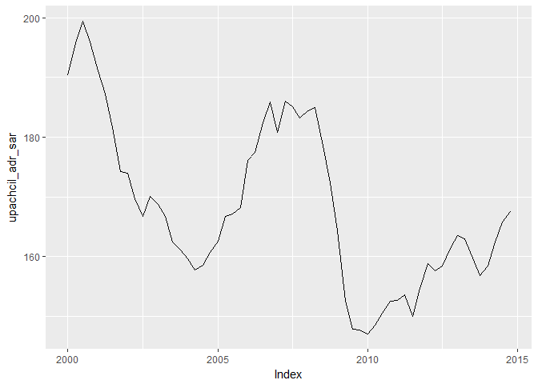
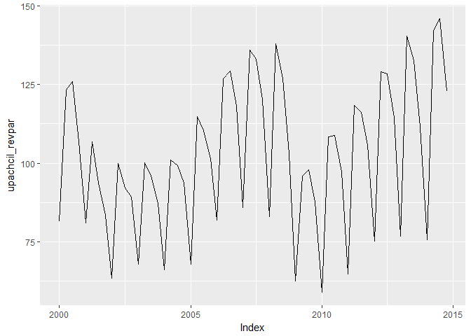
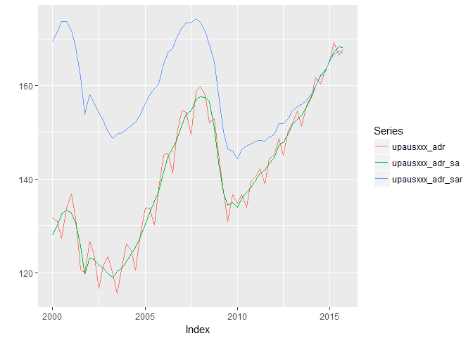

# create_ushist
Tourism Economics  

This had been pretty similar to create_ushist. To make this, I changed it to import the host Rdata files. I deleted the parts related to opens and closes. And removed stuff about IHG canada and mexico. And commented out the top25 piece. 

Then I went through a more thorough reworking. I realized I could do the calculation of real series across multiple countries.


Setup

```r
#read_chunk('~/Project/R projects/lodfor/scripts/functions.R')
#source('~/Project/R projects/lodfor/scripts/functions_combined.R')
library(arlodr, warn.conflicts=FALSE)
library(xts, warn.conflicts=FALSE)
library(dplyr, warn.conflicts=FALSE)
library(tidyr, warn.conflicts=FALSE)
```


Creates a us historical databank. Combines the STR data with selected macro data and calculates a few series

```r
fpath <- c("~/Project/R projects/lodfor/") 
#macro data
  load(paste(fpath,"output_data/oe_usmac_q.Rdata", sep=""))
# str data
  load(paste(fpath,"output_data/out_str_us_host_q.Rdata", sep="")) 
  load(paste(fpath,"output_data/out_str_us_host_m.Rdata", sep=""))

# put quarterly into a tidy format
temp_str_q <- out_str_us_host_q %>%
  data.frame(date=time(.), .) %>%
  # creates column called segvar that contains the column names, and one next to 
  # it with the values, dropping the time column
  gather(segvar, value, -date, na.rm = FALSE) %>%
  # separates out the variables
  separate(segvar, c("seg", "variable"), sep = "_", extra="merge") %>%
  separate(variable, c("area_sh", "variable"), sep = "_", extra="merge") %>%
  separate(variable, c("country", "variable"), sep = "_", extra="merge") %>%
  # keeps everything else as columns and spreads variable into multiple 
  # columns containing the values
  spread(variable,value)

# put monthly into a tidy format
temp_str_m <- out_str_us_host_m %>%
  data.frame(date=time(.), .) %>%
  # creates column called segvar that contains the column names, and one next to 
  # it with the values, dropping the time column
  gather(segvar, value, -date, na.rm = FALSE) %>%
  # separates out the variables
  separate(segvar, c("seg", "variable"), sep = "_", extra="merge") %>%
  separate(variable, c("area_sh", "variable"), sep = "_", extra="merge") %>%
  separate(variable, c("country", "variable"), sep = "_", extra="merge") %>%
  # keeps everything else as columns and spreads variable into multiple 
  # columns containing the values
  spread(variable,value)
```

The initial steps do the quarterly databank. Monthly is done further below.

```r
# selects certain series to bring in. Others just stay in macro in case they 
# are needed in future.
temp_usmac <- oe_usmac_q %>%
  data.frame(date=time(oe_usmac_q), oe_usmac_q) %>%
  select(date, 
         us_gdp,
         us_ifix,
         us_cd,
         us_iconstr,
         us_popnipa,
         us_popw,
         us_et,
         us_up,
         us_yhat,
         us_pc,
         us_pedy,
         us_penwall,
         us_cogtp,
         us_cpi,
         us_usrecq,
         can_gdp,
         can_cpi,
         can_pc,
         mex_gdp,
         mex_cpi,
         mex_pc
         ) %>%
  read.zoo %>%
  as.xts
head(temp_usmac)
```

```
##             us_gdp us_ifix  us_cd us_iconstr us_popnipa us_popw    us_et
## 1980-01-01 1631.22 309.150 59.750    198.181     226754  166762  99862.3
## 1980-04-01 1598.15 286.775 53.300    177.166     227389  167416  98953.3
## 1980-07-01 1595.72 287.925 55.650    180.214     228070  168111  98899.0
## 1980-10-01 1625.30 297.125 57.350    190.966     228689  168694  99498.7
## 1981-01-01 1658.93 301.075 58.975    188.642     229155  169279 100239.0
## 1981-04-01 1646.82 301.225 56.700    189.510     229674  169837 100801.0
##              us_up us_yhat  us_pc us_pedy us_penwall us_cogtp  us_cpi
## 1980-01-01 6.30000 1633.50 42.398 1147.47    9238.63   59.375 79.0333
## 1980-04-01 7.33333 1642.85 43.435 1130.80    9582.46   51.750 81.7000
## 1980-07-01 7.66667 1651.75 44.449 1144.56    9985.12   53.650 83.2333
## 1980-10-01 7.40000 1660.57 45.547 1167.01   10326.50   58.775 85.5667
## 1981-01-01 7.43333 1669.62 46.675 1163.91   10522.40   61.100 87.9333
## 1981-04-01 7.40000 1679.75 47.454 1163.67   10786.20   60.200 89.7667
##            us_usrecq can_gdp can_cpi  can_pc mex_gdp  mex_cpi   mex_pc
## 1980-01-01         0  192198 42.2796 40.4810 1491.85 0.101089 0.087200
## 1980-04-01         1  191779 43.4352 41.5748 1501.59 0.106925 0.093600
## 1980-07-01         1  191712 44.6358 42.7220 1534.00 0.113918 0.103808
## 1980-10-01         0  193866 45.9055 44.0455 1578.43 0.119657 0.106044
## 1981-01-01         0  198708 47.4281 45.4805 1613.67 0.129351 0.111504
## 1981-04-01         0  200900 48.9277 46.5727 1655.48 0.137261 0.119264
```

```r
# merges dataframes. the all.=TRUE piece ensures all the rows
# in the first dataframe are included
#ushist_q <- merge(temp, out_str_us_host_q, all=TRUE) 

######################
#
# indexes everything in ushist_q
#
# ushist_ind_q <- index_q_xts(ushist_q,index_year=2005)
# 
# # look at a graph
# tempa <- ushist_ind_q$totus_occ_sa
# tempb <- ushist_ind_q$upsus_occ_sa
# tempc <- merge(tempa,tempb)
# autoplot(window(tempc, start="2000-01-01", end="2014-10-01"), facets=NULL)
```

##Converts some series to real

First set up the price deflator to use for each country
Index the personal cons price deflator to average 100 in 2014

```r
# US
us_pcindex <- index_q(temp_usmac$us_pc, index_year=2014)
names(us_pcindex) <- "us_pcindex"
autoplot.zoo(us_pcindex)
```

<!-- -->

```r
# Canada
can_pcindex <- index_q(temp_usmac$can_pc, index_year=2014)
names(can_pcindex) <- "can_pcindex"
autoplot.zoo(can_pcindex)
```

<!-- -->

```r
# Mexico
mex_pcindex <- index_q(temp_usmac$mex_pc, index_year=2014)
names(mex_pcindex) <- "mex_pcindex"
autoplot.zoo(mex_pcindex)
```

<!-- -->

```r
# combines as a dataframe
pcindex <- merge(us_pcindex, can_pcindex, mex_pcindex) %>%
  data.frame(date=time(.), .) %>%
  gather(var, value, -date, na.rm = FALSE) %>%
  separate(var, c("country", "variable"), sep = "_", extra="merge") %>%
  mutate(country = ifelse(country == "us", "usa", country)) %>%
  spread(variable, value)
```

Add the price index to the somewhat tidy dataframe and calculate real series

```r
temp_str_q1 <- temp_str_q %>%
  left_join(., pcindex, by=c("date", "country")) %>%
  mutate(adrr = (adr / pcindex)*100) %>%
  mutate(adr_sar = (adr_sa / pcindex)*100) %>%
  mutate(revparr = (revpar / pcindex)*100) %>%
  mutate(revpar_sar = (revpar_sa / pcindex)*100)
  
temp_str_q2 <- temp_str_q1 %>%
  mutate(seg = paste0(seg, area_sh)) %>%
  # drop country because I don't think it is needed anymore
  select(-country, -area_sh) %>%
  gather(variable, value, -seg, -date) %>%
  mutate(segvar = paste(seg, variable, sep="_")) %>%
  select(-seg, -variable) %>%
  spread(segvar, value)

# to remove columns that are all NA and read back to xts
str_q <- temp_str_q2[,colSums(is.na(temp_str_q2))<nrow(temp_str_q2)] %>%
 read.zoo() %>%
 xts()

autoplot.zoo(window(str_q$upachcil_adr_sar, start="2000-01-01", end="2014-10-01"))
```

<!-- -->

```r
autoplot.zoo(window(str_q$upachcil_revpar_sa, start="2000-01-01", end="2014-10-01"))
```

<!-- -->

```r
autoplot.zoo(window(str_q$upachcil_revpar, start="2000-01-01", end="2014-10-01"))
```

<!-- -->

```r
autoplot.zoo(window(str_q$luxusxxx_adr, start="2000-01-01", end="2014-10-01"))
```

<!-- -->

```r
# merges onto ushist_q
ushist_q <- merge(temp_usmac, str_q)

autoplot.zoo(window(ushist_q$upausxxx_adr, start="2000-01-01", end="2014-10-01"))
```

<!-- -->

```r
autoplot.zoo(window(ushist_q$upausxxx_adr_sa, start="2000-01-01", end="2014-10-01"))
```

<!-- -->

```r
autoplot.zoo(window(ushist_q$upausxxx_adr_sar, start="2000-01-01", end="2014-10-01"))
```

<!-- -->

```r
ushist_q_df <- ushist_q %>%
  data.frame(date=time(.), .)


# simple graph
grapht <- ushist_q_df %>%
  select(date, upausxxx_adr, upausxxx_adr_sa, upausxxx_adr_sar) %>%
  read.zoo() %>%
  xts() %>%
  window(.,start="2000-01-01", end="2015-10-01")
autoplot.zoo(grapht, facets = NULL)
```

<!-- -->

```r
# simple graph with variables for selected geo
segment <- c("upanwyny")
var1 <- paste0(segment,"_adr")
var2 <- paste0(segment,"_adr_sa")
var3 <- paste0(segment,"_adr_sar")

colnames(ushist_q)
```

```
##    [1] "us_gdp"              "us_ifix"             "us_cd"              
##    [4] "us_iconstr"          "us_popnipa"          "us_popw"            
##    [7] "us_et"               "us_up"               "us_yhat"            
##   [10] "us_pc"               "us_pedy"             "us_penwall"         
##   [13] "us_cogtp"            "us_cpi"              "us_usrecq"          
##   [16] "can_gdp"             "can_cpi"             "can_pc"             
##   [19] "mex_gdp"             "mex_cpi"             "mex_pc"             
##   [22] "luxasttx_adr"        "luxasttx_adrr"       "luxasttx_days"      
##   [25] "luxasttx_demd"       "luxasttx_demt"       "luxasttx_occ"       
##   [28] "luxasttx_pcindex"    "luxasttx_revpar"     "luxasttx_revparr"   
##   [31] "luxasttx_rmrevt"     "luxasttx_supd"       "luxasttx_supt"      
##   [34] "luxatlga_adr"        "luxatlga_adrr"       "luxatlga_days"      
##   [37] "luxatlga_demd"       "luxatlga_demt"       "luxatlga_occ"       
##   [40] "luxatlga_pcindex"    "luxatlga_revpar"     "luxatlga_revparr"   
##   [43] "luxatlga_rmrevt"     "luxatlga_supd"       "luxatlga_supt"      
##   [46] "luxbstma_adr"        "luxbstma_adrr"       "luxbstma_days"      
##   [49] "luxbstma_demd"       "luxbstma_demt"       "luxbstma_occ"       
##   [52] "luxbstma_pcindex"    "luxbstma_revpar"     "luxbstma_revparr"   
##   [55] "luxbstma_rmrevt"     "luxbstma_supd"       "luxbstma_supt"      
##   [58] "luxchcil_adr"        "luxchcil_adrr"       "luxchcil_days"      
##   [61] "luxchcil_demd"       "luxchcil_demt"       "luxchcil_occ"       
##   [64] "luxchcil_pcindex"    "luxchcil_revpar"     "luxchcil_revparr"   
##   [67] "luxchcil_rmrevt"     "luxchcil_supd"       "luxchcil_supt"      
##   [70] "luxdlltx_adr"        "luxdlltx_adrr"       "luxdlltx_days"      
##   [73] "luxdlltx_demd"       "luxdlltx_demt"       "luxdlltx_occ"       
##   [76] "luxdlltx_pcindex"    "luxdlltx_revpar"     "luxdlltx_revparr"   
##   [79] "luxdlltx_rmrevt"     "luxdlltx_supd"       "luxdlltx_supt"      
##   [82] "luxdnvco_adr"        "luxdnvco_adrr"       "luxdnvco_days"      
##   [85] "luxdnvco_demd"       "luxdnvco_demt"       "luxdnvco_occ"       
##   [88] "luxdnvco_pcindex"    "luxdnvco_revpar"     "luxdnvco_revparr"   
##   [91] "luxdnvco_rmrevt"     "luxdnvco_supd"       "luxdnvco_supt"      
##   [94] "luxhnlhi_adr"        "luxhnlhi_adrr"       "luxhnlhi_days"      
##   [97] "luxhnlhi_demd"       "luxhnlhi_demt"       "luxhnlhi_occ"       
##  [100] "luxhnlhi_pcindex"    "luxhnlhi_revpar"     "luxhnlhi_revparr"   
##  [103] "luxhnlhi_rmrevt"     "luxhnlhi_supd"       "luxhnlhi_supt"      
##  [106] "luxhsttx_adr"        "luxhsttx_adrr"       "luxhsttx_days"      
##  [109] "luxhsttx_demd"       "luxhsttx_demt"       "luxhsttx_occ"       
##  [112] "luxhsttx_pcindex"    "luxhsttx_revpar"     "luxhsttx_revparr"   
##  [115] "luxhsttx_rmrevt"     "luxhsttx_supd"       "luxhsttx_supt"      
##  [118] "luxkhlhi_adr"        "luxkhlhi_adrr"       "luxkhlhi_days"      
##  [121] "luxkhlhi_demd"       "luxkhlhi_demt"       "luxkhlhi_occ"       
##  [124] "luxkhlhi_pcindex"    "luxkhlhi_revpar"     "luxkhlhi_revparr"   
##  [127] "luxkhlhi_rmrevt"     "luxkhlhi_supd"       "luxkhlhi_supt"      
##  [130] "luxlsaca_adr"        "luxlsaca_adrr"       "luxlsaca_days"      
##  [133] "luxlsaca_demd"       "luxlsaca_demt"       "luxlsaca_occ"       
##  [136] "luxlsaca_pcindex"    "luxlsaca_revpar"     "luxlsaca_revparr"   
##  [139] "luxlsaca_rmrevt"     "luxlsaca_supd"       "luxlsaca_supt"      
##  [142] "luxmimfl_adr"        "luxmimfl_adrr"       "luxmimfl_days"      
##  [145] "luxmimfl_demd"       "luxmimfl_demt"       "luxmimfl_occ"       
##  [148] "luxmimfl_pcindex"    "luxmimfl_revpar"     "luxmimfl_revparr"   
##  [151] "luxmimfl_rmrevt"     "luxmimfl_supd"       "luxmimfl_supt"      
##  [154] "luxmnnmn_adr"        "luxmnnmn_adrr"       "luxmnnmn_days"      
##  [157] "luxmnnmn_demd"       "luxmnnmn_demt"       "luxmnnmn_occ"       
##  [160] "luxmnnmn_pcindex"    "luxmnnmn_revpar"     "luxmnnmn_revparr"   
##  [163] "luxmnnmn_rmrevt"     "luxmnnmn_supd"       "luxmnnmn_supt"      
##  [166] "luxmouhi_adr"        "luxmouhi_adrr"       "luxmouhi_days"      
##  [169] "luxmouhi_demd"       "luxmouhi_demt"       "luxmouhi_occ"       
##  [172] "luxmouhi_pcindex"    "luxmouhi_revpar"     "luxmouhi_revparr"   
##  [175] "luxmouhi_rmrevt"     "luxmouhi_supd"       "luxmouhi_supt"      
##  [178] "luxmxcmx_adr"        "luxmxcmx_adrr"       "luxmxcmx_days"      
##  [181] "luxmxcmx_demd"       "luxmxcmx_demt"       "luxmxcmx_occ"       
##  [184] "luxmxcmx_pcindex"    "luxmxcmx_revpar"     "luxmxcmx_revparr"   
##  [187] "luxmxcmx_rmrevt"     "luxmxcmx_supd"       "luxmxcmx_supt"      
##  [190] "luxnwola_adr"        "luxnwola_adrr"       "luxnwola_days"      
##  [193] "luxnwola_demd"       "luxnwola_demt"       "luxnwola_occ"       
##  [196] "luxnwola_pcindex"    "luxnwola_revpar"     "luxnwola_revparr"   
##  [199] "luxnwola_rmrevt"     "luxnwola_supd"       "luxnwola_supt"      
##  [202] "luxnwyny_adr"        "luxnwyny_adrr"       "luxnwyny_days"      
##  [205] "luxnwyny_demd"       "luxnwyny_demt"       "luxnwyny_occ"       
##  [208] "luxnwyny_pcindex"    "luxnwyny_revpar"     "luxnwyny_revparr"   
##  [211] "luxnwyny_rmrevt"     "luxnwyny_supd"       "luxnwyny_supt"      
##  [214] "luxorgca_adr"        "luxorgca_adrr"       "luxorgca_days"      
##  [217] "luxorgca_demd"       "luxorgca_demt"       "luxorgca_occ"       
##  [220] "luxorgca_pcindex"    "luxorgca_revpar"     "luxorgca_revparr"   
##  [223] "luxorgca_rmrevt"     "luxorgca_supd"       "luxorgca_supt"      
##  [226] "luxorlfl_adr"        "luxorlfl_adrr"       "luxorlfl_days"      
##  [229] "luxorlfl_demd"       "luxorlfl_demt"       "luxorlfl_occ"       
##  [232] "luxorlfl_pcindex"    "luxorlfl_revpar"     "luxorlfl_revparr"   
##  [235] "luxorlfl_rmrevt"     "luxorlfl_supd"       "luxorlfl_supt"      
##  [238] "luxphlpa_adr"        "luxphlpa_adrr"       "luxphlpa_days"      
##  [241] "luxphlpa_demd"       "luxphlpa_demt"       "luxphlpa_occ"       
##  [244] "luxphlpa_pcindex"    "luxphlpa_revpar"     "luxphlpa_revparr"   
##  [247] "luxphlpa_rmrevt"     "luxphlpa_supd"       "luxphlpa_supt"      
##  [250] "luxphnaz_adr"        "luxphnaz_adrr"       "luxphnaz_days"      
##  [253] "luxphnaz_demd"       "luxphnaz_demt"       "luxphnaz_occ"       
##  [256] "luxphnaz_pcindex"    "luxphnaz_revpar"     "luxphnaz_revparr"   
##  [259] "luxphnaz_rmrevt"     "luxphnaz_supd"       "luxphnaz_supt"      
##  [262] "luxsfjca_adr"        "luxsfjca_adrr"       "luxsfjca_days"      
##  [265] "luxsfjca_demd"       "luxsfjca_demt"       "luxsfjca_occ"       
##  [268] "luxsfjca_pcindex"    "luxsfjca_revpar"     "luxsfjca_revparr"   
##  [271] "luxsfjca_rmrevt"     "luxsfjca_supd"       "luxsfjca_supt"      
##  [274] "luxsnatx_adr"        "luxsnatx_adrr"       "luxsnatx_days"      
##  [277] "luxsnatx_demd"       "luxsnatx_demt"       "luxsnatx_occ"       
##  [280] "luxsnatx_pcindex"    "luxsnatx_revpar"     "luxsnatx_revparr"   
##  [283] "luxsnatx_rmrevt"     "luxsnatx_supd"       "luxsnatx_supt"      
##  [286] "luxsndca_adr"        "luxsndca_adrr"       "luxsndca_days"      
##  [289] "luxsndca_demd"       "luxsndca_demt"       "luxsndca_occ"       
##  [292] "luxsndca_pcindex"    "luxsndca_revpar"     "luxsndca_revparr"   
##  [295] "luxsndca_rmrevt"     "luxsndca_supd"       "luxsndca_supt"      
##  [298] "luxsnfca_adr"        "luxsnfca_adrr"       "luxsnfca_days"      
##  [301] "luxsnfca_demd"       "luxsnfca_demt"       "luxsnfca_occ"       
##  [304] "luxsnfca_pcindex"    "luxsnfca_revpar"     "luxsnfca_revparr"   
##  [307] "luxsnfca_rmrevt"     "luxsnfca_supd"       "luxsnfca_supt"      
##  [310] "luxsnjca_adr"        "luxsnjca_adrr"       "luxsnjca_days"      
##  [313] "luxsnjca_demd"       "luxsnjca_demt"       "luxsnjca_occ"       
##  [316] "luxsnjca_pcindex"    "luxsnjca_revpar"     "luxsnjca_revparr"   
##  [319] "luxsnjca_rmrevt"     "luxsnjca_supd"       "luxsnjca_supt"      
##  [322] "luxsttwa_adr"        "luxsttwa_adrr"       "luxsttwa_days"      
##  [325] "luxsttwa_demd"       "luxsttwa_demt"       "luxsttwa_occ"       
##  [328] "luxsttwa_pcindex"    "luxsttwa_revpar"     "luxsttwa_revparr"   
##  [331] "luxsttwa_rmrevt"     "luxsttwa_supd"       "luxsttwa_supt"      
##  [334] "luxtorcn_adr"        "luxtorcn_adrr"       "luxtorcn_days"      
##  [337] "luxtorcn_demd"       "luxtorcn_demt"       "luxtorcn_occ"       
##  [340] "luxtorcn_pcindex"    "luxtorcn_revpar"     "luxtorcn_revparr"   
##  [343] "luxtorcn_rmrevt"     "luxtorcn_supd"       "luxtorcn_supt"      
##  [346] "luxusxxx_adr"        "luxusxxx_adrr"       "luxusxxx_days"      
##  [349] "luxusxxx_demd"       "luxusxxx_demt"       "luxusxxx_occ"       
##  [352] "luxusxxx_pcindex"    "luxusxxx_revpar"     "luxusxxx_revparr"   
##  [355] "luxusxxx_rmrevt"     "luxusxxx_supd"       "luxusxxx_supt"      
##  [358] "luxwshdc_adr"        "luxwshdc_adrr"       "luxwshdc_days"      
##  [361] "luxwshdc_demd"       "luxwshdc_demt"       "luxwshdc_occ"       
##  [364] "luxwshdc_pcindex"    "luxwshdc_revpar"     "luxwshdc_revparr"   
##  [367] "luxwshdc_rmrevt"     "luxwshdc_supd"       "luxwshdc_supt"      
##  [370] "totasttx_adr"        "totasttx_adrr"       "totasttx_days"      
##  [373] "totasttx_demd"       "totasttx_demt"       "totasttx_occ"       
##  [376] "totasttx_pcindex"    "totasttx_revpar"     "totasttx_revparr"   
##  [379] "totasttx_rmrevt"     "totasttx_supd"       "totasttx_supt"      
##  [382] "totatlga_adr"        "totatlga_adrr"       "totatlga_days"      
##  [385] "totatlga_demd"       "totatlga_demt"       "totatlga_occ"       
##  [388] "totatlga_pcindex"    "totatlga_revpar"     "totatlga_revparr"   
##  [391] "totatlga_rmrevt"     "totatlga_supd"       "totatlga_supt"      
##  [394] "totbltmd_adr"        "totbltmd_adrr"       "totbltmd_days"      
##  [397] "totbltmd_demd"       "totbltmd_demt"       "totbltmd_occ"       
##  [400] "totbltmd_pcindex"    "totbltmd_revpar"     "totbltmd_revparr"   
##  [403] "totbltmd_rmrevt"     "totbltmd_supd"       "totbltmd_supt"      
##  [406] "totbstma_adr"        "totbstma_adrr"       "totbstma_days"      
##  [409] "totbstma_demd"       "totbstma_demt"       "totbstma_occ"       
##  [412] "totbstma_pcindex"    "totbstma_revpar"     "totbstma_revparr"   
##  [415] "totbstma_rmrevt"     "totbstma_supd"       "totbstma_supt"      
##  [418] "totcalcn_adr"        "totcalcn_adrr"       "totcalcn_days"      
##  [421] "totcalcn_demd"       "totcalcn_demt"       "totcalcn_occ"       
##  [424] "totcalcn_pcindex"    "totcalcn_revpar"     "totcalcn_revparr"   
##  [427] "totcalcn_rmrevt"     "totcalcn_supd"       "totcalcn_supt"      
##  [430] "totchcil_adr"        "totchcil_adrr"       "totchcil_days"      
##  [433] "totchcil_demd"       "totchcil_demt"       "totchcil_occ"       
##  [436] "totchcil_pcindex"    "totchcil_revpar"     "totchcil_revparr"   
##  [439] "totchcil_rmrevt"     "totchcil_supd"       "totchcil_supt"      
##  [442] "totchrnc_adr"        "totchrnc_adrr"       "totchrnc_days"      
##  [445] "totchrnc_demd"       "totchrnc_demt"       "totchrnc_occ"       
##  [448] "totchrnc_pcindex"    "totchrnc_revpar"     "totchrnc_revparr"   
##  [451] "totchrnc_rmrevt"     "totchrnc_supd"       "totchrnc_supt"      
##  [454] "totchrsc_adr"        "totchrsc_adrr"       "totchrsc_days"      
##  [457] "totchrsc_demd"       "totchrsc_demt"       "totchrsc_occ"       
##  [460] "totchrsc_pcindex"    "totchrsc_revpar"     "totchrsc_revparr"   
##  [463] "totchrsc_rmrevt"     "totchrsc_supd"       "totchrsc_supt"      
##  [466] "totdlltx_adr"        "totdlltx_adrr"       "totdlltx_days"      
##  [469] "totdlltx_demd"       "totdlltx_demt"       "totdlltx_occ"       
##  [472] "totdlltx_pcindex"    "totdlltx_revpar"     "totdlltx_revparr"   
##  [475] "totdlltx_rmrevt"     "totdlltx_supd"       "totdlltx_supt"      
##  [478] "totdnvco_adr"        "totdnvco_adrr"       "totdnvco_days"      
##  [481] "totdnvco_demd"       "totdnvco_demt"       "totdnvco_occ"       
##  [484] "totdnvco_pcindex"    "totdnvco_revpar"     "totdnvco_revparr"   
##  [487] "totdnvco_rmrevt"     "totdnvco_supd"       "totdnvco_supt"      
##  [490] "tothnlhi_adr"        "tothnlhi_adrr"       "tothnlhi_days"      
##  [493] "tothnlhi_demd"       "tothnlhi_demt"       "tothnlhi_occ"       
##  [496] "tothnlhi_pcindex"    "tothnlhi_revpar"     "tothnlhi_revparr"   
##  [499] "tothnlhi_rmrevt"     "tothnlhi_supd"       "tothnlhi_supt"      
##  [502] "tothsttx_adr"        "tothsttx_adrr"       "tothsttx_days"      
##  [505] "tothsttx_demd"       "tothsttx_demt"       "tothsttx_occ"       
##  [508] "tothsttx_pcindex"    "tothsttx_revpar"     "tothsttx_revparr"   
##  [511] "tothsttx_rmrevt"     "tothsttx_supd"       "tothsttx_supt"      
##  [514] "totindin_adr"        "totindin_adrr"       "totindin_days"      
##  [517] "totindin_demd"       "totindin_demt"       "totindin_occ"       
##  [520] "totindin_pcindex"    "totindin_revpar"     "totindin_revparr"   
##  [523] "totindin_rmrevt"     "totindin_supd"       "totindin_supt"      
##  [526] "totkhlhi_adr"        "totkhlhi_adrr"       "totkhlhi_days"      
##  [529] "totkhlhi_demd"       "totkhlhi_demt"       "totkhlhi_occ"       
##  [532] "totkhlhi_pcindex"    "totkhlhi_revpar"     "totkhlhi_revparr"   
##  [535] "totkhlhi_rmrevt"     "totkhlhi_supd"       "totkhlhi_supt"      
##  [538] "totlsaca_adr"        "totlsaca_adrr"       "totlsaca_days"      
##  [541] "totlsaca_demd"       "totlsaca_demt"       "totlsaca_occ"       
##  [544] "totlsaca_pcindex"    "totlsaca_revpar"     "totlsaca_revparr"   
##  [547] "totlsaca_rmrevt"     "totlsaca_supd"       "totlsaca_supt"      
##  [550] "totmimfl_adr"        "totmimfl_adrr"       "totmimfl_days"      
##  [553] "totmimfl_demd"       "totmimfl_demt"       "totmimfl_occ"       
##  [556] "totmimfl_pcindex"    "totmimfl_revpar"     "totmimfl_revparr"   
##  [559] "totmimfl_rmrevt"     "totmimfl_supd"       "totmimfl_supt"      
##  [562] "totmmptn_adr"        "totmmptn_adrr"       "totmmptn_days"      
##  [565] "totmmptn_demd"       "totmmptn_demt"       "totmmptn_occ"       
##  [568] "totmmptn_pcindex"    "totmmptn_revpar"     "totmmptn_revparr"   
##  [571] "totmmptn_rmrevt"     "totmmptn_supd"       "totmmptn_supt"      
##  [574] "totmnnmn_adr"        "totmnnmn_adrr"       "totmnnmn_days"      
##  [577] "totmnnmn_demd"       "totmnnmn_demt"       "totmnnmn_occ"       
##  [580] "totmnnmn_pcindex"    "totmnnmn_revpar"     "totmnnmn_revparr"   
##  [583] "totmnnmn_rmrevt"     "totmnnmn_supd"       "totmnnmn_supt"      
##  [586] "totmouhi_adr"        "totmouhi_adrr"       "totmouhi_days"      
##  [589] "totmouhi_demd"       "totmouhi_demt"       "totmouhi_occ"       
##  [592] "totmouhi_pcindex"    "totmouhi_revpar"     "totmouhi_revparr"   
##  [595] "totmouhi_rmrevt"     "totmouhi_supd"       "totmouhi_supt"      
##  [598] "totmxcmx_adr"        "totmxcmx_adrr"       "totmxcmx_days"      
##  [601] "totmxcmx_demd"       "totmxcmx_demt"       "totmxcmx_occ"       
##  [604] "totmxcmx_pcindex"    "totmxcmx_revpar"     "totmxcmx_revparr"   
##  [607] "totmxcmx_rmrevt"     "totmxcmx_supd"       "totmxcmx_supt"      
##  [610] "totnshtn_adr"        "totnshtn_adrr"       "totnshtn_days"      
##  [613] "totnshtn_demd"       "totnshtn_demt"       "totnshtn_occ"       
##  [616] "totnshtn_pcindex"    "totnshtn_revpar"     "totnshtn_revparr"   
##  [619] "totnshtn_rmrevt"     "totnshtn_supd"       "totnshtn_supt"      
##  [622] "totnwola_adr"        "totnwola_adrr"       "totnwola_days"      
##  [625] "totnwola_demd"       "totnwola_demt"       "totnwola_occ"       
##  [628] "totnwola_pcindex"    "totnwola_revpar"     "totnwola_revparr"   
##  [631] "totnwola_rmrevt"     "totnwola_supd"       "totnwola_supt"      
##  [634] "totnwyny_adr"        "totnwyny_adrr"       "totnwyny_days"      
##  [637] "totnwyny_demd"       "totnwyny_demt"       "totnwyny_occ"       
##  [640] "totnwyny_pcindex"    "totnwyny_revpar"     "totnwyny_revparr"   
##  [643] "totnwyny_rmrevt"     "totnwyny_supd"       "totnwyny_supt"      
##  [646] "totoklca_adr"        "totoklca_adr_sa"     "totoklca_adr_sar"   
##  [649] "totoklca_adr_sf"     "totoklca_adrr"       "totoklca_days"      
##  [652] "totoklca_demar_sa"   "totoklca_demd"       "totoklca_demd_sa"   
##  [655] "totoklca_demd_sf"    "totoklca_demt"       "totoklca_occ"       
##  [658] "totoklca_occ_sa"     "totoklca_occ_sf"     "totoklca_pcindex"   
##  [661] "totoklca_revpar"     "totoklca_revpar_sa"  "totoklca_revpar_sar"
##  [664] "totoklca_revpar_sf"  "totoklca_revparr"    "totoklca_rmrevt"    
##  [667] "totoklca_supd"       "totoklca_supd_sa"    "totoklca_supd_sf"   
##  [670] "totoklca_supt"       "totorgca_adr"        "totorgca_adrr"      
##  [673] "totorgca_days"       "totorgca_demd"       "totorgca_demt"      
##  [676] "totorgca_occ"        "totorgca_pcindex"    "totorgca_revpar"    
##  [679] "totorgca_revparr"    "totorgca_rmrevt"     "totorgca_supd"      
##  [682] "totorgca_supt"       "totorlfl_adr"        "totorlfl_adrr"      
##  [685] "totorlfl_days"       "totorlfl_demd"       "totorlfl_demt"      
##  [688] "totorlfl_occ"        "totorlfl_pcindex"    "totorlfl_revpar"    
##  [691] "totorlfl_revparr"    "totorlfl_rmrevt"     "totorlfl_supd"      
##  [694] "totorlfl_supt"       "totphlpa_adr"        "totphlpa_adrr"      
##  [697] "totphlpa_days"       "totphlpa_demd"       "totphlpa_demt"      
##  [700] "totphlpa_occ"        "totphlpa_pcindex"    "totphlpa_revpar"    
##  [703] "totphlpa_revparr"    "totphlpa_rmrevt"     "totphlpa_supd"      
##  [706] "totphlpa_supt"       "totphnaz_adr"        "totphnaz_adrr"      
##  [709] "totphnaz_days"       "totphnaz_demd"       "totphnaz_demt"      
##  [712] "totphnaz_occ"        "totphnaz_pcindex"    "totphnaz_revpar"    
##  [715] "totphnaz_revparr"    "totphnaz_rmrevt"     "totphnaz_supd"      
##  [718] "totphnaz_supt"       "totprtor_adr"        "totprtor_adrr"      
##  [721] "totprtor_days"       "totprtor_demd"       "totprtor_demt"      
##  [724] "totprtor_occ"        "totprtor_pcindex"    "totprtor_revpar"    
##  [727] "totprtor_revparr"    "totprtor_rmrevt"     "totprtor_supd"      
##  [730] "totprtor_supt"       "totrlgnc_adr"        "totrlgnc_adrr"      
##  [733] "totrlgnc_days"       "totrlgnc_demd"       "totrlgnc_demt"      
##  [736] "totrlgnc_occ"        "totrlgnc_pcindex"    "totrlgnc_revpar"    
##  [739] "totrlgnc_revparr"    "totrlgnc_rmrevt"     "totrlgnc_supd"      
##  [742] "totrlgnc_supt"       "totsfjca_adr"        "totsfjca_adrr"      
##  [745] "totsfjca_days"       "totsfjca_demd"       "totsfjca_demt"      
##  [748] "totsfjca_occ"        "totsfjca_pcindex"    "totsfjca_revpar"    
##  [751] "totsfjca_revparr"    "totsfjca_rmrevt"     "totsfjca_supd"      
##  [754] "totsfjca_supt"       "totslcut_adr"        "totslcut_adrr"      
##  [757] "totslcut_days"       "totslcut_demd"       "totslcut_demt"      
##  [760] "totslcut_occ"        "totslcut_pcindex"    "totslcut_revpar"    
##  [763] "totslcut_revparr"    "totslcut_rmrevt"     "totslcut_supd"      
##  [766] "totslcut_supt"       "totsnatx_adr"        "totsnatx_adrr"      
##  [769] "totsnatx_days"       "totsnatx_demd"       "totsnatx_demt"      
##  [772] "totsnatx_occ"        "totsnatx_pcindex"    "totsnatx_revpar"    
##  [775] "totsnatx_revparr"    "totsnatx_rmrevt"     "totsnatx_supd"      
##  [778] "totsnatx_supt"       "totsndca_adr"        "totsndca_adrr"      
##  [781] "totsndca_days"       "totsndca_demd"       "totsndca_demt"      
##  [784] "totsndca_occ"        "totsndca_pcindex"    "totsndca_revpar"    
##  [787] "totsndca_revparr"    "totsndca_rmrevt"     "totsndca_supd"      
##  [790] "totsndca_supt"       "totsnfca_adr"        "totsnfca_adrr"      
##  [793] "totsnfca_days"       "totsnfca_demd"       "totsnfca_demt"      
##  [796] "totsnfca_occ"        "totsnfca_pcindex"    "totsnfca_revpar"    
##  [799] "totsnfca_revparr"    "totsnfca_rmrevt"     "totsnfca_supd"      
##  [802] "totsnfca_supt"       "totsnjca_adr"        "totsnjca_adrr"      
##  [805] "totsnjca_days"       "totsnjca_demd"       "totsnjca_demt"      
##  [808] "totsnjca_occ"        "totsnjca_pcindex"    "totsnjca_revpar"    
##  [811] "totsnjca_revparr"    "totsnjca_rmrevt"     "totsnjca_supd"      
##  [814] "totsnjca_supt"       "totsttwa_adr"        "totsttwa_adrr"      
##  [817] "totsttwa_days"       "totsttwa_demd"       "totsttwa_demt"      
##  [820] "totsttwa_occ"        "totsttwa_pcindex"    "totsttwa_revpar"    
##  [823] "totsttwa_revparr"    "totsttwa_rmrevt"     "totsttwa_supd"      
##  [826] "totsttwa_supt"       "tottmpfl_adr"        "tottmpfl_adrr"      
##  [829] "tottmpfl_days"       "tottmpfl_demd"       "tottmpfl_demt"      
##  [832] "tottmpfl_occ"        "tottmpfl_pcindex"    "tottmpfl_revpar"    
##  [835] "tottmpfl_revparr"    "tottmpfl_rmrevt"     "tottmpfl_supd"      
##  [838] "tottmpfl_supt"       "tottorcn_adr"        "tottorcn_adrr"      
##  [841] "tottorcn_days"       "tottorcn_demd"       "tottorcn_demt"      
##  [844] "tottorcn_occ"        "tottorcn_pcindex"    "tottorcn_revpar"    
##  [847] "tottorcn_revparr"    "tottorcn_rmrevt"     "tottorcn_supd"      
##  [850] "tottorcn_supt"       "totusxxx_adr"        "totusxxx_adrr"      
##  [853] "totusxxx_days"       "totusxxx_demd"       "totusxxx_demt"      
##  [856] "totusxxx_occ"        "totusxxx_pcindex"    "totusxxx_revpar"    
##  [859] "totusxxx_revparr"    "totusxxx_rmrevt"     "totusxxx_supd"      
##  [862] "totusxxx_supt"       "totvnccn_adr"        "totvnccn_adrr"      
##  [865] "totvnccn_days"       "totvnccn_demd"       "totvnccn_demt"      
##  [868] "totvnccn_occ"        "totvnccn_pcindex"    "totvnccn_revpar"    
##  [871] "totvnccn_revparr"    "totvnccn_rmrevt"     "totvnccn_supd"      
##  [874] "totvnccn_supt"       "totwshdc_adr"        "totwshdc_adrr"      
##  [877] "totwshdc_days"       "totwshdc_demd"       "totwshdc_demt"      
##  [880] "totwshdc_occ"        "totwshdc_pcindex"    "totwshdc_revpar"    
##  [883] "totwshdc_revparr"    "totwshdc_rmrevt"     "totwshdc_supd"      
##  [886] "totwshdc_supt"       "upaasttx_adr"        "upaasttx_adr_sa"    
##  [889] "upaasttx_adr_sar"    "upaasttx_adr_sf"     "upaasttx_adrr"      
##  [892] "upaasttx_days"       "upaasttx_demar_sa"   "upaasttx_demd"      
##  [895] "upaasttx_demd_sa"    "upaasttx_demd_sf"    "upaasttx_demt"      
##  [898] "upaasttx_occ"        "upaasttx_occ_sa"     "upaasttx_occ_sf"    
##  [901] "upaasttx_pcindex"    "upaasttx_revpar"     "upaasttx_revpar_sa" 
##  [904] "upaasttx_revpar_sar" "upaasttx_revpar_sf"  "upaasttx_revparr"   
##  [907] "upaasttx_rmrevt"     "upaasttx_supd"       "upaasttx_supd_sa"   
##  [910] "upaasttx_supd_sf"    "upaasttx_supt"       "upaatlga_adr"       
##  [913] "upaatlga_adr_sa"     "upaatlga_adr_sar"    "upaatlga_adr_sf"    
##  [916] "upaatlga_adrr"       "upaatlga_days"       "upaatlga_demar_sa"  
##  [919] "upaatlga_demd"       "upaatlga_demd_sa"    "upaatlga_demd_sf"   
##  [922] "upaatlga_demt"       "upaatlga_occ"        "upaatlga_occ_sa"    
##  [925] "upaatlga_occ_sf"     "upaatlga_pcindex"    "upaatlga_revpar"    
##  [928] "upaatlga_revpar_sa"  "upaatlga_revpar_sar" "upaatlga_revpar_sf" 
##  [931] "upaatlga_revparr"    "upaatlga_rmrevt"     "upaatlga_supd"      
##  [934] "upaatlga_supd_sa"    "upaatlga_supd_sf"    "upaatlga_supt"      
##  [937] "upabltmd_adr"        "upabltmd_adrr"       "upabltmd_days"      
##  [940] "upabltmd_demd"       "upabltmd_demt"       "upabltmd_occ"       
##  [943] "upabltmd_pcindex"    "upabltmd_revpar"     "upabltmd_revparr"   
##  [946] "upabltmd_rmrevt"     "upabltmd_supd"       "upabltmd_supt"      
##  [949] "upabstma_adr"        "upabstma_adr_sa"     "upabstma_adr_sar"   
##  [952] "upabstma_adr_sf"     "upabstma_adrr"       "upabstma_days"      
##  [955] "upabstma_demar_sa"   "upabstma_demd"       "upabstma_demd_sa"   
##  [958] "upabstma_demd_sf"    "upabstma_demt"       "upabstma_occ"       
##  [961] "upabstma_occ_sa"     "upabstma_occ_sf"     "upabstma_pcindex"   
##  [964] "upabstma_revpar"     "upabstma_revpar_sa"  "upabstma_revpar_sar"
##  [967] "upabstma_revpar_sf"  "upabstma_revparr"    "upabstma_rmrevt"    
##  [970] "upabstma_supd"       "upabstma_supd_sa"    "upabstma_supd_sf"   
##  [973] "upabstma_supt"       "upacalcn_adr"        "upacalcn_adr_sa"    
##  [976] "upacalcn_adr_sar"    "upacalcn_adr_sf"     "upacalcn_adrr"      
##  [979] "upacalcn_days"       "upacalcn_demar_sa"   "upacalcn_demd"      
##  [982] "upacalcn_demd_sa"    "upacalcn_demd_sf"    "upacalcn_demt"      
##  [985] "upacalcn_occ"        "upacalcn_occ_sa"     "upacalcn_occ_sf"    
##  [988] "upacalcn_pcindex"    "upacalcn_revpar"     "upacalcn_revpar_sa" 
##  [991] "upacalcn_revpar_sar" "upacalcn_revpar_sf"  "upacalcn_revparr"   
##  [994] "upacalcn_rmrevt"     "upacalcn_supd"       "upacalcn_supd_sa"   
##  [997] "upacalcn_supd_sf"    "upacalcn_supt"       "upachcil_adr"       
## [1000] "upachcil_adr_sa"    
##  [ reached getOption("max.print") -- omitted 1883 entries ]
```

```r
grapht <- ushist_q_df %>%
  select(date, get(var1), get(var2), get(var3)) %>%
  read.zoo() %>%
  xts() %>%
  window(.,start="2000-01-01", end="2015-10-01")
autoplot.zoo(grapht, facets = NULL)
```

<!-- -->


Looking at what's in quarterly databank

```r
# which segments or markets are in the data frame, just for observation
# not used anywhere
a <- grep(pattern="_demt", colnames(ushist_q), value=TRUE)
a
```

```
##   [1] "luxasttx_demt" "luxatlga_demt" "luxbstma_demt" "luxchcil_demt"
##   [5] "luxdlltx_demt" "luxdnvco_demt" "luxhnlhi_demt" "luxhsttx_demt"
##   [9] "luxkhlhi_demt" "luxlsaca_demt" "luxmimfl_demt" "luxmnnmn_demt"
##  [13] "luxmouhi_demt" "luxmxcmx_demt" "luxnwola_demt" "luxnwyny_demt"
##  [17] "luxorgca_demt" "luxorlfl_demt" "luxphlpa_demt" "luxphnaz_demt"
##  [21] "luxsfjca_demt" "luxsnatx_demt" "luxsndca_demt" "luxsnfca_demt"
##  [25] "luxsnjca_demt" "luxsttwa_demt" "luxtorcn_demt" "luxusxxx_demt"
##  [29] "luxwshdc_demt" "totasttx_demt" "totatlga_demt" "totbltmd_demt"
##  [33] "totbstma_demt" "totcalcn_demt" "totchcil_demt" "totchrnc_demt"
##  [37] "totchrsc_demt" "totdlltx_demt" "totdnvco_demt" "tothnlhi_demt"
##  [41] "tothsttx_demt" "totindin_demt" "totkhlhi_demt" "totlsaca_demt"
##  [45] "totmimfl_demt" "totmmptn_demt" "totmnnmn_demt" "totmouhi_demt"
##  [49] "totmxcmx_demt" "totnshtn_demt" "totnwola_demt" "totnwyny_demt"
##  [53] "totoklca_demt" "totorgca_demt" "totorlfl_demt" "totphlpa_demt"
##  [57] "totphnaz_demt" "totprtor_demt" "totrlgnc_demt" "totsfjca_demt"
##  [61] "totslcut_demt" "totsnatx_demt" "totsndca_demt" "totsnfca_demt"
##  [65] "totsnjca_demt" "totsttwa_demt" "tottmpfl_demt" "tottorcn_demt"
##  [69] "totusxxx_demt" "totvnccn_demt" "totwshdc_demt" "upaasttx_demt"
##  [73] "upaatlga_demt" "upabltmd_demt" "upabstma_demt" "upacalcn_demt"
##  [77] "upachcil_demt" "upachrnc_demt" "upachrsc_demt" "upadlltx_demt"
##  [81] "upadnvco_demt" "upahnlhi_demt" "upahsttx_demt" "upaindin_demt"
##  [85] "upakhlhi_demt" "upalsaca_demt" "upamimfl_demt" "upammptn_demt"
##  [89] "upamnnmn_demt" "upamouhi_demt" "upamxcmx_demt" "upanshtn_demt"
##  [93] "upanwola_demt" "upanwyny_demt" "upaoklca_demt" "upaorgca_demt"
##  [97] "upaorlfl_demt" "upaphlpa_demt" "upaphnaz_demt" "upaprtor_demt"
## [101] "uparlgnc_demt" "upasfjca_demt" "upaslcut_demt" "upasnatx_demt"
## [105] "upasndca_demt" "upasnfca_demt" "upasnjca_demt" "upasttwa_demt"
## [109] "upatmpfl_demt" "upatorcn_demt" "upausxxx_demt" "upavnccn_demt"
## [113] "upawshdc_demt" "upsasttx_demt" "upsatlga_demt" "upsbltmd_demt"
## [117] "upsbstma_demt" "upschcil_demt" "upschrnc_demt" "upschrsc_demt"
## [121] "upsdlltx_demt" "upsdnvco_demt" "upshnlhi_demt" "upshsttx_demt"
## [125] "upsindin_demt" "upskhlhi_demt" "upslsaca_demt" "upsmimfl_demt"
## [129] "upsmmptn_demt" "upsmnnmn_demt" "upsmouhi_demt" "upsnshtn_demt"
## [133] "upsnwola_demt" "upsnwyny_demt" "upsoklca_demt" "upsorgca_demt"
## [137] "upsorlfl_demt" "upsphlpa_demt" "upsphnaz_demt" "upsprtor_demt"
## [141] "upsrlgnc_demt" "upssfjca_demt" "upsslcut_demt" "upssnatx_demt"
## [145] "upssndca_demt" "upssnfca_demt" "upssnjca_demt" "upssttwa_demt"
## [149] "upstmpfl_demt" "upsusxxx_demt" "upswshdc_demt" "upuasttx_demt"
## [153] "upuatlga_demt" "upubltmd_demt" "upubstma_demt" "upucalcn_demt"
## [157] "upuchcil_demt" "upuchrnc_demt" "upuchrsc_demt" "upudlltx_demt"
## [161] "upudnvco_demt" "upuhnlhi_demt" "upuhsttx_demt" "upuindin_demt"
## [165] "upukhlhi_demt" "upulsaca_demt" "upumimfl_demt" "upummptn_demt"
## [169] "upumnnmn_demt" "upumouhi_demt" "upumxcmx_demt" "upunshtn_demt"
## [173] "upunwola_demt" "upunwyny_demt" "upuoklca_demt" "upuorgca_demt"
## [177] "upuorlfl_demt" "upuphlpa_demt" "upuphnaz_demt" "upuprtor_demt"
## [181] "upurlgnc_demt" "upusfjca_demt" "upuslcut_demt" "upusnatx_demt"
## [185] "upusndca_demt" "upusnfca_demt" "upusnjca_demt" "upusttwa_demt"
## [189] "uputmpfl_demt" "uputorcn_demt" "upuusxxx_demt" "upuvnccn_demt"
## [193] "upuwshdc_demt"
```

```r
a <- gsub(pattern="_demt",replacement="",a)
a
```

```
##   [1] "luxasttx" "luxatlga" "luxbstma" "luxchcil" "luxdlltx" "luxdnvco"
##   [7] "luxhnlhi" "luxhsttx" "luxkhlhi" "luxlsaca" "luxmimfl" "luxmnnmn"
##  [13] "luxmouhi" "luxmxcmx" "luxnwola" "luxnwyny" "luxorgca" "luxorlfl"
##  [19] "luxphlpa" "luxphnaz" "luxsfjca" "luxsnatx" "luxsndca" "luxsnfca"
##  [25] "luxsnjca" "luxsttwa" "luxtorcn" "luxusxxx" "luxwshdc" "totasttx"
##  [31] "totatlga" "totbltmd" "totbstma" "totcalcn" "totchcil" "totchrnc"
##  [37] "totchrsc" "totdlltx" "totdnvco" "tothnlhi" "tothsttx" "totindin"
##  [43] "totkhlhi" "totlsaca" "totmimfl" "totmmptn" "totmnnmn" "totmouhi"
##  [49] "totmxcmx" "totnshtn" "totnwola" "totnwyny" "totoklca" "totorgca"
##  [55] "totorlfl" "totphlpa" "totphnaz" "totprtor" "totrlgnc" "totsfjca"
##  [61] "totslcut" "totsnatx" "totsndca" "totsnfca" "totsnjca" "totsttwa"
##  [67] "tottmpfl" "tottorcn" "totusxxx" "totvnccn" "totwshdc" "upaasttx"
##  [73] "upaatlga" "upabltmd" "upabstma" "upacalcn" "upachcil" "upachrnc"
##  [79] "upachrsc" "upadlltx" "upadnvco" "upahnlhi" "upahsttx" "upaindin"
##  [85] "upakhlhi" "upalsaca" "upamimfl" "upammptn" "upamnnmn" "upamouhi"
##  [91] "upamxcmx" "upanshtn" "upanwola" "upanwyny" "upaoklca" "upaorgca"
##  [97] "upaorlfl" "upaphlpa" "upaphnaz" "upaprtor" "uparlgnc" "upasfjca"
## [103] "upaslcut" "upasnatx" "upasndca" "upasnfca" "upasnjca" "upasttwa"
## [109] "upatmpfl" "upatorcn" "upausxxx" "upavnccn" "upawshdc" "upsasttx"
## [115] "upsatlga" "upsbltmd" "upsbstma" "upschcil" "upschrnc" "upschrsc"
## [121] "upsdlltx" "upsdnvco" "upshnlhi" "upshsttx" "upsindin" "upskhlhi"
## [127] "upslsaca" "upsmimfl" "upsmmptn" "upsmnnmn" "upsmouhi" "upsnshtn"
## [133] "upsnwola" "upsnwyny" "upsoklca" "upsorgca" "upsorlfl" "upsphlpa"
## [139] "upsphnaz" "upsprtor" "upsrlgnc" "upssfjca" "upsslcut" "upssnatx"
## [145] "upssndca" "upssnfca" "upssnjca" "upssttwa" "upstmpfl" "upsusxxx"
## [151] "upswshdc" "upuasttx" "upuatlga" "upubltmd" "upubstma" "upucalcn"
## [157] "upuchcil" "upuchrnc" "upuchrsc" "upudlltx" "upudnvco" "upuhnlhi"
## [163] "upuhsttx" "upuindin" "upukhlhi" "upulsaca" "upumimfl" "upummptn"
## [169] "upumnnmn" "upumouhi" "upumxcmx" "upunshtn" "upunwola" "upunwyny"
## [175] "upuoklca" "upuorgca" "upuorlfl" "upuphlpa" "upuphnaz" "upuprtor"
## [181] "upurlgnc" "upusfjca" "upuslcut" "upusnatx" "upusndca" "upusnfca"
## [187] "upusnjca" "upusttwa" "uputmpfl" "uputorcn" "upuusxxx" "upuvnccn"
## [193] "upuwshdc"
```

```r
b <- grep(pattern="totusxxx_", colnames(ushist_q), value=TRUE)
b
```

```
##  [1] "totusxxx_adr"     "totusxxx_adrr"    "totusxxx_days"   
##  [4] "totusxxx_demd"    "totusxxx_demt"    "totusxxx_occ"    
##  [7] "totusxxx_pcindex" "totusxxx_revpar"  "totusxxx_revparr"
## [10] "totusxxx_rmrevt"  "totusxxx_supd"    "totusxxx_supt"
```

```r
c <- colnames(ushist_q)
c
```

```
##    [1] "us_gdp"              "us_ifix"             "us_cd"              
##    [4] "us_iconstr"          "us_popnipa"          "us_popw"            
##    [7] "us_et"               "us_up"               "us_yhat"            
##   [10] "us_pc"               "us_pedy"             "us_penwall"         
##   [13] "us_cogtp"            "us_cpi"              "us_usrecq"          
##   [16] "can_gdp"             "can_cpi"             "can_pc"             
##   [19] "mex_gdp"             "mex_cpi"             "mex_pc"             
##   [22] "luxasttx_adr"        "luxasttx_adrr"       "luxasttx_days"      
##   [25] "luxasttx_demd"       "luxasttx_demt"       "luxasttx_occ"       
##   [28] "luxasttx_pcindex"    "luxasttx_revpar"     "luxasttx_revparr"   
##   [31] "luxasttx_rmrevt"     "luxasttx_supd"       "luxasttx_supt"      
##   [34] "luxatlga_adr"        "luxatlga_adrr"       "luxatlga_days"      
##   [37] "luxatlga_demd"       "luxatlga_demt"       "luxatlga_occ"       
##   [40] "luxatlga_pcindex"    "luxatlga_revpar"     "luxatlga_revparr"   
##   [43] "luxatlga_rmrevt"     "luxatlga_supd"       "luxatlga_supt"      
##   [46] "luxbstma_adr"        "luxbstma_adrr"       "luxbstma_days"      
##   [49] "luxbstma_demd"       "luxbstma_demt"       "luxbstma_occ"       
##   [52] "luxbstma_pcindex"    "luxbstma_revpar"     "luxbstma_revparr"   
##   [55] "luxbstma_rmrevt"     "luxbstma_supd"       "luxbstma_supt"      
##   [58] "luxchcil_adr"        "luxchcil_adrr"       "luxchcil_days"      
##   [61] "luxchcil_demd"       "luxchcil_demt"       "luxchcil_occ"       
##   [64] "luxchcil_pcindex"    "luxchcil_revpar"     "luxchcil_revparr"   
##   [67] "luxchcil_rmrevt"     "luxchcil_supd"       "luxchcil_supt"      
##   [70] "luxdlltx_adr"        "luxdlltx_adrr"       "luxdlltx_days"      
##   [73] "luxdlltx_demd"       "luxdlltx_demt"       "luxdlltx_occ"       
##   [76] "luxdlltx_pcindex"    "luxdlltx_revpar"     "luxdlltx_revparr"   
##   [79] "luxdlltx_rmrevt"     "luxdlltx_supd"       "luxdlltx_supt"      
##   [82] "luxdnvco_adr"        "luxdnvco_adrr"       "luxdnvco_days"      
##   [85] "luxdnvco_demd"       "luxdnvco_demt"       "luxdnvco_occ"       
##   [88] "luxdnvco_pcindex"    "luxdnvco_revpar"     "luxdnvco_revparr"   
##   [91] "luxdnvco_rmrevt"     "luxdnvco_supd"       "luxdnvco_supt"      
##   [94] "luxhnlhi_adr"        "luxhnlhi_adrr"       "luxhnlhi_days"      
##   [97] "luxhnlhi_demd"       "luxhnlhi_demt"       "luxhnlhi_occ"       
##  [100] "luxhnlhi_pcindex"    "luxhnlhi_revpar"     "luxhnlhi_revparr"   
##  [103] "luxhnlhi_rmrevt"     "luxhnlhi_supd"       "luxhnlhi_supt"      
##  [106] "luxhsttx_adr"        "luxhsttx_adrr"       "luxhsttx_days"      
##  [109] "luxhsttx_demd"       "luxhsttx_demt"       "luxhsttx_occ"       
##  [112] "luxhsttx_pcindex"    "luxhsttx_revpar"     "luxhsttx_revparr"   
##  [115] "luxhsttx_rmrevt"     "luxhsttx_supd"       "luxhsttx_supt"      
##  [118] "luxkhlhi_adr"        "luxkhlhi_adrr"       "luxkhlhi_days"      
##  [121] "luxkhlhi_demd"       "luxkhlhi_demt"       "luxkhlhi_occ"       
##  [124] "luxkhlhi_pcindex"    "luxkhlhi_revpar"     "luxkhlhi_revparr"   
##  [127] "luxkhlhi_rmrevt"     "luxkhlhi_supd"       "luxkhlhi_supt"      
##  [130] "luxlsaca_adr"        "luxlsaca_adrr"       "luxlsaca_days"      
##  [133] "luxlsaca_demd"       "luxlsaca_demt"       "luxlsaca_occ"       
##  [136] "luxlsaca_pcindex"    "luxlsaca_revpar"     "luxlsaca_revparr"   
##  [139] "luxlsaca_rmrevt"     "luxlsaca_supd"       "luxlsaca_supt"      
##  [142] "luxmimfl_adr"        "luxmimfl_adrr"       "luxmimfl_days"      
##  [145] "luxmimfl_demd"       "luxmimfl_demt"       "luxmimfl_occ"       
##  [148] "luxmimfl_pcindex"    "luxmimfl_revpar"     "luxmimfl_revparr"   
##  [151] "luxmimfl_rmrevt"     "luxmimfl_supd"       "luxmimfl_supt"      
##  [154] "luxmnnmn_adr"        "luxmnnmn_adrr"       "luxmnnmn_days"      
##  [157] "luxmnnmn_demd"       "luxmnnmn_demt"       "luxmnnmn_occ"       
##  [160] "luxmnnmn_pcindex"    "luxmnnmn_revpar"     "luxmnnmn_revparr"   
##  [163] "luxmnnmn_rmrevt"     "luxmnnmn_supd"       "luxmnnmn_supt"      
##  [166] "luxmouhi_adr"        "luxmouhi_adrr"       "luxmouhi_days"      
##  [169] "luxmouhi_demd"       "luxmouhi_demt"       "luxmouhi_occ"       
##  [172] "luxmouhi_pcindex"    "luxmouhi_revpar"     "luxmouhi_revparr"   
##  [175] "luxmouhi_rmrevt"     "luxmouhi_supd"       "luxmouhi_supt"      
##  [178] "luxmxcmx_adr"        "luxmxcmx_adrr"       "luxmxcmx_days"      
##  [181] "luxmxcmx_demd"       "luxmxcmx_demt"       "luxmxcmx_occ"       
##  [184] "luxmxcmx_pcindex"    "luxmxcmx_revpar"     "luxmxcmx_revparr"   
##  [187] "luxmxcmx_rmrevt"     "luxmxcmx_supd"       "luxmxcmx_supt"      
##  [190] "luxnwola_adr"        "luxnwola_adrr"       "luxnwola_days"      
##  [193] "luxnwola_demd"       "luxnwola_demt"       "luxnwola_occ"       
##  [196] "luxnwola_pcindex"    "luxnwola_revpar"     "luxnwola_revparr"   
##  [199] "luxnwola_rmrevt"     "luxnwola_supd"       "luxnwola_supt"      
##  [202] "luxnwyny_adr"        "luxnwyny_adrr"       "luxnwyny_days"      
##  [205] "luxnwyny_demd"       "luxnwyny_demt"       "luxnwyny_occ"       
##  [208] "luxnwyny_pcindex"    "luxnwyny_revpar"     "luxnwyny_revparr"   
##  [211] "luxnwyny_rmrevt"     "luxnwyny_supd"       "luxnwyny_supt"      
##  [214] "luxorgca_adr"        "luxorgca_adrr"       "luxorgca_days"      
##  [217] "luxorgca_demd"       "luxorgca_demt"       "luxorgca_occ"       
##  [220] "luxorgca_pcindex"    "luxorgca_revpar"     "luxorgca_revparr"   
##  [223] "luxorgca_rmrevt"     "luxorgca_supd"       "luxorgca_supt"      
##  [226] "luxorlfl_adr"        "luxorlfl_adrr"       "luxorlfl_days"      
##  [229] "luxorlfl_demd"       "luxorlfl_demt"       "luxorlfl_occ"       
##  [232] "luxorlfl_pcindex"    "luxorlfl_revpar"     "luxorlfl_revparr"   
##  [235] "luxorlfl_rmrevt"     "luxorlfl_supd"       "luxorlfl_supt"      
##  [238] "luxphlpa_adr"        "luxphlpa_adrr"       "luxphlpa_days"      
##  [241] "luxphlpa_demd"       "luxphlpa_demt"       "luxphlpa_occ"       
##  [244] "luxphlpa_pcindex"    "luxphlpa_revpar"     "luxphlpa_revparr"   
##  [247] "luxphlpa_rmrevt"     "luxphlpa_supd"       "luxphlpa_supt"      
##  [250] "luxphnaz_adr"        "luxphnaz_adrr"       "luxphnaz_days"      
##  [253] "luxphnaz_demd"       "luxphnaz_demt"       "luxphnaz_occ"       
##  [256] "luxphnaz_pcindex"    "luxphnaz_revpar"     "luxphnaz_revparr"   
##  [259] "luxphnaz_rmrevt"     "luxphnaz_supd"       "luxphnaz_supt"      
##  [262] "luxsfjca_adr"        "luxsfjca_adrr"       "luxsfjca_days"      
##  [265] "luxsfjca_demd"       "luxsfjca_demt"       "luxsfjca_occ"       
##  [268] "luxsfjca_pcindex"    "luxsfjca_revpar"     "luxsfjca_revparr"   
##  [271] "luxsfjca_rmrevt"     "luxsfjca_supd"       "luxsfjca_supt"      
##  [274] "luxsnatx_adr"        "luxsnatx_adrr"       "luxsnatx_days"      
##  [277] "luxsnatx_demd"       "luxsnatx_demt"       "luxsnatx_occ"       
##  [280] "luxsnatx_pcindex"    "luxsnatx_revpar"     "luxsnatx_revparr"   
##  [283] "luxsnatx_rmrevt"     "luxsnatx_supd"       "luxsnatx_supt"      
##  [286] "luxsndca_adr"        "luxsndca_adrr"       "luxsndca_days"      
##  [289] "luxsndca_demd"       "luxsndca_demt"       "luxsndca_occ"       
##  [292] "luxsndca_pcindex"    "luxsndca_revpar"     "luxsndca_revparr"   
##  [295] "luxsndca_rmrevt"     "luxsndca_supd"       "luxsndca_supt"      
##  [298] "luxsnfca_adr"        "luxsnfca_adrr"       "luxsnfca_days"      
##  [301] "luxsnfca_demd"       "luxsnfca_demt"       "luxsnfca_occ"       
##  [304] "luxsnfca_pcindex"    "luxsnfca_revpar"     "luxsnfca_revparr"   
##  [307] "luxsnfca_rmrevt"     "luxsnfca_supd"       "luxsnfca_supt"      
##  [310] "luxsnjca_adr"        "luxsnjca_adrr"       "luxsnjca_days"      
##  [313] "luxsnjca_demd"       "luxsnjca_demt"       "luxsnjca_occ"       
##  [316] "luxsnjca_pcindex"    "luxsnjca_revpar"     "luxsnjca_revparr"   
##  [319] "luxsnjca_rmrevt"     "luxsnjca_supd"       "luxsnjca_supt"      
##  [322] "luxsttwa_adr"        "luxsttwa_adrr"       "luxsttwa_days"      
##  [325] "luxsttwa_demd"       "luxsttwa_demt"       "luxsttwa_occ"       
##  [328] "luxsttwa_pcindex"    "luxsttwa_revpar"     "luxsttwa_revparr"   
##  [331] "luxsttwa_rmrevt"     "luxsttwa_supd"       "luxsttwa_supt"      
##  [334] "luxtorcn_adr"        "luxtorcn_adrr"       "luxtorcn_days"      
##  [337] "luxtorcn_demd"       "luxtorcn_demt"       "luxtorcn_occ"       
##  [340] "luxtorcn_pcindex"    "luxtorcn_revpar"     "luxtorcn_revparr"   
##  [343] "luxtorcn_rmrevt"     "luxtorcn_supd"       "luxtorcn_supt"      
##  [346] "luxusxxx_adr"        "luxusxxx_adrr"       "luxusxxx_days"      
##  [349] "luxusxxx_demd"       "luxusxxx_demt"       "luxusxxx_occ"       
##  [352] "luxusxxx_pcindex"    "luxusxxx_revpar"     "luxusxxx_revparr"   
##  [355] "luxusxxx_rmrevt"     "luxusxxx_supd"       "luxusxxx_supt"      
##  [358] "luxwshdc_adr"        "luxwshdc_adrr"       "luxwshdc_days"      
##  [361] "luxwshdc_demd"       "luxwshdc_demt"       "luxwshdc_occ"       
##  [364] "luxwshdc_pcindex"    "luxwshdc_revpar"     "luxwshdc_revparr"   
##  [367] "luxwshdc_rmrevt"     "luxwshdc_supd"       "luxwshdc_supt"      
##  [370] "totasttx_adr"        "totasttx_adrr"       "totasttx_days"      
##  [373] "totasttx_demd"       "totasttx_demt"       "totasttx_occ"       
##  [376] "totasttx_pcindex"    "totasttx_revpar"     "totasttx_revparr"   
##  [379] "totasttx_rmrevt"     "totasttx_supd"       "totasttx_supt"      
##  [382] "totatlga_adr"        "totatlga_adrr"       "totatlga_days"      
##  [385] "totatlga_demd"       "totatlga_demt"       "totatlga_occ"       
##  [388] "totatlga_pcindex"    "totatlga_revpar"     "totatlga_revparr"   
##  [391] "totatlga_rmrevt"     "totatlga_supd"       "totatlga_supt"      
##  [394] "totbltmd_adr"        "totbltmd_adrr"       "totbltmd_days"      
##  [397] "totbltmd_demd"       "totbltmd_demt"       "totbltmd_occ"       
##  [400] "totbltmd_pcindex"    "totbltmd_revpar"     "totbltmd_revparr"   
##  [403] "totbltmd_rmrevt"     "totbltmd_supd"       "totbltmd_supt"      
##  [406] "totbstma_adr"        "totbstma_adrr"       "totbstma_days"      
##  [409] "totbstma_demd"       "totbstma_demt"       "totbstma_occ"       
##  [412] "totbstma_pcindex"    "totbstma_revpar"     "totbstma_revparr"   
##  [415] "totbstma_rmrevt"     "totbstma_supd"       "totbstma_supt"      
##  [418] "totcalcn_adr"        "totcalcn_adrr"       "totcalcn_days"      
##  [421] "totcalcn_demd"       "totcalcn_demt"       "totcalcn_occ"       
##  [424] "totcalcn_pcindex"    "totcalcn_revpar"     "totcalcn_revparr"   
##  [427] "totcalcn_rmrevt"     "totcalcn_supd"       "totcalcn_supt"      
##  [430] "totchcil_adr"        "totchcil_adrr"       "totchcil_days"      
##  [433] "totchcil_demd"       "totchcil_demt"       "totchcil_occ"       
##  [436] "totchcil_pcindex"    "totchcil_revpar"     "totchcil_revparr"   
##  [439] "totchcil_rmrevt"     "totchcil_supd"       "totchcil_supt"      
##  [442] "totchrnc_adr"        "totchrnc_adrr"       "totchrnc_days"      
##  [445] "totchrnc_demd"       "totchrnc_demt"       "totchrnc_occ"       
##  [448] "totchrnc_pcindex"    "totchrnc_revpar"     "totchrnc_revparr"   
##  [451] "totchrnc_rmrevt"     "totchrnc_supd"       "totchrnc_supt"      
##  [454] "totchrsc_adr"        "totchrsc_adrr"       "totchrsc_days"      
##  [457] "totchrsc_demd"       "totchrsc_demt"       "totchrsc_occ"       
##  [460] "totchrsc_pcindex"    "totchrsc_revpar"     "totchrsc_revparr"   
##  [463] "totchrsc_rmrevt"     "totchrsc_supd"       "totchrsc_supt"      
##  [466] "totdlltx_adr"        "totdlltx_adrr"       "totdlltx_days"      
##  [469] "totdlltx_demd"       "totdlltx_demt"       "totdlltx_occ"       
##  [472] "totdlltx_pcindex"    "totdlltx_revpar"     "totdlltx_revparr"   
##  [475] "totdlltx_rmrevt"     "totdlltx_supd"       "totdlltx_supt"      
##  [478] "totdnvco_adr"        "totdnvco_adrr"       "totdnvco_days"      
##  [481] "totdnvco_demd"       "totdnvco_demt"       "totdnvco_occ"       
##  [484] "totdnvco_pcindex"    "totdnvco_revpar"     "totdnvco_revparr"   
##  [487] "totdnvco_rmrevt"     "totdnvco_supd"       "totdnvco_supt"      
##  [490] "tothnlhi_adr"        "tothnlhi_adrr"       "tothnlhi_days"      
##  [493] "tothnlhi_demd"       "tothnlhi_demt"       "tothnlhi_occ"       
##  [496] "tothnlhi_pcindex"    "tothnlhi_revpar"     "tothnlhi_revparr"   
##  [499] "tothnlhi_rmrevt"     "tothnlhi_supd"       "tothnlhi_supt"      
##  [502] "tothsttx_adr"        "tothsttx_adrr"       "tothsttx_days"      
##  [505] "tothsttx_demd"       "tothsttx_demt"       "tothsttx_occ"       
##  [508] "tothsttx_pcindex"    "tothsttx_revpar"     "tothsttx_revparr"   
##  [511] "tothsttx_rmrevt"     "tothsttx_supd"       "tothsttx_supt"      
##  [514] "totindin_adr"        "totindin_adrr"       "totindin_days"      
##  [517] "totindin_demd"       "totindin_demt"       "totindin_occ"       
##  [520] "totindin_pcindex"    "totindin_revpar"     "totindin_revparr"   
##  [523] "totindin_rmrevt"     "totindin_supd"       "totindin_supt"      
##  [526] "totkhlhi_adr"        "totkhlhi_adrr"       "totkhlhi_days"      
##  [529] "totkhlhi_demd"       "totkhlhi_demt"       "totkhlhi_occ"       
##  [532] "totkhlhi_pcindex"    "totkhlhi_revpar"     "totkhlhi_revparr"   
##  [535] "totkhlhi_rmrevt"     "totkhlhi_supd"       "totkhlhi_supt"      
##  [538] "totlsaca_adr"        "totlsaca_adrr"       "totlsaca_days"      
##  [541] "totlsaca_demd"       "totlsaca_demt"       "totlsaca_occ"       
##  [544] "totlsaca_pcindex"    "totlsaca_revpar"     "totlsaca_revparr"   
##  [547] "totlsaca_rmrevt"     "totlsaca_supd"       "totlsaca_supt"      
##  [550] "totmimfl_adr"        "totmimfl_adrr"       "totmimfl_days"      
##  [553] "totmimfl_demd"       "totmimfl_demt"       "totmimfl_occ"       
##  [556] "totmimfl_pcindex"    "totmimfl_revpar"     "totmimfl_revparr"   
##  [559] "totmimfl_rmrevt"     "totmimfl_supd"       "totmimfl_supt"      
##  [562] "totmmptn_adr"        "totmmptn_adrr"       "totmmptn_days"      
##  [565] "totmmptn_demd"       "totmmptn_demt"       "totmmptn_occ"       
##  [568] "totmmptn_pcindex"    "totmmptn_revpar"     "totmmptn_revparr"   
##  [571] "totmmptn_rmrevt"     "totmmptn_supd"       "totmmptn_supt"      
##  [574] "totmnnmn_adr"        "totmnnmn_adrr"       "totmnnmn_days"      
##  [577] "totmnnmn_demd"       "totmnnmn_demt"       "totmnnmn_occ"       
##  [580] "totmnnmn_pcindex"    "totmnnmn_revpar"     "totmnnmn_revparr"   
##  [583] "totmnnmn_rmrevt"     "totmnnmn_supd"       "totmnnmn_supt"      
##  [586] "totmouhi_adr"        "totmouhi_adrr"       "totmouhi_days"      
##  [589] "totmouhi_demd"       "totmouhi_demt"       "totmouhi_occ"       
##  [592] "totmouhi_pcindex"    "totmouhi_revpar"     "totmouhi_revparr"   
##  [595] "totmouhi_rmrevt"     "totmouhi_supd"       "totmouhi_supt"      
##  [598] "totmxcmx_adr"        "totmxcmx_adrr"       "totmxcmx_days"      
##  [601] "totmxcmx_demd"       "totmxcmx_demt"       "totmxcmx_occ"       
##  [604] "totmxcmx_pcindex"    "totmxcmx_revpar"     "totmxcmx_revparr"   
##  [607] "totmxcmx_rmrevt"     "totmxcmx_supd"       "totmxcmx_supt"      
##  [610] "totnshtn_adr"        "totnshtn_adrr"       "totnshtn_days"      
##  [613] "totnshtn_demd"       "totnshtn_demt"       "totnshtn_occ"       
##  [616] "totnshtn_pcindex"    "totnshtn_revpar"     "totnshtn_revparr"   
##  [619] "totnshtn_rmrevt"     "totnshtn_supd"       "totnshtn_supt"      
##  [622] "totnwola_adr"        "totnwola_adrr"       "totnwola_days"      
##  [625] "totnwola_demd"       "totnwola_demt"       "totnwola_occ"       
##  [628] "totnwola_pcindex"    "totnwola_revpar"     "totnwola_revparr"   
##  [631] "totnwola_rmrevt"     "totnwola_supd"       "totnwola_supt"      
##  [634] "totnwyny_adr"        "totnwyny_adrr"       "totnwyny_days"      
##  [637] "totnwyny_demd"       "totnwyny_demt"       "totnwyny_occ"       
##  [640] "totnwyny_pcindex"    "totnwyny_revpar"     "totnwyny_revparr"   
##  [643] "totnwyny_rmrevt"     "totnwyny_supd"       "totnwyny_supt"      
##  [646] "totoklca_adr"        "totoklca_adr_sa"     "totoklca_adr_sar"   
##  [649] "totoklca_adr_sf"     "totoklca_adrr"       "totoklca_days"      
##  [652] "totoklca_demar_sa"   "totoklca_demd"       "totoklca_demd_sa"   
##  [655] "totoklca_demd_sf"    "totoklca_demt"       "totoklca_occ"       
##  [658] "totoklca_occ_sa"     "totoklca_occ_sf"     "totoklca_pcindex"   
##  [661] "totoklca_revpar"     "totoklca_revpar_sa"  "totoklca_revpar_sar"
##  [664] "totoklca_revpar_sf"  "totoklca_revparr"    "totoklca_rmrevt"    
##  [667] "totoklca_supd"       "totoklca_supd_sa"    "totoklca_supd_sf"   
##  [670] "totoklca_supt"       "totorgca_adr"        "totorgca_adrr"      
##  [673] "totorgca_days"       "totorgca_demd"       "totorgca_demt"      
##  [676] "totorgca_occ"        "totorgca_pcindex"    "totorgca_revpar"    
##  [679] "totorgca_revparr"    "totorgca_rmrevt"     "totorgca_supd"      
##  [682] "totorgca_supt"       "totorlfl_adr"        "totorlfl_adrr"      
##  [685] "totorlfl_days"       "totorlfl_demd"       "totorlfl_demt"      
##  [688] "totorlfl_occ"        "totorlfl_pcindex"    "totorlfl_revpar"    
##  [691] "totorlfl_revparr"    "totorlfl_rmrevt"     "totorlfl_supd"      
##  [694] "totorlfl_supt"       "totphlpa_adr"        "totphlpa_adrr"      
##  [697] "totphlpa_days"       "totphlpa_demd"       "totphlpa_demt"      
##  [700] "totphlpa_occ"        "totphlpa_pcindex"    "totphlpa_revpar"    
##  [703] "totphlpa_revparr"    "totphlpa_rmrevt"     "totphlpa_supd"      
##  [706] "totphlpa_supt"       "totphnaz_adr"        "totphnaz_adrr"      
##  [709] "totphnaz_days"       "totphnaz_demd"       "totphnaz_demt"      
##  [712] "totphnaz_occ"        "totphnaz_pcindex"    "totphnaz_revpar"    
##  [715] "totphnaz_revparr"    "totphnaz_rmrevt"     "totphnaz_supd"      
##  [718] "totphnaz_supt"       "totprtor_adr"        "totprtor_adrr"      
##  [721] "totprtor_days"       "totprtor_demd"       "totprtor_demt"      
##  [724] "totprtor_occ"        "totprtor_pcindex"    "totprtor_revpar"    
##  [727] "totprtor_revparr"    "totprtor_rmrevt"     "totprtor_supd"      
##  [730] "totprtor_supt"       "totrlgnc_adr"        "totrlgnc_adrr"      
##  [733] "totrlgnc_days"       "totrlgnc_demd"       "totrlgnc_demt"      
##  [736] "totrlgnc_occ"        "totrlgnc_pcindex"    "totrlgnc_revpar"    
##  [739] "totrlgnc_revparr"    "totrlgnc_rmrevt"     "totrlgnc_supd"      
##  [742] "totrlgnc_supt"       "totsfjca_adr"        "totsfjca_adrr"      
##  [745] "totsfjca_days"       "totsfjca_demd"       "totsfjca_demt"      
##  [748] "totsfjca_occ"        "totsfjca_pcindex"    "totsfjca_revpar"    
##  [751] "totsfjca_revparr"    "totsfjca_rmrevt"     "totsfjca_supd"      
##  [754] "totsfjca_supt"       "totslcut_adr"        "totslcut_adrr"      
##  [757] "totslcut_days"       "totslcut_demd"       "totslcut_demt"      
##  [760] "totslcut_occ"        "totslcut_pcindex"    "totslcut_revpar"    
##  [763] "totslcut_revparr"    "totslcut_rmrevt"     "totslcut_supd"      
##  [766] "totslcut_supt"       "totsnatx_adr"        "totsnatx_adrr"      
##  [769] "totsnatx_days"       "totsnatx_demd"       "totsnatx_demt"      
##  [772] "totsnatx_occ"        "totsnatx_pcindex"    "totsnatx_revpar"    
##  [775] "totsnatx_revparr"    "totsnatx_rmrevt"     "totsnatx_supd"      
##  [778] "totsnatx_supt"       "totsndca_adr"        "totsndca_adrr"      
##  [781] "totsndca_days"       "totsndca_demd"       "totsndca_demt"      
##  [784] "totsndca_occ"        "totsndca_pcindex"    "totsndca_revpar"    
##  [787] "totsndca_revparr"    "totsndca_rmrevt"     "totsndca_supd"      
##  [790] "totsndca_supt"       "totsnfca_adr"        "totsnfca_adrr"      
##  [793] "totsnfca_days"       "totsnfca_demd"       "totsnfca_demt"      
##  [796] "totsnfca_occ"        "totsnfca_pcindex"    "totsnfca_revpar"    
##  [799] "totsnfca_revparr"    "totsnfca_rmrevt"     "totsnfca_supd"      
##  [802] "totsnfca_supt"       "totsnjca_adr"        "totsnjca_adrr"      
##  [805] "totsnjca_days"       "totsnjca_demd"       "totsnjca_demt"      
##  [808] "totsnjca_occ"        "totsnjca_pcindex"    "totsnjca_revpar"    
##  [811] "totsnjca_revparr"    "totsnjca_rmrevt"     "totsnjca_supd"      
##  [814] "totsnjca_supt"       "totsttwa_adr"        "totsttwa_adrr"      
##  [817] "totsttwa_days"       "totsttwa_demd"       "totsttwa_demt"      
##  [820] "totsttwa_occ"        "totsttwa_pcindex"    "totsttwa_revpar"    
##  [823] "totsttwa_revparr"    "totsttwa_rmrevt"     "totsttwa_supd"      
##  [826] "totsttwa_supt"       "tottmpfl_adr"        "tottmpfl_adrr"      
##  [829] "tottmpfl_days"       "tottmpfl_demd"       "tottmpfl_demt"      
##  [832] "tottmpfl_occ"        "tottmpfl_pcindex"    "tottmpfl_revpar"    
##  [835] "tottmpfl_revparr"    "tottmpfl_rmrevt"     "tottmpfl_supd"      
##  [838] "tottmpfl_supt"       "tottorcn_adr"        "tottorcn_adrr"      
##  [841] "tottorcn_days"       "tottorcn_demd"       "tottorcn_demt"      
##  [844] "tottorcn_occ"        "tottorcn_pcindex"    "tottorcn_revpar"    
##  [847] "tottorcn_revparr"    "tottorcn_rmrevt"     "tottorcn_supd"      
##  [850] "tottorcn_supt"       "totusxxx_adr"        "totusxxx_adrr"      
##  [853] "totusxxx_days"       "totusxxx_demd"       "totusxxx_demt"      
##  [856] "totusxxx_occ"        "totusxxx_pcindex"    "totusxxx_revpar"    
##  [859] "totusxxx_revparr"    "totusxxx_rmrevt"     "totusxxx_supd"      
##  [862] "totusxxx_supt"       "totvnccn_adr"        "totvnccn_adrr"      
##  [865] "totvnccn_days"       "totvnccn_demd"       "totvnccn_demt"      
##  [868] "totvnccn_occ"        "totvnccn_pcindex"    "totvnccn_revpar"    
##  [871] "totvnccn_revparr"    "totvnccn_rmrevt"     "totvnccn_supd"      
##  [874] "totvnccn_supt"       "totwshdc_adr"        "totwshdc_adrr"      
##  [877] "totwshdc_days"       "totwshdc_demd"       "totwshdc_demt"      
##  [880] "totwshdc_occ"        "totwshdc_pcindex"    "totwshdc_revpar"    
##  [883] "totwshdc_revparr"    "totwshdc_rmrevt"     "totwshdc_supd"      
##  [886] "totwshdc_supt"       "upaasttx_adr"        "upaasttx_adr_sa"    
##  [889] "upaasttx_adr_sar"    "upaasttx_adr_sf"     "upaasttx_adrr"      
##  [892] "upaasttx_days"       "upaasttx_demar_sa"   "upaasttx_demd"      
##  [895] "upaasttx_demd_sa"    "upaasttx_demd_sf"    "upaasttx_demt"      
##  [898] "upaasttx_occ"        "upaasttx_occ_sa"     "upaasttx_occ_sf"    
##  [901] "upaasttx_pcindex"    "upaasttx_revpar"     "upaasttx_revpar_sa" 
##  [904] "upaasttx_revpar_sar" "upaasttx_revpar_sf"  "upaasttx_revparr"   
##  [907] "upaasttx_rmrevt"     "upaasttx_supd"       "upaasttx_supd_sa"   
##  [910] "upaasttx_supd_sf"    "upaasttx_supt"       "upaatlga_adr"       
##  [913] "upaatlga_adr_sa"     "upaatlga_adr_sar"    "upaatlga_adr_sf"    
##  [916] "upaatlga_adrr"       "upaatlga_days"       "upaatlga_demar_sa"  
##  [919] "upaatlga_demd"       "upaatlga_demd_sa"    "upaatlga_demd_sf"   
##  [922] "upaatlga_demt"       "upaatlga_occ"        "upaatlga_occ_sa"    
##  [925] "upaatlga_occ_sf"     "upaatlga_pcindex"    "upaatlga_revpar"    
##  [928] "upaatlga_revpar_sa"  "upaatlga_revpar_sar" "upaatlga_revpar_sf" 
##  [931] "upaatlga_revparr"    "upaatlga_rmrevt"     "upaatlga_supd"      
##  [934] "upaatlga_supd_sa"    "upaatlga_supd_sf"    "upaatlga_supt"      
##  [937] "upabltmd_adr"        "upabltmd_adrr"       "upabltmd_days"      
##  [940] "upabltmd_demd"       "upabltmd_demt"       "upabltmd_occ"       
##  [943] "upabltmd_pcindex"    "upabltmd_revpar"     "upabltmd_revparr"   
##  [946] "upabltmd_rmrevt"     "upabltmd_supd"       "upabltmd_supt"      
##  [949] "upabstma_adr"        "upabstma_adr_sa"     "upabstma_adr_sar"   
##  [952] "upabstma_adr_sf"     "upabstma_adrr"       "upabstma_days"      
##  [955] "upabstma_demar_sa"   "upabstma_demd"       "upabstma_demd_sa"   
##  [958] "upabstma_demd_sf"    "upabstma_demt"       "upabstma_occ"       
##  [961] "upabstma_occ_sa"     "upabstma_occ_sf"     "upabstma_pcindex"   
##  [964] "upabstma_revpar"     "upabstma_revpar_sa"  "upabstma_revpar_sar"
##  [967] "upabstma_revpar_sf"  "upabstma_revparr"    "upabstma_rmrevt"    
##  [970] "upabstma_supd"       "upabstma_supd_sa"    "upabstma_supd_sf"   
##  [973] "upabstma_supt"       "upacalcn_adr"        "upacalcn_adr_sa"    
##  [976] "upacalcn_adr_sar"    "upacalcn_adr_sf"     "upacalcn_adrr"      
##  [979] "upacalcn_days"       "upacalcn_demar_sa"   "upacalcn_demd"      
##  [982] "upacalcn_demd_sa"    "upacalcn_demd_sf"    "upacalcn_demt"      
##  [985] "upacalcn_occ"        "upacalcn_occ_sa"     "upacalcn_occ_sf"    
##  [988] "upacalcn_pcindex"    "upacalcn_revpar"     "upacalcn_revpar_sa" 
##  [991] "upacalcn_revpar_sar" "upacalcn_revpar_sf"  "upacalcn_revparr"   
##  [994] "upacalcn_rmrevt"     "upacalcn_supd"       "upacalcn_supd_sa"   
##  [997] "upacalcn_supd_sf"    "upacalcn_supt"       "upachcil_adr"       
## [1000] "upachcil_adr_sa"    
##  [ reached getOption("max.print") -- omitted 1883 entries ]
```

Create a sum of top 25 metros

```r
# 
# I commetted this out. my thought is that it may be better to set up a compile_top25 type file to do this
# that can handle seasonally adjusting and putting into real terms

# selectm_list <- c("atl", "bos", "chi", "den", "hou", "los", "mia", "mou",
#                      "nol", "nyc", "org", "orl", "phl", "pho", "sea", "snd",
#                      "snf",  "was")
# 
# selectm_cols <- unique (grep(paste(selectm_list,collapse="|"), 
#                         colnames(ushist_q), value=TRUE))
# 
# # follows the code for creating the annual databank, see comments in next code chunk
# selectm_sum <- data.frame(ushist_q) %>%
#   select(matches("_demt|_supt|_rmrevt")) %>%
#   select(matches(paste(selectm_cols, collapse="|"))) %>%
#   as.xts()
# 
#   # takes the summed data and spreads it into a tidy format with tidyr
#   # creates column called segvar that contains the column names, and one next to 
#   # it with the values, dropping the time column
# selectm_sum <- data.frame(date=time(selectm_sum), selectm_sum)%>% 
#   # creates column called segvar that contains the column names, and one next to 
#   # it with the values, dropping the time column
#   gather(segvar, value, -date, na.rm = FALSE) %>%
#   # in the following the ^ means anything not in the list
#   # with the list being all characters and numbers
#   # so it separates segvar into two colums using sep
#   separate(segvar, c("seggeo", "variable"), sep = "[^[:alnum:]]+") %>%
#   # keeps seg as a column and spreads variable into multiple columns containing
#   # containing the values
#   mutate(seg = substr(seggeo, 1, 3)) %>%
#   mutate(geo = substr(seggeo, 4, 6)) %>%
#   select(-seggeo) %>%
#   spread(variable,value) 
# 
# selectm_sum <- selectm_sum %>%
#   # sets up in dplyr that it will summarize by quarters
#   group_by(date, seg) %>%
#   # calculates top25us as the sum of the markets in the dataframe
#   summarize(slm_demt=sum(demt), slm_supt=sum(supt), 
#             slm_rmrevt=sum(rmrevt)) %>%
#   mutate(slm_occ = slm_demt / slm_supt) %>%
#   mutate(slm_revpar = slm_rmrevt / slm_supt) %>%
#   mutate(slm_adr = slm_rmrevt / slm_demt) %>%
#   # added this for host situation
#   gather(segvar, value, -date, -seg, na.rm = FALSE) %>%
#   mutate(segvar = paste(seg, segvar, sep="")) %>%
#   select(-seg) %>%
#   spread(segvar,value) 
# 
# selectm_sum <- selectm_sum %>%
#   # there's a bit of a bug in dplyr in that the data frame
#   # can't be directly read by read.zoo, something about a
#   # bad entry error that happens. So the short term solution
#   # is to have the as.data.frame step. Here's the bug report
#   # which will presumably be fixed at some point
#   # https://github.com/hadley/dplyr/issues/686
#   as.data.frame() %>%
#   read.zoo() %>%
#   xts()
# 
# ushist_q <- merge(ushist_q, selectm_sum)
```


Create annual databank

```r
# start with those that should be summed

# select series that should be converted to annual by summing
# I wrote a regular expression that is looking for certain text strings
# for reference on writing regular expressions, see
# http://www.regular-expressions.info/quickstart.html
suma <- data.frame(ushist_q) %>%
  select(matches("_demt|_supt|_rmrevt")) %>%
  as.xts()

# this function is one I defined, it converts all the columns in 
# an xts object to annual. Must be an xts object to start with
suma <- q_to_a_xts(suma, type="sum")

# takes the summed data and spreads it into a tidy format with
# tidyr and then calculates the occupancy and revpar series
# first needs to go from xts to dataframe
tb2 <- data.frame(date=time(suma), suma)%>% 
  # creates column called segvar that contains the column names, and one next to 
  # it with the values, dropping the time column
  gather(segvar, value, -date, na.rm = FALSE) %>%
  # in the following the ^ means anything not in the list
  # with the list being all characters and numbers
  # so it separates segvar into two colums using sep
  separate(segvar, c("seg", "variable"), sep = "[^[:alnum:]]+") %>%
  # keeps seg as a column and spreads variable into multiple columns containing
  # containint the values
  spread(variable,value) %>%
  # adds new calculated column
  mutate(occ = demt / supt) %>%
  # adds another column
  mutate(revpar = rmrevt / supt) %>%
  mutate(adr = rmrevt / demt)

a <- tb2$segvar
b <- unique(a)
b
```

```
## NULL
```

```r
# takes it from a tidy format and melts it, and then creates the unique
# variable names and then reads into a zoo object spliting on the 
# second column
#a <- melt(tb2, id=c("date","seg"), na.rm=FALSE)
a <- tb2 %>%
  gather(variable, value, -date, -seg)
a$variable <- paste(a$seg, "_", a$var, sep='')
a$seg <- NULL
ushist_a <- xts(read.zoo(a, split = 2))

# looking at a few graphs
autoplot.zoo(ushist_a$luxusxxx_revpar)
```

```
## Warning: Removed 22 rows containing missing values (geom_path).
```

<!-- -->

```r
autoplot.zoo(window(ushist_a$totusxxx_occ, start=as.Date("1987-01-01"), end=as.Date("2015-01-01")))
```

<!-- -->

Creating monthly historical databank

```r
# not that much that needs to be done
temp_str_m1 <- temp_str_m %>%
  mutate(seg = paste0(seg, area_sh)) %>%
  # drop country because I don't think it is needed anymore
  select(-country, -area_sh) %>%
  gather(variable, value, -seg, -date) %>%
  mutate(segvar = paste(seg, variable, sep="_")) %>%
  select(-seg, -variable) %>%
  spread(segvar, value)

# to remove columns that are all NA and read back to xts
ushist_m <- temp_str_m1[,colSums(is.na(temp_str_m1))<nrow(temp_str_m1)] %>%
 read.zoo() %>%
 xts()
```


```
##    [1] "us_gdp"              "us_ifix"             "us_cd"              
##    [4] "us_iconstr"          "us_popnipa"          "us_popw"            
##    [7] "us_et"               "us_up"               "us_yhat"            
##   [10] "us_pc"               "us_pedy"             "us_penwall"         
##   [13] "us_cogtp"            "us_cpi"              "us_usrecq"          
##   [16] "can_gdp"             "can_cpi"             "can_pc"             
##   [19] "mex_gdp"             "mex_cpi"             "mex_pc"             
##   [22] "luxasttx_adr"        "luxasttx_adrr"       "luxasttx_days"      
##   [25] "luxasttx_demd"       "luxasttx_demt"       "luxasttx_occ"       
##   [28] "luxasttx_pcindex"    "luxasttx_revpar"     "luxasttx_revparr"   
##   [31] "luxasttx_rmrevt"     "luxasttx_supd"       "luxasttx_supt"      
##   [34] "luxatlga_adr"        "luxatlga_adrr"       "luxatlga_days"      
##   [37] "luxatlga_demd"       "luxatlga_demt"       "luxatlga_occ"       
##   [40] "luxatlga_pcindex"    "luxatlga_revpar"     "luxatlga_revparr"   
##   [43] "luxatlga_rmrevt"     "luxatlga_supd"       "luxatlga_supt"      
##   [46] "luxbstma_adr"        "luxbstma_adrr"       "luxbstma_days"      
##   [49] "luxbstma_demd"       "luxbstma_demt"       "luxbstma_occ"       
##   [52] "luxbstma_pcindex"    "luxbstma_revpar"     "luxbstma_revparr"   
##   [55] "luxbstma_rmrevt"     "luxbstma_supd"       "luxbstma_supt"      
##   [58] "luxchcil_adr"        "luxchcil_adrr"       "luxchcil_days"      
##   [61] "luxchcil_demd"       "luxchcil_demt"       "luxchcil_occ"       
##   [64] "luxchcil_pcindex"    "luxchcil_revpar"     "luxchcil_revparr"   
##   [67] "luxchcil_rmrevt"     "luxchcil_supd"       "luxchcil_supt"      
##   [70] "luxdlltx_adr"        "luxdlltx_adrr"       "luxdlltx_days"      
##   [73] "luxdlltx_demd"       "luxdlltx_demt"       "luxdlltx_occ"       
##   [76] "luxdlltx_pcindex"    "luxdlltx_revpar"     "luxdlltx_revparr"   
##   [79] "luxdlltx_rmrevt"     "luxdlltx_supd"       "luxdlltx_supt"      
##   [82] "luxdnvco_adr"        "luxdnvco_adrr"       "luxdnvco_days"      
##   [85] "luxdnvco_demd"       "luxdnvco_demt"       "luxdnvco_occ"       
##   [88] "luxdnvco_pcindex"    "luxdnvco_revpar"     "luxdnvco_revparr"   
##   [91] "luxdnvco_rmrevt"     "luxdnvco_supd"       "luxdnvco_supt"      
##   [94] "luxhnlhi_adr"        "luxhnlhi_adrr"       "luxhnlhi_days"      
##   [97] "luxhnlhi_demd"       "luxhnlhi_demt"       "luxhnlhi_occ"       
##  [100] "luxhnlhi_pcindex"    "luxhnlhi_revpar"     "luxhnlhi_revparr"   
##  [103] "luxhnlhi_rmrevt"     "luxhnlhi_supd"       "luxhnlhi_supt"      
##  [106] "luxhsttx_adr"        "luxhsttx_adrr"       "luxhsttx_days"      
##  [109] "luxhsttx_demd"       "luxhsttx_demt"       "luxhsttx_occ"       
##  [112] "luxhsttx_pcindex"    "luxhsttx_revpar"     "luxhsttx_revparr"   
##  [115] "luxhsttx_rmrevt"     "luxhsttx_supd"       "luxhsttx_supt"      
##  [118] "luxkhlhi_adr"        "luxkhlhi_adrr"       "luxkhlhi_days"      
##  [121] "luxkhlhi_demd"       "luxkhlhi_demt"       "luxkhlhi_occ"       
##  [124] "luxkhlhi_pcindex"    "luxkhlhi_revpar"     "luxkhlhi_revparr"   
##  [127] "luxkhlhi_rmrevt"     "luxkhlhi_supd"       "luxkhlhi_supt"      
##  [130] "luxlsaca_adr"        "luxlsaca_adrr"       "luxlsaca_days"      
##  [133] "luxlsaca_demd"       "luxlsaca_demt"       "luxlsaca_occ"       
##  [136] "luxlsaca_pcindex"    "luxlsaca_revpar"     "luxlsaca_revparr"   
##  [139] "luxlsaca_rmrevt"     "luxlsaca_supd"       "luxlsaca_supt"      
##  [142] "luxmimfl_adr"        "luxmimfl_adrr"       "luxmimfl_days"      
##  [145] "luxmimfl_demd"       "luxmimfl_demt"       "luxmimfl_occ"       
##  [148] "luxmimfl_pcindex"    "luxmimfl_revpar"     "luxmimfl_revparr"   
##  [151] "luxmimfl_rmrevt"     "luxmimfl_supd"       "luxmimfl_supt"      
##  [154] "luxmnnmn_adr"        "luxmnnmn_adrr"       "luxmnnmn_days"      
##  [157] "luxmnnmn_demd"       "luxmnnmn_demt"       "luxmnnmn_occ"       
##  [160] "luxmnnmn_pcindex"    "luxmnnmn_revpar"     "luxmnnmn_revparr"   
##  [163] "luxmnnmn_rmrevt"     "luxmnnmn_supd"       "luxmnnmn_supt"      
##  [166] "luxmouhi_adr"        "luxmouhi_adrr"       "luxmouhi_days"      
##  [169] "luxmouhi_demd"       "luxmouhi_demt"       "luxmouhi_occ"       
##  [172] "luxmouhi_pcindex"    "luxmouhi_revpar"     "luxmouhi_revparr"   
##  [175] "luxmouhi_rmrevt"     "luxmouhi_supd"       "luxmouhi_supt"      
##  [178] "luxmxcmx_adr"        "luxmxcmx_adrr"       "luxmxcmx_days"      
##  [181] "luxmxcmx_demd"       "luxmxcmx_demt"       "luxmxcmx_occ"       
##  [184] "luxmxcmx_pcindex"    "luxmxcmx_revpar"     "luxmxcmx_revparr"   
##  [187] "luxmxcmx_rmrevt"     "luxmxcmx_supd"       "luxmxcmx_supt"      
##  [190] "luxnwola_adr"        "luxnwola_adrr"       "luxnwola_days"      
##  [193] "luxnwola_demd"       "luxnwola_demt"       "luxnwola_occ"       
##  [196] "luxnwola_pcindex"    "luxnwola_revpar"     "luxnwola_revparr"   
##  [199] "luxnwola_rmrevt"     "luxnwola_supd"       "luxnwola_supt"      
##  [202] "luxnwyny_adr"        "luxnwyny_adrr"       "luxnwyny_days"      
##  [205] "luxnwyny_demd"       "luxnwyny_demt"       "luxnwyny_occ"       
##  [208] "luxnwyny_pcindex"    "luxnwyny_revpar"     "luxnwyny_revparr"   
##  [211] "luxnwyny_rmrevt"     "luxnwyny_supd"       "luxnwyny_supt"      
##  [214] "luxorgca_adr"        "luxorgca_adrr"       "luxorgca_days"      
##  [217] "luxorgca_demd"       "luxorgca_demt"       "luxorgca_occ"       
##  [220] "luxorgca_pcindex"    "luxorgca_revpar"     "luxorgca_revparr"   
##  [223] "luxorgca_rmrevt"     "luxorgca_supd"       "luxorgca_supt"      
##  [226] "luxorlfl_adr"        "luxorlfl_adrr"       "luxorlfl_days"      
##  [229] "luxorlfl_demd"       "luxorlfl_demt"       "luxorlfl_occ"       
##  [232] "luxorlfl_pcindex"    "luxorlfl_revpar"     "luxorlfl_revparr"   
##  [235] "luxorlfl_rmrevt"     "luxorlfl_supd"       "luxorlfl_supt"      
##  [238] "luxphlpa_adr"        "luxphlpa_adrr"       "luxphlpa_days"      
##  [241] "luxphlpa_demd"       "luxphlpa_demt"       "luxphlpa_occ"       
##  [244] "luxphlpa_pcindex"    "luxphlpa_revpar"     "luxphlpa_revparr"   
##  [247] "luxphlpa_rmrevt"     "luxphlpa_supd"       "luxphlpa_supt"      
##  [250] "luxphnaz_adr"        "luxphnaz_adrr"       "luxphnaz_days"      
##  [253] "luxphnaz_demd"       "luxphnaz_demt"       "luxphnaz_occ"       
##  [256] "luxphnaz_pcindex"    "luxphnaz_revpar"     "luxphnaz_revparr"   
##  [259] "luxphnaz_rmrevt"     "luxphnaz_supd"       "luxphnaz_supt"      
##  [262] "luxsfjca_adr"        "luxsfjca_adrr"       "luxsfjca_days"      
##  [265] "luxsfjca_demd"       "luxsfjca_demt"       "luxsfjca_occ"       
##  [268] "luxsfjca_pcindex"    "luxsfjca_revpar"     "luxsfjca_revparr"   
##  [271] "luxsfjca_rmrevt"     "luxsfjca_supd"       "luxsfjca_supt"      
##  [274] "luxsnatx_adr"        "luxsnatx_adrr"       "luxsnatx_days"      
##  [277] "luxsnatx_demd"       "luxsnatx_demt"       "luxsnatx_occ"       
##  [280] "luxsnatx_pcindex"    "luxsnatx_revpar"     "luxsnatx_revparr"   
##  [283] "luxsnatx_rmrevt"     "luxsnatx_supd"       "luxsnatx_supt"      
##  [286] "luxsndca_adr"        "luxsndca_adrr"       "luxsndca_days"      
##  [289] "luxsndca_demd"       "luxsndca_demt"       "luxsndca_occ"       
##  [292] "luxsndca_pcindex"    "luxsndca_revpar"     "luxsndca_revparr"   
##  [295] "luxsndca_rmrevt"     "luxsndca_supd"       "luxsndca_supt"      
##  [298] "luxsnfca_adr"        "luxsnfca_adrr"       "luxsnfca_days"      
##  [301] "luxsnfca_demd"       "luxsnfca_demt"       "luxsnfca_occ"       
##  [304] "luxsnfca_pcindex"    "luxsnfca_revpar"     "luxsnfca_revparr"   
##  [307] "luxsnfca_rmrevt"     "luxsnfca_supd"       "luxsnfca_supt"      
##  [310] "luxsnjca_adr"        "luxsnjca_adrr"       "luxsnjca_days"      
##  [313] "luxsnjca_demd"       "luxsnjca_demt"       "luxsnjca_occ"       
##  [316] "luxsnjca_pcindex"    "luxsnjca_revpar"     "luxsnjca_revparr"   
##  [319] "luxsnjca_rmrevt"     "luxsnjca_supd"       "luxsnjca_supt"      
##  [322] "luxsttwa_adr"        "luxsttwa_adrr"       "luxsttwa_days"      
##  [325] "luxsttwa_demd"       "luxsttwa_demt"       "luxsttwa_occ"       
##  [328] "luxsttwa_pcindex"    "luxsttwa_revpar"     "luxsttwa_revparr"   
##  [331] "luxsttwa_rmrevt"     "luxsttwa_supd"       "luxsttwa_supt"      
##  [334] "luxtorcn_adr"        "luxtorcn_adrr"       "luxtorcn_days"      
##  [337] "luxtorcn_demd"       "luxtorcn_demt"       "luxtorcn_occ"       
##  [340] "luxtorcn_pcindex"    "luxtorcn_revpar"     "luxtorcn_revparr"   
##  [343] "luxtorcn_rmrevt"     "luxtorcn_supd"       "luxtorcn_supt"      
##  [346] "luxusxxx_adr"        "luxusxxx_adrr"       "luxusxxx_days"      
##  [349] "luxusxxx_demd"       "luxusxxx_demt"       "luxusxxx_occ"       
##  [352] "luxusxxx_pcindex"    "luxusxxx_revpar"     "luxusxxx_revparr"   
##  [355] "luxusxxx_rmrevt"     "luxusxxx_supd"       "luxusxxx_supt"      
##  [358] "luxwshdc_adr"        "luxwshdc_adrr"       "luxwshdc_days"      
##  [361] "luxwshdc_demd"       "luxwshdc_demt"       "luxwshdc_occ"       
##  [364] "luxwshdc_pcindex"    "luxwshdc_revpar"     "luxwshdc_revparr"   
##  [367] "luxwshdc_rmrevt"     "luxwshdc_supd"       "luxwshdc_supt"      
##  [370] "totasttx_adr"        "totasttx_adrr"       "totasttx_days"      
##  [373] "totasttx_demd"       "totasttx_demt"       "totasttx_occ"       
##  [376] "totasttx_pcindex"    "totasttx_revpar"     "totasttx_revparr"   
##  [379] "totasttx_rmrevt"     "totasttx_supd"       "totasttx_supt"      
##  [382] "totatlga_adr"        "totatlga_adrr"       "totatlga_days"      
##  [385] "totatlga_demd"       "totatlga_demt"       "totatlga_occ"       
##  [388] "totatlga_pcindex"    "totatlga_revpar"     "totatlga_revparr"   
##  [391] "totatlga_rmrevt"     "totatlga_supd"       "totatlga_supt"      
##  [394] "totbltmd_adr"        "totbltmd_adrr"       "totbltmd_days"      
##  [397] "totbltmd_demd"       "totbltmd_demt"       "totbltmd_occ"       
##  [400] "totbltmd_pcindex"    "totbltmd_revpar"     "totbltmd_revparr"   
##  [403] "totbltmd_rmrevt"     "totbltmd_supd"       "totbltmd_supt"      
##  [406] "totbstma_adr"        "totbstma_adrr"       "totbstma_days"      
##  [409] "totbstma_demd"       "totbstma_demt"       "totbstma_occ"       
##  [412] "totbstma_pcindex"    "totbstma_revpar"     "totbstma_revparr"   
##  [415] "totbstma_rmrevt"     "totbstma_supd"       "totbstma_supt"      
##  [418] "totcalcn_adr"        "totcalcn_adrr"       "totcalcn_days"      
##  [421] "totcalcn_demd"       "totcalcn_demt"       "totcalcn_occ"       
##  [424] "totcalcn_pcindex"    "totcalcn_revpar"     "totcalcn_revparr"   
##  [427] "totcalcn_rmrevt"     "totcalcn_supd"       "totcalcn_supt"      
##  [430] "totchcil_adr"        "totchcil_adrr"       "totchcil_days"      
##  [433] "totchcil_demd"       "totchcil_demt"       "totchcil_occ"       
##  [436] "totchcil_pcindex"    "totchcil_revpar"     "totchcil_revparr"   
##  [439] "totchcil_rmrevt"     "totchcil_supd"       "totchcil_supt"      
##  [442] "totchrnc_adr"        "totchrnc_adrr"       "totchrnc_days"      
##  [445] "totchrnc_demd"       "totchrnc_demt"       "totchrnc_occ"       
##  [448] "totchrnc_pcindex"    "totchrnc_revpar"     "totchrnc_revparr"   
##  [451] "totchrnc_rmrevt"     "totchrnc_supd"       "totchrnc_supt"      
##  [454] "totchrsc_adr"        "totchrsc_adrr"       "totchrsc_days"      
##  [457] "totchrsc_demd"       "totchrsc_demt"       "totchrsc_occ"       
##  [460] "totchrsc_pcindex"    "totchrsc_revpar"     "totchrsc_revparr"   
##  [463] "totchrsc_rmrevt"     "totchrsc_supd"       "totchrsc_supt"      
##  [466] "totdlltx_adr"        "totdlltx_adrr"       "totdlltx_days"      
##  [469] "totdlltx_demd"       "totdlltx_demt"       "totdlltx_occ"       
##  [472] "totdlltx_pcindex"    "totdlltx_revpar"     "totdlltx_revparr"   
##  [475] "totdlltx_rmrevt"     "totdlltx_supd"       "totdlltx_supt"      
##  [478] "totdnvco_adr"        "totdnvco_adrr"       "totdnvco_days"      
##  [481] "totdnvco_demd"       "totdnvco_demt"       "totdnvco_occ"       
##  [484] "totdnvco_pcindex"    "totdnvco_revpar"     "totdnvco_revparr"   
##  [487] "totdnvco_rmrevt"     "totdnvco_supd"       "totdnvco_supt"      
##  [490] "tothnlhi_adr"        "tothnlhi_adrr"       "tothnlhi_days"      
##  [493] "tothnlhi_demd"       "tothnlhi_demt"       "tothnlhi_occ"       
##  [496] "tothnlhi_pcindex"    "tothnlhi_revpar"     "tothnlhi_revparr"   
##  [499] "tothnlhi_rmrevt"     "tothnlhi_supd"       "tothnlhi_supt"      
##  [502] "tothsttx_adr"        "tothsttx_adrr"       "tothsttx_days"      
##  [505] "tothsttx_demd"       "tothsttx_demt"       "tothsttx_occ"       
##  [508] "tothsttx_pcindex"    "tothsttx_revpar"     "tothsttx_revparr"   
##  [511] "tothsttx_rmrevt"     "tothsttx_supd"       "tothsttx_supt"      
##  [514] "totindin_adr"        "totindin_adrr"       "totindin_days"      
##  [517] "totindin_demd"       "totindin_demt"       "totindin_occ"       
##  [520] "totindin_pcindex"    "totindin_revpar"     "totindin_revparr"   
##  [523] "totindin_rmrevt"     "totindin_supd"       "totindin_supt"      
##  [526] "totkhlhi_adr"        "totkhlhi_adrr"       "totkhlhi_days"      
##  [529] "totkhlhi_demd"       "totkhlhi_demt"       "totkhlhi_occ"       
##  [532] "totkhlhi_pcindex"    "totkhlhi_revpar"     "totkhlhi_revparr"   
##  [535] "totkhlhi_rmrevt"     "totkhlhi_supd"       "totkhlhi_supt"      
##  [538] "totlsaca_adr"        "totlsaca_adrr"       "totlsaca_days"      
##  [541] "totlsaca_demd"       "totlsaca_demt"       "totlsaca_occ"       
##  [544] "totlsaca_pcindex"    "totlsaca_revpar"     "totlsaca_revparr"   
##  [547] "totlsaca_rmrevt"     "totlsaca_supd"       "totlsaca_supt"      
##  [550] "totmimfl_adr"        "totmimfl_adrr"       "totmimfl_days"      
##  [553] "totmimfl_demd"       "totmimfl_demt"       "totmimfl_occ"       
##  [556] "totmimfl_pcindex"    "totmimfl_revpar"     "totmimfl_revparr"   
##  [559] "totmimfl_rmrevt"     "totmimfl_supd"       "totmimfl_supt"      
##  [562] "totmmptn_adr"        "totmmptn_adrr"       "totmmptn_days"      
##  [565] "totmmptn_demd"       "totmmptn_demt"       "totmmptn_occ"       
##  [568] "totmmptn_pcindex"    "totmmptn_revpar"     "totmmptn_revparr"   
##  [571] "totmmptn_rmrevt"     "totmmptn_supd"       "totmmptn_supt"      
##  [574] "totmnnmn_adr"        "totmnnmn_adrr"       "totmnnmn_days"      
##  [577] "totmnnmn_demd"       "totmnnmn_demt"       "totmnnmn_occ"       
##  [580] "totmnnmn_pcindex"    "totmnnmn_revpar"     "totmnnmn_revparr"   
##  [583] "totmnnmn_rmrevt"     "totmnnmn_supd"       "totmnnmn_supt"      
##  [586] "totmouhi_adr"        "totmouhi_adrr"       "totmouhi_days"      
##  [589] "totmouhi_demd"       "totmouhi_demt"       "totmouhi_occ"       
##  [592] "totmouhi_pcindex"    "totmouhi_revpar"     "totmouhi_revparr"   
##  [595] "totmouhi_rmrevt"     "totmouhi_supd"       "totmouhi_supt"      
##  [598] "totmxcmx_adr"        "totmxcmx_adrr"       "totmxcmx_days"      
##  [601] "totmxcmx_demd"       "totmxcmx_demt"       "totmxcmx_occ"       
##  [604] "totmxcmx_pcindex"    "totmxcmx_revpar"     "totmxcmx_revparr"   
##  [607] "totmxcmx_rmrevt"     "totmxcmx_supd"       "totmxcmx_supt"      
##  [610] "totnshtn_adr"        "totnshtn_adrr"       "totnshtn_days"      
##  [613] "totnshtn_demd"       "totnshtn_demt"       "totnshtn_occ"       
##  [616] "totnshtn_pcindex"    "totnshtn_revpar"     "totnshtn_revparr"   
##  [619] "totnshtn_rmrevt"     "totnshtn_supd"       "totnshtn_supt"      
##  [622] "totnwola_adr"        "totnwola_adrr"       "totnwola_days"      
##  [625] "totnwola_demd"       "totnwola_demt"       "totnwola_occ"       
##  [628] "totnwola_pcindex"    "totnwola_revpar"     "totnwola_revparr"   
##  [631] "totnwola_rmrevt"     "totnwola_supd"       "totnwola_supt"      
##  [634] "totnwyny_adr"        "totnwyny_adrr"       "totnwyny_days"      
##  [637] "totnwyny_demd"       "totnwyny_demt"       "totnwyny_occ"       
##  [640] "totnwyny_pcindex"    "totnwyny_revpar"     "totnwyny_revparr"   
##  [643] "totnwyny_rmrevt"     "totnwyny_supd"       "totnwyny_supt"      
##  [646] "totoklca_adr"        "totoklca_adr_sa"     "totoklca_adr_sar"   
##  [649] "totoklca_adr_sf"     "totoklca_adrr"       "totoklca_days"      
##  [652] "totoklca_demar_sa"   "totoklca_demd"       "totoklca_demd_sa"   
##  [655] "totoklca_demd_sf"    "totoklca_demt"       "totoklca_occ"       
##  [658] "totoklca_occ_sa"     "totoklca_occ_sf"     "totoklca_pcindex"   
##  [661] "totoklca_revpar"     "totoklca_revpar_sa"  "totoklca_revpar_sar"
##  [664] "totoklca_revpar_sf"  "totoklca_revparr"    "totoklca_rmrevt"    
##  [667] "totoklca_supd"       "totoklca_supd_sa"    "totoklca_supd_sf"   
##  [670] "totoklca_supt"       "totorgca_adr"        "totorgca_adrr"      
##  [673] "totorgca_days"       "totorgca_demd"       "totorgca_demt"      
##  [676] "totorgca_occ"        "totorgca_pcindex"    "totorgca_revpar"    
##  [679] "totorgca_revparr"    "totorgca_rmrevt"     "totorgca_supd"      
##  [682] "totorgca_supt"       "totorlfl_adr"        "totorlfl_adrr"      
##  [685] "totorlfl_days"       "totorlfl_demd"       "totorlfl_demt"      
##  [688] "totorlfl_occ"        "totorlfl_pcindex"    "totorlfl_revpar"    
##  [691] "totorlfl_revparr"    "totorlfl_rmrevt"     "totorlfl_supd"      
##  [694] "totorlfl_supt"       "totphlpa_adr"        "totphlpa_adrr"      
##  [697] "totphlpa_days"       "totphlpa_demd"       "totphlpa_demt"      
##  [700] "totphlpa_occ"        "totphlpa_pcindex"    "totphlpa_revpar"    
##  [703] "totphlpa_revparr"    "totphlpa_rmrevt"     "totphlpa_supd"      
##  [706] "totphlpa_supt"       "totphnaz_adr"        "totphnaz_adrr"      
##  [709] "totphnaz_days"       "totphnaz_demd"       "totphnaz_demt"      
##  [712] "totphnaz_occ"        "totphnaz_pcindex"    "totphnaz_revpar"    
##  [715] "totphnaz_revparr"    "totphnaz_rmrevt"     "totphnaz_supd"      
##  [718] "totphnaz_supt"       "totprtor_adr"        "totprtor_adrr"      
##  [721] "totprtor_days"       "totprtor_demd"       "totprtor_demt"      
##  [724] "totprtor_occ"        "totprtor_pcindex"    "totprtor_revpar"    
##  [727] "totprtor_revparr"    "totprtor_rmrevt"     "totprtor_supd"      
##  [730] "totprtor_supt"       "totrlgnc_adr"        "totrlgnc_adrr"      
##  [733] "totrlgnc_days"       "totrlgnc_demd"       "totrlgnc_demt"      
##  [736] "totrlgnc_occ"        "totrlgnc_pcindex"    "totrlgnc_revpar"    
##  [739] "totrlgnc_revparr"    "totrlgnc_rmrevt"     "totrlgnc_supd"      
##  [742] "totrlgnc_supt"       "totsfjca_adr"        "totsfjca_adrr"      
##  [745] "totsfjca_days"       "totsfjca_demd"       "totsfjca_demt"      
##  [748] "totsfjca_occ"        "totsfjca_pcindex"    "totsfjca_revpar"    
##  [751] "totsfjca_revparr"    "totsfjca_rmrevt"     "totsfjca_supd"      
##  [754] "totsfjca_supt"       "totslcut_adr"        "totslcut_adrr"      
##  [757] "totslcut_days"       "totslcut_demd"       "totslcut_demt"      
##  [760] "totslcut_occ"        "totslcut_pcindex"    "totslcut_revpar"    
##  [763] "totslcut_revparr"    "totslcut_rmrevt"     "totslcut_supd"      
##  [766] "totslcut_supt"       "totsnatx_adr"        "totsnatx_adrr"      
##  [769] "totsnatx_days"       "totsnatx_demd"       "totsnatx_demt"      
##  [772] "totsnatx_occ"        "totsnatx_pcindex"    "totsnatx_revpar"    
##  [775] "totsnatx_revparr"    "totsnatx_rmrevt"     "totsnatx_supd"      
##  [778] "totsnatx_supt"       "totsndca_adr"        "totsndca_adrr"      
##  [781] "totsndca_days"       "totsndca_demd"       "totsndca_demt"      
##  [784] "totsndca_occ"        "totsndca_pcindex"    "totsndca_revpar"    
##  [787] "totsndca_revparr"    "totsndca_rmrevt"     "totsndca_supd"      
##  [790] "totsndca_supt"       "totsnfca_adr"        "totsnfca_adrr"      
##  [793] "totsnfca_days"       "totsnfca_demd"       "totsnfca_demt"      
##  [796] "totsnfca_occ"        "totsnfca_pcindex"    "totsnfca_revpar"    
##  [799] "totsnfca_revparr"    "totsnfca_rmrevt"     "totsnfca_supd"      
##  [802] "totsnfca_supt"       "totsnjca_adr"        "totsnjca_adrr"      
##  [805] "totsnjca_days"       "totsnjca_demd"       "totsnjca_demt"      
##  [808] "totsnjca_occ"        "totsnjca_pcindex"    "totsnjca_revpar"    
##  [811] "totsnjca_revparr"    "totsnjca_rmrevt"     "totsnjca_supd"      
##  [814] "totsnjca_supt"       "totsttwa_adr"        "totsttwa_adrr"      
##  [817] "totsttwa_days"       "totsttwa_demd"       "totsttwa_demt"      
##  [820] "totsttwa_occ"        "totsttwa_pcindex"    "totsttwa_revpar"    
##  [823] "totsttwa_revparr"    "totsttwa_rmrevt"     "totsttwa_supd"      
##  [826] "totsttwa_supt"       "tottmpfl_adr"        "tottmpfl_adrr"      
##  [829] "tottmpfl_days"       "tottmpfl_demd"       "tottmpfl_demt"      
##  [832] "tottmpfl_occ"        "tottmpfl_pcindex"    "tottmpfl_revpar"    
##  [835] "tottmpfl_revparr"    "tottmpfl_rmrevt"     "tottmpfl_supd"      
##  [838] "tottmpfl_supt"       "tottorcn_adr"        "tottorcn_adrr"      
##  [841] "tottorcn_days"       "tottorcn_demd"       "tottorcn_demt"      
##  [844] "tottorcn_occ"        "tottorcn_pcindex"    "tottorcn_revpar"    
##  [847] "tottorcn_revparr"    "tottorcn_rmrevt"     "tottorcn_supd"      
##  [850] "tottorcn_supt"       "totusxxx_adr"        "totusxxx_adrr"      
##  [853] "totusxxx_days"       "totusxxx_demd"       "totusxxx_demt"      
##  [856] "totusxxx_occ"        "totusxxx_pcindex"    "totusxxx_revpar"    
##  [859] "totusxxx_revparr"    "totusxxx_rmrevt"     "totusxxx_supd"      
##  [862] "totusxxx_supt"       "totvnccn_adr"        "totvnccn_adrr"      
##  [865] "totvnccn_days"       "totvnccn_demd"       "totvnccn_demt"      
##  [868] "totvnccn_occ"        "totvnccn_pcindex"    "totvnccn_revpar"    
##  [871] "totvnccn_revparr"    "totvnccn_rmrevt"     "totvnccn_supd"      
##  [874] "totvnccn_supt"       "totwshdc_adr"        "totwshdc_adrr"      
##  [877] "totwshdc_days"       "totwshdc_demd"       "totwshdc_demt"      
##  [880] "totwshdc_occ"        "totwshdc_pcindex"    "totwshdc_revpar"    
##  [883] "totwshdc_revparr"    "totwshdc_rmrevt"     "totwshdc_supd"      
##  [886] "totwshdc_supt"       "upaasttx_adr"        "upaasttx_adr_sa"    
##  [889] "upaasttx_adr_sar"    "upaasttx_adr_sf"     "upaasttx_adrr"      
##  [892] "upaasttx_days"       "upaasttx_demar_sa"   "upaasttx_demd"      
##  [895] "upaasttx_demd_sa"    "upaasttx_demd_sf"    "upaasttx_demt"      
##  [898] "upaasttx_occ"        "upaasttx_occ_sa"     "upaasttx_occ_sf"    
##  [901] "upaasttx_pcindex"    "upaasttx_revpar"     "upaasttx_revpar_sa" 
##  [904] "upaasttx_revpar_sar" "upaasttx_revpar_sf"  "upaasttx_revparr"   
##  [907] "upaasttx_rmrevt"     "upaasttx_supd"       "upaasttx_supd_sa"   
##  [910] "upaasttx_supd_sf"    "upaasttx_supt"       "upaatlga_adr"       
##  [913] "upaatlga_adr_sa"     "upaatlga_adr_sar"    "upaatlga_adr_sf"    
##  [916] "upaatlga_adrr"       "upaatlga_days"       "upaatlga_demar_sa"  
##  [919] "upaatlga_demd"       "upaatlga_demd_sa"    "upaatlga_demd_sf"   
##  [922] "upaatlga_demt"       "upaatlga_occ"        "upaatlga_occ_sa"    
##  [925] "upaatlga_occ_sf"     "upaatlga_pcindex"    "upaatlga_revpar"    
##  [928] "upaatlga_revpar_sa"  "upaatlga_revpar_sar" "upaatlga_revpar_sf" 
##  [931] "upaatlga_revparr"    "upaatlga_rmrevt"     "upaatlga_supd"      
##  [934] "upaatlga_supd_sa"    "upaatlga_supd_sf"    "upaatlga_supt"      
##  [937] "upabltmd_adr"        "upabltmd_adrr"       "upabltmd_days"      
##  [940] "upabltmd_demd"       "upabltmd_demt"       "upabltmd_occ"       
##  [943] "upabltmd_pcindex"    "upabltmd_revpar"     "upabltmd_revparr"   
##  [946] "upabltmd_rmrevt"     "upabltmd_supd"       "upabltmd_supt"      
##  [949] "upabstma_adr"        "upabstma_adr_sa"     "upabstma_adr_sar"   
##  [952] "upabstma_adr_sf"     "upabstma_adrr"       "upabstma_days"      
##  [955] "upabstma_demar_sa"   "upabstma_demd"       "upabstma_demd_sa"   
##  [958] "upabstma_demd_sf"    "upabstma_demt"       "upabstma_occ"       
##  [961] "upabstma_occ_sa"     "upabstma_occ_sf"     "upabstma_pcindex"   
##  [964] "upabstma_revpar"     "upabstma_revpar_sa"  "upabstma_revpar_sar"
##  [967] "upabstma_revpar_sf"  "upabstma_revparr"    "upabstma_rmrevt"    
##  [970] "upabstma_supd"       "upabstma_supd_sa"    "upabstma_supd_sf"   
##  [973] "upabstma_supt"       "upacalcn_adr"        "upacalcn_adr_sa"    
##  [976] "upacalcn_adr_sar"    "upacalcn_adr_sf"     "upacalcn_adrr"      
##  [979] "upacalcn_days"       "upacalcn_demar_sa"   "upacalcn_demd"      
##  [982] "upacalcn_demd_sa"    "upacalcn_demd_sf"    "upacalcn_demt"      
##  [985] "upacalcn_occ"        "upacalcn_occ_sa"     "upacalcn_occ_sf"    
##  [988] "upacalcn_pcindex"    "upacalcn_revpar"     "upacalcn_revpar_sa" 
##  [991] "upacalcn_revpar_sar" "upacalcn_revpar_sf"  "upacalcn_revparr"   
##  [994] "upacalcn_rmrevt"     "upacalcn_supd"       "upacalcn_supd_sa"   
##  [997] "upacalcn_supd_sf"    "upacalcn_supt"       "upachcil_adr"       
## [1000] "upachcil_adr_sa"    
##  [ reached getOption("max.print") -- omitted 1883 entries ]
```

Writing outputs

