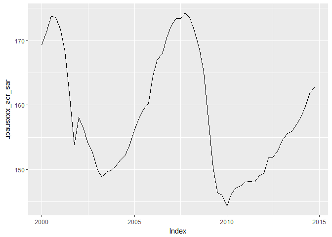
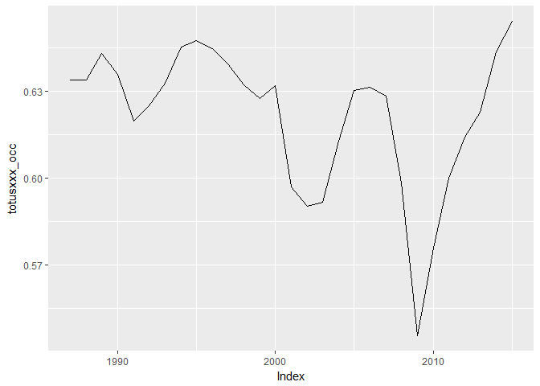

# create_ushist
Tourism Economics  

This had been pretty similar to create_ushist. To make this, I changed it to import the host Rdata files. I deleted the parts related to opens and closes. And removed stuff about IHG canada and mexico. And commented out the top25 piece. 

Then I went through a more thorough reworking. I realized I could do the calculation of real series across multiple countries.


Setup

```r
library(arlodr, warn.conflicts=FALSE)
library(xts, warn.conflicts=FALSE)
library(tidyverse)
```


Creates a us historical databank. Combines the STR data with selected macro data and calculates a few series

```r
fpath <- c("~/Project/R projects/lodfor/") 
#macro data
  load(paste(fpath,"output_data/oe_usmac_q.Rdata", sep=""))
# str data
  load(paste(fpath,"output_data/out_str_us_host_q.Rdata", sep="")) 
  load(paste(fpath,"output_data/out_str_us_host_m.Rdata", sep=""))

# put quarterly into a tidy format
temp_str_q <- out_str_us_host_q %>%
  data.frame(date=time(.), .) %>%
  # creates column called segvar that contains the column names, and one next to 
  # it with the values, dropping the time column
  gather(segvar, value, -date, na.rm = FALSE) %>%
  # separates out the variables
  separate(segvar, c("seg", "variable"), sep = "_", extra="merge") %>%
  separate(variable, c("area_sh", "variable"), sep = "_", extra="merge") %>%
  separate(variable, c("country", "variable"), sep = "_", extra="merge") %>%
  # keeps everything else as columns and spreads variable into multiple 
  # columns containing the values
  spread(variable,value)

# put monthly into a tidy format
temp_str_m <- out_str_us_host_m %>%
  data.frame(date=time(.), .) %>%
  # creates column called segvar that contains the column names, and one next to 
  # it with the values, dropping the time column
  gather(segvar, value, -date, na.rm = FALSE) %>%
  # separates out the variables
  separate(segvar, c("seg", "variable"), sep = "_", extra="merge") %>%
  separate(variable, c("area_sh", "variable"), sep = "_", extra="merge") %>%
  separate(variable, c("country", "variable"), sep = "_", extra="merge") %>%
  # keeps everything else as columns and spreads variable into multiple 
  # columns containing the values
  spread(variable,value)
```

The initial steps do the quarterly databank. Monthly is done further below.

```r
# selects certain series to bring in. Others just stay in macro in case they 
# are needed in future.
temp_usmac <- oe_usmac_q %>%
  data.frame(date=time(oe_usmac_q), oe_usmac_q) %>%
  select(date, 
         us_gdp,
         us_ifix,
         us_cd,
         us_iconstr,
         us_popnipa,
         us_popw,
         us_et,
         us_up,
         us_yhat,
         us_pc,
         us_pedy,
         us_penwall,
         us_cogtp,
         us_cpi,
         us_usrecq,
         can_gdp,
         can_cpi,
         can_pc,
         mex_gdp,
         mex_cpi,
         mex_pc
         ) %>%
  read.zoo %>%
  as.xts
head(temp_usmac)
```

```
##             us_gdp us_ifix  us_cd us_iconstr us_popnipa us_popw    us_et
## 1980-01-01 1631.22 309.150 59.750    198.181     226754  166762  99862.3
## 1980-04-01 1598.15 286.775 53.300    177.166     227389  167416  98953.3
## 1980-07-01 1595.72 287.925 55.650    180.214     228070  168111  98899.0
## 1980-10-01 1625.30 297.125 57.350    190.966     228689  168694  99498.7
## 1981-01-01 1658.93 301.075 58.975    188.642     229155  169279 100239.0
## 1981-04-01 1646.82 301.225 56.700    189.510     229674  169837 100801.0
##              us_up us_yhat  us_pc us_pedy us_penwall us_cogtp  us_cpi
## 1980-01-01 6.30000 1633.50 42.398 1147.47    9238.63   59.375 79.0333
## 1980-04-01 7.33333 1642.85 43.435 1130.80    9582.46   51.750 81.7000
## 1980-07-01 7.66667 1651.75 44.449 1144.56    9985.12   53.650 83.2333
## 1980-10-01 7.40000 1660.57 45.547 1167.01   10326.50   58.775 85.5667
## 1981-01-01 7.43333 1669.62 46.675 1163.91   10522.40   61.100 87.9333
## 1981-04-01 7.40000 1679.75 47.454 1163.67   10786.20   60.200 89.7667
##            us_usrecq can_gdp can_cpi  can_pc mex_gdp  mex_cpi    mex_pc
## 1980-01-01         0  192198 42.2796 40.4810 1491.85 0.101089 0.0871658
## 1980-04-01         1  191779 43.4352 41.5748 1501.59 0.106925 0.0936003
## 1980-07-01         1  191712 44.6358 42.7220 1534.00 0.113918 0.1038080
## 1980-10-01         0  193866 45.9055 44.0455 1578.43 0.119657 0.1060440
## 1981-01-01         0  198708 47.4281 45.4805 1613.67 0.129351 0.1115040
## 1981-04-01         0  200900 48.9277 46.5727 1655.48 0.137261 0.1192640
```

```r
# merges dataframes. the all.=TRUE piece ensures all the rows
# in the first dataframe are included
#ushist_q <- merge(temp, out_str_us_host_q, all=TRUE) 

######################
#
# indexes everything in ushist_q
#
# ushist_ind_q <- index_q_xts(ushist_q,index_year=2005)
# 
# # look at a graph
# tempa <- ushist_ind_q$totus_occ_sa
# tempb <- ushist_ind_q$upsus_occ_sa
# tempc <- merge(tempa,tempb)
# autoplot(window(tempc, start="2000-01-01", end="2014-10-01"), facets=NULL)
```

## Converts some series to real

First set up the price deflator to use for each country
Index the personal cons price deflator to average 100 in 2014

```r
# US
us_pcindex <- index_q(temp_usmac$us_pc, index_year=2014)
names(us_pcindex) <- "us_pcindex"
autoplot.zoo(us_pcindex)
```

<!-- -->

```r
# Canada
can_pcindex <- index_q(temp_usmac$can_pc, index_year=2014)
names(can_pcindex) <- "can_pcindex"
autoplot.zoo(can_pcindex)
```

<!-- -->

```r
# Mexico
mex_pcindex <- index_q(temp_usmac$mex_pc, index_year=2014)
names(mex_pcindex) <- "mex_pcindex"
autoplot.zoo(mex_pcindex)
```

<!-- -->

```r
# combines as a dataframe
pcindex <- merge(us_pcindex, can_pcindex, mex_pcindex) %>%
  data.frame(date=time(.), .) %>%
  gather(var, value, -date, na.rm = FALSE) %>%
  separate(var, c("country", "variable"), sep = "_", extra="merge") %>%
  mutate(country = ifelse(country == "us", "usa", country)) %>%
  spread(variable, value)
```

Add the price index to the somewhat tidy dataframe and calculate real series

```r
temp_str_q1 <- temp_str_q %>%
  left_join(., pcindex, by=c("date", "country")) %>%
  mutate(adrr = (adr / pcindex)*100) %>%
  mutate(adr_sar = (adr_sa / pcindex)*100) %>%
  mutate(revparr = (revpar / pcindex)*100) %>%
  mutate(revpar_sar = (revpar_sa / pcindex)*100)
  
temp_str_q2 <- temp_str_q1 %>%
  mutate(seg = paste0(seg, area_sh)) %>%
  # drop country because I don't think it is needed anymore
  select(-country, -area_sh) %>%
  gather(variable, value, -seg, -date) %>%
  mutate(segvar = paste(seg, variable, sep="_")) %>%
  select(-seg, -variable) %>%
  spread(segvar, value)

# to remove columns that are all NA and read back to xts
str_q <- temp_str_q2[,colSums(is.na(temp_str_q2))<nrow(temp_str_q2)] %>%
 read.zoo() %>%
 xts()

autoplot.zoo(window(str_q$upachcil_adr_sar, start="2000-01-01", end="2014-10-01"))
```

<!-- -->

```r
autoplot.zoo(window(str_q$upachcil_revpar_sa, start="2000-01-01", end="2014-10-01"))
```

<!-- -->

```r
autoplot.zoo(window(str_q$upachcil_revpar, start="2000-01-01", end="2014-10-01"))
```

<!-- -->

```r
autoplot.zoo(window(str_q$luxusxxx_adr, start="2000-01-01", end="2014-10-01"))
```

<!-- -->

```r
# merges onto ushist_q
ushist_q <- merge(temp_usmac, str_q)

autoplot.zoo(window(ushist_q$upausxxx_adr, start="2000-01-01", end="2014-10-01"))
```

<!-- -->

```r
autoplot.zoo(window(ushist_q$upausxxx_adr_sa, start="2000-01-01", end="2014-10-01"))
```

<!-- -->

```r
autoplot.zoo(window(ushist_q$upausxxx_adr_sar, start="2000-01-01", end="2014-10-01"))
```

<!-- -->

```r
ushist_q_df <- ushist_q %>%
  data.frame(date=time(.), .)


# simple graph
grapht <- ushist_q_df %>%
  select(date, upausxxx_adr, upausxxx_adr_sa, upausxxx_adr_sar) %>%
  read.zoo() %>%
  xts() %>%
  window(.,start="2000-01-01", end="2015-10-01")
autoplot.zoo(grapht, facets = NULL)
```

<!-- -->

```r
# simple graph with variables for selected geo
segment <- c("upanwyny")
var1 <- paste0(segment,"_adr")
var2 <- paste0(segment,"_adr_sa")
var3 <- paste0(segment,"_adr_sar")

colnames(ushist_q)
```

```
##    [1] "us_gdp"               "us_ifix"              "us_cd"               
##    [4] "us_iconstr"           "us_popnipa"           "us_popw"             
##    [7] "us_et"                "us_up"                "us_yhat"             
##   [10] "us_pc"                "us_pedy"              "us_penwall"          
##   [13] "us_cogtp"             "us_cpi"               "us_usrecq"           
##   [16] "can_gdp"              "can_cpi"              "can_pc"              
##   [19] "mex_gdp"              "mex_cpi"              "mex_pc"              
##   [22] "luxasttx_adr"         "luxasttx_adrr"        "luxasttx_days"       
##   [25] "luxasttx_demd"        "luxasttx_demt"        "luxasttx_occ"        
##   [28] "luxasttx_pcindex"     "luxasttx_revpar"      "luxasttx_revparr"    
##   [31] "luxasttx_rmrevt"      "luxasttx_supd"        "luxasttx_supt"       
##   [34] "luxatlga_adr"         "luxatlga_adrr"        "luxatlga_days"       
##   [37] "luxatlga_demd"        "luxatlga_demt"        "luxatlga_occ"        
##   [40] "luxatlga_pcindex"     "luxatlga_revpar"      "luxatlga_revparr"    
##   [43] "luxatlga_rmrevt"      "luxatlga_supd"        "luxatlga_supt"       
##   [46] "luxbstma_adr"         "luxbstma_adrr"        "luxbstma_days"       
##   [49] "luxbstma_demd"        "luxbstma_demt"        "luxbstma_occ"        
##   [52] "luxbstma_pcindex"     "luxbstma_revpar"      "luxbstma_revparr"    
##   [55] "luxbstma_rmrevt"      "luxbstma_supd"        "luxbstma_supt"       
##   [58] "luxchcil_adr"         "luxchcil_adrr"        "luxchcil_days"       
##   [61] "luxchcil_demd"        "luxchcil_demt"        "luxchcil_occ"        
##   [64] "luxchcil_pcindex"     "luxchcil_revpar"      "luxchcil_revparr"    
##   [67] "luxchcil_rmrevt"      "luxchcil_supd"        "luxchcil_supt"       
##   [70] "luxdlltx_adr"         "luxdlltx_adrr"        "luxdlltx_days"       
##   [73] "luxdlltx_demd"        "luxdlltx_demt"        "luxdlltx_occ"        
##   [76] "luxdlltx_pcindex"     "luxdlltx_revpar"      "luxdlltx_revparr"    
##   [79] "luxdlltx_rmrevt"      "luxdlltx_supd"        "luxdlltx_supt"       
##   [82] "luxdnvco_adr"         "luxdnvco_adrr"        "luxdnvco_days"       
##   [85] "luxdnvco_demd"        "luxdnvco_demt"        "luxdnvco_occ"        
##   [88] "luxdnvco_pcindex"     "luxdnvco_revpar"      "luxdnvco_revparr"    
##   [91] "luxdnvco_rmrevt"      "luxdnvco_supd"        "luxdnvco_supt"       
##   [94] "luxhnlhi_adr"         "luxhnlhi_adrr"        "luxhnlhi_days"       
##   [97] "luxhnlhi_demd"        "luxhnlhi_demt"        "luxhnlhi_occ"        
##  [100] "luxhnlhi_pcindex"     "luxhnlhi_revpar"      "luxhnlhi_revparr"    
##  [103] "luxhnlhi_rmrevt"      "luxhnlhi_supd"        "luxhnlhi_supt"       
##  [106] "luxhsttx_adr"         "luxhsttx_adrr"        "luxhsttx_days"       
##  [109] "luxhsttx_demd"        "luxhsttx_demt"        "luxhsttx_occ"        
##  [112] "luxhsttx_pcindex"     "luxhsttx_revpar"      "luxhsttx_revparr"    
##  [115] "luxhsttx_rmrevt"      "luxhsttx_supd"        "luxhsttx_supt"       
##  [118] "luxkhlhi_adr"         "luxkhlhi_adrr"        "luxkhlhi_days"       
##  [121] "luxkhlhi_demd"        "luxkhlhi_demt"        "luxkhlhi_occ"        
##  [124] "luxkhlhi_pcindex"     "luxkhlhi_revpar"      "luxkhlhi_revparr"    
##  [127] "luxkhlhi_rmrevt"      "luxkhlhi_supd"        "luxkhlhi_supt"       
##  [130] "luxlsaca_adr"         "luxlsaca_adrr"        "luxlsaca_days"       
##  [133] "luxlsaca_demd"        "luxlsaca_demt"        "luxlsaca_occ"        
##  [136] "luxlsaca_pcindex"     "luxlsaca_revpar"      "luxlsaca_revparr"    
##  [139] "luxlsaca_rmrevt"      "luxlsaca_supd"        "luxlsaca_supt"       
##  [142] "luxmimfl_adr"         "luxmimfl_adrr"        "luxmimfl_days"       
##  [145] "luxmimfl_demd"        "luxmimfl_demt"        "luxmimfl_occ"        
##  [148] "luxmimfl_pcindex"     "luxmimfl_revpar"      "luxmimfl_revparr"    
##  [151] "luxmimfl_rmrevt"      "luxmimfl_supd"        "luxmimfl_supt"       
##  [154] "luxmnnmn_adr"         "luxmnnmn_adrr"        "luxmnnmn_days"       
##  [157] "luxmnnmn_demd"        "luxmnnmn_demt"        "luxmnnmn_occ"        
##  [160] "luxmnnmn_pcindex"     "luxmnnmn_revpar"      "luxmnnmn_revparr"    
##  [163] "luxmnnmn_rmrevt"      "luxmnnmn_supd"        "luxmnnmn_supt"       
##  [166] "luxmouhi_adr"         "luxmouhi_adrr"        "luxmouhi_days"       
##  [169] "luxmouhi_demd"        "luxmouhi_demt"        "luxmouhi_occ"        
##  [172] "luxmouhi_pcindex"     "luxmouhi_revpar"      "luxmouhi_revparr"    
##  [175] "luxmouhi_rmrevt"      "luxmouhi_supd"        "luxmouhi_supt"       
##  [178] "luxmxcmx_adr"         "luxmxcmx_adrr"        "luxmxcmx_days"       
##  [181] "luxmxcmx_demd"        "luxmxcmx_demt"        "luxmxcmx_occ"        
##  [184] "luxmxcmx_pcindex"     "luxmxcmx_revpar"      "luxmxcmx_revparr"    
##  [187] "luxmxcmx_rmrevt"      "luxmxcmx_supd"        "luxmxcmx_supt"       
##  [190] "luxnwola_adr"         "luxnwola_adrr"        "luxnwola_days"       
##  [193] "luxnwola_demd"        "luxnwola_demt"        "luxnwola_occ"        
##  [196] "luxnwola_pcindex"     "luxnwola_revpar"      "luxnwola_revparr"    
##  [199] "luxnwola_rmrevt"      "luxnwola_supd"        "luxnwola_supt"       
##  [202] "luxnwyny_adr"         "luxnwyny_adrr"        "luxnwyny_days"       
##  [205] "luxnwyny_demd"        "luxnwyny_demt"        "luxnwyny_occ"        
##  [208] "luxnwyny_pcindex"     "luxnwyny_revpar"      "luxnwyny_revparr"    
##  [211] "luxnwyny_rmrevt"      "luxnwyny_supd"        "luxnwyny_supt"       
##  [214] "luxorgca_adr"         "luxorgca_adrr"        "luxorgca_days"       
##  [217] "luxorgca_demd"        "luxorgca_demt"        "luxorgca_occ"        
##  [220] "luxorgca_pcindex"     "luxorgca_revpar"      "luxorgca_revparr"    
##  [223] "luxorgca_rmrevt"      "luxorgca_supd"        "luxorgca_supt"       
##  [226] "luxorlfl_adr"         "luxorlfl_adrr"        "luxorlfl_days"       
##  [229] "luxorlfl_demd"        "luxorlfl_demt"        "luxorlfl_occ"        
##  [232] "luxorlfl_pcindex"     "luxorlfl_revpar"      "luxorlfl_revparr"    
##  [235] "luxorlfl_rmrevt"      "luxorlfl_supd"        "luxorlfl_supt"       
##  [238] "luxphlpa_adr"         "luxphlpa_adrr"        "luxphlpa_days"       
##  [241] "luxphlpa_demd"        "luxphlpa_demt"        "luxphlpa_occ"        
##  [244] "luxphlpa_pcindex"     "luxphlpa_revpar"      "luxphlpa_revparr"    
##  [247] "luxphlpa_rmrevt"      "luxphlpa_supd"        "luxphlpa_supt"       
##  [250] "luxphnaz_adr"         "luxphnaz_adrr"        "luxphnaz_days"       
##  [253] "luxphnaz_demd"        "luxphnaz_demt"        "luxphnaz_occ"        
##  [256] "luxphnaz_pcindex"     "luxphnaz_revpar"      "luxphnaz_revparr"    
##  [259] "luxphnaz_rmrevt"      "luxphnaz_supd"        "luxphnaz_supt"       
##  [262] "luxsfjca_adr"         "luxsfjca_adrr"        "luxsfjca_days"       
##  [265] "luxsfjca_demd"        "luxsfjca_demt"        "luxsfjca_occ"        
##  [268] "luxsfjca_pcindex"     "luxsfjca_revpar"      "luxsfjca_revparr"    
##  [271] "luxsfjca_rmrevt"      "luxsfjca_supd"        "luxsfjca_supt"       
##  [274] "luxsnatx_adr"         "luxsnatx_adrr"        "luxsnatx_days"       
##  [277] "luxsnatx_demd"        "luxsnatx_demt"        "luxsnatx_occ"        
##  [280] "luxsnatx_pcindex"     "luxsnatx_revpar"      "luxsnatx_revparr"    
##  [283] "luxsnatx_rmrevt"      "luxsnatx_supd"        "luxsnatx_supt"       
##  [286] "luxsndca_adr"         "luxsndca_adrr"        "luxsndca_days"       
##  [289] "luxsndca_demd"        "luxsndca_demt"        "luxsndca_occ"        
##  [292] "luxsndca_pcindex"     "luxsndca_revpar"      "luxsndca_revparr"    
##  [295] "luxsndca_rmrevt"      "luxsndca_supd"        "luxsndca_supt"       
##  [298] "luxsnfca_adr"         "luxsnfca_adrr"        "luxsnfca_days"       
##  [301] "luxsnfca_demd"        "luxsnfca_demt"        "luxsnfca_occ"        
##  [304] "luxsnfca_pcindex"     "luxsnfca_revpar"      "luxsnfca_revparr"    
##  [307] "luxsnfca_rmrevt"      "luxsnfca_supd"        "luxsnfca_supt"       
##  [310] "luxsnjca_adr"         "luxsnjca_adrr"        "luxsnjca_days"       
##  [313] "luxsnjca_demd"        "luxsnjca_demt"        "luxsnjca_occ"        
##  [316] "luxsnjca_pcindex"     "luxsnjca_revpar"      "luxsnjca_revparr"    
##  [319] "luxsnjca_rmrevt"      "luxsnjca_supd"        "luxsnjca_supt"       
##  [322] "luxsttwa_adr"         "luxsttwa_adrr"        "luxsttwa_days"       
##  [325] "luxsttwa_demd"        "luxsttwa_demt"        "luxsttwa_occ"        
##  [328] "luxsttwa_pcindex"     "luxsttwa_revpar"      "luxsttwa_revparr"    
##  [331] "luxsttwa_rmrevt"      "luxsttwa_supd"        "luxsttwa_supt"       
##  [334] "luxtorcn_adr"         "luxtorcn_adrr"        "luxtorcn_days"       
##  [337] "luxtorcn_demd"        "luxtorcn_demt"        "luxtorcn_occ"        
##  [340] "luxtorcn_pcindex"     "luxtorcn_revpar"      "luxtorcn_revparr"    
##  [343] "luxtorcn_rmrevt"      "luxtorcn_supd"        "luxtorcn_supt"       
##  [346] "luxusxxx_adr"         "luxusxxx_adrr"        "luxusxxx_days"       
##  [349] "luxusxxx_demd"        "luxusxxx_demt"        "luxusxxx_occ"        
##  [352] "luxusxxx_pcindex"     "luxusxxx_revpar"      "luxusxxx_revparr"    
##  [355] "luxusxxx_rmrevt"      "luxusxxx_supd"        "luxusxxx_supt"       
##  [358] "luxwshdc_adr"         "luxwshdc_adrr"        "luxwshdc_days"       
##  [361] "luxwshdc_demd"        "luxwshdc_demt"        "luxwshdc_occ"        
##  [364] "luxwshdc_pcindex"     "luxwshdc_revpar"      "luxwshdc_revparr"    
##  [367] "luxwshdc_rmrevt"      "luxwshdc_supd"        "luxwshdc_supt"       
##  [370] "totasttx_adr"         "totasttx_adr_sa"      "totasttx_adr_sar"    
##  [373] "totasttx_adr_sf"      "totasttx_adrr"        "totasttx_days"       
##  [376] "totasttx_demar_sa"    "totasttx_demd"        "totasttx_demd_sa"    
##  [379] "totasttx_demd_sf"     "totasttx_demt"        "totasttx_occ"        
##  [382] "totasttx_occ_sa"      "totasttx_occ_sf"      "totasttx_pcindex"    
##  [385] "totasttx_revpar"      "totasttx_revpar_sa"   "totasttx_revpar_sar" 
##  [388] "totasttx_revpar_sf"   "totasttx_revparr"     "totasttx_rmrevt"     
##  [391] "totasttx_supd"        "totasttx_supd_sa"     "totasttx_supd_sf"    
##  [394] "totasttx_supt"        "totatlga_adr"         "totatlga_adr_sa"     
##  [397] "totatlga_adr_sar"     "totatlga_adr_sf"      "totatlga_adrr"       
##  [400] "totatlga_days"        "totatlga_demar_sa"    "totatlga_demd"       
##  [403] "totatlga_demd_sa"     "totatlga_demd_sf"     "totatlga_demt"       
##  [406] "totatlga_occ"         "totatlga_occ_sa"      "totatlga_occ_sf"     
##  [409] "totatlga_pcindex"     "totatlga_revpar"      "totatlga_revpar_sa"  
##  [412] "totatlga_revpar_sar"  "totatlga_revpar_sf"   "totatlga_revparr"    
##  [415] "totatlga_rmrevt"      "totatlga_supd"        "totatlga_supd_sa"    
##  [418] "totatlga_supd_sf"     "totatlga_supt"        "totbltmd_adr"        
##  [421] "totbltmd_adr_sf.x"    "totbltmd_adr_sf.y"    "totbltmd_adrr"       
##  [424] "totbltmd_days"        "totbltmd_demd"        "totbltmd_demd_sf.x"  
##  [427] "totbltmd_demd_sf.y"   "totbltmd_demt"        "totbltmd_occ"        
##  [430] "totbltmd_occ_sf.x"    "totbltmd_occ_sf.y"    "totbltmd_pcindex"    
##  [433] "totbltmd_revpar"      "totbltmd_revpar_sf.x" "totbltmd_revpar_sf.y"
##  [436] "totbltmd_revparr"     "totbltmd_rmrevt"      "totbltmd_supd"       
##  [439] "totbltmd_supd_sf.x"   "totbltmd_supd_sf.y"   "totbltmd_supt"       
##  [442] "totbstma_adr"         "totbstma_adr_sa"      "totbstma_adr_sar"    
##  [445] "totbstma_adr_sf"      "totbstma_adrr"        "totbstma_days"       
##  [448] "totbstma_demar_sa"    "totbstma_demd"        "totbstma_demd_sa"    
##  [451] "totbstma_demd_sf"     "totbstma_demt"        "totbstma_occ"        
##  [454] "totbstma_occ_sa"      "totbstma_occ_sf"      "totbstma_pcindex"    
##  [457] "totbstma_revpar"      "totbstma_revpar_sa"   "totbstma_revpar_sar" 
##  [460] "totbstma_revpar_sf"   "totbstma_revparr"     "totbstma_rmrevt"     
##  [463] "totbstma_supd"        "totbstma_supd_sa"     "totbstma_supd_sf"    
##  [466] "totbstma_supt"        "totcalcn_adr"         "totcalcn_adr_sa"     
##  [469] "totcalcn_adr_sar"     "totcalcn_adr_sf"      "totcalcn_adrr"       
##  [472] "totcalcn_days"        "totcalcn_demar_sa"    "totcalcn_demd"       
##  [475] "totcalcn_demd_sa"     "totcalcn_demd_sf"     "totcalcn_demt"       
##  [478] "totcalcn_occ"         "totcalcn_occ_sa"      "totcalcn_occ_sf"     
##  [481] "totcalcn_pcindex"     "totcalcn_revpar"      "totcalcn_revpar_sa"  
##  [484] "totcalcn_revpar_sar"  "totcalcn_revpar_sf"   "totcalcn_revparr"    
##  [487] "totcalcn_rmrevt"      "totcalcn_supd"        "totcalcn_supd_sa"    
##  [490] "totcalcn_supd_sf"     "totcalcn_supt"        "totchcil_adr"        
##  [493] "totchcil_adr_sa"      "totchcil_adr_sar"     "totchcil_adr_sf"     
##  [496] "totchcil_adrr"        "totchcil_days"        "totchcil_demar_sa"   
##  [499] "totchcil_demd"        "totchcil_demd_sa"     "totchcil_demd_sf"    
##  [502] "totchcil_demt"        "totchcil_occ"         "totchcil_occ_sa"     
##  [505] "totchcil_occ_sf"      "totchcil_pcindex"     "totchcil_revpar"     
##  [508] "totchcil_revpar_sa"   "totchcil_revpar_sar"  "totchcil_revpar_sf"  
##  [511] "totchcil_revparr"     "totchcil_rmrevt"      "totchcil_supd"       
##  [514] "totchcil_supd_sa"     "totchcil_supd_sf"     "totchcil_supt"       
##  [517] "totchrnc_adr"         "totchrnc_adr_sa"      "totchrnc_adr_sar"    
##  [520] "totchrnc_adr_sf"      "totchrnc_adrr"        "totchrnc_days"       
##  [523] "totchrnc_demar_sa"    "totchrnc_demd"        "totchrnc_demd_sa"    
##  [526] "totchrnc_demd_sf"     "totchrnc_demt"        "totchrnc_occ"        
##  [529] "totchrnc_occ_sa"      "totchrnc_occ_sf"      "totchrnc_pcindex"    
##  [532] "totchrnc_revpar"      "totchrnc_revpar_sa"   "totchrnc_revpar_sar" 
##  [535] "totchrnc_revpar_sf"   "totchrnc_revparr"     "totchrnc_rmrevt"     
##  [538] "totchrnc_supd"        "totchrnc_supd_sa"     "totchrnc_supd_sf"    
##  [541] "totchrnc_supt"        "totchrsc_adr"         "totchrsc_adr_sa"     
##  [544] "totchrsc_adr_sar"     "totchrsc_adr_sf"      "totchrsc_adrr"       
##  [547] "totchrsc_days"        "totchrsc_demar_sa"    "totchrsc_demd"       
##  [550] "totchrsc_demd_sa"     "totchrsc_demd_sf"     "totchrsc_demt"       
##  [553] "totchrsc_occ"         "totchrsc_occ_sa"      "totchrsc_occ_sf"     
##  [556] "totchrsc_pcindex"     "totchrsc_revpar"      "totchrsc_revpar_sa"  
##  [559] "totchrsc_revpar_sar"  "totchrsc_revpar_sf"   "totchrsc_revparr"    
##  [562] "totchrsc_rmrevt"      "totchrsc_supd"        "totchrsc_supd_sa"    
##  [565] "totchrsc_supd_sf"     "totchrsc_supt"        "totdlltx_adr"        
##  [568] "totdlltx_adr_sa"      "totdlltx_adr_sar"     "totdlltx_adr_sf"     
##  [571] "totdlltx_adrr"        "totdlltx_days"        "totdlltx_demar_sa"   
##  [574] "totdlltx_demd"        "totdlltx_demd_sa"     "totdlltx_demd_sf"    
##  [577] "totdlltx_demt"        "totdlltx_occ"         "totdlltx_occ_sa"     
##  [580] "totdlltx_occ_sf"      "totdlltx_pcindex"     "totdlltx_revpar"     
##  [583] "totdlltx_revpar_sa"   "totdlltx_revpar_sar"  "totdlltx_revpar_sf"  
##  [586] "totdlltx_revparr"     "totdlltx_rmrevt"      "totdlltx_supd"       
##  [589] "totdlltx_supd_sa"     "totdlltx_supd_sf"     "totdlltx_supt"       
##  [592] "totdnvco_adr"         "totdnvco_adr_sa"      "totdnvco_adr_sar"    
##  [595] "totdnvco_adr_sf"      "totdnvco_adrr"        "totdnvco_days"       
##  [598] "totdnvco_demar_sa"    "totdnvco_demd"        "totdnvco_demd_sa"    
##  [601] "totdnvco_demd_sf"     "totdnvco_demt"        "totdnvco_occ"        
##  [604] "totdnvco_occ_sa"      "totdnvco_occ_sf"      "totdnvco_pcindex"    
##  [607] "totdnvco_revpar"      "totdnvco_revpar_sa"   "totdnvco_revpar_sar" 
##  [610] "totdnvco_revpar_sf"   "totdnvco_revparr"     "totdnvco_rmrevt"     
##  [613] "totdnvco_supd"        "totdnvco_supd_sa"     "totdnvco_supd_sf"    
##  [616] "totdnvco_supt"        "tothnlhi_adr"         "tothnlhi_adr_sa"     
##  [619] "tothnlhi_adr_sar"     "tothnlhi_adr_sf"      "tothnlhi_adrr"       
##  [622] "tothnlhi_days"        "tothnlhi_demar_sa"    "tothnlhi_demd"       
##  [625] "tothnlhi_demd_sa"     "tothnlhi_demd_sf"     "tothnlhi_demt"       
##  [628] "tothnlhi_occ"         "tothnlhi_occ_sa"      "tothnlhi_occ_sf"     
##  [631] "tothnlhi_pcindex"     "tothnlhi_revpar"      "tothnlhi_revpar_sa"  
##  [634] "tothnlhi_revpar_sar"  "tothnlhi_revpar_sf"   "tothnlhi_revparr"    
##  [637] "tothnlhi_rmrevt"      "tothnlhi_supd"        "tothnlhi_supd_sa"    
##  [640] "tothnlhi_supd_sf"     "tothnlhi_supt"        "tothsttx_adr"        
##  [643] "tothsttx_adr_sa"      "tothsttx_adr_sar"     "tothsttx_adr_sf"     
##  [646] "tothsttx_adrr"        "tothsttx_days"        "tothsttx_demar_sa"   
##  [649] "tothsttx_demd"        "tothsttx_demd_sa"     "tothsttx_demd_sf"    
##  [652] "tothsttx_demt"        "tothsttx_occ"         "tothsttx_occ_sa"     
##  [655] "tothsttx_occ_sf"      "tothsttx_pcindex"     "tothsttx_revpar"     
##  [658] "tothsttx_revpar_sa"   "tothsttx_revpar_sar"  "tothsttx_revpar_sf"  
##  [661] "tothsttx_revparr"     "tothsttx_rmrevt"      "tothsttx_supd"       
##  [664] "tothsttx_supd_sa"     "tothsttx_supd_sf"     "tothsttx_supt"       
##  [667] "totindin_adr"         "totindin_adr_sa"      "totindin_adr_sar"    
##  [670] "totindin_adr_sf"      "totindin_adrr"        "totindin_days"       
##  [673] "totindin_demar_sa"    "totindin_demd"        "totindin_demd_sa"    
##  [676] "totindin_demd_sf"     "totindin_demt"        "totindin_occ"        
##  [679] "totindin_occ_sa"      "totindin_occ_sf"      "totindin_pcindex"    
##  [682] "totindin_revpar"      "totindin_revpar_sa"   "totindin_revpar_sar" 
##  [685] "totindin_revpar_sf"   "totindin_revparr"     "totindin_rmrevt"     
##  [688] "totindin_supd"        "totindin_supd_sa"     "totindin_supd_sf"    
##  [691] "totindin_supt"        "totkhlhi_adr"         "totkhlhi_adr_sa"     
##  [694] "totkhlhi_adr_sar"     "totkhlhi_adr_sf"      "totkhlhi_adrr"       
##  [697] "totkhlhi_days"        "totkhlhi_demar_sa"    "totkhlhi_demd"       
##  [700] "totkhlhi_demd_sa"     "totkhlhi_demd_sf"     "totkhlhi_demt"       
##  [703] "totkhlhi_occ"         "totkhlhi_occ_sa"      "totkhlhi_occ_sf"     
##  [706] "totkhlhi_pcindex"     "totkhlhi_revpar"      "totkhlhi_revpar_sa"  
##  [709] "totkhlhi_revpar_sar"  "totkhlhi_revpar_sf"   "totkhlhi_revparr"    
##  [712] "totkhlhi_rmrevt"      "totkhlhi_supd"        "totkhlhi_supd_sa"    
##  [715] "totkhlhi_supd_sf"     "totkhlhi_supt"        "totlsaca_adr"        
##  [718] "totlsaca_adr_sa"      "totlsaca_adr_sar"     "totlsaca_adr_sf"     
##  [721] "totlsaca_adrr"        "totlsaca_days"        "totlsaca_demar_sa"   
##  [724] "totlsaca_demd"        "totlsaca_demd_sa"     "totlsaca_demd_sf"    
##  [727] "totlsaca_demt"        "totlsaca_occ"         "totlsaca_occ_sa"     
##  [730] "totlsaca_occ_sf"      "totlsaca_pcindex"     "totlsaca_revpar"     
##  [733] "totlsaca_revpar_sa"   "totlsaca_revpar_sar"  "totlsaca_revpar_sf"  
##  [736] "totlsaca_revparr"     "totlsaca_rmrevt"      "totlsaca_supd"       
##  [739] "totlsaca_supd_sa"     "totlsaca_supd_sf"     "totlsaca_supt"       
##  [742] "totlsvky_adr"         "totlsvky_adr_sa"      "totlsvky_adr_sar"    
##  [745] "totlsvky_adr_sf"      "totlsvky_adrr"        "totlsvky_days"       
##  [748] "totlsvky_demar_sa"    "totlsvky_demd"        "totlsvky_demd_sa"    
##  [751] "totlsvky_demd_sf"     "totlsvky_demt"        "totlsvky_occ"        
##  [754] "totlsvky_occ_sa"      "totlsvky_occ_sf"      "totlsvky_pcindex"    
##  [757] "totlsvky_revpar"      "totlsvky_revpar_sa"   "totlsvky_revpar_sar" 
##  [760] "totlsvky_revpar_sf"   "totlsvky_revparr"     "totlsvky_rmrevt"     
##  [763] "totlsvky_supd"        "totlsvky_supd_sa"     "totlsvky_supd_sf"    
##  [766] "totlsvky_supt"        "totmimfl_adr"         "totmimfl_adr_sa"     
##  [769] "totmimfl_adr_sar"     "totmimfl_adr_sf"      "totmimfl_adrr"       
##  [772] "totmimfl_days"        "totmimfl_demar_sa"    "totmimfl_demd"       
##  [775] "totmimfl_demd_sa"     "totmimfl_demd_sf"     "totmimfl_demt"       
##  [778] "totmimfl_occ"         "totmimfl_occ_sa"      "totmimfl_occ_sf"     
##  [781] "totmimfl_pcindex"     "totmimfl_revpar"      "totmimfl_revpar_sa"  
##  [784] "totmimfl_revpar_sar"  "totmimfl_revpar_sf"   "totmimfl_revparr"    
##  [787] "totmimfl_rmrevt"      "totmimfl_supd"        "totmimfl_supd_sa"    
##  [790] "totmimfl_supd_sf"     "totmimfl_supt"        "totmmptn_adr"        
##  [793] "totmmptn_adr_sa"      "totmmptn_adr_sar"     "totmmptn_adr_sf"     
##  [796] "totmmptn_adrr"        "totmmptn_days"        "totmmptn_demar_sa"   
##  [799] "totmmptn_demd"        "totmmptn_demd_sa"     "totmmptn_demd_sf"    
##  [802] "totmmptn_demt"        "totmmptn_occ"         "totmmptn_occ_sa"     
##  [805] "totmmptn_occ_sf"      "totmmptn_pcindex"     "totmmptn_revpar"     
##  [808] "totmmptn_revpar_sa"   "totmmptn_revpar_sar"  "totmmptn_revpar_sf"  
##  [811] "totmmptn_revparr"     "totmmptn_rmrevt"      "totmmptn_supd"       
##  [814] "totmmptn_supd_sa"     "totmmptn_supd_sf"     "totmmptn_supt"       
##  [817] "totmnnmn_adr"         "totmnnmn_adr_sa"      "totmnnmn_adr_sar"    
##  [820] "totmnnmn_adr_sf"      "totmnnmn_adrr"        "totmnnmn_days"       
##  [823] "totmnnmn_demar_sa"    "totmnnmn_demd"        "totmnnmn_demd_sa"    
##  [826] "totmnnmn_demd_sf"     "totmnnmn_demt"        "totmnnmn_occ"        
##  [829] "totmnnmn_occ_sa"      "totmnnmn_occ_sf"      "totmnnmn_pcindex"    
##  [832] "totmnnmn_revpar"      "totmnnmn_revpar_sa"   "totmnnmn_revpar_sar" 
##  [835] "totmnnmn_revpar_sf"   "totmnnmn_revparr"     "totmnnmn_rmrevt"     
##  [838] "totmnnmn_supd"        "totmnnmn_supd_sa"     "totmnnmn_supd_sf"    
##  [841] "totmnnmn_supt"        "totmouhi_adr"         "totmouhi_adr_sa"     
##  [844] "totmouhi_adr_sar"     "totmouhi_adr_sf"      "totmouhi_adrr"       
##  [847] "totmouhi_days"        "totmouhi_demar_sa"    "totmouhi_demd"       
##  [850] "totmouhi_demd_sa"     "totmouhi_demd_sf"     "totmouhi_demt"       
##  [853] "totmouhi_occ"         "totmouhi_occ_sa"      "totmouhi_occ_sf"     
##  [856] "totmouhi_pcindex"     "totmouhi_revpar"      "totmouhi_revpar_sa"  
##  [859] "totmouhi_revpar_sar"  "totmouhi_revpar_sf"   "totmouhi_revparr"    
##  [862] "totmouhi_rmrevt"      "totmouhi_supd"        "totmouhi_supd_sa"    
##  [865] "totmouhi_supd_sf"     "totmouhi_supt"        "totmxcmx_adr"        
##  [868] "totmxcmx_adr_sa"      "totmxcmx_adr_sar"     "totmxcmx_adr_sf"     
##  [871] "totmxcmx_adrr"        "totmxcmx_days"        "totmxcmx_demar_sa"   
##  [874] "totmxcmx_demd"        "totmxcmx_demd_sa"     "totmxcmx_demd_sf"    
##  [877] "totmxcmx_demt"        "totmxcmx_occ"         "totmxcmx_occ_sa"     
##  [880] "totmxcmx_occ_sf"      "totmxcmx_pcindex"     "totmxcmx_revpar"     
##  [883] "totmxcmx_revpar_sa"   "totmxcmx_revpar_sar"  "totmxcmx_revpar_sf"  
##  [886] "totmxcmx_revparr"     "totmxcmx_rmrevt"      "totmxcmx_supd"       
##  [889] "totmxcmx_supd_sa"     "totmxcmx_supd_sf"     "totmxcmx_supt"       
##  [892] "totNA_adr"            "totNA_adr_sa"         "totNA_adr_sf"        
##  [895] "totNA_days"           "totNA_demar_sa"       "totNA_demd"          
##  [898] "totNA_demd_sa"        "totNA_demd_sf"        "totNA_demt"          
##  [901] "totNA_occ"            "totNA_occ_sa"         "totNA_occ_sf"        
##  [904] "totNA_revpar"         "totNA_revpar_sa"      "totNA_revpar_sf"     
##  [907] "totNA_rmrevt"         "totNA_supd"           "totNA_supd_sa"       
##  [910] "totNA_supd_sf"        "totNA_supt"           "totnshtn_adr"        
##  [913] "totnshtn_adr_sa"      "totnshtn_adr_sar"     "totnshtn_adr_sf"     
##  [916] "totnshtn_adrr"        "totnshtn_days"        "totnshtn_demar_sa"   
##  [919] "totnshtn_demd"        "totnshtn_demd_sa"     "totnshtn_demd_sf"    
##  [922] "totnshtn_demt"        "totnshtn_occ"         "totnshtn_occ_sa"     
##  [925] "totnshtn_occ_sf"      "totnshtn_pcindex"     "totnshtn_revpar"     
##  [928] "totnshtn_revpar_sa"   "totnshtn_revpar_sar"  "totnshtn_revpar_sf"  
##  [931] "totnshtn_revparr"     "totnshtn_rmrevt"      "totnshtn_supd"       
##  [934] "totnshtn_supd_sa"     "totnshtn_supd_sf"     "totnshtn_supt"       
##  [937] "totnwola_adr"         "totnwola_adr_sa"      "totnwola_adr_sar"    
##  [940] "totnwola_adr_sf"      "totnwola_adrr"        "totnwola_days"       
##  [943] "totnwola_demar_sa"    "totnwola_demd"        "totnwola_demd_sa"    
##  [946] "totnwola_demd_sf"     "totnwola_demt"        "totnwola_occ"        
##  [949] "totnwola_occ_sa"      "totnwola_occ_sf"      "totnwola_pcindex"    
##  [952] "totnwola_revpar"      "totnwola_revpar_sa"   "totnwola_revpar_sar" 
##  [955] "totnwola_revpar_sf"   "totnwola_revparr"     "totnwola_rmrevt"     
##  [958] "totnwola_supd"        "totnwola_supd_sa"     "totnwola_supd_sf"    
##  [961] "totnwola_supt"        "totnwyny_adr"         "totnwyny_adr_sa"     
##  [964] "totnwyny_adr_sar"     "totnwyny_adr_sf"      "totnwyny_adrr"       
##  [967] "totnwyny_days"        "totnwyny_demar_sa"    "totnwyny_demd"       
##  [970] "totnwyny_demd_sa"     "totnwyny_demd_sf"     "totnwyny_demt"       
##  [973] "totnwyny_occ"         "totnwyny_occ_sa"      "totnwyny_occ_sf"     
##  [976] "totnwyny_pcindex"     "totnwyny_revpar"      "totnwyny_revpar_sa"  
##  [979] "totnwyny_revpar_sar"  "totnwyny_revpar_sf"   "totnwyny_revparr"    
##  [982] "totnwyny_rmrevt"      "totnwyny_supd"        "totnwyny_supd_sa"    
##  [985] "totnwyny_supd_sf"     "totnwyny_supt"        "totoklca_adr"        
##  [988] "totoklca_adr_sf.x"    "totoklca_adr_sf.y"    "totoklca_adrr"       
##  [991] "totoklca_days"        "totoklca_demd"        "totoklca_demd_sf.x"  
##  [994] "totoklca_demd_sf.y"   "totoklca_demt"        "totoklca_occ"        
##  [997] "totoklca_occ_sf.x"    "totoklca_occ_sf.y"    "totoklca_pcindex"    
## [1000] "totoklca_revpar"      "totoklca_revpar_sf.x" "totoklca_revpar_sf.y"
## [1003] "totoklca_revparr"     "totoklca_rmrevt"      "totoklca_supd"       
## [1006] "totoklca_supd_sf.x"   "totoklca_supd_sf.y"   "totoklca_supt"       
## [1009] "totorgca_adr"         "totorgca_adr_sa"      "totorgca_adr_sar"    
## [1012] "totorgca_adr_sf"      "totorgca_adrr"        "totorgca_days"       
## [1015] "totorgca_demar_sa"    "totorgca_demd"        "totorgca_demd_sa"    
## [1018] "totorgca_demd_sf"     "totorgca_demt"        "totorgca_occ"        
## [1021] "totorgca_occ_sa"      "totorgca_occ_sf"      "totorgca_pcindex"    
## [1024] "totorgca_revpar"      "totorgca_revpar_sa"   "totorgca_revpar_sar" 
## [1027] "totorgca_revpar_sf"   "totorgca_revparr"     "totorgca_rmrevt"     
## [1030] "totorgca_supd"        "totorgca_supd_sa"     "totorgca_supd_sf"    
## [1033] "totorgca_supt"        "totorlfl_adr"         "totorlfl_adr_sa"     
## [1036] "totorlfl_adr_sar"     "totorlfl_adr_sf"      "totorlfl_adrr"       
## [1039] "totorlfl_days"        "totorlfl_demar_sa"    "totorlfl_demd"       
## [1042] "totorlfl_demd_sa"     "totorlfl_demd_sf"     "totorlfl_demt"       
## [1045] "totorlfl_occ"         "totorlfl_occ_sa"      "totorlfl_occ_sf"     
## [1048] "totorlfl_pcindex"     "totorlfl_revpar"      "totorlfl_revpar_sa"  
## [1051] "totorlfl_revpar_sar"  "totorlfl_revpar_sf"   "totorlfl_revparr"    
## [1054] "totorlfl_rmrevt"      "totorlfl_supd"        "totorlfl_supd_sa"    
## [1057] "totorlfl_supd_sf"     "totorlfl_supt"        "totphlpa_adr"        
## [1060] "totphlpa_adr_sa"      "totphlpa_adr_sar"     "totphlpa_adr_sf"     
## [1063] "totphlpa_adrr"        "totphlpa_days"        "totphlpa_demar_sa"   
## [1066] "totphlpa_demd"        "totphlpa_demd_sa"     "totphlpa_demd_sf"    
## [1069] "totphlpa_demt"        "totphlpa_occ"         "totphlpa_occ_sa"     
## [1072] "totphlpa_occ_sf"      "totphlpa_pcindex"     "totphlpa_revpar"     
## [1075] "totphlpa_revpar_sa"   "totphlpa_revpar_sar"  "totphlpa_revpar_sf"  
## [1078] "totphlpa_revparr"     "totphlpa_rmrevt"      "totphlpa_supd"       
## [1081] "totphlpa_supd_sa"     "totphlpa_supd_sf"     "totphlpa_supt"       
## [1084] "totphnaz_adr"         "totphnaz_adr_sa"      "totphnaz_adr_sar"    
## [1087] "totphnaz_adr_sf"      "totphnaz_adrr"        "totphnaz_days"       
## [1090] "totphnaz_demar_sa"    "totphnaz_demd"        "totphnaz_demd_sa"    
## [1093] "totphnaz_demd_sf"     "totphnaz_demt"        "totphnaz_occ"        
## [1096] "totphnaz_occ_sa"      "totphnaz_occ_sf"      "totphnaz_pcindex"    
## [1099] "totphnaz_revpar"      "totphnaz_revpar_sa"   "totphnaz_revpar_sar" 
## [1102] "totphnaz_revpar_sf"   "totphnaz_revparr"     "totphnaz_rmrevt"     
## [1105] "totphnaz_supd"        "totphnaz_supd_sa"     "totphnaz_supd_sf"    
## [1108] "totphnaz_supt"        "totprtor_adr"         "totprtor_adr_sa"     
## [1111] "totprtor_adr_sar"     "totprtor_adr_sf"      "totprtor_adrr"       
## [1114] "totprtor_days"        "totprtor_demar_sa"    "totprtor_demd"       
## [1117] "totprtor_demd_sa"     "totprtor_demd_sf"     "totprtor_demt"       
## [1120] "totprtor_occ"         "totprtor_occ_sa"      "totprtor_occ_sf"     
## [1123] "totprtor_pcindex"     "totprtor_revpar"      "totprtor_revpar_sa"  
## [1126] "totprtor_revpar_sar"  "totprtor_revpar_sf"   "totprtor_revparr"    
## [1129] "totprtor_rmrevt"      "totprtor_supd"        "totprtor_supd_sa"    
## [1132] "totprtor_supd_sf"     "totprtor_supt"        "totrlgnc_adr"        
## [1135] "totrlgnc_adr_sa"      "totrlgnc_adr_sar"     "totrlgnc_adr_sf"     
## [1138] "totrlgnc_adrr"        "totrlgnc_days"        "totrlgnc_demar_sa"   
## [1141] "totrlgnc_demd"        "totrlgnc_demd_sa"     "totrlgnc_demd_sf"    
## [1144] "totrlgnc_demt"        "totrlgnc_occ"         "totrlgnc_occ_sa"     
## [1147] "totrlgnc_occ_sf"      "totrlgnc_pcindex"     "totrlgnc_revpar"     
## [1150] "totrlgnc_revpar_sa"   "totrlgnc_revpar_sar"  "totrlgnc_revpar_sf"  
## [1153] "totrlgnc_revparr"     "totrlgnc_rmrevt"      "totrlgnc_supd"       
## [1156] "totrlgnc_supd_sa"     "totrlgnc_supd_sf"     "totrlgnc_supt"       
## [1159] "totsfjca_adr"         "totsfjca_adr_sa"      "totsfjca_adr_sar"    
## [1162] "totsfjca_adr_sf"      "totsfjca_adrr"        "totsfjca_days"       
## [1165] "totsfjca_demar_sa"    "totsfjca_demd"        "totsfjca_demd_sa"    
## [1168] "totsfjca_demd_sf"     "totsfjca_demt"        "totsfjca_occ"        
## [1171] "totsfjca_occ_sa"      "totsfjca_occ_sf"      "totsfjca_pcindex"    
## [1174] "totsfjca_revpar"      "totsfjca_revpar_sa"   "totsfjca_revpar_sar" 
## [1177] "totsfjca_revpar_sf"   "totsfjca_revparr"     "totsfjca_rmrevt"     
## [1180] "totsfjca_supd"        "totsfjca_supd_sa"     "totsfjca_supd_sf"    
## [1183] "totsfjca_supt"        "totslcut_adr"         "totslcut_adr_sa"     
## [1186] "totslcut_adr_sar"     "totslcut_adr_sf"      "totslcut_adrr"       
## [1189] "totslcut_days"        "totslcut_demar_sa"    "totslcut_demd"       
## [1192] "totslcut_demd_sa"     "totslcut_demd_sf"     "totslcut_demt"       
## [1195] "totslcut_occ"         "totslcut_occ_sa"      "totslcut_occ_sf"     
## [1198] "totslcut_pcindex"     "totslcut_revpar"      "totslcut_revpar_sa"  
## [1201] "totslcut_revpar_sar"  "totslcut_revpar_sf"   "totslcut_revparr"    
## [1204] "totslcut_rmrevt"      "totslcut_supd"        "totslcut_supd_sa"    
## [1207] "totslcut_supd_sf"     "totslcut_supt"        "totsnatx_adr"        
## [1210] "totsnatx_adr_sa"      "totsnatx_adr_sar"     "totsnatx_adr_sf"     
## [1213] "totsnatx_adrr"        "totsnatx_days"        "totsnatx_demar_sa"   
## [1216] "totsnatx_demd"        "totsnatx_demd_sa"     "totsnatx_demd_sf"    
## [1219] "totsnatx_demt"        "totsnatx_occ"         "totsnatx_occ_sa"     
## [1222] "totsnatx_occ_sf"      "totsnatx_pcindex"     "totsnatx_revpar"     
## [1225] "totsnatx_revpar_sa"   "totsnatx_revpar_sar"  "totsnatx_revpar_sf"  
## [1228] "totsnatx_revparr"     "totsnatx_rmrevt"      "totsnatx_supd"       
## [1231] "totsnatx_supd_sa"     "totsnatx_supd_sf"     "totsnatx_supt"       
## [1234] "totsndca_adr"         "totsndca_adr_sa"      "totsndca_adr_sar"    
## [1237] "totsndca_adr_sf"      "totsndca_adrr"        "totsndca_days"       
## [1240] "totsndca_demar_sa"    "totsndca_demd"        "totsndca_demd_sa"    
## [1243] "totsndca_demd_sf"     "totsndca_demt"        "totsndca_occ"        
## [1246] "totsndca_occ_sa"      "totsndca_occ_sf"      "totsndca_pcindex"    
## [1249] "totsndca_revpar"      "totsndca_revpar_sa"   "totsndca_revpar_sar" 
## [1252] "totsndca_revpar_sf"   "totsndca_revparr"     "totsndca_rmrevt"     
## [1255] "totsndca_supd"        "totsndca_supd_sa"     "totsndca_supd_sf"    
## [1258] "totsndca_supt"        "totsnfca_adr"         "totsnfca_adr_sa"     
## [1261] "totsnfca_adr_sar"     "totsnfca_adr_sf"      "totsnfca_adrr"       
## [1264] "totsnfca_days"        "totsnfca_demar_sa"    "totsnfca_demd"       
## [1267] "totsnfca_demd_sa"     "totsnfca_demd_sf"     "totsnfca_demt"       
## [1270] "totsnfca_occ"         "totsnfca_occ_sa"      "totsnfca_occ_sf"     
## [1273] "totsnfca_pcindex"     "totsnfca_revpar"      "totsnfca_revpar_sa"  
## [1276] "totsnfca_revpar_sar"  "totsnfca_revpar_sf"   "totsnfca_revparr"    
## [1279] "totsnfca_rmrevt"      "totsnfca_supd"        "totsnfca_supd_sa"    
## [1282] "totsnfca_supd_sf"     "totsnfca_supt"        "totsnjca_adr"        
## [1285] "totsnjca_adr_sa"      "totsnjca_adr_sar"     "totsnjca_adr_sf"     
## [1288] "totsnjca_adrr"        "totsnjca_days"        "totsnjca_demar_sa"   
## [1291] "totsnjca_demd"        "totsnjca_demd_sa"     "totsnjca_demd_sf"    
## [1294] "totsnjca_demt"        "totsnjca_occ"         "totsnjca_occ_sa"     
## [1297] "totsnjca_occ_sf"      "totsnjca_pcindex"     "totsnjca_revpar"     
## [1300] "totsnjca_revpar_sa"   "totsnjca_revpar_sar"  "totsnjca_revpar_sf"  
## [1303] "totsnjca_revparr"     "totsnjca_rmrevt"      "totsnjca_supd"       
## [1306] "totsnjca_supd_sa"     "totsnjca_supd_sf"     "totsnjca_supt"       
## [1309] "totsttwa_adr"         "totsttwa_adr_sa"      "totsttwa_adr_sar"    
## [1312] "totsttwa_adr_sf"      "totsttwa_adrr"        "totsttwa_days"       
## [1315] "totsttwa_demar_sa"    "totsttwa_demd"        "totsttwa_demd_sa"    
## [1318] "totsttwa_demd_sf"     "totsttwa_demt"        "totsttwa_occ"        
## [1321] "totsttwa_occ_sa"      "totsttwa_occ_sf"      "totsttwa_pcindex"    
## [1324] "totsttwa_revpar"      "totsttwa_revpar_sa"   "totsttwa_revpar_sar" 
## [1327] "totsttwa_revpar_sf"   "totsttwa_revparr"     "totsttwa_rmrevt"     
## [1330] "totsttwa_supd"        "totsttwa_supd_sa"     "totsttwa_supd_sf"    
## [1333] "totsttwa_supt"        "tottmpfl_adr"         "tottmpfl_adr_sa"     
## [1336] "tottmpfl_adr_sar"     "tottmpfl_adr_sf"      "tottmpfl_adrr"       
## [1339] "tottmpfl_days"        "tottmpfl_demar_sa"    "tottmpfl_demd"       
## [1342] "tottmpfl_demd_sa"     "tottmpfl_demd_sf"     "tottmpfl_demt"       
## [1345] "tottmpfl_occ"         "tottmpfl_occ_sa"      "tottmpfl_occ_sf"     
## [1348] "tottmpfl_pcindex"     "tottmpfl_revpar"      "tottmpfl_revpar_sa"  
## [1351] "tottmpfl_revpar_sar"  "tottmpfl_revpar_sf"   "tottmpfl_revparr"    
## [1354] "tottmpfl_rmrevt"      "tottmpfl_supd"        "tottmpfl_supd_sa"    
## [1357] "tottmpfl_supd_sf"     "tottmpfl_supt"        "tottorcn_adr"        
## [1360] "tottorcn_adr_sa"      "tottorcn_adr_sar"     "tottorcn_adr_sf"     
## [1363] "tottorcn_adrr"        "tottorcn_days"        "tottorcn_demar_sa"   
## [1366] "tottorcn_demd"        "tottorcn_demd_sa"     "tottorcn_demd_sf"    
## [1369] "tottorcn_demt"        "tottorcn_occ"         "tottorcn_occ_sa"     
## [1372] "tottorcn_occ_sf"      "tottorcn_pcindex"     "tottorcn_revpar"     
## [1375] "tottorcn_revpar_sa"   "tottorcn_revpar_sar"  "tottorcn_revpar_sf"  
## [1378] "tottorcn_revparr"     "tottorcn_rmrevt"      "tottorcn_supd"       
## [1381] "tottorcn_supd_sa"     "tottorcn_supd_sf"     "tottorcn_supt"       
## [1384] "totusxxx_adr"         "totusxxx_adr_sa"      "totusxxx_adr_sar"    
## [1387] "totusxxx_adr_sf"      "totusxxx_adrr"        "totusxxx_days"       
## [1390] "totusxxx_demar_sa"    "totusxxx_demd"        "totusxxx_demd_sa"    
## [1393] "totusxxx_demd_sf"     "totusxxx_demt"        "totusxxx_occ"        
## [1396] "totusxxx_occ_sa"      "totusxxx_occ_sf"      "totusxxx_pcindex"    
## [1399] "totusxxx_revpar"      "totusxxx_revpar_sa"   "totusxxx_revpar_sar" 
## [1402] "totusxxx_revpar_sf"   "totusxxx_revparr"     "totusxxx_rmrevt"     
## [1405] "totusxxx_supd"        "totusxxx_supd_sa"     "totusxxx_supd_sf"    
## [1408] "totusxxx_supt"        "totvnccn_adr"         "totvnccn_adr_sa"     
## [1411] "totvnccn_adr_sar"     "totvnccn_adr_sf"      "totvnccn_adrr"       
## [1414] "totvnccn_days"        "totvnccn_demar_sa"    "totvnccn_demd"       
## [1417] "totvnccn_demd_sa"     "totvnccn_demd_sf"     "totvnccn_demt"       
## [1420] "totvnccn_occ"         "totvnccn_occ_sa"      "totvnccn_occ_sf"     
## [1423] "totvnccn_pcindex"     "totvnccn_revpar"      "totvnccn_revpar_sa"  
## [1426] "totvnccn_revpar_sar"  "totvnccn_revpar_sf"   "totvnccn_revparr"    
## [1429] "totvnccn_rmrevt"      "totvnccn_supd"        "totvnccn_supd_sa"    
## [1432] "totvnccn_supd_sf"     "totvnccn_supt"        "totwshdc_adr"        
## [1435] "totwshdc_adr_sa"      "totwshdc_adr_sar"     "totwshdc_adr_sf"     
## [1438] "totwshdc_adrr"        "totwshdc_days"        "totwshdc_demar_sa"   
## [1441] "totwshdc_demd"        "totwshdc_demd_sa"     "totwshdc_demd_sf"    
## [1444] "totwshdc_demt"        "totwshdc_occ"         "totwshdc_occ_sa"     
## [1447] "totwshdc_occ_sf"      "totwshdc_pcindex"     "totwshdc_revpar"     
## [1450] "totwshdc_revpar_sa"   "totwshdc_revpar_sar"  "totwshdc_revpar_sf"  
## [1453] "totwshdc_revparr"     "totwshdc_rmrevt"      "totwshdc_supd"       
## [1456] "totwshdc_supd_sa"     "totwshdc_supd_sf"     "totwshdc_supt"       
## [1459] "upaasttx_adr"         "upaasttx_adr_sa"      "upaasttx_adr_sar"    
## [1462] "upaasttx_adr_sf"      "upaasttx_adrr"        "upaasttx_days"       
## [1465] "upaasttx_demar_sa"    "upaasttx_demd"        "upaasttx_demd_sa"    
## [1468] "upaasttx_demd_sf"     "upaasttx_demt"        "upaasttx_occ"        
## [1471] "upaasttx_occ_sa"      "upaasttx_occ_sf"      "upaasttx_pcindex"    
## [1474] "upaasttx_revpar"      "upaasttx_revpar_sa"   "upaasttx_revpar_sar" 
## [1477] "upaasttx_revpar_sf"   "upaasttx_revparr"     "upaasttx_rmrevt"     
## [1480] "upaasttx_supd"        "upaasttx_supd_sa"     "upaasttx_supd_sf"    
## [1483] "upaasttx_supt"        "upaatlga_adr"         "upaatlga_adr_sa"     
## [1486] "upaatlga_adr_sar"     "upaatlga_adr_sf"      "upaatlga_adrr"       
## [1489] "upaatlga_days"        "upaatlga_demar_sa"    "upaatlga_demd"       
## [1492] "upaatlga_demd_sa"     "upaatlga_demd_sf"     "upaatlga_demt"       
## [1495] "upaatlga_occ"         "upaatlga_occ_sa"      "upaatlga_occ_sf"     
## [1498] "upaatlga_pcindex"     "upaatlga_revpar"      "upaatlga_revpar_sa"  
## [1501] "upaatlga_revpar_sar"  "upaatlga_revpar_sf"   "upaatlga_revparr"    
## [1504] "upaatlga_rmrevt"      "upaatlga_supd"        "upaatlga_supd_sa"    
## [1507] "upaatlga_supd_sf"     "upaatlga_supt"        "upabltmd_adr"        
## [1510] "upabltmd_adr_sf.x"    "upabltmd_adr_sf.y"    "upabltmd_adrr"       
## [1513] "upabltmd_days"        "upabltmd_demd"        "upabltmd_demd_sf.x"  
## [1516] "upabltmd_demd_sf.y"   "upabltmd_demt"        "upabltmd_occ"        
## [1519] "upabltmd_occ_sf.x"    "upabltmd_occ_sf.y"    "upabltmd_pcindex"    
## [1522] "upabltmd_revpar"      "upabltmd_revpar_sf.x" "upabltmd_revpar_sf.y"
## [1525] "upabltmd_revparr"     "upabltmd_rmrevt"      "upabltmd_supd"       
## [1528] "upabltmd_supd_sf.x"   "upabltmd_supd_sf.y"   "upabltmd_supt"       
## [1531] "upabstma_adr"         "upabstma_adr_sa"      "upabstma_adr_sar"    
## [1534] "upabstma_adr_sf"      "upabstma_adrr"        "upabstma_days"       
## [1537] "upabstma_demar_sa"    "upabstma_demd"        "upabstma_demd_sa"    
## [1540] "upabstma_demd_sf"     "upabstma_demt"        "upabstma_occ"        
## [1543] "upabstma_occ_sa"      "upabstma_occ_sf"      "upabstma_pcindex"    
## [1546] "upabstma_revpar"      "upabstma_revpar_sa"   "upabstma_revpar_sar" 
## [1549] "upabstma_revpar_sf"   "upabstma_revparr"     "upabstma_rmrevt"     
## [1552] "upabstma_supd"        "upabstma_supd_sa"     "upabstma_supd_sf"    
## [1555] "upabstma_supt"        "upacalcn_adr"         "upacalcn_adr_sa"     
## [1558] "upacalcn_adr_sar"     "upacalcn_adr_sf"      "upacalcn_adrr"       
## [1561] "upacalcn_days"        "upacalcn_demar_sa"    "upacalcn_demd"       
## [1564] "upacalcn_demd_sa"     "upacalcn_demd_sf"     "upacalcn_demt"       
## [1567] "upacalcn_occ"         "upacalcn_occ_sa"      "upacalcn_occ_sf"     
## [1570] "upacalcn_pcindex"     "upacalcn_revpar"      "upacalcn_revpar_sa"  
## [1573] "upacalcn_revpar_sar"  "upacalcn_revpar_sf"   "upacalcn_revparr"    
## [1576] "upacalcn_rmrevt"      "upacalcn_supd"        "upacalcn_supd_sa"    
## [1579] "upacalcn_supd_sf"     "upacalcn_supt"        "upachcil_adr"        
## [1582] "upachcil_adr_sa"      "upachcil_adr_sar"     "upachcil_adr_sf"     
## [1585] "upachcil_adrr"        "upachcil_days"        "upachcil_demar_sa"   
## [1588] "upachcil_demd"        "upachcil_demd_sa"     "upachcil_demd_sf"    
## [1591] "upachcil_demt"        "upachcil_occ"         "upachcil_occ_sa"     
## [1594] "upachcil_occ_sf"      "upachcil_pcindex"     "upachcil_revpar"     
## [1597] "upachcil_revpar_sa"   "upachcil_revpar_sar"  "upachcil_revpar_sf"  
## [1600] "upachcil_revparr"     "upachcil_rmrevt"      "upachcil_supd"       
## [1603] "upachcil_supd_sa"     "upachcil_supd_sf"     "upachcil_supt"       
## [1606] "upachrnc_adr"         "upachrnc_adr_sa"      "upachrnc_adr_sar"    
## [1609] "upachrnc_adr_sf"      "upachrnc_adrr"        "upachrnc_days"       
## [1612] "upachrnc_demar_sa"    "upachrnc_demd"        "upachrnc_demd_sa"    
## [1615] "upachrnc_demd_sf"     "upachrnc_demt"        "upachrnc_occ"        
## [1618] "upachrnc_occ_sa"      "upachrnc_occ_sf"      "upachrnc_pcindex"    
## [1621] "upachrnc_revpar"      "upachrnc_revpar_sa"   "upachrnc_revpar_sar" 
## [1624] "upachrnc_revpar_sf"   "upachrnc_revparr"     "upachrnc_rmrevt"     
## [1627] "upachrnc_supd"        "upachrnc_supd_sa"     "upachrnc_supd_sf"    
## [1630] "upachrnc_supt"        "upachrsc_adr"         "upachrsc_adr_sa"     
## [1633] "upachrsc_adr_sar"     "upachrsc_adr_sf"      "upachrsc_adrr"       
## [1636] "upachrsc_days"        "upachrsc_demar_sa"    "upachrsc_demd"       
## [1639] "upachrsc_demd_sa"     "upachrsc_demd_sf"     "upachrsc_demt"       
## [1642] "upachrsc_occ"         "upachrsc_occ_sa"      "upachrsc_occ_sf"     
## [1645] "upachrsc_pcindex"     "upachrsc_revpar"      "upachrsc_revpar_sa"  
## [1648] "upachrsc_revpar_sar"  "upachrsc_revpar_sf"   "upachrsc_revparr"    
## [1651] "upachrsc_rmrevt"      "upachrsc_supd"        "upachrsc_supd_sa"    
## [1654] "upachrsc_supd_sf"     "upachrsc_supt"        "upadlltx_adr"        
## [1657] "upadlltx_adr_sa"      "upadlltx_adr_sar"     "upadlltx_adr_sf"     
## [1660] "upadlltx_adrr"        "upadlltx_days"        "upadlltx_demar_sa"   
## [1663] "upadlltx_demd"        "upadlltx_demd_sa"     "upadlltx_demd_sf"    
## [1666] "upadlltx_demt"        "upadlltx_occ"         "upadlltx_occ_sa"     
## [1669] "upadlltx_occ_sf"      "upadlltx_pcindex"     "upadlltx_revpar"     
## [1672] "upadlltx_revpar_sa"   "upadlltx_revpar_sar"  "upadlltx_revpar_sf"  
## [1675] "upadlltx_revparr"     "upadlltx_rmrevt"      "upadlltx_supd"       
## [1678] "upadlltx_supd_sa"     "upadlltx_supd_sf"     "upadlltx_supt"       
## [1681] "upadnvco_adr"         "upadnvco_adr_sa"      "upadnvco_adr_sar"    
## [1684] "upadnvco_adr_sf"      "upadnvco_adrr"        "upadnvco_days"       
## [1687] "upadnvco_demar_sa"    "upadnvco_demd"        "upadnvco_demd_sa"    
## [1690] "upadnvco_demd_sf"     "upadnvco_demt"        "upadnvco_occ"        
## [1693] "upadnvco_occ_sa"      "upadnvco_occ_sf"      "upadnvco_pcindex"    
## [1696] "upadnvco_revpar"      "upadnvco_revpar_sa"   "upadnvco_revpar_sar" 
## [1699] "upadnvco_revpar_sf"   "upadnvco_revparr"     "upadnvco_rmrevt"     
## [1702] "upadnvco_supd"        "upadnvco_supd_sa"     "upadnvco_supd_sf"    
## [1705] "upadnvco_supt"        "upahnlhi_adr"         "upahnlhi_adr_sa"     
## [1708] "upahnlhi_adr_sar"     "upahnlhi_adr_sf"      "upahnlhi_adrr"       
## [1711] "upahnlhi_days"        "upahnlhi_demar_sa"    "upahnlhi_demd"       
## [1714] "upahnlhi_demd_sa"     "upahnlhi_demd_sf"     "upahnlhi_demt"       
## [1717] "upahnlhi_occ"         "upahnlhi_occ_sa"      "upahnlhi_occ_sf"     
## [1720] "upahnlhi_pcindex"     "upahnlhi_revpar"      "upahnlhi_revpar_sa"  
## [1723] "upahnlhi_revpar_sar"  "upahnlhi_revpar_sf"   "upahnlhi_revparr"    
## [1726] "upahnlhi_rmrevt"      "upahnlhi_supd"        "upahnlhi_supd_sa"    
## [1729] "upahnlhi_supd_sf"     "upahnlhi_supt"        "upahsttx_adr"        
## [1732] "upahsttx_adr_sa"      "upahsttx_adr_sar"     "upahsttx_adr_sf"     
## [1735] "upahsttx_adrr"        "upahsttx_days"        "upahsttx_demar_sa"   
## [1738] "upahsttx_demd"        "upahsttx_demd_sa"     "upahsttx_demd_sf"    
## [1741] "upahsttx_demt"        "upahsttx_occ"         "upahsttx_occ_sa"     
## [1744] "upahsttx_occ_sf"      "upahsttx_pcindex"     "upahsttx_revpar"     
## [1747] "upahsttx_revpar_sa"   "upahsttx_revpar_sar"  "upahsttx_revpar_sf"  
## [1750] "upahsttx_revparr"     "upahsttx_rmrevt"      "upahsttx_supd"       
## [1753] "upahsttx_supd_sa"     "upahsttx_supd_sf"     "upahsttx_supt"       
## [1756] "upaindin_adr"         "upaindin_adr_sa"      "upaindin_adr_sar"    
## [1759] "upaindin_adr_sf"      "upaindin_adrr"        "upaindin_days"       
## [1762] "upaindin_demar_sa"    "upaindin_demd"        "upaindin_demd_sa"    
## [1765] "upaindin_demd_sf"     "upaindin_demt"        "upaindin_occ"        
## [1768] "upaindin_occ_sa"      "upaindin_occ_sf"      "upaindin_pcindex"    
## [1771] "upaindin_revpar"      "upaindin_revpar_sa"   "upaindin_revpar_sar" 
## [1774] "upaindin_revpar_sf"   "upaindin_revparr"     "upaindin_rmrevt"     
## [1777] "upaindin_supd"        "upaindin_supd_sa"     "upaindin_supd_sf"    
## [1780] "upaindin_supt"        "upakhlhi_adr"         "upakhlhi_adr_sa"     
## [1783] "upakhlhi_adr_sar"     "upakhlhi_adr_sf"      "upakhlhi_adrr"       
## [1786] "upakhlhi_days"        "upakhlhi_demar_sa"    "upakhlhi_demd"       
## [1789] "upakhlhi_demd_sa"     "upakhlhi_demd_sf"     "upakhlhi_demt"       
## [1792] "upakhlhi_occ"         "upakhlhi_occ_sa"      "upakhlhi_occ_sf"     
## [1795] "upakhlhi_pcindex"     "upakhlhi_revpar"      "upakhlhi_revpar_sa"  
## [1798] "upakhlhi_revpar_sar"  "upakhlhi_revpar_sf"   "upakhlhi_revparr"    
## [1801] "upakhlhi_rmrevt"      "upakhlhi_supd"        "upakhlhi_supd_sa"    
## [1804] "upakhlhi_supd_sf"     "upakhlhi_supt"        "upalsaca_adr"        
## [1807] "upalsaca_adr_sa"      "upalsaca_adr_sar"     "upalsaca_adr_sf"     
## [1810] "upalsaca_adrr"        "upalsaca_days"        "upalsaca_demar_sa"   
## [1813] "upalsaca_demd"        "upalsaca_demd_sa"     "upalsaca_demd_sf"    
## [1816] "upalsaca_demt"        "upalsaca_occ"         "upalsaca_occ_sa"     
## [1819] "upalsaca_occ_sf"      "upalsaca_pcindex"     "upalsaca_revpar"     
## [1822] "upalsaca_revpar_sa"   "upalsaca_revpar_sar"  "upalsaca_revpar_sf"  
## [1825] "upalsaca_revparr"     "upalsaca_rmrevt"      "upalsaca_supd"       
## [1828] "upalsaca_supd_sa"     "upalsaca_supd_sf"     "upalsaca_supt"       
## [1831] "upalsvky_adr"         "upalsvky_adr_sa"      "upalsvky_adr_sar"    
## [1834] "upalsvky_adr_sf"      "upalsvky_adrr"        "upalsvky_days"       
## [1837] "upalsvky_demar_sa"    "upalsvky_demd"        "upalsvky_demd_sa"    
## [1840] "upalsvky_demd_sf"     "upalsvky_demt"        "upalsvky_occ"        
## [1843] "upalsvky_occ_sa"      "upalsvky_occ_sf"      "upalsvky_pcindex"    
## [1846] "upalsvky_revpar"      "upalsvky_revpar_sa"   "upalsvky_revpar_sar" 
## [1849] "upalsvky_revpar_sf"   "upalsvky_revparr"     "upalsvky_rmrevt"     
## [1852] "upalsvky_supd"        "upalsvky_supd_sa"     "upalsvky_supd_sf"    
## [1855] "upalsvky_supt"        "upamimfl_adr"         "upamimfl_adr_sa"     
## [1858] "upamimfl_adr_sar"     "upamimfl_adr_sf"      "upamimfl_adrr"       
## [1861] "upamimfl_days"        "upamimfl_demar_sa"    "upamimfl_demd"       
## [1864] "upamimfl_demd_sa"     "upamimfl_demd_sf"     "upamimfl_demt"       
## [1867] "upamimfl_occ"         "upamimfl_occ_sa"      "upamimfl_occ_sf"     
## [1870] "upamimfl_pcindex"     "upamimfl_revpar"      "upamimfl_revpar_sa"  
## [1873] "upamimfl_revpar_sar"  "upamimfl_revpar_sf"   "upamimfl_revparr"    
## [1876] "upamimfl_rmrevt"      "upamimfl_supd"        "upamimfl_supd_sa"    
## [1879] "upamimfl_supd_sf"     "upamimfl_supt"        "upammptn_adr"        
## [1882] "upammptn_adr_sa"      "upammptn_adr_sar"     "upammptn_adr_sf"     
## [1885] "upammptn_adrr"        "upammptn_days"        "upammptn_demar_sa"   
## [1888] "upammptn_demd"        "upammptn_demd_sa"     "upammptn_demd_sf"    
## [1891] "upammptn_demt"        "upammptn_occ"         "upammptn_occ_sa"     
## [1894] "upammptn_occ_sf"      "upammptn_pcindex"     "upammptn_revpar"     
## [1897] "upammptn_revpar_sa"   "upammptn_revpar_sar"  "upammptn_revpar_sf"  
## [1900] "upammptn_revparr"     "upammptn_rmrevt"      "upammptn_supd"       
## [1903] "upammptn_supd_sa"     "upammptn_supd_sf"     "upammptn_supt"       
## [1906] "upamnnmn_adr"         "upamnnmn_adr_sa"      "upamnnmn_adr_sar"    
## [1909] "upamnnmn_adr_sf"      "upamnnmn_adrr"        "upamnnmn_days"       
## [1912] "upamnnmn_demar_sa"    "upamnnmn_demd"        "upamnnmn_demd_sa"    
## [1915] "upamnnmn_demd_sf"     "upamnnmn_demt"        "upamnnmn_occ"        
## [1918] "upamnnmn_occ_sa"      "upamnnmn_occ_sf"      "upamnnmn_pcindex"    
## [1921] "upamnnmn_revpar"      "upamnnmn_revpar_sa"   "upamnnmn_revpar_sar" 
## [1924] "upamnnmn_revpar_sf"   "upamnnmn_revparr"     "upamnnmn_rmrevt"     
## [1927] "upamnnmn_supd"        "upamnnmn_supd_sa"     "upamnnmn_supd_sf"    
## [1930] "upamnnmn_supt"        "upamouhi_adr"         "upamouhi_adr_sa"     
## [1933] "upamouhi_adr_sar"     "upamouhi_adr_sf"      "upamouhi_adrr"       
## [1936] "upamouhi_days"        "upamouhi_demar_sa"    "upamouhi_demd"       
## [1939] "upamouhi_demd_sa"     "upamouhi_demd_sf"     "upamouhi_demt"       
## [1942] "upamouhi_occ"         "upamouhi_occ_sa"      "upamouhi_occ_sf"     
## [1945] "upamouhi_pcindex"     "upamouhi_revpar"      "upamouhi_revpar_sa"  
## [1948] "upamouhi_revpar_sar"  "upamouhi_revpar_sf"   "upamouhi_revparr"    
## [1951] "upamouhi_rmrevt"      "upamouhi_supd"        "upamouhi_supd_sa"    
## [1954] "upamouhi_supd_sf"     "upamouhi_supt"        "upamxcmx_adr"        
## [1957] "upamxcmx_adr_sa"      "upamxcmx_adr_sar"     "upamxcmx_adr_sf"     
## [1960] "upamxcmx_adrr"        "upamxcmx_days"        "upamxcmx_demar_sa"   
## [1963] "upamxcmx_demd"        "upamxcmx_demd_sa"     "upamxcmx_demd_sf"    
## [1966] "upamxcmx_demt"        "upamxcmx_occ"         "upamxcmx_occ_sa"     
## [1969] "upamxcmx_occ_sf"      "upamxcmx_pcindex"     "upamxcmx_revpar"     
## [1972] "upamxcmx_revpar_sa"   "upamxcmx_revpar_sar"  "upamxcmx_revpar_sf"  
## [1975] "upamxcmx_revparr"     "upamxcmx_rmrevt"      "upamxcmx_supd"       
## [1978] "upamxcmx_supd_sa"     "upamxcmx_supd_sf"     "upamxcmx_supt"       
## [1981] "upaNA_adr"            "upaNA_adr_sa"         "upaNA_adr_sf"        
## [1984] "upaNA_days"           "upaNA_demar_sa"       "upaNA_demd"          
## [1987] "upaNA_demd_sa"        "upaNA_demd_sf"        "upaNA_demt"          
## [1990] "upaNA_occ"            "upaNA_occ_sa"         "upaNA_occ_sf"        
## [1993] "upaNA_revpar"         "upaNA_revpar_sa"      "upaNA_revpar_sf"     
## [1996] "upaNA_rmrevt"         "upaNA_supd"           "upaNA_supd_sa"       
## [1999] "upaNA_supd_sf"        "upaNA_supt"           "upanshtn_adr"        
## [2002] "upanshtn_adr_sa"      "upanshtn_adr_sar"     "upanshtn_adr_sf"     
## [2005] "upanshtn_adrr"        "upanshtn_days"        "upanshtn_demar_sa"   
## [2008] "upanshtn_demd"        "upanshtn_demd_sa"     "upanshtn_demd_sf"    
## [2011] "upanshtn_demt"        "upanshtn_occ"         "upanshtn_occ_sa"     
## [2014] "upanshtn_occ_sf"      "upanshtn_pcindex"     "upanshtn_revpar"     
## [2017] "upanshtn_revpar_sa"   "upanshtn_revpar_sar"  "upanshtn_revpar_sf"  
## [2020] "upanshtn_revparr"     "upanshtn_rmrevt"      "upanshtn_supd"       
## [2023] "upanshtn_supd_sa"     "upanshtn_supd_sf"     "upanshtn_supt"       
## [2026] "upanwola_adr"         "upanwola_adr_sa"      "upanwola_adr_sar"    
## [2029] "upanwola_adr_sf"      "upanwola_adrr"        "upanwola_days"       
## [2032] "upanwola_demar_sa"    "upanwola_demd"        "upanwola_demd_sa"    
## [2035] "upanwola_demd_sf"     "upanwola_demt"        "upanwola_occ"        
## [2038] "upanwola_occ_sa"      "upanwola_occ_sf"      "upanwola_pcindex"    
## [2041] "upanwola_revpar"      "upanwola_revpar_sa"   "upanwola_revpar_sar" 
## [2044] "upanwola_revpar_sf"   "upanwola_revparr"     "upanwola_rmrevt"     
## [2047] "upanwola_supd"        "upanwola_supd_sa"     "upanwola_supd_sf"    
## [2050] "upanwola_supt"        "upanwyny_adr"         "upanwyny_adr_sa"     
## [2053] "upanwyny_adr_sar"     "upanwyny_adr_sf"      "upanwyny_adrr"       
## [2056] "upanwyny_days"        "upanwyny_demar_sa"    "upanwyny_demd"       
## [2059] "upanwyny_demd_sa"     "upanwyny_demd_sf"     "upanwyny_demt"       
## [2062] "upanwyny_occ"         "upanwyny_occ_sa"      "upanwyny_occ_sf"     
## [2065] "upanwyny_pcindex"     "upanwyny_revpar"      "upanwyny_revpar_sa"  
## [2068] "upanwyny_revpar_sar"  "upanwyny_revpar_sf"   "upanwyny_revparr"    
## [2071] "upanwyny_rmrevt"      "upanwyny_supd"        "upanwyny_supd_sa"    
## [2074] "upanwyny_supd_sf"     "upanwyny_supt"        "upaoklca_adr"        
## [2077] "upaoklca_adr_sf.x"    "upaoklca_adr_sf.y"    "upaoklca_adrr"       
## [2080] "upaoklca_days"        "upaoklca_demd"        "upaoklca_demd_sf.x"  
## [2083] "upaoklca_demd_sf.y"   "upaoklca_demt"        "upaoklca_occ"        
## [2086] "upaoklca_occ_sf.x"    "upaoklca_occ_sf.y"    "upaoklca_pcindex"    
## [2089] "upaoklca_revpar"      "upaoklca_revpar_sf.x" "upaoklca_revpar_sf.y"
## [2092] "upaoklca_revparr"     "upaoklca_rmrevt"      "upaoklca_supd"       
## [2095] "upaoklca_supd_sf.x"   "upaoklca_supd_sf.y"   "upaoklca_supt"       
## [2098] "upaorgca_adr"         "upaorgca_adr_sa"      "upaorgca_adr_sar"    
## [2101] "upaorgca_adr_sf"      "upaorgca_adrr"        "upaorgca_days"       
## [2104] "upaorgca_demar_sa"    "upaorgca_demd"        "upaorgca_demd_sa"    
## [2107] "upaorgca_demd_sf"     "upaorgca_demt"        "upaorgca_occ"        
## [2110] "upaorgca_occ_sa"      "upaorgca_occ_sf"      "upaorgca_pcindex"    
## [2113] "upaorgca_revpar"      "upaorgca_revpar_sa"   "upaorgca_revpar_sar" 
## [2116] "upaorgca_revpar_sf"   "upaorgca_revparr"     "upaorgca_rmrevt"     
## [2119] "upaorgca_supd"        "upaorgca_supd_sa"     "upaorgca_supd_sf"    
## [2122] "upaorgca_supt"        "upaorlfl_adr"         "upaorlfl_adr_sa"     
## [2125] "upaorlfl_adr_sar"     "upaorlfl_adr_sf"      "upaorlfl_adrr"       
## [2128] "upaorlfl_days"        "upaorlfl_demar_sa"    "upaorlfl_demd"       
## [2131] "upaorlfl_demd_sa"     "upaorlfl_demd_sf"     "upaorlfl_demt"       
## [2134] "upaorlfl_occ"         "upaorlfl_occ_sa"      "upaorlfl_occ_sf"     
## [2137] "upaorlfl_pcindex"     "upaorlfl_revpar"      "upaorlfl_revpar_sa"  
## [2140] "upaorlfl_revpar_sar"  "upaorlfl_revpar_sf"   "upaorlfl_revparr"    
## [2143] "upaorlfl_rmrevt"      "upaorlfl_supd"        "upaorlfl_supd_sa"    
## [2146] "upaorlfl_supd_sf"     "upaorlfl_supt"        "upaphlpa_adr"        
## [2149] "upaphlpa_adr_sa"      "upaphlpa_adr_sar"     "upaphlpa_adr_sf"     
## [2152] "upaphlpa_adrr"        "upaphlpa_days"        "upaphlpa_demar_sa"   
## [2155] "upaphlpa_demd"        "upaphlpa_demd_sa"     "upaphlpa_demd_sf"    
## [2158] "upaphlpa_demt"        "upaphlpa_occ"         "upaphlpa_occ_sa"     
## [2161] "upaphlpa_occ_sf"      "upaphlpa_pcindex"     "upaphlpa_revpar"     
## [2164] "upaphlpa_revpar_sa"   "upaphlpa_revpar_sar"  "upaphlpa_revpar_sf"  
## [2167] "upaphlpa_revparr"     "upaphlpa_rmrevt"      "upaphlpa_supd"       
## [2170] "upaphlpa_supd_sa"     "upaphlpa_supd_sf"     "upaphlpa_supt"       
## [2173] "upaphnaz_adr"         "upaphnaz_adr_sa"      "upaphnaz_adr_sar"    
## [2176] "upaphnaz_adr_sf"      "upaphnaz_adrr"        "upaphnaz_days"       
## [2179] "upaphnaz_demar_sa"    "upaphnaz_demd"        "upaphnaz_demd_sa"    
## [2182] "upaphnaz_demd_sf"     "upaphnaz_demt"        "upaphnaz_occ"        
## [2185] "upaphnaz_occ_sa"      "upaphnaz_occ_sf"      "upaphnaz_pcindex"    
## [2188] "upaphnaz_revpar"      "upaphnaz_revpar_sa"   "upaphnaz_revpar_sar" 
## [2191] "upaphnaz_revpar_sf"   "upaphnaz_revparr"     "upaphnaz_rmrevt"     
## [2194] "upaphnaz_supd"        "upaphnaz_supd_sa"     "upaphnaz_supd_sf"    
## [2197] "upaphnaz_supt"        "upaprtor_adr"         "upaprtor_adr_sa"     
## [2200] "upaprtor_adr_sar"     "upaprtor_adr_sf"      "upaprtor_adrr"       
## [2203] "upaprtor_days"        "upaprtor_demar_sa"    "upaprtor_demd"       
## [2206] "upaprtor_demd_sa"     "upaprtor_demd_sf"     "upaprtor_demt"       
## [2209] "upaprtor_occ"         "upaprtor_occ_sa"      "upaprtor_occ_sf"     
## [2212] "upaprtor_pcindex"     "upaprtor_revpar"      "upaprtor_revpar_sa"  
## [2215] "upaprtor_revpar_sar"  "upaprtor_revpar_sf"   "upaprtor_revparr"    
## [2218] "upaprtor_rmrevt"      "upaprtor_supd"        "upaprtor_supd_sa"    
## [2221] "upaprtor_supd_sf"     "upaprtor_supt"        "uparlgnc_adr"        
## [2224] "uparlgnc_adr_sa"      "uparlgnc_adr_sar"     "uparlgnc_adr_sf"     
## [2227] "uparlgnc_adrr"        "uparlgnc_days"        "uparlgnc_demar_sa"   
## [2230] "uparlgnc_demd"        "uparlgnc_demd_sa"     "uparlgnc_demd_sf"    
## [2233] "uparlgnc_demt"        "uparlgnc_occ"         "uparlgnc_occ_sa"     
## [2236] "uparlgnc_occ_sf"      "uparlgnc_pcindex"     "uparlgnc_revpar"     
## [2239] "uparlgnc_revpar_sa"   "uparlgnc_revpar_sar"  "uparlgnc_revpar_sf"  
## [2242] "uparlgnc_revparr"     "uparlgnc_rmrevt"      "uparlgnc_supd"       
## [2245] "uparlgnc_supd_sa"     "uparlgnc_supd_sf"     "uparlgnc_supt"       
## [2248] "upasfjca_adr"         "upasfjca_adr_sa"      "upasfjca_adr_sar"    
## [2251] "upasfjca_adr_sf"      "upasfjca_adrr"        "upasfjca_days"       
## [2254] "upasfjca_demar_sa"    "upasfjca_demd"        "upasfjca_demd_sa"    
## [2257] "upasfjca_demd_sf"     "upasfjca_demt"        "upasfjca_occ"        
## [2260] "upasfjca_occ_sa"      "upasfjca_occ_sf"      "upasfjca_pcindex"    
## [2263] "upasfjca_revpar"      "upasfjca_revpar_sa"   "upasfjca_revpar_sar" 
## [2266] "upasfjca_revpar_sf"   "upasfjca_revparr"     "upasfjca_rmrevt"     
## [2269] "upasfjca_supd"        "upasfjca_supd_sa"     "upasfjca_supd_sf"    
## [2272] "upasfjca_supt"        "upaslcut_adr"         "upaslcut_adr_sa"     
## [2275] "upaslcut_adr_sar"     "upaslcut_adr_sf"      "upaslcut_adrr"       
## [2278] "upaslcut_days"        "upaslcut_demar_sa"    "upaslcut_demd"       
## [2281] "upaslcut_demd_sa"     "upaslcut_demd_sf"     "upaslcut_demt"       
## [2284] "upaslcut_occ"         "upaslcut_occ_sa"      "upaslcut_occ_sf"     
## [2287] "upaslcut_pcindex"     "upaslcut_revpar"      "upaslcut_revpar_sa"  
## [2290] "upaslcut_revpar_sar"  "upaslcut_revpar_sf"   "upaslcut_revparr"    
## [2293] "upaslcut_rmrevt"      "upaslcut_supd"        "upaslcut_supd_sa"    
## [2296] "upaslcut_supd_sf"     "upaslcut_supt"        "upasnatx_adr"        
## [2299] "upasnatx_adr_sa"      "upasnatx_adr_sar"     "upasnatx_adr_sf"     
## [2302] "upasnatx_adrr"        "upasnatx_days"        "upasnatx_demar_sa"   
## [2305] "upasnatx_demd"        "upasnatx_demd_sa"     "upasnatx_demd_sf"    
## [2308] "upasnatx_demt"        "upasnatx_occ"         "upasnatx_occ_sa"     
## [2311] "upasnatx_occ_sf"      "upasnatx_pcindex"     "upasnatx_revpar"     
## [2314] "upasnatx_revpar_sa"   "upasnatx_revpar_sar"  "upasnatx_revpar_sf"  
## [2317] "upasnatx_revparr"     "upasnatx_rmrevt"      "upasnatx_supd"       
## [2320] "upasnatx_supd_sa"     "upasnatx_supd_sf"     "upasnatx_supt"       
## [2323] "upasndca_adr"         "upasndca_adr_sa"      "upasndca_adr_sar"    
## [2326] "upasndca_adr_sf"      "upasndca_adrr"        "upasndca_days"       
## [2329] "upasndca_demar_sa"    "upasndca_demd"        "upasndca_demd_sa"    
## [2332] "upasndca_demd_sf"     "upasndca_demt"        "upasndca_occ"        
## [2335] "upasndca_occ_sa"      "upasndca_occ_sf"      "upasndca_pcindex"    
## [2338] "upasndca_revpar"      "upasndca_revpar_sa"   "upasndca_revpar_sar" 
## [2341] "upasndca_revpar_sf"   "upasndca_revparr"     "upasndca_rmrevt"     
## [2344] "upasndca_supd"        "upasndca_supd_sa"     "upasndca_supd_sf"    
## [2347] "upasndca_supt"        "upasnfca_adr"         "upasnfca_adr_sa"     
## [2350] "upasnfca_adr_sar"     "upasnfca_adr_sf"      "upasnfca_adrr"       
## [2353] "upasnfca_days"        "upasnfca_demar_sa"    "upasnfca_demd"       
## [2356] "upasnfca_demd_sa"     "upasnfca_demd_sf"     "upasnfca_demt"       
## [2359] "upasnfca_occ"         "upasnfca_occ_sa"      "upasnfca_occ_sf"     
## [2362] "upasnfca_pcindex"     "upasnfca_revpar"      "upasnfca_revpar_sa"  
## [2365] "upasnfca_revpar_sar"  "upasnfca_revpar_sf"   "upasnfca_revparr"    
## [2368] "upasnfca_rmrevt"      "upasnfca_supd"        "upasnfca_supd_sa"    
## [2371] "upasnfca_supd_sf"     "upasnfca_supt"        "upasnjca_adr"        
## [2374] "upasnjca_adr_sa"      "upasnjca_adr_sar"     "upasnjca_adr_sf"     
## [2377] "upasnjca_adrr"        "upasnjca_days"        "upasnjca_demar_sa"   
## [2380] "upasnjca_demd"        "upasnjca_demd_sa"     "upasnjca_demd_sf"    
## [2383] "upasnjca_demt"        "upasnjca_occ"         "upasnjca_occ_sa"     
## [2386] "upasnjca_occ_sf"      "upasnjca_pcindex"     "upasnjca_revpar"     
## [2389] "upasnjca_revpar_sa"   "upasnjca_revpar_sar"  "upasnjca_revpar_sf"  
## [2392] "upasnjca_revparr"     "upasnjca_rmrevt"      "upasnjca_supd"       
## [2395] "upasnjca_supd_sa"     "upasnjca_supd_sf"     "upasnjca_supt"       
## [2398] "upasttwa_adr"         "upasttwa_adr_sa"      "upasttwa_adr_sar"    
## [2401] "upasttwa_adr_sf"      "upasttwa_adrr"        "upasttwa_days"       
## [2404] "upasttwa_demar_sa"    "upasttwa_demd"        "upasttwa_demd_sa"    
## [2407] "upasttwa_demd_sf"     "upasttwa_demt"        "upasttwa_occ"        
## [2410] "upasttwa_occ_sa"      "upasttwa_occ_sf"      "upasttwa_pcindex"    
## [2413] "upasttwa_revpar"      "upasttwa_revpar_sa"   "upasttwa_revpar_sar" 
## [2416] "upasttwa_revpar_sf"   "upasttwa_revparr"     "upasttwa_rmrevt"     
## [2419] "upasttwa_supd"        "upasttwa_supd_sa"     "upasttwa_supd_sf"    
## [2422] "upasttwa_supt"        "upatmpfl_adr"         "upatmpfl_adr_sa"     
## [2425] "upatmpfl_adr_sar"     "upatmpfl_adr_sf"      "upatmpfl_adrr"       
## [2428] "upatmpfl_days"        "upatmpfl_demar_sa"    "upatmpfl_demd"       
## [2431] "upatmpfl_demd_sa"     "upatmpfl_demd_sf"     "upatmpfl_demt"       
## [2434] "upatmpfl_occ"         "upatmpfl_occ_sa"      "upatmpfl_occ_sf"     
## [2437] "upatmpfl_pcindex"     "upatmpfl_revpar"      "upatmpfl_revpar_sa"  
## [2440] "upatmpfl_revpar_sar"  "upatmpfl_revpar_sf"   "upatmpfl_revparr"    
## [2443] "upatmpfl_rmrevt"      "upatmpfl_supd"        "upatmpfl_supd_sa"    
## [2446] "upatmpfl_supd_sf"     "upatmpfl_supt"        "upatorcn_adr"        
## [2449] "upatorcn_adr_sa"      "upatorcn_adr_sar"     "upatorcn_adr_sf"     
## [2452] "upatorcn_adrr"        "upatorcn_days"        "upatorcn_demar_sa"   
## [2455] "upatorcn_demd"        "upatorcn_demd_sa"     "upatorcn_demd_sf"    
## [2458] "upatorcn_demt"        "upatorcn_occ"         "upatorcn_occ_sa"     
## [2461] "upatorcn_occ_sf"      "upatorcn_pcindex"     "upatorcn_revpar"     
## [2464] "upatorcn_revpar_sa"   "upatorcn_revpar_sar"  "upatorcn_revpar_sf"  
## [2467] "upatorcn_revparr"     "upatorcn_rmrevt"      "upatorcn_supd"       
## [2470] "upatorcn_supd_sa"     "upatorcn_supd_sf"     "upatorcn_supt"       
## [2473] "upausxxx_adr"         "upausxxx_adr_sa"      "upausxxx_adr_sar"    
## [2476] "upausxxx_adr_sf"      "upausxxx_adrr"        "upausxxx_days"       
## [2479] "upausxxx_demar_sa"    "upausxxx_demd"        "upausxxx_demd_sa"    
## [2482] "upausxxx_demd_sf"     "upausxxx_demt"        "upausxxx_occ"        
## [2485] "upausxxx_occ_sa"      "upausxxx_occ_sf"      "upausxxx_pcindex"    
## [2488] "upausxxx_revpar"      "upausxxx_revpar_sa"   "upausxxx_revpar_sar" 
## [2491] "upausxxx_revpar_sf"   "upausxxx_revparr"     "upausxxx_rmrevt"     
## [2494] "upausxxx_supd"        "upausxxx_supd_sa"     "upausxxx_supd_sf"    
## [2497] "upausxxx_supt"        "upavnccn_adr"         "upavnccn_adr_sa"     
## [2500] "upavnccn_adr_sar"     "upavnccn_adr_sf"      "upavnccn_adrr"       
## [2503] "upavnccn_days"        "upavnccn_demar_sa"    "upavnccn_demd"       
## [2506] "upavnccn_demd_sa"     "upavnccn_demd_sf"     "upavnccn_demt"       
## [2509] "upavnccn_occ"         "upavnccn_occ_sa"      "upavnccn_occ_sf"     
## [2512] "upavnccn_pcindex"     "upavnccn_revpar"      "upavnccn_revpar_sa"  
## [2515] "upavnccn_revpar_sar"  "upavnccn_revpar_sf"   "upavnccn_revparr"    
## [2518] "upavnccn_rmrevt"      "upavnccn_supd"        "upavnccn_supd_sa"    
## [2521] "upavnccn_supd_sf"     "upavnccn_supt"        "upawshdc_adr"        
## [2524] "upawshdc_adr_sa"      "upawshdc_adr_sar"     "upawshdc_adr_sf"     
## [2527] "upawshdc_adrr"        "upawshdc_days"        "upawshdc_demar_sa"   
## [2530] "upawshdc_demd"        "upawshdc_demd_sa"     "upawshdc_demd_sf"    
## [2533] "upawshdc_demt"        "upawshdc_occ"         "upawshdc_occ_sa"     
## [2536] "upawshdc_occ_sf"      "upawshdc_pcindex"     "upawshdc_revpar"     
## [2539] "upawshdc_revpar_sa"   "upawshdc_revpar_sar"  "upawshdc_revpar_sf"  
## [2542] "upawshdc_revparr"     "upawshdc_rmrevt"      "upawshdc_supd"       
## [2545] "upawshdc_supd_sa"     "upawshdc_supd_sf"     "upawshdc_supt"       
## [2548] "upsasttx_adr"         "upsasttx_adrr"        "upsasttx_days"       
## [2551] "upsasttx_demd"        "upsasttx_demt"        "upsasttx_occ"        
## [2554] "upsasttx_pcindex"     "upsasttx_revpar"      "upsasttx_revparr"    
## [2557] "upsasttx_rmrevt"      "upsasttx_supd"        "upsasttx_supt"       
## [2560] "upsatlga_adr"         "upsatlga_adrr"        "upsatlga_days"       
## [2563] "upsatlga_demd"        "upsatlga_demt"        "upsatlga_occ"        
## [2566] "upsatlga_pcindex"     "upsatlga_revpar"      "upsatlga_revparr"    
## [2569] "upsatlga_rmrevt"      "upsatlga_supd"        "upsatlga_supt"       
## [2572] "upsbltmd_adr"         "upsbltmd_adrr"        "upsbltmd_days"       
## [2575] "upsbltmd_demd"        "upsbltmd_demt"        "upsbltmd_occ"        
## [2578] "upsbltmd_pcindex"     "upsbltmd_revpar"      "upsbltmd_revparr"    
## [2581] "upsbltmd_rmrevt"      "upsbltmd_supd"        "upsbltmd_supt"       
## [2584] "upsbstma_adr"         "upsbstma_adrr"        "upsbstma_days"       
## [2587] "upsbstma_demd"        "upsbstma_demt"        "upsbstma_occ"        
## [2590] "upsbstma_pcindex"     "upsbstma_revpar"      "upsbstma_revparr"    
## [2593] "upsbstma_rmrevt"      "upsbstma_supd"        "upsbstma_supt"       
## [2596] "upschcil_adr"         "upschcil_adrr"        "upschcil_days"       
## [2599] "upschcil_demd"        "upschcil_demt"        "upschcil_occ"        
## [2602] "upschcil_pcindex"     "upschcil_revpar"      "upschcil_revparr"    
## [2605] "upschcil_rmrevt"      "upschcil_supd"        "upschcil_supt"       
## [2608] "upschrnc_adr"         "upschrnc_adrr"        "upschrnc_days"       
## [2611] "upschrnc_demd"        "upschrnc_demt"        "upschrnc_occ"        
## [2614] "upschrnc_pcindex"     "upschrnc_revpar"      "upschrnc_revparr"    
## [2617] "upschrnc_rmrevt"      "upschrnc_supd"        "upschrnc_supt"       
## [2620] "upschrsc_adr"         "upschrsc_adrr"        "upschrsc_days"       
## [2623] "upschrsc_demd"        "upschrsc_demt"        "upschrsc_occ"        
## [2626] "upschrsc_pcindex"     "upschrsc_revpar"      "upschrsc_revparr"    
## [2629] "upschrsc_rmrevt"      "upschrsc_supd"        "upschrsc_supt"       
## [2632] "upsdlltx_adr"         "upsdlltx_adrr"        "upsdlltx_days"       
## [2635] "upsdlltx_demd"        "upsdlltx_demt"        "upsdlltx_occ"        
## [2638] "upsdlltx_pcindex"     "upsdlltx_revpar"      "upsdlltx_revparr"    
## [2641] "upsdlltx_rmrevt"      "upsdlltx_supd"        "upsdlltx_supt"       
## [2644] "upsdnvco_adr"         "upsdnvco_adrr"        "upsdnvco_days"       
## [2647] "upsdnvco_demd"        "upsdnvco_demt"        "upsdnvco_occ"        
## [2650] "upsdnvco_pcindex"     "upsdnvco_revpar"      "upsdnvco_revparr"    
## [2653] "upsdnvco_rmrevt"      "upsdnvco_supd"        "upsdnvco_supt"       
## [2656] "upshnlhi_adr"         "upshnlhi_adrr"        "upshnlhi_days"       
## [2659] "upshnlhi_demd"        "upshnlhi_demt"        "upshnlhi_occ"        
## [2662] "upshnlhi_pcindex"     "upshnlhi_revpar"      "upshnlhi_revparr"    
## [2665] "upshnlhi_rmrevt"      "upshnlhi_supd"        "upshnlhi_supt"       
## [2668] "upshsttx_adr"         "upshsttx_adrr"        "upshsttx_days"       
## [2671] "upshsttx_demd"        "upshsttx_demt"        "upshsttx_occ"        
## [2674] "upshsttx_pcindex"     "upshsttx_revpar"      "upshsttx_revparr"    
## [2677] "upshsttx_rmrevt"      "upshsttx_supd"        "upshsttx_supt"       
## [2680] "upsindin_adr"         "upsindin_adrr"        "upsindin_days"       
## [2683] "upsindin_demd"        "upsindin_demt"        "upsindin_occ"        
## [2686] "upsindin_pcindex"     "upsindin_revpar"      "upsindin_revparr"    
## [2689] "upsindin_rmrevt"      "upsindin_supd"        "upsindin_supt"       
## [2692] "upskhlhi_adr"         "upskhlhi_adrr"        "upskhlhi_days"       
## [2695] "upskhlhi_demd"        "upskhlhi_demt"        "upskhlhi_occ"        
## [2698] "upskhlhi_pcindex"     "upskhlhi_revpar"      "upskhlhi_revparr"    
## [2701] "upskhlhi_rmrevt"      "upskhlhi_supd"        "upskhlhi_supt"       
## [2704] "upslsaca_adr"         "upslsaca_adrr"        "upslsaca_days"       
## [2707] "upslsaca_demd"        "upslsaca_demt"        "upslsaca_occ"        
## [2710] "upslsaca_pcindex"     "upslsaca_revpar"      "upslsaca_revparr"    
## [2713] "upslsaca_rmrevt"      "upslsaca_supd"        "upslsaca_supt"       
## [2716] "upslsvky_adr"         "upslsvky_adrr"        "upslsvky_days"       
## [2719] "upslsvky_demd"        "upslsvky_demt"        "upslsvky_occ"        
## [2722] "upslsvky_pcindex"     "upslsvky_revpar"      "upslsvky_revparr"    
## [2725] "upslsvky_rmrevt"      "upslsvky_supd"        "upslsvky_supt"       
## [2728] "upsmimfl_adr"         "upsmimfl_adrr"        "upsmimfl_days"       
## [2731] "upsmimfl_demd"        "upsmimfl_demt"        "upsmimfl_occ"        
## [2734] "upsmimfl_pcindex"     "upsmimfl_revpar"      "upsmimfl_revparr"    
## [2737] "upsmimfl_rmrevt"      "upsmimfl_supd"        "upsmimfl_supt"       
## [2740] "upsmmptn_adr"         "upsmmptn_adrr"        "upsmmptn_days"       
## [2743] "upsmmptn_demd"        "upsmmptn_demt"        "upsmmptn_occ"        
## [2746] "upsmmptn_pcindex"     "upsmmptn_revpar"      "upsmmptn_revparr"    
## [2749] "upsmmptn_rmrevt"      "upsmmptn_supd"        "upsmmptn_supt"       
## [2752] "upsmnnmn_adr"         "upsmnnmn_adrr"        "upsmnnmn_days"       
## [2755] "upsmnnmn_demd"        "upsmnnmn_demt"        "upsmnnmn_occ"        
## [2758] "upsmnnmn_pcindex"     "upsmnnmn_revpar"      "upsmnnmn_revparr"    
## [2761] "upsmnnmn_rmrevt"      "upsmnnmn_supd"        "upsmnnmn_supt"       
## [2764] "upsmouhi_adr"         "upsmouhi_adrr"        "upsmouhi_days"       
## [2767] "upsmouhi_demd"        "upsmouhi_demt"        "upsmouhi_occ"        
## [2770] "upsmouhi_pcindex"     "upsmouhi_revpar"      "upsmouhi_revparr"    
## [2773] "upsmouhi_rmrevt"      "upsmouhi_supd"        "upsmouhi_supt"       
## [2776] "upsnshtn_adr"         "upsnshtn_adrr"        "upsnshtn_days"       
## [2779] "upsnshtn_demd"        "upsnshtn_demt"        "upsnshtn_occ"        
## [2782] "upsnshtn_pcindex"     "upsnshtn_revpar"      "upsnshtn_revparr"    
## [2785] "upsnshtn_rmrevt"      "upsnshtn_supd"        "upsnshtn_supt"       
## [2788] "upsnwola_adr"         "upsnwola_adrr"        "upsnwola_days"       
## [2791] "upsnwola_demd"        "upsnwola_demt"        "upsnwola_occ"        
## [2794] "upsnwola_pcindex"     "upsnwola_revpar"      "upsnwola_revparr"    
## [2797] "upsnwola_rmrevt"      "upsnwola_supd"        "upsnwola_supt"       
## [2800] "upsnwyny_adr"         "upsnwyny_adrr"        "upsnwyny_days"       
## [2803] "upsnwyny_demd"        "upsnwyny_demt"        "upsnwyny_occ"        
## [2806] "upsnwyny_pcindex"     "upsnwyny_revpar"      "upsnwyny_revparr"    
## [2809] "upsnwyny_rmrevt"      "upsnwyny_supd"        "upsnwyny_supt"       
## [2812] "upsoklca_adr"         "upsoklca_adrr"        "upsoklca_days"       
## [2815] "upsoklca_demd"        "upsoklca_demt"        "upsoklca_occ"        
## [2818] "upsoklca_pcindex"     "upsoklca_revpar"      "upsoklca_revparr"    
## [2821] "upsoklca_rmrevt"      "upsoklca_supd"        "upsoklca_supt"       
## [2824] "upsorgca_adr"         "upsorgca_adrr"        "upsorgca_days"       
## [2827] "upsorgca_demd"        "upsorgca_demt"        "upsorgca_occ"        
## [2830] "upsorgca_pcindex"     "upsorgca_revpar"      "upsorgca_revparr"    
## [2833] "upsorgca_rmrevt"      "upsorgca_supd"        "upsorgca_supt"       
## [2836] "upsorlfl_adr"         "upsorlfl_adrr"        "upsorlfl_days"       
## [2839] "upsorlfl_demd"        "upsorlfl_demt"        "upsorlfl_occ"        
## [2842] "upsorlfl_pcindex"     "upsorlfl_revpar"      "upsorlfl_revparr"    
## [2845] "upsorlfl_rmrevt"      "upsorlfl_supd"        "upsorlfl_supt"       
## [2848] "upsphlpa_adr"         "upsphlpa_adrr"        "upsphlpa_days"       
## [2851] "upsphlpa_demd"        "upsphlpa_demt"        "upsphlpa_occ"        
## [2854] "upsphlpa_pcindex"     "upsphlpa_revpar"      "upsphlpa_revparr"    
## [2857] "upsphlpa_rmrevt"      "upsphlpa_supd"        "upsphlpa_supt"       
## [2860] "upsphnaz_adr"         "upsphnaz_adrr"        "upsphnaz_days"       
## [2863] "upsphnaz_demd"        "upsphnaz_demt"        "upsphnaz_occ"        
## [2866] "upsphnaz_pcindex"     "upsphnaz_revpar"      "upsphnaz_revparr"    
## [2869] "upsphnaz_rmrevt"      "upsphnaz_supd"        "upsphnaz_supt"       
## [2872] "upsprtor_adr"         "upsprtor_adrr"        "upsprtor_days"       
## [2875] "upsprtor_demd"        "upsprtor_demt"        "upsprtor_occ"        
## [2878] "upsprtor_pcindex"     "upsprtor_revpar"      "upsprtor_revparr"    
## [2881] "upsprtor_rmrevt"      "upsprtor_supd"        "upsprtor_supt"       
## [2884] "upsrlgnc_adr"         "upsrlgnc_adrr"        "upsrlgnc_days"       
## [2887] "upsrlgnc_demd"        "upsrlgnc_demt"        "upsrlgnc_occ"        
## [2890] "upsrlgnc_pcindex"     "upsrlgnc_revpar"      "upsrlgnc_revparr"    
## [2893] "upsrlgnc_rmrevt"      "upsrlgnc_supd"        "upsrlgnc_supt"       
## [2896] "upssfjca_adr"         "upssfjca_adrr"        "upssfjca_days"       
## [2899] "upssfjca_demd"        "upssfjca_demt"        "upssfjca_occ"        
## [2902] "upssfjca_pcindex"     "upssfjca_revpar"      "upssfjca_revparr"    
## [2905] "upssfjca_rmrevt"      "upssfjca_supd"        "upssfjca_supt"       
## [2908] "upsslcut_adr"         "upsslcut_adrr"        "upsslcut_days"       
## [2911] "upsslcut_demd"        "upsslcut_demt"        "upsslcut_occ"        
## [2914] "upsslcut_pcindex"     "upsslcut_revpar"      "upsslcut_revparr"    
## [2917] "upsslcut_rmrevt"      "upsslcut_supd"        "upsslcut_supt"       
## [2920] "upssnatx_adr"         "upssnatx_adrr"        "upssnatx_days"       
## [2923] "upssnatx_demd"        "upssnatx_demt"        "upssnatx_occ"        
## [2926] "upssnatx_pcindex"     "upssnatx_revpar"      "upssnatx_revparr"    
## [2929] "upssnatx_rmrevt"      "upssnatx_supd"        "upssnatx_supt"       
## [2932] "upssndca_adr"         "upssndca_adrr"        "upssndca_days"       
## [2935] "upssndca_demd"        "upssndca_demt"        "upssndca_occ"        
## [2938] "upssndca_pcindex"     "upssndca_revpar"      "upssndca_revparr"    
## [2941] "upssndca_rmrevt"      "upssndca_supd"        "upssndca_supt"       
## [2944] "upssnfca_adr"         "upssnfca_adrr"        "upssnfca_days"       
## [2947] "upssnfca_demd"        "upssnfca_demt"        "upssnfca_occ"        
## [2950] "upssnfca_pcindex"     "upssnfca_revpar"      "upssnfca_revparr"    
## [2953] "upssnfca_rmrevt"      "upssnfca_supd"        "upssnfca_supt"       
## [2956] "upssnjca_adr"         "upssnjca_adrr"        "upssnjca_days"       
## [2959] "upssnjca_demd"        "upssnjca_demt"        "upssnjca_occ"        
## [2962] "upssnjca_pcindex"     "upssnjca_revpar"      "upssnjca_revparr"    
## [2965] "upssnjca_rmrevt"      "upssnjca_supd"        "upssnjca_supt"       
## [2968] "upssttwa_adr"         "upssttwa_adrr"        "upssttwa_days"       
## [2971] "upssttwa_demd"        "upssttwa_demt"        "upssttwa_occ"        
## [2974] "upssttwa_pcindex"     "upssttwa_revpar"      "upssttwa_revparr"    
## [2977] "upssttwa_rmrevt"      "upssttwa_supd"        "upssttwa_supt"       
## [2980] "upstmpfl_adr"         "upstmpfl_adrr"        "upstmpfl_days"       
## [2983] "upstmpfl_demd"        "upstmpfl_demt"        "upstmpfl_occ"        
## [2986] "upstmpfl_pcindex"     "upstmpfl_revpar"      "upstmpfl_revparr"    
## [2989] "upstmpfl_rmrevt"      "upstmpfl_supd"        "upstmpfl_supt"       
## [2992] "upsusxxx_adr"         "upsusxxx_adrr"        "upsusxxx_days"       
## [2995] "upsusxxx_demd"        "upsusxxx_demt"        "upsusxxx_occ"        
## [2998] "upsusxxx_pcindex"     "upsusxxx_revpar"      "upsusxxx_revparr"    
## [3001] "upsusxxx_rmrevt"      "upsusxxx_supd"        "upsusxxx_supt"       
## [3004] "upswshdc_adr"         "upswshdc_adrr"        "upswshdc_days"       
## [3007] "upswshdc_demd"        "upswshdc_demt"        "upswshdc_occ"        
## [3010] "upswshdc_pcindex"     "upswshdc_revpar"      "upswshdc_revparr"    
## [3013] "upswshdc_rmrevt"      "upswshdc_supd"        "upswshdc_supt"       
## [3016] "upuasttx_adr"         "upuasttx_adrr"        "upuasttx_days"       
## [3019] "upuasttx_demd"        "upuasttx_demt"        "upuasttx_occ"        
## [3022] "upuasttx_pcindex"     "upuasttx_revpar"      "upuasttx_revparr"    
## [3025] "upuasttx_rmrevt"      "upuasttx_supd"        "upuasttx_supt"       
## [3028] "upuatlga_adr"         "upuatlga_adrr"        "upuatlga_days"       
## [3031] "upuatlga_demd"        "upuatlga_demt"        "upuatlga_occ"        
## [3034] "upuatlga_pcindex"     "upuatlga_revpar"      "upuatlga_revparr"    
## [3037] "upuatlga_rmrevt"      "upuatlga_supd"        "upuatlga_supt"       
## [3040] "upubltmd_adr"         "upubltmd_adrr"        "upubltmd_days"       
## [3043] "upubltmd_demd"        "upubltmd_demt"        "upubltmd_occ"        
## [3046] "upubltmd_pcindex"     "upubltmd_revpar"      "upubltmd_revparr"    
## [3049] "upubltmd_rmrevt"      "upubltmd_supd"        "upubltmd_supt"       
## [3052] "upubstma_adr"         "upubstma_adrr"        "upubstma_days"       
## [3055] "upubstma_demd"        "upubstma_demt"        "upubstma_occ"        
## [3058] "upubstma_pcindex"     "upubstma_revpar"      "upubstma_revparr"    
## [3061] "upubstma_rmrevt"      "upubstma_supd"        "upubstma_supt"       
## [3064] "upucalcn_adr"         "upucalcn_adrr"        "upucalcn_days"       
## [3067] "upucalcn_demd"        "upucalcn_demt"        "upucalcn_occ"        
## [3070] "upucalcn_pcindex"     "upucalcn_revpar"      "upucalcn_revparr"    
## [3073] "upucalcn_rmrevt"      "upucalcn_supd"        "upucalcn_supt"       
## [3076] "upuchcil_adr"         "upuchcil_adrr"        "upuchcil_days"       
## [3079] "upuchcil_demd"        "upuchcil_demt"        "upuchcil_occ"        
## [3082] "upuchcil_pcindex"     "upuchcil_revpar"      "upuchcil_revparr"    
## [3085] "upuchcil_rmrevt"      "upuchcil_supd"        "upuchcil_supt"       
## [3088] "upuchrnc_adr"         "upuchrnc_adrr"        "upuchrnc_days"       
## [3091] "upuchrnc_demd"        "upuchrnc_demt"        "upuchrnc_occ"        
## [3094] "upuchrnc_pcindex"     "upuchrnc_revpar"      "upuchrnc_revparr"    
## [3097] "upuchrnc_rmrevt"      "upuchrnc_supd"        "upuchrnc_supt"       
## [3100] "upuchrsc_adr"         "upuchrsc_adrr"        "upuchrsc_days"       
## [3103] "upuchrsc_demd"        "upuchrsc_demt"        "upuchrsc_occ"        
## [3106] "upuchrsc_pcindex"     "upuchrsc_revpar"      "upuchrsc_revparr"    
## [3109] "upuchrsc_rmrevt"      "upuchrsc_supd"        "upuchrsc_supt"       
## [3112] "upudlltx_adr"         "upudlltx_adrr"        "upudlltx_days"       
## [3115] "upudlltx_demd"        "upudlltx_demt"        "upudlltx_occ"        
## [3118] "upudlltx_pcindex"     "upudlltx_revpar"      "upudlltx_revparr"    
## [3121] "upudlltx_rmrevt"      "upudlltx_supd"        "upudlltx_supt"       
## [3124] "upudnvco_adr"         "upudnvco_adrr"        "upudnvco_days"       
## [3127] "upudnvco_demd"        "upudnvco_demt"        "upudnvco_occ"        
## [3130] "upudnvco_pcindex"     "upudnvco_revpar"      "upudnvco_revparr"    
## [3133] "upudnvco_rmrevt"      "upudnvco_supd"        "upudnvco_supt"       
## [3136] "upuhnlhi_adr"         "upuhnlhi_adrr"        "upuhnlhi_days"       
## [3139] "upuhnlhi_demd"        "upuhnlhi_demt"        "upuhnlhi_occ"        
## [3142] "upuhnlhi_pcindex"     "upuhnlhi_revpar"      "upuhnlhi_revparr"    
## [3145] "upuhnlhi_rmrevt"      "upuhnlhi_supd"        "upuhnlhi_supt"       
## [3148] "upuhsttx_adr"         "upuhsttx_adrr"        "upuhsttx_days"       
## [3151] "upuhsttx_demd"        "upuhsttx_demt"        "upuhsttx_occ"        
## [3154] "upuhsttx_pcindex"     "upuhsttx_revpar"      "upuhsttx_revparr"    
## [3157] "upuhsttx_rmrevt"      "upuhsttx_supd"        "upuhsttx_supt"       
## [3160] "upuindin_adr"         "upuindin_adrr"        "upuindin_days"       
## [3163] "upuindin_demd"        "upuindin_demt"        "upuindin_occ"        
## [3166] "upuindin_pcindex"     "upuindin_revpar"      "upuindin_revparr"    
## [3169] "upuindin_rmrevt"      "upuindin_supd"        "upuindin_supt"       
## [3172] "upukhlhi_adr"         "upukhlhi_adrr"        "upukhlhi_days"       
## [3175] "upukhlhi_demd"        "upukhlhi_demt"        "upukhlhi_occ"        
## [3178] "upukhlhi_pcindex"     "upukhlhi_revpar"      "upukhlhi_revparr"    
## [3181] "upukhlhi_rmrevt"      "upukhlhi_supd"        "upukhlhi_supt"       
## [3184] "upulsaca_adr"         "upulsaca_adrr"        "upulsaca_days"       
## [3187] "upulsaca_demd"        "upulsaca_demt"        "upulsaca_occ"        
## [3190] "upulsaca_pcindex"     "upulsaca_revpar"      "upulsaca_revparr"    
## [3193] "upulsaca_rmrevt"      "upulsaca_supd"        "upulsaca_supt"       
## [3196] "upulsvky_adr"         "upulsvky_adrr"        "upulsvky_days"       
## [3199] "upulsvky_demd"        "upulsvky_demt"        "upulsvky_occ"        
## [3202] "upulsvky_pcindex"     "upulsvky_revpar"      "upulsvky_revparr"    
## [3205] "upulsvky_rmrevt"      "upulsvky_supd"        "upulsvky_supt"       
## [3208] "upumimfl_adr"         "upumimfl_adrr"        "upumimfl_days"       
## [3211] "upumimfl_demd"        "upumimfl_demt"        "upumimfl_occ"        
## [3214] "upumimfl_pcindex"     "upumimfl_revpar"      "upumimfl_revparr"    
## [3217] "upumimfl_rmrevt"      "upumimfl_supd"        "upumimfl_supt"       
## [3220] "upummptn_adr"         "upummptn_adrr"        "upummptn_days"       
## [3223] "upummptn_demd"        "upummptn_demt"        "upummptn_occ"        
## [3226] "upummptn_pcindex"     "upummptn_revpar"      "upummptn_revparr"    
## [3229] "upummptn_rmrevt"      "upummptn_supd"        "upummptn_supt"       
## [3232] "upumnnmn_adr"         "upumnnmn_adrr"        "upumnnmn_days"       
## [3235] "upumnnmn_demd"        "upumnnmn_demt"        "upumnnmn_occ"        
## [3238] "upumnnmn_pcindex"     "upumnnmn_revpar"      "upumnnmn_revparr"    
## [3241] "upumnnmn_rmrevt"      "upumnnmn_supd"        "upumnnmn_supt"       
## [3244] "upumouhi_adr"         "upumouhi_adrr"        "upumouhi_days"       
## [3247] "upumouhi_demd"        "upumouhi_demt"        "upumouhi_occ"        
## [3250] "upumouhi_pcindex"     "upumouhi_revpar"      "upumouhi_revparr"    
## [3253] "upumouhi_rmrevt"      "upumouhi_supd"        "upumouhi_supt"       
## [3256] "upumxcmx_adr"         "upumxcmx_adrr"        "upumxcmx_days"       
## [3259] "upumxcmx_demd"        "upumxcmx_demt"        "upumxcmx_occ"        
## [3262] "upumxcmx_pcindex"     "upumxcmx_revpar"      "upumxcmx_revparr"    
## [3265] "upumxcmx_rmrevt"      "upumxcmx_supd"        "upumxcmx_supt"       
## [3268] "upuNA_adr"            "upuNA_days"           "upuNA_demd"          
## [3271] "upuNA_demt"           "upuNA_occ"            "upuNA_revpar"        
## [3274] "upuNA_rmrevt"         "upuNA_supd"           "upuNA_supt"          
## [3277] "upunshtn_adr"         "upunshtn_adrr"        "upunshtn_days"       
## [3280] "upunshtn_demd"        "upunshtn_demt"        "upunshtn_occ"        
## [3283] "upunshtn_pcindex"     "upunshtn_revpar"      "upunshtn_revparr"    
## [3286] "upunshtn_rmrevt"      "upunshtn_supd"        "upunshtn_supt"       
## [3289] "upunwola_adr"         "upunwola_adrr"        "upunwola_days"       
## [3292] "upunwola_demd"        "upunwola_demt"        "upunwola_occ"        
## [3295] "upunwola_pcindex"     "upunwola_revpar"      "upunwola_revparr"    
## [3298] "upunwola_rmrevt"      "upunwola_supd"        "upunwola_supt"       
## [3301] "upunwyny_adr"         "upunwyny_adrr"        "upunwyny_days"       
## [3304] "upunwyny_demd"        "upunwyny_demt"        "upunwyny_occ"        
## [3307] "upunwyny_pcindex"     "upunwyny_revpar"      "upunwyny_revparr"    
## [3310] "upunwyny_rmrevt"      "upunwyny_supd"        "upunwyny_supt"       
## [3313] "upuoklca_adr"         "upuoklca_adrr"        "upuoklca_days"       
## [3316] "upuoklca_demd"        "upuoklca_demt"        "upuoklca_occ"        
## [3319] "upuoklca_pcindex"     "upuoklca_revpar"      "upuoklca_revparr"    
## [3322] "upuoklca_rmrevt"      "upuoklca_supd"        "upuoklca_supt"       
## [3325] "upuorgca_adr"         "upuorgca_adrr"        "upuorgca_days"       
## [3328] "upuorgca_demd"        "upuorgca_demt"        "upuorgca_occ"        
## [3331] "upuorgca_pcindex"     "upuorgca_revpar"      "upuorgca_revparr"    
## [3334] "upuorgca_rmrevt"      "upuorgca_supd"        "upuorgca_supt"       
## [3337] "upuorlfl_adr"         "upuorlfl_adrr"        "upuorlfl_days"       
## [3340] "upuorlfl_demd"        "upuorlfl_demt"        "upuorlfl_occ"        
## [3343] "upuorlfl_pcindex"     "upuorlfl_revpar"      "upuorlfl_revparr"    
## [3346] "upuorlfl_rmrevt"      "upuorlfl_supd"        "upuorlfl_supt"       
## [3349] "upuphlpa_adr"         "upuphlpa_adrr"        "upuphlpa_days"       
## [3352] "upuphlpa_demd"        "upuphlpa_demt"        "upuphlpa_occ"        
## [3355] "upuphlpa_pcindex"     "upuphlpa_revpar"      "upuphlpa_revparr"    
## [3358] "upuphlpa_rmrevt"      "upuphlpa_supd"        "upuphlpa_supt"       
## [3361] "upuphnaz_adr"         "upuphnaz_adrr"        "upuphnaz_days"       
## [3364] "upuphnaz_demd"        "upuphnaz_demt"        "upuphnaz_occ"        
## [3367] "upuphnaz_pcindex"     "upuphnaz_revpar"      "upuphnaz_revparr"    
## [3370] "upuphnaz_rmrevt"      "upuphnaz_supd"        "upuphnaz_supt"       
## [3373] "upuprtor_adr"         "upuprtor_adrr"        "upuprtor_days"       
## [3376] "upuprtor_demd"        "upuprtor_demt"        "upuprtor_occ"        
## [3379] "upuprtor_pcindex"     "upuprtor_revpar"      "upuprtor_revparr"    
## [3382] "upuprtor_rmrevt"      "upuprtor_supd"        "upuprtor_supt"       
## [3385] "upurlgnc_adr"         "upurlgnc_adrr"        "upurlgnc_days"       
## [3388] "upurlgnc_demd"        "upurlgnc_demt"        "upurlgnc_occ"        
## [3391] "upurlgnc_pcindex"     "upurlgnc_revpar"      "upurlgnc_revparr"    
## [3394] "upurlgnc_rmrevt"      "upurlgnc_supd"        "upurlgnc_supt"       
## [3397] "upusfjca_adr"         "upusfjca_adrr"        "upusfjca_days"       
## [3400] "upusfjca_demd"        "upusfjca_demt"        "upusfjca_occ"        
## [3403] "upusfjca_pcindex"     "upusfjca_revpar"      "upusfjca_revparr"    
## [3406] "upusfjca_rmrevt"      "upusfjca_supd"        "upusfjca_supt"       
## [3409] "upuslcut_adr"         "upuslcut_adrr"        "upuslcut_days"       
## [3412] "upuslcut_demd"        "upuslcut_demt"        "upuslcut_occ"        
## [3415] "upuslcut_pcindex"     "upuslcut_revpar"      "upuslcut_revparr"    
## [3418] "upuslcut_rmrevt"      "upuslcut_supd"        "upuslcut_supt"       
## [3421] "upusnatx_adr"         "upusnatx_adrr"        "upusnatx_days"       
## [3424] "upusnatx_demd"        "upusnatx_demt"        "upusnatx_occ"        
## [3427] "upusnatx_pcindex"     "upusnatx_revpar"      "upusnatx_revparr"    
## [3430] "upusnatx_rmrevt"      "upusnatx_supd"        "upusnatx_supt"       
## [3433] "upusndca_adr"         "upusndca_adrr"        "upusndca_days"       
## [3436] "upusndca_demd"        "upusndca_demt"        "upusndca_occ"        
## [3439] "upusndca_pcindex"     "upusndca_revpar"      "upusndca_revparr"    
## [3442] "upusndca_rmrevt"      "upusndca_supd"        "upusndca_supt"       
## [3445] "upusnfca_adr"         "upusnfca_adrr"        "upusnfca_days"       
## [3448] "upusnfca_demd"        "upusnfca_demt"        "upusnfca_occ"        
## [3451] "upusnfca_pcindex"     "upusnfca_revpar"      "upusnfca_revparr"    
## [3454] "upusnfca_rmrevt"      "upusnfca_supd"        "upusnfca_supt"       
## [3457] "upusnjca_adr"         "upusnjca_adrr"        "upusnjca_days"       
## [3460] "upusnjca_demd"        "upusnjca_demt"        "upusnjca_occ"        
## [3463] "upusnjca_pcindex"     "upusnjca_revpar"      "upusnjca_revparr"    
## [3466] "upusnjca_rmrevt"      "upusnjca_supd"        "upusnjca_supt"       
## [3469] "upusttwa_adr"         "upusttwa_adrr"        "upusttwa_days"       
## [3472] "upusttwa_demd"        "upusttwa_demt"        "upusttwa_occ"        
## [3475] "upusttwa_pcindex"     "upusttwa_revpar"      "upusttwa_revparr"    
## [3478] "upusttwa_rmrevt"      "upusttwa_supd"        "upusttwa_supt"       
## [3481] "uputmpfl_adr"         "uputmpfl_adrr"        "uputmpfl_days"       
## [3484] "uputmpfl_demd"        "uputmpfl_demt"        "uputmpfl_occ"        
## [3487] "uputmpfl_pcindex"     "uputmpfl_revpar"      "uputmpfl_revparr"    
## [3490] "uputmpfl_rmrevt"      "uputmpfl_supd"        "uputmpfl_supt"       
## [3493] "uputorcn_adr"         "uputorcn_adrr"        "uputorcn_days"       
## [3496] "uputorcn_demd"        "uputorcn_demt"        "uputorcn_occ"        
## [3499] "uputorcn_pcindex"     "uputorcn_revpar"      "uputorcn_revparr"    
## [3502] "uputorcn_rmrevt"      "uputorcn_supd"        "uputorcn_supt"       
## [3505] "upuusxxx_adr"         "upuusxxx_adrr"        "upuusxxx_days"       
## [3508] "upuusxxx_demd"        "upuusxxx_demt"        "upuusxxx_occ"        
## [3511] "upuusxxx_pcindex"     "upuusxxx_revpar"      "upuusxxx_revparr"    
## [3514] "upuusxxx_rmrevt"      "upuusxxx_supd"        "upuusxxx_supt"       
## [3517] "upuvnccn_adr"         "upuvnccn_adrr"        "upuvnccn_days"       
## [3520] "upuvnccn_demd"        "upuvnccn_demt"        "upuvnccn_occ"        
## [3523] "upuvnccn_pcindex"     "upuvnccn_revpar"      "upuvnccn_revparr"    
## [3526] "upuvnccn_rmrevt"      "upuvnccn_supd"        "upuvnccn_supt"       
## [3529] "upuwshdc_adr"         "upuwshdc_adrr"        "upuwshdc_days"       
## [3532] "upuwshdc_demd"        "upuwshdc_demt"        "upuwshdc_occ"        
## [3535] "upuwshdc_pcindex"     "upuwshdc_revpar"      "upuwshdc_revparr"    
## [3538] "upuwshdc_rmrevt"      "upuwshdc_supd"        "upuwshdc_supt"
```

```r
grapht <- ushist_q_df %>%
  select(date, get(var1), get(var2), get(var3)) %>%
  read.zoo() %>%
  xts() %>%
  window(.,start="2000-01-01", end="2015-10-01")
autoplot.zoo(grapht, facets = NULL)
```

<!-- -->


Looking at what's in quarterly databank

```r
# which segments or markets are in the data frame, just for observation
# not used anywhere
a <- grep(pattern="_demt", colnames(ushist_q), value=TRUE)
a
```

```
##   [1] "luxasttx_demt" "luxatlga_demt" "luxbstma_demt" "luxchcil_demt"
##   [5] "luxdlltx_demt" "luxdnvco_demt" "luxhnlhi_demt" "luxhsttx_demt"
##   [9] "luxkhlhi_demt" "luxlsaca_demt" "luxmimfl_demt" "luxmnnmn_demt"
##  [13] "luxmouhi_demt" "luxmxcmx_demt" "luxnwola_demt" "luxnwyny_demt"
##  [17] "luxorgca_demt" "luxorlfl_demt" "luxphlpa_demt" "luxphnaz_demt"
##  [21] "luxsfjca_demt" "luxsnatx_demt" "luxsndca_demt" "luxsnfca_demt"
##  [25] "luxsnjca_demt" "luxsttwa_demt" "luxtorcn_demt" "luxusxxx_demt"
##  [29] "luxwshdc_demt" "totasttx_demt" "totatlga_demt" "totbltmd_demt"
##  [33] "totbstma_demt" "totcalcn_demt" "totchcil_demt" "totchrnc_demt"
##  [37] "totchrsc_demt" "totdlltx_demt" "totdnvco_demt" "tothnlhi_demt"
##  [41] "tothsttx_demt" "totindin_demt" "totkhlhi_demt" "totlsaca_demt"
##  [45] "totlsvky_demt" "totmimfl_demt" "totmmptn_demt" "totmnnmn_demt"
##  [49] "totmouhi_demt" "totmxcmx_demt" "totNA_demt"    "totnshtn_demt"
##  [53] "totnwola_demt" "totnwyny_demt" "totoklca_demt" "totorgca_demt"
##  [57] "totorlfl_demt" "totphlpa_demt" "totphnaz_demt" "totprtor_demt"
##  [61] "totrlgnc_demt" "totsfjca_demt" "totslcut_demt" "totsnatx_demt"
##  [65] "totsndca_demt" "totsnfca_demt" "totsnjca_demt" "totsttwa_demt"
##  [69] "tottmpfl_demt" "tottorcn_demt" "totusxxx_demt" "totvnccn_demt"
##  [73] "totwshdc_demt" "upaasttx_demt" "upaatlga_demt" "upabltmd_demt"
##  [77] "upabstma_demt" "upacalcn_demt" "upachcil_demt" "upachrnc_demt"
##  [81] "upachrsc_demt" "upadlltx_demt" "upadnvco_demt" "upahnlhi_demt"
##  [85] "upahsttx_demt" "upaindin_demt" "upakhlhi_demt" "upalsaca_demt"
##  [89] "upalsvky_demt" "upamimfl_demt" "upammptn_demt" "upamnnmn_demt"
##  [93] "upamouhi_demt" "upamxcmx_demt" "upaNA_demt"    "upanshtn_demt"
##  [97] "upanwola_demt" "upanwyny_demt" "upaoklca_demt" "upaorgca_demt"
## [101] "upaorlfl_demt" "upaphlpa_demt" "upaphnaz_demt" "upaprtor_demt"
## [105] "uparlgnc_demt" "upasfjca_demt" "upaslcut_demt" "upasnatx_demt"
## [109] "upasndca_demt" "upasnfca_demt" "upasnjca_demt" "upasttwa_demt"
## [113] "upatmpfl_demt" "upatorcn_demt" "upausxxx_demt" "upavnccn_demt"
## [117] "upawshdc_demt" "upsasttx_demt" "upsatlga_demt" "upsbltmd_demt"
## [121] "upsbstma_demt" "upschcil_demt" "upschrnc_demt" "upschrsc_demt"
## [125] "upsdlltx_demt" "upsdnvco_demt" "upshnlhi_demt" "upshsttx_demt"
## [129] "upsindin_demt" "upskhlhi_demt" "upslsaca_demt" "upslsvky_demt"
## [133] "upsmimfl_demt" "upsmmptn_demt" "upsmnnmn_demt" "upsmouhi_demt"
## [137] "upsnshtn_demt" "upsnwola_demt" "upsnwyny_demt" "upsoklca_demt"
## [141] "upsorgca_demt" "upsorlfl_demt" "upsphlpa_demt" "upsphnaz_demt"
## [145] "upsprtor_demt" "upsrlgnc_demt" "upssfjca_demt" "upsslcut_demt"
## [149] "upssnatx_demt" "upssndca_demt" "upssnfca_demt" "upssnjca_demt"
## [153] "upssttwa_demt" "upstmpfl_demt" "upsusxxx_demt" "upswshdc_demt"
## [157] "upuasttx_demt" "upuatlga_demt" "upubltmd_demt" "upubstma_demt"
## [161] "upucalcn_demt" "upuchcil_demt" "upuchrnc_demt" "upuchrsc_demt"
## [165] "upudlltx_demt" "upudnvco_demt" "upuhnlhi_demt" "upuhsttx_demt"
## [169] "upuindin_demt" "upukhlhi_demt" "upulsaca_demt" "upulsvky_demt"
## [173] "upumimfl_demt" "upummptn_demt" "upumnnmn_demt" "upumouhi_demt"
## [177] "upumxcmx_demt" "upuNA_demt"    "upunshtn_demt" "upunwola_demt"
## [181] "upunwyny_demt" "upuoklca_demt" "upuorgca_demt" "upuorlfl_demt"
## [185] "upuphlpa_demt" "upuphnaz_demt" "upuprtor_demt" "upurlgnc_demt"
## [189] "upusfjca_demt" "upuslcut_demt" "upusnatx_demt" "upusndca_demt"
## [193] "upusnfca_demt" "upusnjca_demt" "upusttwa_demt" "uputmpfl_demt"
## [197] "uputorcn_demt" "upuusxxx_demt" "upuvnccn_demt" "upuwshdc_demt"
```

```r
a <- gsub(pattern="_demt",replacement="",a)
a
```

```
##   [1] "luxasttx" "luxatlga" "luxbstma" "luxchcil" "luxdlltx" "luxdnvco"
##   [7] "luxhnlhi" "luxhsttx" "luxkhlhi" "luxlsaca" "luxmimfl" "luxmnnmn"
##  [13] "luxmouhi" "luxmxcmx" "luxnwola" "luxnwyny" "luxorgca" "luxorlfl"
##  [19] "luxphlpa" "luxphnaz" "luxsfjca" "luxsnatx" "luxsndca" "luxsnfca"
##  [25] "luxsnjca" "luxsttwa" "luxtorcn" "luxusxxx" "luxwshdc" "totasttx"
##  [31] "totatlga" "totbltmd" "totbstma" "totcalcn" "totchcil" "totchrnc"
##  [37] "totchrsc" "totdlltx" "totdnvco" "tothnlhi" "tothsttx" "totindin"
##  [43] "totkhlhi" "totlsaca" "totlsvky" "totmimfl" "totmmptn" "totmnnmn"
##  [49] "totmouhi" "totmxcmx" "totNA"    "totnshtn" "totnwola" "totnwyny"
##  [55] "totoklca" "totorgca" "totorlfl" "totphlpa" "totphnaz" "totprtor"
##  [61] "totrlgnc" "totsfjca" "totslcut" "totsnatx" "totsndca" "totsnfca"
##  [67] "totsnjca" "totsttwa" "tottmpfl" "tottorcn" "totusxxx" "totvnccn"
##  [73] "totwshdc" "upaasttx" "upaatlga" "upabltmd" "upabstma" "upacalcn"
##  [79] "upachcil" "upachrnc" "upachrsc" "upadlltx" "upadnvco" "upahnlhi"
##  [85] "upahsttx" "upaindin" "upakhlhi" "upalsaca" "upalsvky" "upamimfl"
##  [91] "upammptn" "upamnnmn" "upamouhi" "upamxcmx" "upaNA"    "upanshtn"
##  [97] "upanwola" "upanwyny" "upaoklca" "upaorgca" "upaorlfl" "upaphlpa"
## [103] "upaphnaz" "upaprtor" "uparlgnc" "upasfjca" "upaslcut" "upasnatx"
## [109] "upasndca" "upasnfca" "upasnjca" "upasttwa" "upatmpfl" "upatorcn"
## [115] "upausxxx" "upavnccn" "upawshdc" "upsasttx" "upsatlga" "upsbltmd"
## [121] "upsbstma" "upschcil" "upschrnc" "upschrsc" "upsdlltx" "upsdnvco"
## [127] "upshnlhi" "upshsttx" "upsindin" "upskhlhi" "upslsaca" "upslsvky"
## [133] "upsmimfl" "upsmmptn" "upsmnnmn" "upsmouhi" "upsnshtn" "upsnwola"
## [139] "upsnwyny" "upsoklca" "upsorgca" "upsorlfl" "upsphlpa" "upsphnaz"
## [145] "upsprtor" "upsrlgnc" "upssfjca" "upsslcut" "upssnatx" "upssndca"
## [151] "upssnfca" "upssnjca" "upssttwa" "upstmpfl" "upsusxxx" "upswshdc"
## [157] "upuasttx" "upuatlga" "upubltmd" "upubstma" "upucalcn" "upuchcil"
## [163] "upuchrnc" "upuchrsc" "upudlltx" "upudnvco" "upuhnlhi" "upuhsttx"
## [169] "upuindin" "upukhlhi" "upulsaca" "upulsvky" "upumimfl" "upummptn"
## [175] "upumnnmn" "upumouhi" "upumxcmx" "upuNA"    "upunshtn" "upunwola"
## [181] "upunwyny" "upuoklca" "upuorgca" "upuorlfl" "upuphlpa" "upuphnaz"
## [187] "upuprtor" "upurlgnc" "upusfjca" "upuslcut" "upusnatx" "upusndca"
## [193] "upusnfca" "upusnjca" "upusttwa" "uputmpfl" "uputorcn" "upuusxxx"
## [199] "upuvnccn" "upuwshdc"
```

```r
b <- grep(pattern="totusxxx_", colnames(ushist_q), value=TRUE)
b
```

```
##  [1] "totusxxx_adr"        "totusxxx_adr_sa"     "totusxxx_adr_sar"   
##  [4] "totusxxx_adr_sf"     "totusxxx_adrr"       "totusxxx_days"      
##  [7] "totusxxx_demar_sa"   "totusxxx_demd"       "totusxxx_demd_sa"   
## [10] "totusxxx_demd_sf"    "totusxxx_demt"       "totusxxx_occ"       
## [13] "totusxxx_occ_sa"     "totusxxx_occ_sf"     "totusxxx_pcindex"   
## [16] "totusxxx_revpar"     "totusxxx_revpar_sa"  "totusxxx_revpar_sar"
## [19] "totusxxx_revpar_sf"  "totusxxx_revparr"    "totusxxx_rmrevt"    
## [22] "totusxxx_supd"       "totusxxx_supd_sa"    "totusxxx_supd_sf"   
## [25] "totusxxx_supt"
```

```r
c <- colnames(ushist_q)
c
```

```
##    [1] "us_gdp"               "us_ifix"              "us_cd"               
##    [4] "us_iconstr"           "us_popnipa"           "us_popw"             
##    [7] "us_et"                "us_up"                "us_yhat"             
##   [10] "us_pc"                "us_pedy"              "us_penwall"          
##   [13] "us_cogtp"             "us_cpi"               "us_usrecq"           
##   [16] "can_gdp"              "can_cpi"              "can_pc"              
##   [19] "mex_gdp"              "mex_cpi"              "mex_pc"              
##   [22] "luxasttx_adr"         "luxasttx_adrr"        "luxasttx_days"       
##   [25] "luxasttx_demd"        "luxasttx_demt"        "luxasttx_occ"        
##   [28] "luxasttx_pcindex"     "luxasttx_revpar"      "luxasttx_revparr"    
##   [31] "luxasttx_rmrevt"      "luxasttx_supd"        "luxasttx_supt"       
##   [34] "luxatlga_adr"         "luxatlga_adrr"        "luxatlga_days"       
##   [37] "luxatlga_demd"        "luxatlga_demt"        "luxatlga_occ"        
##   [40] "luxatlga_pcindex"     "luxatlga_revpar"      "luxatlga_revparr"    
##   [43] "luxatlga_rmrevt"      "luxatlga_supd"        "luxatlga_supt"       
##   [46] "luxbstma_adr"         "luxbstma_adrr"        "luxbstma_days"       
##   [49] "luxbstma_demd"        "luxbstma_demt"        "luxbstma_occ"        
##   [52] "luxbstma_pcindex"     "luxbstma_revpar"      "luxbstma_revparr"    
##   [55] "luxbstma_rmrevt"      "luxbstma_supd"        "luxbstma_supt"       
##   [58] "luxchcil_adr"         "luxchcil_adrr"        "luxchcil_days"       
##   [61] "luxchcil_demd"        "luxchcil_demt"        "luxchcil_occ"        
##   [64] "luxchcil_pcindex"     "luxchcil_revpar"      "luxchcil_revparr"    
##   [67] "luxchcil_rmrevt"      "luxchcil_supd"        "luxchcil_supt"       
##   [70] "luxdlltx_adr"         "luxdlltx_adrr"        "luxdlltx_days"       
##   [73] "luxdlltx_demd"        "luxdlltx_demt"        "luxdlltx_occ"        
##   [76] "luxdlltx_pcindex"     "luxdlltx_revpar"      "luxdlltx_revparr"    
##   [79] "luxdlltx_rmrevt"      "luxdlltx_supd"        "luxdlltx_supt"       
##   [82] "luxdnvco_adr"         "luxdnvco_adrr"        "luxdnvco_days"       
##   [85] "luxdnvco_demd"        "luxdnvco_demt"        "luxdnvco_occ"        
##   [88] "luxdnvco_pcindex"     "luxdnvco_revpar"      "luxdnvco_revparr"    
##   [91] "luxdnvco_rmrevt"      "luxdnvco_supd"        "luxdnvco_supt"       
##   [94] "luxhnlhi_adr"         "luxhnlhi_adrr"        "luxhnlhi_days"       
##   [97] "luxhnlhi_demd"        "luxhnlhi_demt"        "luxhnlhi_occ"        
##  [100] "luxhnlhi_pcindex"     "luxhnlhi_revpar"      "luxhnlhi_revparr"    
##  [103] "luxhnlhi_rmrevt"      "luxhnlhi_supd"        "luxhnlhi_supt"       
##  [106] "luxhsttx_adr"         "luxhsttx_adrr"        "luxhsttx_days"       
##  [109] "luxhsttx_demd"        "luxhsttx_demt"        "luxhsttx_occ"        
##  [112] "luxhsttx_pcindex"     "luxhsttx_revpar"      "luxhsttx_revparr"    
##  [115] "luxhsttx_rmrevt"      "luxhsttx_supd"        "luxhsttx_supt"       
##  [118] "luxkhlhi_adr"         "luxkhlhi_adrr"        "luxkhlhi_days"       
##  [121] "luxkhlhi_demd"        "luxkhlhi_demt"        "luxkhlhi_occ"        
##  [124] "luxkhlhi_pcindex"     "luxkhlhi_revpar"      "luxkhlhi_revparr"    
##  [127] "luxkhlhi_rmrevt"      "luxkhlhi_supd"        "luxkhlhi_supt"       
##  [130] "luxlsaca_adr"         "luxlsaca_adrr"        "luxlsaca_days"       
##  [133] "luxlsaca_demd"        "luxlsaca_demt"        "luxlsaca_occ"        
##  [136] "luxlsaca_pcindex"     "luxlsaca_revpar"      "luxlsaca_revparr"    
##  [139] "luxlsaca_rmrevt"      "luxlsaca_supd"        "luxlsaca_supt"       
##  [142] "luxmimfl_adr"         "luxmimfl_adrr"        "luxmimfl_days"       
##  [145] "luxmimfl_demd"        "luxmimfl_demt"        "luxmimfl_occ"        
##  [148] "luxmimfl_pcindex"     "luxmimfl_revpar"      "luxmimfl_revparr"    
##  [151] "luxmimfl_rmrevt"      "luxmimfl_supd"        "luxmimfl_supt"       
##  [154] "luxmnnmn_adr"         "luxmnnmn_adrr"        "luxmnnmn_days"       
##  [157] "luxmnnmn_demd"        "luxmnnmn_demt"        "luxmnnmn_occ"        
##  [160] "luxmnnmn_pcindex"     "luxmnnmn_revpar"      "luxmnnmn_revparr"    
##  [163] "luxmnnmn_rmrevt"      "luxmnnmn_supd"        "luxmnnmn_supt"       
##  [166] "luxmouhi_adr"         "luxmouhi_adrr"        "luxmouhi_days"       
##  [169] "luxmouhi_demd"        "luxmouhi_demt"        "luxmouhi_occ"        
##  [172] "luxmouhi_pcindex"     "luxmouhi_revpar"      "luxmouhi_revparr"    
##  [175] "luxmouhi_rmrevt"      "luxmouhi_supd"        "luxmouhi_supt"       
##  [178] "luxmxcmx_adr"         "luxmxcmx_adrr"        "luxmxcmx_days"       
##  [181] "luxmxcmx_demd"        "luxmxcmx_demt"        "luxmxcmx_occ"        
##  [184] "luxmxcmx_pcindex"     "luxmxcmx_revpar"      "luxmxcmx_revparr"    
##  [187] "luxmxcmx_rmrevt"      "luxmxcmx_supd"        "luxmxcmx_supt"       
##  [190] "luxnwola_adr"         "luxnwola_adrr"        "luxnwola_days"       
##  [193] "luxnwola_demd"        "luxnwola_demt"        "luxnwola_occ"        
##  [196] "luxnwola_pcindex"     "luxnwola_revpar"      "luxnwola_revparr"    
##  [199] "luxnwola_rmrevt"      "luxnwola_supd"        "luxnwola_supt"       
##  [202] "luxnwyny_adr"         "luxnwyny_adrr"        "luxnwyny_days"       
##  [205] "luxnwyny_demd"        "luxnwyny_demt"        "luxnwyny_occ"        
##  [208] "luxnwyny_pcindex"     "luxnwyny_revpar"      "luxnwyny_revparr"    
##  [211] "luxnwyny_rmrevt"      "luxnwyny_supd"        "luxnwyny_supt"       
##  [214] "luxorgca_adr"         "luxorgca_adrr"        "luxorgca_days"       
##  [217] "luxorgca_demd"        "luxorgca_demt"        "luxorgca_occ"        
##  [220] "luxorgca_pcindex"     "luxorgca_revpar"      "luxorgca_revparr"    
##  [223] "luxorgca_rmrevt"      "luxorgca_supd"        "luxorgca_supt"       
##  [226] "luxorlfl_adr"         "luxorlfl_adrr"        "luxorlfl_days"       
##  [229] "luxorlfl_demd"        "luxorlfl_demt"        "luxorlfl_occ"        
##  [232] "luxorlfl_pcindex"     "luxorlfl_revpar"      "luxorlfl_revparr"    
##  [235] "luxorlfl_rmrevt"      "luxorlfl_supd"        "luxorlfl_supt"       
##  [238] "luxphlpa_adr"         "luxphlpa_adrr"        "luxphlpa_days"       
##  [241] "luxphlpa_demd"        "luxphlpa_demt"        "luxphlpa_occ"        
##  [244] "luxphlpa_pcindex"     "luxphlpa_revpar"      "luxphlpa_revparr"    
##  [247] "luxphlpa_rmrevt"      "luxphlpa_supd"        "luxphlpa_supt"       
##  [250] "luxphnaz_adr"         "luxphnaz_adrr"        "luxphnaz_days"       
##  [253] "luxphnaz_demd"        "luxphnaz_demt"        "luxphnaz_occ"        
##  [256] "luxphnaz_pcindex"     "luxphnaz_revpar"      "luxphnaz_revparr"    
##  [259] "luxphnaz_rmrevt"      "luxphnaz_supd"        "luxphnaz_supt"       
##  [262] "luxsfjca_adr"         "luxsfjca_adrr"        "luxsfjca_days"       
##  [265] "luxsfjca_demd"        "luxsfjca_demt"        "luxsfjca_occ"        
##  [268] "luxsfjca_pcindex"     "luxsfjca_revpar"      "luxsfjca_revparr"    
##  [271] "luxsfjca_rmrevt"      "luxsfjca_supd"        "luxsfjca_supt"       
##  [274] "luxsnatx_adr"         "luxsnatx_adrr"        "luxsnatx_days"       
##  [277] "luxsnatx_demd"        "luxsnatx_demt"        "luxsnatx_occ"        
##  [280] "luxsnatx_pcindex"     "luxsnatx_revpar"      "luxsnatx_revparr"    
##  [283] "luxsnatx_rmrevt"      "luxsnatx_supd"        "luxsnatx_supt"       
##  [286] "luxsndca_adr"         "luxsndca_adrr"        "luxsndca_days"       
##  [289] "luxsndca_demd"        "luxsndca_demt"        "luxsndca_occ"        
##  [292] "luxsndca_pcindex"     "luxsndca_revpar"      "luxsndca_revparr"    
##  [295] "luxsndca_rmrevt"      "luxsndca_supd"        "luxsndca_supt"       
##  [298] "luxsnfca_adr"         "luxsnfca_adrr"        "luxsnfca_days"       
##  [301] "luxsnfca_demd"        "luxsnfca_demt"        "luxsnfca_occ"        
##  [304] "luxsnfca_pcindex"     "luxsnfca_revpar"      "luxsnfca_revparr"    
##  [307] "luxsnfca_rmrevt"      "luxsnfca_supd"        "luxsnfca_supt"       
##  [310] "luxsnjca_adr"         "luxsnjca_adrr"        "luxsnjca_days"       
##  [313] "luxsnjca_demd"        "luxsnjca_demt"        "luxsnjca_occ"        
##  [316] "luxsnjca_pcindex"     "luxsnjca_revpar"      "luxsnjca_revparr"    
##  [319] "luxsnjca_rmrevt"      "luxsnjca_supd"        "luxsnjca_supt"       
##  [322] "luxsttwa_adr"         "luxsttwa_adrr"        "luxsttwa_days"       
##  [325] "luxsttwa_demd"        "luxsttwa_demt"        "luxsttwa_occ"        
##  [328] "luxsttwa_pcindex"     "luxsttwa_revpar"      "luxsttwa_revparr"    
##  [331] "luxsttwa_rmrevt"      "luxsttwa_supd"        "luxsttwa_supt"       
##  [334] "luxtorcn_adr"         "luxtorcn_adrr"        "luxtorcn_days"       
##  [337] "luxtorcn_demd"        "luxtorcn_demt"        "luxtorcn_occ"        
##  [340] "luxtorcn_pcindex"     "luxtorcn_revpar"      "luxtorcn_revparr"    
##  [343] "luxtorcn_rmrevt"      "luxtorcn_supd"        "luxtorcn_supt"       
##  [346] "luxusxxx_adr"         "luxusxxx_adrr"        "luxusxxx_days"       
##  [349] "luxusxxx_demd"        "luxusxxx_demt"        "luxusxxx_occ"        
##  [352] "luxusxxx_pcindex"     "luxusxxx_revpar"      "luxusxxx_revparr"    
##  [355] "luxusxxx_rmrevt"      "luxusxxx_supd"        "luxusxxx_supt"       
##  [358] "luxwshdc_adr"         "luxwshdc_adrr"        "luxwshdc_days"       
##  [361] "luxwshdc_demd"        "luxwshdc_demt"        "luxwshdc_occ"        
##  [364] "luxwshdc_pcindex"     "luxwshdc_revpar"      "luxwshdc_revparr"    
##  [367] "luxwshdc_rmrevt"      "luxwshdc_supd"        "luxwshdc_supt"       
##  [370] "totasttx_adr"         "totasttx_adr_sa"      "totasttx_adr_sar"    
##  [373] "totasttx_adr_sf"      "totasttx_adrr"        "totasttx_days"       
##  [376] "totasttx_demar_sa"    "totasttx_demd"        "totasttx_demd_sa"    
##  [379] "totasttx_demd_sf"     "totasttx_demt"        "totasttx_occ"        
##  [382] "totasttx_occ_sa"      "totasttx_occ_sf"      "totasttx_pcindex"    
##  [385] "totasttx_revpar"      "totasttx_revpar_sa"   "totasttx_revpar_sar" 
##  [388] "totasttx_revpar_sf"   "totasttx_revparr"     "totasttx_rmrevt"     
##  [391] "totasttx_supd"        "totasttx_supd_sa"     "totasttx_supd_sf"    
##  [394] "totasttx_supt"        "totatlga_adr"         "totatlga_adr_sa"     
##  [397] "totatlga_adr_sar"     "totatlga_adr_sf"      "totatlga_adrr"       
##  [400] "totatlga_days"        "totatlga_demar_sa"    "totatlga_demd"       
##  [403] "totatlga_demd_sa"     "totatlga_demd_sf"     "totatlga_demt"       
##  [406] "totatlga_occ"         "totatlga_occ_sa"      "totatlga_occ_sf"     
##  [409] "totatlga_pcindex"     "totatlga_revpar"      "totatlga_revpar_sa"  
##  [412] "totatlga_revpar_sar"  "totatlga_revpar_sf"   "totatlga_revparr"    
##  [415] "totatlga_rmrevt"      "totatlga_supd"        "totatlga_supd_sa"    
##  [418] "totatlga_supd_sf"     "totatlga_supt"        "totbltmd_adr"        
##  [421] "totbltmd_adr_sf.x"    "totbltmd_adr_sf.y"    "totbltmd_adrr"       
##  [424] "totbltmd_days"        "totbltmd_demd"        "totbltmd_demd_sf.x"  
##  [427] "totbltmd_demd_sf.y"   "totbltmd_demt"        "totbltmd_occ"        
##  [430] "totbltmd_occ_sf.x"    "totbltmd_occ_sf.y"    "totbltmd_pcindex"    
##  [433] "totbltmd_revpar"      "totbltmd_revpar_sf.x" "totbltmd_revpar_sf.y"
##  [436] "totbltmd_revparr"     "totbltmd_rmrevt"      "totbltmd_supd"       
##  [439] "totbltmd_supd_sf.x"   "totbltmd_supd_sf.y"   "totbltmd_supt"       
##  [442] "totbstma_adr"         "totbstma_adr_sa"      "totbstma_adr_sar"    
##  [445] "totbstma_adr_sf"      "totbstma_adrr"        "totbstma_days"       
##  [448] "totbstma_demar_sa"    "totbstma_demd"        "totbstma_demd_sa"    
##  [451] "totbstma_demd_sf"     "totbstma_demt"        "totbstma_occ"        
##  [454] "totbstma_occ_sa"      "totbstma_occ_sf"      "totbstma_pcindex"    
##  [457] "totbstma_revpar"      "totbstma_revpar_sa"   "totbstma_revpar_sar" 
##  [460] "totbstma_revpar_sf"   "totbstma_revparr"     "totbstma_rmrevt"     
##  [463] "totbstma_supd"        "totbstma_supd_sa"     "totbstma_supd_sf"    
##  [466] "totbstma_supt"        "totcalcn_adr"         "totcalcn_adr_sa"     
##  [469] "totcalcn_adr_sar"     "totcalcn_adr_sf"      "totcalcn_adrr"       
##  [472] "totcalcn_days"        "totcalcn_demar_sa"    "totcalcn_demd"       
##  [475] "totcalcn_demd_sa"     "totcalcn_demd_sf"     "totcalcn_demt"       
##  [478] "totcalcn_occ"         "totcalcn_occ_sa"      "totcalcn_occ_sf"     
##  [481] "totcalcn_pcindex"     "totcalcn_revpar"      "totcalcn_revpar_sa"  
##  [484] "totcalcn_revpar_sar"  "totcalcn_revpar_sf"   "totcalcn_revparr"    
##  [487] "totcalcn_rmrevt"      "totcalcn_supd"        "totcalcn_supd_sa"    
##  [490] "totcalcn_supd_sf"     "totcalcn_supt"        "totchcil_adr"        
##  [493] "totchcil_adr_sa"      "totchcil_adr_sar"     "totchcil_adr_sf"     
##  [496] "totchcil_adrr"        "totchcil_days"        "totchcil_demar_sa"   
##  [499] "totchcil_demd"        "totchcil_demd_sa"     "totchcil_demd_sf"    
##  [502] "totchcil_demt"        "totchcil_occ"         "totchcil_occ_sa"     
##  [505] "totchcil_occ_sf"      "totchcil_pcindex"     "totchcil_revpar"     
##  [508] "totchcil_revpar_sa"   "totchcil_revpar_sar"  "totchcil_revpar_sf"  
##  [511] "totchcil_revparr"     "totchcil_rmrevt"      "totchcil_supd"       
##  [514] "totchcil_supd_sa"     "totchcil_supd_sf"     "totchcil_supt"       
##  [517] "totchrnc_adr"         "totchrnc_adr_sa"      "totchrnc_adr_sar"    
##  [520] "totchrnc_adr_sf"      "totchrnc_adrr"        "totchrnc_days"       
##  [523] "totchrnc_demar_sa"    "totchrnc_demd"        "totchrnc_demd_sa"    
##  [526] "totchrnc_demd_sf"     "totchrnc_demt"        "totchrnc_occ"        
##  [529] "totchrnc_occ_sa"      "totchrnc_occ_sf"      "totchrnc_pcindex"    
##  [532] "totchrnc_revpar"      "totchrnc_revpar_sa"   "totchrnc_revpar_sar" 
##  [535] "totchrnc_revpar_sf"   "totchrnc_revparr"     "totchrnc_rmrevt"     
##  [538] "totchrnc_supd"        "totchrnc_supd_sa"     "totchrnc_supd_sf"    
##  [541] "totchrnc_supt"        "totchrsc_adr"         "totchrsc_adr_sa"     
##  [544] "totchrsc_adr_sar"     "totchrsc_adr_sf"      "totchrsc_adrr"       
##  [547] "totchrsc_days"        "totchrsc_demar_sa"    "totchrsc_demd"       
##  [550] "totchrsc_demd_sa"     "totchrsc_demd_sf"     "totchrsc_demt"       
##  [553] "totchrsc_occ"         "totchrsc_occ_sa"      "totchrsc_occ_sf"     
##  [556] "totchrsc_pcindex"     "totchrsc_revpar"      "totchrsc_revpar_sa"  
##  [559] "totchrsc_revpar_sar"  "totchrsc_revpar_sf"   "totchrsc_revparr"    
##  [562] "totchrsc_rmrevt"      "totchrsc_supd"        "totchrsc_supd_sa"    
##  [565] "totchrsc_supd_sf"     "totchrsc_supt"        "totdlltx_adr"        
##  [568] "totdlltx_adr_sa"      "totdlltx_adr_sar"     "totdlltx_adr_sf"     
##  [571] "totdlltx_adrr"        "totdlltx_days"        "totdlltx_demar_sa"   
##  [574] "totdlltx_demd"        "totdlltx_demd_sa"     "totdlltx_demd_sf"    
##  [577] "totdlltx_demt"        "totdlltx_occ"         "totdlltx_occ_sa"     
##  [580] "totdlltx_occ_sf"      "totdlltx_pcindex"     "totdlltx_revpar"     
##  [583] "totdlltx_revpar_sa"   "totdlltx_revpar_sar"  "totdlltx_revpar_sf"  
##  [586] "totdlltx_revparr"     "totdlltx_rmrevt"      "totdlltx_supd"       
##  [589] "totdlltx_supd_sa"     "totdlltx_supd_sf"     "totdlltx_supt"       
##  [592] "totdnvco_adr"         "totdnvco_adr_sa"      "totdnvco_adr_sar"    
##  [595] "totdnvco_adr_sf"      "totdnvco_adrr"        "totdnvco_days"       
##  [598] "totdnvco_demar_sa"    "totdnvco_demd"        "totdnvco_demd_sa"    
##  [601] "totdnvco_demd_sf"     "totdnvco_demt"        "totdnvco_occ"        
##  [604] "totdnvco_occ_sa"      "totdnvco_occ_sf"      "totdnvco_pcindex"    
##  [607] "totdnvco_revpar"      "totdnvco_revpar_sa"   "totdnvco_revpar_sar" 
##  [610] "totdnvco_revpar_sf"   "totdnvco_revparr"     "totdnvco_rmrevt"     
##  [613] "totdnvco_supd"        "totdnvco_supd_sa"     "totdnvco_supd_sf"    
##  [616] "totdnvco_supt"        "tothnlhi_adr"         "tothnlhi_adr_sa"     
##  [619] "tothnlhi_adr_sar"     "tothnlhi_adr_sf"      "tothnlhi_adrr"       
##  [622] "tothnlhi_days"        "tothnlhi_demar_sa"    "tothnlhi_demd"       
##  [625] "tothnlhi_demd_sa"     "tothnlhi_demd_sf"     "tothnlhi_demt"       
##  [628] "tothnlhi_occ"         "tothnlhi_occ_sa"      "tothnlhi_occ_sf"     
##  [631] "tothnlhi_pcindex"     "tothnlhi_revpar"      "tothnlhi_revpar_sa"  
##  [634] "tothnlhi_revpar_sar"  "tothnlhi_revpar_sf"   "tothnlhi_revparr"    
##  [637] "tothnlhi_rmrevt"      "tothnlhi_supd"        "tothnlhi_supd_sa"    
##  [640] "tothnlhi_supd_sf"     "tothnlhi_supt"        "tothsttx_adr"        
##  [643] "tothsttx_adr_sa"      "tothsttx_adr_sar"     "tothsttx_adr_sf"     
##  [646] "tothsttx_adrr"        "tothsttx_days"        "tothsttx_demar_sa"   
##  [649] "tothsttx_demd"        "tothsttx_demd_sa"     "tothsttx_demd_sf"    
##  [652] "tothsttx_demt"        "tothsttx_occ"         "tothsttx_occ_sa"     
##  [655] "tothsttx_occ_sf"      "tothsttx_pcindex"     "tothsttx_revpar"     
##  [658] "tothsttx_revpar_sa"   "tothsttx_revpar_sar"  "tothsttx_revpar_sf"  
##  [661] "tothsttx_revparr"     "tothsttx_rmrevt"      "tothsttx_supd"       
##  [664] "tothsttx_supd_sa"     "tothsttx_supd_sf"     "tothsttx_supt"       
##  [667] "totindin_adr"         "totindin_adr_sa"      "totindin_adr_sar"    
##  [670] "totindin_adr_sf"      "totindin_adrr"        "totindin_days"       
##  [673] "totindin_demar_sa"    "totindin_demd"        "totindin_demd_sa"    
##  [676] "totindin_demd_sf"     "totindin_demt"        "totindin_occ"        
##  [679] "totindin_occ_sa"      "totindin_occ_sf"      "totindin_pcindex"    
##  [682] "totindin_revpar"      "totindin_revpar_sa"   "totindin_revpar_sar" 
##  [685] "totindin_revpar_sf"   "totindin_revparr"     "totindin_rmrevt"     
##  [688] "totindin_supd"        "totindin_supd_sa"     "totindin_supd_sf"    
##  [691] "totindin_supt"        "totkhlhi_adr"         "totkhlhi_adr_sa"     
##  [694] "totkhlhi_adr_sar"     "totkhlhi_adr_sf"      "totkhlhi_adrr"       
##  [697] "totkhlhi_days"        "totkhlhi_demar_sa"    "totkhlhi_demd"       
##  [700] "totkhlhi_demd_sa"     "totkhlhi_demd_sf"     "totkhlhi_demt"       
##  [703] "totkhlhi_occ"         "totkhlhi_occ_sa"      "totkhlhi_occ_sf"     
##  [706] "totkhlhi_pcindex"     "totkhlhi_revpar"      "totkhlhi_revpar_sa"  
##  [709] "totkhlhi_revpar_sar"  "totkhlhi_revpar_sf"   "totkhlhi_revparr"    
##  [712] "totkhlhi_rmrevt"      "totkhlhi_supd"        "totkhlhi_supd_sa"    
##  [715] "totkhlhi_supd_sf"     "totkhlhi_supt"        "totlsaca_adr"        
##  [718] "totlsaca_adr_sa"      "totlsaca_adr_sar"     "totlsaca_adr_sf"     
##  [721] "totlsaca_adrr"        "totlsaca_days"        "totlsaca_demar_sa"   
##  [724] "totlsaca_demd"        "totlsaca_demd_sa"     "totlsaca_demd_sf"    
##  [727] "totlsaca_demt"        "totlsaca_occ"         "totlsaca_occ_sa"     
##  [730] "totlsaca_occ_sf"      "totlsaca_pcindex"     "totlsaca_revpar"     
##  [733] "totlsaca_revpar_sa"   "totlsaca_revpar_sar"  "totlsaca_revpar_sf"  
##  [736] "totlsaca_revparr"     "totlsaca_rmrevt"      "totlsaca_supd"       
##  [739] "totlsaca_supd_sa"     "totlsaca_supd_sf"     "totlsaca_supt"       
##  [742] "totlsvky_adr"         "totlsvky_adr_sa"      "totlsvky_adr_sar"    
##  [745] "totlsvky_adr_sf"      "totlsvky_adrr"        "totlsvky_days"       
##  [748] "totlsvky_demar_sa"    "totlsvky_demd"        "totlsvky_demd_sa"    
##  [751] "totlsvky_demd_sf"     "totlsvky_demt"        "totlsvky_occ"        
##  [754] "totlsvky_occ_sa"      "totlsvky_occ_sf"      "totlsvky_pcindex"    
##  [757] "totlsvky_revpar"      "totlsvky_revpar_sa"   "totlsvky_revpar_sar" 
##  [760] "totlsvky_revpar_sf"   "totlsvky_revparr"     "totlsvky_rmrevt"     
##  [763] "totlsvky_supd"        "totlsvky_supd_sa"     "totlsvky_supd_sf"    
##  [766] "totlsvky_supt"        "totmimfl_adr"         "totmimfl_adr_sa"     
##  [769] "totmimfl_adr_sar"     "totmimfl_adr_sf"      "totmimfl_adrr"       
##  [772] "totmimfl_days"        "totmimfl_demar_sa"    "totmimfl_demd"       
##  [775] "totmimfl_demd_sa"     "totmimfl_demd_sf"     "totmimfl_demt"       
##  [778] "totmimfl_occ"         "totmimfl_occ_sa"      "totmimfl_occ_sf"     
##  [781] "totmimfl_pcindex"     "totmimfl_revpar"      "totmimfl_revpar_sa"  
##  [784] "totmimfl_revpar_sar"  "totmimfl_revpar_sf"   "totmimfl_revparr"    
##  [787] "totmimfl_rmrevt"      "totmimfl_supd"        "totmimfl_supd_sa"    
##  [790] "totmimfl_supd_sf"     "totmimfl_supt"        "totmmptn_adr"        
##  [793] "totmmptn_adr_sa"      "totmmptn_adr_sar"     "totmmptn_adr_sf"     
##  [796] "totmmptn_adrr"        "totmmptn_days"        "totmmptn_demar_sa"   
##  [799] "totmmptn_demd"        "totmmptn_demd_sa"     "totmmptn_demd_sf"    
##  [802] "totmmptn_demt"        "totmmptn_occ"         "totmmptn_occ_sa"     
##  [805] "totmmptn_occ_sf"      "totmmptn_pcindex"     "totmmptn_revpar"     
##  [808] "totmmptn_revpar_sa"   "totmmptn_revpar_sar"  "totmmptn_revpar_sf"  
##  [811] "totmmptn_revparr"     "totmmptn_rmrevt"      "totmmptn_supd"       
##  [814] "totmmptn_supd_sa"     "totmmptn_supd_sf"     "totmmptn_supt"       
##  [817] "totmnnmn_adr"         "totmnnmn_adr_sa"      "totmnnmn_adr_sar"    
##  [820] "totmnnmn_adr_sf"      "totmnnmn_adrr"        "totmnnmn_days"       
##  [823] "totmnnmn_demar_sa"    "totmnnmn_demd"        "totmnnmn_demd_sa"    
##  [826] "totmnnmn_demd_sf"     "totmnnmn_demt"        "totmnnmn_occ"        
##  [829] "totmnnmn_occ_sa"      "totmnnmn_occ_sf"      "totmnnmn_pcindex"    
##  [832] "totmnnmn_revpar"      "totmnnmn_revpar_sa"   "totmnnmn_revpar_sar" 
##  [835] "totmnnmn_revpar_sf"   "totmnnmn_revparr"     "totmnnmn_rmrevt"     
##  [838] "totmnnmn_supd"        "totmnnmn_supd_sa"     "totmnnmn_supd_sf"    
##  [841] "totmnnmn_supt"        "totmouhi_adr"         "totmouhi_adr_sa"     
##  [844] "totmouhi_adr_sar"     "totmouhi_adr_sf"      "totmouhi_adrr"       
##  [847] "totmouhi_days"        "totmouhi_demar_sa"    "totmouhi_demd"       
##  [850] "totmouhi_demd_sa"     "totmouhi_demd_sf"     "totmouhi_demt"       
##  [853] "totmouhi_occ"         "totmouhi_occ_sa"      "totmouhi_occ_sf"     
##  [856] "totmouhi_pcindex"     "totmouhi_revpar"      "totmouhi_revpar_sa"  
##  [859] "totmouhi_revpar_sar"  "totmouhi_revpar_sf"   "totmouhi_revparr"    
##  [862] "totmouhi_rmrevt"      "totmouhi_supd"        "totmouhi_supd_sa"    
##  [865] "totmouhi_supd_sf"     "totmouhi_supt"        "totmxcmx_adr"        
##  [868] "totmxcmx_adr_sa"      "totmxcmx_adr_sar"     "totmxcmx_adr_sf"     
##  [871] "totmxcmx_adrr"        "totmxcmx_days"        "totmxcmx_demar_sa"   
##  [874] "totmxcmx_demd"        "totmxcmx_demd_sa"     "totmxcmx_demd_sf"    
##  [877] "totmxcmx_demt"        "totmxcmx_occ"         "totmxcmx_occ_sa"     
##  [880] "totmxcmx_occ_sf"      "totmxcmx_pcindex"     "totmxcmx_revpar"     
##  [883] "totmxcmx_revpar_sa"   "totmxcmx_revpar_sar"  "totmxcmx_revpar_sf"  
##  [886] "totmxcmx_revparr"     "totmxcmx_rmrevt"      "totmxcmx_supd"       
##  [889] "totmxcmx_supd_sa"     "totmxcmx_supd_sf"     "totmxcmx_supt"       
##  [892] "totNA_adr"            "totNA_adr_sa"         "totNA_adr_sf"        
##  [895] "totNA_days"           "totNA_demar_sa"       "totNA_demd"          
##  [898] "totNA_demd_sa"        "totNA_demd_sf"        "totNA_demt"          
##  [901] "totNA_occ"            "totNA_occ_sa"         "totNA_occ_sf"        
##  [904] "totNA_revpar"         "totNA_revpar_sa"      "totNA_revpar_sf"     
##  [907] "totNA_rmrevt"         "totNA_supd"           "totNA_supd_sa"       
##  [910] "totNA_supd_sf"        "totNA_supt"           "totnshtn_adr"        
##  [913] "totnshtn_adr_sa"      "totnshtn_adr_sar"     "totnshtn_adr_sf"     
##  [916] "totnshtn_adrr"        "totnshtn_days"        "totnshtn_demar_sa"   
##  [919] "totnshtn_demd"        "totnshtn_demd_sa"     "totnshtn_demd_sf"    
##  [922] "totnshtn_demt"        "totnshtn_occ"         "totnshtn_occ_sa"     
##  [925] "totnshtn_occ_sf"      "totnshtn_pcindex"     "totnshtn_revpar"     
##  [928] "totnshtn_revpar_sa"   "totnshtn_revpar_sar"  "totnshtn_revpar_sf"  
##  [931] "totnshtn_revparr"     "totnshtn_rmrevt"      "totnshtn_supd"       
##  [934] "totnshtn_supd_sa"     "totnshtn_supd_sf"     "totnshtn_supt"       
##  [937] "totnwola_adr"         "totnwola_adr_sa"      "totnwola_adr_sar"    
##  [940] "totnwola_adr_sf"      "totnwola_adrr"        "totnwola_days"       
##  [943] "totnwola_demar_sa"    "totnwola_demd"        "totnwola_demd_sa"    
##  [946] "totnwola_demd_sf"     "totnwola_demt"        "totnwola_occ"        
##  [949] "totnwola_occ_sa"      "totnwola_occ_sf"      "totnwola_pcindex"    
##  [952] "totnwola_revpar"      "totnwola_revpar_sa"   "totnwola_revpar_sar" 
##  [955] "totnwola_revpar_sf"   "totnwola_revparr"     "totnwola_rmrevt"     
##  [958] "totnwola_supd"        "totnwola_supd_sa"     "totnwola_supd_sf"    
##  [961] "totnwola_supt"        "totnwyny_adr"         "totnwyny_adr_sa"     
##  [964] "totnwyny_adr_sar"     "totnwyny_adr_sf"      "totnwyny_adrr"       
##  [967] "totnwyny_days"        "totnwyny_demar_sa"    "totnwyny_demd"       
##  [970] "totnwyny_demd_sa"     "totnwyny_demd_sf"     "totnwyny_demt"       
##  [973] "totnwyny_occ"         "totnwyny_occ_sa"      "totnwyny_occ_sf"     
##  [976] "totnwyny_pcindex"     "totnwyny_revpar"      "totnwyny_revpar_sa"  
##  [979] "totnwyny_revpar_sar"  "totnwyny_revpar_sf"   "totnwyny_revparr"    
##  [982] "totnwyny_rmrevt"      "totnwyny_supd"        "totnwyny_supd_sa"    
##  [985] "totnwyny_supd_sf"     "totnwyny_supt"        "totoklca_adr"        
##  [988] "totoklca_adr_sf.x"    "totoklca_adr_sf.y"    "totoklca_adrr"       
##  [991] "totoklca_days"        "totoklca_demd"        "totoklca_demd_sf.x"  
##  [994] "totoklca_demd_sf.y"   "totoklca_demt"        "totoklca_occ"        
##  [997] "totoklca_occ_sf.x"    "totoklca_occ_sf.y"    "totoklca_pcindex"    
## [1000] "totoklca_revpar"      "totoklca_revpar_sf.x" "totoklca_revpar_sf.y"
## [1003] "totoklca_revparr"     "totoklca_rmrevt"      "totoklca_supd"       
## [1006] "totoklca_supd_sf.x"   "totoklca_supd_sf.y"   "totoklca_supt"       
## [1009] "totorgca_adr"         "totorgca_adr_sa"      "totorgca_adr_sar"    
## [1012] "totorgca_adr_sf"      "totorgca_adrr"        "totorgca_days"       
## [1015] "totorgca_demar_sa"    "totorgca_demd"        "totorgca_demd_sa"    
## [1018] "totorgca_demd_sf"     "totorgca_demt"        "totorgca_occ"        
## [1021] "totorgca_occ_sa"      "totorgca_occ_sf"      "totorgca_pcindex"    
## [1024] "totorgca_revpar"      "totorgca_revpar_sa"   "totorgca_revpar_sar" 
## [1027] "totorgca_revpar_sf"   "totorgca_revparr"     "totorgca_rmrevt"     
## [1030] "totorgca_supd"        "totorgca_supd_sa"     "totorgca_supd_sf"    
## [1033] "totorgca_supt"        "totorlfl_adr"         "totorlfl_adr_sa"     
## [1036] "totorlfl_adr_sar"     "totorlfl_adr_sf"      "totorlfl_adrr"       
## [1039] "totorlfl_days"        "totorlfl_demar_sa"    "totorlfl_demd"       
## [1042] "totorlfl_demd_sa"     "totorlfl_demd_sf"     "totorlfl_demt"       
## [1045] "totorlfl_occ"         "totorlfl_occ_sa"      "totorlfl_occ_sf"     
## [1048] "totorlfl_pcindex"     "totorlfl_revpar"      "totorlfl_revpar_sa"  
## [1051] "totorlfl_revpar_sar"  "totorlfl_revpar_sf"   "totorlfl_revparr"    
## [1054] "totorlfl_rmrevt"      "totorlfl_supd"        "totorlfl_supd_sa"    
## [1057] "totorlfl_supd_sf"     "totorlfl_supt"        "totphlpa_adr"        
## [1060] "totphlpa_adr_sa"      "totphlpa_adr_sar"     "totphlpa_adr_sf"     
## [1063] "totphlpa_adrr"        "totphlpa_days"        "totphlpa_demar_sa"   
## [1066] "totphlpa_demd"        "totphlpa_demd_sa"     "totphlpa_demd_sf"    
## [1069] "totphlpa_demt"        "totphlpa_occ"         "totphlpa_occ_sa"     
## [1072] "totphlpa_occ_sf"      "totphlpa_pcindex"     "totphlpa_revpar"     
## [1075] "totphlpa_revpar_sa"   "totphlpa_revpar_sar"  "totphlpa_revpar_sf"  
## [1078] "totphlpa_revparr"     "totphlpa_rmrevt"      "totphlpa_supd"       
## [1081] "totphlpa_supd_sa"     "totphlpa_supd_sf"     "totphlpa_supt"       
## [1084] "totphnaz_adr"         "totphnaz_adr_sa"      "totphnaz_adr_sar"    
## [1087] "totphnaz_adr_sf"      "totphnaz_adrr"        "totphnaz_days"       
## [1090] "totphnaz_demar_sa"    "totphnaz_demd"        "totphnaz_demd_sa"    
## [1093] "totphnaz_demd_sf"     "totphnaz_demt"        "totphnaz_occ"        
## [1096] "totphnaz_occ_sa"      "totphnaz_occ_sf"      "totphnaz_pcindex"    
## [1099] "totphnaz_revpar"      "totphnaz_revpar_sa"   "totphnaz_revpar_sar" 
## [1102] "totphnaz_revpar_sf"   "totphnaz_revparr"     "totphnaz_rmrevt"     
## [1105] "totphnaz_supd"        "totphnaz_supd_sa"     "totphnaz_supd_sf"    
## [1108] "totphnaz_supt"        "totprtor_adr"         "totprtor_adr_sa"     
## [1111] "totprtor_adr_sar"     "totprtor_adr_sf"      "totprtor_adrr"       
## [1114] "totprtor_days"        "totprtor_demar_sa"    "totprtor_demd"       
## [1117] "totprtor_demd_sa"     "totprtor_demd_sf"     "totprtor_demt"       
## [1120] "totprtor_occ"         "totprtor_occ_sa"      "totprtor_occ_sf"     
## [1123] "totprtor_pcindex"     "totprtor_revpar"      "totprtor_revpar_sa"  
## [1126] "totprtor_revpar_sar"  "totprtor_revpar_sf"   "totprtor_revparr"    
## [1129] "totprtor_rmrevt"      "totprtor_supd"        "totprtor_supd_sa"    
## [1132] "totprtor_supd_sf"     "totprtor_supt"        "totrlgnc_adr"        
## [1135] "totrlgnc_adr_sa"      "totrlgnc_adr_sar"     "totrlgnc_adr_sf"     
## [1138] "totrlgnc_adrr"        "totrlgnc_days"        "totrlgnc_demar_sa"   
## [1141] "totrlgnc_demd"        "totrlgnc_demd_sa"     "totrlgnc_demd_sf"    
## [1144] "totrlgnc_demt"        "totrlgnc_occ"         "totrlgnc_occ_sa"     
## [1147] "totrlgnc_occ_sf"      "totrlgnc_pcindex"     "totrlgnc_revpar"     
## [1150] "totrlgnc_revpar_sa"   "totrlgnc_revpar_sar"  "totrlgnc_revpar_sf"  
## [1153] "totrlgnc_revparr"     "totrlgnc_rmrevt"      "totrlgnc_supd"       
## [1156] "totrlgnc_supd_sa"     "totrlgnc_supd_sf"     "totrlgnc_supt"       
## [1159] "totsfjca_adr"         "totsfjca_adr_sa"      "totsfjca_adr_sar"    
## [1162] "totsfjca_adr_sf"      "totsfjca_adrr"        "totsfjca_days"       
## [1165] "totsfjca_demar_sa"    "totsfjca_demd"        "totsfjca_demd_sa"    
## [1168] "totsfjca_demd_sf"     "totsfjca_demt"        "totsfjca_occ"        
## [1171] "totsfjca_occ_sa"      "totsfjca_occ_sf"      "totsfjca_pcindex"    
## [1174] "totsfjca_revpar"      "totsfjca_revpar_sa"   "totsfjca_revpar_sar" 
## [1177] "totsfjca_revpar_sf"   "totsfjca_revparr"     "totsfjca_rmrevt"     
## [1180] "totsfjca_supd"        "totsfjca_supd_sa"     "totsfjca_supd_sf"    
## [1183] "totsfjca_supt"        "totslcut_adr"         "totslcut_adr_sa"     
## [1186] "totslcut_adr_sar"     "totslcut_adr_sf"      "totslcut_adrr"       
## [1189] "totslcut_days"        "totslcut_demar_sa"    "totslcut_demd"       
## [1192] "totslcut_demd_sa"     "totslcut_demd_sf"     "totslcut_demt"       
## [1195] "totslcut_occ"         "totslcut_occ_sa"      "totslcut_occ_sf"     
## [1198] "totslcut_pcindex"     "totslcut_revpar"      "totslcut_revpar_sa"  
## [1201] "totslcut_revpar_sar"  "totslcut_revpar_sf"   "totslcut_revparr"    
## [1204] "totslcut_rmrevt"      "totslcut_supd"        "totslcut_supd_sa"    
## [1207] "totslcut_supd_sf"     "totslcut_supt"        "totsnatx_adr"        
## [1210] "totsnatx_adr_sa"      "totsnatx_adr_sar"     "totsnatx_adr_sf"     
## [1213] "totsnatx_adrr"        "totsnatx_days"        "totsnatx_demar_sa"   
## [1216] "totsnatx_demd"        "totsnatx_demd_sa"     "totsnatx_demd_sf"    
## [1219] "totsnatx_demt"        "totsnatx_occ"         "totsnatx_occ_sa"     
## [1222] "totsnatx_occ_sf"      "totsnatx_pcindex"     "totsnatx_revpar"     
## [1225] "totsnatx_revpar_sa"   "totsnatx_revpar_sar"  "totsnatx_revpar_sf"  
## [1228] "totsnatx_revparr"     "totsnatx_rmrevt"      "totsnatx_supd"       
## [1231] "totsnatx_supd_sa"     "totsnatx_supd_sf"     "totsnatx_supt"       
## [1234] "totsndca_adr"         "totsndca_adr_sa"      "totsndca_adr_sar"    
## [1237] "totsndca_adr_sf"      "totsndca_adrr"        "totsndca_days"       
## [1240] "totsndca_demar_sa"    "totsndca_demd"        "totsndca_demd_sa"    
## [1243] "totsndca_demd_sf"     "totsndca_demt"        "totsndca_occ"        
## [1246] "totsndca_occ_sa"      "totsndca_occ_sf"      "totsndca_pcindex"    
## [1249] "totsndca_revpar"      "totsndca_revpar_sa"   "totsndca_revpar_sar" 
## [1252] "totsndca_revpar_sf"   "totsndca_revparr"     "totsndca_rmrevt"     
## [1255] "totsndca_supd"        "totsndca_supd_sa"     "totsndca_supd_sf"    
## [1258] "totsndca_supt"        "totsnfca_adr"         "totsnfca_adr_sa"     
## [1261] "totsnfca_adr_sar"     "totsnfca_adr_sf"      "totsnfca_adrr"       
## [1264] "totsnfca_days"        "totsnfca_demar_sa"    "totsnfca_demd"       
## [1267] "totsnfca_demd_sa"     "totsnfca_demd_sf"     "totsnfca_demt"       
## [1270] "totsnfca_occ"         "totsnfca_occ_sa"      "totsnfca_occ_sf"     
## [1273] "totsnfca_pcindex"     "totsnfca_revpar"      "totsnfca_revpar_sa"  
## [1276] "totsnfca_revpar_sar"  "totsnfca_revpar_sf"   "totsnfca_revparr"    
## [1279] "totsnfca_rmrevt"      "totsnfca_supd"        "totsnfca_supd_sa"    
## [1282] "totsnfca_supd_sf"     "totsnfca_supt"        "totsnjca_adr"        
## [1285] "totsnjca_adr_sa"      "totsnjca_adr_sar"     "totsnjca_adr_sf"     
## [1288] "totsnjca_adrr"        "totsnjca_days"        "totsnjca_demar_sa"   
## [1291] "totsnjca_demd"        "totsnjca_demd_sa"     "totsnjca_demd_sf"    
## [1294] "totsnjca_demt"        "totsnjca_occ"         "totsnjca_occ_sa"     
## [1297] "totsnjca_occ_sf"      "totsnjca_pcindex"     "totsnjca_revpar"     
## [1300] "totsnjca_revpar_sa"   "totsnjca_revpar_sar"  "totsnjca_revpar_sf"  
## [1303] "totsnjca_revparr"     "totsnjca_rmrevt"      "totsnjca_supd"       
## [1306] "totsnjca_supd_sa"     "totsnjca_supd_sf"     "totsnjca_supt"       
## [1309] "totsttwa_adr"         "totsttwa_adr_sa"      "totsttwa_adr_sar"    
## [1312] "totsttwa_adr_sf"      "totsttwa_adrr"        "totsttwa_days"       
## [1315] "totsttwa_demar_sa"    "totsttwa_demd"        "totsttwa_demd_sa"    
## [1318] "totsttwa_demd_sf"     "totsttwa_demt"        "totsttwa_occ"        
## [1321] "totsttwa_occ_sa"      "totsttwa_occ_sf"      "totsttwa_pcindex"    
## [1324] "totsttwa_revpar"      "totsttwa_revpar_sa"   "totsttwa_revpar_sar" 
## [1327] "totsttwa_revpar_sf"   "totsttwa_revparr"     "totsttwa_rmrevt"     
## [1330] "totsttwa_supd"        "totsttwa_supd_sa"     "totsttwa_supd_sf"    
## [1333] "totsttwa_supt"        "tottmpfl_adr"         "tottmpfl_adr_sa"     
## [1336] "tottmpfl_adr_sar"     "tottmpfl_adr_sf"      "tottmpfl_adrr"       
## [1339] "tottmpfl_days"        "tottmpfl_demar_sa"    "tottmpfl_demd"       
## [1342] "tottmpfl_demd_sa"     "tottmpfl_demd_sf"     "tottmpfl_demt"       
## [1345] "tottmpfl_occ"         "tottmpfl_occ_sa"      "tottmpfl_occ_sf"     
## [1348] "tottmpfl_pcindex"     "tottmpfl_revpar"      "tottmpfl_revpar_sa"  
## [1351] "tottmpfl_revpar_sar"  "tottmpfl_revpar_sf"   "tottmpfl_revparr"    
## [1354] "tottmpfl_rmrevt"      "tottmpfl_supd"        "tottmpfl_supd_sa"    
## [1357] "tottmpfl_supd_sf"     "tottmpfl_supt"        "tottorcn_adr"        
## [1360] "tottorcn_adr_sa"      "tottorcn_adr_sar"     "tottorcn_adr_sf"     
## [1363] "tottorcn_adrr"        "tottorcn_days"        "tottorcn_demar_sa"   
## [1366] "tottorcn_demd"        "tottorcn_demd_sa"     "tottorcn_demd_sf"    
## [1369] "tottorcn_demt"        "tottorcn_occ"         "tottorcn_occ_sa"     
## [1372] "tottorcn_occ_sf"      "tottorcn_pcindex"     "tottorcn_revpar"     
## [1375] "tottorcn_revpar_sa"   "tottorcn_revpar_sar"  "tottorcn_revpar_sf"  
## [1378] "tottorcn_revparr"     "tottorcn_rmrevt"      "tottorcn_supd"       
## [1381] "tottorcn_supd_sa"     "tottorcn_supd_sf"     "tottorcn_supt"       
## [1384] "totusxxx_adr"         "totusxxx_adr_sa"      "totusxxx_adr_sar"    
## [1387] "totusxxx_adr_sf"      "totusxxx_adrr"        "totusxxx_days"       
## [1390] "totusxxx_demar_sa"    "totusxxx_demd"        "totusxxx_demd_sa"    
## [1393] "totusxxx_demd_sf"     "totusxxx_demt"        "totusxxx_occ"        
## [1396] "totusxxx_occ_sa"      "totusxxx_occ_sf"      "totusxxx_pcindex"    
## [1399] "totusxxx_revpar"      "totusxxx_revpar_sa"   "totusxxx_revpar_sar" 
## [1402] "totusxxx_revpar_sf"   "totusxxx_revparr"     "totusxxx_rmrevt"     
## [1405] "totusxxx_supd"        "totusxxx_supd_sa"     "totusxxx_supd_sf"    
## [1408] "totusxxx_supt"        "totvnccn_adr"         "totvnccn_adr_sa"     
## [1411] "totvnccn_adr_sar"     "totvnccn_adr_sf"      "totvnccn_adrr"       
## [1414] "totvnccn_days"        "totvnccn_demar_sa"    "totvnccn_demd"       
## [1417] "totvnccn_demd_sa"     "totvnccn_demd_sf"     "totvnccn_demt"       
## [1420] "totvnccn_occ"         "totvnccn_occ_sa"      "totvnccn_occ_sf"     
## [1423] "totvnccn_pcindex"     "totvnccn_revpar"      "totvnccn_revpar_sa"  
## [1426] "totvnccn_revpar_sar"  "totvnccn_revpar_sf"   "totvnccn_revparr"    
## [1429] "totvnccn_rmrevt"      "totvnccn_supd"        "totvnccn_supd_sa"    
## [1432] "totvnccn_supd_sf"     "totvnccn_supt"        "totwshdc_adr"        
## [1435] "totwshdc_adr_sa"      "totwshdc_adr_sar"     "totwshdc_adr_sf"     
## [1438] "totwshdc_adrr"        "totwshdc_days"        "totwshdc_demar_sa"   
## [1441] "totwshdc_demd"        "totwshdc_demd_sa"     "totwshdc_demd_sf"    
## [1444] "totwshdc_demt"        "totwshdc_occ"         "totwshdc_occ_sa"     
## [1447] "totwshdc_occ_sf"      "totwshdc_pcindex"     "totwshdc_revpar"     
## [1450] "totwshdc_revpar_sa"   "totwshdc_revpar_sar"  "totwshdc_revpar_sf"  
## [1453] "totwshdc_revparr"     "totwshdc_rmrevt"      "totwshdc_supd"       
## [1456] "totwshdc_supd_sa"     "totwshdc_supd_sf"     "totwshdc_supt"       
## [1459] "upaasttx_adr"         "upaasttx_adr_sa"      "upaasttx_adr_sar"    
## [1462] "upaasttx_adr_sf"      "upaasttx_adrr"        "upaasttx_days"       
## [1465] "upaasttx_demar_sa"    "upaasttx_demd"        "upaasttx_demd_sa"    
## [1468] "upaasttx_demd_sf"     "upaasttx_demt"        "upaasttx_occ"        
## [1471] "upaasttx_occ_sa"      "upaasttx_occ_sf"      "upaasttx_pcindex"    
## [1474] "upaasttx_revpar"      "upaasttx_revpar_sa"   "upaasttx_revpar_sar" 
## [1477] "upaasttx_revpar_sf"   "upaasttx_revparr"     "upaasttx_rmrevt"     
## [1480] "upaasttx_supd"        "upaasttx_supd_sa"     "upaasttx_supd_sf"    
## [1483] "upaasttx_supt"        "upaatlga_adr"         "upaatlga_adr_sa"     
## [1486] "upaatlga_adr_sar"     "upaatlga_adr_sf"      "upaatlga_adrr"       
## [1489] "upaatlga_days"        "upaatlga_demar_sa"    "upaatlga_demd"       
## [1492] "upaatlga_demd_sa"     "upaatlga_demd_sf"     "upaatlga_demt"       
## [1495] "upaatlga_occ"         "upaatlga_occ_sa"      "upaatlga_occ_sf"     
## [1498] "upaatlga_pcindex"     "upaatlga_revpar"      "upaatlga_revpar_sa"  
## [1501] "upaatlga_revpar_sar"  "upaatlga_revpar_sf"   "upaatlga_revparr"    
## [1504] "upaatlga_rmrevt"      "upaatlga_supd"        "upaatlga_supd_sa"    
## [1507] "upaatlga_supd_sf"     "upaatlga_supt"        "upabltmd_adr"        
## [1510] "upabltmd_adr_sf.x"    "upabltmd_adr_sf.y"    "upabltmd_adrr"       
## [1513] "upabltmd_days"        "upabltmd_demd"        "upabltmd_demd_sf.x"  
## [1516] "upabltmd_demd_sf.y"   "upabltmd_demt"        "upabltmd_occ"        
## [1519] "upabltmd_occ_sf.x"    "upabltmd_occ_sf.y"    "upabltmd_pcindex"    
## [1522] "upabltmd_revpar"      "upabltmd_revpar_sf.x" "upabltmd_revpar_sf.y"
## [1525] "upabltmd_revparr"     "upabltmd_rmrevt"      "upabltmd_supd"       
## [1528] "upabltmd_supd_sf.x"   "upabltmd_supd_sf.y"   "upabltmd_supt"       
## [1531] "upabstma_adr"         "upabstma_adr_sa"      "upabstma_adr_sar"    
## [1534] "upabstma_adr_sf"      "upabstma_adrr"        "upabstma_days"       
## [1537] "upabstma_demar_sa"    "upabstma_demd"        "upabstma_demd_sa"    
## [1540] "upabstma_demd_sf"     "upabstma_demt"        "upabstma_occ"        
## [1543] "upabstma_occ_sa"      "upabstma_occ_sf"      "upabstma_pcindex"    
## [1546] "upabstma_revpar"      "upabstma_revpar_sa"   "upabstma_revpar_sar" 
## [1549] "upabstma_revpar_sf"   "upabstma_revparr"     "upabstma_rmrevt"     
## [1552] "upabstma_supd"        "upabstma_supd_sa"     "upabstma_supd_sf"    
## [1555] "upabstma_supt"        "upacalcn_adr"         "upacalcn_adr_sa"     
## [1558] "upacalcn_adr_sar"     "upacalcn_adr_sf"      "upacalcn_adrr"       
## [1561] "upacalcn_days"        "upacalcn_demar_sa"    "upacalcn_demd"       
## [1564] "upacalcn_demd_sa"     "upacalcn_demd_sf"     "upacalcn_demt"       
## [1567] "upacalcn_occ"         "upacalcn_occ_sa"      "upacalcn_occ_sf"     
## [1570] "upacalcn_pcindex"     "upacalcn_revpar"      "upacalcn_revpar_sa"  
## [1573] "upacalcn_revpar_sar"  "upacalcn_revpar_sf"   "upacalcn_revparr"    
## [1576] "upacalcn_rmrevt"      "upacalcn_supd"        "upacalcn_supd_sa"    
## [1579] "upacalcn_supd_sf"     "upacalcn_supt"        "upachcil_adr"        
## [1582] "upachcil_adr_sa"      "upachcil_adr_sar"     "upachcil_adr_sf"     
## [1585] "upachcil_adrr"        "upachcil_days"        "upachcil_demar_sa"   
## [1588] "upachcil_demd"        "upachcil_demd_sa"     "upachcil_demd_sf"    
## [1591] "upachcil_demt"        "upachcil_occ"         "upachcil_occ_sa"     
## [1594] "upachcil_occ_sf"      "upachcil_pcindex"     "upachcil_revpar"     
## [1597] "upachcil_revpar_sa"   "upachcil_revpar_sar"  "upachcil_revpar_sf"  
## [1600] "upachcil_revparr"     "upachcil_rmrevt"      "upachcil_supd"       
## [1603] "upachcil_supd_sa"     "upachcil_supd_sf"     "upachcil_supt"       
## [1606] "upachrnc_adr"         "upachrnc_adr_sa"      "upachrnc_adr_sar"    
## [1609] "upachrnc_adr_sf"      "upachrnc_adrr"        "upachrnc_days"       
## [1612] "upachrnc_demar_sa"    "upachrnc_demd"        "upachrnc_demd_sa"    
## [1615] "upachrnc_demd_sf"     "upachrnc_demt"        "upachrnc_occ"        
## [1618] "upachrnc_occ_sa"      "upachrnc_occ_sf"      "upachrnc_pcindex"    
## [1621] "upachrnc_revpar"      "upachrnc_revpar_sa"   "upachrnc_revpar_sar" 
## [1624] "upachrnc_revpar_sf"   "upachrnc_revparr"     "upachrnc_rmrevt"     
## [1627] "upachrnc_supd"        "upachrnc_supd_sa"     "upachrnc_supd_sf"    
## [1630] "upachrnc_supt"        "upachrsc_adr"         "upachrsc_adr_sa"     
## [1633] "upachrsc_adr_sar"     "upachrsc_adr_sf"      "upachrsc_adrr"       
## [1636] "upachrsc_days"        "upachrsc_demar_sa"    "upachrsc_demd"       
## [1639] "upachrsc_demd_sa"     "upachrsc_demd_sf"     "upachrsc_demt"       
## [1642] "upachrsc_occ"         "upachrsc_occ_sa"      "upachrsc_occ_sf"     
## [1645] "upachrsc_pcindex"     "upachrsc_revpar"      "upachrsc_revpar_sa"  
## [1648] "upachrsc_revpar_sar"  "upachrsc_revpar_sf"   "upachrsc_revparr"    
## [1651] "upachrsc_rmrevt"      "upachrsc_supd"        "upachrsc_supd_sa"    
## [1654] "upachrsc_supd_sf"     "upachrsc_supt"        "upadlltx_adr"        
## [1657] "upadlltx_adr_sa"      "upadlltx_adr_sar"     "upadlltx_adr_sf"     
## [1660] "upadlltx_adrr"        "upadlltx_days"        "upadlltx_demar_sa"   
## [1663] "upadlltx_demd"        "upadlltx_demd_sa"     "upadlltx_demd_sf"    
## [1666] "upadlltx_demt"        "upadlltx_occ"         "upadlltx_occ_sa"     
## [1669] "upadlltx_occ_sf"      "upadlltx_pcindex"     "upadlltx_revpar"     
## [1672] "upadlltx_revpar_sa"   "upadlltx_revpar_sar"  "upadlltx_revpar_sf"  
## [1675] "upadlltx_revparr"     "upadlltx_rmrevt"      "upadlltx_supd"       
## [1678] "upadlltx_supd_sa"     "upadlltx_supd_sf"     "upadlltx_supt"       
## [1681] "upadnvco_adr"         "upadnvco_adr_sa"      "upadnvco_adr_sar"    
## [1684] "upadnvco_adr_sf"      "upadnvco_adrr"        "upadnvco_days"       
## [1687] "upadnvco_demar_sa"    "upadnvco_demd"        "upadnvco_demd_sa"    
## [1690] "upadnvco_demd_sf"     "upadnvco_demt"        "upadnvco_occ"        
## [1693] "upadnvco_occ_sa"      "upadnvco_occ_sf"      "upadnvco_pcindex"    
## [1696] "upadnvco_revpar"      "upadnvco_revpar_sa"   "upadnvco_revpar_sar" 
## [1699] "upadnvco_revpar_sf"   "upadnvco_revparr"     "upadnvco_rmrevt"     
## [1702] "upadnvco_supd"        "upadnvco_supd_sa"     "upadnvco_supd_sf"    
## [1705] "upadnvco_supt"        "upahnlhi_adr"         "upahnlhi_adr_sa"     
## [1708] "upahnlhi_adr_sar"     "upahnlhi_adr_sf"      "upahnlhi_adrr"       
## [1711] "upahnlhi_days"        "upahnlhi_demar_sa"    "upahnlhi_demd"       
## [1714] "upahnlhi_demd_sa"     "upahnlhi_demd_sf"     "upahnlhi_demt"       
## [1717] "upahnlhi_occ"         "upahnlhi_occ_sa"      "upahnlhi_occ_sf"     
## [1720] "upahnlhi_pcindex"     "upahnlhi_revpar"      "upahnlhi_revpar_sa"  
## [1723] "upahnlhi_revpar_sar"  "upahnlhi_revpar_sf"   "upahnlhi_revparr"    
## [1726] "upahnlhi_rmrevt"      "upahnlhi_supd"        "upahnlhi_supd_sa"    
## [1729] "upahnlhi_supd_sf"     "upahnlhi_supt"        "upahsttx_adr"        
## [1732] "upahsttx_adr_sa"      "upahsttx_adr_sar"     "upahsttx_adr_sf"     
## [1735] "upahsttx_adrr"        "upahsttx_days"        "upahsttx_demar_sa"   
## [1738] "upahsttx_demd"        "upahsttx_demd_sa"     "upahsttx_demd_sf"    
## [1741] "upahsttx_demt"        "upahsttx_occ"         "upahsttx_occ_sa"     
## [1744] "upahsttx_occ_sf"      "upahsttx_pcindex"     "upahsttx_revpar"     
## [1747] "upahsttx_revpar_sa"   "upahsttx_revpar_sar"  "upahsttx_revpar_sf"  
## [1750] "upahsttx_revparr"     "upahsttx_rmrevt"      "upahsttx_supd"       
## [1753] "upahsttx_supd_sa"     "upahsttx_supd_sf"     "upahsttx_supt"       
## [1756] "upaindin_adr"         "upaindin_adr_sa"      "upaindin_adr_sar"    
## [1759] "upaindin_adr_sf"      "upaindin_adrr"        "upaindin_days"       
## [1762] "upaindin_demar_sa"    "upaindin_demd"        "upaindin_demd_sa"    
## [1765] "upaindin_demd_sf"     "upaindin_demt"        "upaindin_occ"        
## [1768] "upaindin_occ_sa"      "upaindin_occ_sf"      "upaindin_pcindex"    
## [1771] "upaindin_revpar"      "upaindin_revpar_sa"   "upaindin_revpar_sar" 
## [1774] "upaindin_revpar_sf"   "upaindin_revparr"     "upaindin_rmrevt"     
## [1777] "upaindin_supd"        "upaindin_supd_sa"     "upaindin_supd_sf"    
## [1780] "upaindin_supt"        "upakhlhi_adr"         "upakhlhi_adr_sa"     
## [1783] "upakhlhi_adr_sar"     "upakhlhi_adr_sf"      "upakhlhi_adrr"       
## [1786] "upakhlhi_days"        "upakhlhi_demar_sa"    "upakhlhi_demd"       
## [1789] "upakhlhi_demd_sa"     "upakhlhi_demd_sf"     "upakhlhi_demt"       
## [1792] "upakhlhi_occ"         "upakhlhi_occ_sa"      "upakhlhi_occ_sf"     
## [1795] "upakhlhi_pcindex"     "upakhlhi_revpar"      "upakhlhi_revpar_sa"  
## [1798] "upakhlhi_revpar_sar"  "upakhlhi_revpar_sf"   "upakhlhi_revparr"    
## [1801] "upakhlhi_rmrevt"      "upakhlhi_supd"        "upakhlhi_supd_sa"    
## [1804] "upakhlhi_supd_sf"     "upakhlhi_supt"        "upalsaca_adr"        
## [1807] "upalsaca_adr_sa"      "upalsaca_adr_sar"     "upalsaca_adr_sf"     
## [1810] "upalsaca_adrr"        "upalsaca_days"        "upalsaca_demar_sa"   
## [1813] "upalsaca_demd"        "upalsaca_demd_sa"     "upalsaca_demd_sf"    
## [1816] "upalsaca_demt"        "upalsaca_occ"         "upalsaca_occ_sa"     
## [1819] "upalsaca_occ_sf"      "upalsaca_pcindex"     "upalsaca_revpar"     
## [1822] "upalsaca_revpar_sa"   "upalsaca_revpar_sar"  "upalsaca_revpar_sf"  
## [1825] "upalsaca_revparr"     "upalsaca_rmrevt"      "upalsaca_supd"       
## [1828] "upalsaca_supd_sa"     "upalsaca_supd_sf"     "upalsaca_supt"       
## [1831] "upalsvky_adr"         "upalsvky_adr_sa"      "upalsvky_adr_sar"    
## [1834] "upalsvky_adr_sf"      "upalsvky_adrr"        "upalsvky_days"       
## [1837] "upalsvky_demar_sa"    "upalsvky_demd"        "upalsvky_demd_sa"    
## [1840] "upalsvky_demd_sf"     "upalsvky_demt"        "upalsvky_occ"        
## [1843] "upalsvky_occ_sa"      "upalsvky_occ_sf"      "upalsvky_pcindex"    
## [1846] "upalsvky_revpar"      "upalsvky_revpar_sa"   "upalsvky_revpar_sar" 
## [1849] "upalsvky_revpar_sf"   "upalsvky_revparr"     "upalsvky_rmrevt"     
## [1852] "upalsvky_supd"        "upalsvky_supd_sa"     "upalsvky_supd_sf"    
## [1855] "upalsvky_supt"        "upamimfl_adr"         "upamimfl_adr_sa"     
## [1858] "upamimfl_adr_sar"     "upamimfl_adr_sf"      "upamimfl_adrr"       
## [1861] "upamimfl_days"        "upamimfl_demar_sa"    "upamimfl_demd"       
## [1864] "upamimfl_demd_sa"     "upamimfl_demd_sf"     "upamimfl_demt"       
## [1867] "upamimfl_occ"         "upamimfl_occ_sa"      "upamimfl_occ_sf"     
## [1870] "upamimfl_pcindex"     "upamimfl_revpar"      "upamimfl_revpar_sa"  
## [1873] "upamimfl_revpar_sar"  "upamimfl_revpar_sf"   "upamimfl_revparr"    
## [1876] "upamimfl_rmrevt"      "upamimfl_supd"        "upamimfl_supd_sa"    
## [1879] "upamimfl_supd_sf"     "upamimfl_supt"        "upammptn_adr"        
## [1882] "upammptn_adr_sa"      "upammptn_adr_sar"     "upammptn_adr_sf"     
## [1885] "upammptn_adrr"        "upammptn_days"        "upammptn_demar_sa"   
## [1888] "upammptn_demd"        "upammptn_demd_sa"     "upammptn_demd_sf"    
## [1891] "upammptn_demt"        "upammptn_occ"         "upammptn_occ_sa"     
## [1894] "upammptn_occ_sf"      "upammptn_pcindex"     "upammptn_revpar"     
## [1897] "upammptn_revpar_sa"   "upammptn_revpar_sar"  "upammptn_revpar_sf"  
## [1900] "upammptn_revparr"     "upammptn_rmrevt"      "upammptn_supd"       
## [1903] "upammptn_supd_sa"     "upammptn_supd_sf"     "upammptn_supt"       
## [1906] "upamnnmn_adr"         "upamnnmn_adr_sa"      "upamnnmn_adr_sar"    
## [1909] "upamnnmn_adr_sf"      "upamnnmn_adrr"        "upamnnmn_days"       
## [1912] "upamnnmn_demar_sa"    "upamnnmn_demd"        "upamnnmn_demd_sa"    
## [1915] "upamnnmn_demd_sf"     "upamnnmn_demt"        "upamnnmn_occ"        
## [1918] "upamnnmn_occ_sa"      "upamnnmn_occ_sf"      "upamnnmn_pcindex"    
## [1921] "upamnnmn_revpar"      "upamnnmn_revpar_sa"   "upamnnmn_revpar_sar" 
## [1924] "upamnnmn_revpar_sf"   "upamnnmn_revparr"     "upamnnmn_rmrevt"     
## [1927] "upamnnmn_supd"        "upamnnmn_supd_sa"     "upamnnmn_supd_sf"    
## [1930] "upamnnmn_supt"        "upamouhi_adr"         "upamouhi_adr_sa"     
## [1933] "upamouhi_adr_sar"     "upamouhi_adr_sf"      "upamouhi_adrr"       
## [1936] "upamouhi_days"        "upamouhi_demar_sa"    "upamouhi_demd"       
## [1939] "upamouhi_demd_sa"     "upamouhi_demd_sf"     "upamouhi_demt"       
## [1942] "upamouhi_occ"         "upamouhi_occ_sa"      "upamouhi_occ_sf"     
## [1945] "upamouhi_pcindex"     "upamouhi_revpar"      "upamouhi_revpar_sa"  
## [1948] "upamouhi_revpar_sar"  "upamouhi_revpar_sf"   "upamouhi_revparr"    
## [1951] "upamouhi_rmrevt"      "upamouhi_supd"        "upamouhi_supd_sa"    
## [1954] "upamouhi_supd_sf"     "upamouhi_supt"        "upamxcmx_adr"        
## [1957] "upamxcmx_adr_sa"      "upamxcmx_adr_sar"     "upamxcmx_adr_sf"     
## [1960] "upamxcmx_adrr"        "upamxcmx_days"        "upamxcmx_demar_sa"   
## [1963] "upamxcmx_demd"        "upamxcmx_demd_sa"     "upamxcmx_demd_sf"    
## [1966] "upamxcmx_demt"        "upamxcmx_occ"         "upamxcmx_occ_sa"     
## [1969] "upamxcmx_occ_sf"      "upamxcmx_pcindex"     "upamxcmx_revpar"     
## [1972] "upamxcmx_revpar_sa"   "upamxcmx_revpar_sar"  "upamxcmx_revpar_sf"  
## [1975] "upamxcmx_revparr"     "upamxcmx_rmrevt"      "upamxcmx_supd"       
## [1978] "upamxcmx_supd_sa"     "upamxcmx_supd_sf"     "upamxcmx_supt"       
## [1981] "upaNA_adr"            "upaNA_adr_sa"         "upaNA_adr_sf"        
## [1984] "upaNA_days"           "upaNA_demar_sa"       "upaNA_demd"          
## [1987] "upaNA_demd_sa"        "upaNA_demd_sf"        "upaNA_demt"          
## [1990] "upaNA_occ"            "upaNA_occ_sa"         "upaNA_occ_sf"        
## [1993] "upaNA_revpar"         "upaNA_revpar_sa"      "upaNA_revpar_sf"     
## [1996] "upaNA_rmrevt"         "upaNA_supd"           "upaNA_supd_sa"       
## [1999] "upaNA_supd_sf"        "upaNA_supt"           "upanshtn_adr"        
## [2002] "upanshtn_adr_sa"      "upanshtn_adr_sar"     "upanshtn_adr_sf"     
## [2005] "upanshtn_adrr"        "upanshtn_days"        "upanshtn_demar_sa"   
## [2008] "upanshtn_demd"        "upanshtn_demd_sa"     "upanshtn_demd_sf"    
## [2011] "upanshtn_demt"        "upanshtn_occ"         "upanshtn_occ_sa"     
## [2014] "upanshtn_occ_sf"      "upanshtn_pcindex"     "upanshtn_revpar"     
## [2017] "upanshtn_revpar_sa"   "upanshtn_revpar_sar"  "upanshtn_revpar_sf"  
## [2020] "upanshtn_revparr"     "upanshtn_rmrevt"      "upanshtn_supd"       
## [2023] "upanshtn_supd_sa"     "upanshtn_supd_sf"     "upanshtn_supt"       
## [2026] "upanwola_adr"         "upanwola_adr_sa"      "upanwola_adr_sar"    
## [2029] "upanwola_adr_sf"      "upanwola_adrr"        "upanwola_days"       
## [2032] "upanwola_demar_sa"    "upanwola_demd"        "upanwola_demd_sa"    
## [2035] "upanwola_demd_sf"     "upanwola_demt"        "upanwola_occ"        
## [2038] "upanwola_occ_sa"      "upanwola_occ_sf"      "upanwola_pcindex"    
## [2041] "upanwola_revpar"      "upanwola_revpar_sa"   "upanwola_revpar_sar" 
## [2044] "upanwola_revpar_sf"   "upanwola_revparr"     "upanwola_rmrevt"     
## [2047] "upanwola_supd"        "upanwola_supd_sa"     "upanwola_supd_sf"    
## [2050] "upanwola_supt"        "upanwyny_adr"         "upanwyny_adr_sa"     
## [2053] "upanwyny_adr_sar"     "upanwyny_adr_sf"      "upanwyny_adrr"       
## [2056] "upanwyny_days"        "upanwyny_demar_sa"    "upanwyny_demd"       
## [2059] "upanwyny_demd_sa"     "upanwyny_demd_sf"     "upanwyny_demt"       
## [2062] "upanwyny_occ"         "upanwyny_occ_sa"      "upanwyny_occ_sf"     
## [2065] "upanwyny_pcindex"     "upanwyny_revpar"      "upanwyny_revpar_sa"  
## [2068] "upanwyny_revpar_sar"  "upanwyny_revpar_sf"   "upanwyny_revparr"    
## [2071] "upanwyny_rmrevt"      "upanwyny_supd"        "upanwyny_supd_sa"    
## [2074] "upanwyny_supd_sf"     "upanwyny_supt"        "upaoklca_adr"        
## [2077] "upaoklca_adr_sf.x"    "upaoklca_adr_sf.y"    "upaoklca_adrr"       
## [2080] "upaoklca_days"        "upaoklca_demd"        "upaoklca_demd_sf.x"  
## [2083] "upaoklca_demd_sf.y"   "upaoklca_demt"        "upaoklca_occ"        
## [2086] "upaoklca_occ_sf.x"    "upaoklca_occ_sf.y"    "upaoklca_pcindex"    
## [2089] "upaoklca_revpar"      "upaoklca_revpar_sf.x" "upaoklca_revpar_sf.y"
## [2092] "upaoklca_revparr"     "upaoklca_rmrevt"      "upaoklca_supd"       
## [2095] "upaoklca_supd_sf.x"   "upaoklca_supd_sf.y"   "upaoklca_supt"       
## [2098] "upaorgca_adr"         "upaorgca_adr_sa"      "upaorgca_adr_sar"    
## [2101] "upaorgca_adr_sf"      "upaorgca_adrr"        "upaorgca_days"       
## [2104] "upaorgca_demar_sa"    "upaorgca_demd"        "upaorgca_demd_sa"    
## [2107] "upaorgca_demd_sf"     "upaorgca_demt"        "upaorgca_occ"        
## [2110] "upaorgca_occ_sa"      "upaorgca_occ_sf"      "upaorgca_pcindex"    
## [2113] "upaorgca_revpar"      "upaorgca_revpar_sa"   "upaorgca_revpar_sar" 
## [2116] "upaorgca_revpar_sf"   "upaorgca_revparr"     "upaorgca_rmrevt"     
## [2119] "upaorgca_supd"        "upaorgca_supd_sa"     "upaorgca_supd_sf"    
## [2122] "upaorgca_supt"        "upaorlfl_adr"         "upaorlfl_adr_sa"     
## [2125] "upaorlfl_adr_sar"     "upaorlfl_adr_sf"      "upaorlfl_adrr"       
## [2128] "upaorlfl_days"        "upaorlfl_demar_sa"    "upaorlfl_demd"       
## [2131] "upaorlfl_demd_sa"     "upaorlfl_demd_sf"     "upaorlfl_demt"       
## [2134] "upaorlfl_occ"         "upaorlfl_occ_sa"      "upaorlfl_occ_sf"     
## [2137] "upaorlfl_pcindex"     "upaorlfl_revpar"      "upaorlfl_revpar_sa"  
## [2140] "upaorlfl_revpar_sar"  "upaorlfl_revpar_sf"   "upaorlfl_revparr"    
## [2143] "upaorlfl_rmrevt"      "upaorlfl_supd"        "upaorlfl_supd_sa"    
## [2146] "upaorlfl_supd_sf"     "upaorlfl_supt"        "upaphlpa_adr"        
## [2149] "upaphlpa_adr_sa"      "upaphlpa_adr_sar"     "upaphlpa_adr_sf"     
## [2152] "upaphlpa_adrr"        "upaphlpa_days"        "upaphlpa_demar_sa"   
## [2155] "upaphlpa_demd"        "upaphlpa_demd_sa"     "upaphlpa_demd_sf"    
## [2158] "upaphlpa_demt"        "upaphlpa_occ"         "upaphlpa_occ_sa"     
## [2161] "upaphlpa_occ_sf"      "upaphlpa_pcindex"     "upaphlpa_revpar"     
## [2164] "upaphlpa_revpar_sa"   "upaphlpa_revpar_sar"  "upaphlpa_revpar_sf"  
## [2167] "upaphlpa_revparr"     "upaphlpa_rmrevt"      "upaphlpa_supd"       
## [2170] "upaphlpa_supd_sa"     "upaphlpa_supd_sf"     "upaphlpa_supt"       
## [2173] "upaphnaz_adr"         "upaphnaz_adr_sa"      "upaphnaz_adr_sar"    
## [2176] "upaphnaz_adr_sf"      "upaphnaz_adrr"        "upaphnaz_days"       
## [2179] "upaphnaz_demar_sa"    "upaphnaz_demd"        "upaphnaz_demd_sa"    
## [2182] "upaphnaz_demd_sf"     "upaphnaz_demt"        "upaphnaz_occ"        
## [2185] "upaphnaz_occ_sa"      "upaphnaz_occ_sf"      "upaphnaz_pcindex"    
## [2188] "upaphnaz_revpar"      "upaphnaz_revpar_sa"   "upaphnaz_revpar_sar" 
## [2191] "upaphnaz_revpar_sf"   "upaphnaz_revparr"     "upaphnaz_rmrevt"     
## [2194] "upaphnaz_supd"        "upaphnaz_supd_sa"     "upaphnaz_supd_sf"    
## [2197] "upaphnaz_supt"        "upaprtor_adr"         "upaprtor_adr_sa"     
## [2200] "upaprtor_adr_sar"     "upaprtor_adr_sf"      "upaprtor_adrr"       
## [2203] "upaprtor_days"        "upaprtor_demar_sa"    "upaprtor_demd"       
## [2206] "upaprtor_demd_sa"     "upaprtor_demd_sf"     "upaprtor_demt"       
## [2209] "upaprtor_occ"         "upaprtor_occ_sa"      "upaprtor_occ_sf"     
## [2212] "upaprtor_pcindex"     "upaprtor_revpar"      "upaprtor_revpar_sa"  
## [2215] "upaprtor_revpar_sar"  "upaprtor_revpar_sf"   "upaprtor_revparr"    
## [2218] "upaprtor_rmrevt"      "upaprtor_supd"        "upaprtor_supd_sa"    
## [2221] "upaprtor_supd_sf"     "upaprtor_supt"        "uparlgnc_adr"        
## [2224] "uparlgnc_adr_sa"      "uparlgnc_adr_sar"     "uparlgnc_adr_sf"     
## [2227] "uparlgnc_adrr"        "uparlgnc_days"        "uparlgnc_demar_sa"   
## [2230] "uparlgnc_demd"        "uparlgnc_demd_sa"     "uparlgnc_demd_sf"    
## [2233] "uparlgnc_demt"        "uparlgnc_occ"         "uparlgnc_occ_sa"     
## [2236] "uparlgnc_occ_sf"      "uparlgnc_pcindex"     "uparlgnc_revpar"     
## [2239] "uparlgnc_revpar_sa"   "uparlgnc_revpar_sar"  "uparlgnc_revpar_sf"  
## [2242] "uparlgnc_revparr"     "uparlgnc_rmrevt"      "uparlgnc_supd"       
## [2245] "uparlgnc_supd_sa"     "uparlgnc_supd_sf"     "uparlgnc_supt"       
## [2248] "upasfjca_adr"         "upasfjca_adr_sa"      "upasfjca_adr_sar"    
## [2251] "upasfjca_adr_sf"      "upasfjca_adrr"        "upasfjca_days"       
## [2254] "upasfjca_demar_sa"    "upasfjca_demd"        "upasfjca_demd_sa"    
## [2257] "upasfjca_demd_sf"     "upasfjca_demt"        "upasfjca_occ"        
## [2260] "upasfjca_occ_sa"      "upasfjca_occ_sf"      "upasfjca_pcindex"    
## [2263] "upasfjca_revpar"      "upasfjca_revpar_sa"   "upasfjca_revpar_sar" 
## [2266] "upasfjca_revpar_sf"   "upasfjca_revparr"     "upasfjca_rmrevt"     
## [2269] "upasfjca_supd"        "upasfjca_supd_sa"     "upasfjca_supd_sf"    
## [2272] "upasfjca_supt"        "upaslcut_adr"         "upaslcut_adr_sa"     
## [2275] "upaslcut_adr_sar"     "upaslcut_adr_sf"      "upaslcut_adrr"       
## [2278] "upaslcut_days"        "upaslcut_demar_sa"    "upaslcut_demd"       
## [2281] "upaslcut_demd_sa"     "upaslcut_demd_sf"     "upaslcut_demt"       
## [2284] "upaslcut_occ"         "upaslcut_occ_sa"      "upaslcut_occ_sf"     
## [2287] "upaslcut_pcindex"     "upaslcut_revpar"      "upaslcut_revpar_sa"  
## [2290] "upaslcut_revpar_sar"  "upaslcut_revpar_sf"   "upaslcut_revparr"    
## [2293] "upaslcut_rmrevt"      "upaslcut_supd"        "upaslcut_supd_sa"    
## [2296] "upaslcut_supd_sf"     "upaslcut_supt"        "upasnatx_adr"        
## [2299] "upasnatx_adr_sa"      "upasnatx_adr_sar"     "upasnatx_adr_sf"     
## [2302] "upasnatx_adrr"        "upasnatx_days"        "upasnatx_demar_sa"   
## [2305] "upasnatx_demd"        "upasnatx_demd_sa"     "upasnatx_demd_sf"    
## [2308] "upasnatx_demt"        "upasnatx_occ"         "upasnatx_occ_sa"     
## [2311] "upasnatx_occ_sf"      "upasnatx_pcindex"     "upasnatx_revpar"     
## [2314] "upasnatx_revpar_sa"   "upasnatx_revpar_sar"  "upasnatx_revpar_sf"  
## [2317] "upasnatx_revparr"     "upasnatx_rmrevt"      "upasnatx_supd"       
## [2320] "upasnatx_supd_sa"     "upasnatx_supd_sf"     "upasnatx_supt"       
## [2323] "upasndca_adr"         "upasndca_adr_sa"      "upasndca_adr_sar"    
## [2326] "upasndca_adr_sf"      "upasndca_adrr"        "upasndca_days"       
## [2329] "upasndca_demar_sa"    "upasndca_demd"        "upasndca_demd_sa"    
## [2332] "upasndca_demd_sf"     "upasndca_demt"        "upasndca_occ"        
## [2335] "upasndca_occ_sa"      "upasndca_occ_sf"      "upasndca_pcindex"    
## [2338] "upasndca_revpar"      "upasndca_revpar_sa"   "upasndca_revpar_sar" 
## [2341] "upasndca_revpar_sf"   "upasndca_revparr"     "upasndca_rmrevt"     
## [2344] "upasndca_supd"        "upasndca_supd_sa"     "upasndca_supd_sf"    
## [2347] "upasndca_supt"        "upasnfca_adr"         "upasnfca_adr_sa"     
## [2350] "upasnfca_adr_sar"     "upasnfca_adr_sf"      "upasnfca_adrr"       
## [2353] "upasnfca_days"        "upasnfca_demar_sa"    "upasnfca_demd"       
## [2356] "upasnfca_demd_sa"     "upasnfca_demd_sf"     "upasnfca_demt"       
## [2359] "upasnfca_occ"         "upasnfca_occ_sa"      "upasnfca_occ_sf"     
## [2362] "upasnfca_pcindex"     "upasnfca_revpar"      "upasnfca_revpar_sa"  
## [2365] "upasnfca_revpar_sar"  "upasnfca_revpar_sf"   "upasnfca_revparr"    
## [2368] "upasnfca_rmrevt"      "upasnfca_supd"        "upasnfca_supd_sa"    
## [2371] "upasnfca_supd_sf"     "upasnfca_supt"        "upasnjca_adr"        
## [2374] "upasnjca_adr_sa"      "upasnjca_adr_sar"     "upasnjca_adr_sf"     
## [2377] "upasnjca_adrr"        "upasnjca_days"        "upasnjca_demar_sa"   
## [2380] "upasnjca_demd"        "upasnjca_demd_sa"     "upasnjca_demd_sf"    
## [2383] "upasnjca_demt"        "upasnjca_occ"         "upasnjca_occ_sa"     
## [2386] "upasnjca_occ_sf"      "upasnjca_pcindex"     "upasnjca_revpar"     
## [2389] "upasnjca_revpar_sa"   "upasnjca_revpar_sar"  "upasnjca_revpar_sf"  
## [2392] "upasnjca_revparr"     "upasnjca_rmrevt"      "upasnjca_supd"       
## [2395] "upasnjca_supd_sa"     "upasnjca_supd_sf"     "upasnjca_supt"       
## [2398] "upasttwa_adr"         "upasttwa_adr_sa"      "upasttwa_adr_sar"    
## [2401] "upasttwa_adr_sf"      "upasttwa_adrr"        "upasttwa_days"       
## [2404] "upasttwa_demar_sa"    "upasttwa_demd"        "upasttwa_demd_sa"    
## [2407] "upasttwa_demd_sf"     "upasttwa_demt"        "upasttwa_occ"        
## [2410] "upasttwa_occ_sa"      "upasttwa_occ_sf"      "upasttwa_pcindex"    
## [2413] "upasttwa_revpar"      "upasttwa_revpar_sa"   "upasttwa_revpar_sar" 
## [2416] "upasttwa_revpar_sf"   "upasttwa_revparr"     "upasttwa_rmrevt"     
## [2419] "upasttwa_supd"        "upasttwa_supd_sa"     "upasttwa_supd_sf"    
## [2422] "upasttwa_supt"        "upatmpfl_adr"         "upatmpfl_adr_sa"     
## [2425] "upatmpfl_adr_sar"     "upatmpfl_adr_sf"      "upatmpfl_adrr"       
## [2428] "upatmpfl_days"        "upatmpfl_demar_sa"    "upatmpfl_demd"       
## [2431] "upatmpfl_demd_sa"     "upatmpfl_demd_sf"     "upatmpfl_demt"       
## [2434] "upatmpfl_occ"         "upatmpfl_occ_sa"      "upatmpfl_occ_sf"     
## [2437] "upatmpfl_pcindex"     "upatmpfl_revpar"      "upatmpfl_revpar_sa"  
## [2440] "upatmpfl_revpar_sar"  "upatmpfl_revpar_sf"   "upatmpfl_revparr"    
## [2443] "upatmpfl_rmrevt"      "upatmpfl_supd"        "upatmpfl_supd_sa"    
## [2446] "upatmpfl_supd_sf"     "upatmpfl_supt"        "upatorcn_adr"        
## [2449] "upatorcn_adr_sa"      "upatorcn_adr_sar"     "upatorcn_adr_sf"     
## [2452] "upatorcn_adrr"        "upatorcn_days"        "upatorcn_demar_sa"   
## [2455] "upatorcn_demd"        "upatorcn_demd_sa"     "upatorcn_demd_sf"    
## [2458] "upatorcn_demt"        "upatorcn_occ"         "upatorcn_occ_sa"     
## [2461] "upatorcn_occ_sf"      "upatorcn_pcindex"     "upatorcn_revpar"     
## [2464] "upatorcn_revpar_sa"   "upatorcn_revpar_sar"  "upatorcn_revpar_sf"  
## [2467] "upatorcn_revparr"     "upatorcn_rmrevt"      "upatorcn_supd"       
## [2470] "upatorcn_supd_sa"     "upatorcn_supd_sf"     "upatorcn_supt"       
## [2473] "upausxxx_adr"         "upausxxx_adr_sa"      "upausxxx_adr_sar"    
## [2476] "upausxxx_adr_sf"      "upausxxx_adrr"        "upausxxx_days"       
## [2479] "upausxxx_demar_sa"    "upausxxx_demd"        "upausxxx_demd_sa"    
## [2482] "upausxxx_demd_sf"     "upausxxx_demt"        "upausxxx_occ"        
## [2485] "upausxxx_occ_sa"      "upausxxx_occ_sf"      "upausxxx_pcindex"    
## [2488] "upausxxx_revpar"      "upausxxx_revpar_sa"   "upausxxx_revpar_sar" 
## [2491] "upausxxx_revpar_sf"   "upausxxx_revparr"     "upausxxx_rmrevt"     
## [2494] "upausxxx_supd"        "upausxxx_supd_sa"     "upausxxx_supd_sf"    
## [2497] "upausxxx_supt"        "upavnccn_adr"         "upavnccn_adr_sa"     
## [2500] "upavnccn_adr_sar"     "upavnccn_adr_sf"      "upavnccn_adrr"       
## [2503] "upavnccn_days"        "upavnccn_demar_sa"    "upavnccn_demd"       
## [2506] "upavnccn_demd_sa"     "upavnccn_demd_sf"     "upavnccn_demt"       
## [2509] "upavnccn_occ"         "upavnccn_occ_sa"      "upavnccn_occ_sf"     
## [2512] "upavnccn_pcindex"     "upavnccn_revpar"      "upavnccn_revpar_sa"  
## [2515] "upavnccn_revpar_sar"  "upavnccn_revpar_sf"   "upavnccn_revparr"    
## [2518] "upavnccn_rmrevt"      "upavnccn_supd"        "upavnccn_supd_sa"    
## [2521] "upavnccn_supd_sf"     "upavnccn_supt"        "upawshdc_adr"        
## [2524] "upawshdc_adr_sa"      "upawshdc_adr_sar"     "upawshdc_adr_sf"     
## [2527] "upawshdc_adrr"        "upawshdc_days"        "upawshdc_demar_sa"   
## [2530] "upawshdc_demd"        "upawshdc_demd_sa"     "upawshdc_demd_sf"    
## [2533] "upawshdc_demt"        "upawshdc_occ"         "upawshdc_occ_sa"     
## [2536] "upawshdc_occ_sf"      "upawshdc_pcindex"     "upawshdc_revpar"     
## [2539] "upawshdc_revpar_sa"   "upawshdc_revpar_sar"  "upawshdc_revpar_sf"  
## [2542] "upawshdc_revparr"     "upawshdc_rmrevt"      "upawshdc_supd"       
## [2545] "upawshdc_supd_sa"     "upawshdc_supd_sf"     "upawshdc_supt"       
## [2548] "upsasttx_adr"         "upsasttx_adrr"        "upsasttx_days"       
## [2551] "upsasttx_demd"        "upsasttx_demt"        "upsasttx_occ"        
## [2554] "upsasttx_pcindex"     "upsasttx_revpar"      "upsasttx_revparr"    
## [2557] "upsasttx_rmrevt"      "upsasttx_supd"        "upsasttx_supt"       
## [2560] "upsatlga_adr"         "upsatlga_adrr"        "upsatlga_days"       
## [2563] "upsatlga_demd"        "upsatlga_demt"        "upsatlga_occ"        
## [2566] "upsatlga_pcindex"     "upsatlga_revpar"      "upsatlga_revparr"    
## [2569] "upsatlga_rmrevt"      "upsatlga_supd"        "upsatlga_supt"       
## [2572] "upsbltmd_adr"         "upsbltmd_adrr"        "upsbltmd_days"       
## [2575] "upsbltmd_demd"        "upsbltmd_demt"        "upsbltmd_occ"        
## [2578] "upsbltmd_pcindex"     "upsbltmd_revpar"      "upsbltmd_revparr"    
## [2581] "upsbltmd_rmrevt"      "upsbltmd_supd"        "upsbltmd_supt"       
## [2584] "upsbstma_adr"         "upsbstma_adrr"        "upsbstma_days"       
## [2587] "upsbstma_demd"        "upsbstma_demt"        "upsbstma_occ"        
## [2590] "upsbstma_pcindex"     "upsbstma_revpar"      "upsbstma_revparr"    
## [2593] "upsbstma_rmrevt"      "upsbstma_supd"        "upsbstma_supt"       
## [2596] "upschcil_adr"         "upschcil_adrr"        "upschcil_days"       
## [2599] "upschcil_demd"        "upschcil_demt"        "upschcil_occ"        
## [2602] "upschcil_pcindex"     "upschcil_revpar"      "upschcil_revparr"    
## [2605] "upschcil_rmrevt"      "upschcil_supd"        "upschcil_supt"       
## [2608] "upschrnc_adr"         "upschrnc_adrr"        "upschrnc_days"       
## [2611] "upschrnc_demd"        "upschrnc_demt"        "upschrnc_occ"        
## [2614] "upschrnc_pcindex"     "upschrnc_revpar"      "upschrnc_revparr"    
## [2617] "upschrnc_rmrevt"      "upschrnc_supd"        "upschrnc_supt"       
## [2620] "upschrsc_adr"         "upschrsc_adrr"        "upschrsc_days"       
## [2623] "upschrsc_demd"        "upschrsc_demt"        "upschrsc_occ"        
## [2626] "upschrsc_pcindex"     "upschrsc_revpar"      "upschrsc_revparr"    
## [2629] "upschrsc_rmrevt"      "upschrsc_supd"        "upschrsc_supt"       
## [2632] "upsdlltx_adr"         "upsdlltx_adrr"        "upsdlltx_days"       
## [2635] "upsdlltx_demd"        "upsdlltx_demt"        "upsdlltx_occ"        
## [2638] "upsdlltx_pcindex"     "upsdlltx_revpar"      "upsdlltx_revparr"    
## [2641] "upsdlltx_rmrevt"      "upsdlltx_supd"        "upsdlltx_supt"       
## [2644] "upsdnvco_adr"         "upsdnvco_adrr"        "upsdnvco_days"       
## [2647] "upsdnvco_demd"        "upsdnvco_demt"        "upsdnvco_occ"        
## [2650] "upsdnvco_pcindex"     "upsdnvco_revpar"      "upsdnvco_revparr"    
## [2653] "upsdnvco_rmrevt"      "upsdnvco_supd"        "upsdnvco_supt"       
## [2656] "upshnlhi_adr"         "upshnlhi_adrr"        "upshnlhi_days"       
## [2659] "upshnlhi_demd"        "upshnlhi_demt"        "upshnlhi_occ"        
## [2662] "upshnlhi_pcindex"     "upshnlhi_revpar"      "upshnlhi_revparr"    
## [2665] "upshnlhi_rmrevt"      "upshnlhi_supd"        "upshnlhi_supt"       
## [2668] "upshsttx_adr"         "upshsttx_adrr"        "upshsttx_days"       
## [2671] "upshsttx_demd"        "upshsttx_demt"        "upshsttx_occ"        
## [2674] "upshsttx_pcindex"     "upshsttx_revpar"      "upshsttx_revparr"    
## [2677] "upshsttx_rmrevt"      "upshsttx_supd"        "upshsttx_supt"       
## [2680] "upsindin_adr"         "upsindin_adrr"        "upsindin_days"       
## [2683] "upsindin_demd"        "upsindin_demt"        "upsindin_occ"        
## [2686] "upsindin_pcindex"     "upsindin_revpar"      "upsindin_revparr"    
## [2689] "upsindin_rmrevt"      "upsindin_supd"        "upsindin_supt"       
## [2692] "upskhlhi_adr"         "upskhlhi_adrr"        "upskhlhi_days"       
## [2695] "upskhlhi_demd"        "upskhlhi_demt"        "upskhlhi_occ"        
## [2698] "upskhlhi_pcindex"     "upskhlhi_revpar"      "upskhlhi_revparr"    
## [2701] "upskhlhi_rmrevt"      "upskhlhi_supd"        "upskhlhi_supt"       
## [2704] "upslsaca_adr"         "upslsaca_adrr"        "upslsaca_days"       
## [2707] "upslsaca_demd"        "upslsaca_demt"        "upslsaca_occ"        
## [2710] "upslsaca_pcindex"     "upslsaca_revpar"      "upslsaca_revparr"    
## [2713] "upslsaca_rmrevt"      "upslsaca_supd"        "upslsaca_supt"       
## [2716] "upslsvky_adr"         "upslsvky_adrr"        "upslsvky_days"       
## [2719] "upslsvky_demd"        "upslsvky_demt"        "upslsvky_occ"        
## [2722] "upslsvky_pcindex"     "upslsvky_revpar"      "upslsvky_revparr"    
## [2725] "upslsvky_rmrevt"      "upslsvky_supd"        "upslsvky_supt"       
## [2728] "upsmimfl_adr"         "upsmimfl_adrr"        "upsmimfl_days"       
## [2731] "upsmimfl_demd"        "upsmimfl_demt"        "upsmimfl_occ"        
## [2734] "upsmimfl_pcindex"     "upsmimfl_revpar"      "upsmimfl_revparr"    
## [2737] "upsmimfl_rmrevt"      "upsmimfl_supd"        "upsmimfl_supt"       
## [2740] "upsmmptn_adr"         "upsmmptn_adrr"        "upsmmptn_days"       
## [2743] "upsmmptn_demd"        "upsmmptn_demt"        "upsmmptn_occ"        
## [2746] "upsmmptn_pcindex"     "upsmmptn_revpar"      "upsmmptn_revparr"    
## [2749] "upsmmptn_rmrevt"      "upsmmptn_supd"        "upsmmptn_supt"       
## [2752] "upsmnnmn_adr"         "upsmnnmn_adrr"        "upsmnnmn_days"       
## [2755] "upsmnnmn_demd"        "upsmnnmn_demt"        "upsmnnmn_occ"        
## [2758] "upsmnnmn_pcindex"     "upsmnnmn_revpar"      "upsmnnmn_revparr"    
## [2761] "upsmnnmn_rmrevt"      "upsmnnmn_supd"        "upsmnnmn_supt"       
## [2764] "upsmouhi_adr"         "upsmouhi_adrr"        "upsmouhi_days"       
## [2767] "upsmouhi_demd"        "upsmouhi_demt"        "upsmouhi_occ"        
## [2770] "upsmouhi_pcindex"     "upsmouhi_revpar"      "upsmouhi_revparr"    
## [2773] "upsmouhi_rmrevt"      "upsmouhi_supd"        "upsmouhi_supt"       
## [2776] "upsnshtn_adr"         "upsnshtn_adrr"        "upsnshtn_days"       
## [2779] "upsnshtn_demd"        "upsnshtn_demt"        "upsnshtn_occ"        
## [2782] "upsnshtn_pcindex"     "upsnshtn_revpar"      "upsnshtn_revparr"    
## [2785] "upsnshtn_rmrevt"      "upsnshtn_supd"        "upsnshtn_supt"       
## [2788] "upsnwola_adr"         "upsnwola_adrr"        "upsnwola_days"       
## [2791] "upsnwola_demd"        "upsnwola_demt"        "upsnwola_occ"        
## [2794] "upsnwola_pcindex"     "upsnwola_revpar"      "upsnwola_revparr"    
## [2797] "upsnwola_rmrevt"      "upsnwola_supd"        "upsnwola_supt"       
## [2800] "upsnwyny_adr"         "upsnwyny_adrr"        "upsnwyny_days"       
## [2803] "upsnwyny_demd"        "upsnwyny_demt"        "upsnwyny_occ"        
## [2806] "upsnwyny_pcindex"     "upsnwyny_revpar"      "upsnwyny_revparr"    
## [2809] "upsnwyny_rmrevt"      "upsnwyny_supd"        "upsnwyny_supt"       
## [2812] "upsoklca_adr"         "upsoklca_adrr"        "upsoklca_days"       
## [2815] "upsoklca_demd"        "upsoklca_demt"        "upsoklca_occ"        
## [2818] "upsoklca_pcindex"     "upsoklca_revpar"      "upsoklca_revparr"    
## [2821] "upsoklca_rmrevt"      "upsoklca_supd"        "upsoklca_supt"       
## [2824] "upsorgca_adr"         "upsorgca_adrr"        "upsorgca_days"       
## [2827] "upsorgca_demd"        "upsorgca_demt"        "upsorgca_occ"        
## [2830] "upsorgca_pcindex"     "upsorgca_revpar"      "upsorgca_revparr"    
## [2833] "upsorgca_rmrevt"      "upsorgca_supd"        "upsorgca_supt"       
## [2836] "upsorlfl_adr"         "upsorlfl_adrr"        "upsorlfl_days"       
## [2839] "upsorlfl_demd"        "upsorlfl_demt"        "upsorlfl_occ"        
## [2842] "upsorlfl_pcindex"     "upsorlfl_revpar"      "upsorlfl_revparr"    
## [2845] "upsorlfl_rmrevt"      "upsorlfl_supd"        "upsorlfl_supt"       
## [2848] "upsphlpa_adr"         "upsphlpa_adrr"        "upsphlpa_days"       
## [2851] "upsphlpa_demd"        "upsphlpa_demt"        "upsphlpa_occ"        
## [2854] "upsphlpa_pcindex"     "upsphlpa_revpar"      "upsphlpa_revparr"    
## [2857] "upsphlpa_rmrevt"      "upsphlpa_supd"        "upsphlpa_supt"       
## [2860] "upsphnaz_adr"         "upsphnaz_adrr"        "upsphnaz_days"       
## [2863] "upsphnaz_demd"        "upsphnaz_demt"        "upsphnaz_occ"        
## [2866] "upsphnaz_pcindex"     "upsphnaz_revpar"      "upsphnaz_revparr"    
## [2869] "upsphnaz_rmrevt"      "upsphnaz_supd"        "upsphnaz_supt"       
## [2872] "upsprtor_adr"         "upsprtor_adrr"        "upsprtor_days"       
## [2875] "upsprtor_demd"        "upsprtor_demt"        "upsprtor_occ"        
## [2878] "upsprtor_pcindex"     "upsprtor_revpar"      "upsprtor_revparr"    
## [2881] "upsprtor_rmrevt"      "upsprtor_supd"        "upsprtor_supt"       
## [2884] "upsrlgnc_adr"         "upsrlgnc_adrr"        "upsrlgnc_days"       
## [2887] "upsrlgnc_demd"        "upsrlgnc_demt"        "upsrlgnc_occ"        
## [2890] "upsrlgnc_pcindex"     "upsrlgnc_revpar"      "upsrlgnc_revparr"    
## [2893] "upsrlgnc_rmrevt"      "upsrlgnc_supd"        "upsrlgnc_supt"       
## [2896] "upssfjca_adr"         "upssfjca_adrr"        "upssfjca_days"       
## [2899] "upssfjca_demd"        "upssfjca_demt"        "upssfjca_occ"        
## [2902] "upssfjca_pcindex"     "upssfjca_revpar"      "upssfjca_revparr"    
## [2905] "upssfjca_rmrevt"      "upssfjca_supd"        "upssfjca_supt"       
## [2908] "upsslcut_adr"         "upsslcut_adrr"        "upsslcut_days"       
## [2911] "upsslcut_demd"        "upsslcut_demt"        "upsslcut_occ"        
## [2914] "upsslcut_pcindex"     "upsslcut_revpar"      "upsslcut_revparr"    
## [2917] "upsslcut_rmrevt"      "upsslcut_supd"        "upsslcut_supt"       
## [2920] "upssnatx_adr"         "upssnatx_adrr"        "upssnatx_days"       
## [2923] "upssnatx_demd"        "upssnatx_demt"        "upssnatx_occ"        
## [2926] "upssnatx_pcindex"     "upssnatx_revpar"      "upssnatx_revparr"    
## [2929] "upssnatx_rmrevt"      "upssnatx_supd"        "upssnatx_supt"       
## [2932] "upssndca_adr"         "upssndca_adrr"        "upssndca_days"       
## [2935] "upssndca_demd"        "upssndca_demt"        "upssndca_occ"        
## [2938] "upssndca_pcindex"     "upssndca_revpar"      "upssndca_revparr"    
## [2941] "upssndca_rmrevt"      "upssndca_supd"        "upssndca_supt"       
## [2944] "upssnfca_adr"         "upssnfca_adrr"        "upssnfca_days"       
## [2947] "upssnfca_demd"        "upssnfca_demt"        "upssnfca_occ"        
## [2950] "upssnfca_pcindex"     "upssnfca_revpar"      "upssnfca_revparr"    
## [2953] "upssnfca_rmrevt"      "upssnfca_supd"        "upssnfca_supt"       
## [2956] "upssnjca_adr"         "upssnjca_adrr"        "upssnjca_days"       
## [2959] "upssnjca_demd"        "upssnjca_demt"        "upssnjca_occ"        
## [2962] "upssnjca_pcindex"     "upssnjca_revpar"      "upssnjca_revparr"    
## [2965] "upssnjca_rmrevt"      "upssnjca_supd"        "upssnjca_supt"       
## [2968] "upssttwa_adr"         "upssttwa_adrr"        "upssttwa_days"       
## [2971] "upssttwa_demd"        "upssttwa_demt"        "upssttwa_occ"        
## [2974] "upssttwa_pcindex"     "upssttwa_revpar"      "upssttwa_revparr"    
## [2977] "upssttwa_rmrevt"      "upssttwa_supd"        "upssttwa_supt"       
## [2980] "upstmpfl_adr"         "upstmpfl_adrr"        "upstmpfl_days"       
## [2983] "upstmpfl_demd"        "upstmpfl_demt"        "upstmpfl_occ"        
## [2986] "upstmpfl_pcindex"     "upstmpfl_revpar"      "upstmpfl_revparr"    
## [2989] "upstmpfl_rmrevt"      "upstmpfl_supd"        "upstmpfl_supt"       
## [2992] "upsusxxx_adr"         "upsusxxx_adrr"        "upsusxxx_days"       
## [2995] "upsusxxx_demd"        "upsusxxx_demt"        "upsusxxx_occ"        
## [2998] "upsusxxx_pcindex"     "upsusxxx_revpar"      "upsusxxx_revparr"    
## [3001] "upsusxxx_rmrevt"      "upsusxxx_supd"        "upsusxxx_supt"       
## [3004] "upswshdc_adr"         "upswshdc_adrr"        "upswshdc_days"       
## [3007] "upswshdc_demd"        "upswshdc_demt"        "upswshdc_occ"        
## [3010] "upswshdc_pcindex"     "upswshdc_revpar"      "upswshdc_revparr"    
## [3013] "upswshdc_rmrevt"      "upswshdc_supd"        "upswshdc_supt"       
## [3016] "upuasttx_adr"         "upuasttx_adrr"        "upuasttx_days"       
## [3019] "upuasttx_demd"        "upuasttx_demt"        "upuasttx_occ"        
## [3022] "upuasttx_pcindex"     "upuasttx_revpar"      "upuasttx_revparr"    
## [3025] "upuasttx_rmrevt"      "upuasttx_supd"        "upuasttx_supt"       
## [3028] "upuatlga_adr"         "upuatlga_adrr"        "upuatlga_days"       
## [3031] "upuatlga_demd"        "upuatlga_demt"        "upuatlga_occ"        
## [3034] "upuatlga_pcindex"     "upuatlga_revpar"      "upuatlga_revparr"    
## [3037] "upuatlga_rmrevt"      "upuatlga_supd"        "upuatlga_supt"       
## [3040] "upubltmd_adr"         "upubltmd_adrr"        "upubltmd_days"       
## [3043] "upubltmd_demd"        "upubltmd_demt"        "upubltmd_occ"        
## [3046] "upubltmd_pcindex"     "upubltmd_revpar"      "upubltmd_revparr"    
## [3049] "upubltmd_rmrevt"      "upubltmd_supd"        "upubltmd_supt"       
## [3052] "upubstma_adr"         "upubstma_adrr"        "upubstma_days"       
## [3055] "upubstma_demd"        "upubstma_demt"        "upubstma_occ"        
## [3058] "upubstma_pcindex"     "upubstma_revpar"      "upubstma_revparr"    
## [3061] "upubstma_rmrevt"      "upubstma_supd"        "upubstma_supt"       
## [3064] "upucalcn_adr"         "upucalcn_adrr"        "upucalcn_days"       
## [3067] "upucalcn_demd"        "upucalcn_demt"        "upucalcn_occ"        
## [3070] "upucalcn_pcindex"     "upucalcn_revpar"      "upucalcn_revparr"    
## [3073] "upucalcn_rmrevt"      "upucalcn_supd"        "upucalcn_supt"       
## [3076] "upuchcil_adr"         "upuchcil_adrr"        "upuchcil_days"       
## [3079] "upuchcil_demd"        "upuchcil_demt"        "upuchcil_occ"        
## [3082] "upuchcil_pcindex"     "upuchcil_revpar"      "upuchcil_revparr"    
## [3085] "upuchcil_rmrevt"      "upuchcil_supd"        "upuchcil_supt"       
## [3088] "upuchrnc_adr"         "upuchrnc_adrr"        "upuchrnc_days"       
## [3091] "upuchrnc_demd"        "upuchrnc_demt"        "upuchrnc_occ"        
## [3094] "upuchrnc_pcindex"     "upuchrnc_revpar"      "upuchrnc_revparr"    
## [3097] "upuchrnc_rmrevt"      "upuchrnc_supd"        "upuchrnc_supt"       
## [3100] "upuchrsc_adr"         "upuchrsc_adrr"        "upuchrsc_days"       
## [3103] "upuchrsc_demd"        "upuchrsc_demt"        "upuchrsc_occ"        
## [3106] "upuchrsc_pcindex"     "upuchrsc_revpar"      "upuchrsc_revparr"    
## [3109] "upuchrsc_rmrevt"      "upuchrsc_supd"        "upuchrsc_supt"       
## [3112] "upudlltx_adr"         "upudlltx_adrr"        "upudlltx_days"       
## [3115] "upudlltx_demd"        "upudlltx_demt"        "upudlltx_occ"        
## [3118] "upudlltx_pcindex"     "upudlltx_revpar"      "upudlltx_revparr"    
## [3121] "upudlltx_rmrevt"      "upudlltx_supd"        "upudlltx_supt"       
## [3124] "upudnvco_adr"         "upudnvco_adrr"        "upudnvco_days"       
## [3127] "upudnvco_demd"        "upudnvco_demt"        "upudnvco_occ"        
## [3130] "upudnvco_pcindex"     "upudnvco_revpar"      "upudnvco_revparr"    
## [3133] "upudnvco_rmrevt"      "upudnvco_supd"        "upudnvco_supt"       
## [3136] "upuhnlhi_adr"         "upuhnlhi_adrr"        "upuhnlhi_days"       
## [3139] "upuhnlhi_demd"        "upuhnlhi_demt"        "upuhnlhi_occ"        
## [3142] "upuhnlhi_pcindex"     "upuhnlhi_revpar"      "upuhnlhi_revparr"    
## [3145] "upuhnlhi_rmrevt"      "upuhnlhi_supd"        "upuhnlhi_supt"       
## [3148] "upuhsttx_adr"         "upuhsttx_adrr"        "upuhsttx_days"       
## [3151] "upuhsttx_demd"        "upuhsttx_demt"        "upuhsttx_occ"        
## [3154] "upuhsttx_pcindex"     "upuhsttx_revpar"      "upuhsttx_revparr"    
## [3157] "upuhsttx_rmrevt"      "upuhsttx_supd"        "upuhsttx_supt"       
## [3160] "upuindin_adr"         "upuindin_adrr"        "upuindin_days"       
## [3163] "upuindin_demd"        "upuindin_demt"        "upuindin_occ"        
## [3166] "upuindin_pcindex"     "upuindin_revpar"      "upuindin_revparr"    
## [3169] "upuindin_rmrevt"      "upuindin_supd"        "upuindin_supt"       
## [3172] "upukhlhi_adr"         "upukhlhi_adrr"        "upukhlhi_days"       
## [3175] "upukhlhi_demd"        "upukhlhi_demt"        "upukhlhi_occ"        
## [3178] "upukhlhi_pcindex"     "upukhlhi_revpar"      "upukhlhi_revparr"    
## [3181] "upukhlhi_rmrevt"      "upukhlhi_supd"        "upukhlhi_supt"       
## [3184] "upulsaca_adr"         "upulsaca_adrr"        "upulsaca_days"       
## [3187] "upulsaca_demd"        "upulsaca_demt"        "upulsaca_occ"        
## [3190] "upulsaca_pcindex"     "upulsaca_revpar"      "upulsaca_revparr"    
## [3193] "upulsaca_rmrevt"      "upulsaca_supd"        "upulsaca_supt"       
## [3196] "upulsvky_adr"         "upulsvky_adrr"        "upulsvky_days"       
## [3199] "upulsvky_demd"        "upulsvky_demt"        "upulsvky_occ"        
## [3202] "upulsvky_pcindex"     "upulsvky_revpar"      "upulsvky_revparr"    
## [3205] "upulsvky_rmrevt"      "upulsvky_supd"        "upulsvky_supt"       
## [3208] "upumimfl_adr"         "upumimfl_adrr"        "upumimfl_days"       
## [3211] "upumimfl_demd"        "upumimfl_demt"        "upumimfl_occ"        
## [3214] "upumimfl_pcindex"     "upumimfl_revpar"      "upumimfl_revparr"    
## [3217] "upumimfl_rmrevt"      "upumimfl_supd"        "upumimfl_supt"       
## [3220] "upummptn_adr"         "upummptn_adrr"        "upummptn_days"       
## [3223] "upummptn_demd"        "upummptn_demt"        "upummptn_occ"        
## [3226] "upummptn_pcindex"     "upummptn_revpar"      "upummptn_revparr"    
## [3229] "upummptn_rmrevt"      "upummptn_supd"        "upummptn_supt"       
## [3232] "upumnnmn_adr"         "upumnnmn_adrr"        "upumnnmn_days"       
## [3235] "upumnnmn_demd"        "upumnnmn_demt"        "upumnnmn_occ"        
## [3238] "upumnnmn_pcindex"     "upumnnmn_revpar"      "upumnnmn_revparr"    
## [3241] "upumnnmn_rmrevt"      "upumnnmn_supd"        "upumnnmn_supt"       
## [3244] "upumouhi_adr"         "upumouhi_adrr"        "upumouhi_days"       
## [3247] "upumouhi_demd"        "upumouhi_demt"        "upumouhi_occ"        
## [3250] "upumouhi_pcindex"     "upumouhi_revpar"      "upumouhi_revparr"    
## [3253] "upumouhi_rmrevt"      "upumouhi_supd"        "upumouhi_supt"       
## [3256] "upumxcmx_adr"         "upumxcmx_adrr"        "upumxcmx_days"       
## [3259] "upumxcmx_demd"        "upumxcmx_demt"        "upumxcmx_occ"        
## [3262] "upumxcmx_pcindex"     "upumxcmx_revpar"      "upumxcmx_revparr"    
## [3265] "upumxcmx_rmrevt"      "upumxcmx_supd"        "upumxcmx_supt"       
## [3268] "upuNA_adr"            "upuNA_days"           "upuNA_demd"          
## [3271] "upuNA_demt"           "upuNA_occ"            "upuNA_revpar"        
## [3274] "upuNA_rmrevt"         "upuNA_supd"           "upuNA_supt"          
## [3277] "upunshtn_adr"         "upunshtn_adrr"        "upunshtn_days"       
## [3280] "upunshtn_demd"        "upunshtn_demt"        "upunshtn_occ"        
## [3283] "upunshtn_pcindex"     "upunshtn_revpar"      "upunshtn_revparr"    
## [3286] "upunshtn_rmrevt"      "upunshtn_supd"        "upunshtn_supt"       
## [3289] "upunwola_adr"         "upunwola_adrr"        "upunwola_days"       
## [3292] "upunwola_demd"        "upunwola_demt"        "upunwola_occ"        
## [3295] "upunwola_pcindex"     "upunwola_revpar"      "upunwola_revparr"    
## [3298] "upunwola_rmrevt"      "upunwola_supd"        "upunwola_supt"       
## [3301] "upunwyny_adr"         "upunwyny_adrr"        "upunwyny_days"       
## [3304] "upunwyny_demd"        "upunwyny_demt"        "upunwyny_occ"        
## [3307] "upunwyny_pcindex"     "upunwyny_revpar"      "upunwyny_revparr"    
## [3310] "upunwyny_rmrevt"      "upunwyny_supd"        "upunwyny_supt"       
## [3313] "upuoklca_adr"         "upuoklca_adrr"        "upuoklca_days"       
## [3316] "upuoklca_demd"        "upuoklca_demt"        "upuoklca_occ"        
## [3319] "upuoklca_pcindex"     "upuoklca_revpar"      "upuoklca_revparr"    
## [3322] "upuoklca_rmrevt"      "upuoklca_supd"        "upuoklca_supt"       
## [3325] "upuorgca_adr"         "upuorgca_adrr"        "upuorgca_days"       
## [3328] "upuorgca_demd"        "upuorgca_demt"        "upuorgca_occ"        
## [3331] "upuorgca_pcindex"     "upuorgca_revpar"      "upuorgca_revparr"    
## [3334] "upuorgca_rmrevt"      "upuorgca_supd"        "upuorgca_supt"       
## [3337] "upuorlfl_adr"         "upuorlfl_adrr"        "upuorlfl_days"       
## [3340] "upuorlfl_demd"        "upuorlfl_demt"        "upuorlfl_occ"        
## [3343] "upuorlfl_pcindex"     "upuorlfl_revpar"      "upuorlfl_revparr"    
## [3346] "upuorlfl_rmrevt"      "upuorlfl_supd"        "upuorlfl_supt"       
## [3349] "upuphlpa_adr"         "upuphlpa_adrr"        "upuphlpa_days"       
## [3352] "upuphlpa_demd"        "upuphlpa_demt"        "upuphlpa_occ"        
## [3355] "upuphlpa_pcindex"     "upuphlpa_revpar"      "upuphlpa_revparr"    
## [3358] "upuphlpa_rmrevt"      "upuphlpa_supd"        "upuphlpa_supt"       
## [3361] "upuphnaz_adr"         "upuphnaz_adrr"        "upuphnaz_days"       
## [3364] "upuphnaz_demd"        "upuphnaz_demt"        "upuphnaz_occ"        
## [3367] "upuphnaz_pcindex"     "upuphnaz_revpar"      "upuphnaz_revparr"    
## [3370] "upuphnaz_rmrevt"      "upuphnaz_supd"        "upuphnaz_supt"       
## [3373] "upuprtor_adr"         "upuprtor_adrr"        "upuprtor_days"       
## [3376] "upuprtor_demd"        "upuprtor_demt"        "upuprtor_occ"        
## [3379] "upuprtor_pcindex"     "upuprtor_revpar"      "upuprtor_revparr"    
## [3382] "upuprtor_rmrevt"      "upuprtor_supd"        "upuprtor_supt"       
## [3385] "upurlgnc_adr"         "upurlgnc_adrr"        "upurlgnc_days"       
## [3388] "upurlgnc_demd"        "upurlgnc_demt"        "upurlgnc_occ"        
## [3391] "upurlgnc_pcindex"     "upurlgnc_revpar"      "upurlgnc_revparr"    
## [3394] "upurlgnc_rmrevt"      "upurlgnc_supd"        "upurlgnc_supt"       
## [3397] "upusfjca_adr"         "upusfjca_adrr"        "upusfjca_days"       
## [3400] "upusfjca_demd"        "upusfjca_demt"        "upusfjca_occ"        
## [3403] "upusfjca_pcindex"     "upusfjca_revpar"      "upusfjca_revparr"    
## [3406] "upusfjca_rmrevt"      "upusfjca_supd"        "upusfjca_supt"       
## [3409] "upuslcut_adr"         "upuslcut_adrr"        "upuslcut_days"       
## [3412] "upuslcut_demd"        "upuslcut_demt"        "upuslcut_occ"        
## [3415] "upuslcut_pcindex"     "upuslcut_revpar"      "upuslcut_revparr"    
## [3418] "upuslcut_rmrevt"      "upuslcut_supd"        "upuslcut_supt"       
## [3421] "upusnatx_adr"         "upusnatx_adrr"        "upusnatx_days"       
## [3424] "upusnatx_demd"        "upusnatx_demt"        "upusnatx_occ"        
## [3427] "upusnatx_pcindex"     "upusnatx_revpar"      "upusnatx_revparr"    
## [3430] "upusnatx_rmrevt"      "upusnatx_supd"        "upusnatx_supt"       
## [3433] "upusndca_adr"         "upusndca_adrr"        "upusndca_days"       
## [3436] "upusndca_demd"        "upusndca_demt"        "upusndca_occ"        
## [3439] "upusndca_pcindex"     "upusndca_revpar"      "upusndca_revparr"    
## [3442] "upusndca_rmrevt"      "upusndca_supd"        "upusndca_supt"       
## [3445] "upusnfca_adr"         "upusnfca_adrr"        "upusnfca_days"       
## [3448] "upusnfca_demd"        "upusnfca_demt"        "upusnfca_occ"        
## [3451] "upusnfca_pcindex"     "upusnfca_revpar"      "upusnfca_revparr"    
## [3454] "upusnfca_rmrevt"      "upusnfca_supd"        "upusnfca_supt"       
## [3457] "upusnjca_adr"         "upusnjca_adrr"        "upusnjca_days"       
## [3460] "upusnjca_demd"        "upusnjca_demt"        "upusnjca_occ"        
## [3463] "upusnjca_pcindex"     "upusnjca_revpar"      "upusnjca_revparr"    
## [3466] "upusnjca_rmrevt"      "upusnjca_supd"        "upusnjca_supt"       
## [3469] "upusttwa_adr"         "upusttwa_adrr"        "upusttwa_days"       
## [3472] "upusttwa_demd"        "upusttwa_demt"        "upusttwa_occ"        
## [3475] "upusttwa_pcindex"     "upusttwa_revpar"      "upusttwa_revparr"    
## [3478] "upusttwa_rmrevt"      "upusttwa_supd"        "upusttwa_supt"       
## [3481] "uputmpfl_adr"         "uputmpfl_adrr"        "uputmpfl_days"       
## [3484] "uputmpfl_demd"        "uputmpfl_demt"        "uputmpfl_occ"        
## [3487] "uputmpfl_pcindex"     "uputmpfl_revpar"      "uputmpfl_revparr"    
## [3490] "uputmpfl_rmrevt"      "uputmpfl_supd"        "uputmpfl_supt"       
## [3493] "uputorcn_adr"         "uputorcn_adrr"        "uputorcn_days"       
## [3496] "uputorcn_demd"        "uputorcn_demt"        "uputorcn_occ"        
## [3499] "uputorcn_pcindex"     "uputorcn_revpar"      "uputorcn_revparr"    
## [3502] "uputorcn_rmrevt"      "uputorcn_supd"        "uputorcn_supt"       
## [3505] "upuusxxx_adr"         "upuusxxx_adrr"        "upuusxxx_days"       
## [3508] "upuusxxx_demd"        "upuusxxx_demt"        "upuusxxx_occ"        
## [3511] "upuusxxx_pcindex"     "upuusxxx_revpar"      "upuusxxx_revparr"    
## [3514] "upuusxxx_rmrevt"      "upuusxxx_supd"        "upuusxxx_supt"       
## [3517] "upuvnccn_adr"         "upuvnccn_adrr"        "upuvnccn_days"       
## [3520] "upuvnccn_demd"        "upuvnccn_demt"        "upuvnccn_occ"        
## [3523] "upuvnccn_pcindex"     "upuvnccn_revpar"      "upuvnccn_revparr"    
## [3526] "upuvnccn_rmrevt"      "upuvnccn_supd"        "upuvnccn_supt"       
## [3529] "upuwshdc_adr"         "upuwshdc_adrr"        "upuwshdc_days"       
## [3532] "upuwshdc_demd"        "upuwshdc_demt"        "upuwshdc_occ"        
## [3535] "upuwshdc_pcindex"     "upuwshdc_revpar"      "upuwshdc_revparr"    
## [3538] "upuwshdc_rmrevt"      "upuwshdc_supd"        "upuwshdc_supt"
```

Create a sum of top 25 metros

```r
# 
# I commetted this out. my thought is that it may be better to set up a compile_top25 type file to do this
# that can handle seasonally adjusting and putting into real terms

# selectm_list <- c("atl", "bos", "chi", "den", "hou", "los", "mia", "mou",
#                      "nol", "nyc", "org", "orl", "phl", "pho", "sea", "snd",
#                      "snf",  "was")
# 
# selectm_cols <- unique (grep(paste(selectm_list,collapse="|"), 
#                         colnames(ushist_q), value=TRUE))
# 
# # follows the code for creating the annual databank, see comments in next code chunk
# selectm_sum <- data.frame(ushist_q) %>%
#   select(matches("_demt|_supt|_rmrevt")) %>%
#   select(matches(paste(selectm_cols, collapse="|"))) %>%
#   as.xts()
# 
#   # takes the summed data and spreads it into a tidy format with tidyr
#   # creates column called segvar that contains the column names, and one next to 
#   # it with the values, dropping the time column
# selectm_sum <- data.frame(date=time(selectm_sum), selectm_sum)%>% 
#   # creates column called segvar that contains the column names, and one next to 
#   # it with the values, dropping the time column
#   gather(segvar, value, -date, na.rm = FALSE) %>%
#   # in the following the ^ means anything not in the list
#   # with the list being all characters and numbers
#   # so it separates segvar into two colums using sep
#   separate(segvar, c("seggeo", "variable"), sep = "[^[:alnum:]]+") %>%
#   # keeps seg as a column and spreads variable into multiple columns containing
#   # containing the values
#   mutate(seg = substr(seggeo, 1, 3)) %>%
#   mutate(geo = substr(seggeo, 4, 6)) %>%
#   select(-seggeo) %>%
#   spread(variable,value) 
# 
# selectm_sum <- selectm_sum %>%
#   # sets up in dplyr that it will summarize by quarters
#   group_by(date, seg) %>%
#   # calculates top25us as the sum of the markets in the dataframe
#   summarize(slm_demt=sum(demt), slm_supt=sum(supt), 
#             slm_rmrevt=sum(rmrevt)) %>%
#   mutate(slm_occ = slm_demt / slm_supt) %>%
#   mutate(slm_revpar = slm_rmrevt / slm_supt) %>%
#   mutate(slm_adr = slm_rmrevt / slm_demt) %>%
#   # added this for host situation
#   gather(segvar, value, -date, -seg, na.rm = FALSE) %>%
#   mutate(segvar = paste(seg, segvar, sep="")) %>%
#   select(-seg) %>%
#   spread(segvar,value) 
# 
# selectm_sum <- selectm_sum %>%
#   # there's a bit of a bug in dplyr in that the data frame
#   # can't be directly read by read.zoo, something about a
#   # bad entry error that happens. So the short term solution
#   # is to have the as.data.frame step. Here's the bug report
#   # which will presumably be fixed at some point
#   # https://github.com/hadley/dplyr/issues/686
#   as.data.frame() %>%
#   read.zoo() %>%
#   xts()
# 
# ushist_q <- merge(ushist_q, selectm_sum)
```


Create annual databank

```r
# start with those that should be summed

# select series that should be converted to annual by summing
# I wrote a regular expression that is looking for certain text strings
# for reference on writing regular expressions, see
# http://www.regular-expressions.info/quickstart.html
suma <- data.frame(ushist_q) %>%
  select(matches("_demt|_supt|_rmrevt")) %>%
  as.xts()

# this function is one I defined, it converts all the columns in 
# an xts object to annual. Must be an xts object to start with
suma <- q_to_a_xts(suma, type="sum")

# takes the summed data and spreads it into a tidy format with
# tidyr and then calculates the occupancy and revpar series
# first needs to go from xts to dataframe
tb2 <- data.frame(date=time(suma), suma)%>% 
  # creates column called segvar that contains the column names, and one next to 
  # it with the values, dropping the time column
  gather(segvar, value, -date, na.rm = FALSE) %>%
  # in the following the ^ means anything not in the list
  # with the list being all characters and numbers
  # so it separates segvar into two colums using sep
  separate(segvar, c("seg", "variable"), sep = "[^[:alnum:]]+") %>%
  # keeps seg as a column and spreads variable into multiple columns containing
  # containint the values
  spread(variable,value) %>%
  # adds new calculated column
  mutate(occ = demt / supt) %>%
  # adds another column
  mutate(revpar = rmrevt / supt) %>%
  mutate(adr = rmrevt / demt)

a <- tb2$segvar
b <- unique(a)
b
```

```
## NULL
```

```r
# takes it from a tidy format and melts it, and then creates the unique
# variable names and then reads into a zoo object spliting on the 
# second column
#a <- melt(tb2, id=c("date","seg"), na.rm=FALSE)
a <- tb2 %>%
  gather(variable, value, -date, -seg)
a$variable <- paste(a$seg, "_", a$var, sep='')
a$seg <- NULL
ushist_a <- xts(read.zoo(a, split = 2))

# looking at a few graphs
autoplot.zoo(ushist_a$luxusxxx_revpar)
```

```
## Warning: Removed 22 rows containing missing values (geom_path).
```

<!-- -->

```r
autoplot.zoo(window(ushist_a$totusxxx_occ, start=as.Date("1987-01-01"), end=as.Date("2015-01-01")))
```

<!-- -->

Creating monthly historical databank

```r
# not that much that needs to be done
temp_str_m1 <- temp_str_m %>%
  mutate(seg = paste0(seg, area_sh)) %>%
  # drop country because I don't think it is needed anymore
  select(-country, -area_sh) %>%
  gather(variable, value, -seg, -date) %>%
  mutate(segvar = paste(seg, variable, sep="_")) %>%
  select(-seg, -variable) %>%
  spread(segvar, value)

# to remove columns that are all NA and read back to xts
ushist_m <- temp_str_m1[,colSums(is.na(temp_str_m1))<nrow(temp_str_m1)] %>%
 read.zoo() %>%
 xts()
```


```
##    [1] "us_gdp"               "us_ifix"              "us_cd"               
##    [4] "us_iconstr"           "us_popnipa"           "us_popw"             
##    [7] "us_et"                "us_up"                "us_yhat"             
##   [10] "us_pc"                "us_pedy"              "us_penwall"          
##   [13] "us_cogtp"             "us_cpi"               "us_usrecq"           
##   [16] "can_gdp"              "can_cpi"              "can_pc"              
##   [19] "mex_gdp"              "mex_cpi"              "mex_pc"              
##   [22] "luxasttx_adr"         "luxasttx_adrr"        "luxasttx_days"       
##   [25] "luxasttx_demd"        "luxasttx_demt"        "luxasttx_occ"        
##   [28] "luxasttx_pcindex"     "luxasttx_revpar"      "luxasttx_revparr"    
##   [31] "luxasttx_rmrevt"      "luxasttx_supd"        "luxasttx_supt"       
##   [34] "luxatlga_adr"         "luxatlga_adrr"        "luxatlga_days"       
##   [37] "luxatlga_demd"        "luxatlga_demt"        "luxatlga_occ"        
##   [40] "luxatlga_pcindex"     "luxatlga_revpar"      "luxatlga_revparr"    
##   [43] "luxatlga_rmrevt"      "luxatlga_supd"        "luxatlga_supt"       
##   [46] "luxbstma_adr"         "luxbstma_adrr"        "luxbstma_days"       
##   [49] "luxbstma_demd"        "luxbstma_demt"        "luxbstma_occ"        
##   [52] "luxbstma_pcindex"     "luxbstma_revpar"      "luxbstma_revparr"    
##   [55] "luxbstma_rmrevt"      "luxbstma_supd"        "luxbstma_supt"       
##   [58] "luxchcil_adr"         "luxchcil_adrr"        "luxchcil_days"       
##   [61] "luxchcil_demd"        "luxchcil_demt"        "luxchcil_occ"        
##   [64] "luxchcil_pcindex"     "luxchcil_revpar"      "luxchcil_revparr"    
##   [67] "luxchcil_rmrevt"      "luxchcil_supd"        "luxchcil_supt"       
##   [70] "luxdlltx_adr"         "luxdlltx_adrr"        "luxdlltx_days"       
##   [73] "luxdlltx_demd"        "luxdlltx_demt"        "luxdlltx_occ"        
##   [76] "luxdlltx_pcindex"     "luxdlltx_revpar"      "luxdlltx_revparr"    
##   [79] "luxdlltx_rmrevt"      "luxdlltx_supd"        "luxdlltx_supt"       
##   [82] "luxdnvco_adr"         "luxdnvco_adrr"        "luxdnvco_days"       
##   [85] "luxdnvco_demd"        "luxdnvco_demt"        "luxdnvco_occ"        
##   [88] "luxdnvco_pcindex"     "luxdnvco_revpar"      "luxdnvco_revparr"    
##   [91] "luxdnvco_rmrevt"      "luxdnvco_supd"        "luxdnvco_supt"       
##   [94] "luxhnlhi_adr"         "luxhnlhi_adrr"        "luxhnlhi_days"       
##   [97] "luxhnlhi_demd"        "luxhnlhi_demt"        "luxhnlhi_occ"        
##  [100] "luxhnlhi_pcindex"     "luxhnlhi_revpar"      "luxhnlhi_revparr"    
##  [103] "luxhnlhi_rmrevt"      "luxhnlhi_supd"        "luxhnlhi_supt"       
##  [106] "luxhsttx_adr"         "luxhsttx_adrr"        "luxhsttx_days"       
##  [109] "luxhsttx_demd"        "luxhsttx_demt"        "luxhsttx_occ"        
##  [112] "luxhsttx_pcindex"     "luxhsttx_revpar"      "luxhsttx_revparr"    
##  [115] "luxhsttx_rmrevt"      "luxhsttx_supd"        "luxhsttx_supt"       
##  [118] "luxkhlhi_adr"         "luxkhlhi_adrr"        "luxkhlhi_days"       
##  [121] "luxkhlhi_demd"        "luxkhlhi_demt"        "luxkhlhi_occ"        
##  [124] "luxkhlhi_pcindex"     "luxkhlhi_revpar"      "luxkhlhi_revparr"    
##  [127] "luxkhlhi_rmrevt"      "luxkhlhi_supd"        "luxkhlhi_supt"       
##  [130] "luxlsaca_adr"         "luxlsaca_adrr"        "luxlsaca_days"       
##  [133] "luxlsaca_demd"        "luxlsaca_demt"        "luxlsaca_occ"        
##  [136] "luxlsaca_pcindex"     "luxlsaca_revpar"      "luxlsaca_revparr"    
##  [139] "luxlsaca_rmrevt"      "luxlsaca_supd"        "luxlsaca_supt"       
##  [142] "luxmimfl_adr"         "luxmimfl_adrr"        "luxmimfl_days"       
##  [145] "luxmimfl_demd"        "luxmimfl_demt"        "luxmimfl_occ"        
##  [148] "luxmimfl_pcindex"     "luxmimfl_revpar"      "luxmimfl_revparr"    
##  [151] "luxmimfl_rmrevt"      "luxmimfl_supd"        "luxmimfl_supt"       
##  [154] "luxmnnmn_adr"         "luxmnnmn_adrr"        "luxmnnmn_days"       
##  [157] "luxmnnmn_demd"        "luxmnnmn_demt"        "luxmnnmn_occ"        
##  [160] "luxmnnmn_pcindex"     "luxmnnmn_revpar"      "luxmnnmn_revparr"    
##  [163] "luxmnnmn_rmrevt"      "luxmnnmn_supd"        "luxmnnmn_supt"       
##  [166] "luxmouhi_adr"         "luxmouhi_adrr"        "luxmouhi_days"       
##  [169] "luxmouhi_demd"        "luxmouhi_demt"        "luxmouhi_occ"        
##  [172] "luxmouhi_pcindex"     "luxmouhi_revpar"      "luxmouhi_revparr"    
##  [175] "luxmouhi_rmrevt"      "luxmouhi_supd"        "luxmouhi_supt"       
##  [178] "luxmxcmx_adr"         "luxmxcmx_adrr"        "luxmxcmx_days"       
##  [181] "luxmxcmx_demd"        "luxmxcmx_demt"        "luxmxcmx_occ"        
##  [184] "luxmxcmx_pcindex"     "luxmxcmx_revpar"      "luxmxcmx_revparr"    
##  [187] "luxmxcmx_rmrevt"      "luxmxcmx_supd"        "luxmxcmx_supt"       
##  [190] "luxnwola_adr"         "luxnwola_adrr"        "luxnwola_days"       
##  [193] "luxnwola_demd"        "luxnwola_demt"        "luxnwola_occ"        
##  [196] "luxnwola_pcindex"     "luxnwola_revpar"      "luxnwola_revparr"    
##  [199] "luxnwola_rmrevt"      "luxnwola_supd"        "luxnwola_supt"       
##  [202] "luxnwyny_adr"         "luxnwyny_adrr"        "luxnwyny_days"       
##  [205] "luxnwyny_demd"        "luxnwyny_demt"        "luxnwyny_occ"        
##  [208] "luxnwyny_pcindex"     "luxnwyny_revpar"      "luxnwyny_revparr"    
##  [211] "luxnwyny_rmrevt"      "luxnwyny_supd"        "luxnwyny_supt"       
##  [214] "luxorgca_adr"         "luxorgca_adrr"        "luxorgca_days"       
##  [217] "luxorgca_demd"        "luxorgca_demt"        "luxorgca_occ"        
##  [220] "luxorgca_pcindex"     "luxorgca_revpar"      "luxorgca_revparr"    
##  [223] "luxorgca_rmrevt"      "luxorgca_supd"        "luxorgca_supt"       
##  [226] "luxorlfl_adr"         "luxorlfl_adrr"        "luxorlfl_days"       
##  [229] "luxorlfl_demd"        "luxorlfl_demt"        "luxorlfl_occ"        
##  [232] "luxorlfl_pcindex"     "luxorlfl_revpar"      "luxorlfl_revparr"    
##  [235] "luxorlfl_rmrevt"      "luxorlfl_supd"        "luxorlfl_supt"       
##  [238] "luxphlpa_adr"         "luxphlpa_adrr"        "luxphlpa_days"       
##  [241] "luxphlpa_demd"        "luxphlpa_demt"        "luxphlpa_occ"        
##  [244] "luxphlpa_pcindex"     "luxphlpa_revpar"      "luxphlpa_revparr"    
##  [247] "luxphlpa_rmrevt"      "luxphlpa_supd"        "luxphlpa_supt"       
##  [250] "luxphnaz_adr"         "luxphnaz_adrr"        "luxphnaz_days"       
##  [253] "luxphnaz_demd"        "luxphnaz_demt"        "luxphnaz_occ"        
##  [256] "luxphnaz_pcindex"     "luxphnaz_revpar"      "luxphnaz_revparr"    
##  [259] "luxphnaz_rmrevt"      "luxphnaz_supd"        "luxphnaz_supt"       
##  [262] "luxsfjca_adr"         "luxsfjca_adrr"        "luxsfjca_days"       
##  [265] "luxsfjca_demd"        "luxsfjca_demt"        "luxsfjca_occ"        
##  [268] "luxsfjca_pcindex"     "luxsfjca_revpar"      "luxsfjca_revparr"    
##  [271] "luxsfjca_rmrevt"      "luxsfjca_supd"        "luxsfjca_supt"       
##  [274] "luxsnatx_adr"         "luxsnatx_adrr"        "luxsnatx_days"       
##  [277] "luxsnatx_demd"        "luxsnatx_demt"        "luxsnatx_occ"        
##  [280] "luxsnatx_pcindex"     "luxsnatx_revpar"      "luxsnatx_revparr"    
##  [283] "luxsnatx_rmrevt"      "luxsnatx_supd"        "luxsnatx_supt"       
##  [286] "luxsndca_adr"         "luxsndca_adrr"        "luxsndca_days"       
##  [289] "luxsndca_demd"        "luxsndca_demt"        "luxsndca_occ"        
##  [292] "luxsndca_pcindex"     "luxsndca_revpar"      "luxsndca_revparr"    
##  [295] "luxsndca_rmrevt"      "luxsndca_supd"        "luxsndca_supt"       
##  [298] "luxsnfca_adr"         "luxsnfca_adrr"        "luxsnfca_days"       
##  [301] "luxsnfca_demd"        "luxsnfca_demt"        "luxsnfca_occ"        
##  [304] "luxsnfca_pcindex"     "luxsnfca_revpar"      "luxsnfca_revparr"    
##  [307] "luxsnfca_rmrevt"      "luxsnfca_supd"        "luxsnfca_supt"       
##  [310] "luxsnjca_adr"         "luxsnjca_adrr"        "luxsnjca_days"       
##  [313] "luxsnjca_demd"        "luxsnjca_demt"        "luxsnjca_occ"        
##  [316] "luxsnjca_pcindex"     "luxsnjca_revpar"      "luxsnjca_revparr"    
##  [319] "luxsnjca_rmrevt"      "luxsnjca_supd"        "luxsnjca_supt"       
##  [322] "luxsttwa_adr"         "luxsttwa_adrr"        "luxsttwa_days"       
##  [325] "luxsttwa_demd"        "luxsttwa_demt"        "luxsttwa_occ"        
##  [328] "luxsttwa_pcindex"     "luxsttwa_revpar"      "luxsttwa_revparr"    
##  [331] "luxsttwa_rmrevt"      "luxsttwa_supd"        "luxsttwa_supt"       
##  [334] "luxtorcn_adr"         "luxtorcn_adrr"        "luxtorcn_days"       
##  [337] "luxtorcn_demd"        "luxtorcn_demt"        "luxtorcn_occ"        
##  [340] "luxtorcn_pcindex"     "luxtorcn_revpar"      "luxtorcn_revparr"    
##  [343] "luxtorcn_rmrevt"      "luxtorcn_supd"        "luxtorcn_supt"       
##  [346] "luxusxxx_adr"         "luxusxxx_adrr"        "luxusxxx_days"       
##  [349] "luxusxxx_demd"        "luxusxxx_demt"        "luxusxxx_occ"        
##  [352] "luxusxxx_pcindex"     "luxusxxx_revpar"      "luxusxxx_revparr"    
##  [355] "luxusxxx_rmrevt"      "luxusxxx_supd"        "luxusxxx_supt"       
##  [358] "luxwshdc_adr"         "luxwshdc_adrr"        "luxwshdc_days"       
##  [361] "luxwshdc_demd"        "luxwshdc_demt"        "luxwshdc_occ"        
##  [364] "luxwshdc_pcindex"     "luxwshdc_revpar"      "luxwshdc_revparr"    
##  [367] "luxwshdc_rmrevt"      "luxwshdc_supd"        "luxwshdc_supt"       
##  [370] "totasttx_adr"         "totasttx_adr_sa"      "totasttx_adr_sar"    
##  [373] "totasttx_adr_sf"      "totasttx_adrr"        "totasttx_days"       
##  [376] "totasttx_demar_sa"    "totasttx_demd"        "totasttx_demd_sa"    
##  [379] "totasttx_demd_sf"     "totasttx_demt"        "totasttx_occ"        
##  [382] "totasttx_occ_sa"      "totasttx_occ_sf"      "totasttx_pcindex"    
##  [385] "totasttx_revpar"      "totasttx_revpar_sa"   "totasttx_revpar_sar" 
##  [388] "totasttx_revpar_sf"   "totasttx_revparr"     "totasttx_rmrevt"     
##  [391] "totasttx_supd"        "totasttx_supd_sa"     "totasttx_supd_sf"    
##  [394] "totasttx_supt"        "totatlga_adr"         "totatlga_adr_sa"     
##  [397] "totatlga_adr_sar"     "totatlga_adr_sf"      "totatlga_adrr"       
##  [400] "totatlga_days"        "totatlga_demar_sa"    "totatlga_demd"       
##  [403] "totatlga_demd_sa"     "totatlga_demd_sf"     "totatlga_demt"       
##  [406] "totatlga_occ"         "totatlga_occ_sa"      "totatlga_occ_sf"     
##  [409] "totatlga_pcindex"     "totatlga_revpar"      "totatlga_revpar_sa"  
##  [412] "totatlga_revpar_sar"  "totatlga_revpar_sf"   "totatlga_revparr"    
##  [415] "totatlga_rmrevt"      "totatlga_supd"        "totatlga_supd_sa"    
##  [418] "totatlga_supd_sf"     "totatlga_supt"        "totbltmd_adr"        
##  [421] "totbltmd_adr_sf.x"    "totbltmd_adr_sf.y"    "totbltmd_adrr"       
##  [424] "totbltmd_days"        "totbltmd_demd"        "totbltmd_demd_sf.x"  
##  [427] "totbltmd_demd_sf.y"   "totbltmd_demt"        "totbltmd_occ"        
##  [430] "totbltmd_occ_sf.x"    "totbltmd_occ_sf.y"    "totbltmd_pcindex"    
##  [433] "totbltmd_revpar"      "totbltmd_revpar_sf.x" "totbltmd_revpar_sf.y"
##  [436] "totbltmd_revparr"     "totbltmd_rmrevt"      "totbltmd_supd"       
##  [439] "totbltmd_supd_sf.x"   "totbltmd_supd_sf.y"   "totbltmd_supt"       
##  [442] "totbstma_adr"         "totbstma_adr_sa"      "totbstma_adr_sar"    
##  [445] "totbstma_adr_sf"      "totbstma_adrr"        "totbstma_days"       
##  [448] "totbstma_demar_sa"    "totbstma_demd"        "totbstma_demd_sa"    
##  [451] "totbstma_demd_sf"     "totbstma_demt"        "totbstma_occ"        
##  [454] "totbstma_occ_sa"      "totbstma_occ_sf"      "totbstma_pcindex"    
##  [457] "totbstma_revpar"      "totbstma_revpar_sa"   "totbstma_revpar_sar" 
##  [460] "totbstma_revpar_sf"   "totbstma_revparr"     "totbstma_rmrevt"     
##  [463] "totbstma_supd"        "totbstma_supd_sa"     "totbstma_supd_sf"    
##  [466] "totbstma_supt"        "totcalcn_adr"         "totcalcn_adr_sa"     
##  [469] "totcalcn_adr_sar"     "totcalcn_adr_sf"      "totcalcn_adrr"       
##  [472] "totcalcn_days"        "totcalcn_demar_sa"    "totcalcn_demd"       
##  [475] "totcalcn_demd_sa"     "totcalcn_demd_sf"     "totcalcn_demt"       
##  [478] "totcalcn_occ"         "totcalcn_occ_sa"      "totcalcn_occ_sf"     
##  [481] "totcalcn_pcindex"     "totcalcn_revpar"      "totcalcn_revpar_sa"  
##  [484] "totcalcn_revpar_sar"  "totcalcn_revpar_sf"   "totcalcn_revparr"    
##  [487] "totcalcn_rmrevt"      "totcalcn_supd"        "totcalcn_supd_sa"    
##  [490] "totcalcn_supd_sf"     "totcalcn_supt"        "totchcil_adr"        
##  [493] "totchcil_adr_sa"      "totchcil_adr_sar"     "totchcil_adr_sf"     
##  [496] "totchcil_adrr"        "totchcil_days"        "totchcil_demar_sa"   
##  [499] "totchcil_demd"        "totchcil_demd_sa"     "totchcil_demd_sf"    
##  [502] "totchcil_demt"        "totchcil_occ"         "totchcil_occ_sa"     
##  [505] "totchcil_occ_sf"      "totchcil_pcindex"     "totchcil_revpar"     
##  [508] "totchcil_revpar_sa"   "totchcil_revpar_sar"  "totchcil_revpar_sf"  
##  [511] "totchcil_revparr"     "totchcil_rmrevt"      "totchcil_supd"       
##  [514] "totchcil_supd_sa"     "totchcil_supd_sf"     "totchcil_supt"       
##  [517] "totchrnc_adr"         "totchrnc_adr_sa"      "totchrnc_adr_sar"    
##  [520] "totchrnc_adr_sf"      "totchrnc_adrr"        "totchrnc_days"       
##  [523] "totchrnc_demar_sa"    "totchrnc_demd"        "totchrnc_demd_sa"    
##  [526] "totchrnc_demd_sf"     "totchrnc_demt"        "totchrnc_occ"        
##  [529] "totchrnc_occ_sa"      "totchrnc_occ_sf"      "totchrnc_pcindex"    
##  [532] "totchrnc_revpar"      "totchrnc_revpar_sa"   "totchrnc_revpar_sar" 
##  [535] "totchrnc_revpar_sf"   "totchrnc_revparr"     "totchrnc_rmrevt"     
##  [538] "totchrnc_supd"        "totchrnc_supd_sa"     "totchrnc_supd_sf"    
##  [541] "totchrnc_supt"        "totchrsc_adr"         "totchrsc_adr_sa"     
##  [544] "totchrsc_adr_sar"     "totchrsc_adr_sf"      "totchrsc_adrr"       
##  [547] "totchrsc_days"        "totchrsc_demar_sa"    "totchrsc_demd"       
##  [550] "totchrsc_demd_sa"     "totchrsc_demd_sf"     "totchrsc_demt"       
##  [553] "totchrsc_occ"         "totchrsc_occ_sa"      "totchrsc_occ_sf"     
##  [556] "totchrsc_pcindex"     "totchrsc_revpar"      "totchrsc_revpar_sa"  
##  [559] "totchrsc_revpar_sar"  "totchrsc_revpar_sf"   "totchrsc_revparr"    
##  [562] "totchrsc_rmrevt"      "totchrsc_supd"        "totchrsc_supd_sa"    
##  [565] "totchrsc_supd_sf"     "totchrsc_supt"        "totdlltx_adr"        
##  [568] "totdlltx_adr_sa"      "totdlltx_adr_sar"     "totdlltx_adr_sf"     
##  [571] "totdlltx_adrr"        "totdlltx_days"        "totdlltx_demar_sa"   
##  [574] "totdlltx_demd"        "totdlltx_demd_sa"     "totdlltx_demd_sf"    
##  [577] "totdlltx_demt"        "totdlltx_occ"         "totdlltx_occ_sa"     
##  [580] "totdlltx_occ_sf"      "totdlltx_pcindex"     "totdlltx_revpar"     
##  [583] "totdlltx_revpar_sa"   "totdlltx_revpar_sar"  "totdlltx_revpar_sf"  
##  [586] "totdlltx_revparr"     "totdlltx_rmrevt"      "totdlltx_supd"       
##  [589] "totdlltx_supd_sa"     "totdlltx_supd_sf"     "totdlltx_supt"       
##  [592] "totdnvco_adr"         "totdnvco_adr_sa"      "totdnvco_adr_sar"    
##  [595] "totdnvco_adr_sf"      "totdnvco_adrr"        "totdnvco_days"       
##  [598] "totdnvco_demar_sa"    "totdnvco_demd"        "totdnvco_demd_sa"    
##  [601] "totdnvco_demd_sf"     "totdnvco_demt"        "totdnvco_occ"        
##  [604] "totdnvco_occ_sa"      "totdnvco_occ_sf"      "totdnvco_pcindex"    
##  [607] "totdnvco_revpar"      "totdnvco_revpar_sa"   "totdnvco_revpar_sar" 
##  [610] "totdnvco_revpar_sf"   "totdnvco_revparr"     "totdnvco_rmrevt"     
##  [613] "totdnvco_supd"        "totdnvco_supd_sa"     "totdnvco_supd_sf"    
##  [616] "totdnvco_supt"        "tothnlhi_adr"         "tothnlhi_adr_sa"     
##  [619] "tothnlhi_adr_sar"     "tothnlhi_adr_sf"      "tothnlhi_adrr"       
##  [622] "tothnlhi_days"        "tothnlhi_demar_sa"    "tothnlhi_demd"       
##  [625] "tothnlhi_demd_sa"     "tothnlhi_demd_sf"     "tothnlhi_demt"       
##  [628] "tothnlhi_occ"         "tothnlhi_occ_sa"      "tothnlhi_occ_sf"     
##  [631] "tothnlhi_pcindex"     "tothnlhi_revpar"      "tothnlhi_revpar_sa"  
##  [634] "tothnlhi_revpar_sar"  "tothnlhi_revpar_sf"   "tothnlhi_revparr"    
##  [637] "tothnlhi_rmrevt"      "tothnlhi_supd"        "tothnlhi_supd_sa"    
##  [640] "tothnlhi_supd_sf"     "tothnlhi_supt"        "tothsttx_adr"        
##  [643] "tothsttx_adr_sa"      "tothsttx_adr_sar"     "tothsttx_adr_sf"     
##  [646] "tothsttx_adrr"        "tothsttx_days"        "tothsttx_demar_sa"   
##  [649] "tothsttx_demd"        "tothsttx_demd_sa"     "tothsttx_demd_sf"    
##  [652] "tothsttx_demt"        "tothsttx_occ"         "tothsttx_occ_sa"     
##  [655] "tothsttx_occ_sf"      "tothsttx_pcindex"     "tothsttx_revpar"     
##  [658] "tothsttx_revpar_sa"   "tothsttx_revpar_sar"  "tothsttx_revpar_sf"  
##  [661] "tothsttx_revparr"     "tothsttx_rmrevt"      "tothsttx_supd"       
##  [664] "tothsttx_supd_sa"     "tothsttx_supd_sf"     "tothsttx_supt"       
##  [667] "totindin_adr"         "totindin_adr_sa"      "totindin_adr_sar"    
##  [670] "totindin_adr_sf"      "totindin_adrr"        "totindin_days"       
##  [673] "totindin_demar_sa"    "totindin_demd"        "totindin_demd_sa"    
##  [676] "totindin_demd_sf"     "totindin_demt"        "totindin_occ"        
##  [679] "totindin_occ_sa"      "totindin_occ_sf"      "totindin_pcindex"    
##  [682] "totindin_revpar"      "totindin_revpar_sa"   "totindin_revpar_sar" 
##  [685] "totindin_revpar_sf"   "totindin_revparr"     "totindin_rmrevt"     
##  [688] "totindin_supd"        "totindin_supd_sa"     "totindin_supd_sf"    
##  [691] "totindin_supt"        "totkhlhi_adr"         "totkhlhi_adr_sa"     
##  [694] "totkhlhi_adr_sar"     "totkhlhi_adr_sf"      "totkhlhi_adrr"       
##  [697] "totkhlhi_days"        "totkhlhi_demar_sa"    "totkhlhi_demd"       
##  [700] "totkhlhi_demd_sa"     "totkhlhi_demd_sf"     "totkhlhi_demt"       
##  [703] "totkhlhi_occ"         "totkhlhi_occ_sa"      "totkhlhi_occ_sf"     
##  [706] "totkhlhi_pcindex"     "totkhlhi_revpar"      "totkhlhi_revpar_sa"  
##  [709] "totkhlhi_revpar_sar"  "totkhlhi_revpar_sf"   "totkhlhi_revparr"    
##  [712] "totkhlhi_rmrevt"      "totkhlhi_supd"        "totkhlhi_supd_sa"    
##  [715] "totkhlhi_supd_sf"     "totkhlhi_supt"        "totlsaca_adr"        
##  [718] "totlsaca_adr_sa"      "totlsaca_adr_sar"     "totlsaca_adr_sf"     
##  [721] "totlsaca_adrr"        "totlsaca_days"        "totlsaca_demar_sa"   
##  [724] "totlsaca_demd"        "totlsaca_demd_sa"     "totlsaca_demd_sf"    
##  [727] "totlsaca_demt"        "totlsaca_occ"         "totlsaca_occ_sa"     
##  [730] "totlsaca_occ_sf"      "totlsaca_pcindex"     "totlsaca_revpar"     
##  [733] "totlsaca_revpar_sa"   "totlsaca_revpar_sar"  "totlsaca_revpar_sf"  
##  [736] "totlsaca_revparr"     "totlsaca_rmrevt"      "totlsaca_supd"       
##  [739] "totlsaca_supd_sa"     "totlsaca_supd_sf"     "totlsaca_supt"       
##  [742] "totlsvky_adr"         "totlsvky_adr_sa"      "totlsvky_adr_sar"    
##  [745] "totlsvky_adr_sf"      "totlsvky_adrr"        "totlsvky_days"       
##  [748] "totlsvky_demar_sa"    "totlsvky_demd"        "totlsvky_demd_sa"    
##  [751] "totlsvky_demd_sf"     "totlsvky_demt"        "totlsvky_occ"        
##  [754] "totlsvky_occ_sa"      "totlsvky_occ_sf"      "totlsvky_pcindex"    
##  [757] "totlsvky_revpar"      "totlsvky_revpar_sa"   "totlsvky_revpar_sar" 
##  [760] "totlsvky_revpar_sf"   "totlsvky_revparr"     "totlsvky_rmrevt"     
##  [763] "totlsvky_supd"        "totlsvky_supd_sa"     "totlsvky_supd_sf"    
##  [766] "totlsvky_supt"        "totmimfl_adr"         "totmimfl_adr_sa"     
##  [769] "totmimfl_adr_sar"     "totmimfl_adr_sf"      "totmimfl_adrr"       
##  [772] "totmimfl_days"        "totmimfl_demar_sa"    "totmimfl_demd"       
##  [775] "totmimfl_demd_sa"     "totmimfl_demd_sf"     "totmimfl_demt"       
##  [778] "totmimfl_occ"         "totmimfl_occ_sa"      "totmimfl_occ_sf"     
##  [781] "totmimfl_pcindex"     "totmimfl_revpar"      "totmimfl_revpar_sa"  
##  [784] "totmimfl_revpar_sar"  "totmimfl_revpar_sf"   "totmimfl_revparr"    
##  [787] "totmimfl_rmrevt"      "totmimfl_supd"        "totmimfl_supd_sa"    
##  [790] "totmimfl_supd_sf"     "totmimfl_supt"        "totmmptn_adr"        
##  [793] "totmmptn_adr_sa"      "totmmptn_adr_sar"     "totmmptn_adr_sf"     
##  [796] "totmmptn_adrr"        "totmmptn_days"        "totmmptn_demar_sa"   
##  [799] "totmmptn_demd"        "totmmptn_demd_sa"     "totmmptn_demd_sf"    
##  [802] "totmmptn_demt"        "totmmptn_occ"         "totmmptn_occ_sa"     
##  [805] "totmmptn_occ_sf"      "totmmptn_pcindex"     "totmmptn_revpar"     
##  [808] "totmmptn_revpar_sa"   "totmmptn_revpar_sar"  "totmmptn_revpar_sf"  
##  [811] "totmmptn_revparr"     "totmmptn_rmrevt"      "totmmptn_supd"       
##  [814] "totmmptn_supd_sa"     "totmmptn_supd_sf"     "totmmptn_supt"       
##  [817] "totmnnmn_adr"         "totmnnmn_adr_sa"      "totmnnmn_adr_sar"    
##  [820] "totmnnmn_adr_sf"      "totmnnmn_adrr"        "totmnnmn_days"       
##  [823] "totmnnmn_demar_sa"    "totmnnmn_demd"        "totmnnmn_demd_sa"    
##  [826] "totmnnmn_demd_sf"     "totmnnmn_demt"        "totmnnmn_occ"        
##  [829] "totmnnmn_occ_sa"      "totmnnmn_occ_sf"      "totmnnmn_pcindex"    
##  [832] "totmnnmn_revpar"      "totmnnmn_revpar_sa"   "totmnnmn_revpar_sar" 
##  [835] "totmnnmn_revpar_sf"   "totmnnmn_revparr"     "totmnnmn_rmrevt"     
##  [838] "totmnnmn_supd"        "totmnnmn_supd_sa"     "totmnnmn_supd_sf"    
##  [841] "totmnnmn_supt"        "totmouhi_adr"         "totmouhi_adr_sa"     
##  [844] "totmouhi_adr_sar"     "totmouhi_adr_sf"      "totmouhi_adrr"       
##  [847] "totmouhi_days"        "totmouhi_demar_sa"    "totmouhi_demd"       
##  [850] "totmouhi_demd_sa"     "totmouhi_demd_sf"     "totmouhi_demt"       
##  [853] "totmouhi_occ"         "totmouhi_occ_sa"      "totmouhi_occ_sf"     
##  [856] "totmouhi_pcindex"     "totmouhi_revpar"      "totmouhi_revpar_sa"  
##  [859] "totmouhi_revpar_sar"  "totmouhi_revpar_sf"   "totmouhi_revparr"    
##  [862] "totmouhi_rmrevt"      "totmouhi_supd"        "totmouhi_supd_sa"    
##  [865] "totmouhi_supd_sf"     "totmouhi_supt"        "totmxcmx_adr"        
##  [868] "totmxcmx_adr_sa"      "totmxcmx_adr_sar"     "totmxcmx_adr_sf"     
##  [871] "totmxcmx_adrr"        "totmxcmx_days"        "totmxcmx_demar_sa"   
##  [874] "totmxcmx_demd"        "totmxcmx_demd_sa"     "totmxcmx_demd_sf"    
##  [877] "totmxcmx_demt"        "totmxcmx_occ"         "totmxcmx_occ_sa"     
##  [880] "totmxcmx_occ_sf"      "totmxcmx_pcindex"     "totmxcmx_revpar"     
##  [883] "totmxcmx_revpar_sa"   "totmxcmx_revpar_sar"  "totmxcmx_revpar_sf"  
##  [886] "totmxcmx_revparr"     "totmxcmx_rmrevt"      "totmxcmx_supd"       
##  [889] "totmxcmx_supd_sa"     "totmxcmx_supd_sf"     "totmxcmx_supt"       
##  [892] "totNA_adr"            "totNA_adr_sa"         "totNA_adr_sf"        
##  [895] "totNA_days"           "totNA_demar_sa"       "totNA_demd"          
##  [898] "totNA_demd_sa"        "totNA_demd_sf"        "totNA_demt"          
##  [901] "totNA_occ"            "totNA_occ_sa"         "totNA_occ_sf"        
##  [904] "totNA_revpar"         "totNA_revpar_sa"      "totNA_revpar_sf"     
##  [907] "totNA_rmrevt"         "totNA_supd"           "totNA_supd_sa"       
##  [910] "totNA_supd_sf"        "totNA_supt"           "totnshtn_adr"        
##  [913] "totnshtn_adr_sa"      "totnshtn_adr_sar"     "totnshtn_adr_sf"     
##  [916] "totnshtn_adrr"        "totnshtn_days"        "totnshtn_demar_sa"   
##  [919] "totnshtn_demd"        "totnshtn_demd_sa"     "totnshtn_demd_sf"    
##  [922] "totnshtn_demt"        "totnshtn_occ"         "totnshtn_occ_sa"     
##  [925] "totnshtn_occ_sf"      "totnshtn_pcindex"     "totnshtn_revpar"     
##  [928] "totnshtn_revpar_sa"   "totnshtn_revpar_sar"  "totnshtn_revpar_sf"  
##  [931] "totnshtn_revparr"     "totnshtn_rmrevt"      "totnshtn_supd"       
##  [934] "totnshtn_supd_sa"     "totnshtn_supd_sf"     "totnshtn_supt"       
##  [937] "totnwola_adr"         "totnwola_adr_sa"      "totnwola_adr_sar"    
##  [940] "totnwola_adr_sf"      "totnwola_adrr"        "totnwola_days"       
##  [943] "totnwola_demar_sa"    "totnwola_demd"        "totnwola_demd_sa"    
##  [946] "totnwola_demd_sf"     "totnwola_demt"        "totnwola_occ"        
##  [949] "totnwola_occ_sa"      "totnwola_occ_sf"      "totnwola_pcindex"    
##  [952] "totnwola_revpar"      "totnwola_revpar_sa"   "totnwola_revpar_sar" 
##  [955] "totnwola_revpar_sf"   "totnwola_revparr"     "totnwola_rmrevt"     
##  [958] "totnwola_supd"        "totnwola_supd_sa"     "totnwola_supd_sf"    
##  [961] "totnwola_supt"        "totnwyny_adr"         "totnwyny_adr_sa"     
##  [964] "totnwyny_adr_sar"     "totnwyny_adr_sf"      "totnwyny_adrr"       
##  [967] "totnwyny_days"        "totnwyny_demar_sa"    "totnwyny_demd"       
##  [970] "totnwyny_demd_sa"     "totnwyny_demd_sf"     "totnwyny_demt"       
##  [973] "totnwyny_occ"         "totnwyny_occ_sa"      "totnwyny_occ_sf"     
##  [976] "totnwyny_pcindex"     "totnwyny_revpar"      "totnwyny_revpar_sa"  
##  [979] "totnwyny_revpar_sar"  "totnwyny_revpar_sf"   "totnwyny_revparr"    
##  [982] "totnwyny_rmrevt"      "totnwyny_supd"        "totnwyny_supd_sa"    
##  [985] "totnwyny_supd_sf"     "totnwyny_supt"        "totoklca_adr"        
##  [988] "totoklca_adr_sf.x"    "totoklca_adr_sf.y"    "totoklca_adrr"       
##  [991] "totoklca_days"        "totoklca_demd"        "totoklca_demd_sf.x"  
##  [994] "totoklca_demd_sf.y"   "totoklca_demt"        "totoklca_occ"        
##  [997] "totoklca_occ_sf.x"    "totoklca_occ_sf.y"    "totoklca_pcindex"    
## [1000] "totoklca_revpar"      "totoklca_revpar_sf.x" "totoklca_revpar_sf.y"
## [1003] "totoklca_revparr"     "totoklca_rmrevt"      "totoklca_supd"       
## [1006] "totoklca_supd_sf.x"   "totoklca_supd_sf.y"   "totoklca_supt"       
## [1009] "totorgca_adr"         "totorgca_adr_sa"      "totorgca_adr_sar"    
## [1012] "totorgca_adr_sf"      "totorgca_adrr"        "totorgca_days"       
## [1015] "totorgca_demar_sa"    "totorgca_demd"        "totorgca_demd_sa"    
## [1018] "totorgca_demd_sf"     "totorgca_demt"        "totorgca_occ"        
## [1021] "totorgca_occ_sa"      "totorgca_occ_sf"      "totorgca_pcindex"    
## [1024] "totorgca_revpar"      "totorgca_revpar_sa"   "totorgca_revpar_sar" 
## [1027] "totorgca_revpar_sf"   "totorgca_revparr"     "totorgca_rmrevt"     
## [1030] "totorgca_supd"        "totorgca_supd_sa"     "totorgca_supd_sf"    
## [1033] "totorgca_supt"        "totorlfl_adr"         "totorlfl_adr_sa"     
## [1036] "totorlfl_adr_sar"     "totorlfl_adr_sf"      "totorlfl_adrr"       
## [1039] "totorlfl_days"        "totorlfl_demar_sa"    "totorlfl_demd"       
## [1042] "totorlfl_demd_sa"     "totorlfl_demd_sf"     "totorlfl_demt"       
## [1045] "totorlfl_occ"         "totorlfl_occ_sa"      "totorlfl_occ_sf"     
## [1048] "totorlfl_pcindex"     "totorlfl_revpar"      "totorlfl_revpar_sa"  
## [1051] "totorlfl_revpar_sar"  "totorlfl_revpar_sf"   "totorlfl_revparr"    
## [1054] "totorlfl_rmrevt"      "totorlfl_supd"        "totorlfl_supd_sa"    
## [1057] "totorlfl_supd_sf"     "totorlfl_supt"        "totphlpa_adr"        
## [1060] "totphlpa_adr_sa"      "totphlpa_adr_sar"     "totphlpa_adr_sf"     
## [1063] "totphlpa_adrr"        "totphlpa_days"        "totphlpa_demar_sa"   
## [1066] "totphlpa_demd"        "totphlpa_demd_sa"     "totphlpa_demd_sf"    
## [1069] "totphlpa_demt"        "totphlpa_occ"         "totphlpa_occ_sa"     
## [1072] "totphlpa_occ_sf"      "totphlpa_pcindex"     "totphlpa_revpar"     
## [1075] "totphlpa_revpar_sa"   "totphlpa_revpar_sar"  "totphlpa_revpar_sf"  
## [1078] "totphlpa_revparr"     "totphlpa_rmrevt"      "totphlpa_supd"       
## [1081] "totphlpa_supd_sa"     "totphlpa_supd_sf"     "totphlpa_supt"       
## [1084] "totphnaz_adr"         "totphnaz_adr_sa"      "totphnaz_adr_sar"    
## [1087] "totphnaz_adr_sf"      "totphnaz_adrr"        "totphnaz_days"       
## [1090] "totphnaz_demar_sa"    "totphnaz_demd"        "totphnaz_demd_sa"    
## [1093] "totphnaz_demd_sf"     "totphnaz_demt"        "totphnaz_occ"        
## [1096] "totphnaz_occ_sa"      "totphnaz_occ_sf"      "totphnaz_pcindex"    
## [1099] "totphnaz_revpar"      "totphnaz_revpar_sa"   "totphnaz_revpar_sar" 
## [1102] "totphnaz_revpar_sf"   "totphnaz_revparr"     "totphnaz_rmrevt"     
## [1105] "totphnaz_supd"        "totphnaz_supd_sa"     "totphnaz_supd_sf"    
## [1108] "totphnaz_supt"        "totprtor_adr"         "totprtor_adr_sa"     
## [1111] "totprtor_adr_sar"     "totprtor_adr_sf"      "totprtor_adrr"       
## [1114] "totprtor_days"        "totprtor_demar_sa"    "totprtor_demd"       
## [1117] "totprtor_demd_sa"     "totprtor_demd_sf"     "totprtor_demt"       
## [1120] "totprtor_occ"         "totprtor_occ_sa"      "totprtor_occ_sf"     
## [1123] "totprtor_pcindex"     "totprtor_revpar"      "totprtor_revpar_sa"  
## [1126] "totprtor_revpar_sar"  "totprtor_revpar_sf"   "totprtor_revparr"    
## [1129] "totprtor_rmrevt"      "totprtor_supd"        "totprtor_supd_sa"    
## [1132] "totprtor_supd_sf"     "totprtor_supt"        "totrlgnc_adr"        
## [1135] "totrlgnc_adr_sa"      "totrlgnc_adr_sar"     "totrlgnc_adr_sf"     
## [1138] "totrlgnc_adrr"        "totrlgnc_days"        "totrlgnc_demar_sa"   
## [1141] "totrlgnc_demd"        "totrlgnc_demd_sa"     "totrlgnc_demd_sf"    
## [1144] "totrlgnc_demt"        "totrlgnc_occ"         "totrlgnc_occ_sa"     
## [1147] "totrlgnc_occ_sf"      "totrlgnc_pcindex"     "totrlgnc_revpar"     
## [1150] "totrlgnc_revpar_sa"   "totrlgnc_revpar_sar"  "totrlgnc_revpar_sf"  
## [1153] "totrlgnc_revparr"     "totrlgnc_rmrevt"      "totrlgnc_supd"       
## [1156] "totrlgnc_supd_sa"     "totrlgnc_supd_sf"     "totrlgnc_supt"       
## [1159] "totsfjca_adr"         "totsfjca_adr_sa"      "totsfjca_adr_sar"    
## [1162] "totsfjca_adr_sf"      "totsfjca_adrr"        "totsfjca_days"       
## [1165] "totsfjca_demar_sa"    "totsfjca_demd"        "totsfjca_demd_sa"    
## [1168] "totsfjca_demd_sf"     "totsfjca_demt"        "totsfjca_occ"        
## [1171] "totsfjca_occ_sa"      "totsfjca_occ_sf"      "totsfjca_pcindex"    
## [1174] "totsfjca_revpar"      "totsfjca_revpar_sa"   "totsfjca_revpar_sar" 
## [1177] "totsfjca_revpar_sf"   "totsfjca_revparr"     "totsfjca_rmrevt"     
## [1180] "totsfjca_supd"        "totsfjca_supd_sa"     "totsfjca_supd_sf"    
## [1183] "totsfjca_supt"        "totslcut_adr"         "totslcut_adr_sa"     
## [1186] "totslcut_adr_sar"     "totslcut_adr_sf"      "totslcut_adrr"       
## [1189] "totslcut_days"        "totslcut_demar_sa"    "totslcut_demd"       
## [1192] "totslcut_demd_sa"     "totslcut_demd_sf"     "totslcut_demt"       
## [1195] "totslcut_occ"         "totslcut_occ_sa"      "totslcut_occ_sf"     
## [1198] "totslcut_pcindex"     "totslcut_revpar"      "totslcut_revpar_sa"  
## [1201] "totslcut_revpar_sar"  "totslcut_revpar_sf"   "totslcut_revparr"    
## [1204] "totslcut_rmrevt"      "totslcut_supd"        "totslcut_supd_sa"    
## [1207] "totslcut_supd_sf"     "totslcut_supt"        "totsnatx_adr"        
## [1210] "totsnatx_adr_sa"      "totsnatx_adr_sar"     "totsnatx_adr_sf"     
## [1213] "totsnatx_adrr"        "totsnatx_days"        "totsnatx_demar_sa"   
## [1216] "totsnatx_demd"        "totsnatx_demd_sa"     "totsnatx_demd_sf"    
## [1219] "totsnatx_demt"        "totsnatx_occ"         "totsnatx_occ_sa"     
## [1222] "totsnatx_occ_sf"      "totsnatx_pcindex"     "totsnatx_revpar"     
## [1225] "totsnatx_revpar_sa"   "totsnatx_revpar_sar"  "totsnatx_revpar_sf"  
## [1228] "totsnatx_revparr"     "totsnatx_rmrevt"      "totsnatx_supd"       
## [1231] "totsnatx_supd_sa"     "totsnatx_supd_sf"     "totsnatx_supt"       
## [1234] "totsndca_adr"         "totsndca_adr_sa"      "totsndca_adr_sar"    
## [1237] "totsndca_adr_sf"      "totsndca_adrr"        "totsndca_days"       
## [1240] "totsndca_demar_sa"    "totsndca_demd"        "totsndca_demd_sa"    
## [1243] "totsndca_demd_sf"     "totsndca_demt"        "totsndca_occ"        
## [1246] "totsndca_occ_sa"      "totsndca_occ_sf"      "totsndca_pcindex"    
## [1249] "totsndca_revpar"      "totsndca_revpar_sa"   "totsndca_revpar_sar" 
## [1252] "totsndca_revpar_sf"   "totsndca_revparr"     "totsndca_rmrevt"     
## [1255] "totsndca_supd"        "totsndca_supd_sa"     "totsndca_supd_sf"    
## [1258] "totsndca_supt"        "totsnfca_adr"         "totsnfca_adr_sa"     
## [1261] "totsnfca_adr_sar"     "totsnfca_adr_sf"      "totsnfca_adrr"       
## [1264] "totsnfca_days"        "totsnfca_demar_sa"    "totsnfca_demd"       
## [1267] "totsnfca_demd_sa"     "totsnfca_demd_sf"     "totsnfca_demt"       
## [1270] "totsnfca_occ"         "totsnfca_occ_sa"      "totsnfca_occ_sf"     
## [1273] "totsnfca_pcindex"     "totsnfca_revpar"      "totsnfca_revpar_sa"  
## [1276] "totsnfca_revpar_sar"  "totsnfca_revpar_sf"   "totsnfca_revparr"    
## [1279] "totsnfca_rmrevt"      "totsnfca_supd"        "totsnfca_supd_sa"    
## [1282] "totsnfca_supd_sf"     "totsnfca_supt"        "totsnjca_adr"        
## [1285] "totsnjca_adr_sa"      "totsnjca_adr_sar"     "totsnjca_adr_sf"     
## [1288] "totsnjca_adrr"        "totsnjca_days"        "totsnjca_demar_sa"   
## [1291] "totsnjca_demd"        "totsnjca_demd_sa"     "totsnjca_demd_sf"    
## [1294] "totsnjca_demt"        "totsnjca_occ"         "totsnjca_occ_sa"     
## [1297] "totsnjca_occ_sf"      "totsnjca_pcindex"     "totsnjca_revpar"     
## [1300] "totsnjca_revpar_sa"   "totsnjca_revpar_sar"  "totsnjca_revpar_sf"  
## [1303] "totsnjca_revparr"     "totsnjca_rmrevt"      "totsnjca_supd"       
## [1306] "totsnjca_supd_sa"     "totsnjca_supd_sf"     "totsnjca_supt"       
## [1309] "totsttwa_adr"         "totsttwa_adr_sa"      "totsttwa_adr_sar"    
## [1312] "totsttwa_adr_sf"      "totsttwa_adrr"        "totsttwa_days"       
## [1315] "totsttwa_demar_sa"    "totsttwa_demd"        "totsttwa_demd_sa"    
## [1318] "totsttwa_demd_sf"     "totsttwa_demt"        "totsttwa_occ"        
## [1321] "totsttwa_occ_sa"      "totsttwa_occ_sf"      "totsttwa_pcindex"    
## [1324] "totsttwa_revpar"      "totsttwa_revpar_sa"   "totsttwa_revpar_sar" 
## [1327] "totsttwa_revpar_sf"   "totsttwa_revparr"     "totsttwa_rmrevt"     
## [1330] "totsttwa_supd"        "totsttwa_supd_sa"     "totsttwa_supd_sf"    
## [1333] "totsttwa_supt"        "tottmpfl_adr"         "tottmpfl_adr_sa"     
## [1336] "tottmpfl_adr_sar"     "tottmpfl_adr_sf"      "tottmpfl_adrr"       
## [1339] "tottmpfl_days"        "tottmpfl_demar_sa"    "tottmpfl_demd"       
## [1342] "tottmpfl_demd_sa"     "tottmpfl_demd_sf"     "tottmpfl_demt"       
## [1345] "tottmpfl_occ"         "tottmpfl_occ_sa"      "tottmpfl_occ_sf"     
## [1348] "tottmpfl_pcindex"     "tottmpfl_revpar"      "tottmpfl_revpar_sa"  
## [1351] "tottmpfl_revpar_sar"  "tottmpfl_revpar_sf"   "tottmpfl_revparr"    
## [1354] "tottmpfl_rmrevt"      "tottmpfl_supd"        "tottmpfl_supd_sa"    
## [1357] "tottmpfl_supd_sf"     "tottmpfl_supt"        "tottorcn_adr"        
## [1360] "tottorcn_adr_sa"      "tottorcn_adr_sar"     "tottorcn_adr_sf"     
## [1363] "tottorcn_adrr"        "tottorcn_days"        "tottorcn_demar_sa"   
## [1366] "tottorcn_demd"        "tottorcn_demd_sa"     "tottorcn_demd_sf"    
## [1369] "tottorcn_demt"        "tottorcn_occ"         "tottorcn_occ_sa"     
## [1372] "tottorcn_occ_sf"      "tottorcn_pcindex"     "tottorcn_revpar"     
## [1375] "tottorcn_revpar_sa"   "tottorcn_revpar_sar"  "tottorcn_revpar_sf"  
## [1378] "tottorcn_revparr"     "tottorcn_rmrevt"      "tottorcn_supd"       
## [1381] "tottorcn_supd_sa"     "tottorcn_supd_sf"     "tottorcn_supt"       
## [1384] "totusxxx_adr"         "totusxxx_adr_sa"      "totusxxx_adr_sar"    
## [1387] "totusxxx_adr_sf"      "totusxxx_adrr"        "totusxxx_days"       
## [1390] "totusxxx_demar_sa"    "totusxxx_demd"        "totusxxx_demd_sa"    
## [1393] "totusxxx_demd_sf"     "totusxxx_demt"        "totusxxx_occ"        
## [1396] "totusxxx_occ_sa"      "totusxxx_occ_sf"      "totusxxx_pcindex"    
## [1399] "totusxxx_revpar"      "totusxxx_revpar_sa"   "totusxxx_revpar_sar" 
## [1402] "totusxxx_revpar_sf"   "totusxxx_revparr"     "totusxxx_rmrevt"     
## [1405] "totusxxx_supd"        "totusxxx_supd_sa"     "totusxxx_supd_sf"    
## [1408] "totusxxx_supt"        "totvnccn_adr"         "totvnccn_adr_sa"     
## [1411] "totvnccn_adr_sar"     "totvnccn_adr_sf"      "totvnccn_adrr"       
## [1414] "totvnccn_days"        "totvnccn_demar_sa"    "totvnccn_demd"       
## [1417] "totvnccn_demd_sa"     "totvnccn_demd_sf"     "totvnccn_demt"       
## [1420] "totvnccn_occ"         "totvnccn_occ_sa"      "totvnccn_occ_sf"     
## [1423] "totvnccn_pcindex"     "totvnccn_revpar"      "totvnccn_revpar_sa"  
## [1426] "totvnccn_revpar_sar"  "totvnccn_revpar_sf"   "totvnccn_revparr"    
## [1429] "totvnccn_rmrevt"      "totvnccn_supd"        "totvnccn_supd_sa"    
## [1432] "totvnccn_supd_sf"     "totvnccn_supt"        "totwshdc_adr"        
## [1435] "totwshdc_adr_sa"      "totwshdc_adr_sar"     "totwshdc_adr_sf"     
## [1438] "totwshdc_adrr"        "totwshdc_days"        "totwshdc_demar_sa"   
## [1441] "totwshdc_demd"        "totwshdc_demd_sa"     "totwshdc_demd_sf"    
## [1444] "totwshdc_demt"        "totwshdc_occ"         "totwshdc_occ_sa"     
## [1447] "totwshdc_occ_sf"      "totwshdc_pcindex"     "totwshdc_revpar"     
## [1450] "totwshdc_revpar_sa"   "totwshdc_revpar_sar"  "totwshdc_revpar_sf"  
## [1453] "totwshdc_revparr"     "totwshdc_rmrevt"      "totwshdc_supd"       
## [1456] "totwshdc_supd_sa"     "totwshdc_supd_sf"     "totwshdc_supt"       
## [1459] "upaasttx_adr"         "upaasttx_adr_sa"      "upaasttx_adr_sar"    
## [1462] "upaasttx_adr_sf"      "upaasttx_adrr"        "upaasttx_days"       
## [1465] "upaasttx_demar_sa"    "upaasttx_demd"        "upaasttx_demd_sa"    
## [1468] "upaasttx_demd_sf"     "upaasttx_demt"        "upaasttx_occ"        
## [1471] "upaasttx_occ_sa"      "upaasttx_occ_sf"      "upaasttx_pcindex"    
## [1474] "upaasttx_revpar"      "upaasttx_revpar_sa"   "upaasttx_revpar_sar" 
## [1477] "upaasttx_revpar_sf"   "upaasttx_revparr"     "upaasttx_rmrevt"     
## [1480] "upaasttx_supd"        "upaasttx_supd_sa"     "upaasttx_supd_sf"    
## [1483] "upaasttx_supt"        "upaatlga_adr"         "upaatlga_adr_sa"     
## [1486] "upaatlga_adr_sar"     "upaatlga_adr_sf"      "upaatlga_adrr"       
## [1489] "upaatlga_days"        "upaatlga_demar_sa"    "upaatlga_demd"       
## [1492] "upaatlga_demd_sa"     "upaatlga_demd_sf"     "upaatlga_demt"       
## [1495] "upaatlga_occ"         "upaatlga_occ_sa"      "upaatlga_occ_sf"     
## [1498] "upaatlga_pcindex"     "upaatlga_revpar"      "upaatlga_revpar_sa"  
## [1501] "upaatlga_revpar_sar"  "upaatlga_revpar_sf"   "upaatlga_revparr"    
## [1504] "upaatlga_rmrevt"      "upaatlga_supd"        "upaatlga_supd_sa"    
## [1507] "upaatlga_supd_sf"     "upaatlga_supt"        "upabltmd_adr"        
## [1510] "upabltmd_adr_sf.x"    "upabltmd_adr_sf.y"    "upabltmd_adrr"       
## [1513] "upabltmd_days"        "upabltmd_demd"        "upabltmd_demd_sf.x"  
## [1516] "upabltmd_demd_sf.y"   "upabltmd_demt"        "upabltmd_occ"        
## [1519] "upabltmd_occ_sf.x"    "upabltmd_occ_sf.y"    "upabltmd_pcindex"    
## [1522] "upabltmd_revpar"      "upabltmd_revpar_sf.x" "upabltmd_revpar_sf.y"
## [1525] "upabltmd_revparr"     "upabltmd_rmrevt"      "upabltmd_supd"       
## [1528] "upabltmd_supd_sf.x"   "upabltmd_supd_sf.y"   "upabltmd_supt"       
## [1531] "upabstma_adr"         "upabstma_adr_sa"      "upabstma_adr_sar"    
## [1534] "upabstma_adr_sf"      "upabstma_adrr"        "upabstma_days"       
## [1537] "upabstma_demar_sa"    "upabstma_demd"        "upabstma_demd_sa"    
## [1540] "upabstma_demd_sf"     "upabstma_demt"        "upabstma_occ"        
## [1543] "upabstma_occ_sa"      "upabstma_occ_sf"      "upabstma_pcindex"    
## [1546] "upabstma_revpar"      "upabstma_revpar_sa"   "upabstma_revpar_sar" 
## [1549] "upabstma_revpar_sf"   "upabstma_revparr"     "upabstma_rmrevt"     
## [1552] "upabstma_supd"        "upabstma_supd_sa"     "upabstma_supd_sf"    
## [1555] "upabstma_supt"        "upacalcn_adr"         "upacalcn_adr_sa"     
## [1558] "upacalcn_adr_sar"     "upacalcn_adr_sf"      "upacalcn_adrr"       
## [1561] "upacalcn_days"        "upacalcn_demar_sa"    "upacalcn_demd"       
## [1564] "upacalcn_demd_sa"     "upacalcn_demd_sf"     "upacalcn_demt"       
## [1567] "upacalcn_occ"         "upacalcn_occ_sa"      "upacalcn_occ_sf"     
## [1570] "upacalcn_pcindex"     "upacalcn_revpar"      "upacalcn_revpar_sa"  
## [1573] "upacalcn_revpar_sar"  "upacalcn_revpar_sf"   "upacalcn_revparr"    
## [1576] "upacalcn_rmrevt"      "upacalcn_supd"        "upacalcn_supd_sa"    
## [1579] "upacalcn_supd_sf"     "upacalcn_supt"        "upachcil_adr"        
## [1582] "upachcil_adr_sa"      "upachcil_adr_sar"     "upachcil_adr_sf"     
## [1585] "upachcil_adrr"        "upachcil_days"        "upachcil_demar_sa"   
## [1588] "upachcil_demd"        "upachcil_demd_sa"     "upachcil_demd_sf"    
## [1591] "upachcil_demt"        "upachcil_occ"         "upachcil_occ_sa"     
## [1594] "upachcil_occ_sf"      "upachcil_pcindex"     "upachcil_revpar"     
## [1597] "upachcil_revpar_sa"   "upachcil_revpar_sar"  "upachcil_revpar_sf"  
## [1600] "upachcil_revparr"     "upachcil_rmrevt"      "upachcil_supd"       
## [1603] "upachcil_supd_sa"     "upachcil_supd_sf"     "upachcil_supt"       
## [1606] "upachrnc_adr"         "upachrnc_adr_sa"      "upachrnc_adr_sar"    
## [1609] "upachrnc_adr_sf"      "upachrnc_adrr"        "upachrnc_days"       
## [1612] "upachrnc_demar_sa"    "upachrnc_demd"        "upachrnc_demd_sa"    
## [1615] "upachrnc_demd_sf"     "upachrnc_demt"        "upachrnc_occ"        
## [1618] "upachrnc_occ_sa"      "upachrnc_occ_sf"      "upachrnc_pcindex"    
## [1621] "upachrnc_revpar"      "upachrnc_revpar_sa"   "upachrnc_revpar_sar" 
## [1624] "upachrnc_revpar_sf"   "upachrnc_revparr"     "upachrnc_rmrevt"     
## [1627] "upachrnc_supd"        "upachrnc_supd_sa"     "upachrnc_supd_sf"    
## [1630] "upachrnc_supt"        "upachrsc_adr"         "upachrsc_adr_sa"     
## [1633] "upachrsc_adr_sar"     "upachrsc_adr_sf"      "upachrsc_adrr"       
## [1636] "upachrsc_days"        "upachrsc_demar_sa"    "upachrsc_demd"       
## [1639] "upachrsc_demd_sa"     "upachrsc_demd_sf"     "upachrsc_demt"       
## [1642] "upachrsc_occ"         "upachrsc_occ_sa"      "upachrsc_occ_sf"     
## [1645] "upachrsc_pcindex"     "upachrsc_revpar"      "upachrsc_revpar_sa"  
## [1648] "upachrsc_revpar_sar"  "upachrsc_revpar_sf"   "upachrsc_revparr"    
## [1651] "upachrsc_rmrevt"      "upachrsc_supd"        "upachrsc_supd_sa"    
## [1654] "upachrsc_supd_sf"     "upachrsc_supt"        "upadlltx_adr"        
## [1657] "upadlltx_adr_sa"      "upadlltx_adr_sar"     "upadlltx_adr_sf"     
## [1660] "upadlltx_adrr"        "upadlltx_days"        "upadlltx_demar_sa"   
## [1663] "upadlltx_demd"        "upadlltx_demd_sa"     "upadlltx_demd_sf"    
## [1666] "upadlltx_demt"        "upadlltx_occ"         "upadlltx_occ_sa"     
## [1669] "upadlltx_occ_sf"      "upadlltx_pcindex"     "upadlltx_revpar"     
## [1672] "upadlltx_revpar_sa"   "upadlltx_revpar_sar"  "upadlltx_revpar_sf"  
## [1675] "upadlltx_revparr"     "upadlltx_rmrevt"      "upadlltx_supd"       
## [1678] "upadlltx_supd_sa"     "upadlltx_supd_sf"     "upadlltx_supt"       
## [1681] "upadnvco_adr"         "upadnvco_adr_sa"      "upadnvco_adr_sar"    
## [1684] "upadnvco_adr_sf"      "upadnvco_adrr"        "upadnvco_days"       
## [1687] "upadnvco_demar_sa"    "upadnvco_demd"        "upadnvco_demd_sa"    
## [1690] "upadnvco_demd_sf"     "upadnvco_demt"        "upadnvco_occ"        
## [1693] "upadnvco_occ_sa"      "upadnvco_occ_sf"      "upadnvco_pcindex"    
## [1696] "upadnvco_revpar"      "upadnvco_revpar_sa"   "upadnvco_revpar_sar" 
## [1699] "upadnvco_revpar_sf"   "upadnvco_revparr"     "upadnvco_rmrevt"     
## [1702] "upadnvco_supd"        "upadnvco_supd_sa"     "upadnvco_supd_sf"    
## [1705] "upadnvco_supt"        "upahnlhi_adr"         "upahnlhi_adr_sa"     
## [1708] "upahnlhi_adr_sar"     "upahnlhi_adr_sf"      "upahnlhi_adrr"       
## [1711] "upahnlhi_days"        "upahnlhi_demar_sa"    "upahnlhi_demd"       
## [1714] "upahnlhi_demd_sa"     "upahnlhi_demd_sf"     "upahnlhi_demt"       
## [1717] "upahnlhi_occ"         "upahnlhi_occ_sa"      "upahnlhi_occ_sf"     
## [1720] "upahnlhi_pcindex"     "upahnlhi_revpar"      "upahnlhi_revpar_sa"  
## [1723] "upahnlhi_revpar_sar"  "upahnlhi_revpar_sf"   "upahnlhi_revparr"    
## [1726] "upahnlhi_rmrevt"      "upahnlhi_supd"        "upahnlhi_supd_sa"    
## [1729] "upahnlhi_supd_sf"     "upahnlhi_supt"        "upahsttx_adr"        
## [1732] "upahsttx_adr_sa"      "upahsttx_adr_sar"     "upahsttx_adr_sf"     
## [1735] "upahsttx_adrr"        "upahsttx_days"        "upahsttx_demar_sa"   
## [1738] "upahsttx_demd"        "upahsttx_demd_sa"     "upahsttx_demd_sf"    
## [1741] "upahsttx_demt"        "upahsttx_occ"         "upahsttx_occ_sa"     
## [1744] "upahsttx_occ_sf"      "upahsttx_pcindex"     "upahsttx_revpar"     
## [1747] "upahsttx_revpar_sa"   "upahsttx_revpar_sar"  "upahsttx_revpar_sf"  
## [1750] "upahsttx_revparr"     "upahsttx_rmrevt"      "upahsttx_supd"       
## [1753] "upahsttx_supd_sa"     "upahsttx_supd_sf"     "upahsttx_supt"       
## [1756] "upaindin_adr"         "upaindin_adr_sa"      "upaindin_adr_sar"    
## [1759] "upaindin_adr_sf"      "upaindin_adrr"        "upaindin_days"       
## [1762] "upaindin_demar_sa"    "upaindin_demd"        "upaindin_demd_sa"    
## [1765] "upaindin_demd_sf"     "upaindin_demt"        "upaindin_occ"        
## [1768] "upaindin_occ_sa"      "upaindin_occ_sf"      "upaindin_pcindex"    
## [1771] "upaindin_revpar"      "upaindin_revpar_sa"   "upaindin_revpar_sar" 
## [1774] "upaindin_revpar_sf"   "upaindin_revparr"     "upaindin_rmrevt"     
## [1777] "upaindin_supd"        "upaindin_supd_sa"     "upaindin_supd_sf"    
## [1780] "upaindin_supt"        "upakhlhi_adr"         "upakhlhi_adr_sa"     
## [1783] "upakhlhi_adr_sar"     "upakhlhi_adr_sf"      "upakhlhi_adrr"       
## [1786] "upakhlhi_days"        "upakhlhi_demar_sa"    "upakhlhi_demd"       
## [1789] "upakhlhi_demd_sa"     "upakhlhi_demd_sf"     "upakhlhi_demt"       
## [1792] "upakhlhi_occ"         "upakhlhi_occ_sa"      "upakhlhi_occ_sf"     
## [1795] "upakhlhi_pcindex"     "upakhlhi_revpar"      "upakhlhi_revpar_sa"  
## [1798] "upakhlhi_revpar_sar"  "upakhlhi_revpar_sf"   "upakhlhi_revparr"    
## [1801] "upakhlhi_rmrevt"      "upakhlhi_supd"        "upakhlhi_supd_sa"    
## [1804] "upakhlhi_supd_sf"     "upakhlhi_supt"        "upalsaca_adr"        
## [1807] "upalsaca_adr_sa"      "upalsaca_adr_sar"     "upalsaca_adr_sf"     
## [1810] "upalsaca_adrr"        "upalsaca_days"        "upalsaca_demar_sa"   
## [1813] "upalsaca_demd"        "upalsaca_demd_sa"     "upalsaca_demd_sf"    
## [1816] "upalsaca_demt"        "upalsaca_occ"         "upalsaca_occ_sa"     
## [1819] "upalsaca_occ_sf"      "upalsaca_pcindex"     "upalsaca_revpar"     
## [1822] "upalsaca_revpar_sa"   "upalsaca_revpar_sar"  "upalsaca_revpar_sf"  
## [1825] "upalsaca_revparr"     "upalsaca_rmrevt"      "upalsaca_supd"       
## [1828] "upalsaca_supd_sa"     "upalsaca_supd_sf"     "upalsaca_supt"       
## [1831] "upalsvky_adr"         "upalsvky_adr_sa"      "upalsvky_adr_sar"    
## [1834] "upalsvky_adr_sf"      "upalsvky_adrr"        "upalsvky_days"       
## [1837] "upalsvky_demar_sa"    "upalsvky_demd"        "upalsvky_demd_sa"    
## [1840] "upalsvky_demd_sf"     "upalsvky_demt"        "upalsvky_occ"        
## [1843] "upalsvky_occ_sa"      "upalsvky_occ_sf"      "upalsvky_pcindex"    
## [1846] "upalsvky_revpar"      "upalsvky_revpar_sa"   "upalsvky_revpar_sar" 
## [1849] "upalsvky_revpar_sf"   "upalsvky_revparr"     "upalsvky_rmrevt"     
## [1852] "upalsvky_supd"        "upalsvky_supd_sa"     "upalsvky_supd_sf"    
## [1855] "upalsvky_supt"        "upamimfl_adr"         "upamimfl_adr_sa"     
## [1858] "upamimfl_adr_sar"     "upamimfl_adr_sf"      "upamimfl_adrr"       
## [1861] "upamimfl_days"        "upamimfl_demar_sa"    "upamimfl_demd"       
## [1864] "upamimfl_demd_sa"     "upamimfl_demd_sf"     "upamimfl_demt"       
## [1867] "upamimfl_occ"         "upamimfl_occ_sa"      "upamimfl_occ_sf"     
## [1870] "upamimfl_pcindex"     "upamimfl_revpar"      "upamimfl_revpar_sa"  
## [1873] "upamimfl_revpar_sar"  "upamimfl_revpar_sf"   "upamimfl_revparr"    
## [1876] "upamimfl_rmrevt"      "upamimfl_supd"        "upamimfl_supd_sa"    
## [1879] "upamimfl_supd_sf"     "upamimfl_supt"        "upammptn_adr"        
## [1882] "upammptn_adr_sa"      "upammptn_adr_sar"     "upammptn_adr_sf"     
## [1885] "upammptn_adrr"        "upammptn_days"        "upammptn_demar_sa"   
## [1888] "upammptn_demd"        "upammptn_demd_sa"     "upammptn_demd_sf"    
## [1891] "upammptn_demt"        "upammptn_occ"         "upammptn_occ_sa"     
## [1894] "upammptn_occ_sf"      "upammptn_pcindex"     "upammptn_revpar"     
## [1897] "upammptn_revpar_sa"   "upammptn_revpar_sar"  "upammptn_revpar_sf"  
## [1900] "upammptn_revparr"     "upammptn_rmrevt"      "upammptn_supd"       
## [1903] "upammptn_supd_sa"     "upammptn_supd_sf"     "upammptn_supt"       
## [1906] "upamnnmn_adr"         "upamnnmn_adr_sa"      "upamnnmn_adr_sar"    
## [1909] "upamnnmn_adr_sf"      "upamnnmn_adrr"        "upamnnmn_days"       
## [1912] "upamnnmn_demar_sa"    "upamnnmn_demd"        "upamnnmn_demd_sa"    
## [1915] "upamnnmn_demd_sf"     "upamnnmn_demt"        "upamnnmn_occ"        
## [1918] "upamnnmn_occ_sa"      "upamnnmn_occ_sf"      "upamnnmn_pcindex"    
## [1921] "upamnnmn_revpar"      "upamnnmn_revpar_sa"   "upamnnmn_revpar_sar" 
## [1924] "upamnnmn_revpar_sf"   "upamnnmn_revparr"     "upamnnmn_rmrevt"     
## [1927] "upamnnmn_supd"        "upamnnmn_supd_sa"     "upamnnmn_supd_sf"    
## [1930] "upamnnmn_supt"        "upamouhi_adr"         "upamouhi_adr_sa"     
## [1933] "upamouhi_adr_sar"     "upamouhi_adr_sf"      "upamouhi_adrr"       
## [1936] "upamouhi_days"        "upamouhi_demar_sa"    "upamouhi_demd"       
## [1939] "upamouhi_demd_sa"     "upamouhi_demd_sf"     "upamouhi_demt"       
## [1942] "upamouhi_occ"         "upamouhi_occ_sa"      "upamouhi_occ_sf"     
## [1945] "upamouhi_pcindex"     "upamouhi_revpar"      "upamouhi_revpar_sa"  
## [1948] "upamouhi_revpar_sar"  "upamouhi_revpar_sf"   "upamouhi_revparr"    
## [1951] "upamouhi_rmrevt"      "upamouhi_supd"        "upamouhi_supd_sa"    
## [1954] "upamouhi_supd_sf"     "upamouhi_supt"        "upamxcmx_adr"        
## [1957] "upamxcmx_adr_sa"      "upamxcmx_adr_sar"     "upamxcmx_adr_sf"     
## [1960] "upamxcmx_adrr"        "upamxcmx_days"        "upamxcmx_demar_sa"   
## [1963] "upamxcmx_demd"        "upamxcmx_demd_sa"     "upamxcmx_demd_sf"    
## [1966] "upamxcmx_demt"        "upamxcmx_occ"         "upamxcmx_occ_sa"     
## [1969] "upamxcmx_occ_sf"      "upamxcmx_pcindex"     "upamxcmx_revpar"     
## [1972] "upamxcmx_revpar_sa"   "upamxcmx_revpar_sar"  "upamxcmx_revpar_sf"  
## [1975] "upamxcmx_revparr"     "upamxcmx_rmrevt"      "upamxcmx_supd"       
## [1978] "upamxcmx_supd_sa"     "upamxcmx_supd_sf"     "upamxcmx_supt"       
## [1981] "upaNA_adr"            "upaNA_adr_sa"         "upaNA_adr_sf"        
## [1984] "upaNA_days"           "upaNA_demar_sa"       "upaNA_demd"          
## [1987] "upaNA_demd_sa"        "upaNA_demd_sf"        "upaNA_demt"          
## [1990] "upaNA_occ"            "upaNA_occ_sa"         "upaNA_occ_sf"        
## [1993] "upaNA_revpar"         "upaNA_revpar_sa"      "upaNA_revpar_sf"     
## [1996] "upaNA_rmrevt"         "upaNA_supd"           "upaNA_supd_sa"       
## [1999] "upaNA_supd_sf"        "upaNA_supt"           "upanshtn_adr"        
## [2002] "upanshtn_adr_sa"      "upanshtn_adr_sar"     "upanshtn_adr_sf"     
## [2005] "upanshtn_adrr"        "upanshtn_days"        "upanshtn_demar_sa"   
## [2008] "upanshtn_demd"        "upanshtn_demd_sa"     "upanshtn_demd_sf"    
## [2011] "upanshtn_demt"        "upanshtn_occ"         "upanshtn_occ_sa"     
## [2014] "upanshtn_occ_sf"      "upanshtn_pcindex"     "upanshtn_revpar"     
## [2017] "upanshtn_revpar_sa"   "upanshtn_revpar_sar"  "upanshtn_revpar_sf"  
## [2020] "upanshtn_revparr"     "upanshtn_rmrevt"      "upanshtn_supd"       
## [2023] "upanshtn_supd_sa"     "upanshtn_supd_sf"     "upanshtn_supt"       
## [2026] "upanwola_adr"         "upanwola_adr_sa"      "upanwola_adr_sar"    
## [2029] "upanwola_adr_sf"      "upanwola_adrr"        "upanwola_days"       
## [2032] "upanwola_demar_sa"    "upanwola_demd"        "upanwola_demd_sa"    
## [2035] "upanwola_demd_sf"     "upanwola_demt"        "upanwola_occ"        
## [2038] "upanwola_occ_sa"      "upanwola_occ_sf"      "upanwola_pcindex"    
## [2041] "upanwola_revpar"      "upanwola_revpar_sa"   "upanwola_revpar_sar" 
## [2044] "upanwola_revpar_sf"   "upanwola_revparr"     "upanwola_rmrevt"     
## [2047] "upanwola_supd"        "upanwola_supd_sa"     "upanwola_supd_sf"    
## [2050] "upanwola_supt"        "upanwyny_adr"         "upanwyny_adr_sa"     
## [2053] "upanwyny_adr_sar"     "upanwyny_adr_sf"      "upanwyny_adrr"       
## [2056] "upanwyny_days"        "upanwyny_demar_sa"    "upanwyny_demd"       
## [2059] "upanwyny_demd_sa"     "upanwyny_demd_sf"     "upanwyny_demt"       
## [2062] "upanwyny_occ"         "upanwyny_occ_sa"      "upanwyny_occ_sf"     
## [2065] "upanwyny_pcindex"     "upanwyny_revpar"      "upanwyny_revpar_sa"  
## [2068] "upanwyny_revpar_sar"  "upanwyny_revpar_sf"   "upanwyny_revparr"    
## [2071] "upanwyny_rmrevt"      "upanwyny_supd"        "upanwyny_supd_sa"    
## [2074] "upanwyny_supd_sf"     "upanwyny_supt"        "upaoklca_adr"        
## [2077] "upaoklca_adr_sf.x"    "upaoklca_adr_sf.y"    "upaoklca_adrr"       
## [2080] "upaoklca_days"        "upaoklca_demd"        "upaoklca_demd_sf.x"  
## [2083] "upaoklca_demd_sf.y"   "upaoklca_demt"        "upaoklca_occ"        
## [2086] "upaoklca_occ_sf.x"    "upaoklca_occ_sf.y"    "upaoklca_pcindex"    
## [2089] "upaoklca_revpar"      "upaoklca_revpar_sf.x" "upaoklca_revpar_sf.y"
## [2092] "upaoklca_revparr"     "upaoklca_rmrevt"      "upaoklca_supd"       
## [2095] "upaoklca_supd_sf.x"   "upaoklca_supd_sf.y"   "upaoklca_supt"       
## [2098] "upaorgca_adr"         "upaorgca_adr_sa"      "upaorgca_adr_sar"    
## [2101] "upaorgca_adr_sf"      "upaorgca_adrr"        "upaorgca_days"       
## [2104] "upaorgca_demar_sa"    "upaorgca_demd"        "upaorgca_demd_sa"    
## [2107] "upaorgca_demd_sf"     "upaorgca_demt"        "upaorgca_occ"        
## [2110] "upaorgca_occ_sa"      "upaorgca_occ_sf"      "upaorgca_pcindex"    
## [2113] "upaorgca_revpar"      "upaorgca_revpar_sa"   "upaorgca_revpar_sar" 
## [2116] "upaorgca_revpar_sf"   "upaorgca_revparr"     "upaorgca_rmrevt"     
## [2119] "upaorgca_supd"        "upaorgca_supd_sa"     "upaorgca_supd_sf"    
## [2122] "upaorgca_supt"        "upaorlfl_adr"         "upaorlfl_adr_sa"     
## [2125] "upaorlfl_adr_sar"     "upaorlfl_adr_sf"      "upaorlfl_adrr"       
## [2128] "upaorlfl_days"        "upaorlfl_demar_sa"    "upaorlfl_demd"       
## [2131] "upaorlfl_demd_sa"     "upaorlfl_demd_sf"     "upaorlfl_demt"       
## [2134] "upaorlfl_occ"         "upaorlfl_occ_sa"      "upaorlfl_occ_sf"     
## [2137] "upaorlfl_pcindex"     "upaorlfl_revpar"      "upaorlfl_revpar_sa"  
## [2140] "upaorlfl_revpar_sar"  "upaorlfl_revpar_sf"   "upaorlfl_revparr"    
## [2143] "upaorlfl_rmrevt"      "upaorlfl_supd"        "upaorlfl_supd_sa"    
## [2146] "upaorlfl_supd_sf"     "upaorlfl_supt"        "upaphlpa_adr"        
## [2149] "upaphlpa_adr_sa"      "upaphlpa_adr_sar"     "upaphlpa_adr_sf"     
## [2152] "upaphlpa_adrr"        "upaphlpa_days"        "upaphlpa_demar_sa"   
## [2155] "upaphlpa_demd"        "upaphlpa_demd_sa"     "upaphlpa_demd_sf"    
## [2158] "upaphlpa_demt"        "upaphlpa_occ"         "upaphlpa_occ_sa"     
## [2161] "upaphlpa_occ_sf"      "upaphlpa_pcindex"     "upaphlpa_revpar"     
## [2164] "upaphlpa_revpar_sa"   "upaphlpa_revpar_sar"  "upaphlpa_revpar_sf"  
## [2167] "upaphlpa_revparr"     "upaphlpa_rmrevt"      "upaphlpa_supd"       
## [2170] "upaphlpa_supd_sa"     "upaphlpa_supd_sf"     "upaphlpa_supt"       
## [2173] "upaphnaz_adr"         "upaphnaz_adr_sa"      "upaphnaz_adr_sar"    
## [2176] "upaphnaz_adr_sf"      "upaphnaz_adrr"        "upaphnaz_days"       
## [2179] "upaphnaz_demar_sa"    "upaphnaz_demd"        "upaphnaz_demd_sa"    
## [2182] "upaphnaz_demd_sf"     "upaphnaz_demt"        "upaphnaz_occ"        
## [2185] "upaphnaz_occ_sa"      "upaphnaz_occ_sf"      "upaphnaz_pcindex"    
## [2188] "upaphnaz_revpar"      "upaphnaz_revpar_sa"   "upaphnaz_revpar_sar" 
## [2191] "upaphnaz_revpar_sf"   "upaphnaz_revparr"     "upaphnaz_rmrevt"     
## [2194] "upaphnaz_supd"        "upaphnaz_supd_sa"     "upaphnaz_supd_sf"    
## [2197] "upaphnaz_supt"        "upaprtor_adr"         "upaprtor_adr_sa"     
## [2200] "upaprtor_adr_sar"     "upaprtor_adr_sf"      "upaprtor_adrr"       
## [2203] "upaprtor_days"        "upaprtor_demar_sa"    "upaprtor_demd"       
## [2206] "upaprtor_demd_sa"     "upaprtor_demd_sf"     "upaprtor_demt"       
## [2209] "upaprtor_occ"         "upaprtor_occ_sa"      "upaprtor_occ_sf"     
## [2212] "upaprtor_pcindex"     "upaprtor_revpar"      "upaprtor_revpar_sa"  
## [2215] "upaprtor_revpar_sar"  "upaprtor_revpar_sf"   "upaprtor_revparr"    
## [2218] "upaprtor_rmrevt"      "upaprtor_supd"        "upaprtor_supd_sa"    
## [2221] "upaprtor_supd_sf"     "upaprtor_supt"        "uparlgnc_adr"        
## [2224] "uparlgnc_adr_sa"      "uparlgnc_adr_sar"     "uparlgnc_adr_sf"     
## [2227] "uparlgnc_adrr"        "uparlgnc_days"        "uparlgnc_demar_sa"   
## [2230] "uparlgnc_demd"        "uparlgnc_demd_sa"     "uparlgnc_demd_sf"    
## [2233] "uparlgnc_demt"        "uparlgnc_occ"         "uparlgnc_occ_sa"     
## [2236] "uparlgnc_occ_sf"      "uparlgnc_pcindex"     "uparlgnc_revpar"     
## [2239] "uparlgnc_revpar_sa"   "uparlgnc_revpar_sar"  "uparlgnc_revpar_sf"  
## [2242] "uparlgnc_revparr"     "uparlgnc_rmrevt"      "uparlgnc_supd"       
## [2245] "uparlgnc_supd_sa"     "uparlgnc_supd_sf"     "uparlgnc_supt"       
## [2248] "upasfjca_adr"         "upasfjca_adr_sa"      "upasfjca_adr_sar"    
## [2251] "upasfjca_adr_sf"      "upasfjca_adrr"        "upasfjca_days"       
## [2254] "upasfjca_demar_sa"    "upasfjca_demd"        "upasfjca_demd_sa"    
## [2257] "upasfjca_demd_sf"     "upasfjca_demt"        "upasfjca_occ"        
## [2260] "upasfjca_occ_sa"      "upasfjca_occ_sf"      "upasfjca_pcindex"    
## [2263] "upasfjca_revpar"      "upasfjca_revpar_sa"   "upasfjca_revpar_sar" 
## [2266] "upasfjca_revpar_sf"   "upasfjca_revparr"     "upasfjca_rmrevt"     
## [2269] "upasfjca_supd"        "upasfjca_supd_sa"     "upasfjca_supd_sf"    
## [2272] "upasfjca_supt"        "upaslcut_adr"         "upaslcut_adr_sa"     
## [2275] "upaslcut_adr_sar"     "upaslcut_adr_sf"      "upaslcut_adrr"       
## [2278] "upaslcut_days"        "upaslcut_demar_sa"    "upaslcut_demd"       
## [2281] "upaslcut_demd_sa"     "upaslcut_demd_sf"     "upaslcut_demt"       
## [2284] "upaslcut_occ"         "upaslcut_occ_sa"      "upaslcut_occ_sf"     
## [2287] "upaslcut_pcindex"     "upaslcut_revpar"      "upaslcut_revpar_sa"  
## [2290] "upaslcut_revpar_sar"  "upaslcut_revpar_sf"   "upaslcut_revparr"    
## [2293] "upaslcut_rmrevt"      "upaslcut_supd"        "upaslcut_supd_sa"    
## [2296] "upaslcut_supd_sf"     "upaslcut_supt"        "upasnatx_adr"        
## [2299] "upasnatx_adr_sa"      "upasnatx_adr_sar"     "upasnatx_adr_sf"     
## [2302] "upasnatx_adrr"        "upasnatx_days"        "upasnatx_demar_sa"   
## [2305] "upasnatx_demd"        "upasnatx_demd_sa"     "upasnatx_demd_sf"    
## [2308] "upasnatx_demt"        "upasnatx_occ"         "upasnatx_occ_sa"     
## [2311] "upasnatx_occ_sf"      "upasnatx_pcindex"     "upasnatx_revpar"     
## [2314] "upasnatx_revpar_sa"   "upasnatx_revpar_sar"  "upasnatx_revpar_sf"  
## [2317] "upasnatx_revparr"     "upasnatx_rmrevt"      "upasnatx_supd"       
## [2320] "upasnatx_supd_sa"     "upasnatx_supd_sf"     "upasnatx_supt"       
## [2323] "upasndca_adr"         "upasndca_adr_sa"      "upasndca_adr_sar"    
## [2326] "upasndca_adr_sf"      "upasndca_adrr"        "upasndca_days"       
## [2329] "upasndca_demar_sa"    "upasndca_demd"        "upasndca_demd_sa"    
## [2332] "upasndca_demd_sf"     "upasndca_demt"        "upasndca_occ"        
## [2335] "upasndca_occ_sa"      "upasndca_occ_sf"      "upasndca_pcindex"    
## [2338] "upasndca_revpar"      "upasndca_revpar_sa"   "upasndca_revpar_sar" 
## [2341] "upasndca_revpar_sf"   "upasndca_revparr"     "upasndca_rmrevt"     
## [2344] "upasndca_supd"        "upasndca_supd_sa"     "upasndca_supd_sf"    
## [2347] "upasndca_supt"        "upasnfca_adr"         "upasnfca_adr_sa"     
## [2350] "upasnfca_adr_sar"     "upasnfca_adr_sf"      "upasnfca_adrr"       
## [2353] "upasnfca_days"        "upasnfca_demar_sa"    "upasnfca_demd"       
## [2356] "upasnfca_demd_sa"     "upasnfca_demd_sf"     "upasnfca_demt"       
## [2359] "upasnfca_occ"         "upasnfca_occ_sa"      "upasnfca_occ_sf"     
## [2362] "upasnfca_pcindex"     "upasnfca_revpar"      "upasnfca_revpar_sa"  
## [2365] "upasnfca_revpar_sar"  "upasnfca_revpar_sf"   "upasnfca_revparr"    
## [2368] "upasnfca_rmrevt"      "upasnfca_supd"        "upasnfca_supd_sa"    
## [2371] "upasnfca_supd_sf"     "upasnfca_supt"        "upasnjca_adr"        
## [2374] "upasnjca_adr_sa"      "upasnjca_adr_sar"     "upasnjca_adr_sf"     
## [2377] "upasnjca_adrr"        "upasnjca_days"        "upasnjca_demar_sa"   
## [2380] "upasnjca_demd"        "upasnjca_demd_sa"     "upasnjca_demd_sf"    
## [2383] "upasnjca_demt"        "upasnjca_occ"         "upasnjca_occ_sa"     
## [2386] "upasnjca_occ_sf"      "upasnjca_pcindex"     "upasnjca_revpar"     
## [2389] "upasnjca_revpar_sa"   "upasnjca_revpar_sar"  "upasnjca_revpar_sf"  
## [2392] "upasnjca_revparr"     "upasnjca_rmrevt"      "upasnjca_supd"       
## [2395] "upasnjca_supd_sa"     "upasnjca_supd_sf"     "upasnjca_supt"       
## [2398] "upasttwa_adr"         "upasttwa_adr_sa"      "upasttwa_adr_sar"    
## [2401] "upasttwa_adr_sf"      "upasttwa_adrr"        "upasttwa_days"       
## [2404] "upasttwa_demar_sa"    "upasttwa_demd"        "upasttwa_demd_sa"    
## [2407] "upasttwa_demd_sf"     "upasttwa_demt"        "upasttwa_occ"        
## [2410] "upasttwa_occ_sa"      "upasttwa_occ_sf"      "upasttwa_pcindex"    
## [2413] "upasttwa_revpar"      "upasttwa_revpar_sa"   "upasttwa_revpar_sar" 
## [2416] "upasttwa_revpar_sf"   "upasttwa_revparr"     "upasttwa_rmrevt"     
## [2419] "upasttwa_supd"        "upasttwa_supd_sa"     "upasttwa_supd_sf"    
## [2422] "upasttwa_supt"        "upatmpfl_adr"         "upatmpfl_adr_sa"     
## [2425] "upatmpfl_adr_sar"     "upatmpfl_adr_sf"      "upatmpfl_adrr"       
## [2428] "upatmpfl_days"        "upatmpfl_demar_sa"    "upatmpfl_demd"       
## [2431] "upatmpfl_demd_sa"     "upatmpfl_demd_sf"     "upatmpfl_demt"       
## [2434] "upatmpfl_occ"         "upatmpfl_occ_sa"      "upatmpfl_occ_sf"     
## [2437] "upatmpfl_pcindex"     "upatmpfl_revpar"      "upatmpfl_revpar_sa"  
## [2440] "upatmpfl_revpar_sar"  "upatmpfl_revpar_sf"   "upatmpfl_revparr"    
## [2443] "upatmpfl_rmrevt"      "upatmpfl_supd"        "upatmpfl_supd_sa"    
## [2446] "upatmpfl_supd_sf"     "upatmpfl_supt"        "upatorcn_adr"        
## [2449] "upatorcn_adr_sa"      "upatorcn_adr_sar"     "upatorcn_adr_sf"     
## [2452] "upatorcn_adrr"        "upatorcn_days"        "upatorcn_demar_sa"   
## [2455] "upatorcn_demd"        "upatorcn_demd_sa"     "upatorcn_demd_sf"    
## [2458] "upatorcn_demt"        "upatorcn_occ"         "upatorcn_occ_sa"     
## [2461] "upatorcn_occ_sf"      "upatorcn_pcindex"     "upatorcn_revpar"     
## [2464] "upatorcn_revpar_sa"   "upatorcn_revpar_sar"  "upatorcn_revpar_sf"  
## [2467] "upatorcn_revparr"     "upatorcn_rmrevt"      "upatorcn_supd"       
## [2470] "upatorcn_supd_sa"     "upatorcn_supd_sf"     "upatorcn_supt"       
## [2473] "upausxxx_adr"         "upausxxx_adr_sa"      "upausxxx_adr_sar"    
## [2476] "upausxxx_adr_sf"      "upausxxx_adrr"        "upausxxx_days"       
## [2479] "upausxxx_demar_sa"    "upausxxx_demd"        "upausxxx_demd_sa"    
## [2482] "upausxxx_demd_sf"     "upausxxx_demt"        "upausxxx_occ"        
## [2485] "upausxxx_occ_sa"      "upausxxx_occ_sf"      "upausxxx_pcindex"    
## [2488] "upausxxx_revpar"      "upausxxx_revpar_sa"   "upausxxx_revpar_sar" 
## [2491] "upausxxx_revpar_sf"   "upausxxx_revparr"     "upausxxx_rmrevt"     
## [2494] "upausxxx_supd"        "upausxxx_supd_sa"     "upausxxx_supd_sf"    
## [2497] "upausxxx_supt"        "upavnccn_adr"         "upavnccn_adr_sa"     
## [2500] "upavnccn_adr_sar"     "upavnccn_adr_sf"      "upavnccn_adrr"       
## [2503] "upavnccn_days"        "upavnccn_demar_sa"    "upavnccn_demd"       
## [2506] "upavnccn_demd_sa"     "upavnccn_demd_sf"     "upavnccn_demt"       
## [2509] "upavnccn_occ"         "upavnccn_occ_sa"      "upavnccn_occ_sf"     
## [2512] "upavnccn_pcindex"     "upavnccn_revpar"      "upavnccn_revpar_sa"  
## [2515] "upavnccn_revpar_sar"  "upavnccn_revpar_sf"   "upavnccn_revparr"    
## [2518] "upavnccn_rmrevt"      "upavnccn_supd"        "upavnccn_supd_sa"    
## [2521] "upavnccn_supd_sf"     "upavnccn_supt"        "upawshdc_adr"        
## [2524] "upawshdc_adr_sa"      "upawshdc_adr_sar"     "upawshdc_adr_sf"     
## [2527] "upawshdc_adrr"        "upawshdc_days"        "upawshdc_demar_sa"   
## [2530] "upawshdc_demd"        "upawshdc_demd_sa"     "upawshdc_demd_sf"    
## [2533] "upawshdc_demt"        "upawshdc_occ"         "upawshdc_occ_sa"     
## [2536] "upawshdc_occ_sf"      "upawshdc_pcindex"     "upawshdc_revpar"     
## [2539] "upawshdc_revpar_sa"   "upawshdc_revpar_sar"  "upawshdc_revpar_sf"  
## [2542] "upawshdc_revparr"     "upawshdc_rmrevt"      "upawshdc_supd"       
## [2545] "upawshdc_supd_sa"     "upawshdc_supd_sf"     "upawshdc_supt"       
## [2548] "upsasttx_adr"         "upsasttx_adrr"        "upsasttx_days"       
## [2551] "upsasttx_demd"        "upsasttx_demt"        "upsasttx_occ"        
## [2554] "upsasttx_pcindex"     "upsasttx_revpar"      "upsasttx_revparr"    
## [2557] "upsasttx_rmrevt"      "upsasttx_supd"        "upsasttx_supt"       
## [2560] "upsatlga_adr"         "upsatlga_adrr"        "upsatlga_days"       
## [2563] "upsatlga_demd"        "upsatlga_demt"        "upsatlga_occ"        
## [2566] "upsatlga_pcindex"     "upsatlga_revpar"      "upsatlga_revparr"    
## [2569] "upsatlga_rmrevt"      "upsatlga_supd"        "upsatlga_supt"       
## [2572] "upsbltmd_adr"         "upsbltmd_adrr"        "upsbltmd_days"       
## [2575] "upsbltmd_demd"        "upsbltmd_demt"        "upsbltmd_occ"        
## [2578] "upsbltmd_pcindex"     "upsbltmd_revpar"      "upsbltmd_revparr"    
## [2581] "upsbltmd_rmrevt"      "upsbltmd_supd"        "upsbltmd_supt"       
## [2584] "upsbstma_adr"         "upsbstma_adrr"        "upsbstma_days"       
## [2587] "upsbstma_demd"        "upsbstma_demt"        "upsbstma_occ"        
## [2590] "upsbstma_pcindex"     "upsbstma_revpar"      "upsbstma_revparr"    
## [2593] "upsbstma_rmrevt"      "upsbstma_supd"        "upsbstma_supt"       
## [2596] "upschcil_adr"         "upschcil_adrr"        "upschcil_days"       
## [2599] "upschcil_demd"        "upschcil_demt"        "upschcil_occ"        
## [2602] "upschcil_pcindex"     "upschcil_revpar"      "upschcil_revparr"    
## [2605] "upschcil_rmrevt"      "upschcil_supd"        "upschcil_supt"       
## [2608] "upschrnc_adr"         "upschrnc_adrr"        "upschrnc_days"       
## [2611] "upschrnc_demd"        "upschrnc_demt"        "upschrnc_occ"        
## [2614] "upschrnc_pcindex"     "upschrnc_revpar"      "upschrnc_revparr"    
## [2617] "upschrnc_rmrevt"      "upschrnc_supd"        "upschrnc_supt"       
## [2620] "upschrsc_adr"         "upschrsc_adrr"        "upschrsc_days"       
## [2623] "upschrsc_demd"        "upschrsc_demt"        "upschrsc_occ"        
## [2626] "upschrsc_pcindex"     "upschrsc_revpar"      "upschrsc_revparr"    
## [2629] "upschrsc_rmrevt"      "upschrsc_supd"        "upschrsc_supt"       
## [2632] "upsdlltx_adr"         "upsdlltx_adrr"        "upsdlltx_days"       
## [2635] "upsdlltx_demd"        "upsdlltx_demt"        "upsdlltx_occ"        
## [2638] "upsdlltx_pcindex"     "upsdlltx_revpar"      "upsdlltx_revparr"    
## [2641] "upsdlltx_rmrevt"      "upsdlltx_supd"        "upsdlltx_supt"       
## [2644] "upsdnvco_adr"         "upsdnvco_adrr"        "upsdnvco_days"       
## [2647] "upsdnvco_demd"        "upsdnvco_demt"        "upsdnvco_occ"        
## [2650] "upsdnvco_pcindex"     "upsdnvco_revpar"      "upsdnvco_revparr"    
## [2653] "upsdnvco_rmrevt"      "upsdnvco_supd"        "upsdnvco_supt"       
## [2656] "upshnlhi_adr"         "upshnlhi_adrr"        "upshnlhi_days"       
## [2659] "upshnlhi_demd"        "upshnlhi_demt"        "upshnlhi_occ"        
## [2662] "upshnlhi_pcindex"     "upshnlhi_revpar"      "upshnlhi_revparr"    
## [2665] "upshnlhi_rmrevt"      "upshnlhi_supd"        "upshnlhi_supt"       
## [2668] "upshsttx_adr"         "upshsttx_adrr"        "upshsttx_days"       
## [2671] "upshsttx_demd"        "upshsttx_demt"        "upshsttx_occ"        
## [2674] "upshsttx_pcindex"     "upshsttx_revpar"      "upshsttx_revparr"    
## [2677] "upshsttx_rmrevt"      "upshsttx_supd"        "upshsttx_supt"       
## [2680] "upsindin_adr"         "upsindin_adrr"        "upsindin_days"       
## [2683] "upsindin_demd"        "upsindin_demt"        "upsindin_occ"        
## [2686] "upsindin_pcindex"     "upsindin_revpar"      "upsindin_revparr"    
## [2689] "upsindin_rmrevt"      "upsindin_supd"        "upsindin_supt"       
## [2692] "upskhlhi_adr"         "upskhlhi_adrr"        "upskhlhi_days"       
## [2695] "upskhlhi_demd"        "upskhlhi_demt"        "upskhlhi_occ"        
## [2698] "upskhlhi_pcindex"     "upskhlhi_revpar"      "upskhlhi_revparr"    
## [2701] "upskhlhi_rmrevt"      "upskhlhi_supd"        "upskhlhi_supt"       
## [2704] "upslsaca_adr"         "upslsaca_adrr"        "upslsaca_days"       
## [2707] "upslsaca_demd"        "upslsaca_demt"        "upslsaca_occ"        
## [2710] "upslsaca_pcindex"     "upslsaca_revpar"      "upslsaca_revparr"    
## [2713] "upslsaca_rmrevt"      "upslsaca_supd"        "upslsaca_supt"       
## [2716] "upslsvky_adr"         "upslsvky_adrr"        "upslsvky_days"       
## [2719] "upslsvky_demd"        "upslsvky_demt"        "upslsvky_occ"        
## [2722] "upslsvky_pcindex"     "upslsvky_revpar"      "upslsvky_revparr"    
## [2725] "upslsvky_rmrevt"      "upslsvky_supd"        "upslsvky_supt"       
## [2728] "upsmimfl_adr"         "upsmimfl_adrr"        "upsmimfl_days"       
## [2731] "upsmimfl_demd"        "upsmimfl_demt"        "upsmimfl_occ"        
## [2734] "upsmimfl_pcindex"     "upsmimfl_revpar"      "upsmimfl_revparr"    
## [2737] "upsmimfl_rmrevt"      "upsmimfl_supd"        "upsmimfl_supt"       
## [2740] "upsmmptn_adr"         "upsmmptn_adrr"        "upsmmptn_days"       
## [2743] "upsmmptn_demd"        "upsmmptn_demt"        "upsmmptn_occ"        
## [2746] "upsmmptn_pcindex"     "upsmmptn_revpar"      "upsmmptn_revparr"    
## [2749] "upsmmptn_rmrevt"      "upsmmptn_supd"        "upsmmptn_supt"       
## [2752] "upsmnnmn_adr"         "upsmnnmn_adrr"        "upsmnnmn_days"       
## [2755] "upsmnnmn_demd"        "upsmnnmn_demt"        "upsmnnmn_occ"        
## [2758] "upsmnnmn_pcindex"     "upsmnnmn_revpar"      "upsmnnmn_revparr"    
## [2761] "upsmnnmn_rmrevt"      "upsmnnmn_supd"        "upsmnnmn_supt"       
## [2764] "upsmouhi_adr"         "upsmouhi_adrr"        "upsmouhi_days"       
## [2767] "upsmouhi_demd"        "upsmouhi_demt"        "upsmouhi_occ"        
## [2770] "upsmouhi_pcindex"     "upsmouhi_revpar"      "upsmouhi_revparr"    
## [2773] "upsmouhi_rmrevt"      "upsmouhi_supd"        "upsmouhi_supt"       
## [2776] "upsnshtn_adr"         "upsnshtn_adrr"        "upsnshtn_days"       
## [2779] "upsnshtn_demd"        "upsnshtn_demt"        "upsnshtn_occ"        
## [2782] "upsnshtn_pcindex"     "upsnshtn_revpar"      "upsnshtn_revparr"    
## [2785] "upsnshtn_rmrevt"      "upsnshtn_supd"        "upsnshtn_supt"       
## [2788] "upsnwola_adr"         "upsnwola_adrr"        "upsnwola_days"       
## [2791] "upsnwola_demd"        "upsnwola_demt"        "upsnwola_occ"        
## [2794] "upsnwola_pcindex"     "upsnwola_revpar"      "upsnwola_revparr"    
## [2797] "upsnwola_rmrevt"      "upsnwola_supd"        "upsnwola_supt"       
## [2800] "upsnwyny_adr"         "upsnwyny_adrr"        "upsnwyny_days"       
## [2803] "upsnwyny_demd"        "upsnwyny_demt"        "upsnwyny_occ"        
## [2806] "upsnwyny_pcindex"     "upsnwyny_revpar"      "upsnwyny_revparr"    
## [2809] "upsnwyny_rmrevt"      "upsnwyny_supd"        "upsnwyny_supt"       
## [2812] "upsoklca_adr"         "upsoklca_adrr"        "upsoklca_days"       
## [2815] "upsoklca_demd"        "upsoklca_demt"        "upsoklca_occ"        
## [2818] "upsoklca_pcindex"     "upsoklca_revpar"      "upsoklca_revparr"    
## [2821] "upsoklca_rmrevt"      "upsoklca_supd"        "upsoklca_supt"       
## [2824] "upsorgca_adr"         "upsorgca_adrr"        "upsorgca_days"       
## [2827] "upsorgca_demd"        "upsorgca_demt"        "upsorgca_occ"        
## [2830] "upsorgca_pcindex"     "upsorgca_revpar"      "upsorgca_revparr"    
## [2833] "upsorgca_rmrevt"      "upsorgca_supd"        "upsorgca_supt"       
## [2836] "upsorlfl_adr"         "upsorlfl_adrr"        "upsorlfl_days"       
## [2839] "upsorlfl_demd"        "upsorlfl_demt"        "upsorlfl_occ"        
## [2842] "upsorlfl_pcindex"     "upsorlfl_revpar"      "upsorlfl_revparr"    
## [2845] "upsorlfl_rmrevt"      "upsorlfl_supd"        "upsorlfl_supt"       
## [2848] "upsphlpa_adr"         "upsphlpa_adrr"        "upsphlpa_days"       
## [2851] "upsphlpa_demd"        "upsphlpa_demt"        "upsphlpa_occ"        
## [2854] "upsphlpa_pcindex"     "upsphlpa_revpar"      "upsphlpa_revparr"    
## [2857] "upsphlpa_rmrevt"      "upsphlpa_supd"        "upsphlpa_supt"       
## [2860] "upsphnaz_adr"         "upsphnaz_adrr"        "upsphnaz_days"       
## [2863] "upsphnaz_demd"        "upsphnaz_demt"        "upsphnaz_occ"        
## [2866] "upsphnaz_pcindex"     "upsphnaz_revpar"      "upsphnaz_revparr"    
## [2869] "upsphnaz_rmrevt"      "upsphnaz_supd"        "upsphnaz_supt"       
## [2872] "upsprtor_adr"         "upsprtor_adrr"        "upsprtor_days"       
## [2875] "upsprtor_demd"        "upsprtor_demt"        "upsprtor_occ"        
## [2878] "upsprtor_pcindex"     "upsprtor_revpar"      "upsprtor_revparr"    
## [2881] "upsprtor_rmrevt"      "upsprtor_supd"        "upsprtor_supt"       
## [2884] "upsrlgnc_adr"         "upsrlgnc_adrr"        "upsrlgnc_days"       
## [2887] "upsrlgnc_demd"        "upsrlgnc_demt"        "upsrlgnc_occ"        
## [2890] "upsrlgnc_pcindex"     "upsrlgnc_revpar"      "upsrlgnc_revparr"    
## [2893] "upsrlgnc_rmrevt"      "upsrlgnc_supd"        "upsrlgnc_supt"       
## [2896] "upssfjca_adr"         "upssfjca_adrr"        "upssfjca_days"       
## [2899] "upssfjca_demd"        "upssfjca_demt"        "upssfjca_occ"        
## [2902] "upssfjca_pcindex"     "upssfjca_revpar"      "upssfjca_revparr"    
## [2905] "upssfjca_rmrevt"      "upssfjca_supd"        "upssfjca_supt"       
## [2908] "upsslcut_adr"         "upsslcut_adrr"        "upsslcut_days"       
## [2911] "upsslcut_demd"        "upsslcut_demt"        "upsslcut_occ"        
## [2914] "upsslcut_pcindex"     "upsslcut_revpar"      "upsslcut_revparr"    
## [2917] "upsslcut_rmrevt"      "upsslcut_supd"        "upsslcut_supt"       
## [2920] "upssnatx_adr"         "upssnatx_adrr"        "upssnatx_days"       
## [2923] "upssnatx_demd"        "upssnatx_demt"        "upssnatx_occ"        
## [2926] "upssnatx_pcindex"     "upssnatx_revpar"      "upssnatx_revparr"    
## [2929] "upssnatx_rmrevt"      "upssnatx_supd"        "upssnatx_supt"       
## [2932] "upssndca_adr"         "upssndca_adrr"        "upssndca_days"       
## [2935] "upssndca_demd"        "upssndca_demt"        "upssndca_occ"        
## [2938] "upssndca_pcindex"     "upssndca_revpar"      "upssndca_revparr"    
## [2941] "upssndca_rmrevt"      "upssndca_supd"        "upssndca_supt"       
## [2944] "upssnfca_adr"         "upssnfca_adrr"        "upssnfca_days"       
## [2947] "upssnfca_demd"        "upssnfca_demt"        "upssnfca_occ"        
## [2950] "upssnfca_pcindex"     "upssnfca_revpar"      "upssnfca_revparr"    
## [2953] "upssnfca_rmrevt"      "upssnfca_supd"        "upssnfca_supt"       
## [2956] "upssnjca_adr"         "upssnjca_adrr"        "upssnjca_days"       
## [2959] "upssnjca_demd"        "upssnjca_demt"        "upssnjca_occ"        
## [2962] "upssnjca_pcindex"     "upssnjca_revpar"      "upssnjca_revparr"    
## [2965] "upssnjca_rmrevt"      "upssnjca_supd"        "upssnjca_supt"       
## [2968] "upssttwa_adr"         "upssttwa_adrr"        "upssttwa_days"       
## [2971] "upssttwa_demd"        "upssttwa_demt"        "upssttwa_occ"        
## [2974] "upssttwa_pcindex"     "upssttwa_revpar"      "upssttwa_revparr"    
## [2977] "upssttwa_rmrevt"      "upssttwa_supd"        "upssttwa_supt"       
## [2980] "upstmpfl_adr"         "upstmpfl_adrr"        "upstmpfl_days"       
## [2983] "upstmpfl_demd"        "upstmpfl_demt"        "upstmpfl_occ"        
## [2986] "upstmpfl_pcindex"     "upstmpfl_revpar"      "upstmpfl_revparr"    
## [2989] "upstmpfl_rmrevt"      "upstmpfl_supd"        "upstmpfl_supt"       
## [2992] "upsusxxx_adr"         "upsusxxx_adrr"        "upsusxxx_days"       
## [2995] "upsusxxx_demd"        "upsusxxx_demt"        "upsusxxx_occ"        
## [2998] "upsusxxx_pcindex"     "upsusxxx_revpar"      "upsusxxx_revparr"    
## [3001] "upsusxxx_rmrevt"      "upsusxxx_supd"        "upsusxxx_supt"       
## [3004] "upswshdc_adr"         "upswshdc_adrr"        "upswshdc_days"       
## [3007] "upswshdc_demd"        "upswshdc_demt"        "upswshdc_occ"        
## [3010] "upswshdc_pcindex"     "upswshdc_revpar"      "upswshdc_revparr"    
## [3013] "upswshdc_rmrevt"      "upswshdc_supd"        "upswshdc_supt"       
## [3016] "upuasttx_adr"         "upuasttx_adrr"        "upuasttx_days"       
## [3019] "upuasttx_demd"        "upuasttx_demt"        "upuasttx_occ"        
## [3022] "upuasttx_pcindex"     "upuasttx_revpar"      "upuasttx_revparr"    
## [3025] "upuasttx_rmrevt"      "upuasttx_supd"        "upuasttx_supt"       
## [3028] "upuatlga_adr"         "upuatlga_adrr"        "upuatlga_days"       
## [3031] "upuatlga_demd"        "upuatlga_demt"        "upuatlga_occ"        
## [3034] "upuatlga_pcindex"     "upuatlga_revpar"      "upuatlga_revparr"    
## [3037] "upuatlga_rmrevt"      "upuatlga_supd"        "upuatlga_supt"       
## [3040] "upubltmd_adr"         "upubltmd_adrr"        "upubltmd_days"       
## [3043] "upubltmd_demd"        "upubltmd_demt"        "upubltmd_occ"        
## [3046] "upubltmd_pcindex"     "upubltmd_revpar"      "upubltmd_revparr"    
## [3049] "upubltmd_rmrevt"      "upubltmd_supd"        "upubltmd_supt"       
## [3052] "upubstma_adr"         "upubstma_adrr"        "upubstma_days"       
## [3055] "upubstma_demd"        "upubstma_demt"        "upubstma_occ"        
## [3058] "upubstma_pcindex"     "upubstma_revpar"      "upubstma_revparr"    
## [3061] "upubstma_rmrevt"      "upubstma_supd"        "upubstma_supt"       
## [3064] "upucalcn_adr"         "upucalcn_adrr"        "upucalcn_days"       
## [3067] "upucalcn_demd"        "upucalcn_demt"        "upucalcn_occ"        
## [3070] "upucalcn_pcindex"     "upucalcn_revpar"      "upucalcn_revparr"    
## [3073] "upucalcn_rmrevt"      "upucalcn_supd"        "upucalcn_supt"       
## [3076] "upuchcil_adr"         "upuchcil_adrr"        "upuchcil_days"       
## [3079] "upuchcil_demd"        "upuchcil_demt"        "upuchcil_occ"        
## [3082] "upuchcil_pcindex"     "upuchcil_revpar"      "upuchcil_revparr"    
## [3085] "upuchcil_rmrevt"      "upuchcil_supd"        "upuchcil_supt"       
## [3088] "upuchrnc_adr"         "upuchrnc_adrr"        "upuchrnc_days"       
## [3091] "upuchrnc_demd"        "upuchrnc_demt"        "upuchrnc_occ"        
## [3094] "upuchrnc_pcindex"     "upuchrnc_revpar"      "upuchrnc_revparr"    
## [3097] "upuchrnc_rmrevt"      "upuchrnc_supd"        "upuchrnc_supt"       
## [3100] "upuchrsc_adr"         "upuchrsc_adrr"        "upuchrsc_days"       
## [3103] "upuchrsc_demd"        "upuchrsc_demt"        "upuchrsc_occ"        
## [3106] "upuchrsc_pcindex"     "upuchrsc_revpar"      "upuchrsc_revparr"    
## [3109] "upuchrsc_rmrevt"      "upuchrsc_supd"        "upuchrsc_supt"       
## [3112] "upudlltx_adr"         "upudlltx_adrr"        "upudlltx_days"       
## [3115] "upudlltx_demd"        "upudlltx_demt"        "upudlltx_occ"        
## [3118] "upudlltx_pcindex"     "upudlltx_revpar"      "upudlltx_revparr"    
## [3121] "upudlltx_rmrevt"      "upudlltx_supd"        "upudlltx_supt"       
## [3124] "upudnvco_adr"         "upudnvco_adrr"        "upudnvco_days"       
## [3127] "upudnvco_demd"        "upudnvco_demt"        "upudnvco_occ"        
## [3130] "upudnvco_pcindex"     "upudnvco_revpar"      "upudnvco_revparr"    
## [3133] "upudnvco_rmrevt"      "upudnvco_supd"        "upudnvco_supt"       
## [3136] "upuhnlhi_adr"         "upuhnlhi_adrr"        "upuhnlhi_days"       
## [3139] "upuhnlhi_demd"        "upuhnlhi_demt"        "upuhnlhi_occ"        
## [3142] "upuhnlhi_pcindex"     "upuhnlhi_revpar"      "upuhnlhi_revparr"    
## [3145] "upuhnlhi_rmrevt"      "upuhnlhi_supd"        "upuhnlhi_supt"       
## [3148] "upuhsttx_adr"         "upuhsttx_adrr"        "upuhsttx_days"       
## [3151] "upuhsttx_demd"        "upuhsttx_demt"        "upuhsttx_occ"        
## [3154] "upuhsttx_pcindex"     "upuhsttx_revpar"      "upuhsttx_revparr"    
## [3157] "upuhsttx_rmrevt"      "upuhsttx_supd"        "upuhsttx_supt"       
## [3160] "upuindin_adr"         "upuindin_adrr"        "upuindin_days"       
## [3163] "upuindin_demd"        "upuindin_demt"        "upuindin_occ"        
## [3166] "upuindin_pcindex"     "upuindin_revpar"      "upuindin_revparr"    
## [3169] "upuindin_rmrevt"      "upuindin_supd"        "upuindin_supt"       
## [3172] "upukhlhi_adr"         "upukhlhi_adrr"        "upukhlhi_days"       
## [3175] "upukhlhi_demd"        "upukhlhi_demt"        "upukhlhi_occ"        
## [3178] "upukhlhi_pcindex"     "upukhlhi_revpar"      "upukhlhi_revparr"    
## [3181] "upukhlhi_rmrevt"      "upukhlhi_supd"        "upukhlhi_supt"       
## [3184] "upulsaca_adr"         "upulsaca_adrr"        "upulsaca_days"       
## [3187] "upulsaca_demd"        "upulsaca_demt"        "upulsaca_occ"        
## [3190] "upulsaca_pcindex"     "upulsaca_revpar"      "upulsaca_revparr"    
## [3193] "upulsaca_rmrevt"      "upulsaca_supd"        "upulsaca_supt"       
## [3196] "upulsvky_adr"         "upulsvky_adrr"        "upulsvky_days"       
## [3199] "upulsvky_demd"        "upulsvky_demt"        "upulsvky_occ"        
## [3202] "upulsvky_pcindex"     "upulsvky_revpar"      "upulsvky_revparr"    
## [3205] "upulsvky_rmrevt"      "upulsvky_supd"        "upulsvky_supt"       
## [3208] "upumimfl_adr"         "upumimfl_adrr"        "upumimfl_days"       
## [3211] "upumimfl_demd"        "upumimfl_demt"        "upumimfl_occ"        
## [3214] "upumimfl_pcindex"     "upumimfl_revpar"      "upumimfl_revparr"    
## [3217] "upumimfl_rmrevt"      "upumimfl_supd"        "upumimfl_supt"       
## [3220] "upummptn_adr"         "upummptn_adrr"        "upummptn_days"       
## [3223] "upummptn_demd"        "upummptn_demt"        "upummptn_occ"        
## [3226] "upummptn_pcindex"     "upummptn_revpar"      "upummptn_revparr"    
## [3229] "upummptn_rmrevt"      "upummptn_supd"        "upummptn_supt"       
## [3232] "upumnnmn_adr"         "upumnnmn_adrr"        "upumnnmn_days"       
## [3235] "upumnnmn_demd"        "upumnnmn_demt"        "upumnnmn_occ"        
## [3238] "upumnnmn_pcindex"     "upumnnmn_revpar"      "upumnnmn_revparr"    
## [3241] "upumnnmn_rmrevt"      "upumnnmn_supd"        "upumnnmn_supt"       
## [3244] "upumouhi_adr"         "upumouhi_adrr"        "upumouhi_days"       
## [3247] "upumouhi_demd"        "upumouhi_demt"        "upumouhi_occ"        
## [3250] "upumouhi_pcindex"     "upumouhi_revpar"      "upumouhi_revparr"    
## [3253] "upumouhi_rmrevt"      "upumouhi_supd"        "upumouhi_supt"       
## [3256] "upumxcmx_adr"         "upumxcmx_adrr"        "upumxcmx_days"       
## [3259] "upumxcmx_demd"        "upumxcmx_demt"        "upumxcmx_occ"        
## [3262] "upumxcmx_pcindex"     "upumxcmx_revpar"      "upumxcmx_revparr"    
## [3265] "upumxcmx_rmrevt"      "upumxcmx_supd"        "upumxcmx_supt"       
## [3268] "upuNA_adr"            "upuNA_days"           "upuNA_demd"          
## [3271] "upuNA_demt"           "upuNA_occ"            "upuNA_revpar"        
## [3274] "upuNA_rmrevt"         "upuNA_supd"           "upuNA_supt"          
## [3277] "upunshtn_adr"         "upunshtn_adrr"        "upunshtn_days"       
## [3280] "upunshtn_demd"        "upunshtn_demt"        "upunshtn_occ"        
## [3283] "upunshtn_pcindex"     "upunshtn_revpar"      "upunshtn_revparr"    
## [3286] "upunshtn_rmrevt"      "upunshtn_supd"        "upunshtn_supt"       
## [3289] "upunwola_adr"         "upunwola_adrr"        "upunwola_days"       
## [3292] "upunwola_demd"        "upunwola_demt"        "upunwola_occ"        
## [3295] "upunwola_pcindex"     "upunwola_revpar"      "upunwola_revparr"    
## [3298] "upunwola_rmrevt"      "upunwola_supd"        "upunwola_supt"       
## [3301] "upunwyny_adr"         "upunwyny_adrr"        "upunwyny_days"       
## [3304] "upunwyny_demd"        "upunwyny_demt"        "upunwyny_occ"        
## [3307] "upunwyny_pcindex"     "upunwyny_revpar"      "upunwyny_revparr"    
## [3310] "upunwyny_rmrevt"      "upunwyny_supd"        "upunwyny_supt"       
## [3313] "upuoklca_adr"         "upuoklca_adrr"        "upuoklca_days"       
## [3316] "upuoklca_demd"        "upuoklca_demt"        "upuoklca_occ"        
## [3319] "upuoklca_pcindex"     "upuoklca_revpar"      "upuoklca_revparr"    
## [3322] "upuoklca_rmrevt"      "upuoklca_supd"        "upuoklca_supt"       
## [3325] "upuorgca_adr"         "upuorgca_adrr"        "upuorgca_days"       
## [3328] "upuorgca_demd"        "upuorgca_demt"        "upuorgca_occ"        
## [3331] "upuorgca_pcindex"     "upuorgca_revpar"      "upuorgca_revparr"    
## [3334] "upuorgca_rmrevt"      "upuorgca_supd"        "upuorgca_supt"       
## [3337] "upuorlfl_adr"         "upuorlfl_adrr"        "upuorlfl_days"       
## [3340] "upuorlfl_demd"        "upuorlfl_demt"        "upuorlfl_occ"        
## [3343] "upuorlfl_pcindex"     "upuorlfl_revpar"      "upuorlfl_revparr"    
## [3346] "upuorlfl_rmrevt"      "upuorlfl_supd"        "upuorlfl_supt"       
## [3349] "upuphlpa_adr"         "upuphlpa_adrr"        "upuphlpa_days"       
## [3352] "upuphlpa_demd"        "upuphlpa_demt"        "upuphlpa_occ"        
## [3355] "upuphlpa_pcindex"     "upuphlpa_revpar"      "upuphlpa_revparr"    
## [3358] "upuphlpa_rmrevt"      "upuphlpa_supd"        "upuphlpa_supt"       
## [3361] "upuphnaz_adr"         "upuphnaz_adrr"        "upuphnaz_days"       
## [3364] "upuphnaz_demd"        "upuphnaz_demt"        "upuphnaz_occ"        
## [3367] "upuphnaz_pcindex"     "upuphnaz_revpar"      "upuphnaz_revparr"    
## [3370] "upuphnaz_rmrevt"      "upuphnaz_supd"        "upuphnaz_supt"       
## [3373] "upuprtor_adr"         "upuprtor_adrr"        "upuprtor_days"       
## [3376] "upuprtor_demd"        "upuprtor_demt"        "upuprtor_occ"        
## [3379] "upuprtor_pcindex"     "upuprtor_revpar"      "upuprtor_revparr"    
## [3382] "upuprtor_rmrevt"      "upuprtor_supd"        "upuprtor_supt"       
## [3385] "upurlgnc_adr"         "upurlgnc_adrr"        "upurlgnc_days"       
## [3388] "upurlgnc_demd"        "upurlgnc_demt"        "upurlgnc_occ"        
## [3391] "upurlgnc_pcindex"     "upurlgnc_revpar"      "upurlgnc_revparr"    
## [3394] "upurlgnc_rmrevt"      "upurlgnc_supd"        "upurlgnc_supt"       
## [3397] "upusfjca_adr"         "upusfjca_adrr"        "upusfjca_days"       
## [3400] "upusfjca_demd"        "upusfjca_demt"        "upusfjca_occ"        
## [3403] "upusfjca_pcindex"     "upusfjca_revpar"      "upusfjca_revparr"    
## [3406] "upusfjca_rmrevt"      "upusfjca_supd"        "upusfjca_supt"       
## [3409] "upuslcut_adr"         "upuslcut_adrr"        "upuslcut_days"       
## [3412] "upuslcut_demd"        "upuslcut_demt"        "upuslcut_occ"        
## [3415] "upuslcut_pcindex"     "upuslcut_revpar"      "upuslcut_revparr"    
## [3418] "upuslcut_rmrevt"      "upuslcut_supd"        "upuslcut_supt"       
## [3421] "upusnatx_adr"         "upusnatx_adrr"        "upusnatx_days"       
## [3424] "upusnatx_demd"        "upusnatx_demt"        "upusnatx_occ"        
## [3427] "upusnatx_pcindex"     "upusnatx_revpar"      "upusnatx_revparr"    
## [3430] "upusnatx_rmrevt"      "upusnatx_supd"        "upusnatx_supt"       
## [3433] "upusndca_adr"         "upusndca_adrr"        "upusndca_days"       
## [3436] "upusndca_demd"        "upusndca_demt"        "upusndca_occ"        
## [3439] "upusndca_pcindex"     "upusndca_revpar"      "upusndca_revparr"    
## [3442] "upusndca_rmrevt"      "upusndca_supd"        "upusndca_supt"       
## [3445] "upusnfca_adr"         "upusnfca_adrr"        "upusnfca_days"       
## [3448] "upusnfca_demd"        "upusnfca_demt"        "upusnfca_occ"        
## [3451] "upusnfca_pcindex"     "upusnfca_revpar"      "upusnfca_revparr"    
## [3454] "upusnfca_rmrevt"      "upusnfca_supd"        "upusnfca_supt"       
## [3457] "upusnjca_adr"         "upusnjca_adrr"        "upusnjca_days"       
## [3460] "upusnjca_demd"        "upusnjca_demt"        "upusnjca_occ"        
## [3463] "upusnjca_pcindex"     "upusnjca_revpar"      "upusnjca_revparr"    
## [3466] "upusnjca_rmrevt"      "upusnjca_supd"        "upusnjca_supt"       
## [3469] "upusttwa_adr"         "upusttwa_adrr"        "upusttwa_days"       
## [3472] "upusttwa_demd"        "upusttwa_demt"        "upusttwa_occ"        
## [3475] "upusttwa_pcindex"     "upusttwa_revpar"      "upusttwa_revparr"    
## [3478] "upusttwa_rmrevt"      "upusttwa_supd"        "upusttwa_supt"       
## [3481] "uputmpfl_adr"         "uputmpfl_adrr"        "uputmpfl_days"       
## [3484] "uputmpfl_demd"        "uputmpfl_demt"        "uputmpfl_occ"        
## [3487] "uputmpfl_pcindex"     "uputmpfl_revpar"      "uputmpfl_revparr"    
## [3490] "uputmpfl_rmrevt"      "uputmpfl_supd"        "uputmpfl_supt"       
## [3493] "uputorcn_adr"         "uputorcn_adrr"        "uputorcn_days"       
## [3496] "uputorcn_demd"        "uputorcn_demt"        "uputorcn_occ"        
## [3499] "uputorcn_pcindex"     "uputorcn_revpar"      "uputorcn_revparr"    
## [3502] "uputorcn_rmrevt"      "uputorcn_supd"        "uputorcn_supt"       
## [3505] "upuusxxx_adr"         "upuusxxx_adrr"        "upuusxxx_days"       
## [3508] "upuusxxx_demd"        "upuusxxx_demt"        "upuusxxx_occ"        
## [3511] "upuusxxx_pcindex"     "upuusxxx_revpar"      "upuusxxx_revparr"    
## [3514] "upuusxxx_rmrevt"      "upuusxxx_supd"        "upuusxxx_supt"       
## [3517] "upuvnccn_adr"         "upuvnccn_adrr"        "upuvnccn_days"       
## [3520] "upuvnccn_demd"        "upuvnccn_demt"        "upuvnccn_occ"        
## [3523] "upuvnccn_pcindex"     "upuvnccn_revpar"      "upuvnccn_revparr"    
## [3526] "upuvnccn_rmrevt"      "upuvnccn_supd"        "upuvnccn_supt"       
## [3529] "upuwshdc_adr"         "upuwshdc_adrr"        "upuwshdc_days"       
## [3532] "upuwshdc_demd"        "upuwshdc_demt"        "upuwshdc_occ"        
## [3535] "upuwshdc_pcindex"     "upuwshdc_revpar"      "upuwshdc_revparr"    
## [3538] "upuwshdc_rmrevt"      "upuwshdc_supd"        "upuwshdc_supt"
```

Writing outputs

