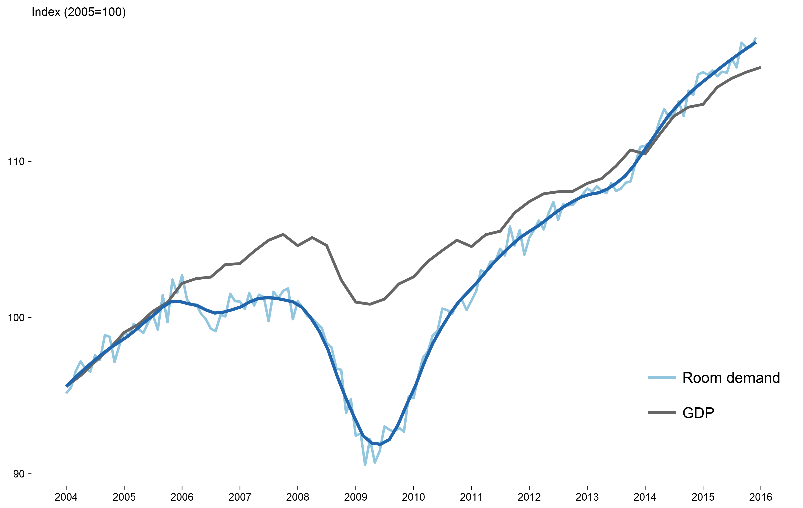
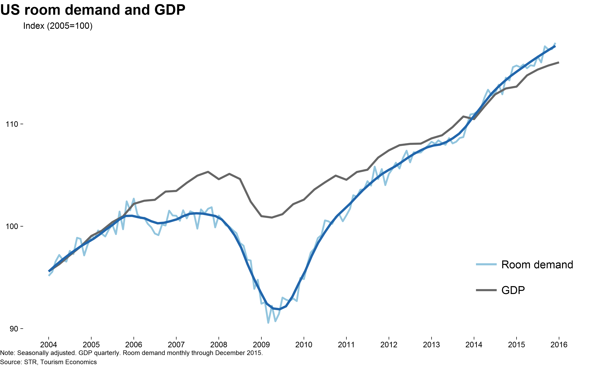
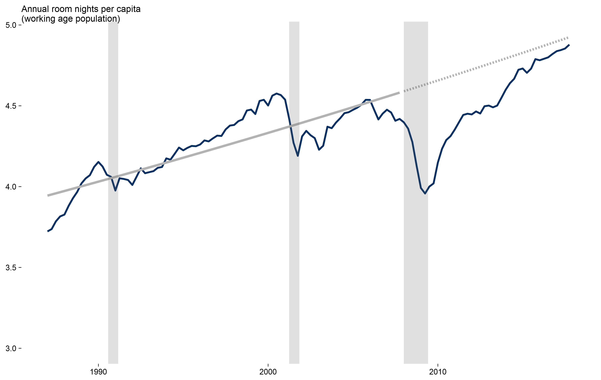
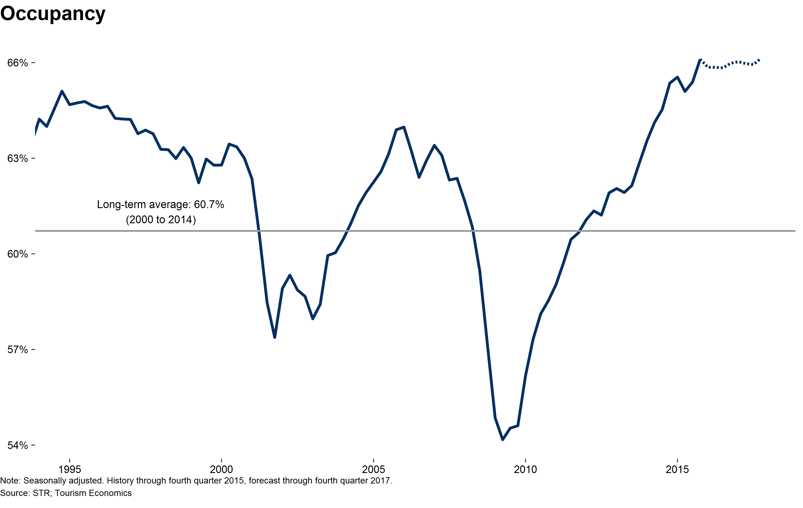
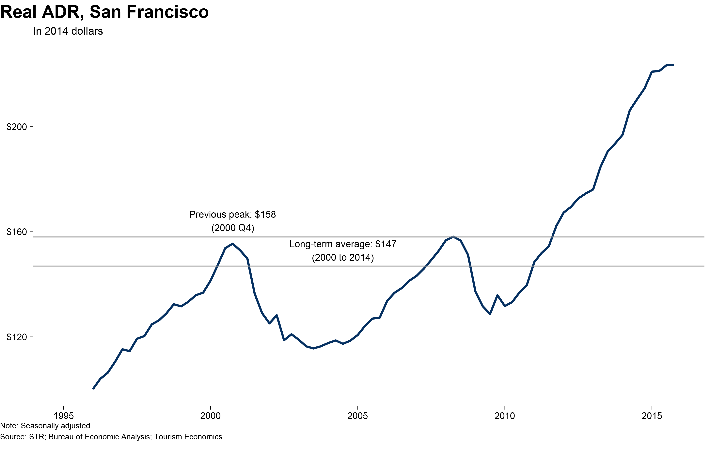
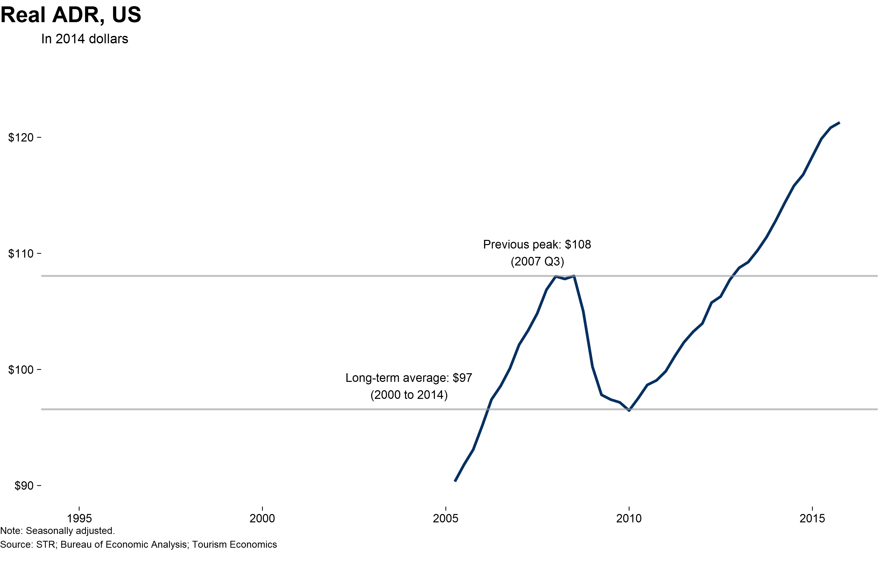
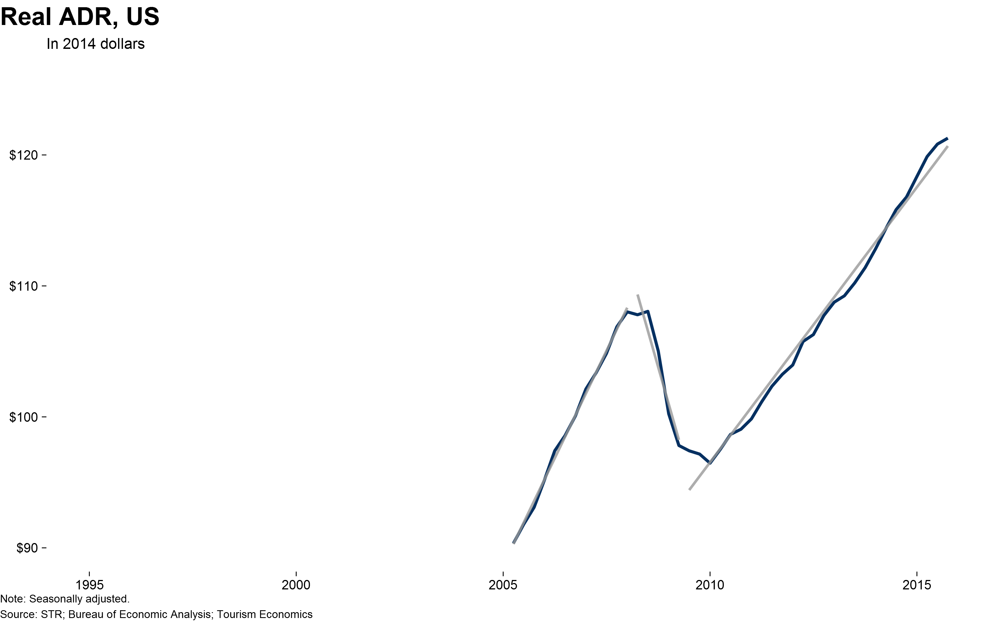
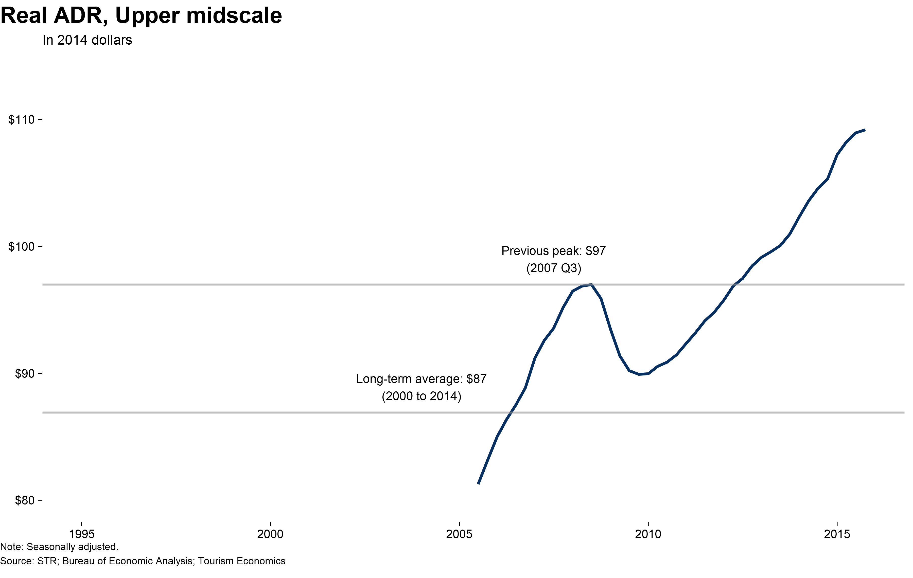

# US overview  slides
Tourism Economics  
Insert date  

## Contents

- Bullet 1
- Bullet 2
- Bullet 3


```
## An 'xts' object on 2005-01-01/2019-10-01 containing:
##   Data: num [1:60, 1:150] 6.95 6.99 7.04 7.03 7.21 ...
##  - attr(*, "dimnames")=List of 2
##   ..$ : NULL
##   ..$ : chr [1:150] "luxus_supt" "luxus_demt" "luxus_occ" "luxus_adr" ...
##   Indexed by objects of class: [Date] TZ: UTC
##   xts Attributes:  
##  NULL
```


## Demand, monthly + GDP 


## Demand and GDP with forecast 


## Demand, ratio to population 


## Demand, ratio to population forecast

```
##  (Intercept)         date 
## 3.427388e+00 8.277281e-05
```


## Demand, ratio to population log forecast

```
##  (Intercept)         date 
## 1.2493720907 0.0000197479
```




## Demand, ratio to employment 


## Occupancy labled


## Occupancy with forecast



##Following graphs are based on code from around the STR presentation in November

## ADR, real long-term


## ADR, real medium-term


## ADR, real short-term


## ADR, short-term


## ADR, short-term, monthly


## ADR, short-term with forecast


## ADR, growth, short-term 

```
## function () 
## {
##     stop("This function should not be called directly")
## }
## <environment: namespace:dplyr>
```


## ADR, growth cagr, short-term 


## RevPAR, real long-term


## RevPAR, real long-term, with forecast


## RevPAR, real long-term - by scale


## Unemployment


## Household net wealth


## Top 25 demand


## Top 25 supply


## San Francisco demand


## San Francisco supply


## San Francisco occupancy


## San Francisco and NY occupancy


## San Francisco adr


## ADR, real short-term



## ADR, real short-term


## ADR, real short-term



## ADR, real short-term

