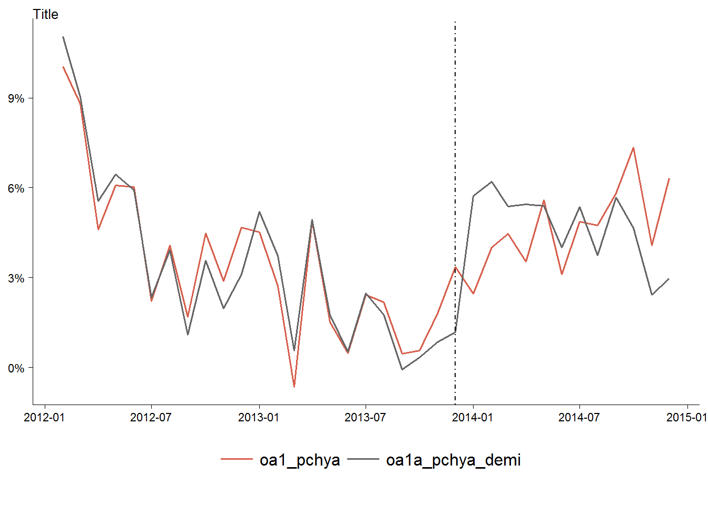
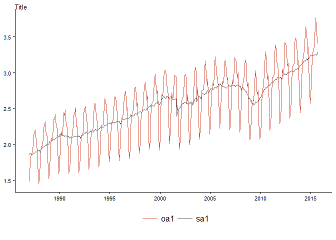
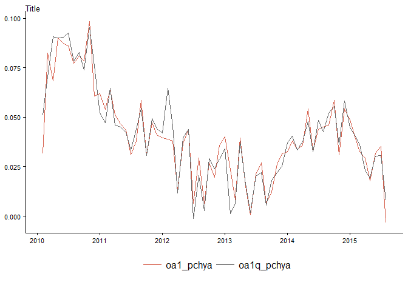

# Seasonal Adjustment: Short examples
Tourism Economics  
November 13, 2015  


```
##          totus_demd
## Jan 1987   1.481372
## Feb 1987   1.746240
## Mar 1987   1.874417
## Apr 1987   1.866064
## May 1987   1.902621
## Jun 1987   2.127977
```

```
## 
## Call:
## seas(x = temp_ser_ts, forecast.maxlead = 30, seats.appendfcst = "yes")
## 
## Coefficients:
##                     Estimate Std. Error z value Pr(>|z|)    
## Mon               -3.937e-03  1.367e-03  -2.880 0.003976 ** 
## Tue                2.260e-03  1.377e-03   1.641 0.100877    
## Wed               -8.937e-05  1.368e-03  -0.065 0.947919    
## Thu               -7.419e-04  1.363e-03  -0.544 0.586113    
## Fri                4.919e-03  1.363e-03   3.607 0.000309 ***
## Sat                3.550e-03  1.370e-03   2.590 0.009593 ** 
## Easter[1]         -8.529e-03  2.820e-03  -3.025 0.002489 ** 
## LS2001.Sep        -9.352e-02  1.236e-02  -7.564  3.9e-14 ***
## AR-Nonseasonal-01 -4.164e-01  4.940e-02  -8.429  < 2e-16 ***
## AR-Seasonal-12     2.170e-01  7.733e-02   2.806 0.005020 ** 
## MA-Seasonal-12     7.569e-01  5.203e-02  14.549  < 2e-16 ***
## ---
## Signif. codes:  0 '***' 0.001 '**' 0.01 '*' 0.05 '.' 0.1 ' ' 1
## 
## SEATS adj.  ARIMA: (1 1 0)(1 1 1)  Obs.: 345  Transform: log
## AICc: -1205, BIC: -1160  QS (no seasonality in final):    0  
## Box-Ljung (no autocorr.): 31.53   Shapiro (normality): 0.9893 *
```

```
## 
## Call:
## seas(x = temp_ser_ts, transform.function = "log", regression.aictest = NULL, 
##     outlier = NULL, regression.variables = c("td", "easter[1]", 
##         "ls2001.Sep"), arima.model = "(1 1 0)(1 1 1)")
## 
## Coefficients:
##                     Estimate Std. Error z value Pr(>|z|)    
## Mon               -3.937e-03  1.367e-03  -2.880 0.003976 ** 
## Tue                2.260e-03  1.377e-03   1.641 0.100890    
## Wed               -8.925e-05  1.368e-03  -0.065 0.947989    
## Thu               -7.419e-04  1.363e-03  -0.545 0.586094    
## Fri                4.919e-03  1.363e-03   3.608 0.000309 ***
## Sat                3.550e-03  1.370e-03   2.590 0.009592 ** 
## Easter[1]         -8.530e-03  2.820e-03  -3.025 0.002488 ** 
## LS2001.Sep        -9.352e-02  1.236e-02  -7.564  3.9e-14 ***
## AR-Nonseasonal-01 -4.164e-01  4.940e-02  -8.429  < 2e-16 ***
## AR-Seasonal-12     2.170e-01  7.733e-02   2.806 0.005021 ** 
## MA-Seasonal-12     7.569e-01  5.203e-02  14.549  < 2e-16 ***
## ---
## Signif. codes:  0 '***' 0.001 '**' 0.01 '*' 0.05 '.' 0.1 ' ' 1
## 
## SEATS adj.  ARIMA: (1 1 0)(1 1 1)  Obs.: 345  Transform: log
## AICc: -1205, BIC: -1160  QS (no seasonality in final):    0  
## Box-Ljung (no autocorr.): 31.53   Shapiro (normality): 0.9893 *
```


## Fundamental identities of seasonal adjustment
### Y = T \* I \* (S \* TD)

For example
series(m, "seats.trend") \* series(m, "seats.irregular") \* series(m, "seats.adjustfac")


Name   |   Small   | Description of table  
-------|----------|------------------------------
trend  |   s12    | final SEATS trend component  
seasonal |  s10    | final SEATS seasonal component  
irregular | s13   |  final SEATS irregular component  
seasonaladj | s11 | final SEATS seasonal adjustment component   
transitory | s14 | final SEATS transitory component   
adjustfac | s16 | final SEATS combined adjustment factors  
adjustmentratio | s18 | final SEATS adjustment ratio  
trendfcstdecomp | tfd | forecast of the trend component  
seasonalfcstdecomp |  sfd | forecast of the seasonal component  
seriesfcstdecomp | ofd | forecast of the series component  
seasonaladjfcstdecomp | afd | forecast of the final SEATS seasonal adjustment  
transitoryfcstdecomp | yfd | forecast of the transitory component  
seasadjconst |  sec | final SEATS seasonal adjustment with constant term included  
trendconst | stc | final SEATS trend component with constant term included  
totaladjustment | sta |total adjustment factors for SEATS seasonal adjustment  


## Simple series codes for use in examples

code | description
-----|----------------------
oa1 | original series  
sa1 | seasonally adjusted series  
sa1_trend | trend component (s12)
sa1_seasonal | seasonal component (s10)  
sa1_irregular | irregular component (s13)  
sa1_sf | final combined (seasonal/trading day/holiday) factors (s16)  
oa1_a | original = trend \* irregular \* combined (seasonal/trading day/holiday) adjustment factors
oa1_b | original = seasonally adjusted series \* combined (seasonal/trading day/holiday) adjustment factors

### Example calculations
In this table we have two ways to get back to the original series.   
- oa1_a = trend \* irregular \* combined (seasonal/trading day/holiday) adjustment factors or   
- oa1_b = seasonally adjusted series \* combined (seasonal/trading day/holiday) adjustment factors
  


date               y      oa1      sa1   sa1_trend   sa1_seasonal   sa1_irregular   sa1_sf    oa1_a    oa1_b
-----------  -------  -------  -------  ----------  -------------  --------------  -------  -------  -------
2014-09-01    3.2567   3.2567   3.1776      3.1916         1.0266          0.9956   1.0249   3.2567   3.2567
2014-10-01    3.3600   3.3600   3.2014      3.2013         1.0453          1.0000   1.0496   3.3600   3.3600
2014-11-01    2.8822   2.8822   3.2065      3.2134         0.9010          0.9979   0.8989   2.8822   2.8822
2014-12-01    2.5750   2.5750   3.2389      3.2252         0.7964          1.0043   0.7950   2.5750   2.5750
2015-01-01    2.6575   2.6575   3.2362      3.2332         0.8149          1.0009   0.8212   2.6575   2.6575
2015-02-01    3.0471   3.0471   3.2404      3.2376         0.9488          1.0009   0.9404   3.0471   3.0471
2015-03-01    3.2816   3.2816   3.2373      3.2408         1.0191          0.9989   1.0137   3.2816   3.2816
2015-04-01    3.3033   3.3033   3.2453      3.2441         1.0210          1.0004   1.0179   3.3033   3.3033
2015-05-01    3.3634   3.3634   3.2458      3.2477         1.0336          0.9994   1.0362   3.3634   3.3634
2015-06-01    3.6505   3.6505   3.2505      3.2518         1.1249          0.9996   1.1230   3.6505   3.6505
2015-07-01    3.7678   3.7678   3.2598      3.2563         1.1511          1.0011   1.1558   3.7678   3.7678
2015-08-01    3.5386   3.5386   3.2444      3.2627         1.0976          0.9944   1.0907   3.5386   3.5386

## So which are the seasonal factors?

It's sometimes hard to get a clear understanding from the documentation.  
I've seen reference to the "combined" factors in the D16 (and presumably also s16) table as being the __combined__ (seasonal/trading day/holiday) factors. 

There is also reference to a "total adjustment factors for SEATS seasonal adjustment".


date        original      oa1      sa1   sa1_trend   sa1_seasonal   sa1_irregular   sa1_sf   sa1_total
---------  ---------  -------  -------  ----------  -------------  --------------  -------  ----------
Sep 2014      3.2567   3.2567   3.1776      3.1916         1.0266          0.9956   1.0249      1.0249
Oct 2014      3.3600   3.3600   3.2014      3.2013         1.0453          1.0000   1.0496      1.0496
Nov 2014      2.8822   2.8822   3.2065      3.2134         0.9010          0.9979   0.8989      0.8989
Dec 2014      2.5750   2.5750   3.2389      3.2252         0.7964          1.0043   0.7950      0.7950
Jan 2015      2.6575   2.6575   3.2362      3.2332         0.8149          1.0009   0.8212      0.8212
Feb 2015      3.0471   3.0471   3.2404      3.2376         0.9488          1.0009   0.9404      0.9404
Mar 2015      3.2816   3.2816   3.2373      3.2408         1.0191          0.9989   1.0137      1.0137
Apr 2015      3.3033   3.3033   3.2453      3.2441         1.0210          1.0004   1.0179      1.0179
May 2015      3.3634   3.3634   3.2458      3.2477         1.0336          0.9994   1.0362      1.0362
Jun 2015      3.6505   3.6505   3.2505      3.2518         1.1249          0.9996   1.1230      1.1230
Jul 2015      3.7678   3.7678   3.2598      3.2563         1.1511          1.0011   1.1558      1.1558
Aug 2015      3.5386   3.5386   3.2444      3.2627         1.0976          0.9944   1.0907      1.0907


### graph title

\


## Converting quarterly to monthly using seasonal factors


### Monthly series and seasonal factors


date           oa1      sa1   sa1_sf
---------  -------  -------  -------
Oct 2014    3.3600   3.2014   1.0496
Nov 2014    2.8822   3.2065   0.8989
Dec 2014    2.5750   3.2389   0.7950
Jan 2015    2.6575   3.2362   0.8212
Feb 2015    3.0471   3.2404   0.9404
Mar 2015    3.2816   3.2373   1.0137
Apr 2015    3.3033   3.2453   1.0179
May 2015    3.3634   3.2458   1.0362
Jun 2015    3.6505   3.2505   1.1230
Jul 2015    3.7678   3.2598   1.1558
Aug 2015    3.5386   3.2444   1.0907
Sep 2015    3.4035   3.2847   1.0362

\

### Quarterly series and seasonal factors


date           oa1      sa1   sa1_sf
---------  -------  -------  -------
Oct 2012    2.7430   3.0051   0.9128
Jan 2013    2.7824   3.0141   0.9231
Apr 2013    3.2186   3.0280   1.0630
Jul 2013    3.3351   3.0363   1.0984
Oct 2013    2.8044   3.0708   0.9132
Jan 2014    2.8790   3.1149   0.9243
Apr 2014    3.3501   3.1524   1.0627
Jul 2014    3.4848   3.1757   1.0973
Oct 2014    2.9397   3.2169   0.9138
Jan 2015    2.9937   3.2364   0.9250
Apr 2015    3.4382   3.2369   1.0622
Jul 2015    3.5718   3.2568   1.0967

\

### Use quarterly to estimate monthly

Use the seasonally adjusted quarterly data, and the monthly seasonal factors, to estimate monthly un-adjusted series.


date          oa1     sa1   sa1_sf    sa1q    oa1q   oa1_pchya   oa1q_pchya
---------  ------  ------  -------  ------  ------  ----------  -----------
Sep 2014    3.257   3.178    1.025   3.176   3.255       4.58%        5.22%
Oct 2014    3.360   3.201    1.050   3.217   3.376       5.84%        5.55%
Nov 2014    2.882   3.207    0.899   3.217   2.892       3.10%        3.61%
Dec 2014    2.575   3.239    0.795   3.217   2.557       5.42%        5.82%
Jan 2015    2.658   3.236    0.821   3.236   2.658       4.87%        4.47%
Feb 2015    3.047   3.240    0.940   3.236   3.043       4.02%        4.08%
Mar 2015    3.282   3.237    1.014   3.236   3.281       3.25%        3.62%
Apr 2015    3.303   3.245    1.018   3.237   3.295       2.93%        2.30%
May 2015    3.363   3.246    1.036   3.237   3.354       1.78%        1.92%
Jun 2015    3.650   3.251    1.123   3.237   3.635       3.18%        3.02%
Jul 2015    3.768   3.260    1.156   3.257   3.764       3.51%        3.07%
Aug 2015    3.539   3.244    1.091   3.257   3.552      -0.33%        0.79%

\\


```
## 
## Call:
## lm(formula = oa1 ~ oa1q, data = tempm1)
## 
## Residuals:
##       Min        1Q    Median        3Q       Max 
## -0.124636 -0.007817  0.000185  0.009149  0.139771 
## 
## Coefficients:
##              Estimate Std. Error t value Pr(>|t|)    
## (Intercept) -0.005517   0.005820  -0.948    0.344    
## oa1q         1.002293   0.002253 444.789   <2e-16 ***
## ---
## Signif. codes:  0 '***' 0.001 '**' 0.01 '*' 0.05 '.' 0.1 ' ' 1
## 
## Residual standard error: 0.01936 on 343 degrees of freedom
##   (88 observations deleted due to missingness)
## Multiple R-squared:  0.9983,	Adjusted R-squared:  0.9983 
## F-statistic: 1.978e+05 on 1 and 343 DF,  p-value: < 2.2e-16
```

```
## 
## Call:
## lm(formula = oa1_pchya ~ oa1q_pchya, data = tempm1)
## 
## Residuals:
##       Min        1Q    Median        3Q       Max 
## -0.058832 -0.004934  0.000115  0.005187  0.051755 
## 
## Coefficients:
##              Estimate Std. Error t value Pr(>|t|)    
## (Intercept) 0.0017652  0.0006996   2.523   0.0121 *  
## oa1q_pchya  0.9124910  0.0176608  51.667   <2e-16 ***
## ---
## Signif. codes:  0 '***' 0.001 '**' 0.01 '*' 0.05 '.' 0.1 ' ' 1
## 
## Residual standard error: 0.01096 on 331 degrees of freedom
##   (100 observations deleted due to missingness)
## Multiple R-squared:  0.8897,	Adjusted R-squared:  0.8894 
## F-statistic:  2670 on 1 and 331 DF,  p-value: < 2.2e-16
```

