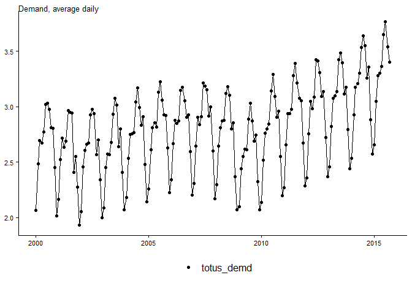
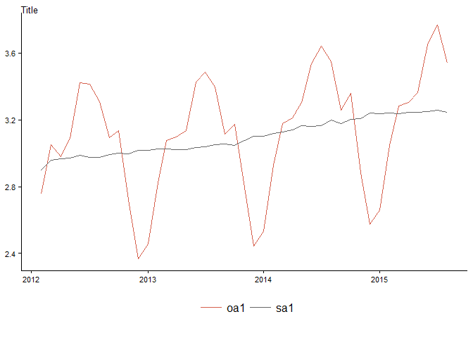
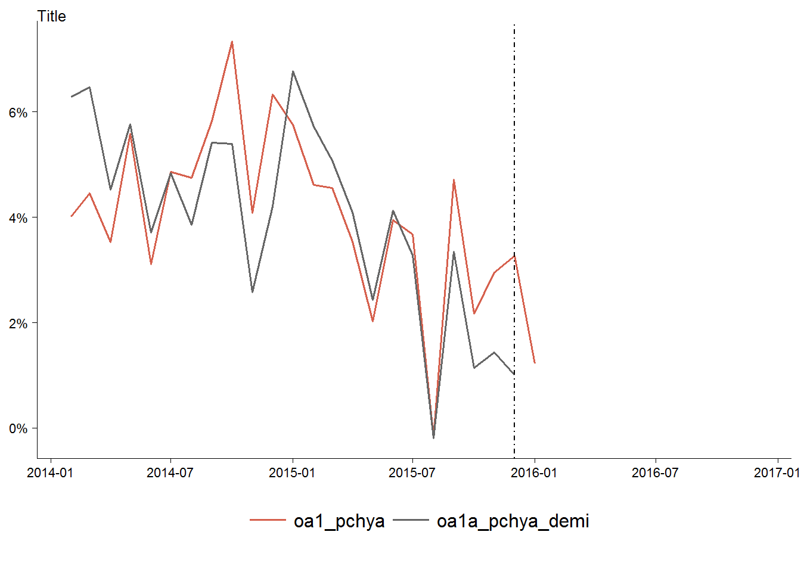

# Seasonal adjustment Intro: UPM
Tourism Economics  
January 9, 2016  

### Average daily demand, monthly observations (2000 to 2015)
 

### Average daily demand, monthly observations (2012 to 2015)
 

### Percentage change from prior year, daily demand by month (2012 to 2015)
Last observation is September. 
The timing of Labor Day negatively impacted September 2014 and then positively impacted September 2015 (Labor Day was Sep. 7, 2015, compared to Sep. 1, 2014).
 

### Average daily demand by month (2012 to 2015)
 

### Average daily demand by month (2000 to 2015)
 

## Prepare a seasonally adjusted series  

### Original and seasonally adjusted series (1987 to 2015)
 

### Original and seasonally adjusted series (2012 to 2015)
 

### Seasonally adjusted series (2012 to 2015)
 

### Percentage change from prior year (2007 to 2015)
 

### Seasonally adjusted
 

### Seasonally adjusted, with smoothed series
 

