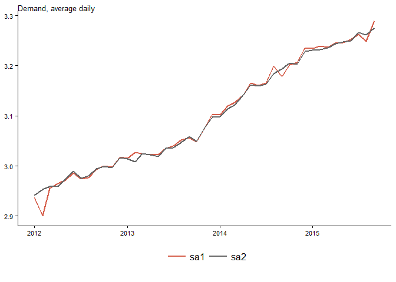

# Seasonal adjustment comparison
Tourism Economics  
January 9, 2016  


### Set up data to run using: totus_demd

  
use default setting


use default settings m2


## Set up Veteran's Day weekend
vet_wkend is "1" if Veteran's Day falls on a weekend

date         wday     satsun  month       day   vet   vet_wkend
-----------  ------  -------  ---------  ----  ----  ----------
2018-11-11   Sun           1  November     11     1           1
2019-11-11   Mon           0  November     11     1           0
2020-11-11   Wed           0  November     11     1           0
2021-11-11   Thurs         0  November     11     1           0
2022-11-11   Fri           0  November     11     1           0
2023-11-11   Sat           1  November     11     1           1
2024-11-11   Mon           0  November     11     1           0
2025-11-11   Tues          0  November     11     1           0
2026-11-11   Wed           0  November     11     1           0
2027-11-11   Thurs         0  November     11     1           0
2028-11-11   Sat           1  November     11     1           1
2029-11-11   Sun           1  November     11     1           1


## Set up Christmas weekend
chr_wkend is "1" if Christmas Day falls on a weekend

date         wday     satsun  month       day   chr   chr_wkend
-----------  ------  -------  ---------  ----  ----  ----------
2018-12-25   Tues          0  December     25     1           0
2019-12-25   Wed           0  December     25     1           0
2020-12-25   Fri           0  December     25     1           0
2021-12-25   Sat           1  December     25     1           1
2022-12-25   Sun           1  December     25     1           1
2023-12-25   Mon           0  December     25     1           0
2024-12-25   Wed           0  December     25     1           0
2025-12-25   Thurs         0  December     25     1           0
2026-12-25   Fri           0  December     25     1           0
2027-12-25   Sat           1  December     25     1           1
2028-12-25   Mon           0  December     25     1           0
2029-12-25   Tues          0  December     25     1           0


## Set up July 4th weekend
jlf_wkend is "1" if Independence Day falls on a weekend

date         wday     satsun  month    day   jlf   jlf_wkend
-----------  ------  -------  ------  ----  ----  ----------
2018-07-04   Wed           0  July       4     1           0
2019-07-04   Thurs         0  July       4     1           0
2020-07-04   Sat           1  July       4     1           1
2021-07-04   Sun           1  July       4     1           1
2022-07-04   Mon           0  July       4     1           0
2023-07-04   Tues          0  July       4     1           0
2024-07-04   Thurs         0  July       4     1           0
2025-07-04   Fri           0  July       4     1           0
2026-07-04   Sat           1  July       4     1           1
2027-07-04   Sun           1  July       4     1           1
2028-07-04   Tues          0  July       4     1           0
2029-07-04   Wed           0  July       4     1           0


## Set up three models
m1: defaults  
  
m2: built-in regressors:  
  - "tdnolpyear" (trading days without assuming leap year)   
  - "easter[1]" (Easter, start the effect one day before)  
  - "labor[3]" (Labor Day, start the effect three days before)  
  
m3: same built-in regressors, plus: 
- thank[3]: built-in regressor, number of days in period starting three days before Thanksgiving  
- ls2001.Sep: Assume Sep 11, 2001 is an outlier  
- xreg1: (vet1) Veteran's Day on a weekend  
- xreg2: (chr1) Christmas Day on a weekend  
- xreg3: (jlf1) Independence Day on a weekend  
  

### Original and adjusted series from the models

date             oa1      oa2      oa3   sa1_sf   sa2_sf   sa3_sf      sa1      sa2      sa3
-----------  -------  -------  -------  -------  -------  -------  -------  -------  -------
2014-10-01    3.3600   3.3600   3.3600   1.0496   1.0484   1.0469   3.2013   3.2048   3.2096
2014-11-01    2.8822   2.8822   2.8822   0.8990   0.8999   0.8998   3.2060   3.2030   3.2032
2014-12-01    2.5750   2.5750   2.5750   0.7958   0.7976   0.7973   3.2358   3.2282   3.2298
2015-01-01    2.6575   2.6575   2.6575   0.8215   0.8225   0.8219   3.2349   3.2312   3.2332
2015-02-01    3.0471   3.0471   3.0471   0.9406   0.9427   0.9412   3.2395   3.2322   3.2374
2015-03-01    3.2816   3.2816   3.2816   1.0138   1.0144   1.0148   3.2368   3.2351   3.2337
2015-04-01    3.3033   3.3033   3.3033   1.0178   1.0183   1.0190   3.2455   3.2440   3.2416
2015-05-01    3.3634   3.3634   3.3634   1.0359   1.0359   1.0378   3.2468   3.2469   3.2410
2015-06-01    3.6505   3.6505   3.6505   1.1224   1.1234   1.1267   3.2524   3.2495   3.2399
2015-07-01    3.7678   3.7678   3.7678   1.1548   1.1537   1.1591   3.2629   3.2660   3.2505
2015-08-01    3.5386   3.5386   3.5386   1.0894   1.0848   1.0873   3.2482   3.2619   3.2543
2015-09-01    3.4035   3.4035   3.4035   1.0346   1.0392   1.0410   3.2895   3.2752   3.2695


### m1
Default

```
## 
## Call:
## seas(x = temp_ser_ts, forecast.maxlead = 30, seats.appendfcst = "yes")
## 
## Coefficients:
##                     Estimate Std. Error z value Pr(>|z|)    
## Mon               -0.0039758  0.0013471  -2.951 0.003164 ** 
## Tue                0.0022892  0.0013615   1.681 0.092682 .  
## Wed               -0.0001088  0.0013524  -0.080 0.935903    
## Thu               -0.0007087  0.0013501  -0.525 0.599649    
## Fri                0.0049018  0.0013542   3.620 0.000295 ***
## Sat                0.0035500  0.0013552   2.619 0.008806 ** 
## Easter[1]         -0.0085262  0.0028046  -3.040 0.002365 ** 
## LS2001.Sep        -0.0935208  0.0123045  -7.601 2.95e-14 ***
## AR-Nonseasonal-01 -0.4158917  0.0489506  -8.496  < 2e-16 ***
## AR-Seasonal-12     0.2172446  0.0772313   2.813 0.004910 ** 
## MA-Seasonal-12     0.7553832  0.0519255  14.547  < 2e-16 ***
## ---
## Signif. codes:  0 '***' 0.001 '**' 0.01 '*' 0.05 '.' 0.1 ' ' 1
## 
## SEATS adj.  ARIMA: (1 1 0)(1 1 1)  Obs.: 348  Transform: log
## AICc: -1218, BIC: -1173  QS (no seasonality in final):    0  
## Box-Ljung (no autocorr.):  31.7   Shapiro (normality): 0.9886 **
```


### m2
Built-in regressors

```
## 
## Call:
## seas(x = temp_ser_ts, regression.variables = c("tdnolpyear", 
##     "easter[1]", "labor[3]", "ls2001.Sep"), forecast.maxlead = 30, 
##     seats.appendfcst = "yes")
## 
## Coefficients:
##                     Estimate Std. Error z value Pr(>|z|)    
## Labor[3]           0.0182356  0.0028649   6.365 1.95e-10 ***
## LS2001.Sep        -0.0940843  0.0096369  -9.763  < 2e-16 ***
## Mon               -0.0018783  0.0010036  -1.872 0.061258 .  
## Tue                0.0014194  0.0009877   1.437 0.150719    
## Wed                0.0003434  0.0009857   0.348 0.727533    
## Thu               -0.0004674  0.0009787  -0.478 0.632953    
## Fri                0.0039990  0.0009890   4.044 5.26e-05 ***
## Sat                0.0032201  0.0009784   3.291 0.000998 ***
## Easter[1]         -0.0084722  0.0020219  -4.190 2.79e-05 ***
## AO1999.Dec        -0.0338318  0.0081909  -4.130 3.62e-05 ***
## LS2001.Nov         0.0423201  0.0096305   4.394 1.11e-05 ***
## AR-Nonseasonal-01 -0.3298038  0.0511819  -6.444 1.17e-10 ***
## AR-Seasonal-12     0.3178849  0.0859456   3.699 0.000217 ***
## MA-Seasonal-12     0.7346445  0.0615628  11.933  < 2e-16 ***
## ---
## Signif. codes:  0 '***' 0.001 '**' 0.01 '*' 0.05 '.' 0.1 ' ' 1
## 
## SEATS adj.  ARIMA: (1 1 0)(1 1 1)  Obs.: 348  Transform: log
## AICc: -1368, BIC: -1312  QS (no seasonality in final):    0  
## Box-Ljung (no autocorr.): 24.34   Shapiro (normality): 0.9933
```


### m3
Same built-in regressors as m2, plus additional terms

```
## 
## Call:
## seas(x = temp_ser_ts, xreg = cbind(vet1, chr1, jlf1), regression.aictest = NULL, 
##     regression.variables = c("tdnolpyear", "labor[3]", "easter[1]", 
##         "ls2001.Sep", "thank[3]"), forecast.maxlead = 30, seats.appendfcst = "yes", 
##     regression.usertype = c("holiday", "holiday2", "holiday3"))
## 
## Coefficients:
##                     Estimate Std. Error z value Pr(>|z|)    
## Mon               -0.0019975  0.0010177  -1.963 0.049679 *  
## Tue                0.0011735  0.0010623   1.105 0.269335    
## Wed                0.0003536  0.0009984   0.354 0.723232    
## Thu               -0.0007981  0.0010489  -0.761 0.446739    
## Fri                0.0032636  0.0010255   3.183 0.001460 ** 
## Sat                0.0051055  0.0010410   4.905 9.37e-07 ***
## Labor[3]           0.0186515  0.0026480   7.044 1.87e-12 ***
## Easter[1]         -0.0087283  0.0020407  -4.277 1.89e-05 ***
## LS2001.Sep        -0.0974228  0.0094692 -10.288  < 2e-16 ***
## Thanksgiving[3]    0.0823068  0.0295935   2.781 0.005415 ** 
## xreg1             -0.0003169  0.0046306  -0.068 0.945438    
## xreg2             -0.0127670  0.0034988  -3.649 0.000263 ***
## xreg3              0.0078810  0.0033498   2.353 0.018638 *  
## LS2001.Nov         0.0401081  0.0095796   4.187 2.83e-05 ***
## LS2008.Nov        -0.0389314  0.0095044  -4.096 4.20e-05 ***
## AR-Nonseasonal-01 -0.3362206  0.0511695  -6.571 5.01e-11 ***
## MA-Seasonal-12     0.4973157  0.0476940  10.427  < 2e-16 ***
## ---
## Signif. codes:  0 '***' 0.001 '**' 0.01 '*' 0.05 '.' 0.1 ' ' 1
## 
## SEATS adj.  ARIMA: (1 1 0)(0 1 1)  Obs.: 348  Transform: log
## AICc: -1382, BIC: -1315  QS (no seasonality in final):    0  
## Box-Ljung (no autocorr.): 16.04   Shapiro (normality): 0.993
```


### Compare seasonally adjusted series from m1 and m2
Note estimate for Sep. 2015. m1 model tends to indicate Sep. was a "strong" month.  
While m2 model indicates some of that strength was holiday timing. After adjusting, underlying performance was not as strong. Said differently, we would have a high seasonal factor for Sep. 2015. We would divide the unadjusted data by that seasonal factor to get the seasonally adjusted data, which wouldn't be as strong.  
\


### Compare seasonally adjusted series from m1 and m3
Again, similar to m2, m3 indicates Sep. 2015 was not as strong as m1 results would indicate.
\


### Compare seasonally adjusted series from m2 and m3
Both m2 and m3 are similar for Sep. 2015. Interestingly, m3 generally points to performance during the summer as being somewhat weaker than m2.  

\


### Seasonal factors for a particular month: Sep. Labor Day timing

Year   |   Labor Day date    
-------|----------
2011 | 5  
2012 | 3  
2013 |  2  
2014 |  1  
2015 | 7  
2016 |5  


### Seasonal factors for September  
  

date          sa1_sf   sa2_sf   sa3_sf
-----------  -------  -------  -------
2005-09-01    1.0404   1.0413   1.0369
2006-09-01    1.0390   1.0404   1.0436
2007-09-01    1.0315   1.0313   1.0290
2008-09-01    1.0355   1.0301   1.0190
2009-09-01    1.0364   1.0405   1.0405
2010-09-01    1.0377   1.0403   1.0400
2011-09-01    1.0484   1.0500   1.0449
2012-09-01    1.0341   1.0336   1.0335
2013-09-01    1.0187   1.0181   1.0188
2014-09-01    1.0248   1.0198   1.0202
2015-09-01    1.0346   1.0392   1.0410
2016-09-01    1.0375   1.0418   1.0418


### Seasonal factors for September (1987 to 2016)
Last point is Sep 2016. So both Sep. 2015 and Sep. 2016 have large seasonal factors. 
\

