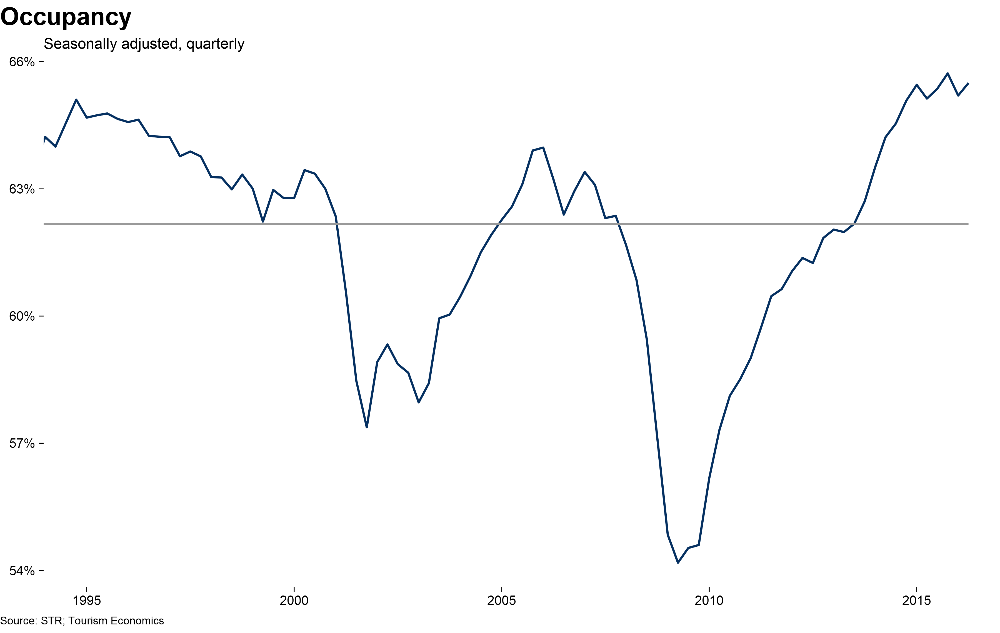

# US overview  slides
Tourism Economics  
Insert date  

## Contents

- Bullet 1
- Bullet 2
- Bullet 3


```
## Error in readChar(con, 5L, useBytes = TRUE): cannot open the connection
```


```
## Error in eval(expr, envir, enclos): object 'top25compile' not found
```


```
## An 'xts' object on 2005-01-01/2019-10-01 containing:
##   Data: num [1:60, 1:151] 6.92 6.95 7 6.99 7.17 ...
##  - attr(*, "dimnames")=List of 2
##   ..$ : NULL
##   ..$ : chr [1:151] "luxus_supt" "luxus_demt" "luxus_occ" "luxus_adr" ...
##   Indexed by objects of class: [Date] TZ: UTC
##   xts Attributes:  
##  NULL
```

```
## Error in hasTsp(x): attempt to set an attribute on NULL
```

```
## Error in fix.by(by.y, y): 'by' must specify a uniquely valid column
```

```
## Error in hasTsp(x): attempt to set an attribute on NULL
```

```
## Error in names(us_pc_index) <- "us_pc_index": attempt to set an attribute on NULL
```

```
## Error in eval(expr, envir, enclos): wrong result size (0), expected 160 or 1
```

```
## Error in cbind(temp, real_df): object 'real_df' not found
```

```
## Error in read.zoo(real_df): object 'real_df' not found
```

```
## Error in xts(real): object 'real' not found
```

```
## Error in eval(expr, envir, enclos): object 'real' not found
```

```
## Error in paste(tempnames, "rpc", sep = ""): object 'tempnames' not found
```

```
## Error in eval(expr, envir, enclos): object 'tempnames' not found
```

```
## Error in merge.xts(usfor_q, real): object 'real' not found
```


## Demand, monthly + GDP 

```
## [1] "totus_oprms"
```


## Demand and GDP with forecast 


## Demand, ratio to population 

```
## Error in eval(expr, envir, enclos): object 'us_popw' not found
```


## Demand, ratio to employment 

```
## Error in eval(expr, envir, enclos): object 'us_et' not found
```


## Occupancy labled


## Occupancy with forecast


##Following graphs are based on code from around the STR presentation in November

## ADR, real long-term

```
## Error in eval(expr, envir, enclos): object 'value' not found
```


## ADR, real medium-term

```
## Error in eval(expr, envir, enclos): object 'value' not found
```

## ADR, real short-term

```
## Error in eval(expr, envir, enclos): object 'value' not found
```

## ADR, short-term


## ADR, short-term, monthly


## ADR, short-term with forecast


## ADR, growth, short-term 

```
## [1] "totus_oprms"
```


## ADR, growth cagr, short-term 


## RevPAR, real long-term

```
## Error in eval(expr, envir, enclos): object 'value' not found
```


## RevPAR, real long-term, with forecast

```
## Error: ggplot2 doesn't know how to deal with data of class Date
```

```
## Error in eval(expr, envir, enclos): object 'value' not found
```


## RevPAR, real long-term - by scale

```
## Error in xts(coredata(x), order.by = order.by, frequency = frequency, : order.by requires an appropriate time-based object
```

```
## Error in levels(temp$seg)[levels(temp$seg) == todo[1]] <- todo[2]: attempt to set an attribute on NULL
```

```
## Error in levels(temp$seg)[levels(temp$seg) == todo2[1]] <- todo2[2]: attempt to set an attribute on NULL
```

```
## Error in `colnames<-`(`*tmp*`, value = c("date", "seg", "value")): 'names' attribute [3] must be the same length as the vector [1]
```

```
## Error in eval(expr, envir, enclos): object 'value' not found
```


## Unemployment

```
## Error in eval(expr, envir, enclos): object 'value' not found
```

```
## Error: ggplot2 doesn't know how to deal with data of class Date
```

```
## Error in eval(expr, envir, enclos): object 'value' not found
```

## Household net wealth

```
## Error in eval(expr, envir, enclos): object 'value' not found
```

```
## Error in eval(expr, envir, enclos): object 'value' not found
```


## Top 25 demand

```
## Error in eval(expr, envir, enclos): object 'top25compile' not found
```


## Top 25 supply

```
## Error in eval(expr, envir, enclos): object 'top25compile' not found
```


## San Francisco demand

```
## Error in eval(expr, envir, enclos): object 'top25compile_td' not found
```

```
## Error in rbind(deparse.level, ...): numbers of columns of arguments do not match
```

```
## Error in levels(temp$seg)[levels(temp$seg) == "topcoastwonydc"] <- "Selected coastal\nmarkets w/o NY\nand DC": attempt to set an attribute on NULL
```

```
## Error in levels(temp$seg)[levels(temp$seg) == "sanfrancisco"] <- "San Francisco": attempt to set an attribute on NULL
```


## San Francisco supply

```
## Error in eval(expr, envir, enclos): object 'top25compile_td' not found
```

```
## Error in rbind(deparse.level, ...): numbers of columns of arguments do not match
```


## San Francisco occupancy

```
## Error in eval(expr, envir, enclos): object 'top25compile_td' not found
```

```
## Error in rbind(deparse.level, ...): numbers of columns of arguments do not match
```


## San Francisco and NY occupancy


## San Francisco adr

```
## Error in eval(expr, envir, enclos): object 'top25compile_td' not found
```

```
## Error in eval(expr, envir, enclos): object 'adr_sarpc' not found
```

```
## Error: Duplicate identifiers for rows (2, 345), (4, 346), (6, 347), (8, 348), (10, 349), (12, 350), (14, 351), (16, 352), (18, 353), (20, 354), (22, 355), (24, 356), (26, 357), (28, 358), (30, 359), (32, 360), (34, 361), (36, 362), (38, 363), (40, 364), (42, 365), (44, 366), (46, 367), (48, 368), (50, 369), (52, 370), (54, 371), (56, 372), (58, 373), (60, 374), (62, 375), (64, 376), (66, 377), (68, 378), (70, 379), (72, 380), (74, 381), (76, 382), (78, 383), (80, 384), (82, 385), (84, 386), (86, 387), (88, 388), (90, 389), (92, 390), (94, 391), (96, 392), (98, 393), (100, 394), (102, 395), (104, 396), (106, 397), (108, 398), (110, 399), (112, 400), (114, 401), (116, 402), (118, 403), (120, 404), (122, 405), (124, 406), (126, 407), (128, 408), (130, 409), (132, 410), (134, 411), (136, 412), (138, 413), (140, 414), (142, 415), (144, 416), (146, 417), (148, 418), (150, 419), (152, 420), (154, 421), (156, 422), (158, 423), (160, 424), (162, 425), (164, 426), (166, 427), (168, 428), (170, 429), (172, 430), (174, 431), (176, 432), (178, 433), (180, 434), (182, 435), (184, 436), (186, 437), (188, 438), (190, 439), (192, 440), (194, 441), (196, 442), (198, 443), (200, 444), (202, 445), (204, 446), (206, 447), (208, 448), (210, 449), (212, 450), (214, 451), (216, 452), (218, 453), (220, 454), (222, 455), (224, 456), (226, 457), (228, 458), (230, 459), (232, 460), (234, 461), (236, 462), (238, 463), (240, 464), (242, 465), (244, 466), (246, 467), (248, 468), (250, 469), (252, 470), (254, 471), (256, 472), (258, 473), (260, 474), (262, 475), (264, 476), (266, 477), (268, 478), (270, 479), (272, 480), (274, 481), (276, 482), (278, 483), (280, 484), (282, 485), (284, 486), (286, 487), (288, 488), (290, 489), (292, 490), (294, 491), (296, 492), (298, 493), (300, 494), (302, 495), (304, 496), (306, 497), (308, 498), (310, 499), (312, 500), (314, 501), (316, 502), (318, 503), (320, 504), (322, 505), (324, 506), (326, 507), (328, 508), (330, 509), (332, 510), (334, 511), (336, 512), (338, 513), (340, 514), (342, 515), (344, 516)
```


## ADR, real short-term

```
## Error in eval(expr, envir, enclos): object 'value' not found
```

```
## Error in eval(expr, envir, enclos): object 'value' not found
```


## ADR, real short-term

```
## Error in eval(expr, envir, enclos): object 'value' not found
```

```
## Error in eval(expr, envir, enclos): object 'value' not found
```
